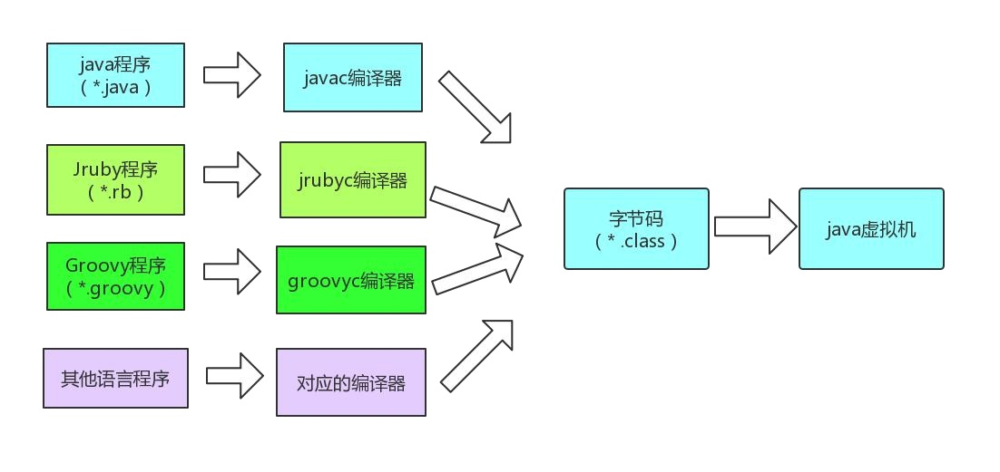
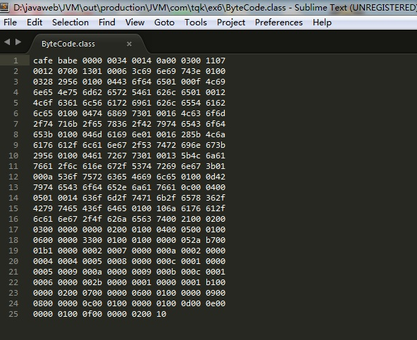
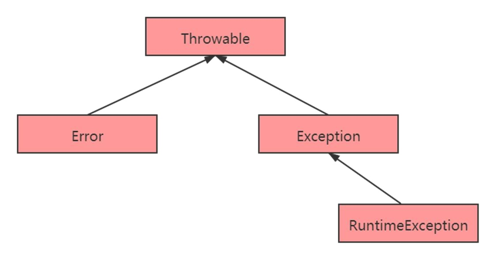
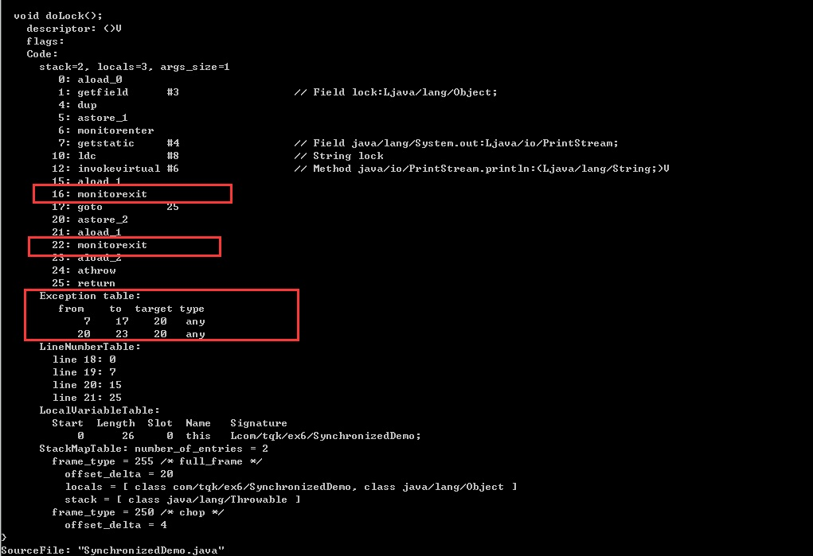
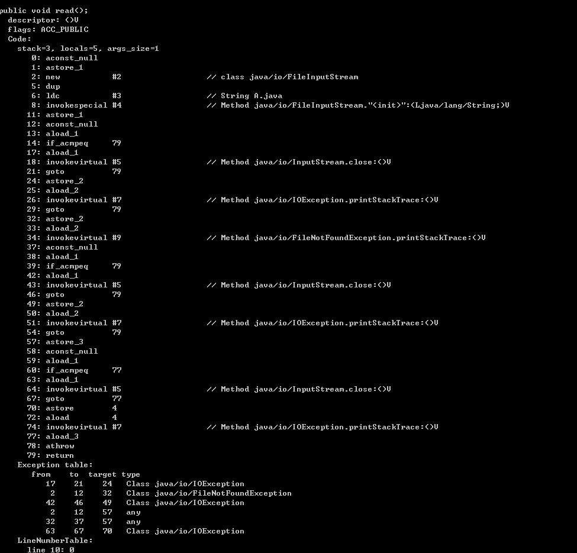
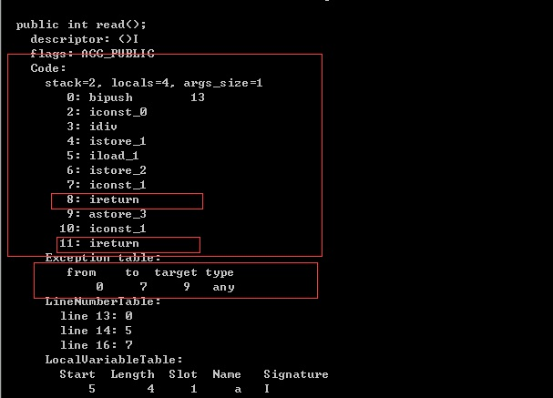
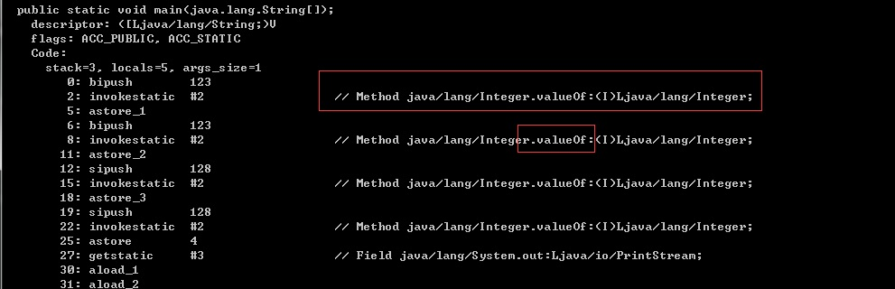
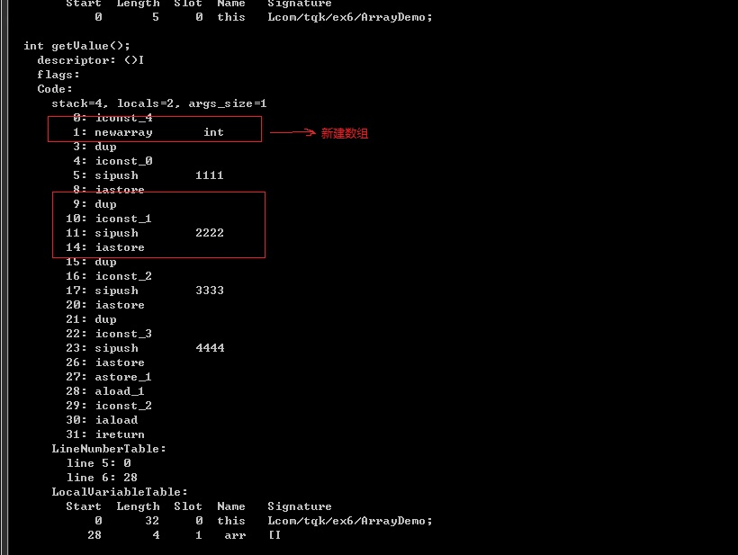
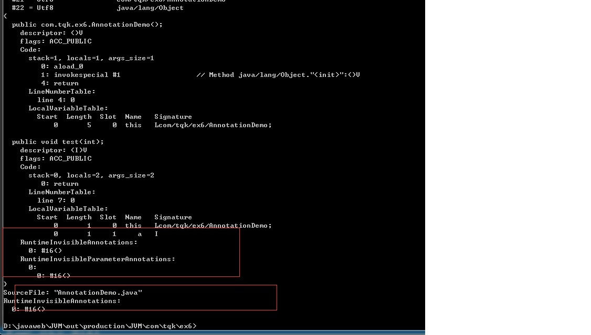

#  6. Class文件结构及字节码指令

## 6.1 JVM 的无关性
与平台无关性是建立在操作系统上，虚拟机厂商提供了许多可以运行在各种不同平台的虚拟机，它们都可以载入和执行字节码，从而实现程序的“一次编写，到处运行” 
<a href="https://www.oracle.com/technetwork/java/javase/downloads/jdk8-downloads-2133151.html">https://www.oracle.com/technetwork/java/javase/downloads/jdk8-downloads-2133151.html</a>  
各种不同平台的虚拟机与所有平台都统一使用的程序存储格式——字节码（ByteCode）是构成平台无关性的基石，也是语言无关性的基础。Java 虚拟机不包括Java在内的任何语言绑定，它只与“Class 文件”这种特定的二进制文件格式所关联，Class 文件中包含了 Java 虚拟机指令集和符号表以及若干其他辅助信息。

## 6.2 Class 类文件（了解即可）

Java 技术能够一直保持非常好的向后兼容性，这点 Class 文件结构的稳定性功不可没。  
Java 已经发展到 14 版本，但是 class 文件结构的内容，绝大部分在 JDK1.2 时代就已经定义好了。虽然 JDK1.2 的内容比较古老，但是 java 发展经历了十余个大版本，但是每次基本上知识在原有结构基础上新增内容、扩充 功能，并未对定义的内容做修改。   
任何一个 Class 文件都对应着唯一一个类或接口的定义信息，但反过来说，Class文件实际上它并不一定以磁盘文件的形式存在（比如可以动态生成、或者 直接送入类加载器中）。  
Class 文件是一组以 8 位字节为基础单位的二进制流。 Class 文件结构这些内容在面试的时候很少有人问，因此大家学这个东西要当成一个兴趣去学，这个是自身内力提升的过程。  

<a data-fancybox title="Class类" href="./image/jvmclass.jpg"></a>

## 6.3 工具介绍 

### 6.3.1 Sublime 

查看 16 进制的编辑器 
（略）
### 6.3.2 javap 

javap 是 JDK 自带的反解析工具。它的作用是将 .class 字节码文件解析成可读的文件格式。 在使用 javap 时我一般会添加 -v 参数，尽量多打印一些信息。同时，我也会使用 -p 参数，打印一些私有的字段和方法。

```sh
D:\javaweb\JVM\out\production\JVM\com\tqk\ex6>javap -v ByteCode.class
Classfile /D:/javaweb/JVM/out/production/JVM/com/tqk/ex6/ByteCode.class
  Last modified 2021-8-7; size 395 bytes
  MD5 checksum 006627671e85a19d5255c4f3d46a03cf
  Compiled from "ByteCode.java"
public class com.tqk.ex6.ByteCode
  minor version: 0
  major version: 52
  flags: ACC_PUBLIC, ACC_SUPER
Constant pool:
   #1 = Methodref          #3.#17         // java/lang/Object."<init>":()V
   #2 = Class              #18            // com/tqk/ex6/ByteCode
   #3 = Class              #19            // java/lang/Object
   #4 = Utf8               <init>
   #5 = Utf8               ()V
   #6 = Utf8               Code
   #7 = Utf8               LineNumberTable
   #8 = Utf8               LocalVariableTable
   #9 = Utf8               this
  #10 = Utf8               Lcom/tqk/ex6/ByteCode;
  #11 = Utf8               main
  #12 = Utf8               ([Ljava/lang/String;)V
  #13 = Utf8               args
  #14 = Utf8               [Ljava/lang/String;
  #15 = Utf8               SourceFile
  #16 = Utf8               ByteCode.java
  #17 = NameAndType        #4:#5          // "<init>":()V
  #18 = Utf8               com/tqk/ex6/ByteCode
  #19 = Utf8               java/lang/Object
{
  public com.tqk.ex6.ByteCode();
    descriptor: ()V
    flags: ACC_PUBLIC
    Code:
      stack=1, locals=1, args_size=1
         0: aload_0
         1: invokespecial #1                  // Method java/lang/Object."<init>":()V
         4: return
      LineNumberTable:
        line 4: 0
        line 5: 4
      LocalVariableTable:
        Start  Length  Slot  Name   Signature
            0       5     0  this   Lcom/tqk/ex6/ByteCode;

  public static void main(java.lang.String[]);
    descriptor: ([Ljava/lang/String;)V
    flags: ACC_PUBLIC, ACC_STATIC
    Code:
      stack=0, locals=1, args_size=1
         0: return
      LineNumberTable:
        line 9: 0
      LocalVariableTable:
        Start  Length  Slot  Name   Signature
            0       1     0  args   [Ljava/lang/String;
}
SourceFile: "ByteCode.java"
```

### 6.3.3 jclasslib 

如果你不太习惯使用命令行的操作，还可以使用 jclasslib，jclasslib 是一个图形化的工具，能够更加直观的查看字节码中的内容。它还分门别类的对类中 的各个部分进行了整理，非常的人性化。  
**同时它还提供了 Idea 的插件，你可以从 plugins 中搜索到它**  

**jclasslib 的下载地址：https://github.com/ingokegel/jclasslib** 

## 6.4 Class文件格式 

从一个 Class 文件开始，下图是一个 java 文件。
<a data-fancybox title="Class文件格式" href="./image/jvmclass1.jpg"></a>

我们使用 Sublime 这个工具打开 class
整个 class 文件的格式就是一个二进制的字节流。 那么这个二进制的字节流就看谁来解释了，我做了一个 Xmind 文件。 各个数据项目严格按照顺序紧凑地排列在 Class 文件之中，中间没有添加任何分隔符，这使得整个 Class 文件中存储的内容几乎全部是程序运行的必要数 据，没有空隙存在。 Class 文件格式采用一种类似于 C 语言结构体的伪结构来存储数据，这种伪结构中只有两种数据类型：无符号数和表。

无符号数属于基本的数据类型，以 u1、u2、u4、u8 来分别代表 1 个字节（一个字节是由两位 16 进制数组成）、2 个字节、4 个字节和 8 个字节的无符号
数，无符号数可以用来描述数字、索引引用、数量值或者按照 UTF-8 编码构成字符串值。 表是由多个无符号数或者其他表作为数据项构成的复合数据类型，所有表都习惯性地以“_info”结尾。表用于描述有层次关系的复合结构的数据，整个 Class 文件本质上就是一张表。


## 6.5 Class 文件格式详解 
Class 的结构不像XML等描述语言，由于它没有任何分隔符号，所以在其中的数据项，无论是顺序还是数量，都是被严格限定的，哪个字节代表什么含义， 长度是多少，先后顺序如何，都不允许改变。 按顺序包括：

### 6.5.1 魔数与 Class 文件的版本 
每个 Class 文件的头 4 个字节称为魔数（Magic Number），它的唯一作用是确定这个文件是否为一个能被虚拟机接受的 Class 文件。使用魔数而不是扩展 名来进行识别主要是基于安全方面的考虑，因为文件扩展名可以随意地改动。文件格式的制定者可以自由地选择魔数值，只要这个魔数值还没有被广泛 采用过同时又不会引起混淆即可。（ ） 紧接着魔数的 4 个字节存储的是 Class 文件的版本号：第 5 和第 6 个字节是次版本号（MinorVersion），第 7 和第 8 个字节是主版本号（Major Version）。 Java 的版本号是从 45 开始的，JDK 1.1 之后的每个 JDK 大版本发布主版本号向上加 1 高版本的 JDK 能向下兼容以前版本的 Class 文件，但不能运行以后版 本的 Class 文件，即使文件格式并未发生任何变化，虚拟机也必须拒绝执行超过其版本号的 Class 文件。 代表 JDK1.8（16 进制的 34，换成 10 进制就是 52）

### 6.5.2 常量池 
常量池中常量的数量是不固定的，所以在常量池的入口需要放置一项 u2 类型的数据，代表常量池容量计数值（constant_pool_count）。 与 Java 中语言习惯不一样的是，这个容量计数是从 1 而不是 0 开始的 常量池中主要存放两大类常量：字面量（Literal）和符号引用（Symbolic References）。 字面量比较接近于 Java 语言层面的常量概念，如文本字符串、声明为 final 的常量值等。 而符号引用则属于编译原理方面的概念，包括了下面三类常量： 类和接口的全限定名（Fully Qualified Name）、字段的名称和描述符（Descriptor）、方法的名称和描述符
我们就可以使用更加直观的工具 jclasslib，来查看字节码中的具体内容了

### 6.5.3 访问标志 
用于识别一些类或者接口层次的访问信息，包括：这个 Class 是类还是接口；是否定义为 public 类型；是否定义为 abstract 类型；如果是类的话，是否被 声明为 final 等 类索引、父类索引与接口索引集合 这三项数据来确定这个类的继承关系。类索引用于确定这个类的全限定名，父类索引用于确定这个类的父类的全限定名。由于 Java 语言不允许多重继承， 所以父类索引只有一个，除了 java.lang.Object 之外，所有的 Java 类都有父类，因此除了 java.lang.Object 外，所有 Java 类的父类索引都不为 0。接口索引 集合就用来描述这个类实现了哪些接口，这些被实现的接口将按 implements 语句（如果这个类本身是一个接口，则应当是 extends 语句）后的接口顺序 从左到右排列在接口索引集合中 

### 6.5.4 字段表集合 

描述接口或者类中声明的变量。字段（field）包括类级变量以及实例级变量。 而字段叫什么名字、字段被定义为什么数据类型，这些都是无法固定的，只能引用常量池中的常量来描述。 字段表集合中不会列出从超类或者父接口中继承而来的字段，但有可能列出原本 Java 代码之中不存在的字段，譬如在内部类中为了保持对外部类的访问性，会自动添加指向外部类实例的字段。 

### 6.5.5 方法表集合 
描述了方法的定义，但是方法里的 Java 代码，经过编译器编译成字节码指令后，存放在属性表集合中的方法属性表集合中一个名为“Code”的属性里面。 与字段表集合相类似的，如果父类方法在子类中没有被重写（Override），方法表集合中就不会出现来自父类的方法信息。但同样的，有可能会出现由编译器自动添加的方法，最典型的便是类构造器“＜clinit＞”方法和实例构造器“＜init＞” 

### 6.5.6 属性表集合
存储 Class 文件、字段表、方法表都自己的属性表集合，以用于描述某些场景专有的信息。如方法的代码就存储在 Code 属性表中。

## 6.6 字节码指令

<font color='red'><strong>阅读字节码作为了解 Java 虚拟机的基础技能，有需要的话可以去掌握常见指令</strong></font> 

<a href="https://cloud.tencent.com/developer/article/1333540">字节码助记码解释地址：https://cloud.tencent.com/developer/article/1333540</a>

## 6.7 字节码指令—异常处理

每个时刻正在执行的当前方法就是虚拟机栈顶的栈桢。方法的执行就对应着栈帧在虚拟机栈中入栈和出栈的过程。 当一个方法执行完要返回结果，那么有两种情况，一种是正常，另外一种是异常

完成出口(返回地址): 
正常返回：（调用程序计数器中的地址作为返回）

三步曲： 
恢复上层方法的局部变量表和操作数栈、 
把返回值（如果有的话）压入调用者栈帧的操作数栈中、 
调整程序计数器的值以指向方法调用指令后面的一条指令


异常的话：（通过异常处理表<非栈帧中的>来确定）

### 6.7.1 异常机制
如果你熟悉 Java 语言，那么对上面的异常继承体系一定不会陌生，其中，Error 和 RuntimeException 是非检查型异常（Unchecked Exception），也就是 不需要 catch 语句去捕获的异常；而其他异常，则需要程序员手动去处理。

<a data-fancybox title="异常机制" href="./image/jvmexception.jpg"></a>

### 6.7.2 异常表

```java
public class SynchronizedDemo {
    final Object lock = new Object();

    public SynchronizedDemo() {
    }

    synchronized void m1() {
        System.out.println("m1");
    }

    static synchronized void m2() {
        System.out.println("m2");
    }

    void doLock() {
        synchronized(this.lock) {
            System.out.println("lock");
        }
    }
}
```
<a data-fancybox title="异常表" href="./image/jvmexception1.jpg"></a>

在synchronized生成的字节码中，其实包含两条**monitorexit**指令，是为了保证所有的异常条件都能够退出。   
可以看到编译后的字节码带有一个叫**Exception table**的异常表里面的每一行数据，都是一个异常处理器：   
1. from 指定字节码索引的开始位置   
2. to 指定字节码索引的结束位置    
3. target 异常处理的起始位置   
4. type 异常类型   

-----------------------

也就是说，只要在 from 和 to 之间发生了异常，就会跳转到 target 所指定的位置  
我可以看到  
 第一条 monitorexit（16）在异常表第一条的范围中，如果异常，能够跳转到第 20 行   
 第二条 monitorexit（22）在异常表第二条的范围中，如果异常，能够跳转到第 20 行  

### 6.7.3 finally

```java
import java.io.FileInputStream;
import java.io.FileNotFoundException;
import java.io.IOException;

public class StreamDemo {
    public StreamDemo() {
    }

    public void read() {
        FileInputStream in = null;

        try {
            in = new FileInputStream("A.java");
        } catch (FileNotFoundException var11) {
            var11.printStackTrace();
        } finally {
            if (null != in) {
                try {
                    in.close();
                } catch (IOException var10) {
                    var10.printStackTrace();
                }
            }
        }
    }
}

```
上面的代码，捕获了一个 FileNotFoundException 异常，然后在 finally 中捕获了 IOException 异常。当我们分析字节码的时候，却发现了一个有意思的地 方：IOException 足足出现了三次。
<a data-fancybox title="异常表" href="./image/jvmexception2.jpg"></a>

```java
/**
 * 加了finally为啥不会异常
 */
public class NoError {
    public static void main(String[] args) {
        NoError noError =new NoError();
        System.out.println( noError.read());
    }
    volatile int kk =0;
    public int read(){
        try {
            int a = 13/0;
            return a;
        }finally {
            return 1;
        }
    }
}
```
程序的字节码，可以看到，异常之后，直接跳转到序号 9 了,就后边还有return 1的指令 所以不报错

<a data-fancybox title="异常表" href="./image/jvmexception3.jpg"></a>

## 6.8 字节码指令—拆箱装箱

```java
/**
 * IntegerCache及修改
 * -XX:AutoBoxCacheMax=256
 */
public class BoxCache {
    public static void main(String[] args) {
        //new一东西
        Integer n1 = 123;
        Integer n2 = 123;
        Integer n3 = 128;
        Integer n4 = 128;

        System.out.println(n1 == n2);
        System.out.println(n3 == n4);
    }
}
```
一般情况下是是 true,false 因为缓存的原因。（在缓存范围内的值，返回的是同一个缓存值，不在的话，每次都是 new 出来的） 当我加上 VM 参数 -XX:AutoBoxCacheMax=256 执行时，结果是 true,ture，扩大缓存范围，第二个为 true 原因就在于此。
<a data-fancybox title="字节码指令—拆箱装箱" href="./image/jvmboxcache.jpg"></a>


```java

    private static class IntegerCache {
        static final int low = -128;
        static final int high;
        static final Integer cache[];

        static {
            // high value may be configured by property
            int h = 127;
            String integerCacheHighPropValue =
                sun.misc.VM.getSavedProperty("java.lang.Integer.IntegerCache.high");
            if (integerCacheHighPropValue != null) {
                try {
                    int i = parseInt(integerCacheHighPropValue);
                    i = Math.max(i, 127);
                    // Maximum array size is Integer.MAX_VALUE
                    h = Math.min(i, Integer.MAX_VALUE - (-low) -1);
                } catch( NumberFormatException nfe) {
                    // If the property cannot be parsed into an int, ignore it.
                }
            }
            high = h;
```
我们继续跟踪 Integer.valueOf 方法，这个<font color='red'>IntegerCache</font>，缓存了 low 和 high 之间的 Integer 对象
一般情况下，缓存是的-128 到 127 之间的值，但是可以通过 -XX:AutoBoxCacheMax 来修改上限。

## 6.9 字节码指令—数组

```java
public class ArrayDemo {
    int getValue() {
        int[] arr = new int[]{1111, 2222, 3333, 4444};
        return arr[2];
    }
    int getLength(int[] arr) {
        return arr.length;
    }
    public static void main(String[] args) {
        ArrayDemo arrayDemo=new ArrayDemo();
        System.out.println(arrayDemo.getValue());
    }
}
```
<a data-fancybox title="字节码指令—数组" href="./image/jvmshuzu.jpg"></a>

可以看到新建数组的代码，被编译成了 newarray 指令数组里的初始内容，被顺序编译成了一系列指令放入： 
**sipush** 将一个短整型常量值推送至栈顶  
**iastore** 将栈顶 int 型数值存入指定数组的指定索引位置   

-----------

具体操作： 
1. iconst_0,常量 0，入操作数栈   
2. sipush 将一个常量 1111 加载到操作数栈   
3. 将栈顶 int 型数值存入数组的 0 索引位置为了支持多种类型，从操作数栈存储到数组，有更多的指令：bastore、castore、sastore、iastore、lastore、fastore、dastore、aastore  

## 6.10 字节码指令—foreach
无论是 Java 的数组，还是 List，都可以使用 foreach 语句进行遍历，虽然在语言层面它们的表现形式是一致的，但实际实现的方法并不同。
```java
public class ForDemo {
    static void loop(int[] arr) {
        for (int i : arr) {
            System.out.println(i);
        }
    }
    void loop(List<Integer> arr) {
        for (int i : arr) {
            System.out.println(i);
        }
    }

    public static void main(String[] args) {
        int[] arr = new int[]{1111, 2222, 3333, 4444};
        loop(arr);
    }
}
```
数组：它将代码解释成了传统的变量方式，即 for(int i;i<length;i++) 的形式。 List 的它实际是把 list 对象进行迭代并遍历的，在循环中，使用了 Iterator.next() 方法

```java
//class文件
// Source code recreated from a .class file by IntelliJ IDEA
// (powered by FernFlower decompiler)
//

package com.tqk.ex6;

import java.util.Iterator;
import java.util.List;

public class ForDemo {
    public ForDemo() {
    }

    static void loop(int[] arr) {
        int[] var1 = arr;
        int var2 = arr.length;

        for(int var3 = 0; var3 < var2; ++var3) {
            int i = var1[var3];
            System.out.println(i);
        }

    }

    void loop(List<Integer> arr) {
        Iterator var2 = arr.iterator();

        while(var2.hasNext()) {
            int i = (Integer)var2.next();
            System.out.println(i);
        }

    }

    public static void main(String[] args) {
        int[] arr = new int[]{1111, 2222, 3333, 4444};
        loop(arr);
    }
}

```
## 6.11 字节码指令—注解

```java
public @interface Tqk {
}

@Tqk
public class AnnotationDemo {
    @Tqk
    public void test(@Tqk  int a){
    }
}

```
无论是类的注解，还是方法注解，都是由一个叫做 RuntimeInvisibleAnnotations 的结构来存储的，
而参数的存储，是由 RuntimeInvisibleParameterAnotations 来保证的
<a data-fancybox title="字节码指令—注解" href="./image/jvmannotation.jpg"></a>
