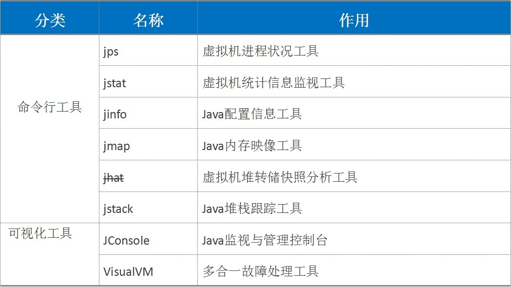
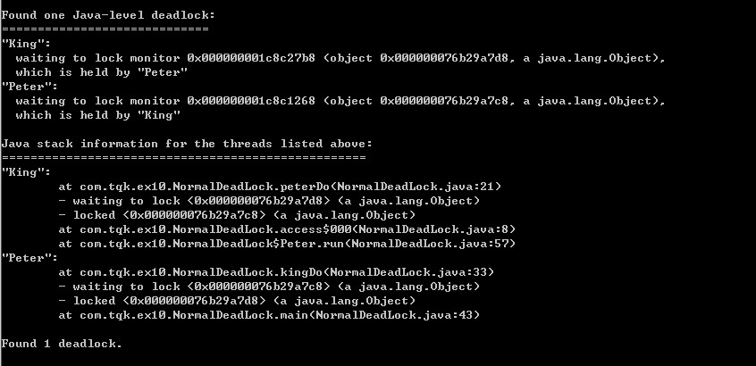
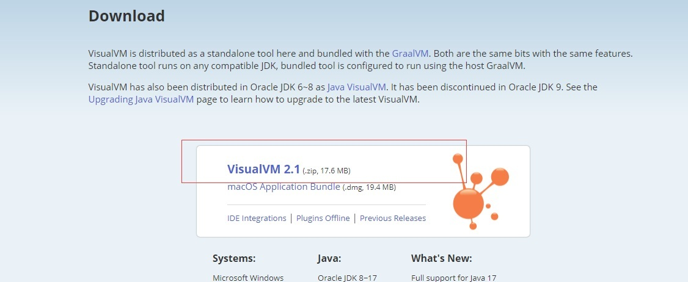
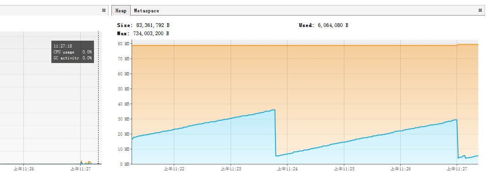
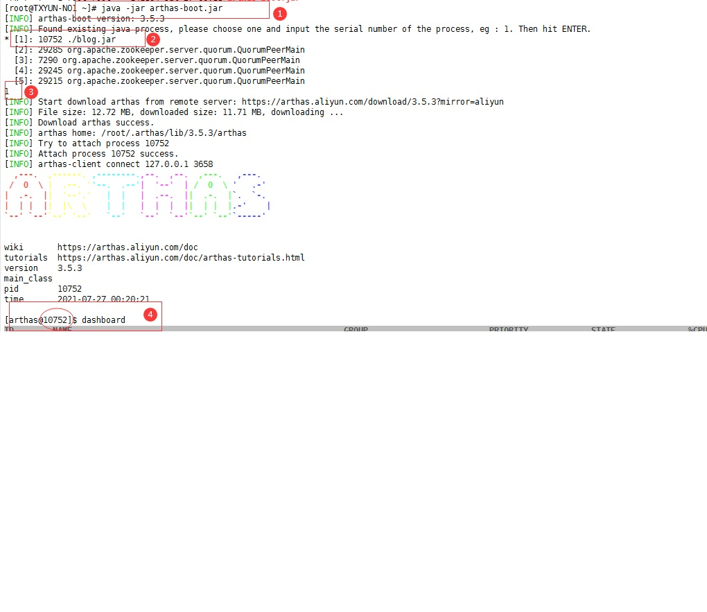
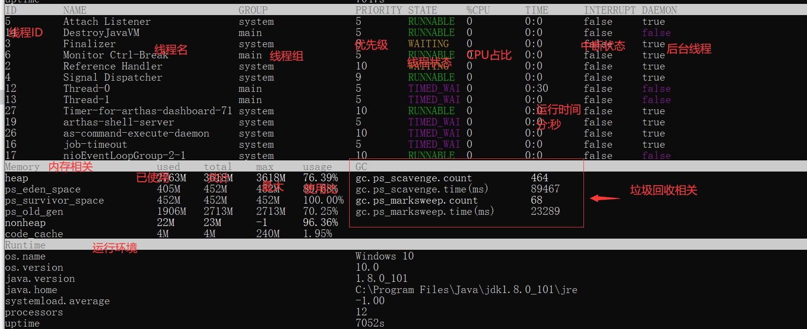
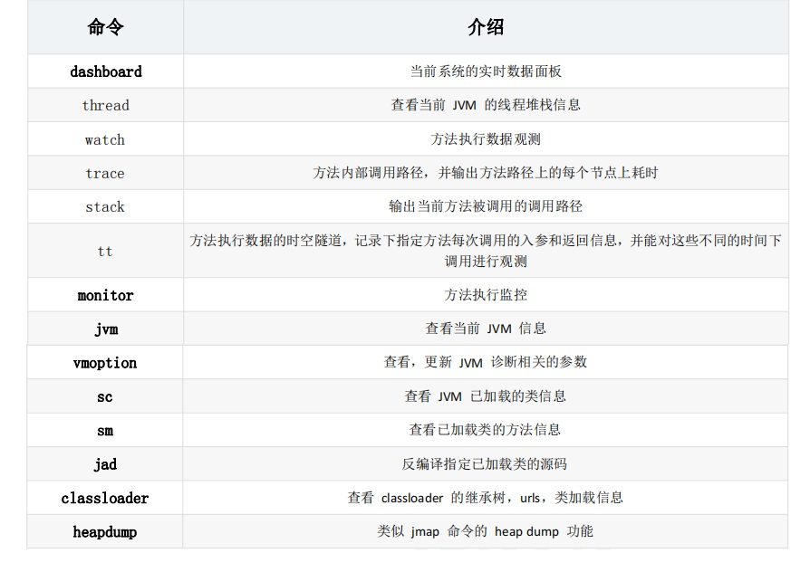

# 10. GC调优工具

## 10.1 JDK自带工具（重点）

<a data-fancybox title="JDK自带工具" href="./image/jdktool.jpg"></a>

### 10.1.1 jps

**列出当前机器上正在运行的虚拟机进程，JPS 从操作系统的临时目录上去找（所以有一些信息可能显示不全)**

```sh
[root@VM_0_15_centos ~]# jps
4107 Jps
23677 Bootstrap
3551 Molandi.jar

```
:::tip 常用参数
<font color='red'><strong>-q</strong></font> : 仅仅显示进程  
<font color='red'><strong>-m</strong></font> : 输出主函数传入的参数. 下的 hello 就是在执行程序时从命令行输入的参数  
<font color='red'><strong>-l</strong></font> : 输出应用程序主类完整 package 名称或 jar 完整名称    
<font color='red'><strong>-v</strong></font> : 列出 jvm 参数, -Xms20m -Xmx50m 是启动程序指定的 jvm 参数  
:::

### 10.1.2 jstat

**是用于监视虚拟机各种运行状态信息的命令行工具。它可以显示本地或者远程虚拟机进程中的类装载、内存、垃圾收集、JIT 编译等运行数据，在没有 GUI 图形界面，只提供了纯文本控制台环境的服务器上，它将是运行期定位虚拟机性能问题的首选工具**

:::tip 常用参数： 
<font color='red'><strong>-class</strong></font> (类加载器)   
<font color='red'><strong>-compiler</strong></font> (JIT)   
<font color='red'><strong>-gc</strong></font> (GC 堆状态)  
<font color='red'><strong>-gccapacity</strong></font> (各区大小)   
<font color='red'><strong>-gccause</strong></font> (最近一次 GC 统计和原因)   
<font color='red'><strong>-gcnew</strong></font> (新区统计)   
<font color='red'><strong>-gcnewcapacity</strong></font> (新区大小)   
<font color='red'><strong>-gcold</strong></font> (老区统计)   
<font color='red'><strong>-gcoldcapacity</strong></font> (老区大小)   
<font color='red'><strong>-gcpermcapacity</strong></font> (永久区大小)   
<font color='red'><strong>-gcutil</strong></font> (GC 统计汇总)   
<font color='red'><strong>-printcompilation</strong></font> (HotSpot 编译统计)  
:::

```sh
[root@VM_0_15_centos ~]# jstat -gc 3551
 S0C    S1C    S0U    S1U      EC       EU        OC         OU       MC     MU    CCSC   CCSU   YGC     YGCT    FGC    FGCT     GCT   
2880.0 2880.0  0.0   540.1  23360.0  12219.2   58084.0    26856.9   71808.0 62607.5 8576.0 7031.2   6819   26.774   8      0.859   27.633


//假设需要每 1000 毫秒查询一次进程 3551 垃圾收集状况，一共查询 10 次，那命令应当是：jstat -gc 3551 1000 10

[root@VM_0_15_centos ~]# jstat -gc 3551  1000 10
 S0C    S1C    S0U    S1U      EC       EU        OC         OU       MC     MU    CCSC   CCSU   YGC     YGCT    FGC    FGCT     GCT   
2880.0 2880.0  0.0   540.1  23360.0  12429.3   58084.0    26856.9   71808.0 62607.5 8576.0 7031.2   6819   26.774   8      0.859   27.633
2880.0 2880.0  0.0   540.1  23360.0  12429.3   58084.0    26856.9   71808.0 62607.5 8576.0 7031.2   6819   26.774   8      0.859   27.633
2880.0 2880.0  0.0   540.1  23360.0  12429.3   58084.0    26856.9   71808.0 62607.5 8576.0 7031.2   6819   26.774   8      0.859   27.633
2880.0 2880.0  0.0   540.1  23360.0  12429.3   58084.0    26856.9   71808.0 62607.5 8576.0 7031.2   6819   26.774   8      0.859   27.633
2880.0 2880.0  0.0   540.1  23360.0  12429.3   58084.0    26856.9   71808.0 62607.5 8576.0 7031.2   6819   26.774   8      0.859   27.633
2880.0 2880.0  0.0   540.1  23360.0  12429.3   58084.0    26856.9   71808.0 62607.5 8576.0 7031.2   6819   26.774   8      0.859   27.633
2880.0 2880.0  0.0   540.1  23360.0  12429.3   58084.0    26856.9   71808.0 62607.5 8576.0 7031.2   6819   26.774   8      0.859   27.633
2880.0 2880.0  0.0   540.1  23360.0  12429.3   58084.0    26856.9   71808.0 62607.5 8576.0 7031.2   6819   26.774   8      0.859   27.633
2880.0 2880.0  0.0   540.1  23360.0  12429.3   58084.0    26856.9   71808.0 62607.5 8576.0 7031.2   6819   26.774   8      0.859   27.633
2880.0 2880.0  0.0   540.1  23360.0  12429.3   58084.0    26856.9   71808.0 62607.5 8576.0 7031.2   6819   26.774   8      0.859   27.633

```

:::tip 显示列表参数说明
<font color='red'><strong>S0C</strong></font>：第一个幸存区（From 区）的大小   
<font color='red'><strong>S1C</strong></font>：第二个幸存区（To 区）的大小   
<font color='red'><strong>S0U</strong></font>：第一个幸存区的使用大小   
<font color='red'><strong>S1U</strong></font>：第二个幸存区的使用大小   
<font color='red'><strong>EC</strong></font>：伊甸园（Eden）区的大小   
<font color='red'><strong>EU</strong></font>：伊甸园（Eden）区的使用大小   
<font color='red'><strong>OC</strong></font>：老年代大小  
<font color='red'><strong>OU</strong></font>：老年代使用大小   
<font color='red'><strong>MC</strong></font>：方法区大小   
<font color='red'><strong>MU</strong></font>：方法区使用大小   
<font color='red'><strong>CCSC</strong></font>:压缩类空间大小   
<font color='red'><strong>CCSU</strong></font>:压缩类空间使用大小   
<font color='red'><strong>YGC</strong></font>：年轻代垃圾回收次数   
<font color='red'><strong>YGCT</strong></font>：年轻代垃圾回收消耗时间   
<font color='red'><strong>FGC</strong></font>：老年代垃圾回收次数   
<font color='red'><strong>FGCT</strong></font>：老年代垃圾回收消耗时间   
<font color='red'><strong>GCT</strong></font>：垃圾回收消耗总时间  
:::

### 10.1.3 jinfo

**查看和修改虚拟机的参数**

<font color='red'><strong>jinfo –sysprops </strong></font>可以查看由 System.getProperties()取得的参数  

<font color='red'><strong>jinfo –flag </strong></font>未被显式指定的参数的系统默认值  

```sh
//默认不打印垃圾回收日志
[root@VM_0_15_centos ~]# jinfo -flag PrintGC 3551
-XX:-PrintGC
//开启打印垃圾回收
[root@VM_0_15_centos ~]# jinfo -flag +PrintGC 3551
[root@VM_0_15_centos ~]# jinfo -flag PrintGC 3551
-XX:+PrintGC
//关闭打印垃圾回收
[root@VM_0_15_centos ~]# jinfo -flag -PrintGC 3551
[root@VM_0_15_centos ~]# jinfo -flag PrintGC 3551
-XX:-PrintGC
```
<font color='red'><strong>jinfo –flags</strong></font>（注意 s）显示虚拟机的参数 

```sh
[root@VM_0_15_centos ~]# jinfo -flags 3551
Attaching to process ID 3551, please wait...
Debugger attached successfully.
Server compiler detected.
JVM version is 25.231-b11
Non-default VM flags: -XX:CICompilerCount=2 -XX:InitialHeapSize=31457280 -XX:MaxHeapSize=482344960 -XX:MaxNewSize=160759808 -XX:MinHeapDeltaBytes=196608 -XX:NewSize=10485760 -XX:OldSize=20971520 -XX:+UseCompressedClassPointers -XX:+UseCompressedOops 
Command line: 
```

### 10.1.4 jmap

用于生成堆转储快照（一般称为 heapdump 或 dump 文件）。jmap 的作用并不仅仅是为了获取 dump 文件，它还可以查询 finalize 执行队列、Java 堆和永久代的详细信息，如空间使用率、当前用的是哪种收集器等。和 jinfo 命令一样，jmap 有不少功能在 Windows 平台下都是受限的，
除了生成 dump 文件的 -dump 选项和用于查看每个类的实例、空间占用统计的<font color='red'><strong>-histo</strong></font>选项在所有操作系统都提供之外，其余选项都只能在 Linux/Solaris 下使用。

<font color='red'><strong>-heap 打印 heap 的概要信息 jmap –heap &lt;pid&gt; </strong></font>

```java
[root@VM_0_15_centos ~]# jmap -heap 3551
Attaching to process ID 3551, please wait...
Debugger attached successfully.
Server compiler detected.
JVM version is 25.231-b11

using thread-local object allocation.
Mark Sweep Compact GC

Heap Configuration:
   MinHeapFreeRatio         = 40
   MaxHeapFreeRatio         = 70
   MaxHeapSize              = 482344960 (460.0MB)
   NewSize                  = 10485760 (10.0MB)
   MaxNewSize               = 160759808 (153.3125MB)
   OldSize                  = 20971520 (20.0MB)
   NewRatio                 = 2
   SurvivorRatio            = 8
   MetaspaceSize            = 21807104 (20.796875MB)
   CompressedClassSpaceSize = 1073741824 (1024.0MB)
   MaxMetaspaceSize         = 17592186044415 MB
   G1HeapRegionSize         = 0 (0.0MB)

Heap Usage:
New Generation (Eden + 1 Survivor Space):
   capacity = 26869760 (25.625MB)
   used     = 13740688 (13.104141235351562MB)
   free     = 13129072 (12.520858764648438MB)
   51.138112137957314% used
Eden Space:
   capacity = 23920640 (22.8125MB)
   used     = 13054168 (12.449424743652344MB)
   free     = 10866472 (10.363075256347656MB)
   54.572820794092465% used
From Space:
   capacity = 2949120 (2.8125MB)
   used     = 686520 (0.6547164916992188MB)
   free     = 2262600 (2.1577835083007812MB)
   23.27880859375% used
To Space:
   capacity = 2949120 (2.8125MB)
   used     = 0 (0.0MB)
   free     = 2949120 (2.8125MB)
   0.0% used
tenured generation:
   capacity = 59478016 (56.72265625MB)
   used     = 27524040 (26.24897003173828MB)
   free     = 31953976 (30.47368621826172MB)
   46.27598876196543% used

28438 interned Strings occupying 2978696 bytes.
```

```sh
Heap Configuration: ##堆配置情况，也就是 JVM 参数配置的结果[平常说的 tomcat 配置 JVM 参数，就是在配置这些]   
MinHeapFreeRatio = 40 ##最小堆使用比例   
MaxHeapFreeRatio = 70 ##最大堆可用比例   
MaxHeapSize = 2147483648 (2048.0MB) ##最大堆空间大小   
NewSize = 268435456 (256.0MB) ##新生代分配大小   
MaxNewSize = 268435456 (256.0MB) ##最大可新生代分配大小   
OldSize = 5439488 (5.1875MB) ##老年代大小   
NewRatio = 2 ##新生代比例   
SurvivorRatio = 8 ##新生代与 suvivor 的比例   
PermSize = 134217728 (128.0MB) ##perm 区 永久代大小   
MaxPermSize = 134217728 (128.0MB) ##最大可分配 perm 区 也就是永久代大小   
Heap Usage: ##堆使用情况【堆内存实际的使用情况】   
New Generation (Eden + 1 Survivor Space): ##新生代（伊甸区 Eden 区 + 幸存区 survior(1+2)空间）   
capacity = 241631232 (230.4375MB) ##伊甸区容量   
used = 77776272 (74.17323303222656MB) ##已经使用大小   
free = 163854960 (156.26426696777344MB) ##剩余容量   
32.188004570534986% used ##使用比例   
Eden Space: ##伊甸区   
capacity = 214827008 (204.875MB) ##伊甸区容量   
used = 74442288 (70.99369812011719MB) ##伊甸区使用   
free = 140384720 (133.8813018798828MB) ##伊甸区当前剩余容量   
34.65220164496263% used ##伊甸区使用情况   
From Space: ##survior1 区   
capacity = 26804224 (25.5625MB) ##survior1 区容量   
used = 3333984 (3.179534912109375MB) ##surviror1 区已使用情况  
free = 23470240 (22.382965087890625MB) ##surviror1 区剩余容量   
12.43827838477995% used ##survior1 区使用比例   
To Space: ##survior2 区   
capacity = 26804224 (25.5625MB) ##survior2 区容量   
used = 0 (0.0MB) ##survior2 区已使用情况   
free = 26804224 (25.5625MB) ##survior2 区剩余容量   
0.0% used ## survior2 区使用比例   
PS Old Generation: ##老年代使用情况   
capacity = 1879048192 (1792.0MB) ##老年代容量   
used = 30847928 (29.41887664794922MB) ##老年代已使用容量   
free = 1848200264 (1762.5811233520508MB) ##老年代剩余容量   
1.6416783843721663% used ##老年代使用比例  
```
<font color='red'><strong>-histo 打印每个 class 的实例数目,内存占用,类全名信息</strong></font>   
jmap –histo &lt;pid&gt;   
jmap –histo:live &lt;pid&gt;如果live子参数加上后,只统计活的对象数量  

```sh
jmap –histo:live 3551
```

<font color='red'><strong>-dump 生成的堆转储快照（比较重要）</strong></font>   
jmap -dump:live,format=b,file=heap.bin &lt;pid&gt;   
Sun JDK 提供 jhat（JVM Heap Analysis Tool）命令与 jmap 搭配使用，来分析 jmap 生成的堆转储快照  

```sh
[root@VM_0_15_centos ~]# jmap -dump:live,format=b,file=heap.bin 3551
Dumping heap to /root/heap.bin ...
Heap dump file created

```

### 10.1.5 jhat

jhat dump文件名

```sh
[root@VM_0_15_centos ~]# jhat  heap.bin 
Reading from heap.bin...
Dump file created Mon Jul 26 23:57:53 CST 2021
Snapshot read, resolving...
Resolving 538082 objects...
Chasing references, expect 107 dots...........................................................................................................
Eliminating duplicate references...........................................................................................................
Snapshot resolved.
Started HTTP server on port 7000
Server is ready.
```

后屏幕显示“Server is ready.”的提示后，
<a title="JVM 的命令行参数参考" href="http://122.51.144.197:7000/">用户在浏览器中键入http://122.51.144.197:7000/就可以访问详情</a>
使用 jhat 可以在服务器上生成堆转储文件分析（一般不推荐，毕竟占用服务器的资源，比如一个文件就有 1 个 G 的话就需要大约吃一个 1G 的内存资源）

### 10.1.6 jstack

（Stack Trace for Java）命令用于生成虚拟机当前时刻的线程快照。线程快照就是当前虚拟机内每一条线程正在执行的方法堆栈的集合，生成线程快照的主要目的是定位线程出现长时间停顿的原因，如线程间死锁、死循环、请求外部资源导致的长时间等待等都是导致线程长时间停顿的常见原因。 

在代码中可以用 java.lang.Thread 类的 getAllStackTraces（）方法用于获取虚拟机中所有线程的StackTraceElement对象。使用这个方法可以通过简单的几行代码就完成 jstack 的大部分功能，在实际项目中不妨调用这个方法做个管理员页面，可以随时使用浏览器来查看线程堆栈

```sh
jstack  12360
```
<a data-fancybox title="DeadLock" href="./image/deadlock.jpg"></a>

### 10.1.7 VM 参数分类

<a title="JVM 的命令行参数参考" href="https://docs.oracle.com/javase/8/docs/technotes/tools/unix/java.html">JVM 的命令行参数参考：https://docs.oracle.com/javase/8/docs/technotes/tools/unix/java.html</a>

1. **标准： -开头，所有的 java虚拟机都支持**

保证 Java 虚拟机（JVM）的所有实现都支持标准选项。它们用于执行常见操作，例如检查JRE版本，设置类路径，启用详细输出等

2. **非标准：-X 开头，特定版本HotSpot支持特定命令**

非标准选项是特定于 Java HotSpot 虚拟机的通用选项，因此不能保证所有 JVM 实现都支持它们，并且它们可能会发生变化。这些选项以开头-X。   
-Xms30m -Xmx30m -Xss1m

3. **高级选项：以开头-XX:** 

这些是开发人员选项，用于调整 Java HotSpot 虚拟机操作的特定区域，这些区域通常具有特定的系统要求，并且可能需要对系统配置参数的特权访问。也不能保证所有 JVM 实现都支持它们，并且它们可能会发生变化。

### 10.1.9 命令工具总结（重点） 

1. **生产服务器推荐开启 -XX:-HeapDumpOnOutOfMemoryError 默认关闭，建议开启**    
在 java.lang.OutOfMemoryError 异常出现时，输出一个 dump 文件，记录当时的堆内存快照。 -XX:HeapDumpPath=./java_pid &lt;pid&gt;.hprof 用来设置堆内存快照的存储文件路径，默认是 java 进程启动位置。

2. **调优之前开启、调优之后关闭** 
-XX:+PrintGC 调试跟踪之打印简单的 
GC 信息参数: -XX:+PrintGCDetails, +XX:+PrintGCTimeStamps 
打印详细的 GC 信息 -Xlogger:logpath 设置 gc 的日志路，如： -Xlogger:log/gc.log， 将 gc.log 的路径设置到当前目录的 log 目录下. 

应用场景：将 gc 的日志独立写入日志文件，将 GC 日志与系统业务日志进行了分离，方便开发人员进行追踪分析。


 **-XX:+PrintHeapAtGC， 打印推信息**   
参数设置： -XX：+PrintHeapAtGC   
应用场景： 获取 Heap 在每次垃圾回收前后的使用状况 -XX:+TraceClassLoading  

 **参数方法：-XX:+TraceClassLoading** 
应用场景：在系统控制台信息中看到 class 加载的过程和具体的 class 信息，可用以分析类的加载顺序以及是否可进行精简操作。 

 **-XX:+DisableExplicitGC** 禁止在运行期显式地调用 System.gc()
### 10.1.9 可视化工具

1. Jconsole
(略)
2. visualvm

<a title="插件中心地址" href=" https://visualvm.github.io ">插件中心地址 https://visualvm.github.io</a>
 
但是注意版本问题，不同的 JDK 所带的 visualvm 是不一样的，下载插件时需要下对应的版本。 一般来说，这个工具是本机调试用，一般生产上来说，你一般是用不了的（除非启用远程连接）
<a data-fancybox title="visualVM" href="./image/visualVM.jpg"></a>

```java
/**
 * VM Args：-Xms30m -Xmx30m -XX:+PrintGCDetails
 * 堆内存溢出（直接溢出）
 */
public class HeapOom {
    //实际开发中不要使用大的数组和对象、字符串
    public static void main(String[] args) {
        String[] strings = new String[35*1000*1000];  //35m的数组（堆）
    }
}
```
<a data-fancybox title="visualVM" href="./image/visualVM1.jpg"></a>

## 10.2 Arthas阿里工具

<a title="Arthas阿里工具" href="https://alibaba.github.io/arthas">官方文档参考 https://alibaba.github.io/arthas</a>

Arthas 是 Alibaba 开源的 Java 诊断工具，深受开发者喜爱。

Arthas 支持JDK6+，支持 Linux/Mac/Windows，采用命令行交互模式，同时提供丰富的 Tab 自动补全功能，进一步方便进行问题的定位 和诊断
###  10.2.1 下载和安装 
不需要安装，就是一个 jar 包 
```sh
curl -O https://alibaba.github.io/arthas/arthas-boot.jar 
java -jar arthas-boot.jar 
启动 arthas 的 jar 包是 arthas-boot.jar
```
###  10.2.2 快速入门 

1. 直接 java -jar arthas-boot.jar。选择 attach 的进程绑定

```sh 
java -jar arthas-boot.jar 
```
<a data-fancybox title="快速入门" href="./image/arthas2.jpg"></a>

2. 通过 jps 命令快速查找 java 进程，再次直接绑定 java -jar arthas-boot.jar pid 启动 arthas 工具 attach 到目标进程

###  10.2.3 dashboard 命令
注意在 arthas 中，有 tab 键填充功能，所以比较好用。但是这个界面是实时刷新的，一般 5s 刷新一次，使用 q 键退出刷新（没有退出 arthasq）

<a data-fancybox title="dashboard" href="./image/arthas3.jpg"></a>

###  10.2.4 thread 命令

这个命令和 jstack 很相似，但是功能更加强大，主要是查看当前 JVM 的线程堆栈信息   
同时可以结合使用 thread –b 来进行死锁的排查死锁。  
参数解释：   
-n 指定最忙的前 n 个线程并打印堆栈  
-b 找出阻塞当前线程的线程   
-i 指定 cpu 占比统计的采样间隔，单位为毫秒  
####  10.2.4.1 thread –b 找出阻塞当前线程的线程

```sh
```
####  10.2.4.2 thread -i 1000 -n 3 每过 1000 毫秒进行采样，显示最占 CPU 时间的前 3 个线程

```sh
arthas@10752]$ thread -i 1000 -n 3 
"arthas-command-execute" Id=48 cpuUsage=0.06% deltaTime=0ms time=1208ms RUNNABLE
    at sun.management.ThreadImpl.dumpThreads0(Native Method)
    at sun.management.ThreadImpl.getThreadInfo(ThreadImpl.java:448)
    at com.taobao.arthas.core.command.monitor200.ThreadCommand.processTopBusyThreads(ThreadCommand.java:206)
    at com.taobao.arthas.core.command.monitor200.ThreadCommand.process(ThreadCommand.java:122)
    at com.taobao.arthas.core.shell.command.impl.AnnotatedCommandImpl.process(AnnotatedCommandImpl.java:82)
    at com.taobao.arthas.core.shell.command.impl.AnnotatedCommandImpl.access$100(AnnotatedCommandImpl.java:18)
    at com.taobao.arthas.core.shell.command.impl.AnnotatedCommandImpl$ProcessHandler.handle(AnnotatedCommandImpl.java:111)
    at com.taobao.arthas.core.shell.command.impl.AnnotatedCommandImpl$ProcessHandler.handle(AnnotatedCommandImpl.java:108)
    at com.taobao.arthas.core.shell.system.impl.ProcessImpl$CommandProcessTask.run(ProcessImpl.java:385)
    at java.util.concurrent.Executors$RunnableAdapter.call(Executors.java:511)
    at java.util.concurrent.FutureTask.run(FutureTask.java:266)
    at java.util.concurrent.ScheduledThreadPoolExecutor$ScheduledFutureTask.access$201(ScheduledThreadPoolExecutor.java:180)
    at java.util.concurrent.ScheduledThreadPoolExecutor$ScheduledFutureTask.run(ScheduledThreadPoolExecutor.java:293)
    at java.util.concurrent.ThreadPoolExecutor.runWorker(ThreadPoolExecutor.java:1149)
    at java.util.concurrent.ThreadPoolExecutor$Worker.run(ThreadPoolExecutor.java:624)
    at java.lang.Thread.run(Thread.java:748)


"C1 CompilerThread1" [Internal] cpuUsage=0.06% deltaTime=0ms time=51787ms


"C2 CompilerThread0" [Internal] cpuUsage=0.06% deltaTime=0ms time=87061ms
```

####  10.2.4.3 thread --state WAITING 查看处于等待状态的线程

```sh
[arthas@10752]$ thread --state WAITING
Threads Total: 36, NEW: 0, RUNNABLE: 12, BLOCKED: 0, WAITING: 16, TIMED_WAITING: 8, TERMINATED: 0                                                                                                                                                
ID        NAME                                                        GROUP                         PRIORITY             STATE               %CPU                DELTA_TIME          TIME                INTERRUPTED         DAEMON              
2         Reference Handler                                           system                        10                   WAITING             0.0                 0.000               0:0.026             false               true                
3         Finalizer                                                   system                        8                    WAITING             0.0                 0.000               0:0.027             false               true                
37        arthas-timer                                                system                        9                    WAITING             0.0                 0.000               0:0.000             false               true                
45        arthas-UserStat                                             system                        9                    WAITING             0.0                 0.000               0:0.001             false               true                
12        Druid-ConnectionPool-Create-671046933                       main                          5                    WAITING             0.0                 0.000               0:0.162             false               true                
16        Catalina-utility-2                                          main                          1                    WAITING             0.0                 0.000               6:1.690             false               false               
21        http-nio-8899-exec-1                                        main                          5                    WAITING             0.0                 0.000               0:0.775             false               true                
22        http-nio-8899-exec-2                                        main                          5                    WAITING             0.0                 0.000               0:0.739             false               true                
23        http-nio-8899-exec-3                                        main                          5                    WAITING             0.0                 0.000               0:0.729             false               true                
24        http-nio-8899-exec-4                                        main                          5                    WAITING             0.0                 0.000               0:0.638             false               true                
25        http-nio-8899-exec-5                                        main                          5                    WAITING             0.0                 0.000               0:0.573             false               true                
26        http-nio-8899-exec-6                                        main                          5                    WAITING             0.0                 0.000               0:0.520             false               true                
27        http-nio-8899-exec-7                                        main                          5                    WAITING             0.0                 0.000               0:0.541             false               true                
28        http-nio-8899-exec-8                                        main                          5                    WAITING             0.0                 0.000               0:0.721             false               true                
29        http-nio-8899-exec-9                                        main                          5                    WAITING             0.0                 0.000               0:0.705             false               true                
30        http-nio-8899-exec-10                                       main                          5                    WAITING             0.0                 0.000               0:0.573             false               true                
```
###  10.2.5 jvm 命令

```sh
[arthas@10752]$ jvm
 RUNTIME                                                                                                                                                                                                                                         
-------------------------------------------------------------------------------------------------------------------------------------------------------------------------------------------------------------------------------------------------
 MACHINE-NAME                                                         10752@TXYUN-NO1                                                                                                                                                            
 JVM-START-TIME                                                       2021-04-20 21:21:45                                                                                                                                                        
 MANAGEMENT-SPEC-VERSION                                              1.2                                                                                                                                                                        
 SPEC-NAME                                                            Java Virtual Machine Specification                                                                                                                                         
 SPEC-VENDOR                                                          Oracle Corporation                                                                                                                                                         
 SPEC-VERSION                                                         1.8                                                                                                                                                                        
 VM-NAME                                                              OpenJDK 64-Bit Server VM                                                                                                                                                   
 VM-VENDOR                                                            Oracle Corporation                                                                                                                                                         
 VM-VERSION                                                           25.262-b10                                                                                                                                                                 
 INPUT-ARGUMENTS                                                      []                                                                                                                                                                         
 CLASS-PATH                                                           ./blog.jar                                                                                                                                                                 
 BOOT-CLASS-PATH                                                      /usr/lib/jvm/java-1.8.0-openjdk-1.8.0.262.b10-0.el7_8.x86_64/jre/lib/resources.jar:/usr/lib/jvm/java-1.8.0-openjdk-1.8.0.262.b10-0.el7_8.x86_64/jre/lib/rt.jar:/usr/lib/jv 
                                                                      m/java-1.8.0-openjdk-1.8.0.262.b10-0.el7_8.x86_64/jre/lib/sunrsasign.jar:/usr/lib/jvm/java-1.8.0-openjdk-1.8.0.262.b10-0.el7_8.x86_64/jre/lib/jsse.jar:/usr/lib/jvm/java-1 
                                                                      .8.0-openjdk-1.8.0.262.b10-0.el7_8.x86_64/jre/lib/jce.jar:/usr/lib/jvm/java-1.8.0-openjdk-1.8.0.262.b10-0.el7_8.x86_64/jre/lib/charsets.jar:/usr/lib/jvm/java-1.8.0-openjd 
                                                                      k-1.8.0.262.b10-0.el7_8.x86_64/jre/lib/jfr.jar:/usr/lib/jvm/java-1.8.0-openjdk-1.8.0.262.b10-0.el7_8.x86_64/jre/classes                                                    
 LIBRARY-PATH                                                         /usr/java/packages/lib/amd64:/usr/lib64:/lib64:/lib:/usr/lib                                                                                                               
```

###  10.2.6 jad 命令

**反编译指定已加载类的源码**

```java
[arthas@10752]$ jad com.tqk.blog.controller.MusicController

ClassLoader:                                                                                                                                                                                                                                     
+-org.springframework.boot.loader.LaunchedURLClassLoader@1d56ce6a                                                                                                                                                                                
  +-sun.misc.Launcher$AppClassLoader@33909752                                                                                                                                                                                                    
    +-sun.misc.Launcher$ExtClassLoader@3e27ba32                                                                                                                                                                                                  

Location:                                                                                                                                                                                                                                        
file:/usr/java/blog.jar!/BOOT-INF/classes!/                                                                                                                                                                                                      

        /*
         * Decompiled with CFR.
         * 
         * Could not load the following classes:
         *  com.tqk.blog.enums.ResultEnum
         *  com.tqk.blog.pojo.BlMusic
         *  com.tqk.blog.service.MusicService
         *  com.tqk.blog.utils.Page
         *  com.tqk.blog.utils.Result
         *  com.tqk.blog.utils.StringUtils
         *  org.springframework.beans.factory.annotation.Autowired
         *  org.springframework.web.bind.annotation.PathVariable
         *  org.springframework.web.bind.annotation.RequestBody
         *  org.springframework.web.bind.annotation.RequestMapping
         *  org.springframework.web.bind.annotation.RequestMethod
         *  org.springframework.web.bind.annotation.RestController
         */
        package com.tqk.blog.controller;
        
        import com.tqk.blog.enums.ResultEnum;
        import com.tqk.blog.pojo.BlMusic;
        import com.tqk.blog.service.MusicService;
        import com.tqk.blog.utils.Page;
        import com.tqk.blog.utils.Result;
        import com.tqk.blog.utils.StringUtils;
        import java.util.Arrays;
        import java.util.List;
        import org.springframework.beans.factory.annotation.Autowired;
        import org.springframework.web.bind.annotation.PathVariable;
        import org.springframework.web.bind.annotation.RequestBody;
        import org.springframework.web.bind.annotation.RequestMapping;
        import org.springframework.web.bind.annotation.RequestMethod;
        import org.springframework.web.bind.annotation.RestController;
        
        @RestController
        @RequestMapping(value={"/music"})
        public class MusicController {
            @Autowired
            private MusicService musicService;
        
            @RequestMapping(value={"/enable/{id}"}, method={RequestMethod.PUT})
            public Result<Object> enable(@PathVariable Integer id) {
/* 81*/         this.musicService.enableById(id);
                return new Result("启用成功");
            }
        
            @RequestMapping(value={"/disable/{id}"}, method={RequestMethod.PUT})
            public Result<Object> disable(@PathVariable Integer id) {
/* 92*/         this.musicService.disableById(id);
                return new Result("弃用成功");
            }
        
            @RequestMapping(value={"/getByPage"}, method={RequestMethod.POST})
            public Result<Page<BlMusic>> getByPage(@RequestBody Page<BlMusic> page) {
                String[] sortColumns;
                List<String> sortList;
                String sortColumn = page.getSortColumn();
                if (StringUtils.isNotBlank((CharSequence)sortColumn) && !(sortList = Arrays.asList(sortColumns = new String[]{"artist", "created_time", "enabled"})).contains(sortColumn.toLowerCase())) {
                    return new Result(ResultEnum.PARAMS_ERROR.getCode(), "排序参数不合法！");
                }
/*112*/         page = this.musicService.getByPage(page);
                return new Result((Object)page);
            }
        
            @RequestMapping(value={"/getList"}, method={RequestMethod.GET})
            public Result<List<BlMusic>> getList() {
/*122*/         List musicList = this.musicService.getList();
                return new Result((Object)musicList);
            }
        
            @RequestMapping(value={"/get/{id}"}, method={RequestMethod.GET})
            public Result<BlMusic> get(@PathVariable Integer id) {
/* 59*/         BlMusic music = this.musicService.getById(id);
                return new Result((Object)music);
            }
        
            @RequestMapping(value={"/update"}, method={RequestMethod.PUT})
            public Result<Object> update(@RequestBody BlMusic music) {
/* 48*/         this.musicService.update(music);
                return new Result("修改成功！");
            }
        
            @RequestMapping(value={"/delete/{id}"}, method={RequestMethod.DELETE})
            public Result<Object> delete(@PathVariable Integer id) {
/* 70*/         this.musicService.deleteById(id);
                return new Result("删除成功！");
            }
        
            @RequestMapping(value={"/save"}, method={RequestMethod.POST})
            public Result<Object> save(@RequestBody BlMusic music) {
/* 35*/         String msg = "添加成功！";
                Result result = new Result(msg);
/* 37*/         this.musicService.save(music);
/* 38*/         return result;
            }
        }

Affect(row-cnt:4) cost in 2012 ms.
```
###  10.2.7 trace 命令

**使用 trace 命令可以跟踪统计方法耗时** 

继续跟踪耗时高的方法，然后再次访问 比如使用一个 Springboot 项目（当然，不想 Springboot 的话，你也可以直接在 UserController 里 main 方法启动）控制层 getUser 方法调用 了 userService.get(uid);，这个方法中分别进行 check、service、redis、mysql 等操作操作。就可以根据这个命令跟踪出来哪里的耗时最长。
```sh
[arthas@10752]$ trace com.tqk.blog.controller.MusicController getList
Press Q or Ctrl+C to abort.
Affect(class count: 2 , method count: 2) cost in 139 ms, listenerId: 5
`---ts=2021-07-27 00:55:02;thread_name=http-nio-8899-exec-3;id=17;is_daemon=true;priority=5;TCCL=org.springframework.boot.web.embedded.tomcat.TomcatEmbeddedWebappClassLoader@69ee81fc
    `---[139.853962ms] com.tqk.blog.controller.MusicController$$EnhancerBySpringCGLIB$$68c0ba:getList()
        `---[139.377082ms] org.springframework.cglib.proxy.MethodInterceptor:intercept()
            `---[20.997931ms] com.tqk.blog.controller.MusicController:getList()
                +---[20.843028ms] com.tqk.blog.service.MusicService:getList() #122
                `---[0.019634ms] com.tqk.blog.utils.Result:<init>() #123
```
###  10.2.8 monitor 命令

每 5 秒统计一次 com.tqk.blog.controller.MusicController 类的 getList 方法执行情况    
<font color='red'><strong>monitor -c 5 com.tqk.blog.controller.MusicController getList</strong></font>

```sh
[arthas@10752]$ monitor -c 5 com.tqk.blog.controller.MusicController getList
Press Q or Ctrl+C to abort.
Affect(class count: 2 , method count: 2) cost in 188 ms, listenerId: 6
 timestamp                            class                                                   method                                                 total              success           fail               avg-rt(ms)        fail-rate         
-------------------------------------------------------------------------------------------------------------------------------------------------------------------------------------------------------------------------------------------------
 2021-07-27 01:34:12                  com.tqk.blog.controller.MusicController$$EnhancerBySpr  getList                                                1                  1                 0                  75.54             0.00%             
                                      ingCGLIB$$68c0ba                                                                                                                                                                                           
 2021-07-27 01:34:12                  com.tqk.blog.controller.MusicController                 getList                                                1                  1                 0                  25.47             0.00%             

 timestamp                            class                                                   method                                                 total              success           fail               avg-rt(ms)        fail-rate         
-------------------------------------------------------------------------------------------------------------------------------------------------------------------------------------------------------------------------------------------------
 2021-07-27 01:34:17                  com.tqk.blog.controller.MusicController$$EnhancerBySpr  getList                                                0                  0                 0                  0.00              0.00%             
                                      ingCGLIB$$68c0ba                                                                                                                                                                                           
 2021-07-27 01:34:17                  com.tqk.blog.controller.MusicController                 getList                                                0                  0                 0                  0.00              0.00%             
```

###  10.2.9 watch 命令
**观察方法的入参出参信息 # 查看入参和出参**   
<font color='red'><strong>watch com.tqk.blog.controller.MusicController getList '{params,returnObj}'</strong></font>   
<font color='red'><strong>watch com.tqk.blog.controller.MusicController getList '{params[0],returnObj}'</strong></font>   
<font color='red'><strong>watch com.tqk.blog.controller.MusicController getList '{returnObj}'</strong></font>  

```sh
[arthas@10752]$ watch com.tqk.blog.controller.MusicController getList '{returnObj}'
Press Q or Ctrl+C to abort.
Affect(class count: 2 , method count: 2) cost in 171 ms, listenerId: 8
method=com.tqk.blog.controller.MusicController.getList location=AtExit
ts=2021-07-27 01:39:14; [cost=11.34216ms] result=@ArrayList[
    @Result[Result(code=20000, msg=操作成功！, data=[BlMusic(id=1, name=see you again, artist=see you again, url=http://49.232.21.151/group1/M00/00/00/rBUAEGBXaNaAKmq6AItuDEehl8w738.mp3, cover=http://49.232.21.151/group1/M00/00/00/rBUAEGBXaM6AZFZHAABYayAtqWU518.jpg, createdTime=Sun Mar 21 23:40:19 CST 2021, enable=1, deleted=0, lrc=[00:00.000] 作词 : Andrew Cedar/Justin Scott Franks/Charlie Otto Jr. Puth/Cameron Jibril Thomaz
[00:01.000] 作曲 : Andrew Cedar/Justin Scott Franks/Charlie Otto Jr. Puth/Cameron Jibril Thomaz
[00:11.210]It's been a long day without you my friend
[00:17.310]And I'll tell you all about it when I see you again
[00:23.750]We've come a long way from where we began
[00:29.250]Oh I'll tell you all about it when I see you again
[00:35.700]When I see you again
[00:40.200]Damn who knew all the planes we flew
[00:43.550]Good things we've been through
[00:44.850]That I'll be standing right here
[00:46.950]Talking to you about another path
[00:47.900]I know we loved to hit the road and laugh
[00:51.800]But something told me that it wouldn't last
[00:53.900]Had to switch up look at things different see the bigger picture
[00:57.750]Those were the days hard work forever pays
[01:00.650]Now I see you in a better place
[01:05.700]How could we not talk about family when family's all that we got?
[01:09.200]Everything I went through you were standing there by my side
[01:11.950]And now you gon' be with me for the last ride
[01:14.600]It's been a long day without you my friend
[01:20.900]And I'll tell you all about it when I see you again
[01:27.100]We've come a long way from where we began
[01:32.950]Oh I'll tell you all about it when I see you again
[01:38.700]When I see you again
[01:42.150]Ohh~~~
```
###  10.2.10 命令总结
<a data-fancybox title="命令总结" href="./image/arthas.jpg"></a>

## 10.3 动态追踪技术底层分析

动态追踪技术是一个可以不用重启线上 java 项目来进行问题排查的技术，比如前面讲的 Arthas 就属于一种动态追踪的工具。
它里面提供的 monitor 还有 watch 等命令就是动态的追踪技术。

当然我们学技术要知其然还要知其所以然，Arthas工具的基础，就是<font color='red'><strong>Java Agent技术</strong></font>，可以利用它来构建一个附加的代理程序，用来协助检测性能，还可以替换一些现有功能，甚至JDK的一些类我们也能修改，有点像JVM级别的AOP功能。


### 10.3.1 Java Agent 技术 

既然作为 JVM 的 AOP，就必须要有 AOP 的功能，所以 Java Agent 提供了两个类似于 AOP 的方法  

:::tip Java Agent的AOP的方法
◆　一个方法叫做 premain 方法，可以在 main 运行之前的进行一些操作(Java 入口是一个 main 方法) 　  　
◆　一个是 agentmain 方法，是控制类运行时的行为（Arthas 使用的就是这种）,但在一个 JVM 中，只会调用一个   　　
:::

## 10.4 GCViewer可视化分析工具

## 10.5 Prometheus监控工具

## 10.6 Grafana监控工具
