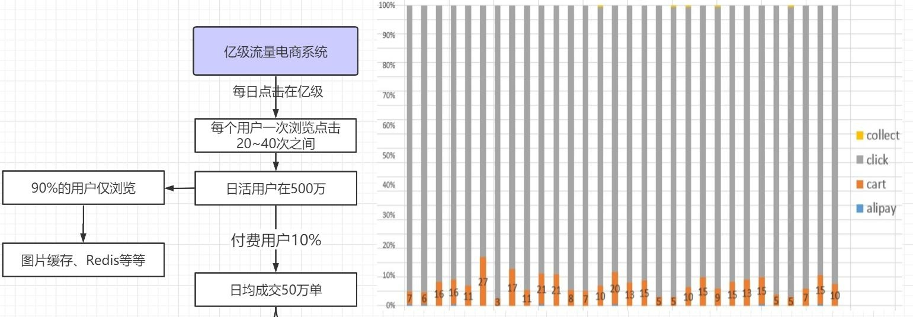
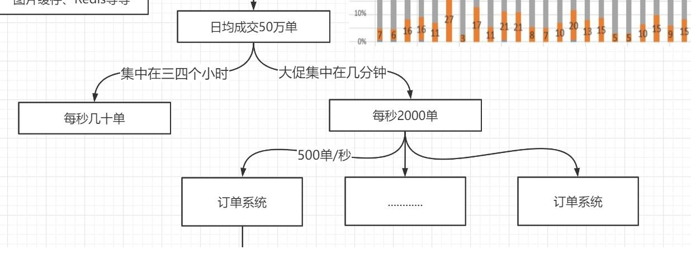
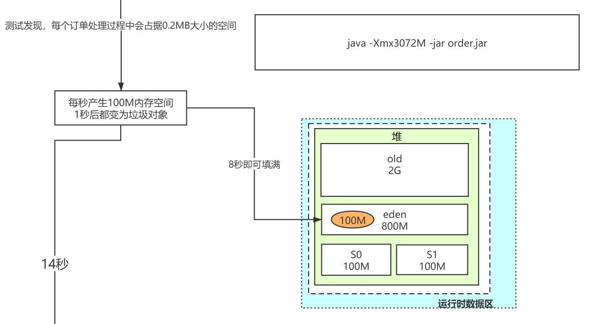
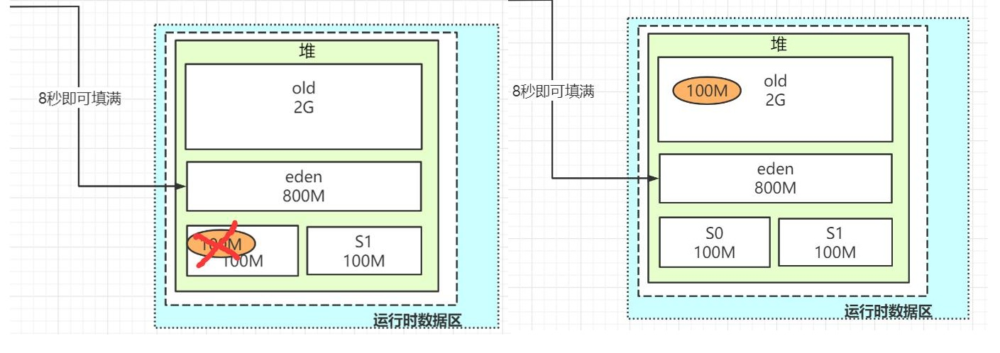
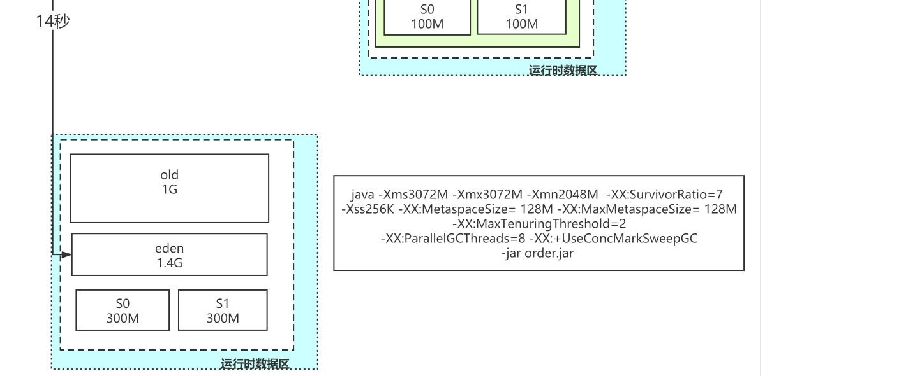
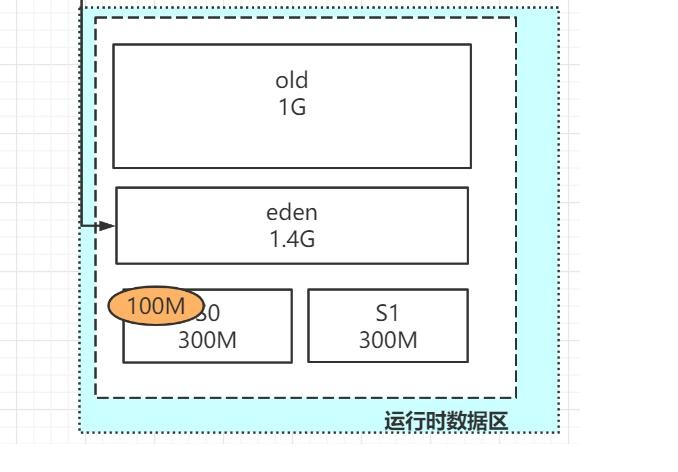
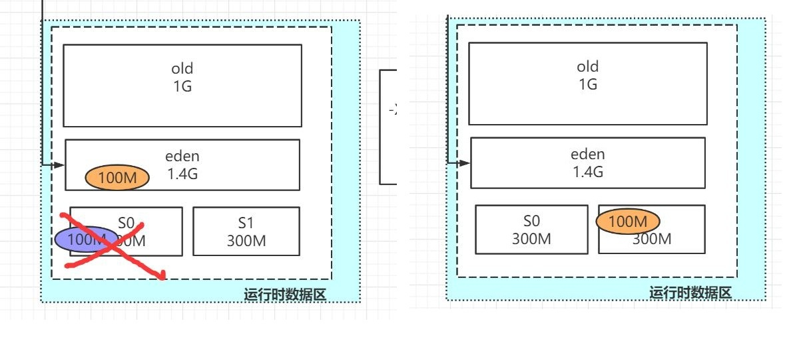

# 12.JVM性能调优（二）

## 12.1 JVM 预调优

### 12.1.1 业务场景设定

调优是要分场景的，所以一定要明显你调优项目的场景设定，像现在大家都是微服务架构了，服务拆分出来以后更加适合做场景设定。比如这个服务就注重吞吐量，这个服务注重用户的体验（用户的响应时间）等等。

### 12.1.2 量化压力测试优化 

通过压力测试，能够看到结果，有数据体现的，不要用感觉去优化，所有的东西一定要有量化的指标，比如吞吐量，响应时间，服务器资源，网络资源等等。总之一句话，无监控不优化。

## 12.2 JVM 优化手段

### 12.2.1 计算内存需求 

内存不是越大越好，对于一般系统来说，内存的需求是弹性的，内存小，回收速度快也能承受。所以内存大小没有固定的规范。 虚拟机栈的大小在高并发情况下可以变小。 

元空间（方法区）保险起见还是设定一个最大的值（默认情况下元空间是没有大小限制的），一般限定几百 M 就够用了，为什么说还限定元空间。 

举例子：一台 8G 的内存的服务器，如果运行时还有其他的程序加上虚拟机栈加上元空间，占用超过 6 个 G 的话，那么我们设定堆是弹性的（max=4G）， 那么其实堆空间拓展也超不过 2G，所以这个时候限制元空间还是有必要的。 

### 12.2.2 选定 CPU 

对于系统来说， CPU 的性能是越高越好，这个按照你的预算来定（CPU 的成本很高）。尤其是现在服务器做了虚拟机化之后，虚拟机的性能指标不能单看虚拟化后的参数指标，更需要看宿主机的参数指标

### 12.2.3 选择合适的垃圾回收器 

1. 对于吞吐量优先的场景，就只有一种选择，就是使用 PS 组合（Parallel Scavenge+Parallel Old ）   
2. 对于响应时间优先的场景，在 JDK1.8 的话优先 G1，其次是 CMS 垃圾回收器。 

### 12.2.4 设定新生代大小、分代年龄 

吞吐量优先的应用:一般吞吐量优先的应用都有一个很大的新生代和一个较小的老年代.  
原因是这样可以尽可能回收掉大部分短期对象,减少中期的对象,而 老年代尽存放长期存活对象。 

### 12.2.5 设定日志参数 

<strong>-XX:+PrintGC</strong>  输出 GC 日志   
<strong>-XX:+PrintGCDetails</strong>  输出 GC 的详细日志   
<strong>-XX:+PrintGCTimeStamps</strong> 输出 GC 的时间戳（以基准时间的形式）   
<strong>-XX:+PrintGCDateStamps</strong> 输出 GC 的时间戳（以日期的形式，如 2013-05-04T21:53:59.234+0800）   
<strong>-XX:+PrintHeapAtGC</strong> 在进行 GC 的前后打印出堆的信息 -Xloggc:../logs/gc.log 日志文件的输出路径 注意：一般记录日志的是，如果只有一个日志文件肯定不行，有时候一个高并发项目一天产生的日志文件就上 T，其实记录日志这个事情，应该是运维干的事情。日志文件帮助我们分析问题  

## 12.3 亿级流量电商系统 JVM 调优

### 12.3.1 GC预估

亿级流量系统，其实就是每天点击量在亿级的系统，根据淘宝的一个官方的数据分析。 每个用户一次浏览点击 20~40 次之间，推测出每日活跃用户（日活用户）在 500 万左右。 

同时结合淘宝的一个点击数据，可以发现，能够付费的也就是橙色的部分（cart）的用户，比例只有 10%左右。 90%的用户仅仅是浏览，那么我们可以通过图片缓存、Redis 缓存等技术，我们可以把 90%的用户解决掉。 10%的付费用户，大概算出来是每日成交 50 万单左右。

如果是普通业务，一般处理时间比较平缓，大概在 3,4 个小时处理，算出来每秒只有几十单，这个一般的应用可以处理过来（不需要 JVM 预估调优） 

另外电商系统中有大促场景（秒杀、限时抢购等），一般这种业务是几种在几分钟。我们算出来大约每秒 2000 单左右的数据， 承受大促场景的使用 4 台服务器（使用负载均衡）。每台订单服务器也就是大概 500 单/秒 我们测试发现，每个订单处理过程中会占据 0.2MB 大小的空间（什么订单信息、优惠券、支付信息等等），那么一台服务器每秒产生 100M 的内存空间， 这些对象基本上都是朝生夕死，也就是 1 秒后都会变成垃圾对象。

加入我们设置堆的空间最大值为 3 个 G，我们按照默认情况下的设置，新生代 1/3 的堆空间，老年代 2/3 的堆空间。Eden:S0:S1=8:1:1 我们推测出，old 区=2G,Eden 区=800M,S0=S1=100M 根据对象的分配原则（对象优先在 Eden 区进行分配），由此可得，8 秒左右 Eden 区空间满了。 

每 8 秒触发一个 MinorGC（新生代垃圾回收），这次 MinorGC 时，JVM 要 STW，但是这个时候有 100M 的对象是不能回收的（线程暂停，对象需要 1 秒后都会变成垃圾对象），那么就会有 100M 的对象在本次不能被回收（只有下次才能被回收掉） 所以经过本次垃圾回收后。本次存活的 100M 对象会进入 S0 区，但是由于另外一个 JVM 对象分配原则（如果在 Survivor 空间中相同年龄所有对象大小的 总和大于 Survivor 空间的一半，年龄大于或等于该年龄的对象就可以直接进入老年代，无须等到 MaxTenuringThreshold 中要求的年龄） 所以这样的对象本质上不会进去 Survivor 区，而是进入老年代

所以我们推算，大概每个 8 秒会有 100M 的对象进入老年代。大概 20*8=160 秒，也就是 2 分 40 秒左右 old 区就会满掉，就会触发一次 FullGC,一般来说， 这次 FullGC 是可以避免的，同时由于 FullGC 不单单回收老年代+新生代，还要回收元空间，这些 FullGC 的时间可能会比较长（老年代回收的朝生夕死的对 象，使用标记清除/标记整理算法决定了效率并不高,同时元空间也要回收一次，进一步加大 GC 时间）。 所以问题的根本就是做到如何避免没有必要的 FullGC

### 12.3.2 GC调优

我们在项目中加入VM参数：   
-Xms3072M -Xmx3072M -Xmn2048M   
-XX:SurvivorRatio=7   
-Xss256K   
-XX:MetaspaceSize= 128M   
-XX:MaxMetaspaceSize= 128M   
-XX:MaxTenuringThreshold=2   
-XX:ParallelGCThreads=8   
-XX:+UseConcMarkSweepGC   

1. 首先看一下堆空间：old 区=1G，Eden 区=1.4G,S0=S1=300M 

2. 那么第一点，Eden 区大概需要 14 秒才能填满，填满之后，100M 的存活对象会进入 S0 区（由于这个区域变大，不会触发动态年龄判断） 

3. 再过 14 秒，Eden 区，填满之后，还是剩余 100M 的对象要进入 S1 区。但是由于原来的 100M 已经是垃圾了（过了 14 秒了），所以，S1 也只会 有 Eden 区过来的 100M 对象，S0 的 100M 已经别回收，也不会触发动态年龄判断。  

4. 反反复复，这样就没有对象会进入 old 区，就不会触发 FullGC,同时我们的 MinorGC 的频次也由之前的 8 秒变为 14 秒，虽然空间加大，但是换来 的还是 GC 的总时间会减少。 

5. -Xss256K -XX:MetaspaceSize= 128M -XX:MaxMetaspaceSize= 128M 栈一般情况下很少用到 1M。所以为了线程占用内存更少，我们可以减少到 256K 元空间一般启动后就不会有太多的变化，我们可以设定为 128M，节约内存空间。    

6. -XX:MaxTenuringThreshold=2 这个是分代年龄（年龄为 2 就可以进入老年代），因为我们基本上都使用的是 Spring 架构，Spring 中很多的 bean 是 长期要存活的，没有必要在 Survivor 区过渡太久，所以可以设定为 2，让大部分的 Spring 的内部的一些对象进入老年代。 
7. -XX:ParallelGCThreads=8 线程数可以根据你的服务器资源情况来设定（要速度快的话可以设置大点，根据 CPU 的情况来定，一般设置成 CPU 的整数倍）  