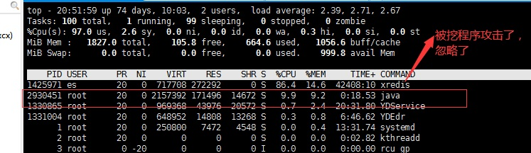
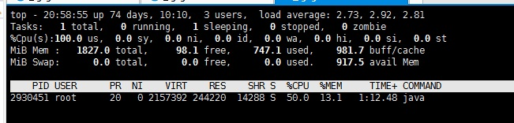
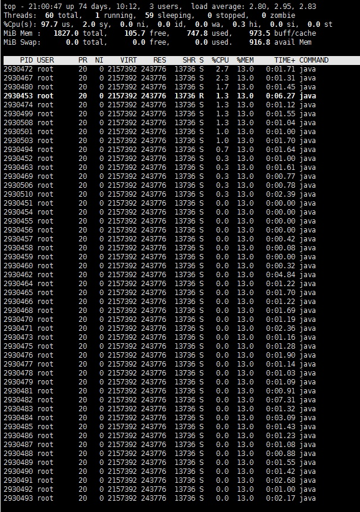
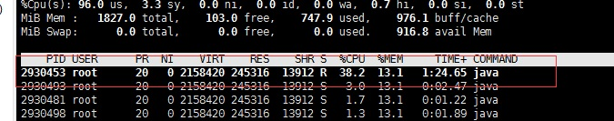
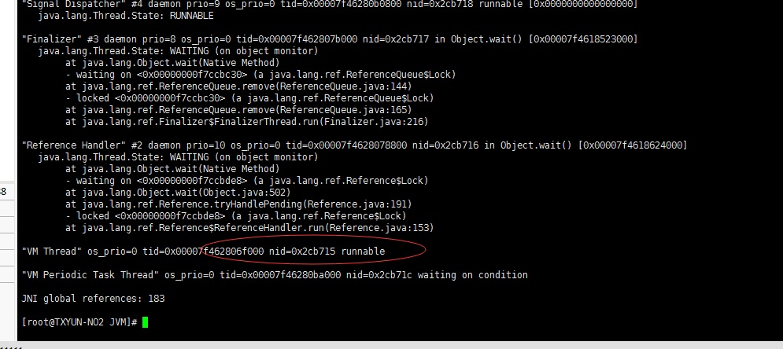
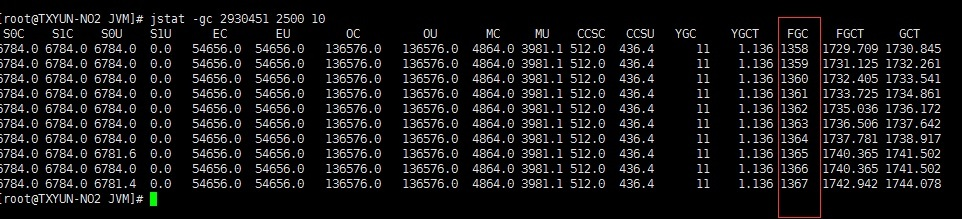

# 13.JVM调优实战

## 13.1 代码介绍

**模拟多线程处理业务，内存溢出**

```java
package com.tqk.ex13;

import java.math.BigDecimal;
import java.util.ArrayList;
import java.util.List;
import java.util.concurrent.ScheduledThreadPoolExecutor;
import java.util.concurrent.ThreadPoolExecutor;
import java.util.concurrent.TimeUnit;

/**
 * VM参数： -XX:+PrintGC -Xms200M -Xmx200M
 *  GC调优---生产服务器推荐开启(默认是关闭的)
 *  -XX:+HeapDumpOnOutOfMemoryError
 */

public class FullGCProblem {
    //线程池
    private static ScheduledThreadPoolExecutor executor = new ScheduledThreadPoolExecutor(50,
            new ThreadPoolExecutor.DiscardOldestPolicy());

    public static void main(String[] args) throws Exception {
        //50个线程
        executor.setMaximumPoolSize(50);
        while (true){
            calc();
            Thread.sleep(100);
        }
    }
    //多线程执行任务计算
    private static void calc(){
        List<UserInfo> taskList = getAllCardInfo();
        taskList.forEach(userInfo -> {
            executor.scheduleWithFixedDelay(() -> {
                userInfo.user();
            }, 2, 3, TimeUnit.SECONDS);
        });
    }
    //模拟从数据库读取数据，返回
    private static List<UserInfo> getAllCardInfo(){
        List<UserInfo> taskList = new ArrayList<>();
        for (int i = 0; i < 100; i++) {
            UserInfo userInfo = new UserInfo();
            taskList.add(userInfo);
        }
        return taskList;
    }
    private static class UserInfo {
        String name = "tqk";
        int age = 18;
        BigDecimal money = new BigDecimal(999999.99);

        public void user() {
            //
        }
        
    }
}
```

```sh
//在 Linux 服务跑起来 
java -cp JVM.jar -XX:+PrintGC -Xms200M -Xmx200M com.tqk.ex13.FullGCProblem
```

## 13.2 CPU占用过高排查实战 

**cpu使用率过高时，生产环境通过监控工具zabbix能够发现相关告警**

1. 先通过 top 命令找到消耗 cpu 很高的进程 id 假设是 2732 top 命令是我们在 Linux 下最常用的命令之一，它可以实时显示正在执行进程的 CPU 使用率、内存使用率以及系统负载等信息。其中上半部分显示的是系统的统计信息，下半部分显示的是进程的使用率统计信息。

<a data-fancybox title="CPU占用过高排查实战" href="./image/jvmshizhan.jpg"></a>

2. 执行 top -p 2930451 单独监控该进程 

<a data-fancybox title="CPU占用过高排查实战" href="./image/jvmshizhan1.jpg"></a>

3. 在第2步的监控界面输入 H(shift + h)，获取当前进程下的所有线程信息

<a data-fancybox title="CPU占用过高排查实战" href="./image/jvmshizhan2.jpg"></a>

4. 找到消耗 cpu 特别高的线程编号是 2930453（要等待一阵） 
<a data-fancybox title="CPU占用过高排查实战" href="./image/jvmshizhan3.jpg"></a>

5. 执行 jstack 2930451 对当前的进程做 dump，输出所有的线程信息

6. 将第 4 步得到的线程编号 2930453 转成 16 进制是 0x2CB715 也可以通过计算器来换算。 

7. 根据第 6 步得到的 0x2CB715 在第 5 步的线程信息里面去找对应线程内容 
<a data-fancybox title="CPU占用过高排查实战" href="./image/jvmshizhan4.jpg"></a>

8. 解读线程信息，定位具体代码位置
**发现找是 VM 的线程占用过高，我们发现我开启的参数中，有垃圾回收的日志显示，所以我们要换一个思路，可能是我们的业务线程没问题，而是垃圾回收的导致的**

9. jstat -gc 2930451 2500 10
<a data-fancybox title="CPU占用过高排查实战" href="./image/jvmshizhan5.jpg"></a>
使用这个大量的 FullGC了, 还抛出了 OUT Of Memory

10. jmap -histo 2930451|head -20

```sh 
root@TXYUN-NO2 JVM]# jmap -histo 2930451|head -20

 num     #instances         #bytes  class name
----------------------------------------------
   1:        801073       57677256  java.util.concurrent.ScheduledThreadPoolExecutor$ScheduledFutureTask
   2:        801180       32047200  java.math.BigInteger
   3:        801099       32043960  java.math.BigDecimal
   4:        801348       25644168  [I
   5:        801073       19225752  com.tqk.ex13.FullGCProblem$UserInfo
   6:        801073       19225752  java.util.concurrent.Executors$RunnableAdapter
   7:        801073       12817168  com.tqk.ex13.FullGCProblem$$Lambda$2/1283928880
   8:             1        3594640  [Ljava.util.concurrent.RunnableScheduledFuture;
   9:          1657         131168  [C
  10:           740          84616  java.lang.Class
  11:          1645          39480  java.lang.String
  12:           806          36424  [Ljava.lang.Object;
  13:            13          25296  [B
  14:            56          21056  java.lang.Thread
  15:           188          10528  java.lang.invoke.MemberName
  16:           274           8768  java.util.concurrent.ConcurrentHashMap$Node
  17:           185           7400  java.lang.ref.SoftReference
```

一般来说，前面这几行，就可以看出，到底是哪些对象占用了内存。 这些对象回收不掉吗？是的，这些对象回收不掉，这些对象回收不掉，导致了 FullGC,里面还有 OutOfMemory

任务数多于线程数，那么任务会进入阻塞队列，就是一个队列，你进去，排队，有机会了，你就上来跑。 但是因为代码中任务数一直多于线程数，所以每 0.1S，就会有 50 个任务进入阻塞对象，50 个任务底下有对象，至少对象送进去了，但是没执行。 所以导致对象一直都在，同时还回收不了。
为什么回收不了?  
Executor 是一个 GCroots.所以堆中，就会有对象 80 万个，阻塞队列中 80 万个任务，futureTask。并且这些对象还回收不了。

## 13.3 常见问题分析

### 13.3.1 超大对象 
代码中创建了很多大对象 , 且一直因为被引用不能被回收，这些大对象会进入老年代，导致内存一直被占用，很容易引发 GC 甚至是 OOM

### 13.3.2 超过预期访问量 
通常是上游系统请求流量飙升，常见于各类促销/秒杀活动，可以结合业务流量指标排查是否有尖状峰值。 比如如果一个系统高峰期的内存需求需要 2 个 G 的堆空间，但是堆空间设置比较小，导致内存不够，导致 JVM 发起频繁的 GC 甚至 OOM。

### 13.3.3 过多使用 Finalizer 
过度使用终结器（Finalizer），对象没有立即被 GC，Finalizer线程会和我们的主线程进行竞争，不过由于它的优先级较低，获取到的 CPU 时间较少，因此它永远也赶不上主线程的步伐，程序消耗了所有的可用资源，最后抛出 OutOfMemoryError 异常。 

### 13.3.4 内存泄漏 

程序在申请内存后，无法释放已申请的内存空间。  
大量对象引用没有释放，JVM 无法对其自动回收。 

#### 13.3.4.1 长生命周期的对象持有短生命周期对象的引用 
例如将 ArrayList 设置为静态变量，则容器中的对象在程序结束之前将不能被释放，从而造成内存泄漏 

#### 13.3.4.2 连接未关闭 
如数据库连接、网络连接和 IO 连接等，只有连接被关闭后，垃圾回收器才会回收对应的对象。

#### 13.3.4.3 变量作用域不合理
例如，1.一个变量的定义的作用范围大于其使用范围，2.如果没有及时地把对象设置为 null 

#### 13.3.4.4 内部类持有外部类 

Java的非静态内部类的这种创建方式，会隐式地持有外部类的引用，而且默认情况下这个引用是强引用。 因此如果内部类的生命周期长于外部类的生命周期，程序很容易就产生内存泄漏 如果内部类的生命周期长于外部类的生命周期，程序很容易就产生内存泄漏（垃圾回收器会回收掉外部类的实例，但由于内部类持有外部类的引用，导致垃圾回收器不能正常工作） 
解决方法：你可以在内部类的内部显示持有一个外部类的软引用(或弱引用)，并通过构造方法的方式传递进来，在内部类的使用过程中，先判断一下外部类是否被回收； 

#### 13.3.4.5 Hash 值改变

在集合中，如果修改了对象中的那些参与计算哈希值的字段，会导致无法从集合中单独删除当前对象，造成内存泄露（有代码案例 Node 类）

```java
public class Stack {

    public Object[] elements;//数组来保存
    private int size =0;
    private static final int Cap = 200000;

    public Stack() {
        elements = new Object[Cap];
    }

    public void push(Object e){ //入栈
        elements[size] = e;
        size++;
    }
    public Object pop(){  //出栈
    	size = size -1;
        Object o = elements[size];
        elements[size] =null; //不用---引用干掉，GC可以正常回收次对象
        return o;
    }
}


public class UseStack {
    static Stack stack = new Stack();  //new一个栈
    public static void main(String[] args) throws Exception {

        for(int i=0;i<100000;i++){//10万的数据入栈
            stack.push(new String[1*1000]); //入栈
        }
        for(int i=0;i<100000;i++){//10万的数据出栈
            Object o1= stack.pop(); //出栈
        }
        Thread.sleep(Integer.MAX_VALUE);

    }
}
```

## 13.4 内存泄漏和内存溢出辨析 

内存溢出：实实在在的内存空间不足导致；    
内存泄漏：该释放的对象没有释放，常见于使用容器保存元素的情况下。    

如何避免?   
内存溢出：检查代码以及设置足够的空间   
内存泄漏：一定是代码有问题 往往很多情况下，内存溢出往往是内存泄漏造成的。   

## 13.5 一般优化的思路顺序：

### 13.5.1 程序优化，效果通常非常大； 
### 13.5.2 扩容，如果金钱的成本比较小，不要和自己过不去； 
### 13.5.3 参数调优，在成本、吞吐量、延迟之间找一个平衡点。