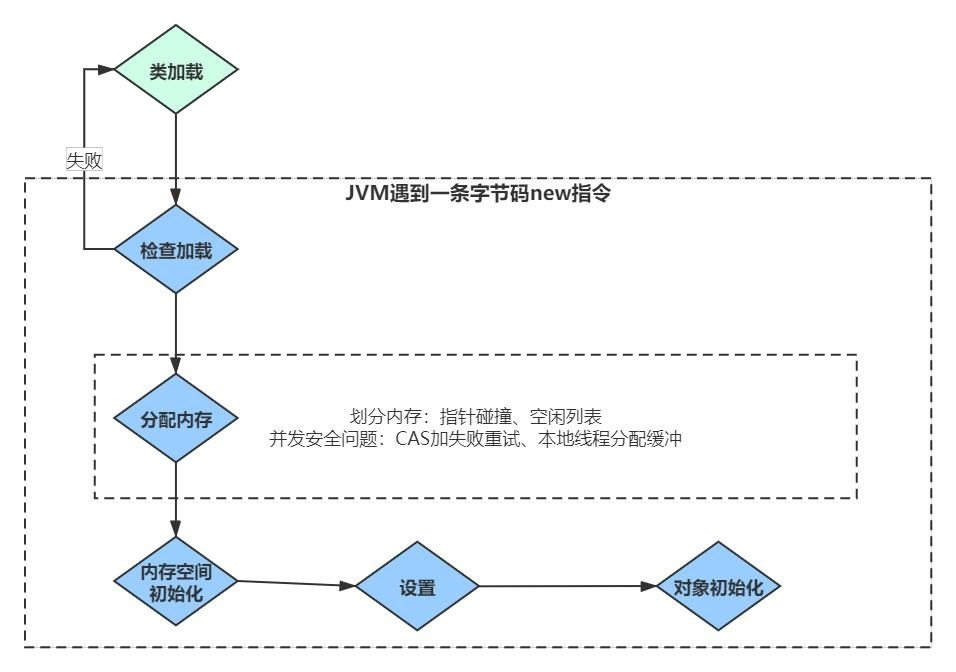
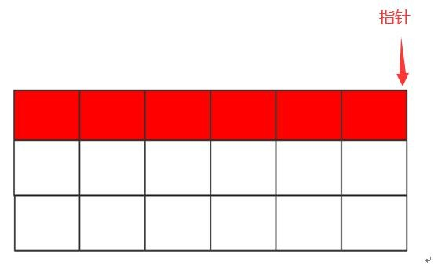
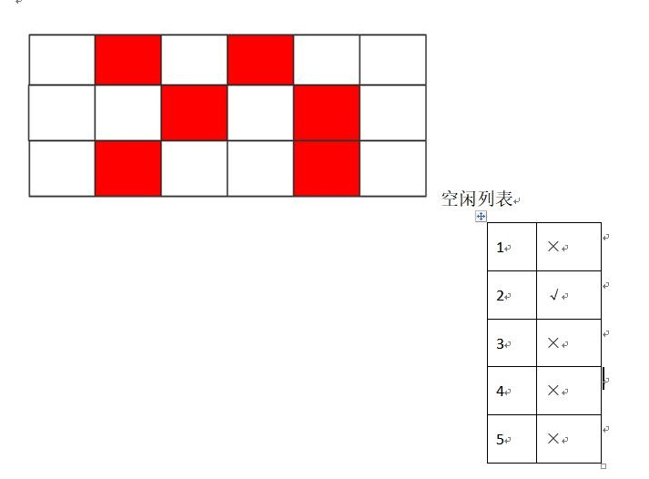
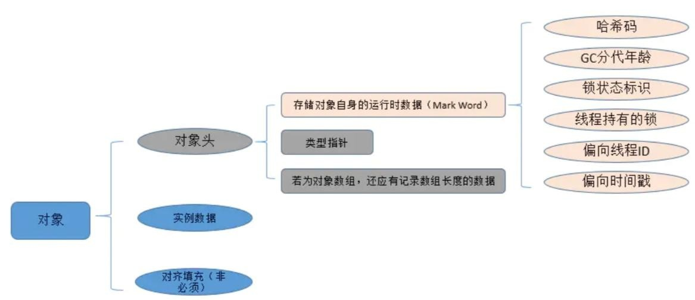
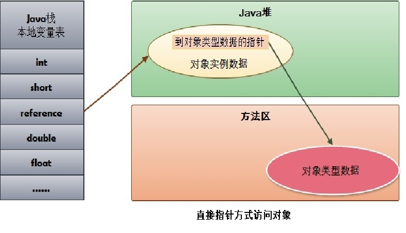
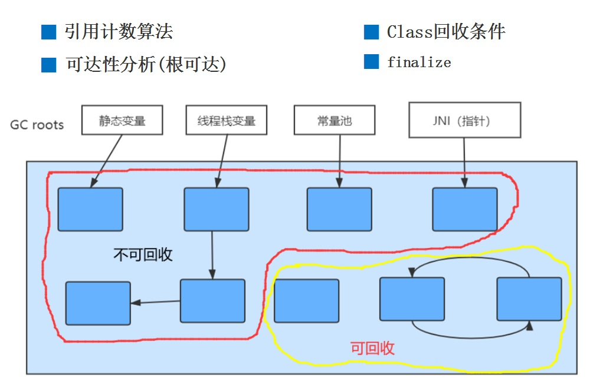
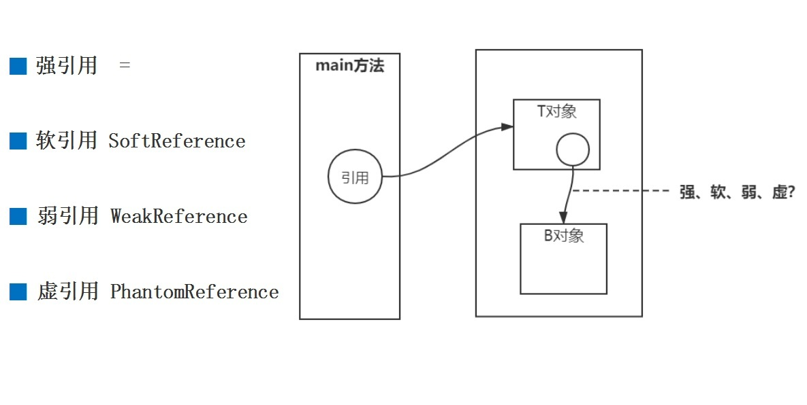
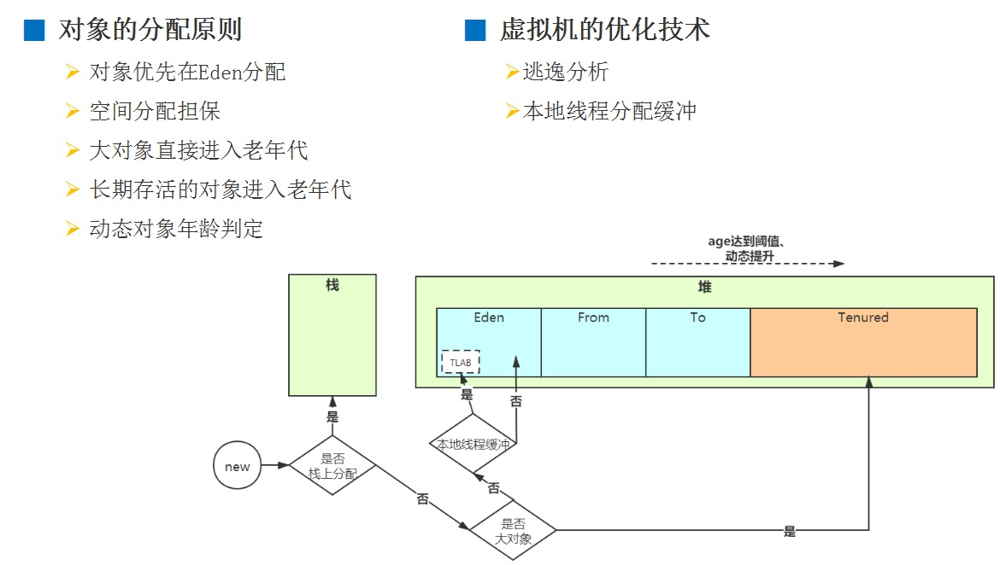
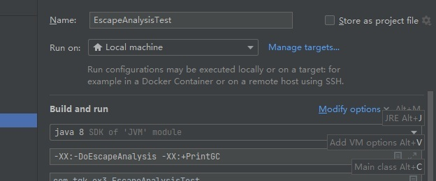
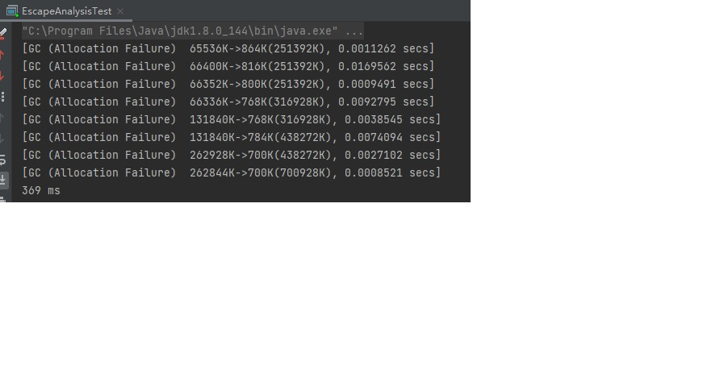

# 3. JVM中的对象及引用

## 3.1 JVM 中对象的创建过程（重点）
<a data-fancybox title="JVM 中对象的创建过程" href="./image/classCreate.jpg"></a>

虚拟机遇到一条 new 指令时，首先检查是否被类加载器加载，如果没有，那必须先执行相应的类加载过程。 类加载就是把 class 加载到 JVM 的运行时数据区的过程

###  3.1.1 检查加载 
首先检查这个指令的参数是否能在常量池中定位到一个类的**符号引用**（符号引用 ：符号引用以一组符号来描述所引用的目标），并且检查类是否已经被加载、 解析和初始化过。
###  3.1.2 分配内存 
接下来虚拟机将为新生对象分配内存。为对象分配空间的任务等同于把一块确定大小的内存从 Java 堆中划分出来。
:::tip 分配内存 
1. <font color='red'><strong>指针碰撞</strong></font>
如果 Java 堆中内存是绝对规整的，所有用过的内存都放在一边，空闲的内存放在另一边，中间放着一个指针作为分界点的指示器，那所分配内存就仅仅 是把那个指针向空闲空间那边挪动一段与对象大小相等的距离，这种分配方式称为“指针碰撞”
<a data-fancybox title="指针碰撞" href="./image/zhizhenpengzhuang.jpg"></a>

2. <font color='red'><strong>空闲列表</strong></font>
如果 Java 堆中的内存并不是规整的，已使用的内存和空闲的内存相互交错，那就没有办法简单地进行指针碰撞了，虚拟机就必须维护一个列表，记录上 哪些内存块是可用的，在分配的时候从列表中找到一块足够大的空间划分给对象实例，并更新列表上的记录，这种分配方式称为“空闲列表”
选择哪种分配方式由 Java 堆是否规整决定，而 Java 堆是否规整又由所采用的垃圾收集器是否带有压缩整理功能决定。   
如果是 <font color='red'><strong>Serial、ParNew 等带有压缩的整理的垃圾回收器的话</strong></font>，系统采用的是指针碰撞，既简单又高效。  
如果是使用 <font color='red'><strong>CMS 这种不带压缩（整理）的垃圾回收器的话</strong></font>，理论上只能采用较复杂的空闲列表。  

<a data-fancybox title="JVM 空闲列表" href="./image/kongxianliebiao.jpg"></a>
:::

:::warning 并发安全
**除如何划分可用空间之外，还有另外一个需要考虑的问题是对象创建在虚拟机中是非常频繁的行为，即使是仅仅修改一个指针所指向的位置，在并发情况下也并不是线程安全的，可能出现正在给对象 A 分配内存，指针还没来得及修改，对象 B 又同时使用了原来的指针来分配内存的情况**     
1. <font color='red'><strong>CAS 机制</strong></font>   
解决这个问题有两种方案，一种是对分配内存空间的动作进行同步处理——实际上虚拟机采用 CAS 配上失败重试的方式保证更新操作的原子性；
<a data-fancybox title="CAS 机制" href="./image/CAS.jpg"></a>

2. <font color='red'><strong>分配缓冲</strong></font>   
另一种是把内存分配的动作按照线程划分在不同的空间之中进行，即每个线程在 Java 堆中预先分配一小块私有内存，也就是本地线程分配缓冲（Thread Local Allocation Buffer,TLAB），JVM 在线程初始化时，同时也会申请一块指定大小的内存，只给当前线程使用，这样每个线程都单独拥有一个 Buffer，如果 需要分配内存，就在自己的 Buffer 上分配，这样就不存在竞争的情况，可以大大提升分配效率，当 Buffer 容量不够的时候，再重新从 Eden 区域申请一块 继续使用。   
TLAB 的目的是在为新对象分配内存空间时，让每个 Java 应用线程能在使用自己专属的分配指针来分配空间，减少同步开销。   
TLAB 只是让每个线程有私有的分配指针，但底下存对象的内存空间还是给所有线程访问的，只是其它线程无法在这个区域分配而已。当一个 TLAB 用满（分 配指针 top 撞上分配极限 end 了），就新申请一个 TLAB。  

**参数：-XX:+UseTLAB 允许在年轻代空间中使用线程本地分配块（TLAB）。默认情况下启用此选项。要禁用 TLAB，请指定-XX:-UseTLAB**  

<a data-fancybox title="分配缓冲" href="https://docs.oracle.com/javase/8/docs/technotes/tools/unix/java.html">https://docs.oracle.com/javase/8/docs/technotes/tools/unix/java.html</a>

<a data-fancybox title="分配缓冲" href="./image/UseTLAB.png"></a>
:::


###  3.1.3 内存空间初始化 
（注意不是构造方法）内存分配完成后，虚拟机需要将分配到的内存空间都初始化为零值(如 int 值为 0，boolean 值为 false 等等)。这一步操作保证了对象 的实例字段在 Java 代码中可以不赋初始值就直接使用，程序能访问到这些字段的数据类型所对应的零值。

###  3.1.4 设置 
接下来，虚拟机要对对象进行必要的设置，例如这个对象是哪个类的实例、如何才能找到类的元数据信息（Java classes 在 Java hotspot VM 内部表示为类 元数据）、对象的哈希码、对象的 GC 分代年龄等信息。这些信息存放在对象的对象头之中。

###  3.1.5 对象初始化 
在上面工作都完成之后，从虚拟机的视角来看，一个新的对象已经产生了，但从 Java 程序的视角来看，对象创建才刚刚开始，所有的字段都还为零值。 所以，一般来说，执行 new 指令之后会接着把对象按照程序员的意愿进行初始化(构造方法)，这样一个真正可用的对象才算完全产生出来。

## 3.2 对象的内存布局（重点）

<a data-fancybox title="对象的内存布局" href="./image/markword.jpg"></a>


在 HotSpot 虚拟机中，对象在内存中存储的布局可以分为 3 块区域： <font color='red'><strong>对象头（Header）、实例数据（Instance Data）和对齐填充（Padding）</strong></font>。   
对象头包括两部分信息，第一部分用于存储对象自身的运行时数据，如 <font color='red'><strong>哈希码（HashCode）、GC 分代年龄、锁状态标志、线程持有的锁、偏向线程 ID、偏向时间戳</strong></font>等。   
对象头的另外一部分是类型指针，即对象指向它的类元数据的指针，虚拟机通过这个指针来确定这个对象是哪个类的实例。 如果对象是一个 java 数组，那么在对象头中还有一块用于记录数组长度的数据。   
第三部分对齐填充并不是必然存在的，也没有特别的含义，它仅仅起着占位符的作用。  
由于 HotSpot VM 的自动内存管理系统要求对对象的大小必须 是 8 字节的整数倍。当对象其他数据部分没有对齐时，就需要通过对齐填充来补全。  
<a data-fancybox title="对象的内存布局" href="./image/objectStructrue.jpg"></a>

## 3.3 对象的访问定位
建立对象是为了使用对象，我们的 Java 程序需要通过栈上的 reference 数据来操作堆上的具体对象。目前主流的访问方式有使用<font color='red'><strong>句柄和直接指针</strong></font>两种。 

### 3.3.1 句柄
如果使用句柄访问的话，那么 Java 堆中将会划分出一块内存来作为句柄池，reference 中存储的就是对象的句柄地址，而句柄中包含了对象实例数据与类 型数据各自的具体地址信息。 使用句柄来访问的最大好处就是 reference 中存储的是稳定的句柄地址，在对象被移动（垃圾收集时移动对象是非常普遍的行为）时只会改变句柄中的实 例数据指针，而 reference 本身不需要修改. 
<a data-fancybox title="分配缓冲" href="./image/jubing.png"></a>

### 3.3.2 直接指针 
如果使用直接指针访问， reference 中存储的直接就是对象地址。 这两种对象访问方式各有优势，使用直接指针访问方式的最大好处就是速度更快，它节省了一次指针定位的时间开销，由于对象的访问在 Java 中非常频 繁，因此这类开销积少成多后也是一项非常可观的执行成本。 对 Sun HotSpot 而言，它是使用直接指针访问方式进行对象访问的。
<a data-fancybox title="直接指针" href="./image/zhijiezhizhen.jpg"></a>

## 3.4 判断对象的存活（重点）

在堆里面存放着几乎所有的对象实例，垃圾回收器在对对进行回收前，要做的事情就是确定这些对象中哪些还是“存活”着，哪些已经“死去”（死去 代表着不可能再被任何途径使用得对象了） 
什么是垃圾？    
C 语言申请内存：malloc free   
C++： new delete C/C++ 手动回收内存   
Java: new   
Java 是自动内存回收，编程上简单，系统不容易出错。   
手动释放内存，容易出两种类型的问题：   
1、忘记回收   
2、多次回收 没有任何引用指向的一个对象或者多个对象（循环引用）  
<a data-fancybox title="判断对象的存活（重点）" href="./image/duixiangshifoucunhuo.jpg"></a>

:::tip  判断对象的存活方式
### 3.4.1 引用计数法  
在对象中添加一个引用计数器，每当有一个地方引用它，计数器就加 1，当引用失效时，计数器减1  
Python 在用，但主流虚拟机没有使用，因为存在对象相互引用的情况，这个时候需要引入额外的机制来处理，这样做影响效率

### 3.4.2 可达性分析  
面试时重要的知识点，牢记） 来判定对象是否存活的。这个算法的基本思路就是通过一系列的称为“GC Roots”的对象作为起始点，从这些节点开始向下搜索，搜索所走过的路径称为<font color='red'><strong>引用链（Reference Chain）</strong></font>，当一个对象到 GC Roots 没有任何引用链相连时，则证明此对象是不可用的。 
作为 GC Roots 的对象包括下面几种（重点是前面 4 种）：     

▶ 虚拟机栈（栈帧中的本地变量表）中引用的对象；各个线程调用方法堆栈中使用到的参数、局部变量、临时变量等。   
▶ 方法区中类静态属性引用的对象；java 类的引用类型静态变量。  
▶ 方法区中常量引用的对象；比如：字符串常量池里的引用。   
▶ 本地方法栈中 JNI（即一般说的 Native 方法）引用的对象。  

▷ JVM 的内部引用（class 对象、异常对象 NullPointException、OutofMemoryError，系统类加载器）。（非重点）   
▷ 所有被同步锁(synchronized 关键)持有的对象。（非重点）   
▷ JVM 内部的 JMXBean、JVMTI 中注册的回调、本地代码缓存等（非重点）   
▷ JVM 实现中的“临时性”对象，跨代引用的对象（在使用分代模型回收只回收部分代的对象，这个后续会细讲，先大致了解概念）（非重点） 以上的回收都是对象    
```java
/**
 * VM Args：-XX:+PrintGC
 * 判断对象存活
 */
public class Isalive {
    public Object instance =null;
    //占据内存，便于判断分析GC
    private byte[] bigSize = new byte[10*1024*1024];

    public static void main(String[] args) {
        //objectA 局部变量表 GCRoots
        Isalive objectA = new Isalive();
        //objectB 局部变量表
        Isalive objectB = new Isalive();
        //相互引用  强引用
        objectA.instance = objectB;
        objectB.instance = objectA;
        //切断可达(切断根可达)
        objectA =null;
        objectB =null;
        //强制垃圾回收
        System.gc();
    }
}

[GC (System.gc())  25725K->880K(251392K), 0.0023247 secs]
//在代码中看到，只保留相互引用的对象还是被回收掉了，说明 JVM 中采用的不是引用计数法。
[Full GC (System.gc())  880K->724K(251392K), 0.0041687 secs]
```

### 3.4.3 类的回收条件
注意 Class 要被回收，条件比较苛刻，必须同时满足以下的条件（仅仅是可以，不代表必然，因为还有一些参数可以进行控制）：   
1、该类所有的实例都已经被回收，也就是堆中不存在该类的任何实例。   
2、 加载该类的 ClassLoader 已经被回收。  
3、 该类对应的 java.lang.Class 对象没有在任何地方被引用，无法在任何地方通过反射访问该类的方法。   
4、 参数控制： 废弃的常量和静态变量的回收其实就和 Class 回收的条件差不多。

### 3.4.4 Finalize 方法（了解）
即使通过可达性分析判断不可达的对象，也不是“非死不可”，它还会处于“缓刑”阶段，真正要宣告一个对象死亡，需要经过两次标记过程，一次是 没有找到与 GCRoots 的引用链，它将被第一次标记。随后进行一次筛选（如果对象覆盖了 finalize），我们可以在 finalize 中去拯救。

```java
/**
 * 对象的自我拯救
 */
public class FinalizeGC {
    public static FinalizeGC instance = null;
    public void isAlive(){
        System.out.println("I am still alive!");
    }
    @Override
    protected void finalize() throws Throwable{
        super.finalize();
        System.out.println("finalize method executed");
        FinalizeGC.instance = this;
    }
    public static void main(String[] args) throws Throwable {
        instance = new FinalizeGC();
        //对象进行第1次GC
        instance =null;
        System.gc();
        Thread.sleep(1000);//Finalizer方法优先级很低，需要等待
        if(instance !=null){
            instance.isAlive();
        }else{
            System.out.println("I am dead！");
        }
        //对象进行第2次GC
        instance =null;
        System.gc();
        Thread.sleep(1000);
        if(instance !=null){
            instance.isAlive();
        }else{
            System.out.println("I am dead！");
        }
    }
}
```
```java
finalize method executed
I am still alive!
I am dead！
```
**可以看到，对象可以被拯救一次(finalize 执行第一次，但是不会执行第二次) 代码改一下，再来一次。**
```java
    //把线程睡眠全部去掉
//执行结果
I am dead！
finalize method executed
I am dead！
```
**对象没有被拯救，这个就是 finalize 方法执行缓慢，还没有完成拯救，垃圾回收器就已经回收掉了。 所以建议大家尽量不要使用 finalize，因为这个方法太不可靠。在生产中你很难控制方法的执行或者对象的调用顺序，建议大家忘了 finalize 方法！因为在 finalize 方法能做的工作，java 中有更好的，比如 try-finally 或者其他方式可以做得更好**

:::  
## 3.5 各种引用

<a data-fancybox title="各种引用" href="./image/reference.jpg"></a>

### 3.5.1 强引用 
一般的 Object obj = new Object() ，就属于强引用。在任何情况下，只有有强引用关联（与根可达）还在，垃圾回收器就永远不会回收掉被引用的对象。

### 3.5.2 软引用 SoftReference
一些有用但是并非必需，用软引用关联的对象，系统将要发生内存溢出（OuyOfMemory）之前，这些对象就会被回收（如果这次回收后还是没有足够的 空间，才会抛出内存溢出）。参见代码： VM 参数 -Xms10m -Xmx10m -XX:+PrintGC

```java
/**
 * 软引用
 * -Xms20m -Xmx20m
 */

public class TestSoftRef {
	//对象
	public static class User{
		public int id = 0;
		public String name = "";
		public User(int id, String name) {
			super();
			this.id = id;
			this.name = name;
		}
		@Override
		public String toString() {
			return "User [id=" + id + ", name=" + name + "]";
		}

	}
	//
	public static void main(String[] args) {
		//new是强引用
		User u = new User(1,"King");
		//软引用
		SoftReference<User> userSoft = new SoftReference<User>(u);
		//干掉强引用，确保这个实例只有userSoft的软引用
		u = null;
		//看一下这个对象是否还在
		System.out.println(userSoft.get());
		//进行一次GC垃圾回收  千万不要写在业务代码中。
		System.gc();
		System.out.println("After gc");
		System.out.println(userSoft.get());
		//往堆中填充数据，导致OOM
		List<byte[]> list = new LinkedList<>();
		try {
			for(int i=0;i<100;i++) {
				//System.out.println("*************"+userSoft.get());
				list.add(new byte[1024*1024*1]); //1M的对象 100m
			}
		} catch (Throwable e) {
			//抛出了OOM异常时打印软引用对象
			System.out.println(e.getClass()+":"+e.getMessage());
			//系统将要发生内存溢出（OuyOfMemory）之前，这些对象就会被回收
			System.out.println("Exception*************"+userSoft.get());
		}

	}
```
```java

User [id=1, name=King]
After gc
User [id=1, name=King]
//系统将要发生内存溢出（OuyOfMemory）之前，这些对象就会被回收
class java.lang.OutOfMemoryError:Java heap space
Exception*************null
```

例如，一个程序用来处理用户提供的图片。如果将所有图片读入内存，这样虽然可以很快的打开图片，但内存空间使用巨大，一些使用较少的图片浪费 内存空间，需要手动从内存中移除。如果每次打开图片都从磁盘文件中读取到内存再显示出来，虽然内存占用较少，但一些经常使用的图片每次打开都 要访问磁盘，代价巨大。这个时候就可以用**软引用构建缓存**

### 3.5.3 弱引用 WeakReference 
一些有用（程度比软引用更低）但是并非必需，用弱引用关联的对象，只能生存到下一次垃圾回收之前，GC 发生时，不管内存够不够，都会被回收。

```java
/**
 * 弱引用
 */
public class TestWeakRef {
	public static class User{
		public int id = 0;
		public String name = "";
		public User(int id, String name) {
			super();
			this.id = id;
			this.name = name;
		}
		@Override
		public String toString() {
			return "User [id=" + id + ", name=" + name + "]";
		}

	}
	public static void main(String[] args) {
		User u = new User(1,"King");
		WeakReference<User> userWeak = new WeakReference<User>(u);
		//干掉强引用，确保这个实例只有userWeak的弱引用
		u = null;
		System.out.println(userWeak.get());
		//进行一次GC垃圾回收,千万不要写在业务代码中。
		System.gc();
		System.out.println("After gc");
		System.out.println(userWeak.get());
	}
}
```
```java
User [id=1, name=King]
//GC 发生时，不管内存够不够，都会被回收
After gc
null
```
### 3.5.4 虚引用 PhantomReference 

幽灵引用，最弱（随时会被回收掉） 垃圾回收的时候收到一个通知，就是为了监控垃圾回收器是否正常工作。


**注意：** 软引用 SoftReference 和弱引用 WeakReference，可以用在内存资源紧张的情况下以及创建不是很重要的数据缓存。
当系统内存不足的时候，缓存 中的内容是可以被释放的。 <font color='red'><strong>实际运用（WeakHashMap、ThreadLocal）</strong></font>

## 3.6 对象的分配策略

<a data-fancybox title="对象的分配策略" href="./image/fenpei.jpg"></a>

### 3.6.1 栈上分配 


没有逃逸（了解即可） 即方法中的对象没有发生逃逸  

逃逸分析的原理：分析对象动态作用域，当一个对象在方法中定义后，它可能被外部方法所引用。 

比如：调用参数传递到其他方法中，这种称之为方法逃逸。甚至还有可能被外部线程访问到，例如：赋值给其他线程中访问的变量，这个称之为线程逃逸。

从不逃逸到方法逃逸到线程逃逸，称之为对象由低到高的不同逃逸程度。 如果确定一个对象不会逃逸出线程之外，那么让对象在栈上分配内存可以提高 JVM 的效率。
```java
/**
 * 逃逸分析-栈上分配
 * -XX:+DoEscapeAnalysis -XX:+PrintGC
 * -XX:-DoEscapeAnalysis关闭逃逸
 */
public class EscapeAnalysisTest {
    public static void main(String[] args) throws Exception {
        long start = System.currentTimeMillis();
        for (int i = 0; i < 50000000; i++) {//5000万次---5000万个对象
            allocate();
        }
        System.out.println((System.currentTimeMillis() - start) + " ms");
        Thread.sleep(600000);
    }

    static void allocate() {
        //逃逸分析（不会逃逸出方法）
        //这个myObject引用没有出去，也没有其他方法使用
        MyObject myObject = new MyObject(2020, 2020.6);
    }

    static class MyObject {
        int a;
        double b;

        MyObject(int a, double b) {
            this.a = a;
            this.b = b;
        }
    }
}
```
**逃逸分析代码**  
这段代码在调用的过程中 Myboject 这个对象属于不可逃逸，JVM 可以做栈上分配  
然后通过开启和关闭 DoEscapeAnalysis 开关观察不同。  

开启逃逸分析（JVM 默认开启）   

<a data-fancybox title="栈上分配开启逃逸" href="./image/taoyi.jpg"></a>

查看执行速度  
<a data-fancybox title="栈上分配开启逃逸" href="./image/taoyi1.jpg"></a>

关闭逃逸分析  
<a data-fancybox title="栈上分配关闭逃逸" href="./image/taoyi3.jpg"></a>

查看执行速度  
<a data-fancybox title="栈上分配关闭逃逸" href="./image/taoyi4.jpg"></a>


### 3.6.2 对象优先在 Eden 区分配

大多数情况下，对象在新生代 Eden 区中分配。当 Eden 区没有足够空间分配时，虚拟机将发起一次 Minor GC。

### 3.6.3 大对象直接进入老年代

大对象就是指需要大量连续内存空间的 Java 对象，最典型的大对象便是那种很长的字符串，或者元素数量很庞大的数组。   
大对象对虚拟机的内存分配来说就是一个不折不扣的坏消息，比遇到一个大对象更加坏的消息就是遇到- -群“朝生夕灭”的“短命大对象”，我们写程序 的时候应注意避免。   
在 Java 虚拟机中要避免大对象的原因是，在分配空间时，它容易导致内存明明还有不少空间时就提前触发垃圾收集，以获取足够的连续空间才能安置好它们。   
而当复制对象时，大对象就意味着高额的内存复制开销。   
HotSpot 虚拟机提供了 <font color='red'><strong>-XX:PretenureSizeThreshold</strong></font> 参数，指定大于该设置值的对象直接在老年代分配，这样做的目的就是避免在 Eden 区及两个 Survivor 区之间来回复制，产生大量的内存复制操作。   
这样做的目的：  
1.避免大量内存复制  
2.避免提前进行垃圾回收，明明内存有空间进行分配。   
PretenureSizeThreshold 参数只对 Serial 和 ParNew 两款收集器有效。-XX:PretenureSizeThreshold=4m  

### 3.6.4 长期存活对象进入老年区

HotSpot虚拟机中多数收集器都采用了分代收集来管理堆内存，那内存回收时就必须能决策哪些存活对象应当放在新生代，哪些存活对象放在老年代中。 为做到这点，虚拟机给每个对象定义了一个对象年龄(Age)计数器，存储在对象头中。
如果对象在 Eden 出生并经过第一次 Minor GC 后仍然存活，并且能被 Survivor 容纳的话，将被移动到Survivor空间中，并将对象年龄设为 1，对象在 Survivor 区中每熬过一次 Minor GC，年龄就增加 1，当它的年龄增加到**一定程度(并发的垃圾回收器默认为 15),CMS 是 6**时，就会被晋升到老年代中。 **-XX:MaxTenuringThreshold 调整**

### 3.6.5 对象年龄动态判定

为了能更好地适应不同程序的内存状况，虚拟机并不是永远地要求对象的年龄必须达到了 MaxTenuringThreshold 才能晋升老年代，如果在 Survivor （from to ）空间中 相同年龄所有对象大小的总和大于 Survivor 空间的一半，年龄大于或等于该年龄的对象就可以直接进入老年代，无须等到 MaxTenuringThreshold 中要求的年龄


### 3.6.6 空间分配担保

在发生 Minor GC 之前，虚拟机会先检查老年代最大可用的连续空间是否大于新生代所有对象总空间，如果这个条件成立，那么 Minor GC 可以确保是安全 的。如果不成立，则虚拟机会查看 HandlePromotionFailure 设置值是否允许担保失败。如果允许，那么会继续检查老年代最大可用的连续空间是否大于历 次晋升到老年代对象的平均大小，如果大于，将尝试着进行一次 Minor GC，尽管这次 Minor GC 是有风险的，如果担保失败则会进行一次 Full GC；如果小 于，或者 HandlePromotionFailure 设置不允许冒险，那这时也要改为进行一次 Full GC。

### 3.6.7 本地线程分配缓冲(TLAB)

