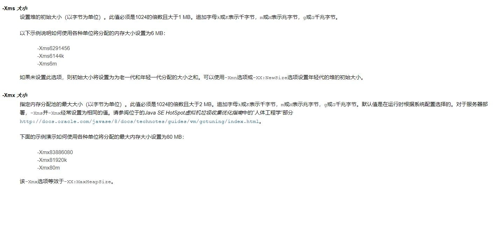

# 1. JVM基础知识

## 1.1 JVM 从编译到执行 

### 1.1.1 Java 程序的执行过程 
一个 Java 程序，首先经过 **javac** 编译成 **.class 文件**，然后 **JVM 将其加载到方法区**，**执行引擎**将会执行这些字节码。执行时，会翻译成操作系统相关的函数。**JVM 作为 .class 文件的翻译器存在，输入字节码，调用操作系统函数**。 
过程如下：**Java 文件->编译器>字节码->JVM->机器码**。 JVM 全称 Java Virtual Machine，也就是我们耳熟能详的 Java 虚拟机。它能识别 .class 后缀的文件，并且能够解析它的指令，最终调用操作系统上的函数，完成我们想要的操作

<a data-fancybox title="JAVA程序的执行过程" href="./image/jvmruning.jpg"></a> 

### 1.1.2 JVM、JRE、JDK 的关系 
<font color='red'><strong>JVM</strong></font> 只是一个翻译，把 Class 翻译成机器识别的代码，但是需要注意，JVM 不会自己生成代码，需要大家编写代码，同时需要很多依赖类库，这个时候就需要用到 JRE。 

<font color='red'><strong>JRE</strong></font> 是什么，它除了包含 JVM 之外，提供了**很多的类库**（就是我们说的 jar 包，它可以提供一些即插即用的功能，比如读取或者操作文件，连接网络， 使用 I/O 等等之类的）这些东西就是 JRE 提供的基础类库。JVM 标准加上实现的一大堆基础类库，就组成了 Java 的运行时环境，也就是我们常说的 JRE （Java Runtime Environment）。  

但对于程序员来说，JRE 还不够。我写完要编译代码，还需要调试代码，还需要打包代码、有时候还需要反编译代码。所以我们会使用 JDK，因为 <font color='red'><strong>JDK</strong></font> 还提供了一些非常好用的小工具，比如 <font color='red'><strong>javac（编译代码）、java、jar （打包代码）、javap（反编译(反汇编)）</strong></font>等。这个就是 JDK。 具体可以文档可以通过官网去下载：<a href="https://www.oracle.com/java/technologies/javase-jdk8-doc-downloads.html"> https://www.oracle.com/java/technologies/javase-jdk8-doc-downloads.html</a>   

JVM 的作用是：从软件层面屏蔽不同操作系统在底层硬件和指令的不同。这个就是我们在宏观方面对 JVM 的一个认识。   
**同时 JVM 是一个虚拟化的操作系统，类似于 Linux 或者 Windows 的操作系统，只是它架在操作系统上，接收字节码也就是 class，把字节码翻译成操作系统上的 机器码且进行执行**


### 1.1.3 JVM跨平台到跨语言 

<font color='blue'><strong>跨平台</strong></font>：我们写的一个类，在不同的操作系统上（Linux、Windows、MacOS 等平台）执行，效果是一样，这个就是 JVM 的跨平台性。 为了实现跨平台型，不同操作系统有对应的 JDK 的版本。 <a href="https://www.oracle.com/java/technologies/javase/javase-jdk8-downloads.html">https://www.oracle.com/java/technologies/javase/javase-jdk8-downloads.html</a>

<a data-fancybox title="从跨平台到跨语言" href="./image/jvmCrossplatform.jpg"></a> 

<font color='blue'><strong>跨语言（语言无关性)</strong></font>：JVM 只识别字节码，所以 JVM 其实跟语言是解耦的，也就是没有直接关联，JVM 运行不是翻译 Java 文件，而是识别 class 文 件，这个一般称之为字节码。还有像 <font color='red'><strong>Groovy 、Kotlin、Scala</strong></font> 等等语言，它们其实也是编译成字节码，所以它们也可以在 JVM 上面跑，这个就是 JVM 的跨 语言特征。Java 的跨语言性一定程度上奠定了非常强大的 java 语言生态圈。

#### 常见的 JVM 实现
<font color='red'><strong>Hotspot</strong></font>：目前使用的最多的 Java 虚拟机。在命令行 java –version。它会输出你现在使用的虚拟机的名字、版本等信息、执行模式。   
<font color='blue'><strong>Jrocket</strong></font>：原来属于BEA 公司，曾号称世界上最快的 JVM，后被 Oracle 公司收购，合并于 Hotspot   
<font color='blue'><strong>J9</strong></font>: IBM 有自己的 java 虚拟机实现，它的名字叫做 J9. 主要是用在 IBM 产品（IBM WebSphere 和 IBM 的 AIX 平台上）   
<font color='blue'><strong>TaobaoVM</strong></font>: 只有一定体量、一定规模的厂商才会开发自己的虚拟机，比如淘宝有自己的 VM,它实际上是 Hotspot 的定制版，专门为淘宝准备的，阿里、天 猫都是用的这款虚拟机。   
<font color='blue'><strong>LiquidVM</strong></font>: 它是一个针对硬件的虚拟机，它下面是没有操作系统的（不是 Linux 也不是 windows）,下面直接就是硬件，运行效率比较高。   
<font color='blue'><strong>zing</strong></font>: 它属于 zual 这家公司，非常牛，是一个商业产品，很贵！它的垃圾回收速度非常快（1 毫秒之内），是业界标杆。它的一个垃圾回收的算法后来被 **Hotspot 吸收才有了现在的 ZGC**。   

## 1.2 JVM 整体概述

JVM 能涉及非常庞大的一块知识体系，比如<font color='red'><strong>内存结构、垃圾回收、类加载、性能调优、JVM 自身优化技术、执行引擎、类文件结构、监控工具等</strong></font>。   

但是在所有的知识体系中，都或多或少跟内存结构有一定的关系： 比如<font color='red'><strong>垃圾回收回收的就是内存、类加载加载到的地方也是内存、性能优化也涉及到内存优化、执行引擎与内存密不可分、类文件结构与内存的设计有关系，监控工具也会监控内存</strong></font>。所以**内存结构处于 JVM 中核心位置**。也是属于我们入门 JVM 学习的最好的选择。   

<font color='blue'><strong>同时 JVM 是一个虚拟化的操作系统，所以除了要虚拟指令之外，最重要的一个事情就是需要虚拟化内存，这个虚拟化内存就是我们马上要讲到的 JVM 的内存区域</strong></font>。

<!-- ## <font color='red'>JVM 的内存区域 </font> -->
## 1.3 JVM 的内存区域

### 1.3.1 运行时数据区域


<a data-fancybox title="运行时数据区域" href="./image/runingdata.jpg"></a> 

**运行时数据区的定义**：Java 虚拟机在执行 Java 程序的过程中会把它所管理的内存划分为若干个不同的数据区域 Java 引以为豪的就是它的**自动内存管理机制**。相比于 C++的手动内存管理、复杂难以理解的指针等，Java 程序写起来就方便的多。 所以要深入理解 JVM 必须理解内存虚拟化的概念。
 在 JVM 中，**JVM 内存**主要分为<font color='blue'><strong>堆、程序计数器、方法区、虚拟机栈和本地方法栈等</strong></font>。   
 同时按照与线程的关系也可以这么划分区域：   
 线程私有区域：一个线程拥有单独的一份内存区域。   
 线程共享区域：被所有线程共享，且只有一份。   
 这里还有一个直接内存，这个虽然不是运行时数据区的一部分，但是会被频繁使用。  
 你可以理解成没有被虚拟机化的操作系统上的其他内存（比如操作 系统上有 8G 内存，被 JVM 虚拟化了 3G，那么还剩余 5G， JVM 是借助一些工具使用这 5G 内存的，这个内存部分称之为直接内存）

 ```java
 public class MethodAndStack {
    public static void main(String[] args) {
        A();
    }
    public static void A(){
        B();
    }
    public static void B(){
        C();
    }
    public static void C(){ }
}
```
这段代码很简单，就是起一个 main 方法，在 main 方法运行中调用 A 方法，A 方法中调用 B 方法，B 方法中运行 C 方法。 我们把代码跑起来，线程 1 来运行这段代码， 线程 1 跑起来，就会有一个对应 的虚拟机栈，同时在执行每个方法的时候都会打包成一个栈帧。 比如 main 开始运行，打包一个栈帧送入到虚拟机栈

**整过过程就是一个进栈出栈的过程**
 main 方法运行中调用 A 方法，A 方法中调用 B 方法，B 方法中运行 C 方法--进栈  
 C 方法运行完了，C 方法出栈，接着 B 方法运行完了，B 方法出栈、接着 A 方法运行完了，A 方法出栈，最后 main 方法运行完了，main 方法这个栈帧就 出栈  

<a data-fancybox title="JAVA程序的执行过程" href="./image/jvmstack.jpg"></a> 

C 方法运行完了，C 方法出栈，接着 B 方法运行完了，B 方法出栈、接着 A 方法运行完了，A 方法出栈，最后 main 方法运行完了，main 方法这个栈帧就 出栈了。 这个就是 Java 方法运行对虚拟机栈的一个影响。虚拟机栈就是用来存储线程运行方法中的数据的。而每一个方法对应一个栈帧。

### 1.3.2 虚拟机栈 

**栈的数据结构**：先进后出(FILO)的数据结构   
**虚拟机栈的作用**：在 JVM 运行过程中存储当前线程运行方法所需的数据，指令、返回地址   
**虚拟机栈是基于线程的**：哪怕你只有一个 main() 方法，也是以线程的方式运行的。在线程的生命周期中，参与计算的数据会频繁地入栈和出栈，栈的生命周期是和线程一样的   
虚拟机栈的大小缺省为 1M，可用参数 –Xss 调整大小，例如-Xss256k。 参数官方文档（JDK1.8）：https://docs.oracle.com/javase/8/docs/technotes/tools/unix/java.html


<font color='blue'><strong>操作系统</strong></font>  
<font color='red'><strong>cpu+缓存+主内存</strong></font>  

<font color='blue'><strong>jvm模拟操作系统</strong></font>  
<font color='red'><strong>jvm执行引擎+操作数栈+堆、栈</strong></font>  


**栈帧**：在每个 Java 方法被调用的时候，都会创建一个栈帧，并入栈。一旦方法完成相应的调用，则出栈

**栈帧大体都包含四个区域**：**(局部变量表、操作数栈、动态连接、返回地址)**

1. **局部变量表**: 顾名思义就是局部变量的表，用于存放我们的局部变量的（方法中的变量）。首先它是一个 32 位的长度，主要存放我们的 Java 的八大基础数据 类型，一般 32 位就可以存放下，如果是 64 位的就使用高低位占用两个也可以存放下，如果是局部的一些对象，比如我们的 Object 对象，我们只需要存放它的一个引用地址即可。

2. **操作数据栈**： 存放 java 方法执行的操作数的，它就是一个栈，先进后出的栈结构，操作数栈，就是用来操作的，操作的的元素可以是任意的 java 数据类型，所 以我们知道一个方法刚刚开始的时候，这个方法的操作数栈就是空的。 <font color='blue'><strong>操作数栈本质上是 JVM 执行引擎的一个工作区，也就是方法在执行，才会对操作数栈进行操作</strong></font>，如果代码不不执行，操作数栈其实就是空的。 

3. **动态连接**: Java 语言特性多态（后续章节细讲，需要结合 class 与执行引擎一起来讲）。 

4. **返回地址**: 正常返回（调用程序计数器中的地址作为返回）、异常的话（通过异常处理器表<非栈帧中的>来确定） 

同时，虚拟机栈这个内存也不是无限大，它有大小限制，默认情况下是 1M。 如果我们不断的往虚拟机栈中入栈帧，但是就是不出栈的话，那么这个虚拟机栈就会爆掉。

```java
public class StackError {
    public static void main(String[] args) {
        A();
    }
    public static void A(){
        A();
    }
}
```
Exception in thread "main" java.lang.StackOverflowError

```java
public class Person {
    public Person() {
    }

    public int work() throws Exception {
        int x = 1;
        int y = 2;
        int z = (x + y) * 10;
        return z;
    }

    public static void main(String[] args) throws Exception {
        Person person = new Person();
        person.work();
        person.hashCode();
    }
}
```
<a data-fancybox title="JAVA程序的执行过程" href="./image/jvmmemory1.jpg"></a> 

<a data-fancybox title="JAVA程序的执行过程" href="./image/person.jpg"></a> 
在 JVM 中，基于解释执行的这种方式是基于栈的引擎，这个说的栈，就是操作数栈。


**虚拟机栈**： 每个线程私有的，线程在运行时，在执行每个方法的时候都会打包成一个栈帧，存储了局部变量表，操作数栈，动态链接，方法出口等信息，然后放入栈。每个时刻正在执行的当前方法就是虚拟机栈顶的栈桢。方法的执行就对应着栈帧在虚拟机栈中入栈和出栈的过程。 栈的大小缺省为 1M，可用参数 –Xss 调整大小，例如-Xss256k     
在编译程序代码的时候，栈帧中需要多大的局部变量表，多深的操作数栈都已经完全确定了，并且写入到方法表的 Code 属性之中，因此一个栈帧需要分 配多少内存，不会受到程序运行期变量数据的影响，而仅仅取决于具体的虚拟机实现。   

<font color='red'><strong>局部变量表</strong></font>:顾名思义就是局部变量的表，用于存放我们的局部变量的。首先它是一个 32 位的长度，主要存放我们的 Java 的八大基础数据类型，一般 32 位就可以存放下，如果是 64 位的就使用高低位占用两个也可以存放下，如果是局部的一些对象，比如我们的 Object 对象，我们只需要存放它的一个引用 地址即可。（基本数据类型、对象引用、returnAddress 类型） 

<font color='red'><strong>操作数据栈</strong></font>：存放我们方法执行的操作数的，它就是一个栈，先进后出的栈结构，操作数栈，就是用来操作的，操作的的元素可以是任意的 java 数据类 型，所以我们知道一个方法刚刚开始的时候，这个方法的操作数栈就是空的，操作数栈运行方法是会一直运行入栈/出栈的操作 

<font color='red'><strong>动态连接</strong></font>:Java 语言特性多态（需要类加载、运行时才能确定具体的方法，后续有详细的讲解）动态分派 完成出口(返回地址): 

<font color='red'><strong>正常返回</strong></font>：（调用程序计数器中的地址作为返回）   
三步曲：   
恢复上层方法的局部变量表和操作数栈、  
把返回值（如果有的话）压入调用者栈帧的操作数栈中、   
调整程序计数器的值以指向方法调用指令后面的一条指令、   
异常的话：（通过异常处理表<非栈帧中的>来确定）  


## 1.4 运行时数据区及JVM的整体内存结构 

<a data-fancybox title="JVM 的整体内存结构 " href="./image/jvmmemory2.jpg"></a> 

### 1.4.1 本地方法栈 
本地方法栈跟 Java 虚拟机栈的功能类似，Java 虚拟机栈用于管理 Java 函数的调用，而本地方法栈则用于管理本地方法的调用。
但<font color='red'><strong>本地方法并不是用 Java 实现的，而是由 C 语言实现的(比如 Object.hashcode 方法)</strong></font>。 本地方法栈是和虚拟机栈非常相似的一个区域，它服务的对象是 native 方法。你甚至可以认为虚拟机栈和本地方法栈是同一个区域。
虚拟机规范无强制规定，各版本虚拟机自由实现 ，HotSpot 直接把本地方法栈和虚拟机栈合二为一 。

### 1.4.2 方法区 
 方法区（Method Area）是可供各条线程共享的运行时内存区域。它存储了每一个类的结构信息，例如运行时常量池（Runtime Constant Pool） 字段和方法数据、构造函数和普通方法的字节码内容、还包括一些在类、实例、接口初始化时用到的特殊方法 方法区是 JVM 对内存的“逻辑划分”，
 在 JDK1.7 及之前很多开发者都习惯将方法区称为“永久代”，是因为在 HotSpot 虚拟机中，设计人员使用了永 久代来实现了 JVM 规范的方法区。  
 在 JDK1.8 及以后使用了元空间来实现方法区。   
 
 #### 1.4.2.1 元空间（class metadata）
 方法区与堆空间类似，也是一个共享内存区，所以方法区是线程共享的。假如两个线程都试图访问方法区中的同一个类信息，而这个类还没有装入 JVM，那么此时就只允许一个线程去加载它，另一个线程必须等待。   

 在 HotSpot 虚拟机、Java7 版本中已经将永久代的静态变量和运行时常量池转移到了堆中，其余部分则存储在 JVM 的非堆内存中，而 Java8 版本 已经将方法区中实现的永久代去掉了，
 并用**元空间（class metadata）代替了之前的永久代**，并且元空间的存储位置是本地内存。 
 元空间大小参数：   
 jdk1.7 及以前（初始和最大值）：-XX:PermSize；-XX:MaxPermSize；   
 jdk1.8 以后（初始和最大值）：-XX:MetaspaceSize； -XX:MaxMetaspaceSize   
 jdk1.8 以后大小就只受本机总内存的限制（如果不设置参数的话）     
 <a data-fancybox title="JVM 参数参考" href=" https://docs.oracle.com/javase/8/docs/technotes/tools/unix/java.html"> JVM 参数参考：https://docs.oracle.com/javase/8/docs/technotes/tools/unix/java.html</a> 


 Java8 为什么使用元空间替代永久代，这样做有什么好处呢？ 官方给出的解释是： 移除永久代是为了融合 HotSpot JVM 与 JRockit VM 而做出的努力，因为 JRockit 没有永久代，所以不需要配置永久代。 
 
 永久代内存经常不够用或发生内存溢出，抛出异常 **java.lang.OutOfMemoryError: PermGen**。这是因为在 JDK1.7 版本中，指定的 PermGen 区大小为8M，由于 PermGen 中类的元数据信息在每次 FullGC 的时候都可能被收集，回收率都偏低，成绩很难令人满意；还有为 PermGen 分配多大的空间很难 确定，**PermSize 的大小依赖于很多因素，比如，JVM 加载的 class 总数、常量池的大小和方法的大小等**。 
 
 ### 1.4.3 运行时常量池 
 
 运行时常量池（Runtime Constant Pool）是每一个类或接口的常量池（Constant_Pool）的运行时表示形式，它包括了若干种不同的常量：从编 译期可知的数值字面量到必须运行期解析后才能获得的方法或字段引用。  

 运行时常量池是方法区的一部分。运行时常量池相对于 Class 常量池的另外一个重要特征是具备动态性（Class 常量池在类加载章节会具体讲）。 
 
 ### 1.4.4 堆
 堆是 JVM 上最大的内存区域，我们申请的几乎所有的对象，都是在这里存储的。我们常说的垃圾回收，操作的对象就是堆。 
 堆空间一般是程序启动时，就申请了，但是并不一定会全部使用。堆一般设置成可伸缩的。

随着对象的频繁创建，堆空间占用的越来越多，就需要不定期的对不再使用的对象进行回收。这个在 Java 中，就叫作 GC（Garbage Collection）。 
  
那一个对象创建的时候，到底是在堆上分配，还是在栈上分配呢？这和两个方面有关：对象的类型和在 Java 类中存在的位置。 
Java 的对象可以分为基本数据类型和普通对象。 对于普通对象来说，JVM 会首先在堆上创建对象，然后在其他地方使用的其实是它的引用。
比如，把这个引用保存在虚拟机栈的局部变量表中。 对于基本数据类型来说（byte、short、int、long、float、double、char)，有两种情况。 
当你在方法体内声明了基本数据类型的对象，它就会在栈上直接分配。其他情况，都是在堆上分配。 

**堆大小参数：**
 -Xms：堆的最小值； 
 -Xmx：堆的最大值； 
 -Xmn：新生代的大小； 
 -XX:NewSize；新生代最小值；
-XX:MaxNewSize：新生代最大值； 例如- Xmx256m 

<a data-fancybox title="heap" href="./image/heap.jpg"></a> 


### 1.4.5 直接内存（堆外内存） 
直接内存有一种更加科学的叫法，堆外内存。 

JVM 在运行时，会从操作系统申请大块的堆内存，进行数据的存储；同时还有虚拟机栈、本地方法栈和程序计数器，这块称之为栈区。操作系统剩余的 内存也就是堆外内存。 

它不是虚拟机运行时数据区的一部分，也不是 java 虚拟机规范中定义的内存区域；如果使用了 NIO,这块区域会被频繁使用，

在 java 堆内可以用directByteBuffer 对象直接引用并操作； 这块内存不受 java 堆大小限制，但受本机总内存的限制，可以通过-XX:MaxDirectMemorySize 来设置（默认与堆内存最大值一样），所以也会出现 OOM 异常。


**小结**： 
1. 直接内存主要是通过 DirectByteBuffer 申请的内存，可以使用参数“MaxDirectMemorySize”来限制它的大小。   
2. 其他堆外内存，主要是指使用了 Unsafe 或者其他 JNI 手段直接直接申请的内存。   
堆外内存的泄漏是非常严重的，它的排查难度高、影响大，甚至会造成主机的死亡。后续章节会详细讲。  
 同时，要注意 Oracle 之前计划在 Java 9 中去掉 sun.misc.Unsafe API。这里删除 sun.misc.Unsafe 的原因之一是使 Java 更加安全，并且有替代方案。 目前我们主要针对的 JDK1.8，JDK1.9 暂时不放入讨论范围中，我们大致知道 java 的发展即可。  

