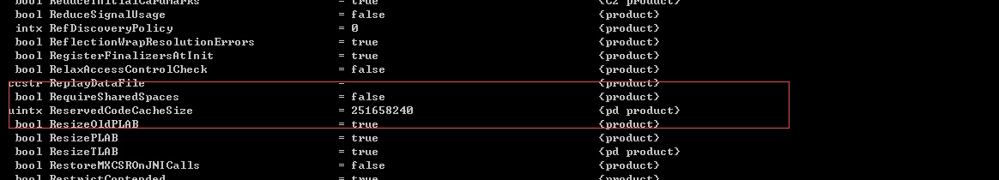
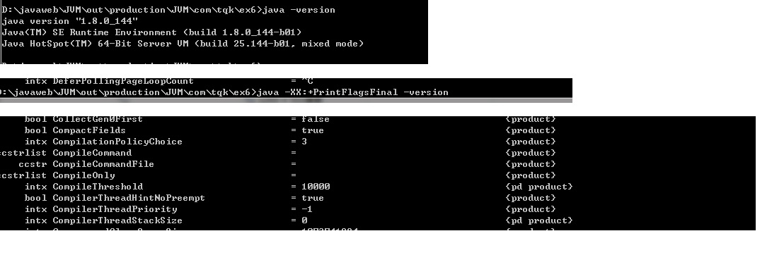

# 15 JVM编译技术原理

## 15.1 解释执行与 JIT
Java 程序在运行的时候，主要就是执行字节码指令，一般这些指令会按照顺序解释执行，这种就是**解释执行**  

那些被频繁调用的代码，比如调用次数很高或者在 for 循环里的那些代码,如果按照解释执行，效率是非常低的。以上的这些代码称为热点代码。所以为了提高热点代码的执行效率，在运行时虚拟机将会把这些代码编译成与本地平台相关的机器码，并进行各种层次的优化。 完成这个任务的编译器，就称为即时编译器（Just In Time Compiler），简称**JIT编译器**
## 15.2 即时编译器类型
在 HotSpot 虚拟机中，内置了两个 JIT，分别为 C1 编译器和 C2 编译器。
## 15.2.1 C1 编译器
C1 编译器是一个简单快速的编译器，主要的关注点在于局部性的优化，适用于执行时间较短或对启动性能有要求的程序，例如GUI 应用对界面启动速度就有一定要求，C1也被称为 Client Compiler

## 15.2.2 C2 编译器
C2 编译器是为长期运行的服务器端应用程序做性能调优的编译器，适用于执行时间较长或对峰值性能有要求的程序。根据各自的适配性，这种即时编译 也被称为 Server Compiler

## 15.3 热点代码
热点代码，就是那些被频繁调用的代码，比如调用次数很高或者在 for 循环里的那些代码。这些再次编译后的机器码会被缓存起来以备下次使用，但对于那些执行次数很少的代码来说，这种编译动作就纯属浪费。 

JVM 提供了一个参数<font color='red'><strong>-XX:ReservedCodeCacheSize</strong></font>，用来限制 CodeCache 的大小。也就是说JIT 编译后的代码都会放在 CodeCache 里。 如果这个空间不足JIT 就无法继续编译，编译执行会变成解释执行，性能会降低一个数量级。同时JIT 编译器会一直尝试去优化代码，从而造成了 CPU 占用上升 

<font color='red'><strong>通过 java -XX:+PrintFlagsFinal –version 查询</strong></font>
<a data-fancybox title="热点代码" href="./image/ReservedCodeCacheSize.jpg"></a>

### 15.3.1 热点探测  
在HotSpot虚拟机中的热点探测是JIT优化的条件，热点探测是基于**计数器的热点探测**，采用这种方法的虚拟机会为每个方法建立计数器统计方法的执行次数，如果执行次数超过一定的阈值就认为它是<font color='red'><strong>热点方法</strong></font>
虚拟机为每个方法准备了两类计数器：<font color='red'><strong>方法调用计数器（Invocation Counter）</strong></font>和<font color='red'><strong>回边计数器（Back Edge Counter）</strong></font>
在确定虚拟机运行参数的前提下，这两个计数器都有一个确定的阈值，当计数器超过阈值溢出了，就会触发 JIT 编译。

### 15.3.1.1 方法调用计数器
用于统计方法被调用的次数，方法调用计数器的默认阈值在客户端模式下是1500次，在服务端模式下是 10000 次(我们用的都是服务端，java –version 查询)，可通过 -XX: CompileThreshold 来设定 

<font color='red'><strong>通过 java -XX:+PrintFlagsFinal –version 查询</strong></font>  
<a data-fancybox title="热点探测" href="./image/ReservedCodeCacheSize.jpg"></a>

### 15.3.1.2 回边计数器 
用于统计一个方法中循环体代码执行的次数，在字节码中遇到控制流向后跳转的指令称为“回边”（Back Edge），该值用于计算是否触发 C1 编译的阈值， 在不开启分层编译的情况下在服务端模式下是 10700。

**回边计数器阈值=方法调用计数器阈值（CompileThreshold）×（OSR 比率（OnStackReplacePercentage）-解释器监控比率（InterpreterProfilePercentage）/100**

回边计数器阈值 =10000×（140-33） 其中 OnStackReplacePercentage 默认值为 140，InterpreterProfilePercentage 默认值为 33，如果都取默认值，那 Server 模式虚拟机回边计数器的阈值为 10700. 

<font color='red'><strong>通过 java -XX:+PrintFlagsFinal –version 查询</strong></font>  
<a data-fancybox title="回边计数器" href="./image/invocationcounter.jpg"></a>

## 15.4 分层编译

而在分层编译的情况下，-XX: CompileThreshold 指定的阈值将失效，此时将会根据当前待编译的方法数以及编译线程数来动态调整。当方法计数器和回边计数器之和超过方法计数器阈值时，就会触发JIT编译器。 而在分层编译的情况下，-XX: OnStackReplacePercentage 指定的阈值同样会失效，此时将根据当前待编译的方法数以及编译线程数来动态调整。

<font color='red'><strong>在Java8 中，默认开启分层编译</strong></font>    
<font color='red'><strong>通过 java -version 命令行可以直接查看到当前系统使用的编译模式(默认分层编译)</strong></font>  

```sh
D:\javaweb\JVM\out\production\JVM\com\tqk\ex6>java -version
java version "1.8.0_144"
Java(TM) SE Runtime Environment (build 1.8.0_144-b01)
Java HotSpot(TM) 64-Bit Server VM (build 25.144-b01, mixed mode)
```

<font color='red'><strong>使用“-Xint”参数强制虚拟机运行于只有解释器的编译模式下 </strong></font>   

```sh
D:\javaweb\JVM\out\production\JVM\com\tqk\ex6>java -version
java version "1.8.0_144"
Java(TM) SE Runtime Environment (build 1.8.0_144-b01)
Java HotSpot(TM) 64-Bit Server VM (build 25.144-b01, mixed mode)
```

<font color='red'><strong>使用“-Xcomp”强制虚拟机运行于只有 JIT 的编译模式下 </strong></font>    

```sh
D:\javaweb\JVM\out\production\JVM\com\tqk\ex6>java -Xcomp -version
java version "1.8.0_144"
Java(TM) SE Runtime Environment (build 1.8.0_144-b01)
Java HotSpot(TM) 64-Bit Server VM (build 25.144-b01, compiled mode)
```

:::tip JVM的执行状态分为5个层次
▶ 第 0 层：程序解释执行，默认开启性能监控功能（Profiling），如果不开启，可触发第二层编译；   
▶ 第 1 层：可称为C1编译，将字节码编译为本地代码，进行简单、可靠的优化，不开启 Profiling；   
▶ 第 2 层：也称为C1编译，开启 Profiling，仅执行带方法调用次数和循环回边执行次数 profiling 的C1编译；   
▶ 第 3 层：也称为C1编译，执行所有带 Profiling 的C1编译；   
▶ 第 4 层：可称为C2编译，也是将字节码编译为本地代码，但是会启用一些编译耗时较长的优化，甚至会根据性能监控信息进行一些不可靠的激进优化  
:::

## 15.5 编译优化技术
JIT 编译运用了一些经典的编译优化技术来实现代码的优化，即通过一些例行检查优化，可以智能地编译出运行时的最优性能代码. 
### 15.5.1 方法内联
方法内联的优化行为就是把目标方法的代码复制到发起调用的方法之中，避免发生真实的方法调用

```java
/**
 * 方法内联
 * -XX:+PrintCompilation   //在控制台打印编译过程信息
 * -XX:+UnlockDiagnosticVMOptions //解锁对JVM进行诊断的选项参数。默认是关闭的，开启后支持一些特定参数对JVM进行诊断
 * -XX:+PrintInlining //将内联方法打印出来
 */
public class CompDemo {
    private int add1(int x1, int x2, int x3, int x4) {
        return add2(x1, x2) + add2(x3, x4);
    }
    private int add2(int x1, int x2) {
        return x1 + x2;
    }


    private int add(int x1, int x2, int x3, int x4) {
        return x1 + x2+ x3 + x4;
    }

    public static void main(String[] args) {
        CompDemo compDemo = new CompDemo();
        //方法调用计数器的默认阈值10000次，我们循环遍历超过需要阈值
        for(int i=0; i<1000000; i++) {
            compDemo.add1(1,2,3,4);
        }

    }
}
```
JVM 会自动识别热点方法，并对它们使用方法内联进行优化。 我们可以通过 -XX:CompileThreshold 来设置热点方法的阈值。   
但要强调一点热点方法不一定会被 JVM 做内联优化，如果这个方法体太大了JVM将不执行内联操作。   
而方法体的大小阈值我们也可以通过参数设置来优化： 经常执行的方法，默认情况方法体大小小于 325 字节的都会进行内联，我们可以通过 -XX:FreqInlineSize=N 来设置大小值；  
不是经常执行的方法，默认情况下，方法大小小于 35 字节才会进行内联，我们也可以通过 -XX:MaxInlineSize=N 来重置大小值。  


:::tip 热点方法的优化可以有效提高系统性能，一般我们可以通过以下几种方式来提高方法内联： 
1. 通过设置 JVM 参数来减小热点阈值或增加方法体阈值，以便更多的方法可以进行内联，但这种方法意味着需要占用更多地内存； 
2. 在编程中，避免在一个方法中写大量代码，习惯使用小方法体； 
3. 尽量使用 final、private、static 关键字修饰方法，编码方法因为继承会需要额外的类型检查。
:::

### 15.5.2 锁消除
在非线程安全的情况下，尽量不要使用线程安全容器，比如 StringBuffer。 由于 StringBuffer 中的 append 方法被 Synchronized 关键字修饰，会使用到锁从而导致性能下降

```java
    @Override
    public synchronized StringBuffer append(CharSequence s) {
        toStringCache = null;
        super.append(s);
        return this;
    }
```
但实际上在以下代码测试中，StringBuffer 和 StringBuilder 的性能基本没什么区别。这是因为在局部方法中创建的对象只能被当前线程访问，无法被其它线程访问，这个变量的读写肯定不会有竞争，这个时候 JIT 编译会对这个对象的方法锁进行锁消除。

```java
/**
 * 锁消除
 *
 * -XX:+EliminateLocks开启锁消除（jdk1.8默认开启，其它版本未测试）
 * -XX:-EliminateLocks 关闭锁消除
 */
public class UnLock {
    public static void main(String[] args) {
        long timeStart1 = System.currentTimeMillis();
        for(int i=0; i<10000000; i++) {
            BufferString("king","zilu");
        }
        long timeEnd1 = System.currentTimeMillis();
        System.out.println("StringBuffer花费的时间" + (timeEnd1 - timeStart1));

        long timeStart2 = System.currentTimeMillis();
        for(int i=0; i<10000000; i++) {
            BuilderString("james","lison");
        }
        long timeEnd2 = System.currentTimeMillis();
        System.out.println("StringBuilder花费的时间" + (timeEnd2 - timeStart2));
    }
    public static String BufferString(String s1, String s2) {
        StringBuffer sb = new StringBuffer();
        sb.append(s1);
        sb.append(s2);
        return sb.toString();
    }

    public static String BuilderString(String s1, String s2) {
        StringBuilder sd = new StringBuilder();
        sd.append(s1);
        sd.append(s2);
        return sd.toString();
    }
}
```
**-XX:+EliminateLocks开启锁消除（jdk1.8默认开启，其它版本未测试）**

```sh
StringBuffer花费的时间546
StringBuilder花费的时间467
```

**-XX:-EliminateLocks 关闭锁消除**
```sh
StringBuffer花费的时间710
StringBuilder花费的时间444
```
### 15.5.3 标量替换

逃逸分析证明一个对象不会被外部访问，如果这个对象可以被拆分的话，当程序真正执行的时候可能不创建这个对象，而直接创建它的成员变量来代替。 将对象拆分后，可以分配对象的成员变量在栈或寄存器上，原本的对象就无需分配内存空间了。这种编译优化就叫做标量替换（前提是需要开启逃逸分 析）。

```java
/**
 * 标量替换
 *
 * -XX:+DoEscapeAnalysis开启逃逸分析（jdk1.8默认开启）
 * -XX:-DoEscapeAnalysis 关闭逃逸分析
 *
 * -XX:+EliminateAllocations开启标量替换（jdk1.8默认开启）
 * -XX:-EliminateAllocations 关闭标量替换
 */
public class VariableDemo {

    public void foo() {
        Teacher teacher = new Teacher();
        teacher.name = "king";
        teacher.age = 18;
        //to do something
    }

    public void foo1() {
        String name = "king";
        int age = 18;
        //to do something
    }

}

class Teacher{
    String name;
    String sexType;
    int age;

    public String getName() {
        return name;
    }
    public void setName(String name) {
        this.name = name;
    }

    public String getSexType() {
        return sexType;
    }
    public void setSexType(String sexType) {
        this.sexType = sexType;
    }
    public int getAge() {
        return age;
    }
    public void setAge(int age) {
        this.age = age;
    }
}
```