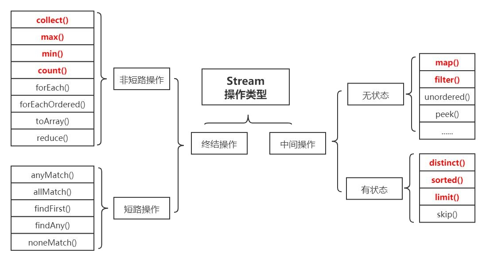
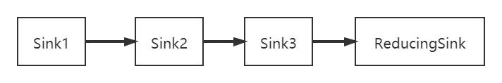

# 9.Java语法糖及实现

语法糖Syntactic Sugar 糖衣语法，方便开发人员使用，JVM并不识别，会在编译阶段解语法糖，还原为基础语法

常见的语法糖有泛型、变长参数、条件编译、自动拆装箱、内部类等。

## 9.1 Java 中的泛型（重点）

### 9.1.1 泛型是什么

泛型，即“参数化类型”，最熟悉的就是定义方法时有形参，然后调用此方法时传递实参。 
引入一个类型变量 T（其他大写字母都可以，不过常用的就是 T，E，K，V 等等），并且用<>括起来，并放在类名的后面。
泛型类 是允许有多个类型变量的。 
按照约定，类型参数名称命名为单个大写字母，以便可以在使用普通类或接口名称时能够容易地区分类型参数。

:::tip 常用的类型参数名称列表 
◆ E - 元素，主要由 Java 集合(Collections)框架使用  
◆ K - 键，主要用于表示映射中的键的参数类型   
◆ V - 值，主要用于表示映射中的值的参数类型  
◆ N - 数字，主要用于表示数字  
◆ T - 类型，主要用于表示第一类通用型参数  
◆ S - 类型，主要用于表示第二类通用类型参数  
◆ U - 类型，主要用于表示第三类通用类型参数  
◆ V - 类型，主要用于表示第四个通用类型参数  
:::

### 9.1.2 泛型类和泛型接口

```java
/**
 *泛型接口
 * 引入一个类型变量T（其他大写字母都可以，不过常用的就是T，E，K，V等等）
 */
public interface Generator<T> {
    public T next();
}
/**
 *  实现泛型类
 */
public class ImplGenerator2<T> implements Generator{
    private  T  data;

    public void setData(T data) {
        this.data = data;
    }

    @Override
    public T next() {
        return data;
    }

    public static void main(String[] args) {
        ImplGenerator2 implGenerator2=new ImplGenerator2();
        implGenerator2.setData("窝捏叠");
        System.out.println(implGenerator2.next());
    }
}
```


```java
public class ImplGenerator<T> {
    private  T  data;

    public void setData(T data) {
        this.data = data;
    }
    public T next() {
        return data;
    }
    public static void main(String[] args) {
        ImplGenerator2 implGenerator2=new ImplGenerator2();
        implGenerator2.setData("窝 嫩 寝 叠");
        System.out.println(implGenerator2.next());
    }
}
```
### 9.1.3 泛型方法

实际开发中，经常有数值类型求和的需求，例如实现 int 类型的加法,有时候还需要实现 long 类型的求和,如果还需要 double 类型 的求和，需要重新在重载一个输入是 double 类型的 add 方法。
```java
/**
 * 泛型方法
 * 引入一个类型变量T（其他大写字母都可以，不过常用的就是T，E，K，V等等）
 */
public class GenericMethod<T> {
    //泛型方法
    public <T> T genericMethod(T t){
        return t;
    }
    //普通方法
    public void test(int x,int y){
        System.out.println(x+y);
    }
    //泛型方法
    public static <T extends Number> double add(T t1, T t2) {
        double album;
        album = t1.doubleValue() + t2.doubleValue();
        return album;
    }
    public static void main(String[] args) {
        GenericMethod genericMethod = new GenericMethod();
        genericMethod.test(13,7);
        System.out.println(genericMethod.genericMethod("哈哈哈"));
        System.out.println(add(100.00,200.13));
    }
}
```

### 9.1.4 为什么我们需要泛型？

1. 适用于多种数据类型执行相同的代码 
2. 泛型中的类型在使用时指定，不需要强制类型转换

### 9.1.6 虚拟机是如何实现泛型的？

#### 9.1.6.1 泛型擦除
Java 语言中的泛型，它只在程序源码中存在，在编译后的字节码文件中，就已经替换为原来的原生类型（Raw Type，也称为裸类型）了，并且在相应的地方插入了强制转型代码，

因此对于运行期的 Java 语言来说，ArrayList＜int＞与 ArrayList＜String＞就是同一 个类，所以泛型技术实际上是 Java 语言的一颗语法糖，**Java 语言中的泛型实现方法称为<font color='red'>类型擦除</font>**，基于这种方法实现的泛型称为伪泛型。

```java
/**
 * 泛型擦除
 */
public class Theory {
    public static void main(String[] args) {
        Map<String,String> map = new HashMap<>();
        map.put("King","18");
        System.out.println(map.get("King"));
    }
}
```
将一段 Java 代码编译成 Class 文件，然后再用字节码反编译工具进行反编译后，将会发现泛型都不见了，程序又变回了 Java 泛型 出现之前的写法，泛型类型都变回了原生类型（因为）
```java
//class文件
import java.util.HashMap;
import java.util.Map;

public class Theory {
    public Theory() {
    }

    public static void main(String[] args) {
        Map<String, String> map = new HashMap();
        map.put("King", "18");
        System.out.println((String)map.get("King"));
    }
}
```
#### 9.1.6.2 使用泛型注意事项(了解)

```java
import java.util.List;

public class Conflict {
    //因为存在泛型擦除，这两个method方法参数是一样的，无法重载
//    public static String method(List<String> integerList) {
//        System.out.println("List");
//        return "tqk";
//    }
    public static Integer method(List<Integer> integerList) {
        System.out.println("List");
        return 0;
    }
}
```
上面这段代码是不能被编译的，因为参数 List＜Integer＞和 List＜String＞编译之后都被擦除了，变成了**一样的原生类型 List＜E＞**，擦除动作导致这两种方法的特征签名变得一模一样（注意在 IDEA 中是不行的，但是jdk的编译器是可以，因为jdk是根据方法返回值+方法名+参数）。

#### 9.1.6.3 弱记忆

JVM 版本兼容性问题：JDK1.5 以前，为了确保泛型的兼容性，JVM 除了擦除，其实还是保留了泛型信息(**Signature** 是其中最重要的一项属性，它的作用就是存储一个方法在**字节码层面的特征签名**，这个属性中保存的参数类型并不是原生类型，而是包括了参数化类型的信息)----**弱记忆** 
另外，从 Signature 属性的出现我们还可以得出结论，擦除法所谓的擦除，仅仅是对方法的 Code 属性中的字节码进行擦除，实际上元数据中还是保留了泛型信息，这也是我们能通过反射手段取得参数化类型的根本依据。


## 9.2 Stream（了解）

### 9.2.1 Stream简介

Java8 中，Collection 新增了两个流方法，分别是 Stream() 和 parallelStream() Java8 中添加了一个新的接口类 Stream，相当于高级版的 Iterator，它可以通过 Lambda 表达式对集合进行大批量数据操作，或 者各种非常便利、高效的聚合数据操作。

在 Java8 之前，我们通常是通过 for 循环或者 Iterator 迭代来重新排序合并数据，又或者通过重新定义 Collections.sorts 的 Comparator 方法来实现，这两种方式对于**大数据量系统来说，效率并不是很理想**。

Stream 的聚合操作与数据库 SQL 的聚合操作 sorted、filter、map 等类似。我们在应用层就可以高效地实现类似数据库 SQL 的聚合操作了，而在数据操作方面，**Stream 不仅可以通过串行的方式实现数据操作，还可以通过并行的方式处理大批量数据，提高数据的处理效率。**


### 9.2.2 Stream使用及Stream操作分类

```java
public class StreamDemo {
    public static void main(String[] args) {
        List<String> names = Arrays.asList("张三", "李四", "王老五", "李三", "刘老四", "王小二", "张四", "张五六七");
        int maxLenZ=0;
        for (String name:names){
            if(name.startsWith("张")||maxLenZ<name.length()){
                maxLenZ=name.length();
            }
        }
        System.out.println(maxLenZ);

        maxLenZ = names.parallelStream().filter((name) -> {
            return name.startsWith("张");
        }).mapToInt((name)->name.length()).max().getAsInt();
        System.out.println(maxLenZ);
    }
}
```

官方将 Stream 中的操作分为两大类：<font color='red'><strong>终结操作（Terminal operations）</strong></font>和<font color='red'><strong>中间操作（Intermediate operations）</strong></font> 

**中间操作**会返回一个新的流，一个流可以后面跟随零个或多个中间操作。其目的主要是打开流，做出某种程度的数据映射/过滤，然后会返回一个新的流，交给下一个操作使用。这类操作都是惰性化的（lazy），就是说，仅仅调用到这类方法，并没有真正开始流的遍历。而是在终结操作开始的时候才真正开始执行。

中间操作又可以分为<font color='red'><strong>无状态（Stateless）</strong></font>与<font color='red'><strong>有状态（Stateful）</strong></font>操作，无状态是指元素的处理不受之前元素的影响，有状态是指该操作只有拿到所有元素之后才能继续下去。 

终结操作是指返回最终的结果。一个流只能有一个终结操作，当这个操作执行后，这个流就被使用“光”了，无法再被操作。所以这必定这个流的最后一个操作。

终结操作的执行才会真正开始流的遍历，并且会生成一个结果。 终结操作又可以分为<font color='blue'><strong>短路（Short-circuiting）</strong></font>与<font color='blue'><strong>非短路（Unshort-circuiting）</strong></font>操作， 短路是指遇到某些符合条件的元素就可以得到最终结果， 非短路是指必须处理完所有元素才能得到最终结果。

操作分类详情如下图所示：
<a data-fancybox title="Stream" href="./image/stream.jpg"></a>

```java
//
// Source code recreated from a .class file by IntelliJ IDEA
// (powered by FernFlower decompiler)
//

package com.tqk.ex9;

import java.util.Arrays;
import java.util.List;
import java.util.Map;
import java.util.stream.Collectors;

public class StuWithStream {

    public static void main(String[] args) {
        List<Student> studentList = Datainit();
        groupBy(studentList);
        total(studentList);
        MaxAndMin(studentList);
        filter(studentList);
    }

    public static List<Student> Datainit() {
        List<Student> students = Arrays.asList(new Student("小明", 168, "男"), new Student("大明", 182, "男"), new Student("小白", 174, "男"), new Student("小黑", 186, "男"), new Student("小红", 156, "女"), new Student("小黄", 158, "女"), new Student("小青", 165, "女"), new Student("小紫", 172, "女"));
        return students;
    }

    //分组
    public static void groupBy(List<Student> studentsList) {
        Map<String, List<Student>> groupBy = (Map)studentsList.stream().collect(Collectors.groupingBy(Student::getSex));
        System.out.println("分组后：" + groupBy);
    }
    /*
     *  过滤
     */
    public static void filter(List<Student> studentsList) {
        List<Student> filter = (List)studentsList.stream().filter((student) -> {
            return student.getHeight() > 180;
        }).collect(Collectors.toList());
        System.out.println("过滤后：" + filter);
        filter.stream().forEach(
                System.out::println
        );
    }
    /*
     * 长度求和
     */
    public static void total(List<Student> studentsList) {
        int totalHeight = studentsList.stream().mapToInt(Student::getHeight).sum();
        System.out.println("长度求和:"+totalHeight);
    }

    /**
     * 长度最大值 最小值
     * @param studentsList
     */
    public static void MaxAndMin(List<Student> studentsList) {
        int maxHeight = studentsList.stream().mapToInt(Student::getHeight).max().getAsInt();
        System.out.println("max:" + maxHeight);
        int minHeight = studentsList.stream().mapToInt(Student::getHeight).min().getAsInt();
        System.out.println("min:" + minHeight);
    }
}
 class Student {
    private String name;
    private int height;
    private String sex;

    public String getName() {
        return this.name;
    }

    public void setName(String name) {
        this.name = name;
    }

    public int getHeight() {
        return this.height;
    }

    public void setHeight(int height) {
        this.height = height;
    }

    public String getSex() {
        return this.sex;
    }

    public void setSex(String sex) {
        this.sex = sex;
    }

    public Student(String name, int height, String sex) {
        this.sex = sex;
        this.name = name;
        this.height = height;
    }
}
```

### 9.2.3 Stream 的底层实现

#### 9.2.3.1 Stream 操作叠加 

一个 Stream 的各个操作是由处理管道组装，并统一完成数据处理的。 

我们知道 Stream 有中间操作和终结操作，  
那么对于一个写好的 Stream 处理代码来说，中间操作是通过 AbstractPipeline 生成了一个中间操作 Sink链表   
当我们调用终结操作时，会生成一个最终的 ReducingSink，通过这个ReducingSink 触发之前的中间操作，从最后一个 ReducingSink 开始，递归产生一个 Sink链。

如下图所示：
<a data-fancybox title="Stream" href="./image/stream1.jpg"></a>

#### 9.2.3.2 Stream (源码暂时略)

### 9.2.4 Stream 的性能

```java
public class IteratorTest {
    public static void IteratorForIntTest(int[] arr) {
        long timeStart = System.currentTimeMillis();
        int min = 2147483647;

        for(int i = 0; i < arr.length; ++i) {
            if (arr[i] < min) {
                min = arr[i];
            }
        }

        long timeEnd = System.currentTimeMillis();
        System.out.println("Iterator 比较int最小值 花费的时间" + (timeEnd - timeStart));
    }


    public static void ParallelStreamForIntTest(int[] arr) {
        long timeStart = System.currentTimeMillis();
        Arrays.stream(arr).parallel().min().getAsInt();
        long timeEnd = System.currentTimeMillis();
        System.out.println("ParallelStream 比较int最小值 花费的时间" + (timeEnd - timeStart));
    }
    public static void SerialStreamForIntTest(int[] arr) {
        long timeStart = System.currentTimeMillis();
        Arrays.stream(arr).min().getAsInt();
        long timeEnd = System.currentTimeMillis();
        System.out.println("SerialStream串行 比较int最小值 花费的时间" + (timeEnd - timeStart));
    }
}

```
#### 9.2.4.1 常规数据量下迭代比较

**常规的迭代 > Stream 并行迭代> Stream 串行迭代**
为什么这样： 
1. 常规迭代代码简单，越简单的代码执行效率越高。 
2. Stream 串行迭代，使用了复杂的设计，导致执行速度偏低。所以是性能最低的。 
3. Stream 并行迭代 使用了 Fork-Join 线程池,所以效率比 Stream 串行迭代快，但是对比常规迭代还是要慢（毕竟设计和代码复杂）

```java
public class App {
    public static void main(String[] args) {
        int[] arr = new int[100000000];
        System.setProperty("java.util.concurrent.ForkJoinPool.common.parallelism", "240");
        Random r = new Random();

        for(int i = 0; i < arr.length; ++i) {
            arr[i] = r.nextInt();
        }

        IteratorTest.IteratorForIntTest(arr);
        SerialStreamTest.SerialStreamForIntTest(arr);
        ParallelStreamTest.ParallelStreamForIntTest(arr);
    }
}

Iterator 比较int最小值 花费的时间2
SerialStream串行 比较int最小值 花费的时间64
ParallelStream 比较int最小值 花费的时间104
```
#### 9.2.4.2 大数据量下迭代比较

```java
public class App {
    public static void main(String[] args) {
        int[] arr = new int[100000000];
        System.setProperty("java.util.concurrent.ForkJoinPool.common.parallelism", "240");
        Random r = new Random();

        for(int i = 0; i < arr.length; ++i) {
            arr[i] = r.nextInt();
        }

        IteratorTest.IteratorForIntTest(arr);
        SerialStreamTest.SerialStreamForIntTest(arr);
        ParallelStreamTest.ParallelStreamForIntTest(arr);
    }
}

Iterator 比较int最小值 花费的时间41
SerialStream串行 比较int最小值 花费的时间165
ParallelStream 比较int最小值 花费的时间102
```
#### 9.2.4.3 如何合理使用 Stream？

我们可以看到：在循环迭代次数较少的情况下，常规的迭代方式性能反而更好；而在大数据循环迭代中，

parallelStream（合理的线程 池数上）有一定的优势。 但是由于所有使用并行流 parallelStream 的地方都是使用同一个 Fork-Join 线程池，而线程池线程数仅为 cpu 的核心数。 
切记，如果对底层不太熟悉的话请不要乱用并行流 parallerStream（尤其是你的服务器核心数比较少的情况下）