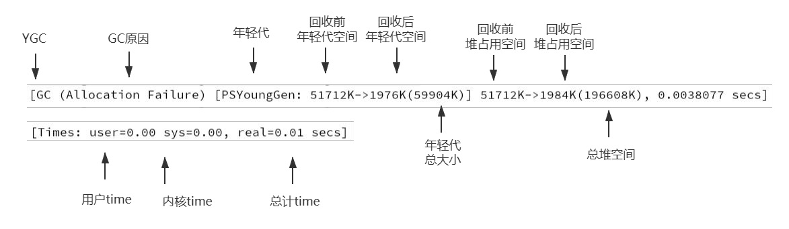

# 5. 垃圾回收器串讲及HostSpot的细节实现--面试重点

## 5.1 并发标记与三色标记

在三色标记法之前有一个算法叫 **Mark-And-Sweep（标记清除）**
这个算法会设置一个标志位来记录对象是否被使用。最开始所有的标记位都是 0，如果发现对象是可达的就会置为 1，一步步下去就会呈现一个类似树状的结果。等标记的步骤完成后，会将未被标记的对象统一清理，再次把所有的标记位设置成 0 方便下次清理。 

这个算法最大的问题是 **GC 执行期间需要把整个程序完全暂停，不能异步进行 GC 操作**。因为在不同阶段标记清扫法的标志位 0 和 1 有不同的含义， 那么新增的对象无论标记为什么都有可能意外删除这个对象。

对实时性要求高的系统来说，这种需要长时间挂起的标记清扫法是不可接受的。所以就需要一个算法来解决 GC 运行时程序长时间挂起的问题，那就三色标记法。 

**三色标记最大的好处是可以异步执行，从而可以以中断时间极少的代价或者完全没有中断来进行整个GC** 

三色标记法很简单。首先将对象用三种颜色表示，分别是白色、灰色和黑色。 
**黑色**：根对象，或者该对象与它的子对象都被扫描过。 
**灰色**：对本身被扫描，但是还没扫描完该对象的子对象。 
**白色**：未被扫描对象，如果扫描完所有对象之后，最终为白色的为不可达对象，既垃圾对象。

### 5.1.2 三色标记的问题
GC 并发情况下的漏标问题
CMS 中的解决方案
G1 中的解决方案

### 5.1.3 三色标记的问题

#### 5.1.3.1 GC 并发情况下的漏标问题

#### 5.1.3.2 CMS 中的解决方案
Incremental Update 算法 当一个白色对象被一个黑色对象引用，将黑色对象重新标记为灰色，让垃圾回收器重新扫描

#### 5.1.3.3 G1 中的解决方案
SATB(snapshot-at-the-beginning) 刚开始做一个快照，当 B 和 C 消失的时候要把这个引用推到 GC 的堆栈，保证 C 还能被 GC 扫描到，最重要的是要把这个引用推到 GC 的堆栈，是灰色对 象指向白色的引用，如果一旦某一个引用消失掉了，我会把它放到栈（GC 方法运行时数据也是来自栈中），我其实还是能找到它的，我下回直接扫描他 就行了，那样白色就不会漏标。 对应 G1 的垃圾回收过程中的： 最终标记( Final Marking) 对用户线程做另一个短暂的暂停，用于处理并发阶段结后仍遗留下来的最后那少量的 SATB 记录(漏标对象)。

:::tip 对比
SATB 算法是关注引用的删除。（B->C 的引用） Incremental Update 算法关注引用的增加。（A->C 的引用） G1 如果使用 Incremental Update 算法，因为变成灰色的成员还要重新扫，重新再来一遍，效率太低了。 所以 G1 在处理并发标记的过程比 CMS 效率要高，这个主要是解决漏标的算法决定的。
:::
## 5.2 G1 中的技术细节

### 5.2.1 跨代引用
堆空间通常被划分为新生代和老年代。由于新生代的垃圾收集通常很频繁，如果老年代对象引用了新生代的对象，那么回收新生代的话，需要跟踪从老 年代到新生代的所有引用，所以要避免每次 YGC 时扫描整个老年代，减少开销。

### 5.2.2 RSet（记忆集）
记录了其他 Region 中的对象到本 Region 的引用, RSet 的价值在于使得垃圾收集器不需要扫描整个堆,找到谁引用了当前分区中的对象，只需要扫描 RSet 即可。 RSet 本身就是一个 Hash 表，如果是在 G1 的话，则是在一个 Region 区里面。

### 5.2.3 CardTable

由于做新生代 GC 时，需要扫描整个 OLD 区，效率非常低，所以 JVM 设计了 CardTable,如果一个 OLD 区 CardTable 中有对象指向 Y 区， 就将它设为 Dirty （标志位 1）, 下次扫描时，只需要扫描 CARDTABLE 上是 Dirty 的内存区域即可。 字节数组 CARDTABLE 的每一个元素都对应着其标识的内存区域中一块特定大小的内存块，这个内存块被称作“卡页”(Card Page)。 一般来说，卡页大小 都是以 2 的 N 次幂的字节数，假设使用的卡页是 2 的 10 次幂，即 1K,内存区域的起始地址是 0x0000 的话，数组 CARD_TABLE 的第 0、1、2 号元素，分别 对应了地址范围为 0x0000~0x03FF、0x0400 ~ 0x07FF、0x0800~0x011FF 的卡页内存.

**总结**

这里描述的是 G1 处理跨代引用的细节，其实在 CMS 中也有类似的处理方式，比如 CardTable,也需要记录一个 RSet 来记录，我们对比一下，在 G1 中是每 一个 Region 都需要一个 RSet 的内存区域，导致有 G1 的 RSet 可能会占据整个堆容量的 20%乃至更多。但是 CMS 只需要一份，所以就内存占用来说，G1
占用的内存需求更大，虽然 G1 的优点很多，但是我们不推荐在堆空间比较小的情况下使用 G1，尤其小于 6 个 G。

## 5.3 安全点与安全区域

### 5.3.1 安全点 

用户线程暂停，GC 线程要开始工作，但是要确保用户线程暂停的这行字节码指令是不会导致引用关系的变化。所以 JVM 会在字节码指令中，选一些指令， 作为“安全点”，比如方法调用、循环跳转、异常跳转等，一般是这些指令才会产生安全点。 为什么它叫安全点，是这样的，GC 时要暂停业务线程，并不是抢占式中断（立马把业务线程中断）而是主动是中断。 主动式中断是设置一个标志，这个标志是中断标志，各业务线程在运行过程中会不停的主动去轮询这个标志，一旦发现中断标志为 True,就会在自己最近 的“安全点”上主动中断挂起。

### 5.3.2 安全区域 

为什么需要安全区域？ 要是业务线程都不执行（业务线程处于 Sleep 或者是 Blocked 状态），那么程序就没办法进入安全点，对于这种情况，就必须引入安全区域。 安全区域是指能够确保在某一段代码片段之中， 引用关系不会发生变化，因此，在这个区域中任意地方开始垃圾收集都是安全的。我们也可以把安全区 城看作被扩展拉伸了的安全点。

## 5.4 低延迟的垃圾回收器

### 5.4.1 垃圾回收器三项指标 

传统的垃圾回收器一般情况下 内存占用、吞吐量、延时 只能同时满足两个。但是现在的发展，延迟这项的目标越来越重要。所以就有低延迟的垃圾回 收器。

### 5.4.2 Eplison（了解即可） 
这个垃圾回收器不能进行垃圾回收，是一个“不干活”的垃圾回收器，由 RedHat 退出，它还要负责堆的管理与布局、对象的分配、与解释器 的协作、与编译器的协作、与监控子系统协作等职责，主要用于需要剥离垃圾收集器影响的性能测试和压力测试。 
### 5.4.3 ZGC（了解即可） 
有类似于 G1 的 Region，但是没有分代。 标志性的设计是染色指针 ColoredPointers（这个概念了解即可），染色指针有 4TB 的内存限制，但是效率极高，它是一种将少量额外的信息存储在指针上 的技术。 它可以做到几乎整个收集过程全程可并发，短暂的 STW 也只与 GC Roots 大小相关而与堆空间内存大小无关，因此考科一实现任何堆空间 STW 的时间小于 十毫秒的目标。 
### 5.4.4 Shenandoah（了解即可） 
第一款非 Oracle 公司开发的垃圾回收器，有类似于 G1 的 Region，但是没有分代。 也用到了染色指针 ColoredPointers。 效率没有 ZGC 高，大概几十毫秒的目标。

## 5.5 GC 参数 

### 5.5.1 GC 日志详解 
 

### 5.5.2 GC 常用参数 
-Xmn -Xms -Xmx –Xss 年轻代 最小堆 最大堆 栈空间 
-XX:+UseTLAB 使用 TLAB，默认打开 
-XX:+PrintTLAB 打印 TLAB 的使用情况 
-XX:TLABSize 设置 TLAB 大小
-XX:+DisableExplicitGC 启用用于禁用对的调用处理的选项 System.gc()
 -XX:+PrintGC 查看 GC 基本信息 
 -XX:+PrintGCDetails 查看 GC 详细信息 
 -XX:+PrintHeapAtGC 每次一次 GC 后，都打印堆信息 
 -XX:+PrintGCTimeStamps 启用在每个 GC 上打印时间戳的功能 
 -XX:+PrintGCApplicationConcurrentTime 打印应用程序时间(低) 
 -XX:+PrintGCApplicationStoppedTime 打印暂停时长（低） 
 -XX:+PrintReferenceGC 记录回收了多少种不同引用类型的引用（重要性低） 
 -verbose:class 类加载详细过程 
 -XX:+PrintVMOptions 可在程序运行时，打印虚拟机接受到的命令行显示参数 
 -XX:+PrintFlagsFinal -XX:+PrintFlagsInitial 打印所有的 JVM 参数、查看所有 JVM 参数启动的初始值（必须会用） 
 -XX:MaxTenuringThreshold 升代年龄，最大值 15, 并行（吞吐量）收集器的默认值为 15，而 CMS 收集器的默认值为 6。 

### 5.5.3 Parallel 常用参数 
-XX:SurvivorRatio 设置伊甸园空间大小与幸存者空间大小之间的比率。默认情况下，此选项设置为 8 
-XX:PreTenureSizeThreshold 大对象到底多大，大于这个值的参数直接在老年代分配 
-XX:MaxTenuringThreshold 升代年龄，最大值 15, 并行（吞吐量）收集器的默认值为 15，而 CMS 收集器的默认值为 6。 
-XX:+ParallelGCThreads 并行收集器的线程数，同样适用于 CMS，一般设为和 CPU 核数相同 
-XX:+UseAdaptiveSizePolicy 自动选择各区大小比例 

### 5.5.4 CMS 常用参数 
-XX:+UseConcMarkSweepGC 启用 CMS 垃圾回收器 
-XX:+ParallelGCThreads 并行收集器的线程数，同样适用于 CMS，一般设为和 CPU 核数相同
-XX:CMSInitiatingOccupancyFraction 使用多少比例的老年代后开始 CMS 收集，默认是 68%(近似值)，如果频繁发生 SerialOld 卡顿，应该调小，（频繁 CMS 回 收）
-XX:+UseCMSCompactAtFullCollection 在 FGC 时进行压缩 
-XX:CMSFullGCsBeforeCompaction 多少次 FGC 之后进行压缩 
-XX:+CMSClassUnloadingEnabled 使用并发标记扫描（CMS）垃圾收集器时，启用类卸载。默认情况下启用此选项。 -XX:CMSInitiatingPermOccupancyFraction 达到什么比例时进行 Perm 回收，JDK 8 中不推荐使用此选项，不能替代。 
-XX:GCTimeRatio 设置 GC 时间占用程序运行时间的百分比（不推荐使用） 
-XX:MaxGCPauseMillis 停顿时间，是一个建议时间，GC 会尝试用各种手段达到这个时间，比如减小年轻代 

### 5.5.5 G1 常用参数 
-XX:+UseG1GC 启用 CMS 垃圾收集器 
-XX:MaxGCPauseMillis 设置最大 GC 暂停时间的目标（以毫秒为单位）。这是一个软目标，并且 JVM 将尽最大的努力（G1 会尝试调整 Young 区的块数来）来实 现它。默认情况下，没有最大暂停时间值。 
-XX:GCPauseIntervalMillis GC 的间隔时间 
-XX:+G1HeapRegionSize 分区大小，建议逐渐增大该值，1 2 4 8 16 32。随着 size 增加，垃圾的存活时间更长，GC 间隔更长，但每次 GC 的时间也会更长 -XX:G1NewSizePercent 新生代最小比例，默认为 5% 
-XX:G1MaxNewSizePercent 新生代最大比例，默认为 60% 
-XX:GCTimeRatioGC 时间建议比例，G1 会根据这个值调整堆空间 
-XX:ConcGCThreads 线程数量 
-XX:InitiatingHeapOccupancyPercent 启动 G1 的堆空间占用比例，根据整个堆的占用而触发并发 GC 周期