# 5. 垃圾回收器串讲及HostSpot的细节实现y

## 5.1 并发标记与三色标记

<a data-fancybox title="参考文档" href="https://www.cnblogs.com/webor2006/p/11147893.html">参考文档:https://www.cnblogs.com/webor2006/p/11147893.html</a>

### 5.1.1 三色标记
在三色标记法之前有一个算法叫 **Mark-And-Sweep（标记清除）**
这个算法会设置一个标志位来记录对象是否被使用。最开始所有的标记位都是 0，如果发现对象是可达的就会置为 1，一步步下去就会呈现一个类似树状的结果。等标记的步骤完成后，会将未被标记的对象统一清理，再次把所有的标记位设置成 0 方便下次清理。 

这个算法最大的问题是 **GC 执行期间需要把整个程序完全暂停，不能异步进行 GC 操作**。因为在不同阶段标记清扫法的标志位 0 和 1 有不同的含义， 那么新增的对象无论标记为什么都有可能意外删除这个对象。

对实时性要求高的系统来说，这种需要长时间挂起的标记清扫法是不可接受的。所以就需要一个算法来解决 GC 运行时程序长时间挂起的问题，那就三色标记法。 

**三色标记最大的好处是可以异步执行，从而可以以中断时间极少的代价或者完全没有中断来进行整个GC** 

:::tip 三色标记法：
1. <font color='red'>**黑色**</font>：根对象，或者该对象与它的子对象都被扫描过（对象被标记了，且它的所有field也被标记完了）。
2. <font color='red'>**灰色**</font>：对象本身被扫描，但还没扫描完该对象中的子对象（它的field还没有被标记或标记完）。
3. <font color='red'>**白色**</font>：未被扫描对象，扫描完成所有对象之后，最终为白色的为不可达对象，既垃圾对象（对象没有被标记到）。   
:::

#### 5.1.1.1 三色标记算法的整个过程

1. 根对象(GC root)被置为黑色，子对象被置为灰色。如下图：

<a data-fancybox title="三色标记算法" href="./image/sansebiao1.jpg">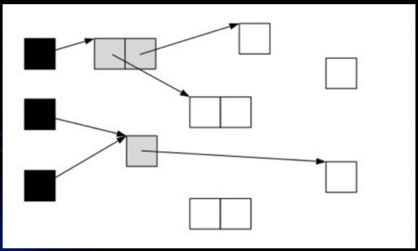</a>

其中可以看到灰色对象是已经被扫描过了，但是灰色对象里面所引用的子对象还未被扫描，所以可以看到灰色对象指向了未被扫描过的白色对象

2. 继续由灰色遍历，将已扫描了子对象的对象置为黑色，如下：

<a data-fancybox title="三色标记算法" href="./image/sansebiao2.jpg">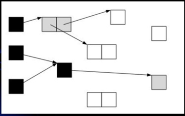</a>

可以看到由于灰色里面的子对象已经被扫描过了，所以原灰色对象就变成了黑色了，而它所引用的白色对象由于被扫描到了，所以白色变成了灰色了

<a data-fancybox title="三色标记算法" href="./image/sansebiao3.jpg">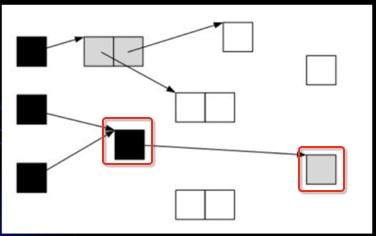</a>

3. 遍历了所有可达的对象后，所有可达的对象都变成了黑色。不可达的对象既为白色，需要被清理：

<a data-fancybox title="三色标记算法" href="./image/sansebiao4.jpg">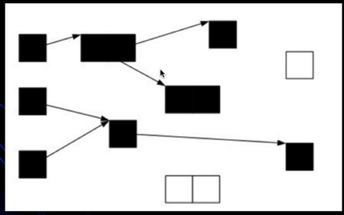</a>

因为这三个对象被扫描完之后就会由白色变成灰色，然后由于这三个对象里面没有任何其它子对象，所以就由灰度变为了黑色了。

<a data-fancybox title="三色标记算法" href="./image/sansebiao5.jpg">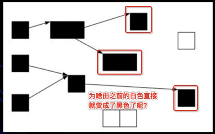</a>

### 5.1.2 三色标记的问题

如果在标记过程中，应用程序也在运行，那么对象的指针就有可能改变。这样的话，我们就会遇到一个问题：对象丢失问题

:::tip  GC并发情况下的漏标问题
1. 当垃圾收集器扫描到下面情况时

<a data-fancybox title="三色标记算法" href="./image/sansebiao6.jpg">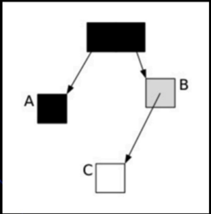</a>

2. 由于在GC扫描时应用程序线程也在同步执行，这时候应用程序执行了以下操作：

```java
A.c = C
B.c = null
```
这样,对象的状态图变成如下情形:

<a data-fancybox title="三色标记算法" href="./image/sansebiao7.jpg">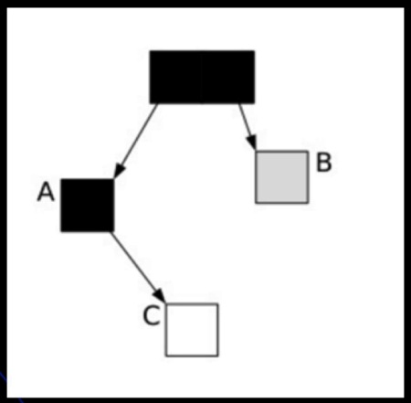</a>

3. 这时候垃圾收集器再标记扫描的时候就会变成下图这样：

<a data-fancybox title="三色标记算法" href="./image/sansebiao8.jpg">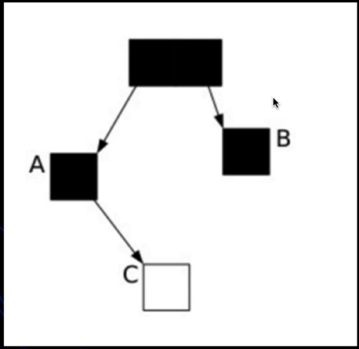</a>

由于A变成了黑色，垃圾收信器是永远不会再扫描它了，因为垃圾回收器认为A里面的所有子对象都已经扫描完了，而问题就来了，此时C是白色，被认为是垃圾需要清理掉，显示这是不合理的，明明C是一个正常可用的对象。
:::

**CMS用的增量更新，G1则是原始快照**

#### 5.1.2.1 CMS中的解决方案
<font color='red'>**Incremental Update算法**</font>：增量更新(跟踪黑指向白的增加)，关注引用的增加，把黑色重新标记为灰色，下次重新扫描属性

当一个白色对象被一个黑色对象引用，将黑色对象重新标记为灰色，让垃圾回收器重新扫描
#### 5.1.2.2 G1中的解决方案
SATB(snapshot-at-the-beginning)：关注引用的删除(记录灰指向白的消失)，当灰-->白消失时，要把这个**引用**推到GC的堆栈，保证白还能被GC扫描到

刚开始做一个快照，当B和C消失的时候要把这个引用推到GC的堆栈，保证C还能被GC扫描到，最重要的是要把这个引用推到GC的堆栈，是灰色对象指向白色的引用，如果一旦某一个引用消失掉了，我会把它放到栈（GC方法运行时数据也是来自栈中），我其实还是能找到它的，我下回直接扫描他就行了，那样白色就不会漏标。 

对应G1的垃圾回收过程中的： 最终标记( Final Marking) 对用户线程做另一个短暂的暂停，用于处理并发阶段结后仍遗留下来的最后那少量的 SATB 记录(漏标对象)。

#### 5.1.2.3 为什么G1采用SATB而不用incremental update？
因为采用incremental update把黑色重新标记为灰色后，之前扫描过的还要再扫描一遍，效率太低。
G1有RSet与SATB相配合。Card Table里记录了RSet，RSet里记录了其他对象指向自己的引用，这样就不需要再扫描其他区域，只要扫描RSet就可以了。
也就是说 灰色-->白色 引用消失时，如果没有 黑色-->白色，引用会被push到堆栈，下次扫描时拿到这个引用，由于有RSet的存在，不需要扫描整个堆去查找指向白色的引用，效率比较高。SATB配合RSet浑然天成


:::tip 对比
SATB 算法是关注引用的删除。（B->C 的引用） Incremental Update 算法关注引用的增加。（A->C 的引用） G1 如果使用 Incremental Update 算法，因为变成灰色的成员还要重新扫，重新再来一遍，效率太低了。 所以 G1 在处理并发标记的过程比 CMS 效率要高，这个主要是解决漏标的算法决定的。
:::
## 5.2 G1 中的技术细节

### 5.2.1 跨代引用
堆空间通常被划分为新生代和老年代。由于新生代的垃圾收集通常很频繁，如果老年代对象引用了新生代的对象，那么回收新生代的话，需要跟踪从老年代到新生代的所有引用，所以要避免每次YGC时扫描整个老年代，减少开销。
<a data-fancybox title="跨代引用" href="./image/kuadaiyinyong.jpg">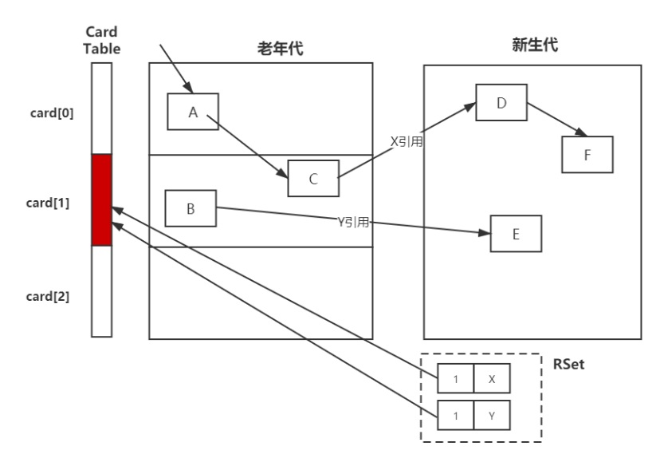</a>

### 5.2.2 RSet（记忆集）

记录了其他Region中的对象到本Region的**引用**, RSet的价值在于使得垃圾收集器不需要扫描整个堆,找到谁引用了当前分区中的对象，只需要扫描RSet即可。 

RSet本身就是一个Hash表，如果是在G1的话，则是在一个Region区里面。

浪费堆空间20%
### 5.2.3 CardTable

由于做新生代GC时，需要扫描整个OLD区，效率非常低，所以JVM设计了CardTable,如果一个 OLD 区CardTable中有对象指向Y区， 就将它设为Dirty（标志位 1）, 下次扫描时，只需要扫描CARDTABLE上是Dirty的内存区域即可。

字节数组CARDTABLE的每一个元素都对应着其标识的内存区域中一块特定大小的内存块，这个内存块被称作“卡页”(Card Page)。 

一般来说，卡页大小都是以2的N次幂的字节数，假设使用的卡页是2的10次幂，即1K,内存区域的起始地址是 0x0000 的话，数组 CARD_TABLE 的第 0、1、2 号元素，分别对应了地址范围为 0x0000~0x03FF、0x0400 ~ 0x07FF、0x0800~0x011FF 的卡页内存.

**总结**

这里描述的是 G1 处理跨代引用的细节，其实在 CMS 中也有类似的处理方式，比如 CardTable,也需要记录一个 RSet 来记录，我们对比一下，在 G1 中是每 一个 Region 都需要一个 RSet 的内存区域，导致有 G1 的 RSet 可能会占据整个堆容量的 20%乃至更多。但是 CMS 只需要一份，所以就内存占用来说，G1
占用的内存需求更大，虽然 G1 的优点很多，但是我们不推荐在堆空间比较小的情况下使用 G1，尤其小于 6 个 G。

## 5.3 安全点与安全区域


### 5.3.1 安全点 

<a data-fancybox title="安全点" href="./image/safepoint.jpg">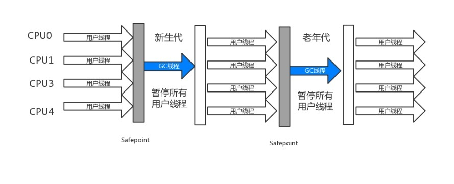</a>

用户线程暂停，GC线程要开始工作，但是要确保用户线程暂停的这行字节码指令是不会导致引用关系的变化。

所以JVM会在字节码指令中，选一些指令，作为<font color='red'>“安全点”</font>，比如<font color='red'>**方法调用、循环跳转、异常跳转**</font>等，一般是这些指令才会产生**安全点** 

为什么它叫安全点，是这样的，GC 时要暂停业务线程，并不是抢占式中断（立马把业务线程中断）而是主动是中断。 

主动式中断是设置一个标志，这个标志是中断标志，各业务线程在运行过程中会不停的主动去<font color='red'>**轮询**</font>这个标志，一旦发现中断标志为 True,就会在自己最近 的“安全点”上主动中断挂起。

### 5.3.2 安全区域 

<a data-fancybox title="安全区域" href="./image/safearea.jpg">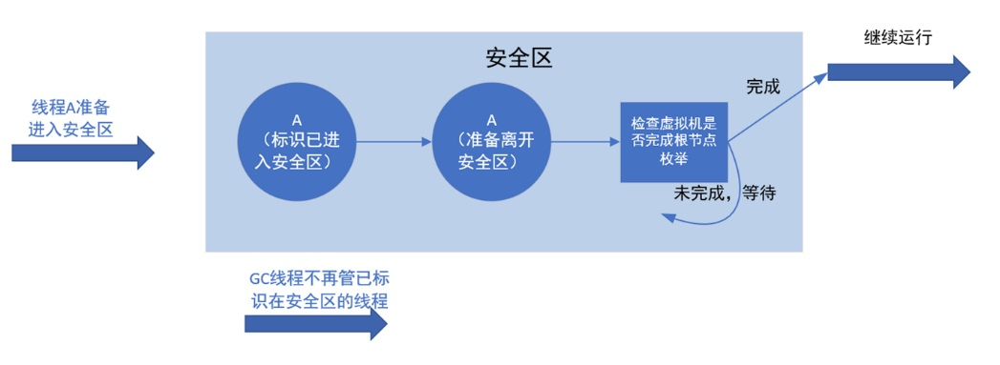</a>


为什么需要安全区域？   
要是业务线程都不执行（业务线程处于 Sleep 或者是 Blocked 状态），那么程序就没办法进入安全点，对于这种情况，就必须引入<font color='red'>**安全区域**</font> 

安全区域是指能够确保在某一段代码片段之中，引用关系不会发生变化，因此，在这个区域中任意地方开始垃圾收集都是安全的。我们也可以把安全区看作被扩展拉伸了的安全点


## 5.4 低延迟的垃圾回收器

### 5.4.1 垃圾回收器三项指标 

传统的垃圾回收器一般情况下<font color='red'>内存占用、吞吐量、延时</font> 只能同时满足两个。但是现在的发展，延迟这项的目标越来越重要。所以就有低延迟的垃圾回收器。

<a data-fancybox title="低延迟的垃圾回收器" href="./image/dycljhs.jpg">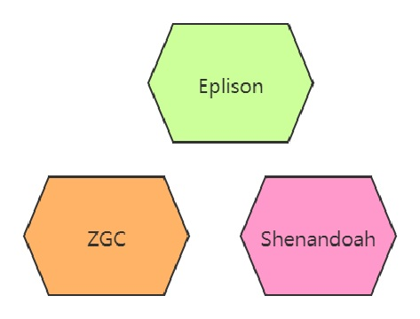</a>

### 5.4.2 Eplison（了解即可） 
这个垃圾回收器不能进行垃圾回收，是一个“不干活”的垃圾回收器，由 RedHat 退出，它还要负责堆的管理与布局、对象的分配、与解释器 的协作、与编译器的协作、与监控子系统协作等职责，主要用于需要剥离垃圾收集器影响的性能测试和压力测试。 

### 5.4.3 ZGC（了解即可） 
有类似于 G1 的 Region，但是没有分代。 标志性的设计是<font color='red'>**染色指针 ColoredPointers**</font>（这个概念了解即可），染色指针有 4TB 的内存限制，但是效率极高，它是一种将少量额外的信息存储在指针上的技术。 它可以做到几乎整个收集过程全程可并发，短暂的 STW 也只与 GC Roots 大小相关而与堆空间内存大小无关，因此考科一实现任何堆空间 STW 的时间小于 十毫秒的目标。 

### 5.4.4 Shenandoah（了解即可） 
第一款非 Oracle 公司开发的垃圾回收器，有类似于G1的 Region，但是没有分代。 也用到了染色指针ColoredPointers。 效率没有ZGC高，大概几十毫秒的目标。


## 5.5 GC 参数 

### 5.5.1 GC 日志详解 
<a data-fancybox title="GC日志详解" href="./image/gclog.jpg"></a> 

### 5.5.2 GC 常用参数 
<font color='blue'><strong>-Xmn -Xms -Xmx –Xss</strong></font> 年轻代 最小堆 最大堆 栈空间   
<font color='blue'><strong>-XX:+UseTLAB</strong></font> 使用 TLAB，默认打开   
<font color='blue'><strong>-XX:+PrintTLAB</strong></font> 打印 TLAB 的使用情况   
<font color='blue'><strong>-XX:TLABSize</strong></font> 设置 TLAB 大小  
<font color='blue'><strong>-XX:+DisableExplicitGC</strong></font> 启用用于禁用对的调用处理的选项 System.gc()  
<font color='blue'><strong>-XX:+PrintGC</strong></font> 查看 GC 基本信息   
<font color='blue'><strong>-XX:+PrintGCDetails</strong></font> 查看 GC 详细信息   
<font color='blue'><strong>-XX:+PrintHeapAtGC</strong></font> 每次一次 GC 后，都打印堆信息   
<font color='blue'><strong>-XX:+PrintGCTimeStamps</strong></font> 启用在每个 GC 上打印时间戳的功能   
<font color='blue'><strong>-XX:+PrintGCApplicationConcurrentTime</strong></font> 打印应用程序时间(低)   
<font color='blue'><strong>-XX:+PrintGCApplicationStoppedTime</strong></font> 打印暂停时长（低）   
<font color='blue'><strong>-XX:+PrintReferenceGC</strong></font> 记录回收了多少种不同引用类型的引用（重要性低）   
<font color='blue'><strong>-verbose:class</strong></font> 类加载详细过程   
<font color='blue'><strong>-XX:+PrintVMOptions</strong></font> 可在程序运行时，打印虚拟机接受到的命令行显示参数   
<font color='blue'><strong>-XX:+PrintFlagsFinal -XX:+PrintFlagsInitial</strong></font> 打印所有的 JVM 参数、查看所有 JVM 参数启动的初始值（必须会用）   
<font color='blue'><strong>-XX:MaxTenuringThreshold</strong></font> 升代年龄，最大值 15, 并行（吞吐量）收集器的默认值为 15，而 CMS 收集器的默认值为 6。   

### 5.5.3 Parallel 常用参数 
<font color='blue'><strong>-XX:SurvivorRatio</strong></font> 设置伊甸园空间大小与幸存者空间大小之间的比率。默认情况下，此选项设置为 8   
<font color='blue'><strong>-XX:PreTenureSizeThreshold</strong></font> 大对象到底多大，大于这个值的参数直接在老年代分配   
<font color='blue'><strong>-XX:MaxTenuringThreshold</strong></font> 升代年龄，最大值 15, 并行（吞吐量）收集器的默认值为 15，而 CMS 收集器的默认值为 6。   
<font color='blue'><strong>-XX:+ParallelGCThreads</strong></font> 并行收集器的线程数，同样适用于 CMS，一般设为和 CPU 核数相同   
<font color='blue'><strong>-XX:+UseAdaptiveSizePolicy</strong></font> 自动选择各区大小比例   


### 5.5.4 CMS 常用参数 
<font color='blue'><strong>-XX:+UseConcMarkSweepGC</strong></font> 启用 CMS 垃圾回收器   
<font color='blue'><strong>-XX:+ParallelGCThreads</strong></font> 并行收集器的线程数，同样适用于 CMS，一般设为和 CPU 核数相同  
<font color='blue'><strong>-XX:CMSInitiatingOccupancyFraction</strong></font> 使用多少比例的老年代后开始 CMS 收集，默认是 68%(近似值)，如果频繁发生 SerialOld 卡顿，应该调小，（频繁 CMS 回 收）  
<font color='blue'><strong>-XX:+UseCMSCompactAtFullCollection</strong></font> 在 FGC 时进行压缩   
<font color='blue'><strong>-XX:CMSFullGCsBeforeCompaction</strong></font> 多少次 FGC 之后进行压缩   
<font color='blue'><strong>-XX:+CMSClassUnloadingEnabled</strong></font> 使用并发标记扫描（CMS）垃圾收集器时，启用类卸载。默认情况下启用此选项。 -XX:CMSInitiatingPermOccupancyFraction 达到什么比例时进行 Perm 回收，JDK 8 中不推荐使用此选项，不能替代。   
<font color='blue'><strong>-XX:GCTimeRatio</strong></font> 设置 GC 时间占用程序运行时间的百分比（不推荐使用）   
<font color='blue'><strong>-XX:MaxGCPauseMillis</strong></font> 停顿时间，是一个建议时间，GC 会尝试用各种手段达到这个时间，比如减小年轻代   

### 5.5.5 G1 常用参数 
<font color='blue'><strong>-XX:+UseG1GC</strong></font> 启用 CMS 垃圾收集器   
<font color='blue'><strong>-XX:MaxGCPauseMillis</strong></font> 设置最大 GC 暂停时间的目标（以毫秒为单位）。这是一个软目标，并且 JVM 将尽最大的努力（G1 会尝试调整 Young 区的块数来）来实 现它。默认情况下，没有最大暂停时间值。   
<font color='blue'><strong>-XX:GCPauseIntervalMillis</strong></font> GC 的间隔时间   
<font color='blue'><strong>-XX:+G1HeapRegionSize</strong></font> 分区大小，建议逐渐增大该值，1 2 4 8 16 32。随着 size 增加，垃圾的存活时间更长，GC 间隔更长，但每次 GC 的时间也会更长   <font color='blue'><strong>-XX:G1NewSizePercent</strong></font> 新生代最小比例，默认为 5%   
<font color='blue'><strong>-XX:G1MaxNewSizePercent</strong></font> 新生代最大比例，默认为 60%    
<font color='blue'><strong>-XX:GCTimeRatioGC</strong></font> 时间建议比例，G1 会根据这个值调整堆空间   
<font color='blue'><strong>-XX:ConcGCThreads</strong></font> 线程数量   
<font color='blue'><strong>-XX:InitiatingHeapOccupancyPercent</strong></font> 启动 G1 的堆空间占用比例，根据整个堆的占用而触发并发 GC 周期  