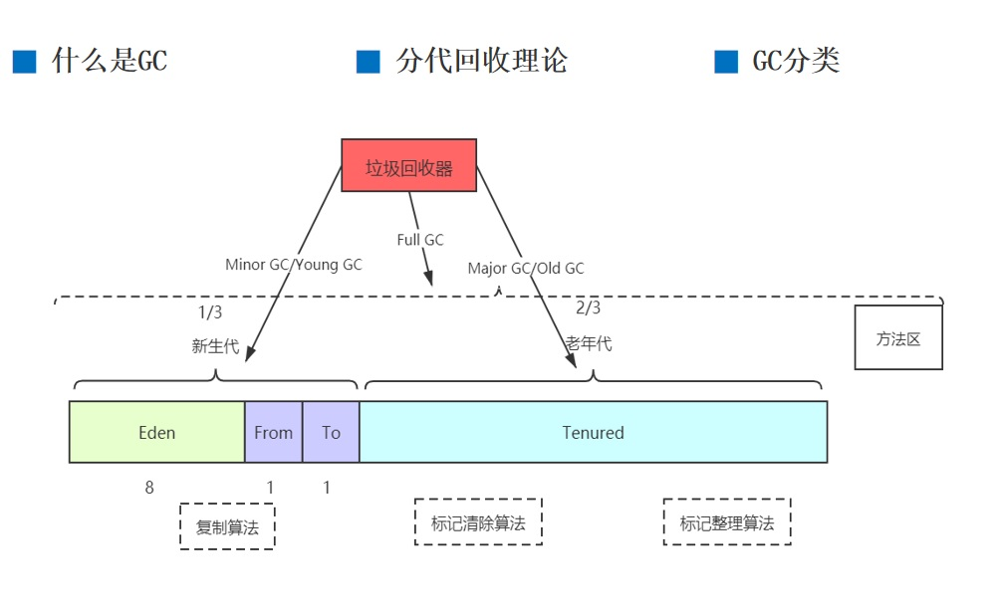
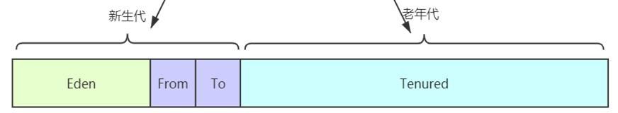
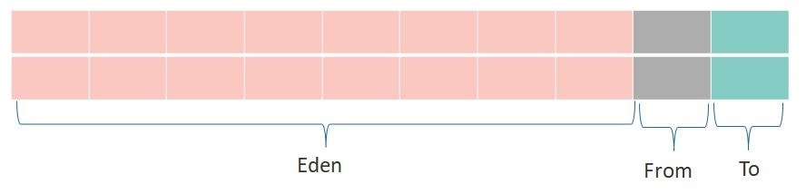
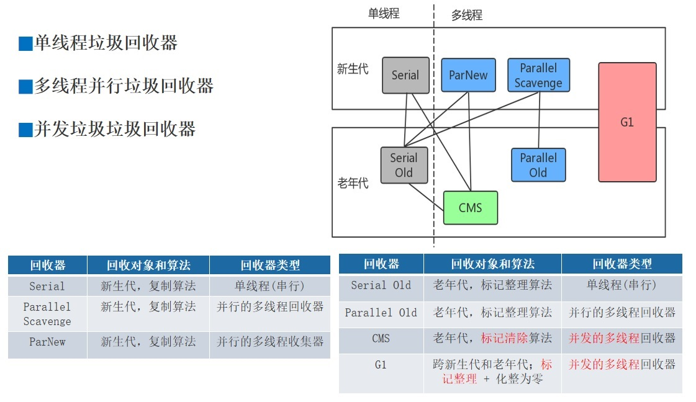
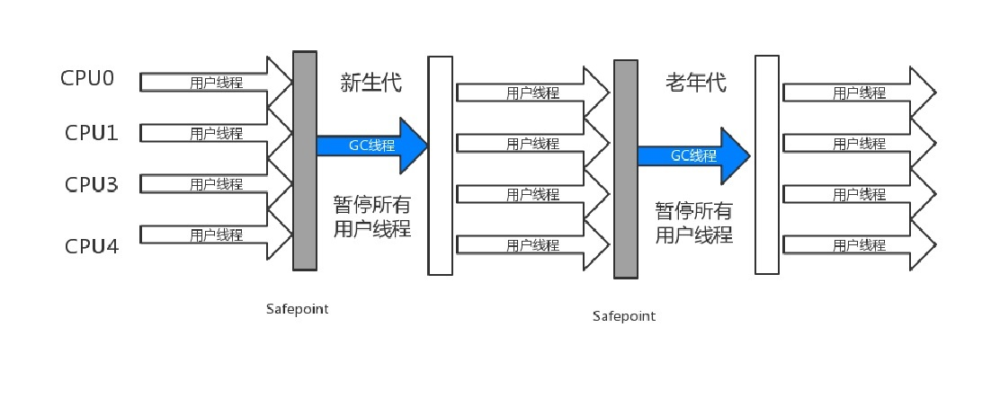
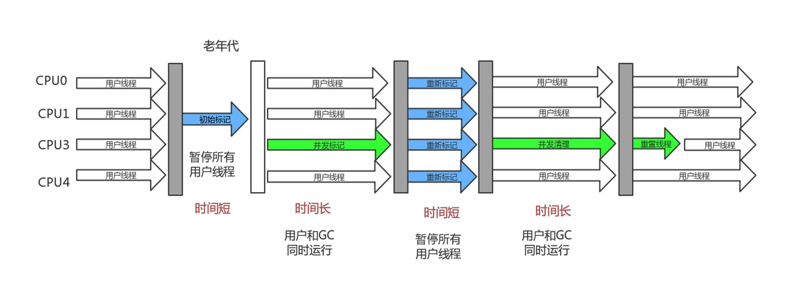
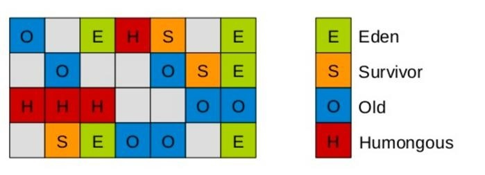
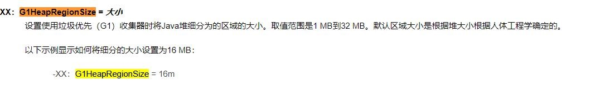
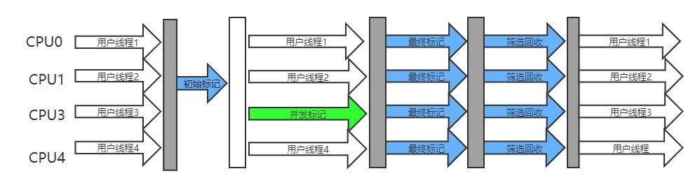
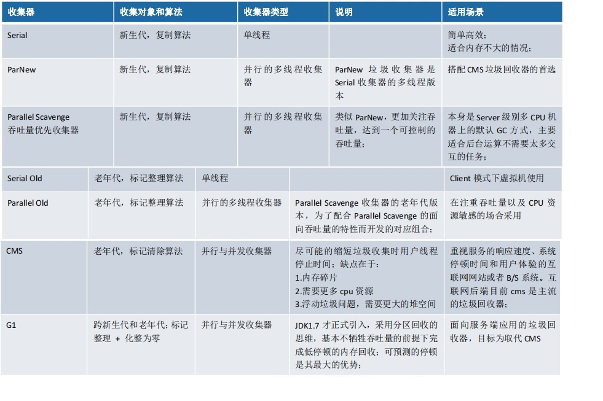

# 4. 垃圾回收机制及算法
## 4.1 垃圾回收基础知识
### 4.1.1 什么是 GC 
Java 与 C++等语言最大的技术区别：<strong>自动化的垃圾回收机制（GC）</strong>   
为什么要了解 GC 和内存分配策略     
1. 面试需要   
2. GC 对应用的性能是有影响的；   
3. 写代码有好处   
<strong>栈</strong>：栈中的生命周期是跟随线程，所以一般不需要关注   
<strong>堆</strong>：堆中的对象是垃圾回收的重点   
方法区/元空间：这一块也会发生垃圾回收，不过这块的效率比较低，一般不是我们关注的重点 
 

### 4.1.2 分代回收理论（重点） 
当前商业虚拟机的垃圾回收器，大多遵循“分代收集”的理论来进行设计，这个理论大体上是这么描述的：   
1. 绝大部分的对象都是朝生夕死。 
2. 熬过多次垃圾回收的对象就越难回收。 
根据以上两个理论，朝生夕死的对象放一个区域，难回收的对象放另外一个区域，这个就构成了**新生代和老年代**

 

### 4.1.3 GC 分类 
市面上发生垃圾回收的叫法很多，我大体整理了一下： 
1. <strong>新生代回收（Minor GC/Young GC）</strong>:指只是进行新生代的回收。 
2. <strong>老年代回收（Major GC/Old GC）</strong>:指只是进行老年代的回收。目前只有 CMS 垃圾回收器会有这个单独的回收老年代的行为.（Major GC 定义是比较混乱，有说指是老年代，有的说是做整个堆的收集，这个需要你根据别人的场景来定，没有固定的说法） 
3. <strong>整堆回收（Full GC）</strong>:收集整个 Java 堆和方法区(注意包含方法区)

## 4.2 垃圾回收算法（重点）

垃圾回收算法的实现设计到大量的程序细节，并且每一个平台的虚拟机操作内存的方式都有不同，所以不需要去了解算法的实现，我们重点讲解 3 种算法的思想。

### 4.2.1 复制算法（Copying） 

将可用内存按容量划分为大小相等的两块，每次只使用其中的一块。当这一块的内存用完了，就将还存活着的对象复制到另外一块上面，然后再把已使 用过的内存空间一次清理掉。这样使得每次都是对整个半区进行内存回收，内存分配时也就不用考虑内存碎片等复杂情况，只要按顺序分配内存即可， 实现简单，运行高效。只是这种算法的代价是将内存缩小为了原来的一半。

但是要注意：内存移动是必须实打实的移动（复制），所以对应的引用(直接指针)需要调整。 

**复制回收算法适合于新生代，因为大部分对象朝生夕死，那么复制过去的对象比较少，效率自然就高，另外一半的一次性清理是很快的**
:::tip Copying特点
实现简单、运行高效
没有内存碎片
利用率只有一半
 
:::
### 4.2.2 Appel式回收 

一种更加优化的复制回收分代策略：具体做法是分配一块较大的 Eden 区和两块较小的 Survivor 空间（你可以叫做 From 或者 To，也可以叫做 Survivor1 和 Survivor2） 专门研究表明，新生代中的对象 98%是“朝生夕死”的，所以并不需要按照 1:1 的比例来划分内存空间，而是将内存分为一块较大的 Eden 空间和两块较 小的 Survivor 空间，每次使用 Eden 和其中一块 Survivor[1]。

当回收时，将 Eden 和 Survivor 中还存活着的对象一次性地复制到另外一块 Survivor 空间上， 最后清理掉 Eden 和刚才用过的 Survivor 空间。 HotSpot 虚拟机默认 Eden 和 Survivor 的大小比例是 8:1，也就是每次新生代中可用内存空间为整个新生代容量的 90%（80%+10%），只有 10%的内存会被 “浪费”。

当然，98%的对象可回收只是一般场景下的数据，我们没有办法保证每次回收都只有不多于 10%的对象存活，当 Survivor 空间不够用时，需要 依赖其他内存（这里指老年代）进行分配担保（Handle Promotion）

:::tip Appel式回收  
提高空间利用率和空间分配担保  

 
:::

### 4.2.3 标记-清除算法（Mark-Sweep）

算法分为“标记”和“清除”两个阶段：
首先扫描所有对象标记出需要回收的对象--标记，  
再标记完成后扫描回收所有被标记的对象--清理，所以需要扫描两遍   
回收效率略低，如果大部分对象是朝生夕死，那么回收效率降低，因为需要大量标记对象和回收对象，对比复制回收效率要低。   

它的主要问题，标记清除之后会产生大量不连续的内存碎片，空间碎片太多可能会导致以后在程序运行过程中需要分配**较大对象**时，无法找到足够的连续内存而不得不提前触发另一次垃圾回收动作。  
回收的时候如果需要回收的对象越多，需要做的标记和清除的工作越多，所以标记清除算法适用于**老年代**。

:::tip 特点
位置不连续，产生碎片  
效率略低  
两遍扫描  
 
:::

### 4.2.4 标记-整理算法（Mark-Compact）
首先标记出所有需要回收的对象，在标记完成后，后续步骤不是直接对可回收对象进行清理，
而是让所有存活的对象都向一端移动，然后直接清理掉边界以外的内存。
标记整理算法虽然**没有内存碎片，但是效率偏低**。 
我们看到标记整理与标记清除算法的区别主要在于对象的移动。对象移动不单单会加重系统负担，同时需要全程暂停用户线程才能进行，同时所有引用 对象的地方都需要更新（直接指针需要调整）。 所以看到，老年代采用的标记整理算法与标记清除算法，各有优点，各有缺点。

:::tip 特点

没有内存碎片
效率偏低
两遍扫描、指针需要调整

 
:::

## 4.3 JVM 中常见的垃圾回收器

 

### 4.3.1 Serial/Serial Old（了解即可） 
JVM 刚诞生就只有这种，最古老的，单线程，独占式，成熟，适合单 CPU，一般用在客户端模式下。  
这种垃圾回收器只适合**几十兆到一两百兆**的堆空间进行垃圾回收（可以控制停顿时间再 100ms 左右），  
但是对于超过这个大小的内存回收速度很慢，所以对于现在来说这个垃圾回收器已经是一个鸡肋。 
 

#### 4.3.1.1 参数设置
-XX:+UseSerialGC 新生代和老年代都用串行收集器

#### 4.3.1.2 Stop The World（STW）（重点） 
单线程进行垃圾回收时，必须暂停所有的工作线程，直到它回收结束。这个暂停称之为“Stop The World”,但是这种 STW 带来了恶劣的用户体验,例如:应 用每运行一个小时就需要暂停响应 5 分。  
这个也是早期 JVM 和 java 被 C/C++语言诟病性能差的一个重要原因。所以 JVM 开发团队一直努力消除或降低 STW 的时间。

## 4.4 Parallel Scavenge（ParallerGC）/Parallel Old（重点） 
为了提高回收效率，从 JDK1.3 开始，JVM 使用了多线程的垃圾回收机制，关注吞吐量的垃圾收集器，高吞吐量则可以高效率地利用 CPU 时间，尽快完成程序的运算任务，主要适合在后台运算而不需要太多交互的任务。    
所谓吞吐量就是 CPU 用于运行用户代码的时间与 CPU 总消耗时间的比值，即吞吐量=运行用户代码时间/（运行用户代码时间+垃圾收集时间），虚拟机总共运行了 100 分钟，其中垃圾收集花掉 1 分钟，那吞吐量就是 99%。 
该垃圾回收器适合回收堆空间**上百兆~几个 G**。

### 4.4.1 参数设置 
开启参数 
#### 4.4.1.1 -XX:+UseParallelGC
新生代使用 Parallel Scavenge，老年代使用 Parallel Old 收集器提供了两个参数用于精确控制吞吐量，
分别<strong>控制的停顿时间的-XX:MaxGCPauseMillis</strong> 参数以及<strong>直接设置吞吐量大小的-XX:GCTimeRatio 参数</strong>  

<a data-fancybox title="Parallel/ParallelOld" href="https://docs.oracle.com/javase/8/docs/technotes/tools/unix/java.html">https://docs.oracle.com/javase/8/docs/technotes/tools/unix/java.html</a> 

#### 4.4.1.2 -XX:MaxGCPauseMillis
为最大 GC 暂停时间（以毫秒为准）设定目标。这是一个软目标，合资公司将尽最大努力实现它。默认情况下，没有最大暂停时间值。

以下示例显示如何将最大目标暂停时间设置为 500 ms：
-XX:MaxGCPauseMillis=500

不过大家不要异想天开地认为如果把这个参数的值设置得更小一点就能使得系统的垃圾收集速度变得更快，垃圾收集停顿时间缩短是以牺牲吞吐 量和新生代空间为代价换取的:系统把新生代调得小一些，收集 300MB 新生代肯定比收集 500MB 快，但这也直接导致垃圾收集发生得更频繁，原来 10 秒 收集一次、每次停顿 100 毫秒，现在变成 5 秒收集一次、 每次停顿 70 毫秒。停顿时间的确在下降，但吞吐量也降下来了。

#### 4.4.1.3 -XX:GCTimeRatio 

-XX:GCTimeRatio 参数的值则应当是一个大于 0 小于 100 的整数，也就是垃圾收集时间占总时间的比率，相当于吞吐量的倒数。 例如：把此参数设置为 19, 那允许的最大垃圾收集时占用总时间的 5% (即 1/(1+19))， 默认值为 99，即允许最大 1% (即 1/(1+99))的垃圾收集时间 由于与吞吐量关系密切，ParallelScavenge 是“吞吐量优先垃圾回收器”。 

#### 4.4.1.4 -XX:+UseAdaptiveSizePolicy 

启用自适应生成尺寸。默认情况下，此选项已启用。要禁用自适应生成大小，请明确指定和设置内存分配池的大小（参见选项）。-XX:-UseAdaptiveSizePolicy-XX:SurvivorRatio
-XX:+UseAdaptiveSizePolicy （默认开启）。这是一个开关参数， 当这个参数被激活之后，就不需要人工指定新生代的大小(-Xmn)、Eden 与 Survivor 区的 比例(-XX:SurvivorRatio)、 晋升老年代对象大小(-XX:PretenureSizeThreshold)等细节参数了，虚拟机会根据当前系统的运行情况收集性能监控信息，动态调 整这些参数以提供最合适的停顿时间或者最大的吞吐量。

## 4.5 ParNew （了解即可）

多线程垃圾回收器，与 CMS 进行配合，对于 CMS(CMS 只回收老年代)，新生代垃圾回收器只有 Serial 与 ParNew 可以选。和 Serial 基本没区别，唯一的区 别：多线程，多 CPU 的，停顿时间比 Serial 少。（在 JDK9 以后，把 ParNew 合并到了 CMS 了） 大致了解下搭配关系即可，后续版本已经接近淘汰。

## 4.6 Concurrent Mark Sweep （CMS）

 

收集器是一种以获取最短回收停顿时间为目标的收集器。目前很大一部分的 Java 应用集中在互联网站或者 B/S 系统的服务端上，这类应用尤其重视服务 的响应速度，希望系统停顿时间最短，以给用户带来较好的体验。CMS 收集器就非常符合这类应用的需求。 从名字（包含“Mark Sweep”）上就可以看出，CMS 收集器是基于“标记—清除”算法实现的，它的运作过程相对于前面几种收集器来说更复杂一些，
:::tip 整个过程分为 4 个步骤
▶ **初始标记-短暂**    
仅仅只是标记一下 GC Roots 能直接关联到的对象，速度很快。   
▶ **并发标记-和用户的应用程序同时进行**    
进行 GC Roots 追踪的过程，标记从 GCRoots 开始关联的所有对象开始遍历整个可达分析路径的对象。这个时间比较长，所以采用并发处理（垃圾回收器线程和用户线程同时工作）   
▶ **重新标记-短暂**     
为了修正并发标记期间因用户程序继续运作而导致标记产生变动的那一部分对象的标记记录，这个阶段的停顿时间一般会比初始标 记阶段稍长一些，但远比并发标记的时间短。   
▶ **并发清除**    
由于整个过程中耗时最长的并发标记和并发清除过程收集器线程都可以与用户线程一起工作，所以，从总体上来说，CMS 收集器的内存回收过程是与用 户线程一起并发执行的。 -XX:+UseConcMarkSweepGC ，表示新生代使用 ParNew，老年代的用 CMS
:::

<strong>CPU 敏感</strong>：CMS 对处理器资源敏感，毕竟采用了并发的收集、当处理核心数不足 4 个时，CMS 对用户的影响较大。 

<strong>浮动垃圾</strong>：由于 CMS 并发清理阶段用户线程还在运行着，伴随程序运行自然就还会有新的垃圾不断产生，这一部分垃圾出现在标记过程之后，CMS 无法 在当次收集中处理掉它们，只好留待下一次 GC 时再清理掉。这一部分垃圾就称为“浮动垃圾”。 由于浮动垃圾的存在，因此需要预留出一部分内存，意味着 CMS 收集不能像其它收集器那样等待老年代快满的时候再回收。 在 1.6 的版本中老年代空间使用率阈值(92%) 如果预留的内存不够存放浮动垃圾，就会出现 Concurrent Mode Failure，这时虚拟机将临时启用 Serial Old 来替代 CMS。 

<strong>会产生空间碎片</strong>：标记 - 清除算法会导致产生不连续的空间碎片 总体来说，CMS 是 JVM 推出了第一款并发垃圾收集器，所以还是非常有代表性。 但是最大的问题是 CMS 采用了标记清除算法，所以会有内存碎片，当碎片较多时，给大对象的分配带来很大的麻烦，为了解决这个问题，CMS 提供一个 参数：-XX:+UseCMSCompactAtFullCollection，一般是开启的，如果分配不了大对象，就进行内存碎片的整理过程。 这个地方一般会使用 Serial Old ，因为 Serial Old 是一个单线程，所以如果内存空间很大、且对象较多时,CMS 发生这样情况会很卡。

## 4.7 Garbage First(G1)

## 4.7.1 设计思想 

随着 JVM 中内存的增大，STW 的时间成为 JVM 急迫解决的问题，但是如果按照传统的分代模型，总跳不出 STW 时间不可预测这点。 为了实现 STW 的时间可预测，首先要有一个思想上的改变。

G1 将堆内存“化整为零”，将堆内存划分成多个大小相等独立区域（Region），每一个 Region 都可以根据需要，扮演新生代的 Eden 空间、Survivor 空间，或者老年代空间。回收器能够对扮演不同角色的 Region 采用不同的策略去处理，这样无论是 新创建的对象还是已经存活了一段时间、熬过多次收集的旧对象都能获取很好的收集效果。

## 4.7.2 Region 
Region 可能是 Eden,也有可能是 Survivor,也有可能是 Old,另外 Region 中还有一类特殊的 Humongous 区域，专门用来存储大对象。 G1 认为只要大小超过 了一个 Region 容量一半的对象即可判定为大对象。每个 Region 的大小可以通过参数-XX:G1HeapRegionSize 设定，取值范围为 1MB~32MB,且应为 2 的 N 次 幂。而对于那些超过了整个 Region 容量的超级大对象，将会被存放在 N 个连续的 Humongous Region 之中，G1 的进行回收大多数情况下都把 Humongous Region 作为老年代的一部分来进行看待。
 

## 4.7.3参数设置 

**开启参数 -XX:+UseG1GC** 

**分区大小 -XX:+G1HeapRegionSize**
一般建议逐渐增大该值，随着 size 增加，垃圾的存活时间更长，GC 间隔更长，但每次 GC 的时间也会更长。
 

**最大 GC 暂停时间 MaxGCPauseMillis**

## 4.7.4 运行过程

 

:::tip G1 的运作过程

<strong>初始标记( Initial Marking)</strong>  

仅仅只是标记一下 GC Roots 能直接关联到的对象，并且修改 TAMS 指针的值，让下一阶段用户线程并发运行时，能正确地在可用的 Region 中分配新对象。 这个阶段需要停顿线程，但耗时很短，而且是借用进行 Minor GC 的时候同步完成的，所以 G1 收集器在这个阶段实际并没有额外的停顿。 

<strong>TAMS 是什么？</strong>   

要达到 GC 与用户线程并发运行，必须要解决回收过程中新对象的分配，所以 G1 为每一个 Region 区域设计了两个名为 TAMS（Top at Mark Start）的指针， 从 Region 区域划出一部分空间用于记录并发回收过程中的新对象。这样的对象认为它们是存活的，不纳入垃圾回收范围。 

<strong>并发标记( Concurrent Marking)</strong>  

从 GC Root 开始对堆中对象进行可达性分析，递归扫描整个堆里的对象图，找出要回收的对象，这阶段耗时较长，但可与用户程序并发执行。当对象图扫 描 完 成 以 后 ， 并 发 时 有 引 用 变 动 的 对 象 ， 这 些 对 象 会 漏 标 （ 后 续 再 讲 三 色 标 记 的 时 候 会 细 讲 这 个 问 题 ） ， 漏 标 的 对 象 会 被 一 个 叫 做 SATB(snapshot-at-the-beginning)算法来解决（这个下节课会细讲）

<strong>最终标记( Final Marking)</strong>  

对用户线程做另一个短暂的暂停，用于处理并发阶段结后仍遗留下来的最后那少量的 SATB 记录(漏标对象)。 

<strong>筛选回收( Live Data Counting and Evacuation)</strong>   
负责更新 Region 的统计数据，对各个 Region 的回收价值和成本进行排序，根据用户所期望的停顿时间来制定回收计划，可以自由选择任意多个 Region 构 成回收集，然后把决定回收的那一部分 Region 的存活对象复制到空的 Region 中，再清理掉整个旧 Region 的全部空间。这里的操作涉及存活对象的移动， 是必须暂停用户线程，由多条收集器线程并行完成的。
:::

:::tip 特点
<strong>并行与并发</strong>：G1 能充分利用多 CPU、多核环境下的硬件优势，使用多个 CPU（CPU 或者 CPU 核心）来缩短 Stop-The-World 停顿的时间，部分其他收集器 原本需要停顿 Java 线程执行的 GC 动作，G1 收集器仍然可以通过并发的方式让 Java 程序继续执行。 

<strong>分代收集</strong>：与其他收集器一样，分代概念在 G1 中依然得以保留。虽然 G1 可以不需要其他收集器配合就能独立管理整个 GC 堆，但它能够采用不同的方式 去处理新创建的对象和已经存活了一段时间、熬过多次 GC 的旧对象以获取更好的收集效果。 

<strong>空间整合</strong>：与 CMS 的“标记—清理”算法不同，G1 从整体来看是基于“标记—整理”算法实现的收集器，从局部（两个 Region 之间）上来看是基于“复制”算法实现的，但无论如何，这两种算法都意味着 G1 运作期间不会产生内存空间碎片，收集后能提供规整的可用内存。这种特性有利于程序长时间运行，分配大对象时不会因为无法找到连续内存空间而提前触发下一次 GC。 

<strong>追求停顿时间</strong>： -XX:MaxGCPauseMillis 指定目标的最大停顿时间，G1 尝试调整新生代和老年代的比例，堆大小，晋升年龄来达到这个目标时间。 怎么玩？ 该垃圾回收器适合回收堆空间上百 G。一般在 G1 和 CMS 中间选择的话平衡点在 6~8G，只有内存比较大 G1 才能发挥优势。
:::

## 4.8 垃圾回收器整理（重点）

 

并行：垃圾收集的多线程的同时进行。    
并发：垃圾收集的多线程和应用的多线程同时进行。   
注：吞吐量=运行用户代码时间/(运行用户代码时间+ 垃圾收集时间)   
垃圾收集时间= 垃圾回收频率 * 单次垃圾回收时间
