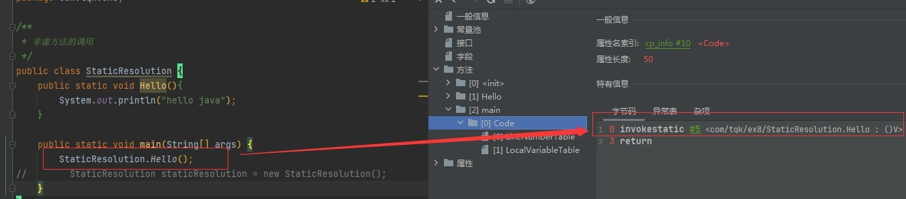
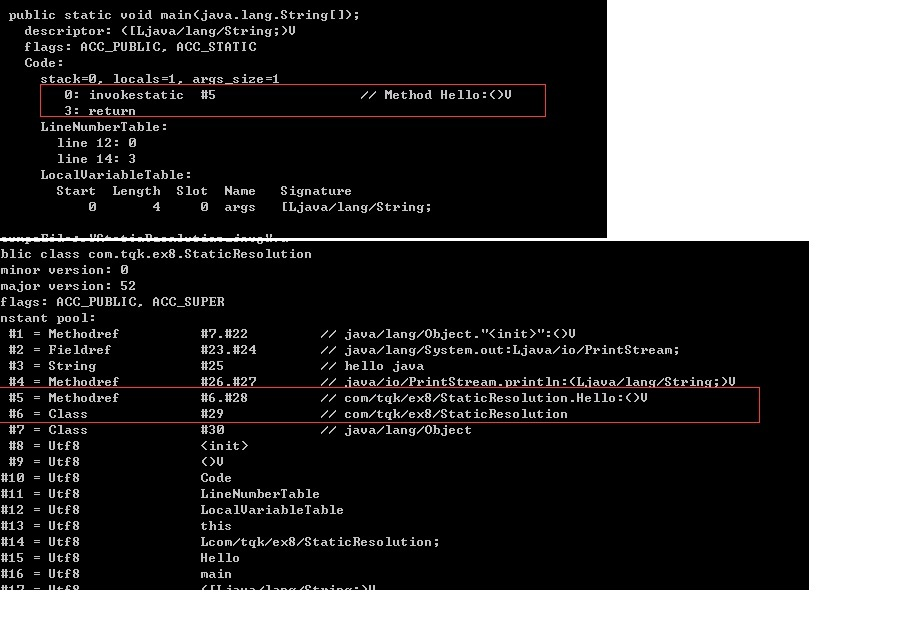
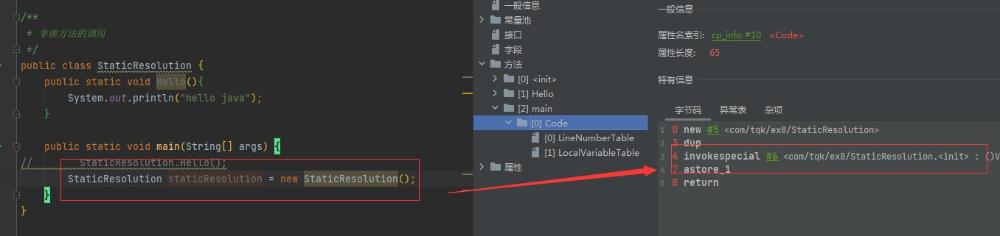
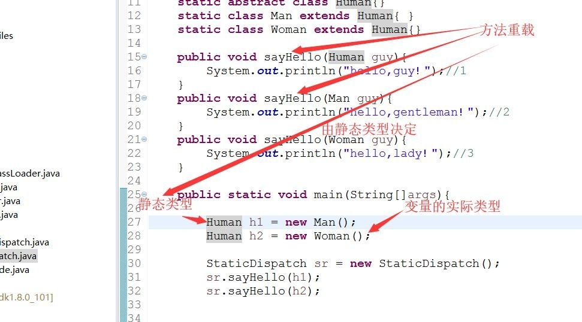
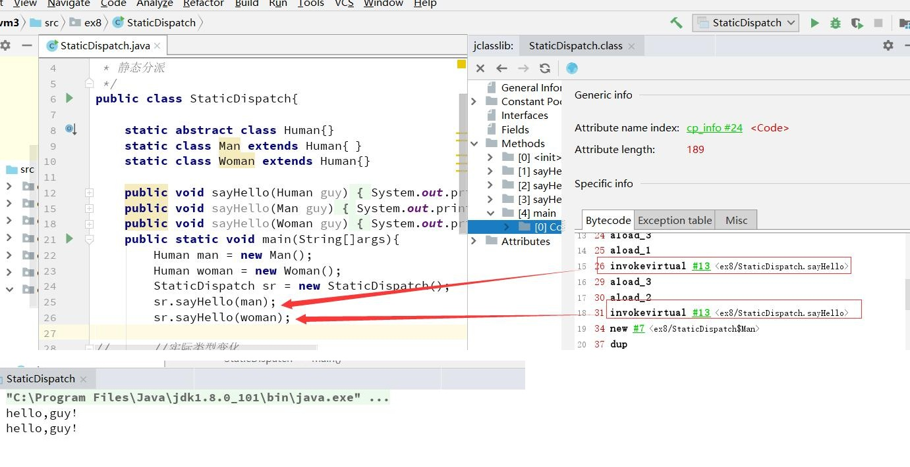
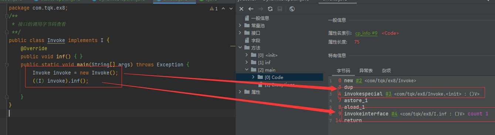
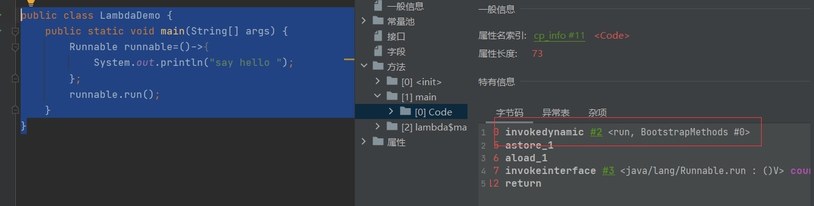
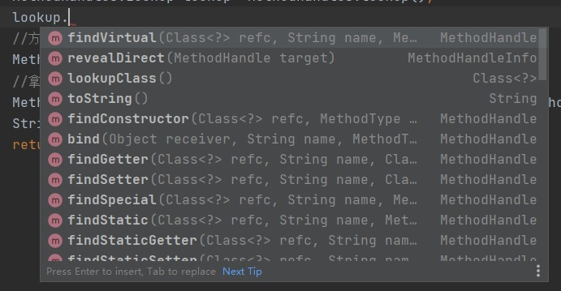

# 8.方法调用的底层实现

<font color='blue'><strong>我们写的代码，经过编译、经过类加载的各种阶段，进入了JVM的运行时数据区。  
但作为程序员真正关心是代码的执行，代码的执行其实本质上是方法的执行，站在JVM的角度归根到底还是字节码的执行。  
main函数是JVM指令执行的起点，JVM会创建main线程来执行main函数，以触发JVM一系列指令的执行，真正地把JVM跑起来。  
接着在我们的代码中，就是方法调用方法的过程，所以了解方法在JVM中的调用是非常必要的</strong></font>

## 8.1 方法调用的字节码指令

**关于方法的调用，Java字节码共提供了5个指令，来调用不同类型的方法**

:::tip 方法调用字节码的指令
1. <font color='red'><strong>invokestatic：</strong></font> 用来调用静态方法； 
2. <font color='red'><strong>invokespecial：</strong></font> 用于调用私有实例方法、构造器及 super 关键字等； 
3. <font color='red'><strong>invokevirtual：</strong></font> 用于调用非私有实例方法，比如 public 和 protected，大多数方法调用属于这一种； 
4. <font color='red'><strong>invokeinterface：</strong></font> 和上面这条指令类似，不过作用于接口类； 
5. <font color='red'><strong>invokedynamic：</strong></font> 用于调用动态方法。
:::

## 8.2 非虚方法

如果方法在编译期就确定了具体的调用版本，这个版本在运行时是不可变的，这样的方法称为<font color='red'><strong>非虚方法</strong></font> 

只要能被<font color='red'><strong>invokestatic</strong></font>和<font color='red'><strong>invokespecial</strong></font>指令调用的方法，都可以在解析阶段中确定唯一的调用版本，Java语言里符合这个条件的方法共有<font color='blue'><strong>静态方法、私有方法、实例构造器、父类方法</strong></font>4种，再加上被 **final修饰的方法(尽管它使用 invokevirtual 指令调用)**，这5种方法调用会在类加载的时候就可以把符号引用解析为该方法的直接引用。不需要在运行时再去完成

### 8.2.1 invokestatic用来调用静态方法

```java
/**
 * 非虚方法的调用
 */
public class StaticResolution {
    public static void Hello(){
        System.out.println("hello java");
    }

    public static void main(String[] args) {
        StaticResolution.Hello();
    }
}
```
<a data-fancybox title="非虚方法的调用" href="./image/invokestatic.jpg"></a>

这个方法调用在编译期间就明确以常量池项的形式固化在字节码指令的参数之中了

<a data-fancybox title="非虚方法的调用" href="./image/invokestatic1.jpg"></a>


### 8.2.2 invokespecial用于调用私有实例方法、构造器及super关键字等

```java
/**
 * 非虚方法的调用
 */
public class StaticResolution {
    public static void Hello(){
        System.out.println("hello java");
    }

    public static void main(String[] args) {
        StaticResolution staticResolution = new StaticResolution();
    }
}
```
<a data-fancybox title="非虚方法的调用" href="./image/invokespecial.jpg"></a>

## 8.3 虚方法

与非虚方法相反，不是非虚方法的方法就是虚方法  
主要包括以下字节码中的两类     
▶ invokevirtual 用于调用非私有实例方法，比如 public 和 protected，大多数方法调用属于这一种（排除掉被 final 修饰的方法）  
▶ invokeinterface 和上面这条指令类似，不过作用于接口类  

**为什么叫做虚方法呢？**
就是方法在运行时是可变的。很多时候JVM需要根据调用者的动态类型，来确定调用的目标方法，这就是动态绑定的过程；
相对比，invokestatic 指令加上 invokespecial 指令，就属于静态绑定过程。 
因为 invokeinterface 指令跟 invokevirtual 类似，只是作用与接口，所以我们只要熟悉 invokevirtual 即可。

### 8.3.1 分派

要了解虚方法我们必须了解以下基础： Java 是一门面向对象的程序语言，因为 Java 具备面向对象的 3个基本特征:继承、封装和多态。 

分派调用过程将会揭示多态性特征的一些最基本的体现，如“重载”和“重写”在Java虚拟机之中是如何实现的

#### 8.3.1.1 静态分派

多见于方法的重载。（重载：一个类中允许同时存在一个以上的同名方法，这些方法的参数个数或者类型不同）
```java
/**
 * 静态分派--方法的重载--编译阶段
 */
public class StaticDispatch{

	static abstract class Human{
		abstract void sayhello();
	}
	static class Man extends Human{
		@Override
		void sayhello() {
			System.out.println("hello,Man！");
		}
	}
	static class Woman extends Human{
		@Override
		void sayhello() {
			System.out.println("hello,Woman！");
		}
	}

	public void sayHello(Human guy){
		System.out.println("hello,guy！");
	}
	public void sayHello(Man guy){
		System.out.println("hello,gentleman！");
	}
	public void sayHello(Woman guy){
		System.out.println("hello,lady！");
	}
	public static void main(String[]args){
		StaticDispatch sr = new StaticDispatch();
		Human man = new Man();
		Human woman = new Woman();

		sr.sayHello(man);
		sr.sayHello(woman);
	}
}
```

<a data-fancybox title="静态分派" href="./image/staticpai.jpg"></a>

“Human”称为变量的静态类型（Static Type），或者叫做的外观类型（Apparent Type），后面的“Man”则称为变量的实际类型（Actual Type）。 

静态类型和实际类型在程序中都可以发生一些变化，区别是静态类型的变化仅仅在使用时发生，变量本身的静态类型不会被改变，并且最终的静态类型是在编译期可知的；而实际类型变化的结果在运行期才可确定，编译器在编译程序的时候并不知道一个对象的实际类型是什么。

 代码中定义了两个静态类型相同但实际类型不同的变量，但<font color='red'>虚拟机（准确地说是编译器）在重载时是通过参数的**静态类型**而不是**实际类型**作为判定依据的</font>。并且静态类型是编译期可知的。 因此在编译阶段Javac 编译器会根据参数的静态类型决定使用哪个重载版本，所以选择了 sayHello（Human） 作为调用目标。所有依赖静态类型来定位方法执行版本的分派动作称为静态分派。

 静态分派的典型应用是方法重载。**静态分派发生在编译阶段**，因此确定静态分派的动作实际上不是由虚拟机来执行的。 所以代码运行结果如下：
<a data-fancybox title="静态分派" href="./image/staticpai1.jpg"></a>

#### 8.3.1.2 动态分派

多见于方法的重写。（重写：在子类中将父类的成员方法的名称保留，重新编写成员方法的实现内容，更改方法的访问权限，修改返 回类型的为父类返回类型的子类。）

```java
/**
 * 动态分派（多态）
 */
public class DynamicDispatch {

    static abstract class Virus{ //病毒
        protected abstract void ill();//生病
    }
    static class Cold extends Virus{
        @Override
        protected void ill() {
            System.out.println("感冒了，好不舒服！");
        }
    }
    static class CoronaVirus extends Virus{//冠状病毒
        @Override
        protected void ill() {
            System.out.println("粘膜感染，空气传播，请带好口罩！");
        }
    }
    public static void main(String[] args) {

        Virus clod=new Cold();//感冒了
        clod.ill();
        System.out.println("hashcode:"+clod.hashCode());
        clod = new CoronaVirus();//（多态）
        System.out.println("hashcode:"+clod.hashCode());
        clod.ill();
    }
}
```
重写也是使用 invokevirtual 指令，只是这个时候具备多态性。

:::tip invokevirtual 指令有多态查找的机制，该指令运行时，解析过程如下： 
1. 找到操作数栈顶的第一个元素所指向的对象实际类型，记做 c； 
2. 如果在类型 c 中找到与常量中的描述符和简单名称都相符的方法，则进行访问权限校验，如果通过则返回这个方法直接引用，查找过程结束，不通过则返回 java.lang.IllegalAccessError； 
3. 否则，按照继承关系从下往上依次对 c 的各个父类进行第二步的搜索和验证过程； 
4. 如果始终没找到合适的方法，则抛出 java.lang.AbstractMethodError 异常，这就是 Java 语言中方法重写的本质。
::: 
另外一点，这个时候我如果结合之前课程中讲过虚拟机栈中的内容，我就知道动态链接是干嘛的：   
invokevirtual 可以知道方法 call()的符号引用转换是在运行时期完成的，在方法调用的时候。
部分符号引用在运行期间转化为直接引用,这种转化就是动态链接。栈帧执行对内存区域的影响


**方法表** 

动态分派会执行非常频繁的动作，JVM 运行时会频繁的、反复的去搜索元数据，所以 JVM 使用了一种优化手段，**这个就是在方法区中建立一个虚方法表使用虚方法表索引来替代元数据查找以提高性能**
<a data-fancybox title="方法表" href="./image/methodtable.jpg"></a>

在实现上，最常用的手段就是为类在方法区中建立一个虚方法表。虚方法表中存放着各个方法的实际入口地址。如果某个方法在子类中没有被重写，那子类的虚方法表里面的地址入口和父类相同方法的地址入口是一致的，都指向父类的实现入口。如果子类中重写了这个方法，子类方法表中的地址将会 替换为指向子类实现版本的入口地址。PPT 图中，Son 重写了来自Father的全部方法，因此 Son 的方法表没有指向 Father 类型数据的箭头。但是 Son 和 Father 都没有重写来自 Object 的方法，所以它们的方法表中所有从 Object 继承来的方法都指向了 Object

### 8.3.2 接口调用

**invokeinterface 作用于接口类**

```java
/**
 * 接口
 **/
public interface I {
    default void infM(){

    }
    void inf();
}
/**
 * 接口的调用字节码查看
 **/
public class Invoke implements I {
    @Override
    public void inf() { }
    public static void main(String[] args) throws Exception {
        Invoke invoke = new Invoke();
        ((I) invoke).inf();

    }
}
```
<a data-fancybox title="invokeinterface" href="./image/invokeinterface.jpg"></a>

### 8.3.3 Lambda表达式

#### 8.3.3.1 invokedynamic 

这个字节码是比较复杂。和反射类似，它用于一些动态的调用场景，但它和反射有着本质的不同，效率也比反射要高得多

```java
public class LambdaDemo {
    public static void main(String[] args) {
        Runnable runnable=()->{
            System.out.println("say hello ");
        };
        runnable.run();
    }
}
```
<a data-fancybox title="invokedynamic" href="./image/invokedynamic.jpg"></a>

#### 8.3.3.2 方法句柄（MethodHandle）

<a data-fancybox title="invokedynamic" href="https://docs.oracle.com/javase/7/docs/api/java/lang/invoke/MethodHandles.html">官方文档解释：https://docs.oracle.com/javase/7/docs/api/java/lang/invoke/MethodHandles.html</a> 

invokedynamic 指令的底层，是使用方法句柄（MethodHandle）来实现的。
方法句柄是一个能够被执行的引用，它可以指向静态方法和实例方法，以及虚构的get和set方法，从以下案例中可以看到MethodHandle提供的一些方法。
<a data-fancybox title="MethodHandle" href="./image/MethodHandle.jpg"></a>

MethodHandle 是什么？简单的说就是方法句柄，通过这个句柄可以调用相应的方法。 

:::tip 用MethodHandle调用方法的流程
1. 创建MethodType,获取指定方法的签名（出参和入参） 
2. 在Lookup中查找MethodType的方法句柄MethodHandle 
3. 传入方法参数通过MethodHandle调用方法
:::

##### 8.3.3.2.1 MethodType 

MethodType 表示一个方法类型的对象，每个 MethodHandle 都有一个 MethodType 实例，MethodType 用来指明方法的返回类型和参数类型。其有多个工厂方法的重载。

```java
        //方法类型表示接受的参数和返回类型（第一个参数是返回参数）
        MethodType methodType=MethodType.methodType(String.class);


        STATIC METHODTYPE METHODTYPE(CLASS<?> RTYPE) 
        STATIC METHODTYPE METHODTYPE(CLASS<?> RTYPE, CLASS<?> PTYPE0) 
        STATIC METHODTYPE METHODTYPE(CLASS<?> RTYPE, CLASS<?>[] PTYPES) 
        STATIC METHODTYPE METHODTYPE(CLASS<?> RTYPE, CLASS<?> PTYPE0, CLASS<?>... PTYPES) 
        STATIC METHODTYPE METHODTYPE(CLASS<?> RTYPE, LIST<CLASS<?>> PTYPES) 
        STATIC METHODTYPE METHODTYPE(CLASS<?> RTYPE, METHODTYPE PTYPES)
```

##### 8.3.3.2.2 Lookup

MethodHandle.Lookup 可以通过相应的 findxxx 方法得到相应的 MethodHandle，相当于 MethodHandle 的工厂方法。

查找对象上的工厂方法对应于方法、构造函数和字段的所有主要用例。 findStatic相当于得到的是一个static方法的句柄（类似于invokestatic的作用），findVirtual 找的是普通方法（类似于 invokevirtual的作用）

##### 8.3.3.2.3 invoke
其中需要注意的是 invoke 和 invokeExact,前者在调用的时候可以进行返回值和参数的类型转换工作，而后者是精确匹配的。 所以一般在使用是，往往 invoke 使用比 invokeExact 要多，因为 invokeExact 如果类型不匹配，则会抛错。

```java
/**
 * 方法句柄 MethodHandle
 *
 */
public class MethodHandleDemo {
    static  class  Bike  {
        String  sound()  {
            return  "ding  ding ding";
        }
    }
    static  class  Animal  {
        String  sound()  {
            return  "wow  wow wow";
        }
    }
    static  class  Man  extends  Animal  {
        @Override
        String  sound()  {
            return  "窝 室 嫩 叠";
        }
    }
    public static void main(String[] args) throws Throwable {
        System.out.println(sound(new Bike(),"sound"));
        System.out.println(sound(new Animal(),"sound"));
        System.out.println(sound(new Man(),"sound"));
    }
    static  String sound(Object object,String methodName) throws Throwable {
        //方法句柄--工厂方法Factory
        MethodHandles.Lookup lookup= MethodHandles.lookup();
//        lookup.
        //方法类型表示接受的参数和返回类型（第一个参数是返回参数）
        MethodType methodType=MethodType.methodType(String.class);
        //拿到具体的MethodHandle(findVirtual相当于字节码)
        MethodHandle methodHandle=lookup.findVirtual(object.getClass(),methodName,methodType);
        String msg=(String) methodHandle.invoke(object);
        return  msg;
    }
}
```
##### 8.3.3.2.4 Lambda表达式的捕获与非捕获

当 Lambda 表达式访问一个定义在 Lambda 表达式体外的非静态变量或者对象时，这个 Lambda 表达式称为“捕获的”


那么“非捕获”的 Lambda 表达式来就是 Lambda 表达式没有访问一个定义在 Lambda 表达式体外的非静态变量或者对象
```java
/**
 *当 Lambda 表达式访问一个定义在 Lambda 表达式体外的非静态变量或者对象时，这个 Lambda 表达式称为“捕获的”
 *当 Lambda 表达式没有访问一个定义在 Lambda 表达式体外的非静态变量或者对象,那么这个表达式是非捕获的Lambda表达式
 */
public class LambdaCapture {
    public static void main(String[] args) {
        repeatMessage("捕获",3);
        repeatMessage();
    }
    public static void repeatMessage(String text, int count) {//捕获型

        Runnable r = () -> {
            for (int i = 0; i < count; i++) {
                System.out.println(text);
            }
        };
        new Thread(r).start();
    }
    public static void repeatMessage() {//非捕获型
        Runnable r = () -> {
                System.out.println("窝 嫩 叠!");
        };
        new Thread(r).start();
    }
}
```


Lambda 表达式是否是捕获的和性能悄然相关。一个非捕获的 lambda 通常比捕获的更高效，非捕获的 lambda 只需要计算一次. 然后每次使用到它都会返 回一个唯一的实例。
而捕获的lambda表达式每次使用时都需要重新计算一次，而且从目前实现来看，它很像实例化一个匿名内部类的实例。 lambda最差的情况性能内部类一样，好的情况肯定比内部类性能高。 

Oracle 公司的性能比较的文档，详细而全面的比较了lambda表达式和匿名函数之间的性能差别。 lambda 开发组也有一篇 PPT 其中也讲到了 lambda 的性能(包括 capture 和非 capture 的情况)。 lambda 最差的情况性能内部类一样， 好的情况肯定比内部 类性能高。 

https://www.oracle.com/technetwork/java/jvmls2013kuksen-2014088.pdf 

http://nerds-central.blogspot.tw/2013/03/java-8-lambdas-they-are-fast-very-fast.html
##### 8.3.3.2.5 总结

Lambda 语言实际上是通过方法句柄来完成的，大致这么实现
**JVM 编译的时候使用 invokedynamic 实现 Lambda 表达式，invokedynamic 的是使用 MethodHandle 实现的，所以 JVM 会根据你编写的 Lambda 表达式的代码，编译出一套可以去调用 MethodHandle 的字节码代 码，参考实例类：MethodHandleDemo**

句柄类型（MethodType）是我们对方法的具体描述，配合方法名称，能够定位到一类函数。访问方法句柄和调用原来的指令基本一致，但它的调用异常， 包括一些权限检查，在运行时才能被发现。 案例中，我们完成了动态语言的特性，通过方法名称和传入的对象主体，进行不同的调用，而 Bike 和 Man 类，可以没有任何关系。 可以看到 Lambda 语言实际上是通过方法句柄来完成的，在调用链上自然也多了一些调用步骤，那么在性能上，是否就意味着 Lambda 性能低呢？对于大部分“非捕获”的 Lambda 表达式来说，JIT 编译器的逃逸分析能够优化这部分差异，性能和传统方式无异；但对于“捕获型”的表达式来说，则需要通过方法句柄，不断地生成适配器，性能自然就低了很多（不过和便捷性相比，一丁点性能损失是可接受的）。 invokedynamic 指令，它实际上是通过方法句柄来实现的。和我们关系最大的就是 Lambda 语法，我们了解原理，可以忽略那些对 Lambda 性能高低的 争论，同时还是要尽量写一些“非捕获”的 Lambda 表达式。