# 2. 深入理解JVM的内存区域

## 2.1 深入理解运行时数据区

<a data-fancybox title="深入理解JVM内存区域" href="./image/jvm21.jpg"></a> 

<a data-fancybox title="深入理解JVM内存区域" href="./image/jvm21.jpg"></a> 

 ```java
 /**
 * -Xms30m -Xmx30m -Xss1m -XX:MaxMetaspaceSize=30m 
 */
 public class JVMObject {
    public final static String MAN_TYPE = "man";
    public static String WOMAN_TYPE = "woman";
    public static void main(String[] args) {
        Teacher T1 = new Teacher("Mark",MAN_TYPE,36);
        Teacher T2 = new Teacher("King",MAN_TYPE,18);
    }
}
class Teacher{
    String name;
    String sexType;
    int age;
    public Teacher(String name, String sexType, int age) {
        this.name = name;
        this.sexType = sexType;
        this.age = age;
    }

    public String getName() {
        return name;
    }
    public void setName(String name) {
        this.name = name;
    }

    public String getSexType() {
        return sexType;
    }
    public void setSexType(String sexType) {
        this.sexType = sexType;
    }
    public int getAge() {
        return age;
    }
    public void setAge(int age) {
        this.age = age;
    }
```
<a data-fancybox title="idea设置jvm参数" href="./image/jvm23.jpg">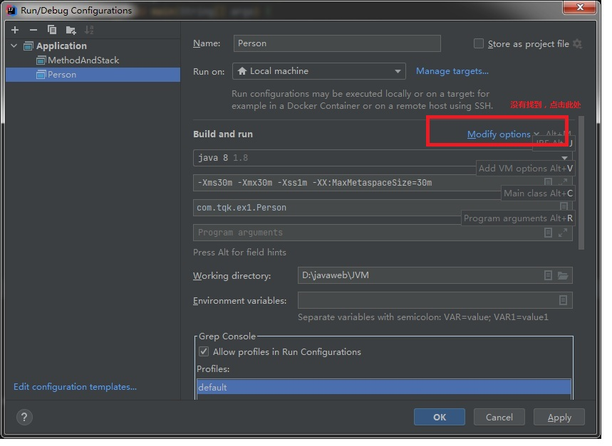</a> 

:::tip
1. JVM 向操作系统申请内存： JVM 第一步就是通过配置参数或者默认配置参数向操作系统申请内存空间，根据内存大小找到具体的内存分配表，然后把内存段的起始地址和终止地 址分配给 JVM，接下来 JVM 就进行内部分配。 
2. JVM 获得内存空间后，会根据配置参数分配堆、栈以及方法区的内存大小
-Xms30m -Xmx30m -Xss1m -XX:MaxMetaspaceSize=30m 
3. 类加载（类加载的细节后续章节会讲）： 这里主要是把 class 放入方法区、还有 class 中的静态变量和常量也要放入方法区 
4. 执行方法及创建对象： 启动 main 线程，执行 main 方法，开始执行第一行代码。此时堆内存中会创建一个 Teacher 对象，对象引用 T1 就存放在栈中。 后续代码中遇到 new 关键字，会再创建一个 Teacher 对象，对象引用 T2 就存放在栈中。
:::

:::tip JVM运行内存的整体流程
JVM 在操作系统上启动，申请内存，先进行运行时数据区的初始化，然后把类加载到方法区，最后执行方法。 
方法的执行和退出过程在内存上的体现上就是虚拟机栈中栈帧的入栈和出栈。 
同时在方法的执行过程中创建的对象一般情况下都是放在堆中，最后堆中的对象也是需要进行垃圾回收清理的。
:::

## 2.2 从底层深入理解运行时数据区

### 2.2.1 堆空间分代划分 

**堆被划分为新生代和老年代（Tenured），新生代又被进一步划分为 Eden 和 Survivor 区，最后 Survivor 由 From Survivor 和 To Survivor 组成**

<a data-fancybox title="堆空间分代划分" href="./image/youngold.jpg"></a>

### 2.2.2 GC 概念 

GC- Garbage Collection 垃圾回收，在 JVM 中是自动化的垃圾回收机制，我们一般不用去关注，在 JVM 中 GC 的重要区域是堆空间。   
我们也可以通过一些额外方式主动发起它，比如 System.gc(),主动发起。（项目中切记不要使用）

### 2.2.3 JHSDB 工具 

JHSDB 是一款基于服务性代理实现的进程外调试工具。服务性代理是 HotSpot 虚拟机中一组用于映射 Java 虚拟机运行信息的，主要基于 Java 语言实现的 API 集合。

### 2.2.4 JDK1.8 的开启方式 

开启 HSDB 工具 Jdk1.8 启动 JHSDB 的时候必须将 sawindbg.dll（一般会在 JDK 的目录下）复制到对应目录的 jre 下(注意在 win 上安装了 JDK1.8 后往往同级目录下有一个 jre 的目录)

<a data-fancybox title="JDK1.8 的开启方式" href="./image/jvm24.jpg"></a>

然后到目录：C:\Program Files\Java\jdk1.8.0_144\lib cmd进入命令行，执行 java -cp .\sa-jdi.jar sun.jvm.hotspot.HSDB

<a data-fancybox title="JDK1.8 的开启方式" href="./image/jvm25.jpg">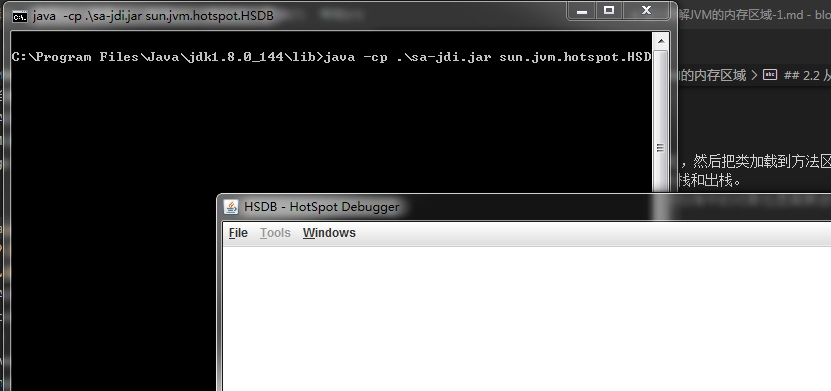</a>

### 2.2.5 JHSDB 中查看对象


**VM 参数加入：**
<font color='red'><strong>-XX:+UseConcMarkSweepGC</strong></font>
<a data-fancybox title="JHSDB 中查看对象" href="./image/JHSDB1.jpg"></a>

<font color='red'><strong>-XX:-UseCompressedOops</strong></font>
<a data-fancybox title="JHSDB 中查看对象" href="./image/JHSDB2.jpg"></a>

```java
/**
 * -Xms30m -Xmx30m -Xss1m -XX:MaxMetaspaceSize=30m  -XX:+UseConcMarkSweepGC -XX:-UseCompressedOops
 */
public class JVMObject {
    public final static String MAN_TYPE = "man";
    public static String WOMAN_TYPE = "woman";

    public static void main(String[] args) throws InterruptedException {
        Teacher T1 = new Teacher("Mark",MAN_TYPE,36);
        for (int i=0;i<15;i++){
            System.gc();
        }
        Teacher T2 = new Teacher("King",MAN_TYPE,18);
        Thread.sleep(Integer.MAX_VALUE);//线程休眠
    }
}
class Teacher{
    String name;
    String sexType;
    int age;

    public Teacher(String name, String sexType, int age) {
        this.name = name;
        this.sexType = sexType;
        this.age = age;
    }

    public String getName() {
        return name;
    }
    public void setName(String name) {
        this.name = name;
    }

    public String getSexType() {
        return sexType;
    }
    public void setSexType(String sexType) {
        this.sexType = sexType;
    }
    public int getAge() {
        return age;
    }
    public void setAge(int age) {
        this.age = age;
    }
}
```
:::tip 当我们通过 Java 运行以上代码时，JVM 的整个处理过程如下：
1. JVM 向操作系统申请内存，JVM 第一步就是通过配置参数或者默认配置参数向操作系统申请内存空间。
2. JVM 获得内存空间后，会根据配置参数分配堆、栈以及方法区的内存大小。
3. 完成上一个步骤后， JVM 首先会执行构造器，编译器会在.java 文件被编译成.class 文件时，收集所有类的初始化代码，包括静态变量赋值语句、静态代码块、静态方法，静态变量和常量放入方法区
4. 执行方法。启动 main 线程，执行 main 方法，开始执行第一行代码。此时堆内存中会创建一个 Teacher 对象，对象引用 student 就存放在栈中。执行其他方法时，具体的操作：栈帧执行对内存区域的影响。栈帧执行对内存区域的影响
<a data-fancybox title="JVM 的整个处理过程" href="./image/JHSDB11.jpg">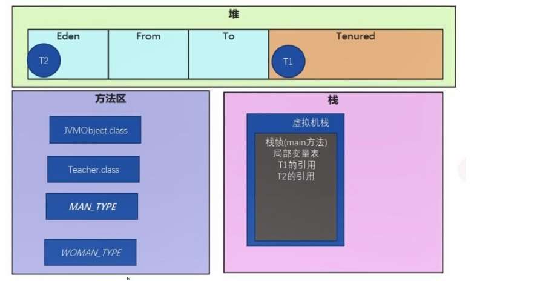</a>

:::

因为 JVM 启动有一个进程，需要借助一个命令 jps 查找到对应程序的进程


:::warning JHSDB中查看对象
1. 实例代码启动 因为JVM启动有一个进程，需要借助一个命令jps查找到对应程序的进程
<a data-fancybox title="JHSDB 中查看对象" href="./image/JHSDB3.jpg"></a>

2. 在JHSDB工具中attach上去
<a data-fancybox title="JHSDB 中查看对象" href="./image/JHSDB4.jpg">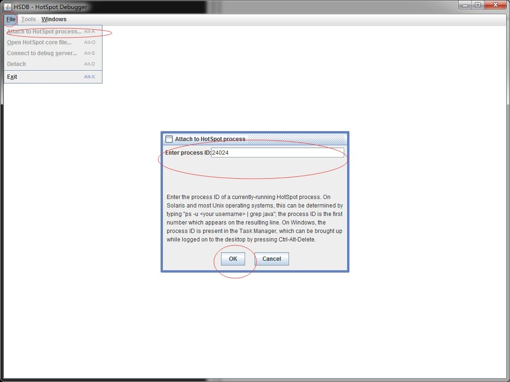</a>
<a data-fancybox title="JHSDB 中查看对象" href="./image/JHSDB5.jpg">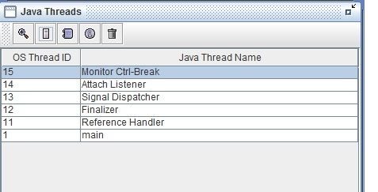</a>

3. 查看堆参数
<a data-fancybox title="JHSDB 中查看对象" href="./image/JHSDB9.jpg">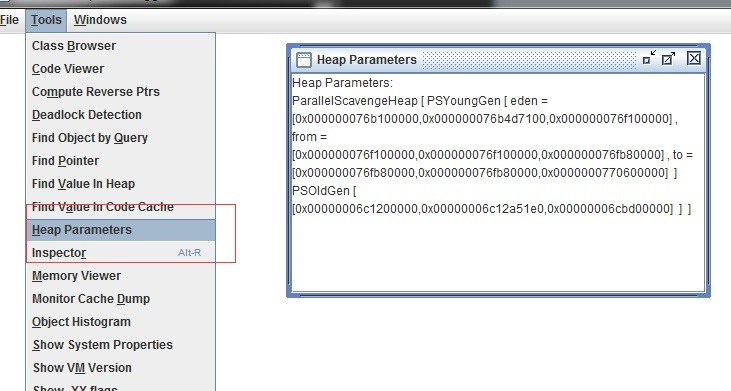</a>
上图中可以看到实际JVM启动过程中堆中参数的对照，可以看到，在不启动内存压缩的情况下。堆空间里面的分代划分都是连续的

```java
Heap Parameters:
ParallelScavengeHeap [ 
    PSYoungGen [ 
        eden =  [0x000000076b100000,0x000000076b4d7100,0x000000076f100000] , 
        from =  [0x000000076f100000,0x000000076f100000,0x000000076fb80000] , 
        to =  [0x000000076fb80000,0x000000076fb80000,0x0000000770600000]  
    ] 
    PSOldGen [  
        [0x00000006c1200000,0x00000006c12a51e0,0x00000006cbd00000]  
    ]  
]
```
4. 这里可以看到JVM中所有的对象，都是基于class的对象
 a. 双击出现这个Teacher类的对象，两个，就是T1和T2对象
<a data-fancybox title="JHSDB 中查看对象" href="./image/JHSDB8.jpg"></a>
<a data-fancybox title="JHSDB 中查看对象" href="./image/JHSDB7.jpg">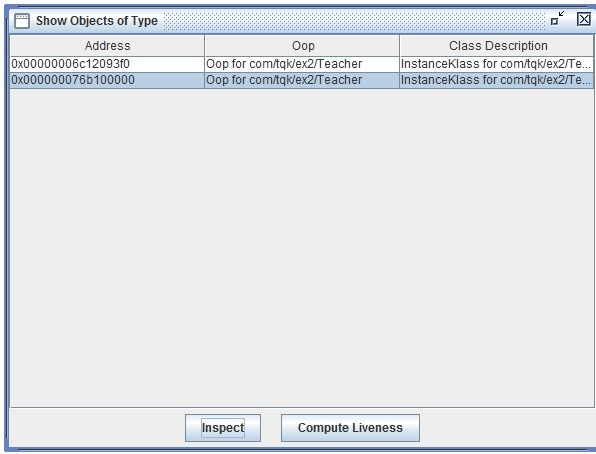</a>
<a data-fancybox title="JHSDB 中查看对象" href="./image/JHSDB6.jpg">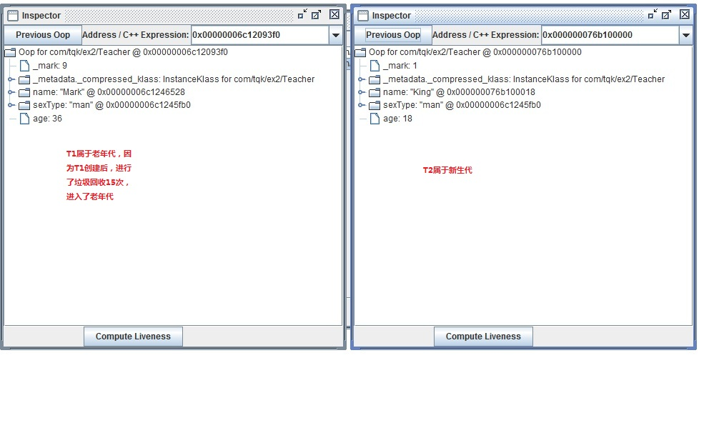</a>

 b. 最后再对比一下堆中分代划分可以得出为什么T1在Eden,T2在老年代
<a data-fancybox title="JHSDB 中查看对象" href="./image/JHSDB10.jpg"></a>

:::


### 2.2.6 JHSDB 中查看栈

<a data-fancybox title="JHSDB 中查看栈" href="./image/JHSDBstack3.jpg"></a>
---------------
<a data-fancybox title="JHSDB 中查看栈" href="./image/JHSDBstack2.jpg"></a>


:::warning <font color='red'>总结：深入辨析堆和栈 </font>
1. 功能   
◆ 以栈帧的方式存储方法调用的过程，并存储方法调用过程中基本数据类型的变量（int、short、long、byte、float、double、boolean、char 等）以 及对象的引用变量，其内存分配在栈上，变量出了作用域就会自动释放     
◆ 而堆内存用来存储 Java 中的对象。无论是成员变量，局部变量，还是类变量，它们指向的对象都存储在堆内存中     
2. 线程独享还是共享   
◆ 栈内存归属于单个线程，每个线程都会有一个栈内存，其存储的变量只能在其所属线程中可见，即栈内存可以理解成线程的私有内存    
◆ 堆内存中的对象对所有线程可见。堆内存中的对象可以被所有线程访问     
◆ 空间大小 栈的内存要远远小于堆内存 虚拟机内存优化技术  
:::


## 2.3 栈的优化技术——栈帧之间数据的共享 

在一般的模型中，两个不同的栈帧的内存区域是独立的，但是大部分的 JVM 在实现中会进行一些优化，使得两个栈帧出现一部分重叠。（主要体现在方法 中有参数传递的情况），让下面栈帧的操作数栈和上面栈帧的部分局部变量重叠在一起，这样做不但节约了一部分空间，更加重要的是在进行方法调用时
就可以直接公用一部分数据，无需进行额外的参数复制传递了。

```java
/**
 * VM参数
 * JVM对栈帧空间的优化
 *
 **/
public class JVMStack {

    public int work(int x) throws Exception{
        int z =(x+5)*10;//局部变量表有， 32位
        Thread.sleep(Integer.MAX_VALUE);
        return  z;
    }
    public static void main(String[] args)throws Exception {
        JVMStack jvmStack = new JVMStack();
        jvmStack.work(10);//10  放入main栈帧  10 ->操作数栈
    }
}
```
<a data-fancybox title="JVM对栈帧空间的优化" href="./image/JHSDBstack2.jpg"></a>


## 2.4 内存溢出

### 2.4.1 栈溢出

**参数：-Xss1m**  
<a data-fancybox title="具体默认值需要查看官网" href="https://docs.oracle.com/javase/8/docs/technotes/tools/unix/java.html#BABHDABI">具体默认值需要查看官网：https://docs.oracle.com/javase/8/docs/technotes/tools/unix/java.html#BABHDABI</a>

<a data-fancybox title="stack" href="./image/stack1.jpg">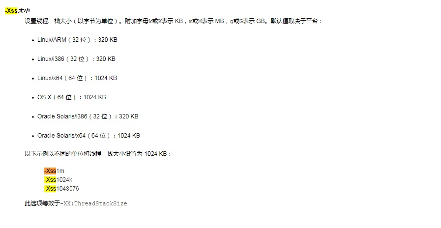</a>

```java
/**
 * 栈溢出  -Xss=1m
 */
public class StackOom {
    static void stack(){
        stack();//方法不断执行-栈帧不断入栈(不出栈)
    }

    public static void main(String[] args) {
        stack();
    }
}

//报错信息
Exception in thread "main" java.lang.StackOverflowError
	at com.tqk.ex2.oom.StackOom.stack(StackOom.java:5)
```
HotSpot 版本中栈的大小是固定的，是不支持拓展的。 java.lang.StackOverflowError 一般的方法调用是很难出现的，如果出现了可能会是无限递归。 虚拟机栈带给我们的启示：方法的执行因为要打包成栈桢，所以天生要比实现同样功能的循环慢，所以树的遍历算法中：递归和非递归(循环来实现)都有存在的意义。递归代码简洁，非递归代码复杂但是速度较快。 OutOfMemoryError：不断建立线程，JVM 申请栈内存，机器没有足够的内存。（一般演示不出，演示出来机器也死了）
**同时要注意，栈区的空间 JVM 没有办法去限制的，因为 JVM 在运行过程中会有线程不断的运行，没办法限制，所以只限制单个虚拟机栈的大小。**

### 2.4.2 堆溢出

内存溢出：**申请内存空间,超出最大堆内存空间** 
如果是内存溢出，则通过 调大 -Xms，-Xmx 参数。 
如果不是内存泄漏，就是说内存中的对象却是都是必须存活的，那么久应该检查 JVM 的堆参数设置，与机器的内存对比，看是否还有可以调整的空间， 
再从**代码上检查是否存在某些对象生命周期过长、持有状态时间过长、存储结构设计不合理等情况，尽量减少程序运行时的内存消耗**


```java
/**
 * VM Args：-Xms30m -Xmx30m -XX:+PrintGCDetails
 * 堆内存溢出（直接溢出）
 */
public class HeapOom {
    //实际开发中不要使用大的数组和对象、字符串
    public static void main(String[] args) {
        String[] strings = new String[35*1000*1000];  //35m的数组（堆）
    }
}
```
```java
// 报错信息
[GC (Allocation Failure) [PSYoungGen: 2165K->808K(9216K)] 2165K->816K(29696K), 0.0117856 secs] [Times: user=0.00 sys=0.00, real=0.01 secs] 
[GC (Allocation Failure) [PSYoungGen: 808K->832K(9216K)] 816K->840K(29696K), 0.0009092 secs] [Times: user=0.00 sys=0.00, real=0.00 secs] 
[Full GC (Allocation Failure) [PSYoungGen: 832K->0K(9216K)] [ParOldGen: 8K->629K(20480K)] 840K->629K(29696K), [Metaspace: 3355K->3355K(1056768K)], 0.0039609 secs] [Times: user=0.00 sys=0.00, real=0.00 secs] 
[GC (Allocation Failure) [PSYoungGen: 0K->0K(9216K)] 629K->629K(29696K), 0.0002468 secs] [Times: user=0.00 sys=0.00, real=0.00 secs] 
[Full GC (Allocation Failure) [PSYoungGen: 0K->0K(9216K)] [ParOldGen: 629K->612K(20480K)] 629K->612K(29696K), [Metaspace: 3355K->3355K(1056768K)], 0.0049461 secs] [Times: user=0.08 sys=0.00, real=0.01 secs] 
Heap
 PSYoungGen      total 9216K, used 410K [0x00000000ff600000, 0x0000000100000000, 0x0000000100000000)
  eden space 8192K, 5% used [0x00000000ff600000,0x00000000ff666800,0x00000000ffe00000)
  from space 1024K, 0% used [0x00000000ffe00000,0x00000000ffe00000,0x00000000fff00000)
  to   space 1024K, 0% used [0x00000000fff00000,0x00000000fff00000,0x0000000100000000)
 ParOldGen       total 20480K, used 612K [0x00000000fe200000, 0x00000000ff600000, 0x00000000ff600000)
  object space 20480K, 2% used [0x00000000fe200000,0x00000000fe299070,0x00000000ff600000)
 Metaspace       used 3448K, capacity 4496K, committed 4864K, reserved 1056768K
  class space    used 377K, capacity 388K, committed 512K, reserved 1048576K
Exception in thread "main" java.lang.OutOfMemoryError: Java heap space
	at com.tqk.ex2.oom.HeapOom.main(HeapOom.java:10)
```


```java
/**
 * VM Args：-Xms30m -Xmx30m     堆的大小30M
 * 造成一个堆内存溢出(分析下JVM的分代收集)
 * GC调优---生产服务器推荐开启(默认是关闭的) -XX:+HeapDumpOnOutOfMemoryError
 * -Xms30m -Xmx30m -XX:+PrintGCDetails -XX:+HeapDumpOnOutOfMemoryError
 */
public class HeapOom2 {
   public static void main(String[] args) throws Exception {
       List<Object> list = new LinkedList<>(); // list   当前虚拟机栈（局部变量表）中引用的对象
       int i =0;
       while(true){
           i++;
           if(i%1000==0) {
               Thread.sleep(10);
           }
           list.add(new Object());// 不能回收2,  优先回收再来抛出异常。
       }

   }
}
```

```java
[Full GC (Ergonomics) [PSYoungGen: 8191K->8191K(9216K)] [ParOldGen: 20079K->20079K(20480K)] 28271K->28271K(29696K), [Metaspace: 3977K->3977K(1056768K)], 0.0688138 secs] [Times: user=0.34 sys=0.01, real=0.07 secs] 
[Full GC (Ergonomics) [PSYoungGen: 8191K->8191K(9216K)] [ParOldGen: 20080K->20080K(20480K)] 28272K->28272K(29696K), [Metaspace: 3977K->3977K(1056768K)], 0.0813372 secs] [Times: user=0.44 sys=0.02, real=0.08 secs] 
[Full GC (Ergonomics) [PSYoungGen: 8191K->8191K(9216K)] [ParOldGen: 20081K->20081K(20480K)] 28273K->28273K(29696K), [Metaspace: 3977K->3977K(1056768K)], 0.0800405 secs] [Times: user=0.42 sys=0.00, real=0.08 secs] 
[Full GC (Ergonomics) [PSYoungGen: 8191K->8191K(9216K)] [ParOldGen: 20083K->20083K(20480K)] 28275K->28275K(29696K), [Metaspace: 3977K->3977K(1056768K)], 0.0955742 secs] [Times: user=0.33 sys=0.00, real=0.10 secs] 
[Full GC (Ergonomics) [PSYoungGen: 8191K->8191K(9216K)] [ParOldGen: 20084K->20084K(20480K)] 28276K->28276K(29696K), [Metaspace: 3977K->3977K(1056768K)], 0.0770952 secs] [Times: user=0.26 sys=0.00, real=0.08 secs] 
[Full GC (Ergonomics) [PSYoungGen: 8191K->8191K(9216K)] [ParOldGen: 20085K->20085K(20480K)] 28277K->28277K(29696K), [Metaspace: 3977K->3977K(1056768K)], 0.0714624 secs] [Times: user=0.33 sys=0.00, real=0.07 secs] 
[Full GC (Ergonomics) [PSYoungGen: 8191K->8191K(9216K)] [ParOldGen: 20086K->20086K(20480K)] 28278K->28278K(29696K), [Metaspace: 3977K->3977K(1056768K)], 0.0764225 secs] [Times: user=0.44 sys=0.00, real=0.08 secs] 
[Full GC (Ergonomics) [PSYoungGen: 8191K->8191K(9216K)] [ParOldGen: 20088K->20088K(20480K)] 28280K->28280K(29696K), [Metaspace: 3977K->3977K(1056768K)], 0.0614188 secs] [Times: user=0.39 sys=0.00, real=0.06 secs] 
java.lang.OutOfMemoryError: GC overhead limit exceeded
Dumping heap to java_pid20968.hprof ...
Heap dump file created [53761779 bytes in 0.225 secs]
[Full GC (Ergonomics) [PSYoungGen: 8191K->0K(9216K)] [ParOldGen: 20104K->938K(20480K)] 28296K->938K(29696K), [Metaspace: 4001K->4001K(1056768K)], 0.0056141 secs] [Times: user=0.00 sys=0.00, real=0.01 secs] 
Heap
 PSYoungGen      total 9216K, used 225K [0x00000000ff600000, 0x0000000100000000, 0x0000000100000000)
  eden space 8192K, 2% used [0x00000000ff600000,0x00000000ff6384f8,0x00000000ffe00000)
  from space 1024K, 0% used [0x00000000fff00000,0x00000000fff00000,0x0000000100000000)
  to   space 1024K, 0% used [0x00000000ffe00000,0x00000000ffe00000,0x00000000fff00000)
 ParOldGen       total 20480K, used 938K [0x00000000fe200000, 0x00000000ff600000, 0x00000000ff600000)
  object space 20480K, 4% used [0x00000000fe200000,0x00000000fe2eaae0,0x00000000ff600000)
 Metaspace       used 4008K, capacity 4568K, committed 4864K, reserved 1056768K
  class space    used 444K, capacity 460K, committed 512K, reserved 1048576K
Exception in thread "main" java.lang.OutOfMemoryError: GC overhead limit exceeded
	at com.tqk.ex2.oom.HeapOom2.main(HeapOom2.java:21)

    //gc回收耗费资源占98% 但是回收效率很低，2%。这时候就会 OutOfMemoryError GC overhead limit exceeded
```
### 2.4.3 方法区溢出

（1） 运行时常量池溢出 
（2）方法区中保存的 Class 对象没有被及时回收掉或者 Class 信息占用的内存超过了我们配置。 
注意 Class 要被回收，条件比较苛刻（仅仅是可以，不代表必然，因为还有一些参数可以进行控制）： 

1.  该类所有的实例都已经被回收，也就是堆中不存在该类的任何实例。 
2.  加载该类的 ClassLoader 已经被回收。 
3.  该类对应的 java.lang.Class 对象没有在任何地方被引用，无法在任何地方通过反射访问该类的方法。

```java
/**
 * 方法区导致的内存溢出
 * VM Args: -XX:MetaspaceSize=10M -XX:MaxMetaspaceSize=10M
 * */
public class MethodAreaOutOfMemory {

    public static void main(String[] args) {
        while (true) {
            Enhancer enhancer = new Enhancer();
            enhancer.setSuperclass(TestObject.class);
            enhancer.setUseCache(false);
            enhancer.setCallback(new MethodInterceptor() {
                @Override
                public Object intercept(Object arg0, Method arg1, Object[] arg2, MethodProxy arg3) throws Throwable {
                    return arg3.invokeSuper(arg0, arg2);
                }
            });
            enhancer.create();
        }
    }

    public static class TestObject {
        private double a = 34.53;
        private Integer b = 9999999;
    }
}
```

### 2.4.3 直接内存溢出

直接内存的容量可以通过 MaxDirectMemorySize 来设置（默认与堆内存最大值一样），所以也会出现 OOM 异常； 由直接内存导致的内存溢出，一个比较明显的特征是在 HeapDump 文件中不会看见有什么明显的异常情况，如果发生了 OOM，同时 Dump 文件很小，可 以考虑重点排查下直接内存方面的原因。

```java
/**
 * VM Args：-XX:MaxDirectMemorySize=100m
 * 限制最大直接内存大小100m
 */
public class DirectOom {
    public static void main(String[] args) {
        //直接分配128M的直接内存
        ByteBuffer bb = ByteBuffer.allocateDirect(128*1024*1204);
    }
}

Exception in thread "main" java.lang.OutOfMemoryError: Direct buffer memory
```

## 2.5 常量池

### 2.5.1 Class 常量池(静态常量池)

在 class 文件中除了有类的版本、字段、方法和接口等描述信息外，还有一项信息是**常量池 (Constant Pool Table)，用于存放编译期间生成的各种字面量和符号引用**

<font color='red'><strong>字面量</strong></font>：给基本类型变量赋值的方式就叫做字面量或者字面值。 比如：String a=“b” ，这里“b”就是字符串字面量，同样类推还有整数字面值、浮点类型字面量、字符字面量。 
<font color='red'><strong>符号引用</strong></font>：符号引用以一组符号来描述所引用的目标。符号引用可以是任何形式的字面量，JAVA 在编译的时候一个每个 java 类都会被编译成一个 class 文件，但在编译的时候虚拟机并不知道所引用类的地址(实际地址)，就用符号引用来代替，而在类的解析阶段（后续 JVM 类加载会具体讲到）就是为了把 这个符号引用转化成为真正的地址的阶段。

一个 java 类（假设为 People 类）被编译成一个 class 文件时，如果 People 类引用了 Tool 类，但是在编译时 People 类并不知道引用类的实际内存地址，因 此只能使用符号引用（org.simple.Tool）来代替。而在类装载器装载 People 类时，此时可以通过虚拟机获取 Tool 类的实际内存地址，因此便可以既将符号 org.simple.Tool 替换为 Tool 类的实际内存地址。

### 2.5.2 运行时常量池

**运行时常量池（Runtime Constant Pool）**是每一个类或接口的常量池（Constant_Pool）的运行时表示形式，它包括了若干种不同的常量： 从编译期可知的数值字面量到必须运行期解析后才能获得的方法或字段引用。（这个是虚拟机规范中的描述，很生涩） 运行时常量池是在类加载完成之后，将 Class 常量池中的符号引用值转存到运行时常量池中，类在解析之后，将符号引用替换成直接引用。 

运行时常量池在 JDK1.7 版本之后，就移到堆内存中了，这里指的是物理空间，而逻辑上还是属于方法区（方法区是逻辑分区）。 

在 JDK1.8 中，使用元空间代替永久代来实现方法区，但是方法区并没有改变，所谓"Your father will always be your father"。变动的只是方法 区中内容的物理存放位置，但是运行时常量池和字符串常量池被移动到了堆中。但是不论它们物理上如何存放，逻辑上还是属于方法区的。

### 2.5.3 字符串常量池

## 2.4 String

**String 对象是对 char 数组进行了封装实现的对象，主要有 2 个成员变量：char 数组，hash 值。**
```java
public final class String
    implements java.io.Serializable, Comparable<String>, CharSequence {
    /** The value is used for character storage. */
    private final char value[];

    /** Cache the hash code for the string */
    private int hash; // Default to 0

    /** use serialVersionUID from JDK 1.0.2 for interoperability */
    private static final long serialVersionUID = -6849794470754667710L;
```

###  2.4.1 String 对象的不可变性 

了解了 String 对象的实现后，你有没有发现在实现代码中 String 类被 final 关键字修饰了，而且变量 char 数组也被 final 修饰了。 我们知道类被 final 修饰代表该类不可继承，而 char[]被 final+private 修饰，代表了 String 对象不可被更改。Java 实现的这个特性叫作 String 对象的不 可变性，即 String 对象一旦创建成功，就不能再对它进行改变。 

:::tip Java 这样做的好处在哪里呢？
第一、 保证 String 对象的安全性。假设 String 对象是可变的，那么 String 对象将可能被恶意修改     
第二、 保证 hash 属性值不会频繁变更，确保了唯一性，使得类似 HashMap 容器才能实现相应的 key-value 缓存功能     
第三、 可以实现字符串常量池。在 Java 中，通常有两种创建字符串对象的方式，
一种是通过字符串常量的方式创建，如 String str=“abc”；  
另一种是字 符串变量通过 new 形式的创建，如 String str = new String(“abc”)      
:::


### 2.4.2 String 的创建方式及内存分配的方式

####  2.4.2.1  String str=“abc”

当代码中使用这种方式创建字符串对象时，JVM 首先会检查该对象是否在字符串常量池中，如果在，就返回该对象引用，否则新的字符串将在常量池中 被创建。这种方式可以减少同一个值的字符串对象的重复创建，节约内存。（str 只是一个引用）
<a data-fancybox title="String" href="./image/str1.jpg">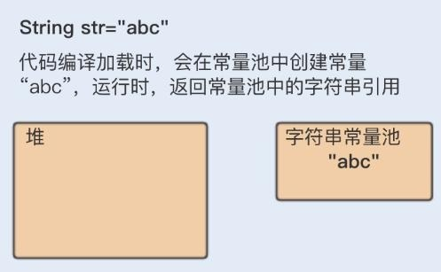</a>

####  2.4.2.2  String str = new String(“abc”)

首先在编译类文件时，"abc"常量字符串将会放入到常量结构中，在类加载时，“abc"将会在常量池中创建；其次，在调用 new 时，JVM 命令将会调用 String 的构造函数，同时引用常量池中的"abc” 字符串，在堆内存中创建一个 String 对象；最后，str 将引用 String 对象。

<a data-fancybox title="String" href="./image/str2.jpg">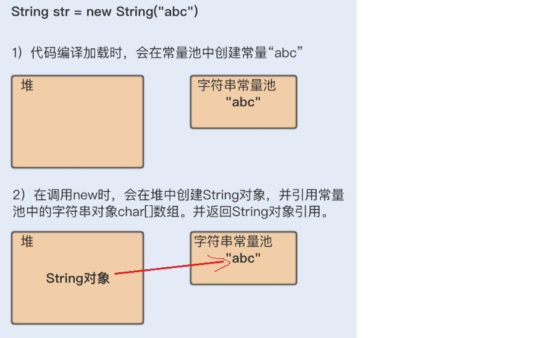</a>

#### 2.4.2.3 String str2= "ab"+ "cd"+ "ef"

编程过程中，字符串的拼接很常见。前面我讲过 String 对象是不可变的，如果我们使用 String 对象相加，拼接我们想要的字符串，是不是就会产生多个对象呢？
例如以下代码： 分析代码可知：首先会生成 ab 对象，再生成 abcd 对象，最后生成 abcdef 对象，从理论上来说，这段代码是低效的。   
编译器自动优化了这行代码，编译后的代码，你会发现编译器自动优化了这行代码，如下 String str= "abcdef";  

#### 2.4.2.4 大循环使用+

```java
    public void mode5(){
//        String str = "abcdef";
//        for(int i=0; i<1000; i++) {
//            str = str + i;
//        }
        //优化
        String str = "abcdef";
        for(int i=0; i<1000; i++) {
            str = (new StringBuilder(String.valueOf(str)).append(i).toString());
        }
    }
```
#### 2.4.2.5 intern

String 的 intern 方法，如果常量池中有相同值，就会重复使用该对象，返回对象引用。

```java
    public static void mode6(){
        //去字符串常量池找到是否有等于该字符串的对象，如果有，直接返回对象的引用。
        String a =new String("king").intern();// new 对象、king 字符常量池创建
        String b = new String("king").intern();// b ==a。
        if(a==b) {
            System.out.print("a==b");
        }else{
            System.out.print("a!=b");
        }
    }

    public static void main(String[] args) {
        mode6();
    }

    // 返回 a==b

```
:::tip 创建过程
1. new Sting() 会在堆内存中创建一个 a 的 String 对象，"king" 将会在常量池中创建 
2. 在调用 intern 方法之后，会去常量池中查找是否有等于该字符串对象的引用，有就返回引用。 
3. 调用 new Sting() 会在堆内存中创建一个 b 的 String 对象。 
4. 在调用 intern 方法之后，会去常量池中查找是否有等于该字符串对象的引用，有就返回引用。 所以 a 和 b 引用的是同一个对象。
:::


#### 2.4.2.6 创建对象
使用 new，对象会创建在堆中，同时赋值的话，会在常量池中创建一个字符串对象，复制到堆中。 
具体的复制过程是先将常量池中的字符串压入栈中，在使用 String 的构造方法是，会拿到栈中的字符串作为构方法的参数。 
这个构造函数是一个 char 数组的赋值过程，而不是 new 出来的，所以是引用了常量池中的字符串对象。存在引用关系。
<a data-fancybox title="String" href="./image/str3.jpg">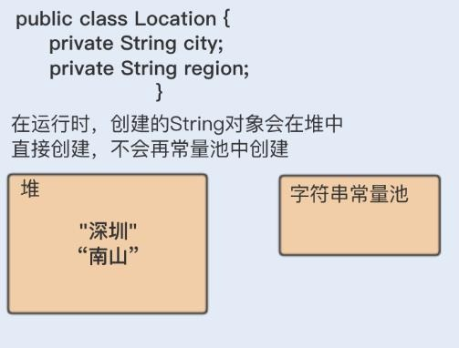</a>

```java
public class Location { 
    private String city;
    private String region; 
}
    public void mode3(){
        Location location = new Location();
        location.setCity("深圳");
        location.setRegion("南山");
    }
```