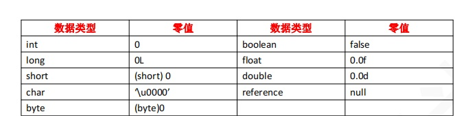
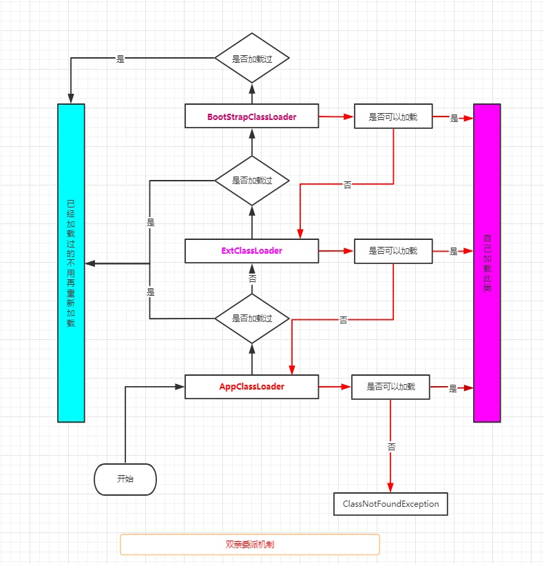
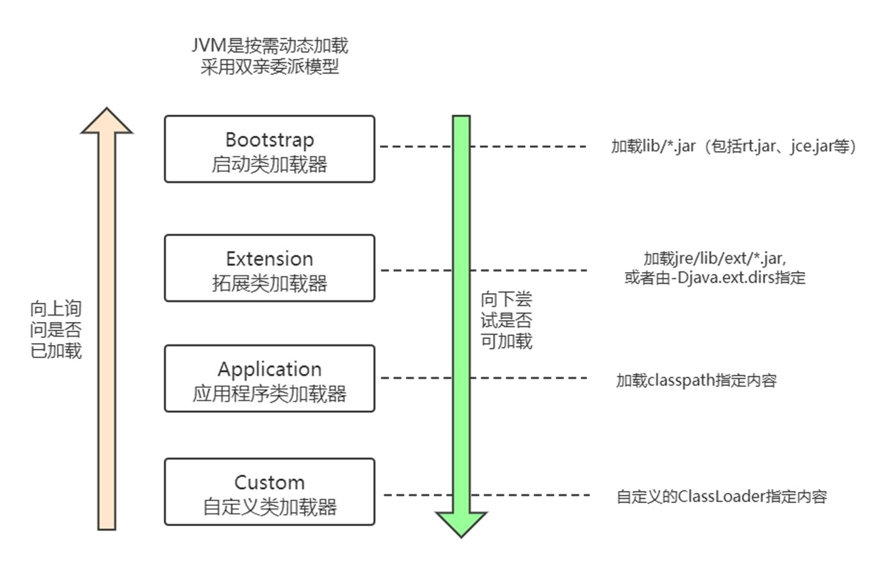
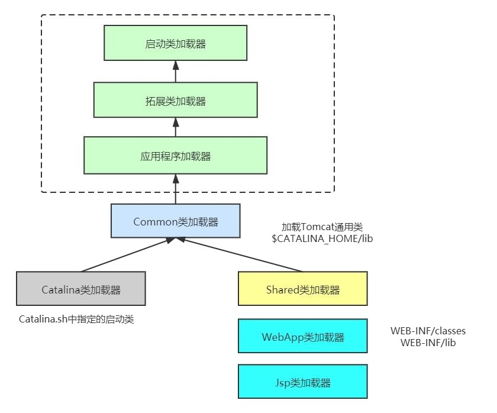
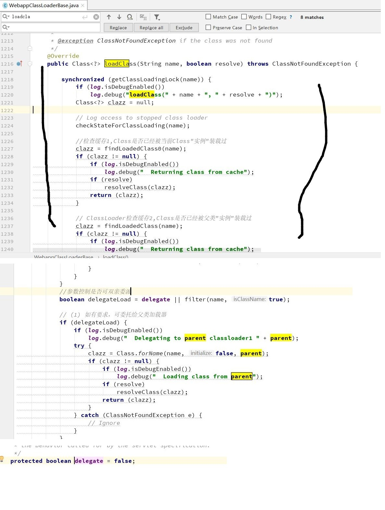
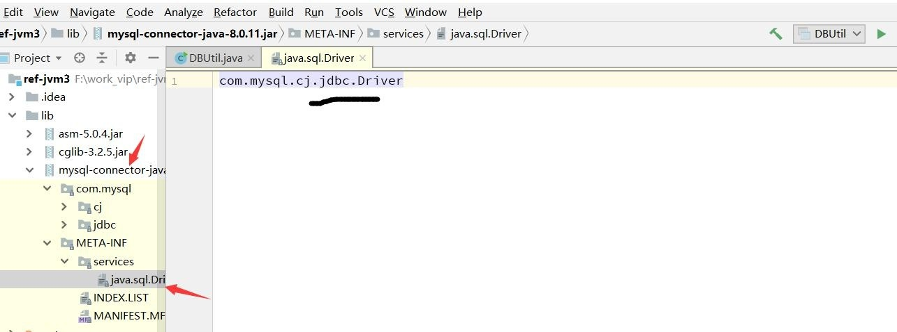
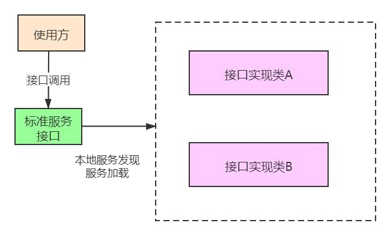
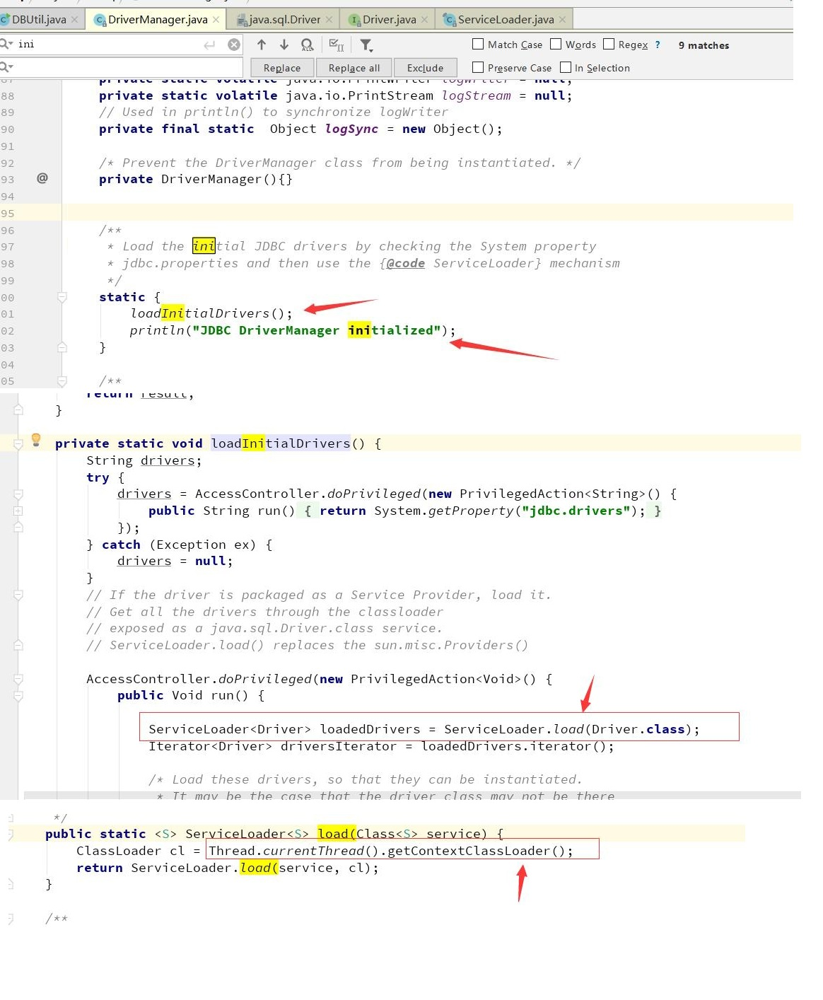
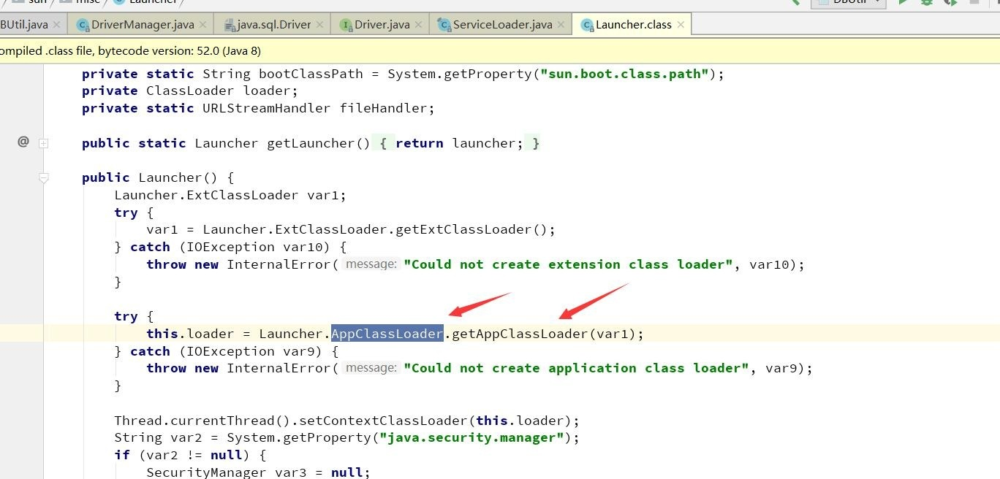

# 7. 类加载与类加载器

##  7.1 一个类的生命周期（重点） 

###  7.1.1 类生命周期7个阶段 
类从被加载到虚拟机内存中开始，到卸载出内存为止，它的整个生命周期包括：
加载（Loading）、  
验证（Verification）、  
准备（Preparation）、  
解析（Resolution）、   
初始化（Initialization）、  
使用（Using）和  
卸载（Unloading）7 个阶段。  
<font color='red'><strong>其中验证、准备、解析 3 个部分统称为连接（Linking）</strong></font>
<a data-fancybox title="类生命周期7个阶段 " href="./image/leishengmingzhouqi.jpg"></a>

###  7.1.2 阶段顺序 
加载、校验、准备、初始化和卸载这五个阶段的顺序是确定的，但是对于“解析”阶段则不一定，它在某些情况下可以在初始化之后再开始，这样做是 为了支持 java 的运行时绑定特征（也称为动态绑定或晚期绑定）


###  7.1.3 加载的时机 

什么是需要开始类第一个阶段“加载”，虚拟机规范没有强制约束，这点交给虚拟机的具体实现来自由把控。 

<font color='red'>JVM 虚拟机的实现都是使用的**懒加载**，就是什么时候需要这个类了我才去加载，并不是说一个jar文件里面有200多个类，但实际我只用到了其中的一个类，我不需要把200多个类全部加载进来。（如果你自己写一个JVM倒是可以这么干！） “加载 loading”阶段是整个类加载（class loading）过程的一个阶段。</font> 

:::tip 加载阶段虚拟机需要完成以下3件事情： 
1. 通过一个类的全限定名来获取定义此类的二进制字节流。
2. 将这个字节流所代表的静态存储结构转化为方法区的运行时数据结构。
3. 在内存中生成一个代表这个类的 java.lang.Class 对象，作为方法区这个类的各种数据的访问入口
:::

注意：比如“通过一个类的全限定名来获取定义此类的二进制字节流”没有指定一定得从某个class文件中获取，所以我们可以从zip压缩包、从网络中 获取、运行时计算生成、数据库中读取、或者从加密文件中获取等等。   

我们也可以通过前面的工具 JHSDB 可以看到，JVM 启动后，相关的类已经加载进入了方法区，成为了方法区的运行时结构。  

JHSDB 怎么用？  
:::tip 具体见JHSDB工具   
1. Attarch 上 JVM 启动的进程 
2. 打开 Class Browser
<a data-fancybox title="classloader" href="./image/jvmloader.jpg"></a>

3. 可以看到很多class已经被加载进来了 
4. 找到 JVMObject，注意！这里已经是内存了，所以说相关的类已经加载进入了方法区，成为了方法区的运行时结构
:::

###  7.1.4 验证

验证是连接阶段的第一步，这一阶段的目的是为了确保 Class 文件的字节流中包含的信息符合当前虚拟机的要求，并且不会危害虚拟机自身的安全。 
但从整体上看，验证阶段大致上会完成下面4个阶段的检验动作：**文件格式验证、元数据验证、字节码验证、符号引用验证**。


####  7.1.4.1 文件格式验证（非重点） 

**第一阶段要验证字节流是否符合Class文件格式的规范，并且能被当前版本的虚拟机处理**

:::tip 这一阶段可能包括下面这些验证点: 
▶ 是否以魔数 OxCAFEBABE 开头   
▶ 主、次版本号是否在当前 Java 虚拟机接受范围之内   
▶ 常量池的常量中是否有不被支持的常量类型(检查常量tag标志)   
▶ 指向常量的各种索引值中是否有指向不存在的常量或不符合类型的常量   
▶ CONSTANT Utf8 info 型的常量中是否有不符合 UTF-8 编码的数据   
▶ Class 文件中各个部分及文件本身是否有被删除的或附加的其他信息   
▶ ...... 以上的部分还只是一小部分，没必要进行深入的研究   
:::

总结一下： 这阶段的验证是基于二进制字节流进行的，只有通过了这个阶段的验证之后，这段字节流才被允许进人 Java 虚拟机内存的方法区中进行存储，所以后面 的三个验证阶段全部是基于方法区的存储结构（内存）上进行的，不会再直接读取、操作字节流了。 


####  7.1.4.2 元数据验证（非重点）

**第二阶段是对字节码描述的信息进行语义分析，以保证其描述的信息符合《Java 语言规范》的要求**

:::tip 这个阶段可能包括的验证点如下: 
▶ 这个类是否有父类(除了java.lang.Object之外，所有的类都应当有父类)  
▶ 这个类的父类是否继承了不允许被继承的类(被final修饰的类)   
▶ 如果这个类不是抽象类，是否实现了其父类或接口之中要求实现的所有方法   
▶ 类中的字段、方法是否与父类产生矛盾(例如覆盖了父类的 final 字段，或者出现不符合规则的方法重载，例如方法参数都-致，但返回值类型却不同等)   
▶ ...... 以上的部分还只是一小部分，没必要进行深入的研究  
:::

元数据验证是验证的第二阶段，主要目的是对类的元数据信息进行语义校验，保证不存在与《Java 语言规范》定义相悖的元数据信息。 


####  7.1.4.3 字节码验证（非重点） 

**字节码验证第三阶段是整个验证过程中最复杂的一个阶段，主要目的是通过数据流分析和控制流分析，确定程序语义是合法的、符合逻辑的。在第二阶段对元数据信息中的数据类型校验完毕以后**

:::tip 这阶段就要对类的方法体(Class文件中的Code属性)进行校验分析，保证被校验类的方法在运行时不会做出危害虚拟机安全的行为:
▶ 保证任意时刻操作数栈的数据类型与指令代码序列都能配合工作，例如不会出现类似于“在操作栈放置了一个 int 类型的数据，使用时却按 long 类型 来加载入本地变量表中”这样的情况   
▶ 保证任何跳转指令都不会跳转到方法体以外的字节码指令上   
▶ 保证方法体中的类型转换总是有效的，例如可以把-个子类对象赋值给父类数据类型，这是安全的，但是把父类对象赋值给子类数据类型，甚至把对 象赋值给与它毫无继承关系、完全不相干的一个数据类型，则是危险和不合法的   
▶ ...... 以上的部分还只是一小部分，没必要进行深入的研究。 如果一个类型中有方法体的字节码没有通过字节码验证，那它肯定是有问题的   
:::

####  7.1.4.4 符号引用验证（非重点） 
最后一个阶段的校验行为发生在虚拟机将符号引用转化为直接引用的时候，这个转化动作将在连接的第三阶段一解析阶段中发生。符号引用验证可以看作是对类自身以外(常量池中的各种符号引用)的各类信息进行匹配性校验，通俗来说就是，该类是否缺少或者被禁止访问它依赖的某些外部类、方法、字段等资源。

:::tip 本阶段通常需要校验下列内容: 
    ▶ 符号引用中通过字符串描述的全限定名是否能找到对应的类   
    ▶ 在指定类中是否存在符合方法的字段描述符及简单名称所描述的方法和字段   
    ▶ 符号引用中的类、字段、方法的可访问性( private、 protected. public、 package )   
    ▶ 是否可被当前类访问  
    ▶ ...... 符号引用验证的主要目的是确保解析行为能正常执行，如果无法通过符号引用验证，将会抛出异常  
:::

**验证（总结）**

 验证阶段对于虚拟机的类加载机制来说，是一个非常重要的、 但却不是必须要执行的阶段，因为验证阶段只有通过或者不通过的差别，只要通过了验证， 其后就对程序运行期没有任何影响了。如果程序运行的全部代码(包括自己编写的、第三方包中的、从外部加载的、动态生成的等所有代码)都已经被反复 使用和验证过，<font color='red'>在生产环境的实施阶段就可以考虑使用**-Xverify:none**参数来关闭大部分的类验证措施，以缩短虚拟机类加载的时间</font> 

 ###  7.1.5 准备

 **准备阶段是正式为类中定义的变量（被static修饰的变量）分配内存并设置类变量初始值的阶段，这些变量所使用的内存都将在方法区中进行分配**

 
 这个阶段中有两个容易产生混淆的概念需要强调一下： 
 首先，这时候进行内存分配的仅包括类变量（被static修饰的变量），而不包括实例变量，实例变量将会在对象实例化时随着对象一起分配在 Java 堆中。 
 其次，这里所说的初始值“通常情况”下是数据类型的零值，假设一个类变量的定义为： public static int value=123； 
 那变量 value 在准备阶段过后的初始值为0而不是123，因为这时候尚未开始执行任何Java方法，而把value赋值为123是后续的初始化环节。
 
 **基本数据类型的零值表**

 <a data-fancybox title="基本数据类型的零值表" href="./image/lingzhibiao.jpg"></a>


  ###  7.1.6 解析
 
 解析阶段是JVM将常量池内的符号引用替换为直接引用的过程   
 
 符号引用是一种定义，可以是任何字面上的含义，而直接引用就是直接指向目标的指针、相对偏移量   
 
 直接引用的对象都存在于内存中，你可以把通讯录里的女友手机号码，类比为符号引用，把面对面和你吃饭的女朋友，类比为直接引用    
 :::tip 解析大体可以分为：（不重要） 
    ▶ 类或接口的解析 
    ▶ 字段解析 
    ▶ 类方法解析 
    ▶ 接口方法解析 
 :::

 我们了解几个经常发生的异常，就与这个阶段有关。   
 java.lang.NoSuchFieldError 根据继承关系从下往上，找不到相关字段时的报错。（字段解析异常）   
 java.lang.IllegalAccessError 字段或者方法，访问权限不具备时的错误。（类或接口的解析异常）   
 java.lang.NoSuchMethodError 找不到相关方法时的错误。（类方法解析、接口方法解析时发生的异常）  
  ###  7.1.7 初始化（重点）

 ####  7.1.7.1 初始化主要是对一个class中的static{}语句进行操作(对应字节码就是clinit方法)   
 ＜clinit＞()方法对于类或接口来说并不是必需的，如果一个类中没有静态语句块，也没有对变量的赋值操作，那么编译器可以不为这个类生成＜clinit＞()方法。 
 
 **初始化阶段，虚拟机规范则是严格规定了有且只有6种情况必须立即对类进行"初始化"(而加载、验证、准备自然需要在此之前开始)：** 
 1. 遇到 new、getstatic、putstatic 或 invokestatic 这4条字节码指令时，如果类没有进行过初始化，则需要先触发其初始化

 :::tip 生成这4条指令的最常见的Java代码场景是： 
    ▶ 使用 new 关键字实例化对象的时候。 
    ▶ 读取或设置一个类的静态字段（被 final 修饰、已在编译期把结果放入常量池的静态字段除外）的时候 
    ▶ 调用一个类的静态方法的时候。
 :::
 2. 使用 java.lang.reflect 包的方法对类进行反射调用的时候，如果类没有进行过初始化，则需要先触发其初始化。 
 3. 当初始化一个类的时候，如果发现其父类还没有进行过初始化，则需要先触发其父类的初始化。 
 4. 当虚拟机启动时，用户需要指定一个要执行的主类（包含 main()方法的那个类），虚拟机会先初始化这个主类。 
 5. 当使用JDK1.7的动态语言支持时，如果一个 java.lang.invoke.MethodHandle实例最后的解析结果 REF_getStatic、REF_putStatic、REF_invokeStatic的方法句柄，并且这个方法句柄所对应的类没有进行过初始化，则需要先触发其初始化。 
 6. 当一个接口中定义了JDK1.8新加入的默认方法（被default关键字修饰的接口方法）时，如果这个接口的实现类发生了初始化，那该接口要在其之前 被初始化。

 ####  7.1.7.2 案例分析

```java
/**
 * 父类
 * @author Administrator
 */
public class SuperClazz {
	static 	{
		System.out.println("SuperClass init！");
	}
	public static int value=123;
	public static final String HELLOWORLD="hello world";
	public static final int WHAT = value;
}
/**
 * 子类
 * @author Administrator
 */
public class SubClaszz extends SuperClazz {
	static{
		System.out.println("SubClass init！");
	}
}
```
 :::warning 案例分析
 1. 如果通过子类引用父类中的静态字段，只会触发父类的初始化，而不会触发子类的初始化(但是子类会被加载)
 ```java
/**
 *初始化的各种场景
 * 通过VM参数可以观察操作是否会导致子类的加载 -XX:+TraceClassLoading
 *
 * @author Administrator*/
public class Initialization {
	public static void main(String[]args){
		Initialization initialization = new Initialization();
		initialization.M1();//打印子类的静态字段
	}
	public void M1(){
		//如果通过子类引用父类中的静态字段，只会触发父类的初始化，而不会触发子类的初始化(但是子类会被加载)
		System.out.println(SubClaszz.value);
	}
}
[Loaded com.tqk.ex7.SuperClazz from file:/D:/javaweb/JVM/out/production/JVM/]
[Loaded com.tqk.ex7.SubClaszz from file:/D:/javaweb/JVM/out/production/JVM/]
[Loaded java.net.Socket$2 from C:\Program Files\Java\jdk1.8.0_144\jre\lib\rt.jar]
SuperClass init！
123
```
 2. 使用数组的方式，不会触发初始化(触发父类加载，不会触发子类加载)

 ```java
 /**
 *初始化的各种场景
 * 通过VM参数可以观察操作是否会导致子类的加载 -XX:+TraceClassLoading
 *
 * @author Administrator*/
public class Initialization {
	public static void main(String[]args){
		Initialization initialization = new Initialization();
		initialization.M2();//使用数组的方式创建
    }
	public void M2(){
		//使用数组的方式， 不会触发初始化(触发父类加载，不会触发子类加载)
		SuperClazz[]sca = new SuperClazz[10];
	}
}
 ```
 3. 打印一个常量,不会触发初始化(同样不会触类加载、编译的时候这个常量已经进入了自己class的常量池)
 ```java
 /**
 *初始化的各种场景
 * 通过VM参数可以观察操作是否会导致子类的加载 -XX:+TraceClassLoading
 *
 * @author Administrator*/
public class Initialization {
	public static void main(String[]args){
		Initialization initialization = new Initialization();
		initialization.M3();//打印一个常量
	}
	public void M3(){
		//打印一个常量,不会触发初始化(同样不会触类加载、编译的时候这个常量已经进入了自己class的常量池)
		System.out.println(SuperClazz.HELLOWORLD);
	}
}
 ```
 
 4. 如果使用常量去引用另外一个常量(这个值编译时无法确定，所以必须要触发初始化)
 
 ```java
 /**
 *初始化的各种场景
 * 通过VM参数可以观察操作是否会导致子类的加载 -XX:+TraceClassLoading
 *
 * @author Administrator*/
public class Initialization {
	public static void main(String[]args){
		Initialization initialization = new Initialization();
		initialization.M4();//如果使用常量去引用另外一个常量
	}
	public void M4(){
		//如果使用常量去引用另外一个常量(会不会初始化SuperClazz  1  不会走2)
		System.out.println(SuperClazz.WHAT);
	}
}
 ```
 ::: 

 ####  7.1.7.3 线程安全 

 虚拟机会保证一个类的＜clinit＞()方法在多线程环境中被正确地加锁、同步，如果多个线程同时去初始化一个类，那么只会有一个线程去执行这个类 的＜clinit＞()方法，其他线程都需要阻塞等待，直到活动线程执行＜clinit＞()方法完毕。如果在一个类的＜clinit＞()方法中有耗时很长的操作，就 可能造成多个进程阻塞。所以类的初始化是线程安全的，项目中可以利用这点。

##  7.2 类加载

**整个类加载过程任务非常繁重，虽然这活儿很累，但总得有人干。<font color='red'>类加载器</font>做的就是上面5个步骤的事（加载、验证、准备、解析、初始化**

<a data-fancybox title="双亲委派" href="./image/shuangqinweipai.jpg"></a>


###  7.2.1 JDK提供的三层类加载器（重点）

####  7.2.1.1 Bootstrap ClassLoader 

这是加载器中的扛把子，任何类的加载行为，都要经它过问。它的作用是加载核心类库，也就是 rt.jar、resources.jar、charsets.jar 等。当然这些jar包的路径是可以指定的，-Xbootclasspath 参数可以完成指定操作。这个加载器是 C++ 编写的，随着JVM启动

####  7.2.1.2 Extention ClassLoader 

扩展类加载器，主要用于加载 lib/ext 目录下的 jar 包和 .class 文件。同样的通过系统变量 java.ext.dirs可以指定这个目录。 这个加载器是个Java类，继承自 URLClassLoader

####  7.2.1.3 Application ClassLoader 

这是我们写的Java类的默认加载器，有时候也叫作 System ClassLoader。一般用来加载classpath下的其他所有jar包和.class 文件，我们写的代码，会首先尝试使用这个类加载器进行加载 

####  7.2.1.4 Custom ClassLoader 

自定义加载器，支持一些个性化的扩展功能


###  7.2.2 类加载器的问题 

如果你在项目代码里，写一个 java.lang 的包，然后改写String类的一些行为，编译后，发现并不能生效。JRE的类当然不能轻易被覆盖，否则会被别有用心的人利用，这就太危险了。 对于任意一个类，都需要由加载它的类加载器和这个类本身一同确立其在 Java 虚拟机中的唯一性，每一个类加载器，都拥有一个独立的类名称空间。

这句话可以表达得更通俗一些：比较两个类是否“相等”，只有在这两个类是由同一个类加载器加载的前提下才有意义，否则，即使这两个类来源于同一 个Class文件，被同一个虚拟机加载，只要加载它们的类加载器不同，那这两个类就必定不相等。 这里所指的“相等”，包括代表类的Class对象的equals()方法、isAssignableFrom()方法、isInstance()方法的返回结果，也包括使用 instanceof 关 键字做对象所属关系判定等情况。 

###  7.2.3 双亲委派机制（重点） 

双亲委派模型要求除了顶层的启动类加载器外，其余的类加载器都应当有自己的父类加载器。这里类加载器之间的父子关系一般不会以继承（Inheritance）的关系来实现，而是都使用**组合（Composition）关系**来复用父加载器的代码。 

使用双亲委派模型来组织类加载器之间的关系，有一个显而易见的好处就是 Java 类随着它的类加载器一起具备了一种带有优先级的层次关系。例如类 java.lang.Object，它存放在rt.jar之中，无论哪一个类加载器要加载这个类，最终都是委派给处于模型最顶端的启动类加载器进行加载，因此Object类在程序的各种类加载器环境中都是同一个类。相反，如果没有使用双亲委派模型，由各个类加载器自行去加载的话，如果用户自己编写了一个称为 java.lang.Object 的类，并放在程序的ClassPath中，那系统中将会出现多个不同的Object类，Java类型体系中最基础的行为也就无法保证，应用程序也将 会变得一片混乱。
<a data-fancybox title="双亲委派" href="./image/shuangqinweipai2.jpg"></a>


###  7.2.4 自定义类加载器

####  7.2.4.1 Tomcat类加载机制
<a data-fancybox title="Tomcat类加载机制" href="./image/tomcat.jpg"></a>
对于一些需要加载的非基础类，会由一个叫作 WebAppClassLoader 的类加载器优先加载。等它加载不到的时候，再交给上层的 ClassLoader 进行加载。 这个加载器用来隔绝不同应用的 .class 文件，比如你的两个应用，可能会依赖同一个第三方的不同版本，它们是相互没有影响的。

如何在同一个JVM里，运行着不兼容的两个版本，当然是需要自定义加载器才能完成的事。 那么 tomcat 是怎么打破双亲委派机制的呢？可以看图中的 WebAppClassLoader，它加载自己目录下的 .class 文件，并不会传递给父类的加载器。

<a data-fancybox title="Tomcat类加载机制" href="./image/tomcatclassloader.jpg"></a>

但是，它却可以使用 SharedClassLoader 所加载的类，实现了共享和分离的功能。但是你自己写一个 ArrayList，放在应用目录里，tomcat 依然不会加载。它只是自定义的加载器顺序不同，但对于顶层来说，还是一样的。
####  7.2.4.2 SPI

Java 中有一个 SPI 机制，全称是 Service Provider Interface，是 Java 提供的一套用来被第三方实现或者扩展的 API，它可以用来启用框架扩展和替换组件。 

这个说法可能比较晦涩，但是拿我们常用的数据库驱动加载来说，就比较好理解了。在使用 JDBC 写程序之前，通常会调用下面这行代码，用于加载所需要的驱动类。 

Class.forName("com.mysql.jdbc.Driver") 这只是一种初始化模式，通过 static 代码块显式地声明了驱动对象，然后把这些信息，保存到底层的一个List中。这种方式我们不做过多的介绍，因为这明显就是一个接口编程的思路（这里不进行细讲）。 

但是你会发现，即使删除了 Class.forName 这一行代码，也能加载到正确的驱动类，什么都不需要做，非常的神奇，它是怎么做到的呢？ 

MySQL 的驱动代码，就是在这里实现的。 路径：mysql-connector-java-8.0.11.jar!/META-INF/services/java.sql.Driver 里面的内容是：com.mysql.cj.jdbc.Driver

<a data-fancybox title="SPI" href="./image/jdbcDriver.jpg"></a>


通过在 META-INF/services 目录下，创建一个以接口全限定名为命名的文件（内容为实现类的全限定名），即可自动加载这一种实现，这就是 SPI。 SPI 实际上是“基于接口的编程＋策略模式＋配置文件”组合实现的动态加载机制，主要使用 java.util.ServiceLoader 类进行动态装载。


<a data-fancybox title="SPI" href="./image/SPI1.jpg"></a>

这种方式，同样打破了双亲委派的机制。 DriverManager 类和 ServiceLoader 类都是属于 rt.jar 的。它们的类加载器是 BootstrapClassLoader，也就是最上层的那个。 而具体的数据库驱动，却属于业务代码，这个启动类加载器是无法加载的。这就比较尴尬了，虽然凡事都要祖先过问，但祖先没有能力去做这件事情， 怎么办？ 跟踪代码，来看一下。

<a data-fancybox title="SPI" href="./image/DriverManager.jpg"></a>

通过代码你可以发现它把当前的类加载器，设置成了线程的上下文类加载器。那么，对于一个刚刚启动的应用程序来说，它当前的加载器是谁呢？也就 是说，启动 main 方法的那个加载器，到底是哪一个？ 所以我们继续跟踪代码。找到 Launcher 类，就是 jre 中用于启动入口函数 main 的类。我们在 Launcher 中找到以下代码。

<a data-fancybox title="SPI" href="./image/Launcher.jpg"></a>

到此为止，事情就比较明朗了，当前线程上下文的类加载器，是应用程序类加载器。使用它来加载第三方驱动。 总结一下 

第一， 可以让你更好的看到一个打破规则的案例(虽然应该是属于 BootStrap 类加载器加载的，但是还是在app类加载器去加载的它)。

第二，这个问题面试时出现的几率也是比较高的，你需要好好理解。

####  7.2.4.3 OSGi（了解）

OSGi 曾经非常流行，Eclipse 就使用 OSGi 作为插件系统的基础。OSGi 是服务平台的规范，旨在用于需要长运行时间、动态更新和对运行环境破坏 最小的系统。 

OSGi 规范定义了很多关于包生命周期，以及基础架构和绑定包的交互方式。这些规则，通过使用特殊 Java 类加载器来强制执行，比较霸道。 比如，在一般 Java 应用程序中，classpath 中的所有类都对所有其他类可见，这是毋庸置疑的。

但是，OSGi 类加载器基于 OSGi 规范和每个绑定包的 manifest.mf 文件中指定的选项，来限制这些类的交互，这就让编程风格变得非常的怪异。但我们不难想象，这种与直觉相违背的加载方式，这些都是由 专用的类加载器来实现的。 随着 JPMS 的发展（JDK9 引入的，旨在为 Java SE 平台设计、实现一个标准的模块系统），

现在的 OSGi，深入研究意义已经不是很 大了。OSGi 是一个庞大的话题（技术上），你只需要了解到，有这么一个复杂的东西，实现了模块化，每个模块可以独立安装、启动、停止、卸载，就可以了。

OSGI 一般的公司玩不转，都是阿里这些大公司在用。从大家研究技术的角度上来，就算你去这些公司，再去学习也没问题（阿里不可能要求一个小 厂出来的程序员对 OSGI 精通）。主要精力还是把放在类加载、双亲委派，以及如何打破这些问题解决即可。