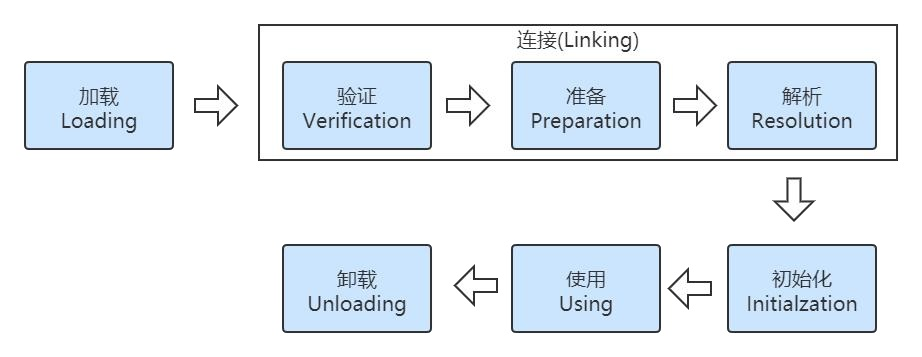
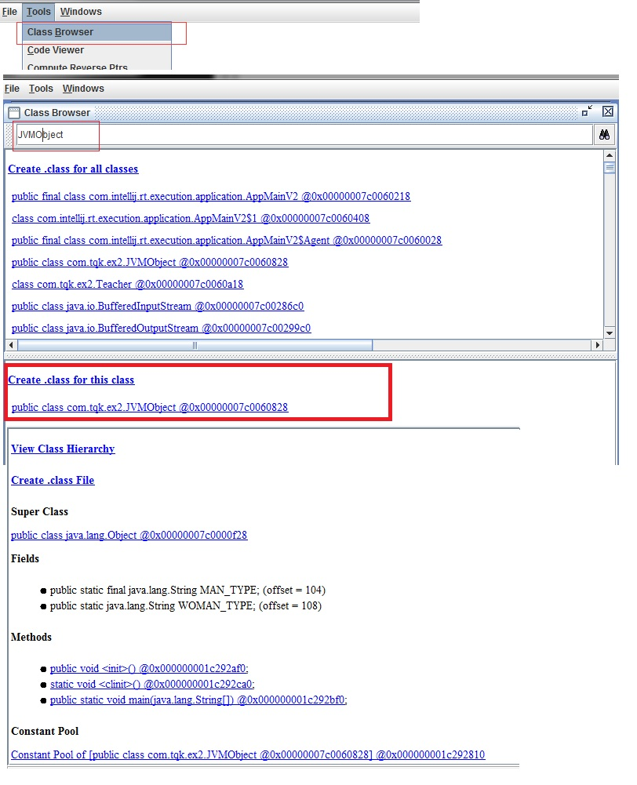

# 7. 类加载与类加载器

##  7.1 一个类的生命周期（重点） 

###  7.1.1 类生命周期7个阶段 
类从被加载到虚拟机内存中开始，到卸载出内存为止，它的整个生命周期包括：
加载（Loading）、  
验证（Verification）、  
准备（Preparation）、  
解析（Resolution）、   
初始化（Initialization）、  
使用（Using）和  
卸载（Unloading）7 个阶段。  
<strong>其中验证、准备、解析 3 个部分统称为连接（Linking）</strong>

###  7.1.2 阶段顺序 
加载、校验、准备、初始化和卸载这五个阶段的顺序是确定的，但是对于“解析”阶段则不一定，它在某些情况下可以在初始化之后再开始，这样做是 为了支持 java 的运行时绑定特征（也称为动态绑定或晚期绑定）

###  7.1.3 加载的时机 

什么是需要开始类第一个阶段“加载”，虚拟机规范没有强制约束，这点交给虚拟机的具体实现来自由把控。 

JVM 虚拟机的实现都是使用的**懒加载**，就是什么时候需要这个类了我才去加载，并不是说一个jar文件里面有200多个类，但实际我只用到了其中的一个类，我不需要把200多个类全部加载进来。（如果你自己写一个JVM倒是可以这么干！） “加载 loading”阶段是整个类加载（class loading）过程的一个阶段。 

:::tip 加载阶段虚拟机需要完成以下3件事情： 
1. 通过一个类的全限定名来获取定义此类的二进制字节流。
2. 将这个字节流所代表的静态存储结构转化为方法区的运行时数据结构。
3. 在内存中生成一个代表这个类的 java.lang.Class 对象，作为方法区这个类的各种数据的访问入口
:::

注意：比如“通过一个类的全限定名来获取定义此类的二进制字节流”没有指定一定得从某个class文件中获取，所以我们可以从zip压缩包、从网络中 获取、运行时计算生成、数据库中读取、或者从加密文件中获取等等。   

我们也可以通过前面的工具 JHSDB 可以看到，JVM 启动后，相关的类已经加载进入了方法区，成为了方法区的运行时结构。  

JHSDB 怎么用？  
:::tip 具体见 JHSDB 工具   
1. Attarch 上 JVM 启动的进程 
2. 打开 Class Browser

3. 可以看到很多 class 已经被加载进来了 
4. 找到 JVMObject，注意！这里已经是内存了，所以说相关的类已经加载进入了方法区，成为了方法区的运行时结构
:::

###  7.1.4 验证

验证是连接阶段的第一步，这一阶段的目的是为了确保 Class 文件的字节流中包含的信息符合当前虚拟机的要求，并且不会危害虚拟机自身的安全。 
但从整体上看，验证阶段大致上会完成下面4个阶段的检验动作：**文件格式验证、元数据验证、字节码验证、符号引用验证**。

