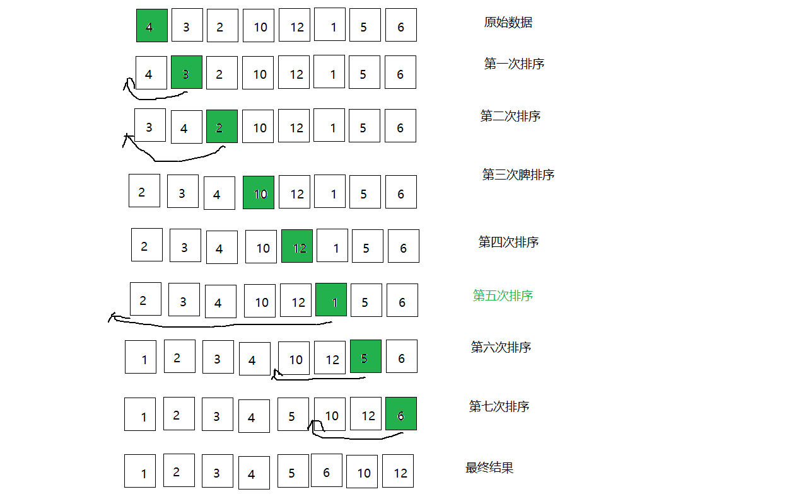
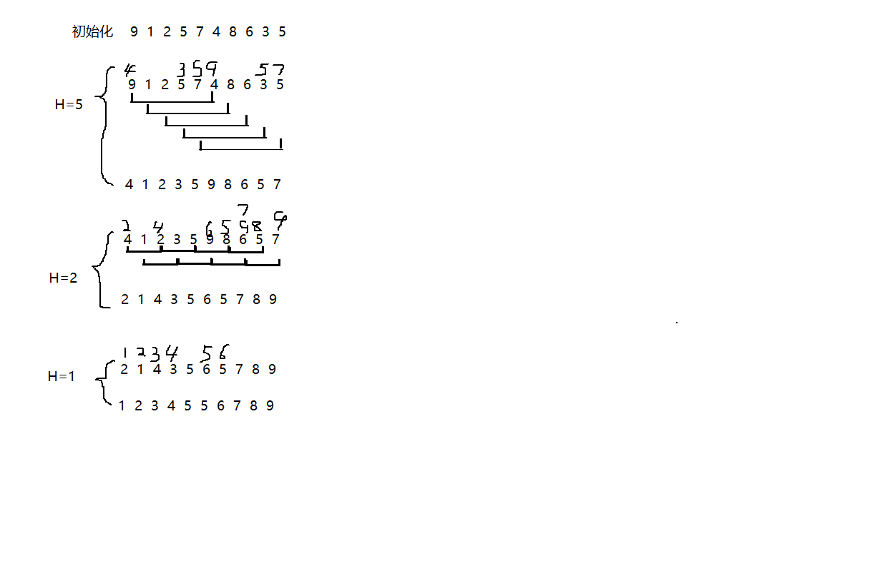
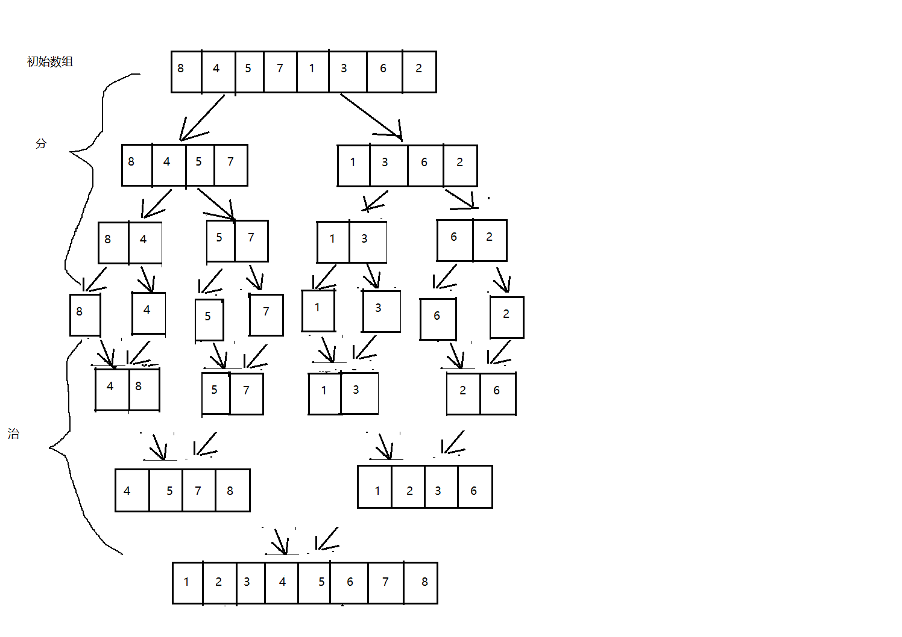
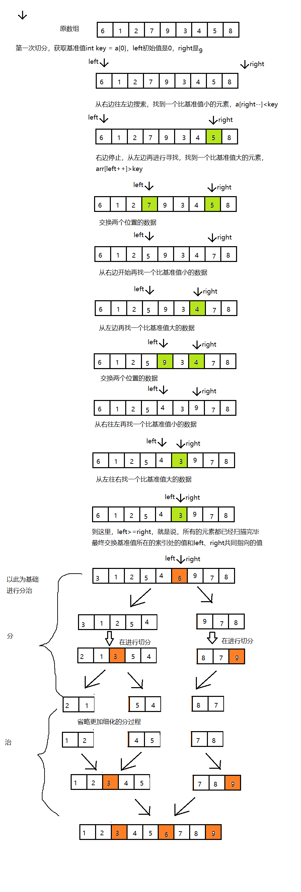

# 3. 排序算法

在我们的程序中，排序是非常常见的一种需求，提供一些数据元素，把这些数据元素按照一定的规则进行排序。比如查询一些订单，按照订单的日期进行排序；再比如查询一些商品，按照商品的价格进行排序等等。所以，接下来我们要学习一些常见的排序算法。

## 3.1 冒泡排序

`冒泡排序`（Bubble Sort），是一种计算机科学领域的较简单的排序算法


:::tip 排序原理：
1. 比较相邻的元素。如果前一个元素比后一个元素大，就交换这两个元素的位置。
2. 对每一对相邻元素做同样的工作，从开始第一对元素到结尾的最后一对元素。最终最后位置的元素就是最大值。
:::

-----------------------

```java
    /**
     * 冒泡排序
     * @param arr
     */
    private static int[] bubbleSort(int[] arr) {
        for (int i = 0; i < arr.length ; i++) {
            for (int j =0; j <arr.length-i-1; j++) {
                if(arr[j]>arr[j+1]){
                    int temp= arr[j];
                    arr[j]= arr[j+1];
                    arr[j+1]=temp;
                }
            }
        }
        return  arr;
    }
```

```
25 - 40 - 79 - 44 - 87 - 41 - 96 - 72 - 17 - 7 - 
冒泡排序
25 - 40 - 44 - 79 - 41 - 87 - 72 - 17 - 7 - 96 - 
25 - 40 - 44 - 41 - 79 - 72 - 17 - 7 - 87 - 96 - 
25 - 40 - 41 - 44 - 72 - 17 - 7 - 79 - 87 - 96 - 
25 - 40 - 41 - 44 - 17 - 7 - 72 - 79 - 87 - 96 - 
25 - 40 - 41 - 17 - 7 - 44 - 72 - 79 - 87 - 96 - 
25 - 40 - 17 - 7 - 41 - 44 - 72 - 79 - 87 - 96 - 
25 - 17 - 7 - 40 - 41 - 44 - 72 - 79 - 87 - 96 - 
17 - 7 - 25 - 40 - 41 - 44 - 72 - 79 - 87 - 96 - 
7 - 17 - 25 - 40 - 41 - 44 - 72 - 79 - 87 - 96 - 
7 - 17 - 25 - 40 - 41 - 44 - 72 - 79 - 87 - 96 - 
7 - 17 - 25 - 40 - 41 - 44 - 72 - 79 - 87 - 96 - 
```

-------------------------------

### 3.1.2 冒泡排序的时间复杂度分析 

冒泡排序使用了双层for循环，其中内层循环的循环体是真正完成排序的代码，所以，我们分析冒泡排序的时间复杂度，主要分析一下内层循环体的执行次数即可。

在最坏情况下，也就是假如要排序的元素为{6,5,4,3,2,1}逆序，那么：
元素比较的次数为：
` (N-1)+(N-2)+(N-3)+...+2+1=((N-1)+1)*(N-1)/2=N^2/2-N/2;`

元素交换的次数为：
` (N-1)+(N-2)+(N-3)+...+2+1=((N-1)+1)*(N-1)/2=N^2/2-N/2;`

总执行次数为：
` (N^2/2-N/2)+(N^2/2-N/2)=N^2-N;`

按照大O推导法则，保留函数中的最高阶项那么最终冒泡排序的时间复杂度为`O(N^2)`.


## 3.2 选择排序
选择排序是一种更加简单直观的排序方法。

:::tip 选择排序原理：
1. 每一次遍历的过程中，都假定第一个索引处的元素是最小值，和其他索引处的值依次进行比较，如果当前索引处的值大于其他某个索引处的值，则假定其他某个索引出的值为最小值，最后可以找到最小值所在的索引
2. 交换第一个索引处和最小值所在的索引处的值
:::


```java

    /**
     * 选择排序
     * @param arr
     */
    private static int[] selectSort(int[] arr) {
        for (int i = 0; i < arr.length ; i++) {
            int min=i;
            for (int j = i+1; j < arr.length; j++) {
                if(arr[j]<arr[min]){
                    min=j;
                }
            }
            if(min!=i){
                int temp =arr[min];
                arr[min]=arr[i];
                arr[i]=temp;
            }
        }
        return  arr;
    }
```


```java
    /**
     * 选择排序
     * @param arr
     */
    private static int[] selectSort(int[] arr) {
        // 外层循环
        for (int i = 0; i < arr.length ; i++) {
            // 遍历剩余实际的数组
            for (int j = i+1; j < arr.length; j++) {
                //如果后边的值小于前边的交换位置
                if(arr[j]<=arr[i]){
                    int temp= arr[j];
                    arr[j]= arr[i];
                    arr[i]=temp;
                }
            }
        }
        return  arr;
    }
```

## 3.3 插入排序

`插入排序（Insertion sort）`是一种简单直观且稳定的排序算法。


插入排序的工作方式非常像人们排序一手扑克牌一样。开始时，我们的左手为空并且桌子上的牌面朝下。然后我们每次从桌子上拿走一张牌并将它插入左手中正确的位置。为了找到一张牌的正确位置，

我们从右到左将它与已在手中的每张牌进行比较，如下图所示：

<a data-fancybox title="插入排序" href="./images/charupaixutujie2.png"></a>


### 3.3.1 插入排序原理

:::tip 插入排序原理：
1. 把所有的元素分为两组，`已经排序的`和`未排序的`；
2. 找到未排序的组中的第一个元素，向已经排序的组中进行插入；
3. 倒叙遍历已经排序的元素，依次和待插入的元素进行比较，直到找到一个元素小于等于待插入元素，那么就把待插入元素放到这个位置，其他的元素向后移动一位；
:::


### 3.3.2 插入排序实现

```java
    /**
     * 插入排序
     * @param arr
     */
    private static int[] insertSort(int[] arr) {
        for (int i = 1; i < arr.length ; i++) {
            for (int j = 0; j<i; j++) {
                if(arr[j]>arr[i]){
                    int temp= arr[j];
                    arr[j]= arr[i];
                    arr[i]=temp;
                }
            }
        }
        return  arr;
    }
```

```
原数组
25 - 8 - 58 - 84 - 83 - 74 - 5 - 74 - 84 - 62 - 
插入排序
8 - 25 - 58 - 84 - 83 - 74 - 5 - 74 - 84 - 62 - 
8 - 25 - 58 - 84 - 83 - 74 - 5 - 74 - 84 - 62 - 
8 - 25 - 58 - 84 - 83 - 74 - 5 - 74 - 84 - 62 - 
8 - 25 - 58 - 83 - 84 - 74 - 5 - 74 - 84 - 62 - 
8 - 25 - 58 - 74 - 83 - 84 - 5 - 74 - 84 - 62 - 
5 - 8 - 25 - 58 - 74 - 83 - 84 - 74 - 84 - 62 - 
5 - 8 - 25 - 58 - 74 - 74 - 83 - 84 - 84 - 62 - 
5 - 8 - 25 - 58 - 74 - 74 - 83 - 84 - 84 - 62 - 
5 - 8 - 25 - 58 - 62 - 74 - 74 - 83 - 84 - 84 - 
5 - 8 - 25 - 58 - 62 - 74 - 74 - 83 - 84 - 84 - 
```


### 3.3.3 插入排序的时间复杂度分析
插入排序使用了双层for循环，其中内层循环的循环体是真正完成排序的代码，所以，我们分析插入排
序的时间复杂度，主要分析一下内层循环体的执行次数即可。
最坏情况，也就是待排序的数组元素为{12,10,6,5,4,3,2,1}，那么：
比较的次数为：
`(N-1)+(N-2)+(N-3)+...+2+1=((N-1)+1)*(N-1)/2=N^2/2-N/2;`
交换的次数为：
`(N-1)+(N-2)+(N-3)+...+2+1=((N-1)+1)*(N-1)/2=N^2/2-N/2;`
总执行次数为：
`(N^2/2-N/2)+(N^2/2-N/2)=N^2-N;`
按照大O推导法则，保留函数中的最高阶项那么最终插入排序的时间复杂度为O(N^2).

## 3.4 希尔排序
之前我们学习过基础排序，包括冒泡排序，选择排序还有插入排序，并且对他们在最坏情况下的时间复
杂度做了分析，发现都是O(N^2)，而平方阶通过我们之前学习算法分析我们知道，随着输入规模的增
大，时间成本将急剧上升，所以这些基本排序方法不能处理更大规模的问题，接下来我们学习一些高级
的排序算法，争取降低算法的时间复杂度最高阶次幂。


希尔排序是插入排序的一种，又称“缩小增量排序”，是插入排序算法的一种更高效的改进版本。
前面学习插入排序的时候，我们会发现一个很不友好的事儿，如果已排序的分组元素为{2,5,7,9,10}，未
排序的分组元素为{1,8}，那么下一个待插入元素为1，我们需要拿着1从后往前，依次和10,9,7,5,2进行
交换位置，才能完成真正的插入，每次交换只能和相邻的元素交换位置。那如果我们要提高效率，直观
的想法就是一次交换，能把1放到更前面的位置，比如一次交换就能把1插到2和5之间，这样一次交换1
就向前走了5个位置，可以减少交换的次数，这样的需求如何实现呢？接下来我们来看看希尔排序的原


### 3.4.1 排序原理：
1. 选定一个增长量h，按照增长量h作为数据分组的依据，对数据进行分组；
2. 对分好组的每一组数据完成插入排序；
3. 减小增长量，最小减为1，重复第二步操作。


<a data-fancybox title="希尔排序实现" href="./images/xierpaixu.png"></a>


### 3.4.2 希尔排序实现

```java
/**
 * 希尔排序
 * @Version 1.0
 */
public class Shell {
    public static void sort(int[] arr) {
        // 计算h
        int n = arr.length;
        int h = 1;
        while (h < n / 2) {
            h = 2 * h + 1;
        }
        // 开始排序，只要h小于1，就停止排序
        while (h >= 1) {
            // 找到待插入的元素
            for (int i = h; i < n; i++) {
                // 在这里，arr[i]就是待插入的元素
                // arr[i]分别与arr[i-h]、arr[i-2h]、arr[i-3h]....比较
                for (int j = i; j >= h; j = j - h) {
                    // arr[j]就是带插入的元素
                    // 分别于分别与arr[j-h]、arr[j-2h]、arr[j-3h]....比较
                    if (greater(arr[j - h], arr[j])) {
                        exch(arr, j, j - h);
                    } else {
                        break;
                    }
                }
            }
            h = h / 2;
        }
    }

    /**
     * 判断v是否大于w
     *
     * @param v
     * @param w
     * @return
     */
    private static boolean greater(int v, int w) {
        return v > w;
    }

    /**
     * 交换数组a的i和j下标位置的值
     *
     * @param a
     * @param i
     * @param j
     */
    private static void exch(int[] a, int i, int j) {
        int temp = a[i];
        a[i] = a[j];
        a[j] = temp;
    }

}
```

```java
    public static void main(String[] args) {
        int[] a1 = new int[100000];
        int[] a2 = new int[100000];
        for (int i = 0; i < 100000; i++) {
            // 生成随机数，1-10000
            int num = (int)Math.random() * 100000 + 1;
            a1[i] = num;
            a2[i] = num;
        }

        long start = System.nanoTime();
        Bubble.selectSort(a1);
        long end = System.nanoTime();
        System.out.println("选择排序"+(end - start));

        start = System.nanoTime();
        Shell.sort(a2);
        end = System.nanoTime();
        System.out.println("希尔排序"+(end - start));
    }
```

通过测试发现，在处理大批量数据时，希尔排序的性能确实高于插入排序

## 3.5  归并排序

归并排序是建立在递归操作上的一种有效的排序算法，该算法是采用**分治法**的一个非常典型的应用。将
已有序的子序列合并，得到完全有序的序列；即先使每个子序列有序，再使子序列段间有序。若将两个
有序表合并成一个有序表，称为二路归并。


### 3.5.1 归并排序原理

:::tip 排序原理：
1. 尽可能的一组数据拆分成两个元素相等的子组，并对每一个子组继续拆分，直到拆分后的每个子组的元素个数是1为止。
2. 将相邻的两个子组进行合并成一个有序的大组；
3. 不断的重复步骤2，直到最终只有一个组为止。
:::

<a data-fancybox title="归并排序原理" href="./images/guibingpaixu.png"></a>


### 3.5.2 归并排序实现

```java
/**
 * 归并排序
 *
 */
public class Merge {

    /**
     * 辅助数组
     */
    private static int[] assets;

    /**
     * 对数组内的元素进行排序
     *
     * @param a
     */
    public static void sort(int[] a) {
        // 初始化辅助数组
        assets = new int[a.length];
        // 获取lo和hi
        int lo = 0;
        int hi = a.length - 1;
        // 进入排序流程
        sort(a, lo, hi);

    }

    /**
     * 对数组a中从索引lo到索引hi之间的元素进行排序
     * 假设lo是6 hi是11
     * 9
     *
     * @param a
     * @param lo-起始位置
     * @param hi-终止为止
     */
    private static void sort(int[] a, int lo, int hi) {
        if (hi <= lo) {
            return;
        }
        // 计算mid
        int mid = lo + (hi - lo) / 2;
        // 对lo和mid之间的数据进行排序
        sort(a, lo, mid);
        // 对mid+1到hi之间的数据进行排序
        sort(a, mid + 1, hi);
        // 从lo到mid这组数据和mid+1到hi这组数据进行归并
        merge(a, lo, mid, hi);
    }

    /**
     * 从索引lo到索引mid为一个子组
     * 从索引mid+1到hi为另一个子组，把数组a中的这两个子组数据合并成一个有序的大组
     *
     * @param a
     * @param lo
     * @param mid
     * @param hi
     */
    private static void merge(int[] a, int lo, int mid, int hi) {
        // 从lo到mid这组数据和mid+1到hi这组数据归并到assets对应的所引出
        int i = lo;
        int p1 = lo;
        int p2 = mid + 1;
        // 比较左边小组和右边小组中的元素大小，哪个小，就把哪个数组填充到assets中
        while (p1 <= mid && p2 <= hi) {
            if (less(a[p1], a[p2])) {
                assets[i++] = a[p1++];
            } else {
                assets[i++] = a[p2++];
            }
        }
        // 上面的循环结束后，如果退出循环的条件是p1<=mid，则说明左边小组中的数据已经归并完毕
        // 如果退出循环的条件是p2<=hi，则说明右边小组中的数据已经填充完毕.
        while (p1 <= mid) {
            // 说明左子组没有排序完
            assets[i++] = a[p1++];
        }

        while (p2 <= hi) {
            // 说明右子组没有排序完
            assets[i++] = a[p2++];
        }
        // 到现在为止，assets中的数据，从lo到hi是有序的
        for (int j = lo; j <= hi; j++) {
            a[j] = assets[j];
        }
    }

    /**
     * 判断v是否小于w
     *
     * @param v
     * @param w
     * @return
     */
    private static boolean less(int v, int w) {
        return v < w;
    }

    /**
     * 交换数组a的i和j下标位置的值
     *
     * @param a
     * @param i
     * @param j
     */
    private static void exch(int[] a, int i, int j) {
        int temp = a[i];
        a[i] = a[j];
        a[j] = temp;
    }
}
```


## 3.6 快速排序

快速排序是对冒泡排序的一种改进。它的基本思想是：通过一趟排序将要排序的数据分割成独立的两部
分，其中一部分的所有数据都比另外一部分的所有数据都要小，然后再按此方法对这两部分数据分别进
行快速排序，整个排序过程可以递归进行，以此达到整个数据变成有序序列。

---------------------------------------------------------

:::tip 排序原理
1. 首先设定一个分界值，通过该分界值将数组分成左右两部分；

2. 将大于或等于分界值的数据放到到数组右边，小于分界值的数据放到数组的左边。此时左边部分中各元素都小于或等于分界值，而右边部分中各元素都大于或等于分界值；

3. 然后，左边和右边的数据可以独立排序。对于左侧的数组数据，又可以取一个分界值，将该部分数据分成左右两部分，同样在左边放置较小值，右边放置较大值。右侧的数组数据也可以做类似处理。

4. 重复上述过程，可以看出，这是一个递归定义。通过递归将左侧部分排好序后，再递归排好右侧部分的顺序。当左侧和右侧两个部分的数据排完序后，整个数组的排序也就完成了。
:::

---------------------------------------------------------

<a data-fancybox title="快速排序" href="./images/kuaisupaixu.png"></a>

```java
package com.jg.sort;

import java.util.Arrays;

/**
 * 快速排序
 *
 * @Author: 杨德石
 * @Date: 2020/6/14 0:32
 * @Version 1.0
 */
public class Quick {

    /**
     * 对数组内的元素进行排序
     *
     * @param a
     */
    public static void sort(int[] a) {
        // 获取lo和hi
        int lo = 0;
        int hi = a.length - 1;
        sort(a, lo, hi);
    }

    /**
     * 对数组a中从索引lo到索引hi之间的元素进行排序
     * 假设lo是6 hi是11
     * 9
     *
     * @param a
     * @param lo
     * @param hi
     */
    private static void sort(int[] a, int lo, int hi) {
        if (hi <= lo) {
            return;
        }
        // 对a数组中，从lo到hi之间的元素进行切分
        int p = partition(a, lo, hi);
        // 对左边分组中的元素进行排序
        sort(a, lo, p - 1);
        sort(a, p + 1, hi);
    }

    /**
     * 对数组a中，从索引lo到索引hi之间的元素进行切分
     *
     * @param a
     * @param lo
     * @param hi
     * @return
     */
    private static int partition(int[] a, int lo, int hi) {
        // 把最左边的值视为基准值
        int key = a[lo];
        // 定义一个左侧指针，初始指向最左边的元素
        int left = lo;
        // 定义一个右侧指针，初始指向右侧元素下一个位置
        int right = hi + 1;
        // 进行切分
        while (true) {
            // 从右往左扫描，找到一个比基准值小的元素
            while (less(key, a[--right])) {
                // 循环停止，说明找到了一个比基准值小的元素
                if (right == lo) {
                    // 说明已经扫描到最左边了，无需再扫描
                    break;
                }
            }
            // 再次从左往右扫描，找到一个比基准值更大的元素
            while (less(a[++left], key)) {
                // 循环停止，说明找到了一个比基准值大的元素
                if (left == hi) {
                    // 说明已经扫描到最右边了，无需再扫描
                    break;
                }
            }

            if (left >= right) {
                // 扫描完所有的元素，结束循环
                break;
            } else {
                // 没有扫描完，直接交换left和right位置的元素
                exch(a, left, right);
            }
        }
        // 交换最后right索引处和基准值所在的索引处的值
        exch(a, lo, right);
        return right;
    }

    /**
     * 判断v是否小于w
     *
     * @param v
     * @param w
     * @return
     */
    private static boolean less(int v, int w) {
        return v < w;
    }

    /**
     * 交换数组a的i和j下标位置的值
     *
     * @param a
     * @param i
     * @param j
     */
    private static void exch(int[] a, int i, int j) {
        int temp = a[i];
        a[i] = a[j];
        a[j] = temp;
    }

}

class Test6 {
    public static void main(String[] args) {
        int[] a = {6, 1, 2, 7, 9, 3, 4, 5, 8};
        Quick.sort(a);
        System.out.println(Arrays.toString(a));
    }
}
```

