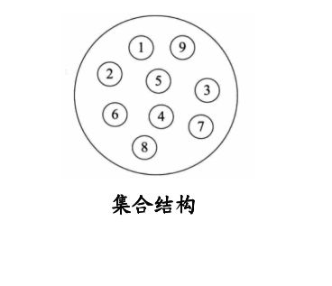

# 1. 数据结构和算法概述

## 1.1 什么是数据结构

官方解释：数据结构是一门研究`非数值计算的程序设计问题中的操作对象`，以及他们之间的`关系和操作等相关问题`的学科

---------------------------------------------------------------------------------------------------------------

数据结构就是把`数据元素按照一定的关系组织起来的集合`，`用来组织和存储数据`

## 1.2 什么是算法

**官方解释**：算法是指解题方案的准确而完整的描述，是一系列解决问题的清晰指令，`算法代表着用系统的方法解决问题的策略机制`。也就是说能够对一定规范的输入，在有限时间内获得所要求的输出。

**说人话：**`根据一定的条件，对一些数据进行计算，得到需要的结果`


#### 算法五个特征：

`**有穷性、确定性、可行性、有输入、有输出**`

:::tip 优秀的算法追求以下两个目标：
1. 花最少的时间完成需求
2. 占用最少的内存空间完成需求
3. 高效率与低存储: 内存+CPU 堆栈内存OOM 内存占用最小，CPU占用最小，运算速度最快。
:::

--------------------------------------------

#### 判断一个值是否是2的n次方

```java
package com.tqk.no1;

import java.util.Scanner;

/**
 * 判断一个值是否是2的n次方
 * @author tianqikai
 */
public class TwoTrue {
    public static void main(String[] args) {
        Scanner scanner = new Scanner(System.in);
        int num=0;
        while (true) {
            System.out.println("请输入一个数值：");
            Integer i = scanner.nextInt();
            //原理用的与运算，二进制与运算0&1=0
            if((i&(i-1))==0){
                System.out.println(i+":是2的n次方");
            }else{
                System.out.println(i+":不是2的n次方");
            }
            if(num>10){
                break;
            }
        }
    }
}
```

## 1.3 数据结构的分类

### 1.3.1 逻辑结构

逻辑结构是从具体问题中抽象出来的模型，是抽象意义上的结构，按照对象中数据元素之间的相互关系分类，也是我们后面课题中需要关注和讨论的问题。

#### 集合结构：

集合结构中数据元素除了属于同一个集合外，它们之间并无任何关系

<a data-fancybox title="集合结构" href="./images/datastructure02.png"></a>


#### 线性结构：

线性结构中的数据元素之间存在一对一的关系

<a data-fancybox title="线性结构" href="./images/datastructure01.png"></a>


#### 树形结构：

树形结构中的数据元素之间存在一对多的层次关系

<a data-fancybox title="树形结构" href="./images/shujiegou.png"></a>

#### 图形结构：

图形结构的元素数据是多对多的关系

<a data-fancybox title="线性结构" href="./images/datastructure03.png"></a>

### 1.3.2 物理结构

逻辑结构在计算机中真正的表示方式（又称为映像）称为物理结构，也可以叫做存储结构。常见的物理结构有`顺序存储结构、链式存储结构`

#### 顺序结构：

把数据元素放到地址连续的存储单元里面，其数据间的逻辑关系和物理关系是一致的，比如数组。

顺序存储结构存在一定的弊端，就像`生活中排时也会有人插队也可能有人有特殊情况突然离开，这时候整个结构都处于变化中`，此时就需要链式存储结构。

<a data-fancybox title="顺序结构" href="./images/shunxujiegou.png"></a>

#### 链式结构：

是把数据元素存放在任意的存储单元里面，这组存储单元可以是连续的也可以是不连续的。

<a data-fancybox title="链式结构" href="./images/lianshijiegou.png"></a>


此时，数据元素之间并不能反映数据之间的逻辑关系，因此在链式存储结构中引进了一个指针存放数据元素的地址，这样通过地址就可以找到相关的数据元素的位置。
