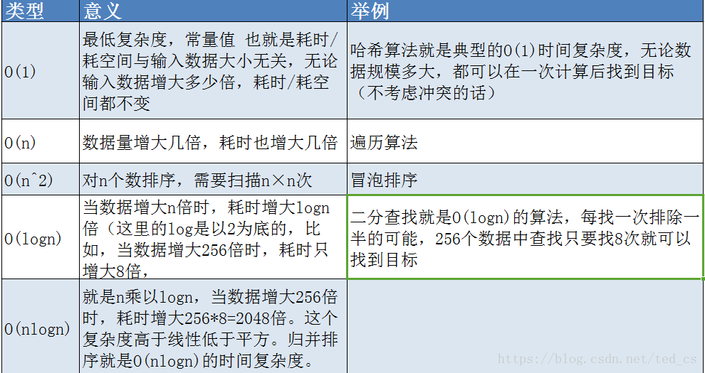
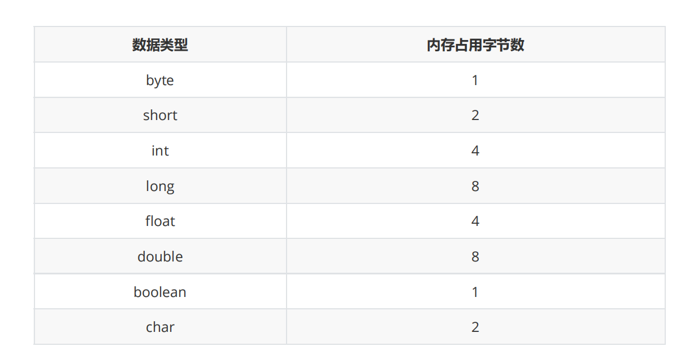

# 2. 算法分析

## 2.1 时间复杂度分析

我们要`计算算法时间耗费情况`，首先我们得度量算法的执行时间，那么如何度量呢？

### 2.1.1 事后分析估算方法：

比较容易想到的方法就是我们把算法执行若干次，然后拿个计时器在旁边计时，这种事后统计的方法看上去的确不错，并且也并非要我们真的拿个计算器在旁边计算，因为计算机都提供了`计时的功能`

这种统计方法主要是通过设计好的测试程序和测试数据，利用计算机计时器对不同的算法编制的程序的运行时间进行比较，从而确定算法效率的高低

但是这种方法有很大的缺陷：必须依据算法实现编制好的测试程序，通常要花费大量时间和精力，测试完了如果发现测试的是非常糟糕的算法，那么之前所做的事情就全部白费了，并且不同的测试环境(硬件环境)的差别导致测试的结果差异也很大。

```java
/**
 * @author tianqikai
 */
public class Test1 {

    public static void main(String[] args) {
        long start = System.nanoTime();
        int sum = 0;
        int count = 100;
        for (int i = 1; i <= count; i++) {
            sum += i;
        }
        System.out.println(sum);
        System.out.println("耗时：" + (System.nanoTime() - start)+" 毫微秒");
    }
}
```

### 2.1.2 事前分析估算方法：

在计算机程序编写前，依据统计方法对算法进行估算，经过总结我们发现一个高级语言编写的程序程序在计算机上运行所消耗的时间取决于下列因素：

1. 算法采用的策略和方案；
2. 编译产生的代码质量；
3. 问题的输入规模(所谓的问题输入规模就是输入量的多少；
4. 机器执行指令的速度；

由此可见，抛开这些与计算机硬件、软件有关的因素，一个程序的运行时间依赖于算法的好坏和问题的输入规模。如果算法固定，那么该算法的执行时间就只和问题的输入规模有关系了。

再次以之前的求和案例为例，进行分析。
因此当输入规模为n时，第一种算法执行了1+1+(n+1)+n=2n+3次；第二种算法执行了1+1+1=3次。
如果我们把第一种算法的循环体看做是一个整体，忽略结束条件的判断，那么其实这两个算法运行时间的差距就是n和1的差距。

在研究算法的效率时，我们只考虑核心代码的执行次数，这样可以简化分析。
我们研究算法复杂度，侧重的是当输入规模不断增大时，算法的增长量的一个抽象(规律)，而不是精确地定位需要执行多少次，因为如果是这样的话，我们又得考虑回编译期优化等问题，容易主次跌倒。


## 2.2 大O记法

**定义**：在进行算法分析时，语句总的执行次数T(n)是关于问题规模n的函数，进而分析T(n)随着n的变化情况并确定T(n)的量级。算法的时间复杂度，就是算法的时间量度，记作:T(n)=O(f(n))。它表示随着问题规模n的增大，算法执行时间的增长率和f(n)的增长率相同，称作算法的渐近时间复杂度，简称时间复杂度，其中f(n)是问题规模n的某个函数。

在这里，我们需要明确一个事情：**执行次数=执行时间**

用大写O()来体现算法时间复杂度的记法，我们称之为大O记法。一般情况下，随着输入规模n的增大，T(n)增长最 慢的算法为最优算法。

时间复杂度表示方法：`大O表示法`

`O(1)`,`O(n)`,`O(nlogn)`,`O(n^2)`,`O(n+1)`,`O(logn)`,`O(n!)`


常数：O(1) 1表示是常数，所有能确定的数字我们都用O（1），O(1000)=>o(1)

对数：O(logn),O(nlogn)

线性：O(n)

线性对数：O(nlogn)

平方：O(n^2)

N次方：O(n^n)

`O(1)>O(logn)>O(n)>O(nlogn)>O(n^2)>O(n^x)`

O(1)>O(logn)>O(n)>O(nlogn) 效果都是很好的。

几乎优化的空间不是很大

<a data-fancybox title="大O记法" href="./images/datastructure04.png"></a>


下面我们使用大O表示法来表示一些求和算法的时间复杂度：

### 2.2.1 常数：O(1) 

常数：O(1) 1表示是常数，所有能确定的数字我们都用O（1），O(1000)=>o(1)

```java
    private static void oOne() {
        int a = 1;		//1次 O(1)
        for(int i = 0 ;i < 3;i++){//这里会运行几次？4次 在第4次的时候结束 跳出 i=3 (0 1 2 3)
            a = a + 1;			//这里运行几次？ 3次 O(1)? n+1 n 1 O(3)? => O(1)
        }
    }
```

### 2.2.2 线性：O(n)

数据增加几倍，耗时也增加几倍，遍历算法

```java
    private static void oN() {
        int sum = 0; // 执行1次
        int count = Integer.MAX_VALUE;
        // 执行1次
        for (int i = 1; i <= count; i++)
        {
            sum += i; // 执行n次
        }
        System.out.println(sum);
    }
```

### 2.2.3 平方：O(n^2)

需要扫描n*n次，例如：`冒泡排序`

```java
    private static void n2() {
        int sum = 0;
        int n = 100;
        for (int i = 1; i <= n; i++) {
            for (int j = 1; j <= n; j++) {
                sum += n;

                //运行了多少次？	n*(n+1)/2 => O(n^2); => (n^2+n)/2 => 注意有个规律，有加减法的时候，找次数最高的那个
            }
        }
        System.out.println(sum);
    }
```

如果忽略判断条件的执行次数和输出语句的执行次数，那么当输入规模为n时，以上算法执行的次数分别为：
算法一：3次 O(1)
算法二：n+2次 O(n)
算法三：n^2+2次 O(n^2)
如果用大O记法表示上述每个算法的时间复杂度，应该如何表示呢？基于我们对函数渐近增长的分析，

:::tip 推导大O阶的表示法有以下几个规则可以使用：
1. 用常数=1=取代运行时间中的所有加法常数
2. 在修改后的运行次数中，只保留高阶项；
3. 如果最高阶项存在，且常数因子不为1，则去除与这个项相乘的常数；
:::

### 2.2.4 对数：O(logn),O(nlogn) 

```java
    private static void ologn() {
        int n = Integer.MAX_VALUE;		//表示n是未知

        int i = 1;
        while( i <= n){
            i = i * 2;		//O(logn)
        }
    }
```

此段代码的时间复杂度就取决于while里面那句话的执行次数，也就是i和n的关系。

可以理解为：执行多少次（设为x）就有多少个2相乘，所以最后:
`i = 2^x <= n`
所以执行次数：`x = logn`（以2为底）

`时间复杂度：O(n) = logn`

### 2.2.5 N次方：O(n^n)

```java
public class Test6 {

    public static void main(String[] args) {
        int sum = 0;
        int n = 100;
        for (int i = 1; i <= n; i++) {
            for (int j = 1; j <= n; j++) {
                for (int k = 1; k <= n ; k++) {
                    sum += n;
                }
            }
        }
        System.out.println(sum);
    }

}
```


他们的复杂程度从低到高依次为：

`O(1)<O(logn)<O(n)<O(nlogn)<O(n^2)<O(n^3)<O(2^N)`

我们的算法尽可能的追求的是O(1),O(logn),O(n),O(nlogn)这几种时间复杂度，而如果发现算法的时间复杂度为平方阶、立方阶或者更复杂的，那我们可以分为这种算法是不可取的，需要优化。

## 2.3  算法空间复杂度

计算机的软硬件都经历了一个比较漫长的演变史，作为为运算提供环境的内存，更是如此，从早些时候
的512k,经历了1M，2M，4M...等，发展到现在的8G，甚至16G和32G，所以早期，算法在运行过程中
对内存的占用情况也是一个经常需要考虑的问题。我么可以用算法的空间复杂度来描述算法对内存的占
用。

### 2.3.1 Java中常见的内存占用

1. 基本数据类型内存占用：

<a data-fancybox title="基本数据类型内存占用：" href="./images/datastructure05.png"></a>


2. 计算机访问内存的方式都是一次一个字节

3. 一个引用需要8个字节表示

例如： `Date date = new Date()`,则date这个变量需要占用8个字节来表示

4. 创建一个对象，比如new Date()，除了Date对象内部存储的数据(例如年月日等信息)占用的内存，
该对象本身也有内存开销，每个对象的自身开销是16个字节，用来保存对象的头信息。

5. 一般内存的使用，如果不够8个字节，都会自动填充为8字节。
new Person()，对象占16个字节。
int age = 1;占4字节，但是不够8字节，会被填充为8字节
所以 new Person()的过程占用了24字节。

6. java中数组被被限定为对象，他们一般都会因为记录长度而需要额外的内存，一个原始数据类型的
数组一般需要24字节的头信息(16个自己的对象开销，4字节用于保存长度以及4个填充字节)再加上保存值所需的内存。

### 指定数组翻转,返回反转内容


```java
public class ArrayDemo {
    public static void main(String[] args) {
        int[] arr={1,2,3,4};
//        reverseArr(arr);
//        for (int i = 0; i < arr.length; i++) {
//            System.out.println(arr[i]);
//        }


        int[] res=reverseArr2(arr);
        for (int i = 0; i < res.length; i++) {
            System.out.println(res[i]);
        }
    }

    private static int[] reverseArr(int[] arr) {
        int n=arr.length;
        int[] res=new int[n];
        for(int start=0,end=n-1;start<end;start++,end--){
            int temp=arr[start];
            arr[start]=arr[end];
            arr[end]=temp;
        }
        return res;
    }
}
```

---------------------------

```java
    private static int[] reverseArr2(int[] arr) {
        int n=arr.length;// 申请4字节
        int[] res=new int[n];// 申请n*4字节+数组本身头信息开销的24字节
        for(int i=0;i<=n-1;i++){
//            System.out.println(arr[i]);
            res[n-1-i]=arr[i];
        }
        return res;
    }
```


由于java中有内存垃圾回收机制，并且jvm对程序的内存占用也有优化（例如即时编译），我们无法精
确的评估一个java程序的内存占用情况，但是了解了java的基本内存占用，使我们可以对java程序的内
存占用情况进行估算。

由于现在的计算机设备内存一般都比较大，基本上个人计算机都是4G起步，大的可以达到32G，所以内
存占用一般情况下并不是我们算法的瓶颈，`普通情况下直接说复杂度，默认为算法的时间复杂度`。

但是，如果你做的`程序是嵌入式开发`，尤其是一些传感器设备上的内置程序，由于这些设备的内存很
小，一般为几kb，这个时候对算法的空间复杂度就有要求了，但是一般做java开发的，基本上都是服务
器开发，一般不存在这样的问题。