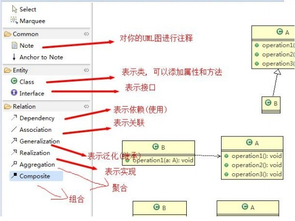
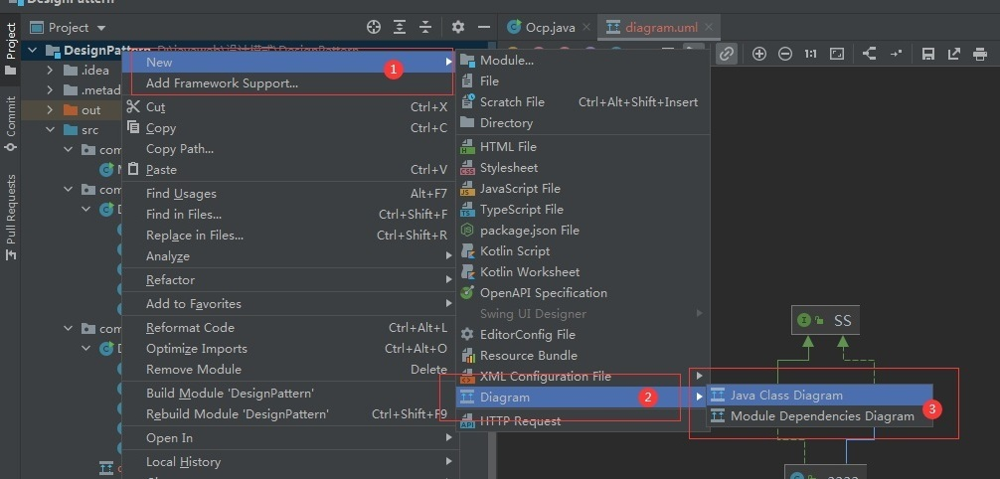
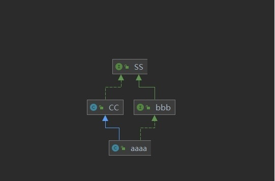
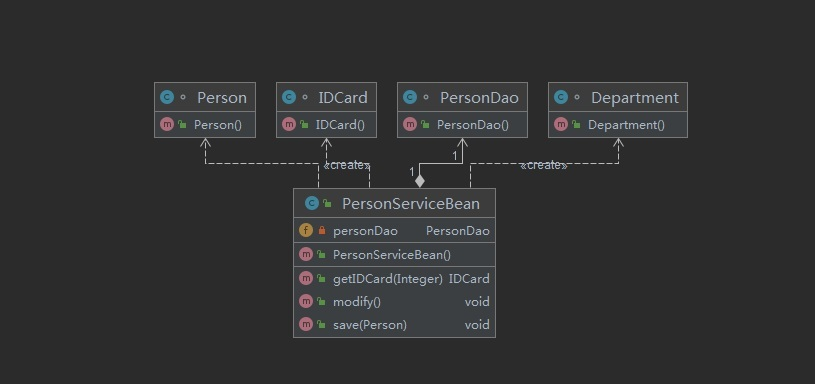
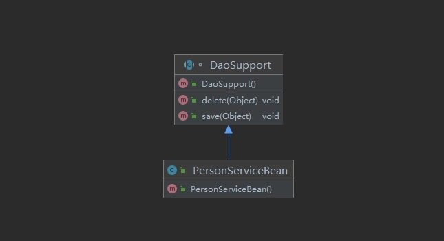
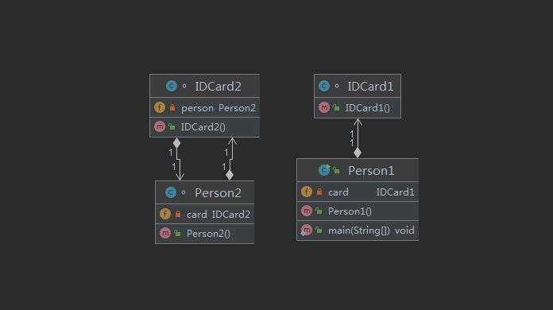
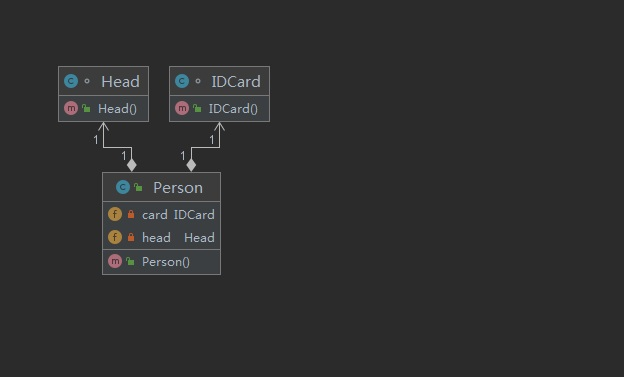
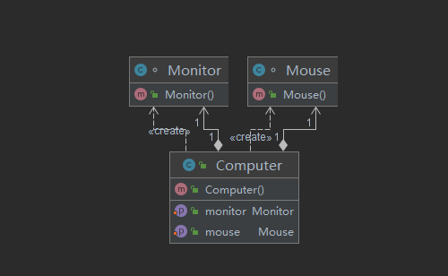

## UML类图

<font color='red'><strong>类之间的关系：依赖、泛化（继承）、实现、关联、聚合与组合</strong></font>
---------------------

## IDEA生成UML类图

:::tip UML图  
<br/>
<Badge text="Ctrl+Alt+Shift+U"/>  打开选中类的的UML类图到新的编辑框中    
<br/>
<Badge text="Ctrl+Alt+U"/>  展示选中类的的UML类图    
:::

<a data-fancybox title="UML图用法" href="./image/UML1.jpg"></a>

<br/>

<a data-fancybox title="创建UML" href="./image/createUML.jpg"></a>

:::tip <font color='red'>箭头含义</font>
<font color='green'><strong>绿色实线</strong></font>为 接口间的继承  
<font color='green'><strong>绿色虚线</strong></font>为 类实现接口  
<font color='blue'><strong>蓝色实线</strong></font>为 类继承  
:::
<br/>

<a data-fancybox title="UML箭头含义" href="./image/UML.jpg"></a>

<a title="UML类图参考文档"  href="https://blog.csdn.net/qq_19934363/article/details/90269883">UML类图参考文档</a>

## 类图—依赖关系（Dependence）

**只要是在类中用到了对方，那么他们之间就存在依赖关系。如果没有对方，连编绎都通过不了**

```java
/**
 * 1.类中用到了对方
 * 2.如果是类的成员属性
 * 3.如果是方法的返回类型
 * 4.是方法接收的参数类型
 * 5.方法中使用到
 **/
public class PersonServiceBean {
    private PersonDao personDao;

    public void save(Person person){}
    public IDCard getIDCard(Integer personid){
        return new IDCard();
    }
    public void modify(){
        Department department = new Department();
    }
}
 class PersonDao{}
 class IDCard{}
 class Person{}
 class Department{}
```
<a data-fancybox title="类图—依赖关系（Dependence）" href="./image/umlyilai.jpg"></a>

## 类图—泛化关系(generalization）

泛化关系实际上就是继承关系，他是<font color='red'><strong>依赖关系的特例</strong></font>
1. 泛化关系实际上就是继承关系
2. 如果A类继承了B类，我们就说A和B存在泛化关系

```java
public abstract class DaoSupport{
public void save(Object entity){
}
public void delete(Object id){
}
}

public class PersonServiceBean extends Daosupport{
}
```
<a data-fancybox title="类图—泛化关系" href="./image/umlgeneralization.jpg"></a>

## 类图—实现关系（Implementation）

实现关系实际上就是A类实现B接口，他是<font color='red'><strong>依赖关系的特例</strong></font>

```java
public class PersonServiceBean implements  PersonService{
    @Override
    public void delete(Integer id) {

    }
}
interface PersonService {
    public void delete(Integer id);
}
```

## 类图—关联关系（Association）

关联关系实际上就是类与类之间的联系，他是<font color='red'><strong>依赖关系的特例</strong></font>
关联具有导航性：<font>双向关系或单向关系</font>
关系具有多重性：如“1”（表示有且仅有一个），“0...”（表示0个或者多个）， “0，1”（表示0个或者一个），“n...m”(表示n到 m个都可以),“m...*”（表示至少m 个）

```java
//单向一对一关系
public class Person1 {
    private IDCard1 card;

    public static void main(String[] args) {

    }
}
class IDCard1{}

//双向一对一关系public
class Person2 {
    private IDCard2 card;
}
class IDCard2{
    private Person2 person;
}
```
<a data-fancybox title="类图—关联关系（Association）" href="./image/umlassociation.jpg"></a>


## 类图—聚合关系（Aggregation）

聚合关系（Aggregation）表示的是整体和部分的关系，整体与部分可以分开。聚合关系是关联关系的特例，所以他具有关联的导航性与多重性

```java

public class Person{
    private IDCard card;
    private Head head ;
}
class IDCard{}
class Head{}

```
<a data-fancybox title="类图—聚合关系（Aggregation）" href="./image/umlaggregation.jpg"></a>

## 类图—组合关系（Composition）

组合关系：也是整体与部分的关系，但是整体与部分不可以分开

```java

public class Computer {
    Monitor monitor=new Monitor();
    Mouse mouse=new Mouse();

    public void setMonitor(Monitor monitor) {
        this.monitor = monitor;
    }

    public void setMouse(Mouse mouse) {
        this.mouse = mouse;
    }
}
class Monitor{

}
class Mouse{

}

```

<a data-fancybox title="类图—组合关系（Composition）" href="./image/umlcomposition.jpg"></a>
