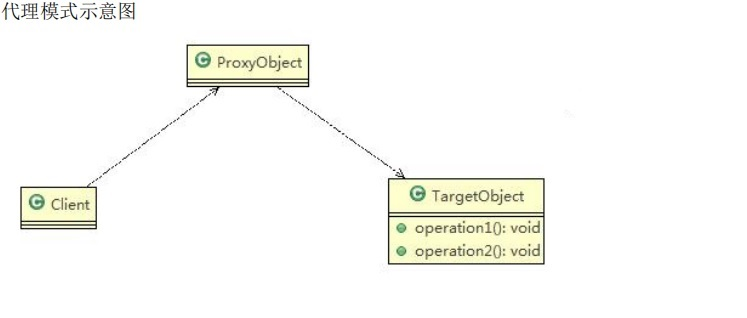
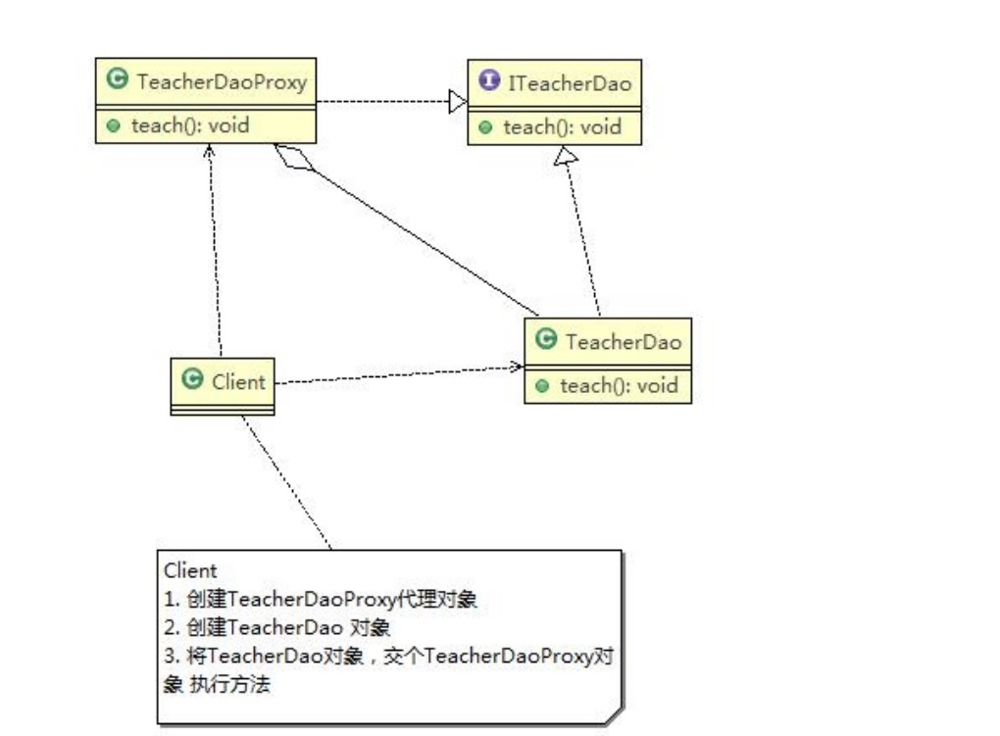
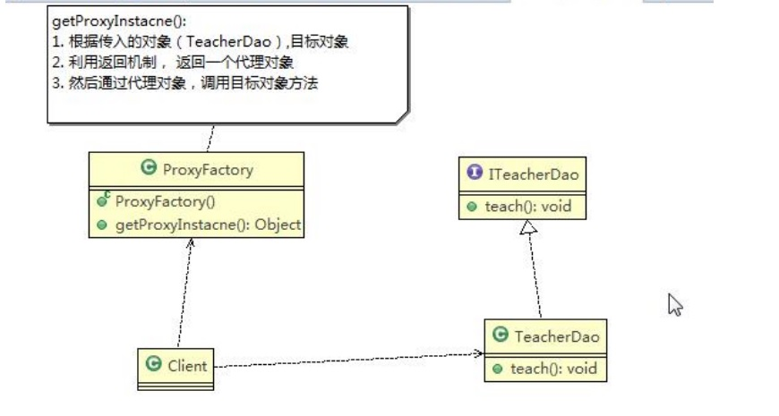

# 代理模式
[[toc]]
## 代理模式的基本介绍

:::tip 代理模式
1. 代理模式：为**一个对象提供一个替身**，以控制对这个对象的访问。即通过代理对象访问目标对象.这样做的好处是:可以在目标对象实现的基础上,增强额外的功能操作,即扩展目标对象的功能。
2. 被代理的对象可以是**远程对象、创建开销大的对象或需要安全控制的对象**
3. 代理模式有不同的形式, 主要有三种 <font color='red'><strong>静态代理、动态代理 (JDK代理、接口代理)和 Cglib代理 (可以在内存动态的创建对象，而不需要实现接口， 他是属于动态代理的范畴)</strong></font>
4. 代理模式原理示意图
<a data-fancybox title="代理模式原理" href="./image/proxy.jpg"></a>
:::

## 静态代理模式

**静态代理在使用时,需要定义接口或者父类,<font color='red'><strong>被代理对象(即目标对象)</strong></font>与<font color='red'><strong>代理对象</strong></font>一起实现相同的接口或者是继承相同父类，<font color='blue'>代理对象通过聚合的方式代理目标对象</font>**

<a data-fancybox title="静态代理模式" href="./image/proxystatic.jpg"></a>

```java
public class Client {
    public static void main(String[] args) {
        //创建目标对象(被代理对象)
        TeacherDao teacherDao=new TeacherDao();
        //创建代理对象, 同时将被代理对象传递给代理对象
        TeacherDaoProxy teacherDaoProxy=new TeacherDaoProxy(teacherDao);
        //通过代理对象，调用到被代理对象的方法
        //即：执行的是代理对象的方法，代理对象再去调用目标对象的方法
        teacherDaoProxy.teach();

    }
}
```
```java
public interface ITeacherDao {
    void teach();
}
public class TeacherDao implements  ITeacherDao{
    @Override
    public void teach() {
        System.out.println(" 老师授课中  。。。。。");
    }
}
public class TeacherDaoProxy implements ITeacherDao{
    TeacherDao teacherDao;

    public TeacherDaoProxy(TeacherDao teacherDao) {
        this.teacherDao = teacherDao;
    }

    @Override
    public void teach() {
        // TODO Auto-generated method stub
        System.out.println("开始代理  完成某些操作。。。。。 ");//方法
        teacherDao.teach();
        System.out.println("结束代理  完成某些操作。。。。。 ");//方法
    }
}
```
:::tip 静态代理优缺点
1. 优点：在不修改目标对象的功能前提下, 能通过代理对象对目标功能扩展
2. 缺点：因为代理对象需要与目标对象实现一样的接口,所以会有很多代理类
3. 一旦接口增加方法,目标对象与代理对象都要维护
:::
## 动态代理模式-JDK

:::tip 动态代理模式的基本介绍
1. 代理对象不需要实现接口，但是**目标对象要实现接口**，否则不能用动态代理
2. 代理对象的生成，是利用JDK的API，动态的在内存中构建代理对象;代理类所在包:**java.lang.reflect.Proxy**JDK实现代理只需要使用**newProxyInstance**方法,但是该方法需要接收三个参数,完整的写法是:**static Object newProxyInstance(ClassLoader loader, Class<?>[] interfaces,InvocationHandler h)**
3. 动态代理也叫做：**JDK代理、接口代理**
:::

<a data-fancybox title="动态代理模式" href="./image/proxydynamic.jpg"></a>

```java
public class Client {
    public static void main(String[] args) throws Exception {
        //创建目标对象
        Class clazz = Class.forName("com.tqk.proxy.dynamic.TeacherDao");
        ITeacherDao target = (ITeacherDao) clazz.newInstance();
        //给目标对象，创建代理对象, 可以转成 ITeacherDao
//        ITeacherDao teacherDao = (ITeacherDao)new ProxyFactory2(target).getProxyInstance();
        ITeacherDao teacherDao = (ITeacherDao)new ProxyFactory(target).getProxyInstance(target);

        // proxyInstance=class com.sun.proxy.$Proxy0 内存中动态生成了代理对象
        System.out.println("proxyInstance=" + teacherDao.getClass());

        //通过代理对象，调用目标对象的方法
        teacherDao.teach();
        teacherDao.sayHello("tom");
    }
}
```
```java

public class ProxyFactory2 {
    private static Object object;
    public ProxyFactory2(Object object) {
        this.object = object;
    }

    public ProxyFactory2() {
    }

    public static Object getProxyInstance(){//被代理类
        Object result= Proxy.newProxyInstance(object.getClass().getClassLoader(),object.getClass().getInterfaces(), new InvocationHandler() {
            @Override
            public Object invoke(Object proxy, Method method, Object[] args) throws Throwable {
                System.out.println("JDK代理开始~~");
                //反射机制调用目标对象的方法
                Object returnVal = method.invoke(object, args);
                System.out.println("JDK代理提交");
                return returnVal;
            }
        });
        return result;
    }
}
```

```java
//接口
public interface ITeacherDao {

	void teach(); // 授课方法
	void sayHello(String name);
}
public class TeacherDao implements  ITeacherDao{
    @Override
    public void teach() {
        System.out.println("老师授课中。。。");
    }

    @Override
    public void sayHello(String name) {
        System.out.println("hello "+name);
    }
}
```

## 动态代理模式-cglib

:::tip Cglib代理模式的基本介绍
1. 静态代理和JDK代理模式都要求目标对象是实现一个接口,但是有时候目标对象只是一个单独的对象,并没有实现任何的接口,这个时候可使用目标对象子类来实现代理-这就是Cglib代理
2. Cglib代理也叫作子类代理,它是在内存中构建一个子类对象从而实现对目标对象功能扩展, 有些书也将Cglib代理归属到动态代理。
3. Cglib是一个强大的高性能的代码生成包,它可以在运行期扩展java类与实现java接口.它广泛的被许多AOP的框架使用,例如Spring AOP，实现方法拦截
4. 在AOP编程中如何选择代理模式：
    - 1. 目标对象需要实现接口，用JDK代理  
    - 2. 目标对象不需要实现接口，用Cglib代理
5. Cglib包的底层是通过使用<font color='red'><strong>字节码处理框架ASM来转换字节码并生成新的类</strong></font>
:::

#### rpc框架的远程调用使用的是代理模式