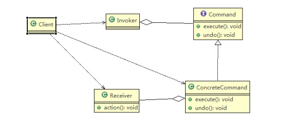
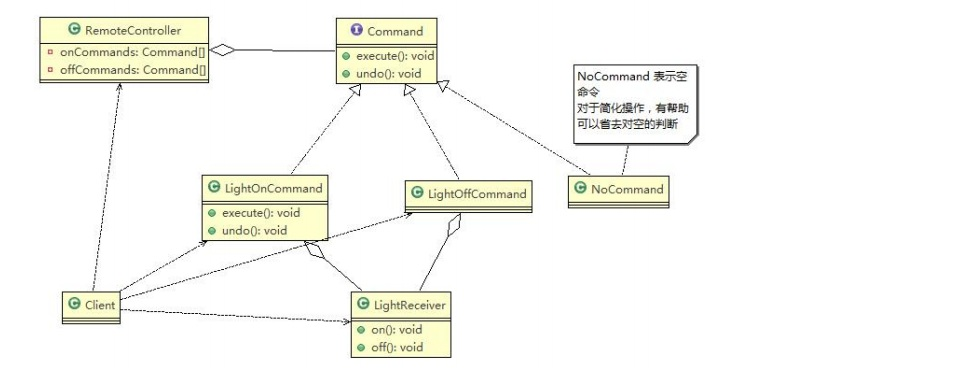
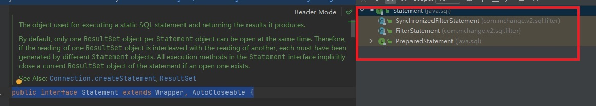

# 命令模式
[[toc]]
## 命令模式基本介绍

:::tip 基本介绍
1. **命令模式（Command Pattern）**：在软件设计中，我们经常需要向某些对象发送请求，但是并不知道请求的接收者是谁，也不知道被请求的操作是哪个，我们只需在程序运行时指定具体的请求接收者即可，此时，可以使用命令模式来进行设计
2. 命名模式使得请求发送者与请求接收者消除彼此之间的耦合，让对象之间的调用关系更加灵活，实现解耦。
3. 在命名模式中，会将一个请求封装为一个对象，以便使用不同参数来表示不同的请求(即命名)，同时命令模式也支持可撤销的操作
4. 通俗易懂的理解：将军发布命令，士兵去执行。其中有几个角色： 将军（命令发布者）、士兵（命令的具体执行者）、命令(连接将军和士兵)。Invoker是调用者（将军），Receiver是被调用者（士兵），ConcreteCommand是命令，实现了Command接口，持有接收对象
:::

<a data-fancybox title="命令模式原理类图" href="./image/command.jpg"></a>

:::tip 命名模式的角色及职责
1. Invoker 是调用者角色
2. Command: 是命令角色，需要执行的所有命令都在这里，可以是接口或抽象类
3. Receiver: 接受者角色，知道如何实施和执行一个请求相关的操作
4. ConcreteCommand: 将一个接受者Receiver对象与一个动作绑定，调用接受者相应的操作，实现execute
:::

## 命令模式应用实例

<a data-fancybox title="命令模式应用实例" href="./image/command2.jpg"></a>


```java
public class Client {
    public static void main(String[] args) {
        // TODO Auto-generated method stub

        //使用命令设计模式，完成通过遥控器，对电灯的操作

        //创建电灯的对象(接受者)
        LightReceiver lightReceiver = new LightReceiver();

        //创建电灯相关的开关命令
        LightOnCommand lightOnCommand = new LightOnCommand(lightReceiver);
        LightOffCommand lightOffCommand = new LightOffCommand(lightReceiver);

        //需要一个遥控器
        RemoteController remoteController = new RemoteController();

        //给我们的遥控器设置命令, 比如 no = 0 是电灯的开和关的操作
        remoteController.setCommand(0, lightOnCommand, lightOffCommand);

        System.out.println("--------按下灯的开按钮-----------");
        remoteController.onButtonWasPushed(0);
        System.out.println("--------按下灯的关按钮-----------");
        remoteController.offButtonWasPushed(0);
        System.out.println("--------按下撤销按钮-----------");
        remoteController.undoButtonWasPushed();


        System.out.println("=========使用遥控器操作电视机==========");

        TVReceiver tvReceiver = new TVReceiver();

        TVOffCommand tvOffCommand = new TVOffCommand(tvReceiver);
        TVOnCommand tvOnCommand = new TVOnCommand(tvReceiver);

        //给我们的遥控器设置命令, 比如 no = 1 是电视机的开和关的操作
        remoteController.setCommand(1, tvOnCommand, tvOffCommand);

        System.out.println("--------按下电视机的开按钮-----------");
        remoteController.onButtonWasPushed(1);
        System.out.println("--------按下电视机的关按钮-----------");
        remoteController.offButtonWasPushed(1);
        System.out.println("--------按下撤销按钮-----------");
        remoteController.undoButtonWasPushed();
    }
}

```

```java
public class RemoteController {
    // 开 按钮的命令数组
    Command[] onCommands;
    Command[] offCommands;

    // 执行撤销的命令
    Command undoCommand;

    // 构造器，完成对按钮初始化

    public RemoteController() {

        onCommands = new Command[5];
        offCommands = new Command[5];

        for (int i = 0; i < 5; i++) {
            onCommands[i] = new NoCommand();
            offCommands[i] = new NoCommand();
        }
    }

    // 给我们的按钮设置你需要的命令
    public void setCommand(int no, Command onCommand, Command offCommand) {
        onCommands[no] = onCommand;
        offCommands[no] = offCommand;
    }

    // 按下开按钮
    public void onButtonWasPushed(int no) { // no 0
        // 找到你按下的开的按钮， 并调用对应方法
        onCommands[no].execute();
        // 记录这次的操作，用于撤销
        undoCommand = onCommands[no];

    }

    // 按下开按钮
    public void offButtonWasPushed(int no) { // no 0
        // 找到你按下的关的按钮， 并调用对应方法
        offCommands[no].execute();
        // 记录这次的操作，用于撤销
        undoCommand = offCommands[no];

    }

    // 按下撤销按钮
    public void undoButtonWasPushed() {
        undoCommand.undo();
    }
}
```

```java
// Command: 是命令角色
public interface  Command {
    //执行动作(操作)
    public void execute();
    //撤销动作(操作)
    public void undo();
}

```

```java
// ConcreteCommand
/**
 * 没有任何命令，即空执行: 用于初始化每个按钮, 当调用空命令时，对象什么都不做
 * 其实，这样是一种设计模式, 可以省掉对空判断
 */
public class NoCommand implements  Command{
    @Override
    public void execute() {

    }

    @Override
    public void undo() {

    }
}

public class LightOffCommand implements Command{

    LightReceiver light;
    // 构造器
    public LightOffCommand(LightReceiver light) {
        super();
        this.light = light;
    }
    @Override
    public void execute() {
        light.off();
    }

    @Override
    public void undo() {
        light.on();
    }
}

public class LightOnCommand  implements Command{
    LightReceiver lightReceiver;

    public LightOnCommand(LightReceiver lightReceiver) {
        this.lightReceiver = lightReceiver;
    }

    @Override
    public void execute() {
        lightReceiver.on();
    }

    @Override
    public void undo() {
        lightReceiver.off();
    }
}

public class TVOffCommand implements Command{
    TVReceiver tvReceiver;

    public TVOffCommand(TVReceiver tvReceiver) {
        this.tvReceiver = tvReceiver;
    }

    @Override
    public void execute() {
        tvReceiver.off();
    }

    @Override
    public void undo() {
        tvReceiver.on();
    }
}

public class TVOnCommand implements Command{
    TVReceiver tvReceiver;

    public TVOnCommand(TVReceiver tvReceiver) {
        this.tvReceiver = tvReceiver;
    }

    @Override
    public void execute() {
        tvReceiver.on();
    }

    @Override
    public void undo() {
        tvReceiver.off();
    }
}
```

```java
//Receiver: 接受者角色
public class LightReceiver {
    public void on() {
        System.out.println(" 电灯打开了.. ");
    }

    public void off() {
        System.out.println(" 电灯关闭了.. ");
    }
}

public class TVReceiver
{
    public void on() {
        System.out.println(" 电视机打开了.. ");
    }

    public void off() {
        System.out.println(" 电视机关闭了.. ");
    }
}
```

## 命令模式在Spring框架JdbcTemplate应用的源码分析


```java
// 调用者
public class JdbcTemplate extends JdbcAccessor	implements JdbcOperations {
public <T> List<T> query(String sql, RowMapper<T> rowMapper) throws DataAccessException {
    return query(sql, new RowMapperResultSetExtractor<T>(rowMapper));
}
//  StatementCallback ->命令接口(Command)
public <T> T execute(StatementCallback<T> action) throws DataAccessException {
//..
T result = action.doInStatement(stmtToUse); handleWarnings(stmt);
//...
}
// 命令接口(Command)
@Override
public interface StatementCallback<T> {
    T doInStatement(Statement stmt) throws SQLException, DataAccessException;
}


public <T> T query(final String sql, final ResultSetExtractor<T> rse) throws DataAccessException {
    //.. QueryStatementCallback-> 命令接收者
    class QueryStatementCallback implements StatementCallback<T>, SqlProvider { @Override
    public T doInStatement(Statement stmt) throws SQLException {
    //....}
    }
    return execute(new QueryStatementCallback());
}


public interface Statement extends Wrapper, AutoCloseable 

```
<a data-fancybox title="命令模式在Spring框架JdbcTemplate应用的源码分析" href="./image/command3.jpg"></a>

::: tip 模式角色分析说明
1. StatementCallback 接口 ,类似命令接口(Command)
2. class QueryStatementCallback implements StatementCallback&lt;T&gt;, SqlProvider , 匿名内部类， 实现了命令接口， 同时也充当命令接收者
3. 命令调用者是 JdbcTemplate , 其中execute(StatementCallback&lt;T&gt; action) 方法中，调用action.doInStatement 方法. 不同的实现 StatementCallback 接口的对象，对应不同的doInStatemnt 实现逻辑
4. 另外实现 StatementCallback 命令接口的子类还有 QueryStatementCallback、
:::