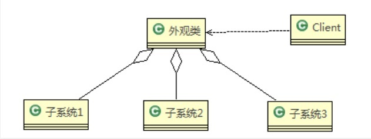
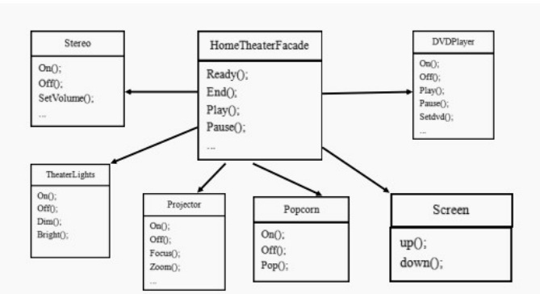
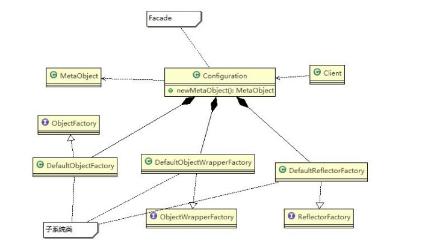

# 外观模式

## 外观模式基本介绍

:::tip 基本介绍
1. 外观模式（Facade），也叫“过程模式：外观模式为子系统中的一组接口提供一个一致的界面，此模式定义了一个高层接口，这个接口使得这一子系统更加容易使用
2. 外观模式通过定义一个一致的接口，用以屏蔽内部子系统的细节，使得调用端只需跟这个接口发生调用，而无需关心这个子系统的内部细节
:::

## 外观模式原理以及应用实例

<a data-fancybox title="外观模式" href="./image/facade.jpg"></a>


:::tip 原理类图的说明(外观模式的角色)
1. 外观类(Facade): 为调用端提供统一的调用接口, 外观类知道哪些子系统负责处理请求,从而将调用端的请求代理给适当子系统对象
2. 调用者(Client): 外观接口的调用者
3. 子系统的集合：指模块或者子系统，处理Facade 对象指派的任务，他是功能的实际提供者
:::

<a data-fancybox title="外观模式" href="./image/facade2.jpg"></a>

```java
public class Client {

	public static void main(String[] args) {
		// TODO Auto-generated method stub
		//这里直接调用。。 很麻烦
		HomeTheaterFacade homeTheaterFacade = new HomeTheaterFacade();
		homeTheaterFacade.ready();
		homeTheaterFacade.play();
		
		
		homeTheaterFacade.end();
	}

}
```

```java
package com.tqk.facade;

public class HomeTheaterFacade {
	
	//定义各个子系统对象
	private TheaterLight theaterLight;
//	private Popcorn popcorn;
	private Stereo stereo;
	private Projector projector;
	private Screen screen;
	private DVDPlayer dVDPlayer;
	
	
	//构造器
	public HomeTheaterFacade() {
		super();
		this.theaterLight = TheaterLight.getInstance();
//		this.popcorn = Popcorn.getInstance();
		this.stereo = Stereo.getInstance();
		this.projector = Projector.getInstance();
		this.screen = Screen.getInstance();
		this.dVDPlayer = DVDPlayer.getInstanc();
	}

	//操作分成 4 步
	
	public void ready() {
//		popcorn.on();
//		popcorn.pop();
		screen.down();
		projector.on();
		stereo.on();
		dVDPlayer.on();
		theaterLight.dim();
	}
	
	public void play() {
		dVDPlayer.play();
	}
	
	public void pause() {
		dVDPlayer.pause();
	}
	
	public void end() {
//		popcorn.off();
		theaterLight.bright();
		screen.up();
		projector.off();
		stereo.off();
		dVDPlayer.off();
	}

}
```

```java
public class DVDPlayer {
	
	//使用单例模式, 使用饿汉式
	private static DVDPlayer instance = new DVDPlayer();
	
	public static DVDPlayer getInstanc() {
		return instance;
	}
	
	public void on() {
		System.out.println(" dvd 开 ");
	}
	public void off() {
		System.out.println(" dvd 关 ");
	}
	
	public void play() {
		System.out.println(" dvd is 播放中 ");
	}
	
	//....
	public void pause() {
		System.out.println(" dvd 暂停 ..");
	}
}

public class Projector {

	private static Projector instance = new Projector();
	
	public static Projector getInstance() {
		return instance;
	}
	
	public void on() {
		System.out.println(" Projector 投影仪 on ");
	}
	
	public void off() {
		System.out.println(" Projector 投影仪 ff ");
	}
	
	public void focus() {
		System.out.println(" Projector 投影仪 is Projector  ");
	}
	
	//...
}
public class Screen {

	private Screen() {
	}

	private  static class  ScreenIN{
		private static Screen instance = new Screen();
	}
	
	public static Screen getInstance() {
		return ScreenIN.instance;
	}
	public void up() {
		System.out.println(" Screen up ");
	}
	
	public void down() {
		System.out.println(" Screen down ");
	}
}

public class TheaterLight {

	private static TheaterLight instance = new TheaterLight();

	public static TheaterLight getInstance() {
		return instance;
	}

	public void on() {
		System.out.println(" TheaterLight on ");
	}

	public void off() {
		System.out.println(" TheaterLight off ");
	}

	public void dim() {
		System.out.println(" TheaterLight dim.. ");
	}

	public void bright() {
		System.out.println(" TheaterLight bright.. ");
	}
}

public class Stereo {
	private Stereo() {
	}
	private static class  StereoIN{
		private static Stereo instance = new Stereo();
	}
	
	public static Stereo getInstance() {
		return StereoIN.instance;
	}
	
	public void on() {
		System.out.println(" Stereo音箱 on ");
	}
	
	public void off() {
		System.out.println(" Stereo音箱 off ");
	}
	
	public void up() {
		System.out.println(" Stereo音箱 up.. ");
	}
	
	//...
}
```

## 外观模式在MyBatis框架应用的源码分析

```java
public class Configuration {
	protected ReflectorFactory reflectorFactory = new DefaultReflectorFactory();
	protected ObjectFactory objectFactory = new DefaultObjectFactory();
	protected ObjectWrapperFactory objectWrapperFactory =
	new DefaultObjectWrapperFactory();
	public MetaObject newMetaObject(Object object) { 
		return MetaObject.forObject(object, objectFactory, objectWrapperFactory, reflectorFactory);
	}
}
```

```java
public class MetaObject{
	private MetaObject(Object object, ObjectFactory objectFactory, O
	this.originalObject = object;
	this.objectFactory = objectFactory;	2
	this.objectWrapperFactory = objectWrapperFactory;
	this.reflectorFactory = reflectorFactory; 

	if (object instanceof ObjectWrapper) {
		this.objectWrapper = (ObjectWrapper) object;
	} 
	else if (objectWrapperFactory.hasWrapperFor(object)) {
		this.objectWrapper = objectWrapperFactory.getWrapperFor(thi
	} 
	else if (object instanceof Map) {
		this.objectWrapper = new MapWrapper(this, (Map) object);
	} 
	else if (object instanceof Collection) {
		this.objectWrapper = new CollectionWrapper(this, (Collection)
	} 
	else {
		this.objectWrapper = new BeanWrapper(this, object);
	}
}
```

<a data-fancybox title="外观模式" href="./image/facadeMybatis.jpg"></a>