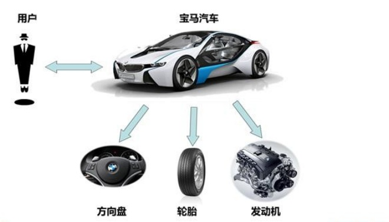

# 建造者模式

## 建造者模式概念

1. **建造者模式（Builder Pattern）** 又叫生成器模式，是一种对象构建模式。它可以将复杂对象的建造过程抽象出来（抽象类别），使这个抽象过程的不同实现方法可以构造出不同表现（属性）的对象  

2. 建造者模式是一步一步创建一个复杂的对象，它允许用户只通过指定复杂对象的类型和内容就可以构建它们，用户不需要知道内部的具体构建细节  


<a data-fancybox title="建造者模式" href="./image/builderPattern.jpg"></a>


## 建造者模式的四个角色以及实际实例
::: warning 建造者模式的四个角色
1. <font color='red'><strong>Product（产品角色）</strong></font>： 一个具体的产品对象。
2. <font color='red'><strong>Builder（抽象建造者）</strong></font>： 创建一个Product对象的各个部件指定的 接口/抽象类。
3. <font color='red'><strong>ConcreteBuilder（具体建造者）</strong></font>： 实现接口，构建和装配各个部件。
4. <font color='red'><strong>Director（指挥者）</strong></font>： 构建一个使用Builder接口的对象。它主要是用于创建一个复杂的对象。  
**它主要有两个作用，一是：隔离了客户与对象的生产过程，二是： 负责控制产品对象的生产过程**
:::

<font color='red'><strong>Product（产品角色）</strong></font>

```java
public class House {
    private String baise;
    private String wall;
    private String roofed;
    public String getBaise() {
        return baise;
    }
    public void setBaise(String baise) {
        this.baise = baise;
    }
    public String getWall() {
        return wall;
    }
    public void setWall(String wall) {
        this.wall = wall;
    }
    public String getRoofed() {
        return roofed;
    }
    public void setRoofed(String roofed) {
        this.roofed = roofed;
    }

    @Override
    public String toString() {
        return "House{" +
                "baise='" + baise + '\'' +
                ", wall='" + wall + '\'' +
                ", roofed='" + roofed + '\'' +
                '}';
    }
}
```

<font color='red'><strong>Builder（抽象建造者）</strong></font>

```java
public abstract class HouseBuilder {
    protected House house = new House();

    public House getHouse() {
        return house;
    }

    public void setHouse(House house) {
        this.house = house;
    }

    //打地基
    public abstract void buildBasic(String basic);
    //砌墙
    public abstract void buildWalls(String wall);
    //封顶
    public abstract void roofed(String roof);

    //建造房子好， 将产品(房子) 返回
    public House buildHouse() {
        return house;
    }
}
```
<font color='red'><strong>ConcreteBuilder（具体建造者）</strong></font>

```java
public class HighBuilding extends HouseBuilder {
    @Override
    public void buildBasic(String basic) {
        System.out.println("高楼大厦打地基");
        house.setBaise(basic);
    }

    @Override
    public void buildWalls(String wall) {
        System.out.println("高楼大厦砌墙");
        house.setWall(wall);
    }

    @Override
    public void roofed(String roof) {
        System.out.println("高楼大厦封顶");
        house.setRoofed(roof);
    }
}
```

<font color='red'><strong>Director（指挥者）</strong></font>

```java
//指挥者，这里去指定制作流程，返回产品
public class HouseDirector {
    HouseBuilder houseBuilder = null;

    //构造器传入 houseBuilder
    public HouseDirector(HouseBuilder houseBuilder) {
        this.houseBuilder = houseBuilder;
    }

    //通过setter 传入 houseBuilder
    public void setHouseBuilder(HouseBuilder houseBuilder) {
        this.houseBuilder = houseBuilder;
    }

    //如何处理建造房子的流程，交给指挥者
    public House constructHouse(String basic,String wall,String roof) {
        houseBuilder.buildBasic(basic);
        houseBuilder.buildWalls(wall);
        houseBuilder.roofed(roof);
        return houseBuilder.buildHouse();
    }
}
```
<font color='red'><strong>客户端</strong></font>

```java
public class Client {
    public static void main(String[] args) {
        HouseDirector houseDirector=new HouseDirector(new HighBuilding());
        House house=houseDirector.constructHouse("20m","1000m","2000m^2");
        System.out.println(house.toString());
    }
}
```
<a data-fancybox title="建造者模式" href="./image/builderPattern2.jpg"></a>

## 造者模式在JDK的应用和源码分析

```java
public class Client {
    public static void main(String[] args) {
        StringBuilder str=new StringBuilder("aaaaaaaa");
        System.out.println(str.toString());
    }
}
//StringBuilder 即充当了指挥者角色，同时充当了具体的建造者

//已经是建造者，只是不能实例化
abstract class AbstractStringBuilder implements Appendable, CharSequence {

// 为抽象建造者
public interface Appendable {
    Appendable append(CharSequence csq) throws IOException;
```

:::warning 源码中建造者模式角色分析
1. Appendable 接口定义了多个append方法(抽象方法), 即Appendable 为抽象建造者, 定义了抽象方法
2. AbstractStringBuilder 实现了Appendable 接口方法，这里的AbstractStringBuilder 已经是建造者，只是不能实例化
3. StringBuilder 即充当了指挥者角色，同时充当了具体的建造者，建造方法的实现是由AbstractStringBuilder 完成, 而StringBuilder 继承了AbstractStringBuilder
:::

:::tip 建造者模式的注意事项和细节
1. 客户端(使用程序)<strong>不必知道产品内部组成的细节，将产品本身与产品的创建过程解耦，使得相同的创建过程可以创建不同的产品对象</strong>
2. 每一个具体建造者都相对独立，而与其他的具体建造者无关，因此可以很方便地替换具体建造者或增加新的具体建造者， <strong>用户使用不同的具体建造者即可得到不同的产品对象</strong>
3)可以更加精细地控制产品的创建过程 。将复杂产品的创建步骤分解在不同的方法
中，使得创建过程更加清晰，也更方便使用程序来控制创建过程
4. <strong>增加新的具体建造者无须修改原有类库的代码，指挥者类针对抽象建造者类编程，系统扩展方便，符合 “开闭原则”</strong>
5. 建造者模式所创建的产品一般具有较多的共同点，其组成部分相似，<strong>如果产品之间的差异性很大，则不适合使用建造者模式，因此其使用范围受到一定的限制</strong>。
6. 如果产品的内部变化复杂，可能会导致需要定义很多具体建造者类来实现这种变化， 导致系统变得很庞大，因此在这种情况下，要考虑是否选择建造者模式.
7. 抽象工厂模式VS建造者模式 
抽象工厂模式实现对产品家族的创建，一个产品家族是这样的一系列产品：具有不同分类维度的产品组合，采用抽象工厂模式不需要关心构建过程，只关心什么产品由什么工厂生产即可。而建造者模式则是要求按照指定的蓝图建造产品，它的主要目的是通过组装零配件而产生一个新产品
:::