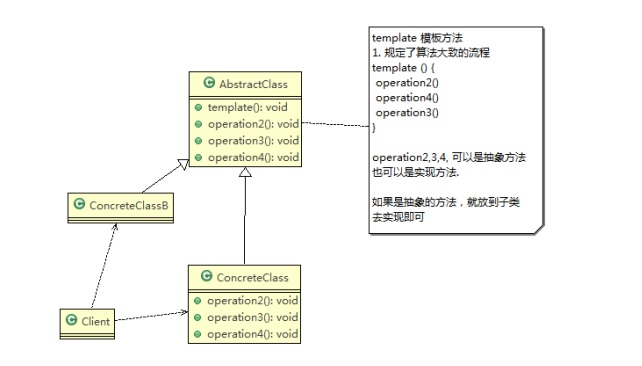
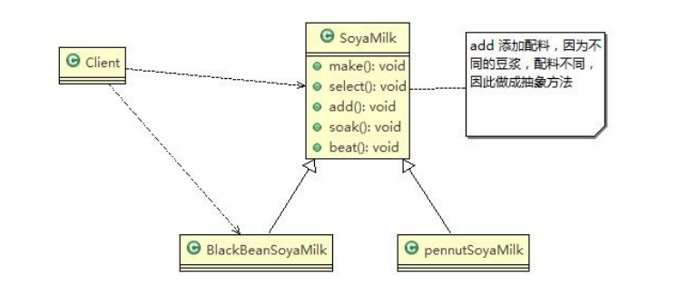
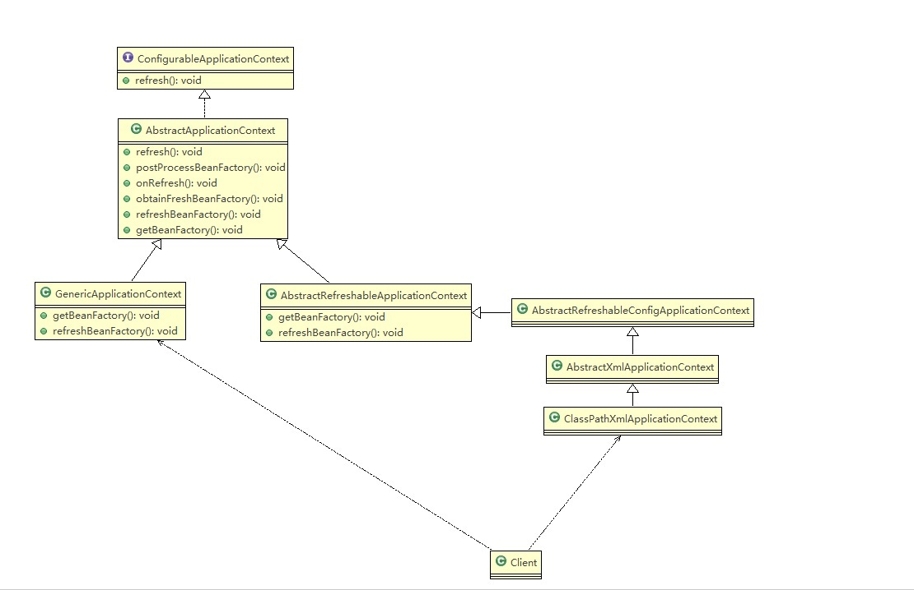

# 模板方法模式
[[toc]]
## 模板方法模式基本介绍

:::tip 基本介绍
1. 模板方法模式（Template Method Pattern），又叫**模板模式(Template Pattern)**，z 在一个抽象类公开定义了执行它的方法的模板。它的子类可以按需要重写方法实现，但调用将以抽象类中定义的方式进行  
2. 简单说，模板方法模式 定义一个操作中的算法的骨架，而将一些步骤延迟到子类中，使得子类可以不改变一个算法的结构，就可以重定义该算法的某些特定步骤  
   这种类型的设计模式属于行为型模式。
:::

<a data-fancybox title="模板方法模式" href="./image/template.jpg"></a>

对原理类图的说明-即(模板方法模式的角色及职责)
1. AbstractClass 抽象类， 类中实现了模板方法(template)，定义了算法的骨架，具体子类需要去实现 其它的抽象方法operationr2,3,4
2. ConcreteClass 实现抽象方法operationr2,3,4, 以完成算法中特点子类的步骤

## 模板方法模式应用实例

:::tip 编写制作豆浆的程序说明如下:
• 制作豆浆的流程 选材--->添加配料--->浸泡--->放到豆浆机打碎  
• 通过添加不同的配料，可以制作出不同口味的豆浆  
• 选材、浸泡和放到豆浆机打碎这几个步骤对于制作每种口味的豆浆都是一样的(红豆、花生豆浆。。。) 
::: 

<a data-fancybox title="模板方法模式应用实例" href="./image/template1.jpg"></a>

```java
public class Client {
    public static void main(String[] args) {
        //制作红豆豆浆
        System.out.println("----制作红豆豆浆----");
        SoyaMilk redBeanSoyaMilk = new RedBeanSoyaMilk();
        redBeanSoyaMilk.make();

        System.out.println("----制作花生豆浆----");
        SoyaMilk peanutSoyaMilk = new PeanutSoyaMilk();
        peanutSoyaMilk.make();

        System.out.println("----制作纯豆浆----");
        SoyaMilk pureSoyaMilk = new PureSoyaMilk();
        pureSoyaMilk.make();
    }
}

public class PeanutSoyaMilk  extends  SoyaMilk{
    @Override
    void addCondiments() {
        System.out.println("添加花生！");
    }
}

public class PureSoyaMilk extends  SoyaMilk{
    //空实现
    @Override
    void addCondiments() {
    }
    //钩子函数也可以不要
    @Override
    boolean customerWantCondiments(){
        return  false;
    }
}
public class RedBeanSoyaMilk extends SoyaMilk{
    @Override
    void addCondiments() {
        System.out.println("第二步，添加红豆");
    }
}
public abstract  class SoyaMilk {

    //模板方法, make , 模板方法可以做成final , 不让子类去覆盖
    final void make(){
        select();
        if(customerWantCondiments()){
            addCondiments();
        }
        soak();
        beat();
    }

    //添加不同的配料，子类实现
    abstract void addCondiments();
    //选材
    void  select(){
        System.out.println("第一步：选择好的新鲜黄豆  ");
    }
    //浸泡
    void  soak(){
        System.out.println("第三步， 黄豆和配料开始浸泡， 需要3小时 ");
    }
    //研磨
    void  beat(){
        System.out.println("第四步：黄豆和配料放到豆浆机去打碎  ");
    }
    //钩子方法，决定是否需要添加配料
    boolean customerWantCondiments(){
        return  true;
    }
}
```
## 模板方法模式的钩子方法
1. 在模板方法模式的父类中，我们可以定义一个方法，它默认不做任何事，子类可以视情况要不要覆盖它，该方法称为<font color='red'><strong>钩子</strong></font>
2. 还是用上面做豆浆的例子来讲解，比如，我们还希望制作纯豆浆，不添加任何的配料，请使用钩子方法对前面的模板方法进行改造

## 模板方法模式在Spring框架应用的源码分析

1. Spring IOC容器初始化时运用到的模板方法模式

<a data-fancybox title="IOC容器初始化时运用到的模板方法模式" href="./image/ioctemplate.jpg"></a>


## 模板方法模式的注意事项和细节

1. 基本思想是：<font color='blue'><strong>算法只存在于一个地方，也就是在父类中</strong></font>，容易修改。需要修改算法时，只要修改父类的模板方法或者已经实现的某些步骤，子类就会继承这些修改
2. **实现了最大化代码复用**。父类的模板方法和已实现的某些步骤会被子类继承而直接使用。
3. 既统一了算法，也提供了很大的灵活性。父类的模板方法确保了算法的结构保持不变，同时由子类提供部分步骤的实现。
4. 该模式的不足之处：每一个不同的实现都需要一个子类实现，导致类的个数增加，使得系统更加庞大
5. 一般模板方法都加上**final关键字**， 防止子类重写模板方法.
6. 模板方法模式使用场景：**当要完成在某个过程，该过程要执行一系列步骤 ，这一系列的步骤基本相同，但其个别步骤在实现时 可能不同，通常考虑用模板方法模式来处理**