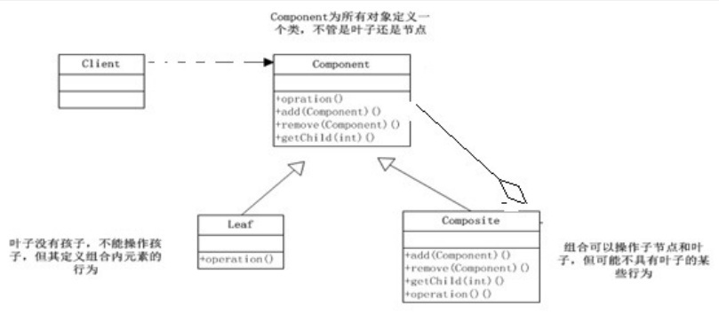
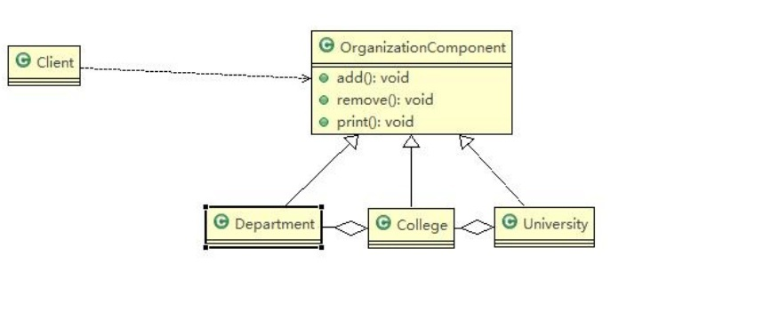
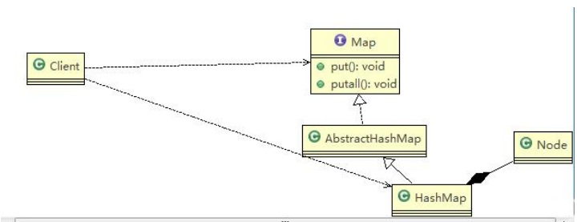

# 组合模式

## 组合模式基本介绍

:::tip 基本介绍
1. 组合模式（Composite Pattern），又叫部分整体模式，它创建了对象组的树形结构，将对象组合成树状结构以表示“整体-部分”的层次关系。
2. 组合模式依据树形结构来组合对象，用来表示部分以及整体层次。
3. 这种类型的设计模式属于结构型模式。
4. 组合模式使得用户对单个对象和组合对象的访问具有一致性，即：组合能让客户以一致的方式处理个别对象以及组合对象
:::

<a data-fancybox title="组合模式" href="./image/composite1.jpg"></a>


**对原理结构图的说明-即(组合模式的角色及职责)**
1. Component :这是组合中对象声明接口，在适当情况下，实现所有类共有的接口默认行为,用于访问和管理Component子部件, Component可以是抽象类或者接口


<a data-fancybox title="组合模式" href="./image/composite.jpg"></a>

```java
//client
public class Client {
    public static void main(String[] args) {

        //从大到小创建对象 学校
        OrganizationComponent university = new University("清华大学", " 中国顶级大学 ");

        //创建 学院
        OrganizationComponent computerCollege = new College("计算机学院", " 计算机学院 ");
        OrganizationComponent infoEngineercollege = new College("信息工程学院", " 信息工程学院 ");

        //创建各个学院下面的系(专业)
        computerCollege.add(new Department("软件工程", " 软件工程不错 "));
        computerCollege.add(new Department("网络工程", " 网络工程不错 "));
        computerCollege.add(new Department("计算机科学与技术", " 计算机科学与技术是老牌的专业 "));

        //
        infoEngineercollege.add(new Department("通信工程", " 通信工程不好学 "));
        infoEngineercollege.add(new Department("信息工程", " 信息工程好学 "));

        //将学院加入到 学校
        university.add(computerCollege);
        university.add(infoEngineercollege);

        //university.print();
        infoEngineercollege.print();
    }
}
```

```java
package com.tqk.composite;

public abstract  class OrganizationComponent {
    private String name; // 名字
    private String des; // 说明

    protected  void add(OrganizationComponent organizationComponent) {
        //默认实现
        throw new UnsupportedOperationException();
    }

    protected  void remove(OrganizationComponent organizationComponent) {
        //默认实现
        throw new UnsupportedOperationException();
    }

    //构造器
    public OrganizationComponent(String name, String des) {
        super();
        this.name = name;
        this.des = des;
    }

    public String getName() {
        return name;
    }

    public void setName(String name) {
        this.name = name;
    }

    public String getDes() {
        return des;
    }

    public void setDes(String des) {
        this.des = des;
    }

    //方法print, 做成抽象的, 子类都需要实现
    protected abstract void print();
}

```

```java
package com.tqk.composite;

import java.util.ArrayList;
import java.util.List;

public class University extends OrganizationComponent{
    List<OrganizationComponent> organizationComponents = new ArrayList<OrganizationComponent>();

    // 构造器
    public University(String name, String des) {
        super(name, des);
        // TODO Auto-generated constructor stub
    }

    // 重写add
    @Override
    protected void add(OrganizationComponent organizationComponent) {
        // TODO Auto-generated method stub
        organizationComponents.add(organizationComponent);
    }

    // 重写remove
    @Override
    protected void remove(OrganizationComponent organizationComponent) {
        // TODO Auto-generated method stub
        organizationComponents.remove(organizationComponent);
    }

    @Override
    public String getName() {
        // TODO Auto-generated method stub
        return super.getName();
    }

    @Override
    public String getDes() {
        // TODO Auto-generated method stub
        return super.getDes();
    }

    // print方法，就是输出University 包含的学院
    @Override
    protected void print() {
        // TODO Auto-generated method stub
        System.out.println("--------------" + getName() + "--------------");
        //遍历 organizationComponents
        for (OrganizationComponent organizationComponent : organizationComponents) {
            organizationComponent.print();
        }
    }
}

```

```java
package com.tqk.composite;

import java.util.ArrayList;
import java.util.List;

public class College extends  OrganizationComponent{

    //List 中 存放的Department
    List<OrganizationComponent> organizationComponents = new ArrayList<OrganizationComponent>();

    // 构造器
    public College(String name, String des) {
        super(name, des);
        // TODO Auto-generated constructor stub
    }

    // 重写add
    @Override
    protected void add(OrganizationComponent organizationComponent) {
        // TODO Auto-generated method stub
        //  将来实际业务中，Colleage 的 add 和  University add 不一定完全一样
        organizationComponents.add(organizationComponent);
    }

    // 重写remove
    @Override
    protected void remove(OrganizationComponent organizationComponent) {
        // TODO Auto-generated method stub
        organizationComponents.remove(organizationComponent);
    }

    @Override
    public String getName() {
        // TODO Auto-generated method stub
        return super.getName();
    }

    @Override
    public String getDes() {
        // TODO Auto-generated method stub
        return super.getDes();
    }

    // print方法，就是输出University 包含的学院
    @Override
    protected void print() {
        // TODO Auto-generated method stub
        System.out.println("--------------" + getName() + "--------------");
        //遍历 organizationComponents
        for (OrganizationComponent organizationComponent : organizationComponents) {
            organizationComponent.print();
        }
    }
}

```

```java
package com.tqk.composite;

public class Department extends OrganizationComponent{
    public Department(String name, String des) {
        super(name, des);
    }

    //add , remove 就不用写了，因为他是叶子节点
    @Override
    public String getName() {
        // TODO Auto-generated method stub
        return super.getName();
    }

    @Override
    public String getDes() {
        // TODO Auto-generated method stub
        return super.getDes();
    }

    @Override
    protected void print() {
        System.out.println(getName() );
    }
}

```

## 组合模式在JDK集合的源码分析

<a data-fancybox title="组合模式" href="./image/composite2.jpg"></a>

```java
import java.util.HashMap;
import java.util.Map;

public class HashMapComp {
    public static void main(String[] args) {
        // TODO Auto-generated method stub
        Map<Integer,String> hashMap=new HashMap<Integer,String>(); 
        hashMap.put(0, "东游记");//直接存放叶子节点Map<Integer,String> map=new HashMap<Integer,String>(); map.put(1, "西游记");
        hashMap.put(2, "红楼梦"); //..
        hashMap.putAll(hashMap); System.out.println(hashMap);
    }
}

//1
public interface Map<K,V> {
//add, remover..
}

//2 
public abstract class AbstractMap<K,V> implements Map<K,V> {}
public class HashMap<K,V> extends AbstractMap<K,V> implements Map<K,V>, Cloneable, Serializable {
}

//3
static class Node<K,V> implements Map.Entry<K,V> {
    final int hash; 
    final K key;
    V value; Node<K,V> next;
}

```
