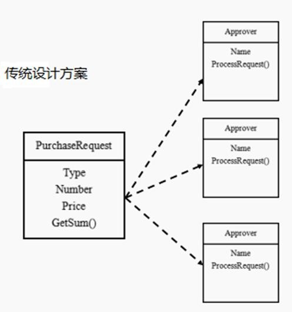
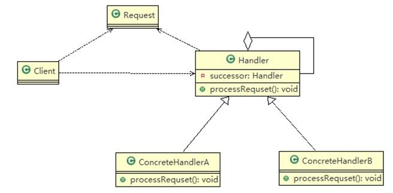
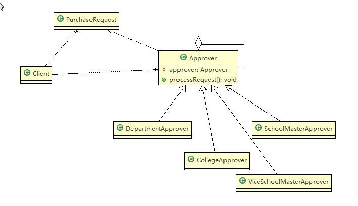

# 职责链模式
## 学校 OA 系统的采购审批项目：
需求是采购员采购教学器材   
1. 如果金额 小于等于 5000, 由教学主任审批 （0<=x<=5000） 
2. 如果金额 小于等于 10000, 由院长审批 (5000<x<=10000) 
3. 如果金额 小于等于 30000, 由副校长审批 (10000<x<=30000) 
4. 如果金额 超过 30000 以上，有校长审批 ( 30000<x) 

## 传统方案解决 OA 系统审批，传统的设计方案(类图)
<a data-fancybox title="职责链模式" href="./image/responsibilitychain.jpg"></a>

## 传统方案解决 OA 系统审批问题分析
1. 传统方式是：接收到一个采购请求后，根据采购金额来调用对应的 Approver (审批人)完成审批。 
2. 传统方式的问题分析 : 客户端这里会使用到 分支判断(比如 switch) 来对不同的采购请求处理， 这样就存在如下问题   
    (1) 如果各个级别的人员审批金额发生变化，在客户端的也需要变化   
    (2) 客户端必须明确的知道有多少个审批级别和访问   
3. 这样 对一个采购请求进行处理 和 Approver (审批人) 就存在强耦合关系，不利于代码的扩展和维护
4. 解决方案 =》 **职责链模式**


## 职责链模式

:::tip 职责链模式基本介绍 
1. 职责链模式（Chain of Responsibility Pattern）, 又叫责任链模式，为请求创建了一个接收者对象的链(简单示意图)。这种模式对请求的发送者和接收者进行解耦。 
2. 职责链模式通常每个接收者都包含对另一个接收者的引用。如果一个对象不能处理该请求，那么它会把相同的请求传给下一个接收者，依此类推。 
3. 这种类型的设计模式属于行为型模式
:::

<a data-fancybox title="职责链模式" href="./image/responsibilitychain01.jpg"></a>
:::tip 对原理类图的说明-即(职责链模式的角色及职责) 
1. Handler : 抽象的处理者, 定义了一个处理请求的接口, 同时含义另外Handler   
2. ConcreteHandlerA , B ：是具体的处理者, 处理它自己负责的请求， 可以访问它的后继者(即下一个处理者), 如果 可以处理当前请求则处理；否则就将该请求交个后继者去处理，从而形成一个职责链   
3. Request ：含义很多属性，表示一个请求  
:::

### 职责链模式解决 OA 系统采购审批

<a data-fancybox title="职责链模式" href="./image/responsibilitychain02.jpg"></a>

```java
package com.tqk.responsibilitychain;

public class Client {

	public static void main(String[] args) {
		// TODO Auto-generated method stub
		//创建一个请求
		PurchaseRequest purchaseRequest = new PurchaseRequest(1, 31000, 1);

		//创建相关的审批人
		DepartmentApprover departmentApprover = new DepartmentApprover("张主任");
		CollegeApprover collegeApprover = new CollegeApprover("李院长");
		ViceSchoolMasterApprover viceSchoolMasterApprover = new ViceSchoolMasterApprover("王副校");
		SchoolMasterApprover schoolMasterApprover = new SchoolMasterApprover("佟校长");


		//需要将各个审批级别的下一个设置好 (处理人构成环形: )
		departmentApprover.setApprover(collegeApprover);
		collegeApprover.setApprover(viceSchoolMasterApprover);
		viceSchoolMasterApprover.setApprover(schoolMasterApprover);
		schoolMasterApprover.setApprover(departmentApprover);


		departmentApprover.processRequest(purchaseRequest);
//		viceSchoolMasterApprover.processRequest(purchaseRequest);
	}

}
```
```java
package com.tqk.responsibilitychain;

public abstract class Approver {

	Approver approver;  //下一个处理者
	String name; // 名字

	public Approver(String name) {
		// TODO Auto-generated constructor stub
		this.name = name;
	}

	//下一个处理者
	public void setApprover(Approver approver) {
		this.approver = approver;
	}

	//处理审批请求的方法，得到一个请求, 处理是子类完成，因此该方法做成抽象
	public abstract void processRequest(PurchaseRequest purchaseRequest);

}
```

```java
package com.tqk.responsibilitychain;

public class SchoolMasterApprover extends Approver {

	public SchoolMasterApprover(String name) {
		// TODO Auto-generated constructor stub
		super(name);
	}

	@Override
	public void processRequest(PurchaseRequest purchaseRequest) {
		// TODO Auto-generated method stub
		if(purchaseRequest.getPrice() > 30000) {
			System.out.println(" 请求编号 id= " + purchaseRequest.getId() + " 被 " + this.name + " 处理");
		}else {
			approver.processRequest(purchaseRequest);
		}
	}
}
```
