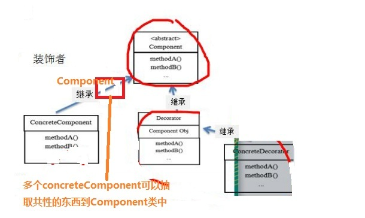
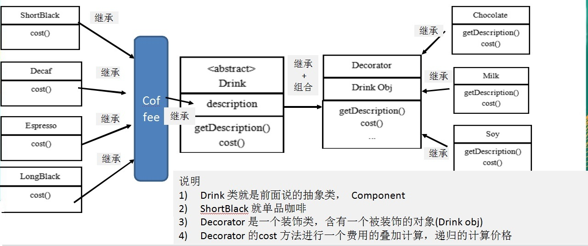
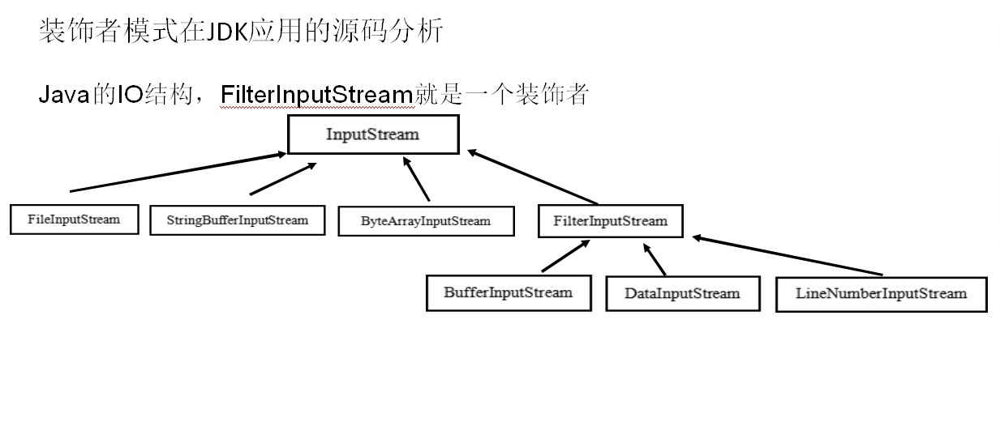

# 装饰者模式

## 装饰者模式定义

:::tip 装饰者模式定义
1. 装饰者模式：**动态**的将**新功能附加到对象**上。在对象功能扩展方面，它比继承更有弹性，装饰者模式也体现了**开闭原则(ocp)**
2. 这里提到的动态的将新功能附加到对象和ocp原则，在后面的应用实例上会以代码的形式体现。
:::

## 装饰者模式(Decorator)原理


:::warning 装饰者模式原理
1. 装饰者模式就像打包一个快递  
　▶主体：比如：陶瓷、衣服<font color='red'><strong>Component 被装饰者</strong></font>  
　▶包装：比如：报纸填充、塑料泡沫、纸板、木板<font color='red'><strong>Decorator</strong></font>   
2. Component :**主体：比如类似前面的Drink**
3. ConcreteComponent 和 Decorator   
   ▶ConcreteComponent：<font color='red'><strong>具体的主体</strong></font>， 比如前面的各个单品咖啡  
   ▶Decorator: 装饰者，比如各调料.  
4. 在如图的Component与ConcreteComponent之间，如果ConcreteComponent类很多,还可以设计一个缓冲层，将共有的部分提取出来， 抽象层一个类。
:::

<a data-fancybox title="装饰者模式(Decorator)原理" href="./image/Component1.jpg"></a>

## 装饰者模式解决星巴克咖啡订单

<a data-fancybox title="装饰者模式解决星巴克咖啡订单" href="./image/Component2.jpg"></a>

```java
//Client
public class CoffeeBar {
    public static void main(String[] args) {
        Drink order =new LongBlack();
        System.out.println("价格："+order.cost());
        System.out.println("描述: "+order.getDes());

        order =new Milk(order);
        System.out.println("价格："+order.cost());
        System.out.println("描述: "+order.getDes());

        order =new Chocolate(order);
        System.out.println("价格："+order.cost());
        System.out.println("描述: "+order.getDes());

    }
}
```

```java
//被装饰的抽象类
public  abstract  class Drink {
    public  String Des;
    public  Double  price=0.00D;

    public String getDes() {
        return Des;
    }

    public void setDes(String des) {
        Des = des;
    }

    public Double getPrice() {
        return price;
    }

    public void setPrice(Double price) {
        this.price = price;
    }

    public Drink() {
    }

    public Drink(String des, Double price) {
        Des = des;
        this.price = price;
    }

    //计算费用的抽象方法
    //子类来实现
    public abstract Double cost();

}
```

```java
// 装饰类
public class Decorator extends  Drink{
    //被装饰者
    private Drink drink;

    public Decorator(Drink drink) {
        this.drink=drink;
    }

    @Override
    public String getDes() {
        // TODO Auto-generated method stub
        // obj.getDes() 输出被装饰者的信息
        return Des + " " + getPrice() + " && " + drink.getDes();
    }

    @Override
    public Double cost() {
        return  super.getPrice() + drink.cost();
    }
}

```

```java
//具体装饰类
public class Chocolate extends  Decorator{

    public Chocolate(Drink drink) {
        super(drink);
        setDes(" 巧克力 ");
        setPrice(3.00D);
    }
}
public class Milk extends  Decorator{

    public Milk(Drink drink) {
        super(drink);
        setDes(" 牛奶 ");
        setPrice(2.00D);
    }
}

```

```java
//具体被装饰类
class LongBlack extends Coffee{
    public  LongBlack() {
        setDes("黑咖啡");
        setPrice(5.00D);
    }
}
public class DeCaf  extends  Coffee{
    public  DeCaf() {
        setDes(" 无因咖啡 ");
        setPrice(1.00D);
    }
}

```

## 装饰者模式在JDK应用的源码分析

<a data-fancybox title="装饰者模式在JDK应用的源码分析" href="./image/DecoratorComponent.jpg"></a>

```java
public abstract class InputStream implements Closeable{} //是一个抽象类，即Component 被装饰者类
public class FilterInputStream extends InputStream { //是一个装饰者类Decorator
protected volatile InputStream in //被装饰的对象 }
class DataInputStream extends FilterInputStream implements DataInput { //FilterInputStream 子类
```

```java
import java.io.DatalnputStream;
import java.io.FileInputStream;
import java.io.InputStream;
public class Decorator{
    public static void main(Stringl]args)throws Exception{
    //TODO Auto-generated method stub
    //说明
    //1．InputStream 是抽象类，类似我们前面讲的 Drink
    //2．FileInputStream 是 InputStream 子类，类似我们前面的 DeCaf，LongBlack
    //3．FilterInputStream 是 InputStream 子类：类似我们前面的 Decorator 修饰者
    //4．DatalnputStream 是 FilterInputStream 子类，具体的修饰者，类似前面的 Milk，Soy等
    //5．FilterInputStream 类有 protected volatile InputStream in；即含被装饰者
    //6．分析得出在jdk 的io体系中，就是使用装饰者模式
    DatalnputStream dis = new DatalnputStream(new FileInputStream("d:\\labc.txt");
    System.out.println(dis.read());
    dis.close();
    }
}