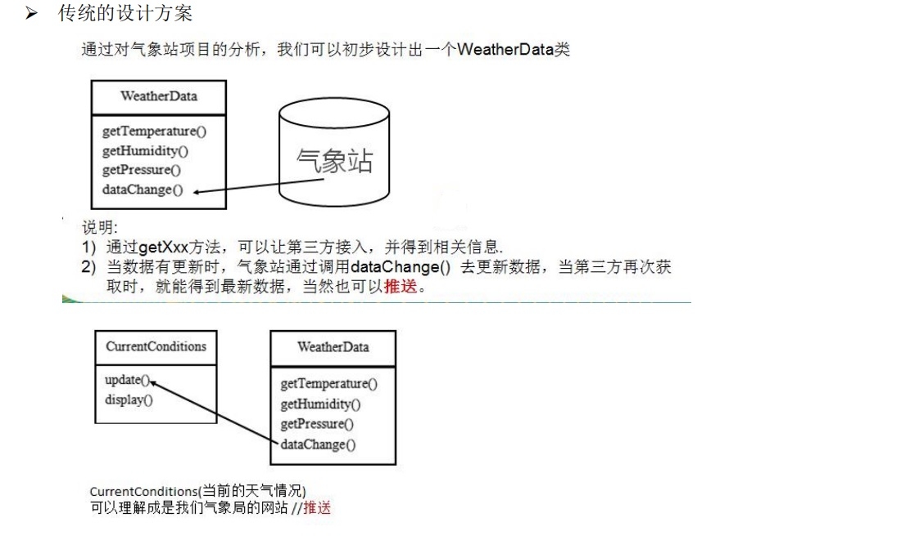
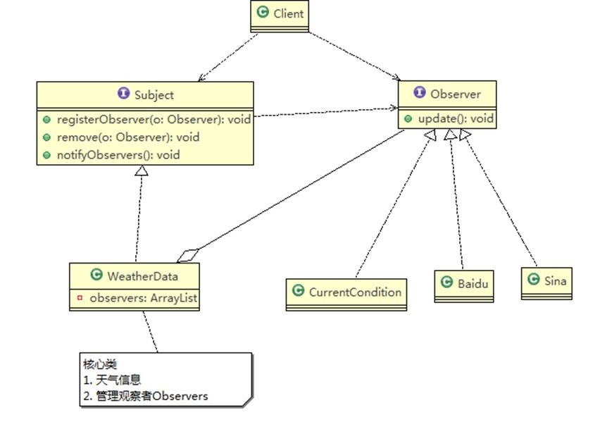

# 观察者模式

## 天气预报设计方案 1-普通方案

<a data-fancybox title="观察者模式" href="./image/improve.jpg"></a>

```java
package com.tqk.observer;

public class Client {
    public static void main(String[] args) {
        WeatherData weatherData = new WeatherData(new CurrentConditions());
        weatherData.setData(30,20,50);

    }
}
```

```java
package com.tqk.observer;

/**
 * 显示当前天气情况（可以理解成是气象站自己的网站）
 * @author tianqikai
 */
public class CurrentConditions {
    // 温度，气压，湿度
    private float temperature;
    private float pressure;
    private float humidity;
    /**
     *显示当前天气情况（可以理解成是气象站自己的网站）
     * @param temperature
     * @param pressure
     * @param humidity
     */
    public void update(float temperature, float pressure, float humidity) {
        this.temperature = temperature;
        this.pressure = pressure;
        this.humidity = humidity;
        display();
    }
    /**
     * 显示
     */
    public void display() {
        System.out.println("***Today mTemperature: " + temperature + "***");
        System.out.println("***Today mPressure: " + pressure + "***");
        System.out.println("***Today mHumidity: " + humidity + "***");
    }
}

```

```java
package com.tqk.observer;

/**
 * 类是核心
 * 1. 包含最新的天气情况信息 
 * 2. 含有 CurrentConditions 对象
 * 3. 当数据有更新时，就主动的调用   CurrentConditions对象update方法(含 display), 这样他们（接入方）就看到最新的信息
 * @author Administrator
 *
 */
public class WeatherData {
	private float temperatrue;
	private float pressure;
	private float humidity;
	private CurrentConditions currentConditions;
	//加入新的第三方

	public WeatherData(CurrentConditions currentConditions) {
		this.currentConditions = currentConditions;
	}

	public float getTemperature() {
		return temperatrue;
	}

	public float getPressure() {
		return pressure;
	}

	public float getHumidity() {
		return humidity;
	}

	public void dataChange() {
		//调用 接入方的 update
		currentConditions.update(getTemperature(), getPressure(), getHumidity());
	}

	//当数据有更新时，就调用 setData
	public void setData(float temperature, float pressure, float humidity) {
		this.temperatrue = temperature;
		this.pressure = pressure;
		this.humidity = humidity;
		//调用dataChange， 将最新的信息 推送给 接入方 currentConditions
		dataChange();
	}
}
```
:::tip 问题分析 
1. 其他第三方接入气象站获取数据的问题
2. 无法在运行时动态的添加第三方 (新浪网站) 
3. 违反 ocp 原则=>观察者模式 
```java
//在 WeatherData 中，当增加一个第三方，都需要创建一个对应的第三方的公告板对象，并加入到 dataChange, 不利于维护，也不是动态加入 
public void dataChange() { 
    currentConditions.update(getTemperature(), getPressure(), getHumidity()); 
}
```
:::

## 天气预报设计方案--观察者模式

<a data-fancybox title="观察者模式" href="./image/look01.jpg"></a>

:::tip Subject：登记注册、移除和通知 
1. registerObserver 注册 
2. removeObserver 移除 
3. notifyObservers() 通知所有的注册的用户，根据不同需求，可以是更新数据，让用户来取，也可能是实施推送， 看具体需求定 
:::

**Observer：接收输入** 
观察者模式：对象之间多对一依赖的一种设计方案，被依赖的对象为 Subject，依赖的对象为 Observer，Subject 通知 Observer 变化,比如这里的奶站是 Subject，是 1 的一方。用户时 Observer，是多的一方

```java
package com.tqk.observer.improve;

public class Client {
    public static void main(String[] args) {

        WeatherData weatherData = new WeatherData();
        //创建观察者
        CurrentConditions currentConditions = new CurrentConditions();
        BaiduSite baiduSite = new BaiduSite();

        //注册到weatherData
        weatherData.registerObserver(currentConditions);
        weatherData.registerObserver(baiduSite);

        //测试
        System.out.println("通知各个注册的观察者, 看看信息");
        weatherData.setData(10f, 100f, 30.3f);

        weatherData.registerObserver(new SinaSite());
        weatherData.removeObserver(currentConditions);
        //测试
        System.out.println();
        System.out.println("通知各个注册的观察者, 看看信息");
        weatherData.setData(10f, 100f, 30.3f);

    }
}

```

```java
package com.tqk.observer.improve;

public interface Observer {
    public void update(float temperature, float pressure, float humidity);
}

```

```java
package com.tqk.observer.improve;

/**
 * 接口, 让WeatherData 来实现
 */
public interface Subject {
    public void registerObserver(Observer o);
    public void removeObserver(Observer o);
    public void notifyObservers();
}

```

```java
package com.tqk.observer.improve;

import java.util.ArrayList;

/**
 * 类是核心
 * 1. 包含最新的天气情况信息 
 * 2. 含有 CurrentConditions 对象
 * 3. 当数据有更新时，就主动的调用   CurrentConditions对象update方法(含 display), 这样他们（接入方）就看到最新的信息
 * @author Administrator
 *
 */
public class WeatherData implements Subject{
	private float temperatrue;
	private float pressure;
	private float humidity;
	//观察者集合
	private ArrayList<Observer> observers;
	//加入新的第三方


	public WeatherData() {
		observers = new ArrayList<Observer>();
	}

	public WeatherData(ArrayList<Observer> observers) {
		observers = new ArrayList<Observer>();
	}

	public float getTemperature() {
		return temperatrue;
	}

	public float getPressure() {
		return pressure;
	}

	public float getHumidity() {
		return humidity;
	}

	public void dataChange() {
		notifyObservers();
	}

	//当数据有更新时，就调用 setData
	public void setData(float temperature, float pressure, float humidity) {
		this.temperatrue = temperature;
		this.pressure = pressure;
		this.humidity = humidity;
		//调用dataChange， 将最新的信息 推送给 接入方 currentConditions
		dataChange();
	}

	@Override
	public void registerObserver(Observer o) {
		if((observers!=null&&observers.indexOf(o)==-1)||observers==null){
			observers.add(o);
		}else{
			System.out.println("该节点已注册");
		}
		dataChange();
	}

	@Override
	public void removeObserver(Observer o) {
		if(observers.indexOf(o)==-1){
			System.out.println("该节点已注销");
		}else{
			observers.remove(o);
		}
		dataChange();
	}

	@Override
	public void notifyObservers() {
		//调用 接入方的 update
		for (Observer observer: observers) {
			observer.update(getTemperature(), getPressure(), getHumidity());
		}
	}
}

```
```java
package com.tqk.observer.improve;

public class SinaSite implements Observer{
    // 温度，气压，湿度
    private float temperature;
    private float pressure;
    private float humidity;

    /**
     * 新浪显示当前天气情况
     * @param temperature
     * @param pressure
     * @param humidity
     */
    @Override
    public void update(float temperature, float pressure, float humidity) {
        this.temperature = temperature;
        this.pressure = pressure;
        this.humidity = humidity;
        display();
    }
    /**
     * 显示
     */
    public void display() {
        System.out.println("***新浪 mTemperature: " + temperature + "***");
        System.out.println("***新浪 mPressure: " + pressure + "***");
        System.out.println("***新浪 mHumidity: " + humidity + "***");
    }
}

```
```java
package com.tqk.observer.improve;

/**
 * @author tianqikai
 */
public class BaiduSite implements Observer{
    // 温度，气压，湿度
    private float temperature;
    private float pressure;
    private float humidity;

    /**
     * 百度显示当前天气情况
     * @param temperature
     * @param pressure
     * @param humidity
     */
    @Override
    public void update(float temperature, float pressure, float humidity) {
        this.temperature = temperature;
        this.pressure = pressure;
        this.humidity = humidity;
        display();
    }
    /**
     * 显示
     */
    public void display() {
        System.out.println("***Baidu mTemperature: " + temperature + "***");
        System.out.println("***Baidu mPressure: " + pressure + "***");
        System.out.println("***Baidu mHumidity: " + humidity + "***");
    }
}

```