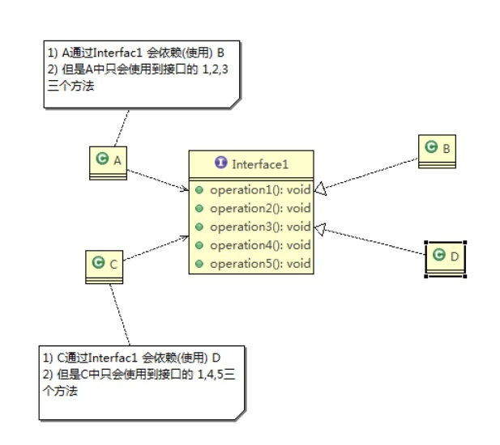
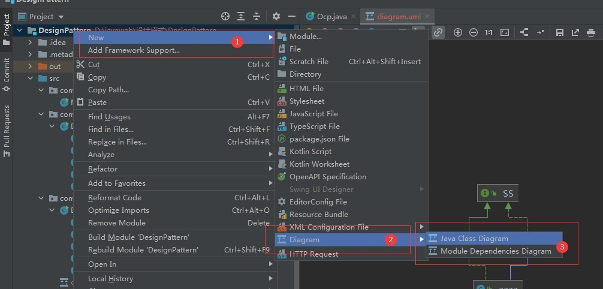

# 设计模式常用的七大原则
[[toc]]
## 设计模式的目的

编写软件过程中，程序员面临着来自 **耦合性，内聚性以及可维护性，可扩展性，重用性，灵活性**等多方面的挑战，设计模式是为了让程序(软件.，具有更好
1. 代码重用性 (即：相同功能的代码，不用多次编写.
2. 可读性 (即：编程规范性, 便于其他程序员的阅读和理解.
3. 可扩展性 (即：当需要增加新的功能时，非常的方便，称为可维性）
4. 可靠性(即：当我们增加新的功能后，对原来的功能没有影响.
5. 使程序呈现高内聚，低耦合的特性

分享金句：
设计模式包含了面向对象的精髓，“懂了设计模式，你就懂了面向对象分析和设计（OOA/D）的精要”Scott Mayers 在其巨著《Effective C++》就曾经说过：C++老手和 C++新手的区别就是前者手背上有很多伤疤

:::tip 设计模式常用的七大原则
1. <font color='red'><strong>单一职责原则</strong></font>  
2. <font color='red'><strong>接口隔离原则</strong></font>  
3. <font color='red'><strong>依赖倒转(倒置.原则)</strong></font>  
4. <font color='red'><strong>里氏替换原则</strong></font>
5. <font color='red'><strong>开闭原则</strong></font>
6. <font color='red'><strong>迪米特法则</strong></font>
7. <font color='red'><strong>合成复用原则</strong></font>
:::

## 单一职责原则

**对类来说的，即一个类应该只负责一项职责。如类A负责两个不同职责：职责1，职责2。当职责1需求变更而改变A时，可能造成职责2执行错误，所以需要将类A的粒度分解为A1，A2**

**示例应用：**
```java
public class SingleResponsibility2 {
    public static void main(String[] args) {
        RoadVehicle roadVehicle=new RoadVehicle();
        roadVehicle.run("摩托车");
        roadVehicle.run("汽车");
        AirVehicle airVehicle=new AirVehicle();
        airVehicle.run("飞机");

    }
}
class RoadVehicle{
    public  void run(String vehicle){
        System.out.println(vehicle+"在公路上跑！");
    }
}
class AirVehicle{
    public  void run(String vehicle){
        System.out.println(vehicle+"在空中上飞！");
    }
}
class WaterVehicle{
    public  void run(String vehicle){
        System.out.println(vehicle+"在水中上跑！");
    }
}
```

### 单一职责原则注意事项和细节
1. 降低类的复杂度，一个类只负责一项职责。
2. 提高类的可读性，可维护性
3. 降低变更引起的风险
4. 通常情况下，我们应当遵守单一职责原则，只有逻辑足够简单，才可以在代码级违反单一职责原则；只有类中方法数量足够少，可以在<font color='red'><strong>方法级别</strong></font>保持单一职责原则

```java
public class SingleResponsibility3 {
    public static void main(String[] args) {
        Vehicle2 vehicle=new Vehicle2();
        vehicle.roadRun("摩托车");
        vehicle.airRun("飞机");
        vehicle.waterRun("轮船");

    }
}
class Vehicle2{
    public  void roadRun(String vehicle){
        System.out.println(vehicle+"在公路上跑！");
    }
    public  void airRun(String vehicle){
        System.out.println(vehicle+"在天上飞！");
    }
    public  void waterRun(String vehicle){
        System.out.println(vehicle+"在水中行！");
    }
}
```


## 接口隔离原则

接口隔离原则(Interface Segregation Principle) ：客户端不应该依赖它不需要的接口，即一个类对另一个类的依赖应该建立在**最小的接口**上

<a data-fancybox title="接口隔离原则" href="./image/geliyuanze.jpg"></a>


上图中：类A通过接口Interface1依赖类B，类C通过接口Interface1依赖类D，如果接口Interface1对于类A和类C来说不是最小接口那么类B和类D必须去实现他们不需要的方法。  
按隔离原则应当这样处理：**将接口Interface1拆分为独立的几个接口， 类A和类C分别与他们需要的接口建立依赖关系**。也就是采用接口隔离原则

```java
public class Segregation {
    public static void main(String[] args) {

        /**类A通过接口Interface1依赖类B，类C通过接口Interface1依赖类D，
         *如果接口Interface1对于类A和类C来说不是最小接口那么类B和类D必须去实现他们不需要的方法
         *造成代码冗余
        **/
        
        A a=new A();
        a.depend1(new B()); // A类通过接口去依赖B类
        a.depend2(new B());
        a.depend3(new B());
        C c=new C();
        c.depend1(new D());// C类通过接口去依赖D类
        c.depend4(new D());
        c.depend5(new D());

    }
}
//接口
interface Interface1 {
    void operation1();
    void operation2();
    void operation3();
    void operation4();
    void operation5();
}

class B implements Interface1 {
    @Override
    public void operation1() {
        System.out.println("B 实现了 operation1");
    }

    @Override
    public void operation2() {
        System.out.println("B 实现了 operation2");
    }
    @Override
    public void operation3() {
        System.out.println("B 实现了 operation3");
    }
    @Override
    public void operation4() {
        System.out.println("B 实现了 operation4");
    }
    @Override
    public void operation5() {
        System.out.println("B 实现了 operation5");
    }
}

class D implements Interface1 {
    @Override
    public void operation1() {
        System.out.println("D 实现了 operation1");
    }

    @Override
    public void operation2() {
        System.out.println("D 实现了 operation2");
    }
    @Override
    public void operation3() {
        System.out.println("D 实现了 operation3");
    }
    @Override
    public void operation4() {
        System.out.println("D 实现了 operation4");
    }
    @Override
    public void operation5() {
        System.out.println("D 实现了 operation5");
    }
}
//A 类通过接口Interface1 依赖(使用) B类，但是只会用到1,2,3方法
class A {
    public void depend1(Interface1 i) {
        i.operation1();
    }
    public void depend2(Interface1 i) {
        i.operation2();
    }
    public void depend3(Interface1 i) {
        i.operation3();
    }
}
//C 类通过接口Interface1 依赖(使用) D类，但是只会用到1,4,5方法
class C {
    public void depend1(Interface1 i) {
        i.operation1();
    }
    public void depend4(Interface1 i) {
        i.operation4();
    }
    public void depend5(Interface1 i) {
        i.operation5();
    }
}
```

**示例应用：**
<a data-fancybox title="接口隔离原则" href="./image/geliyuanze1.jpg"></a>

1. 类A通过接口Interface1依赖类B，类C通过接口Interface1依赖类D，如果接口Interface1对于类A和类C来说不是最小接口，那么类B和类D必须去实现他们不  需要的方法

2. 将接口Interface1拆分为独立的几个接口，类A和类C分别与他们需要的接口建立  依赖关系。也就是采用接口隔离原则
3. 接口Interface1中出现的方法，根据实际情况拆分为三个接口
4. 代码实现

```java
package com.tqk.principle.segregation.improve;
public class Segregation {
    public static void main(String[] args) {

        /**类A通过接口Interface1依赖类B，类C通过接口Interface1依赖类D，
         *如果接口Interface1对于类A和类C来说不是最小接口那么类B和类D必须去实现他们不需要的方法
         *造成代码冗余
        **/

        A a=new A();
        a.depend1(new B()); // A类通过接口去依赖B类
        a.depend2(new B());
        a.depend3(new B());
        C c=new C();
        c.depend1(new D());// C类通过接口去依赖D类
        c.depend4(new D());
        c.depend5(new D());

    }
}
//接口
interface Interface1 {
    void operation1();
}
interface Interface2 {
    void operation2();
    void operation3();
}
interface Interface3 {
    void operation4();
    void operation5();
}
class B implements Interface1,Interface2 {
    @Override
    public void operation1() {
        System.out.println("B 实现了 operation1");
    }
    @Override
    public void operation2() {
        System.out.println("B 实现了 operation2");
    }
    @Override
    public void operation3() {
        System.out.println("B 实现了 operation3");
    }
}

class D implements Interface1,Interface3 {
    @Override
    public void operation1() {
        System.out.println("D 实现了 operation1");
    }
    @Override
    public void operation4() {
        System.out.println("D 实现了 operation4");
    }
    @Override
    public void operation5() {
        System.out.println("D 实现了 operation5");
    }
}
//A 类通过接口Interface1 依赖(使用) B类，但是只会用到1,2,3方法
class A {
    public void depend1(Interface1 i) {
        i.operation1();
    }
    public void depend2(Interface2 i) {
        i.operation2();
    }
    public void depend3(Interface2 i) {
        i.operation3();
    }
}
//C 类通过接口Interface1 依赖(使用) D类，但是只会用到1,4,5方法
class C {
    public void depend1(Interface1 i) {
        i.operation1();
    }
    public void depend4(Interface3 i) {
        i.operation4();
    }
    public void depend5(Interface3 i) {
        i.operation5();
    }
}

```

## 依赖倒转原则

:::warning <font color='red'>依赖倒转原则(Dependence Inversion Principle)</font> 
1. 高层模块不应该依赖低层模块，二者都应该依赖其抽象
2. 抽象不应该依赖细节，细节应该依赖抽象
3. 依赖倒转(倒置)的中心思想是面向接口编程
4. 依赖倒转原则是基于这样的设计理念：相对于细节的多变性，抽象的东西要稳定的多。以抽象为基础搭建的架构比以细节为基础的架构要稳定的多。在java中，抽象指的是接口或抽象类，细节就是具体的实现类
5. 使用接口或抽象类的目的是制定好规范，而不涉及任何具体的操作，把展现细节的任务交给他们的实现类去完成
:::

```java
public class DependecyInversion {

    public static void main(String[] args) {
        new Person1().receive(new Email());
        
        new Person1().receive(new WeiXin());
    }
}
//定义接口
interface IReceiver {
    public String getInfo();
}

class Email implements IReceiver{
    @Override
    public String getInfo() {
        return "电子邮件信息: hello,world";
    }
}
class WeiXin implements IReceiver{
    @Override
    public String getInfo() {
        return "微信信息: hello,world";
    }
}
//完成Person接收消息的功能
//方式1分析
//1)简单，比较容易想到
//2)如果我们获取的对象是 微信，短信等等，则新增类，同时Perons也要增加相应的接收方法
//3)解决思路：引入一个抽象的接口IReceiver, 表示接收者, 这样Person类与接口IReceiver发生依赖
//   因为Email, WeiXin 等等属于接收的范围，他们各自实现IReceiver 接口就ok, 这样我们就符号依赖倒转原则
class Person {
    public void receive(Email email ) {
        System.out.println(email.getInfo());
    }
}
//改进方式
class Person1 {
    public void receive(IReceiver iReceiver ) {
        System.out.println(iReceiver.getInfo());
    }
}

```

**依赖关系传递的三种方式和应用案例**

1)<font color='red'><strong>接口传递</strong></font>

```java
package com.tqk.principle.inversion.improve;

public class DependencyPass {
    public static void main(String[] args) {
        HaiXin haiXin=new HaiXin();
        new OpenAndClose().play(haiXin);

        new OpenAndClose().play(new Haier());
    }
}

//方式一 通过接口实现
interface IOOpenAndClose{
    void play(TV tv);
}
interface TV{
    void open();
}
class HaiXin implements TV{

    @Override
    public void open() {
        System.out.println("打开海信电视！");
    }
}
class Haier implements TV{

    @Override
    public void open() {
        System.out.println("打开海尔电视！");
    }
}
class OpenAndClose implements IOOpenAndClose{
    @Override
    public void play(TV tv) {
        tv.open();
    }
}

```

2)<font color='red'><strong>构造方法传递</strong></font>

```java
package com.tqk.principle.inversion.improve;
/**
 * @ClassName：DependencyPass
 * @description: 依赖倒转原则
 * @author: tianqikai
 * @date : 19:51 2021/6/13
 */
public class DependencyPass {
    public static void main(String[] args) {
        // 通过构造方法
        HaiXin haiXin=new HaiXin();
        OpenAndClose openAndClose1=new OpenAndClose(haiXin);
        openAndClose1.play();
        OpenAndClose openAndClose2=new OpenAndClose(new Haier());
        openAndClose2.play();
    }
}

//方式二 通过构造方法
interface IOOpenAndClose{
    void play();
}
interface TV{
    void open();
}
class HaiXin implements TV{

    @Override
    public void open() {
        System.out.println("打开海信电视！");
    }
}
class Haier implements TV{

    @Override
    public void open() {
        System.out.println("打开海尔电视！");
    }
}
class OpenAndClose implements IOOpenAndClose{
    public  TV tv;

    public OpenAndClose(TV tv) {
        this.tv = tv;
    }

    @Override
    public void play() {
        this.tv.open();
    }
}

```

3)<font color='red'><strong>setter方式传递</strong></font>

```java
package com.tqk.principle.inversion.improve;
/**
 * @ClassName：DependencyPass
 * @description: 依赖倒转原则
 * @author: tianqikai
 * @date : 19:51 2021/6/13
 */
public class DependencyPass {
    public static void main(String[] args) {
        //通过setter方法传递
        HaiXin haiXin=new HaiXin();
        OpenAndClose openAndClose1=new OpenAndClose();
        openAndClose1.setTv(haiXin);
        openAndClose1.play();
        OpenAndClose openAndClose2=new OpenAndClose();
        openAndClose1.setTv(new Haier());
        openAndClose1.play();
        //
    }
}

//方式二 通过setter方法传递
interface IOOpenAndClose{
    void play();

    void setTv(TV tv);
}
interface TV{
    void open();
}
class HaiXin implements TV{

    @Override
    public void open() {
        System.out.println("打开海信电视！");
    }
}
class Haier implements TV{

    @Override
    public void open() {
        System.out.println("打开海尔电视！");
    }
}
class OpenAndClose implements IOOpenAndClose{
    public  TV tv;
    @Override
    public void play() {
        tv.open();
    }

    @Override
    public void setTv(TV tv) {
        this.tv=tv;
    }
}
```

<font color='blue'>**依赖倒转原则的注意事项和细节**</font>

1. 低层模块尽量都要有抽象类或接口，或者两者都有，程序稳定性更好.

2. 变量的声明类型尽量是抽象类或接口, 这样我们的变量引用和实际对象间，就存在一个缓冲层，利于程序扩展和优化

3. 继承时遵循里氏替换原则


## 里氏替换原则

1. 里氏替换原则(**Liskov Substitution Principle**)在1988年，由麻省理工学院的以为姓里的女士提出的。
2. 如果对每个类型为T1的对象o1，都有类型为T2的对象o2，使得以T1定义的所有程序P在所有的对象o1都代换成o2时，程序P的行为没有发生变化，那么类型T2是类型T1 的子类型。换句话说，所有引用基类的地方必须能透明地使用其子类的对象。
3. 在使用继承时，遵循里氏替换原则，在子类中**尽量**不要重写父类的方法
4. 里氏替换原则告诉我们，继承实际上让两个类耦合性增强了，**在适当的情况下，可以通过聚合，组合，依赖来解决问题**。

```java
package com.tqk.principle.liskov;
public class Liskov {
    public static void main(String[] args) {
        // TODO Auto-generated method stub
        A a = new A();
        System.out.println("11-3=" + a.func1(11, 3));
        System.out.println("1-8=" + a.func1(1, 8));

        System.out.println("-----------------------");
        B b = new B();
        System.out.println("11-3=" + b.func1(11, 3));//这里本意是求出11-3
        System.out.println("1-8=" + b.func1(1, 8));// 1-8
        System.out.println("11+3+9=" + b.func2(11, 3));
        System.out.println("-----------------------");
        A a1 = (A) b;
        System.out.println("11-3=" + a1.func1(11, 3));//这里本意是求出11-3
        System.out.println("1-8=" + a1.func1(1, 8));// 1-8
    }
}
// A类
class A {
    // 返回两个数的差
    public int func1(int num1, int num2) {
        return num1 - num2;
    }
}

// B类继承了A
// 增加了一个新功能：完成两个数相加,然后和9求和
class B extends A {
    //这里，重写了A类的方法, 可能是无意识
    @Override
    public int func1(int a, int b) {
        return a + b;
    }

    public int func2(int a, int b) {
        return func1(a, b) + 9;
    }
}
```

**解决方法**
1. 我们发现原来运行正常的相减功能发生了错误。原因就是类B无意中重写了父类的方法，造成原有功能出现错误。在实际编程中，我们常常会通过重写父类的方法完成新的功能，这样写起来虽然简单，但整个继承体系的复用性会比较差。特别是运行多态比较频繁的时候

2. 通用的做法是：**原来的父类和子类都继承一个更通俗的基类，原有的继承关系去掉， 采用依赖，聚合，组合等关系代替**


<a data-fancybox title="里氏替换原则" href="./image/lishitihuan.jpg"></a>

```java
package com.tqk.principle.liskov.improve;

public class Liskov {

	public static void main(String[] args) {
		// TODO Auto-generated method stub
		A a = new A();
		System.out.println("11-3=" + a.func1(11, 3));
		System.out.println("1-8=" + a.func1(1, 8));

		System.out.println("-----------------------");
		B b = new B();
		//因为B类不再继承A类，因此调用者，不会再func1是求减法
		//调用完成的功能就会很明确
		System.out.println("11+3=" + b.func1(11, 3));//这里本意是求出11+3
		System.out.println("1+8=" + b.func1(1, 8));// 1+8
		System.out.println("11+3+9=" + b.func2(11, 3));
		
		
		//使用组合仍然可以使用到A类相关方法
		System.out.println("11-3=" + b.func3(11, 3));// 这里本意是求出11-3
		

	}

}

//创建一个更加基础的基类
class Base {
	//把更加基础的方法和成员写到Base类
}

// A类
class A extends Base {
	// 返回两个数的差
	public int func1(int num1, int num2) {
		return num1 - num2;
	}
}

// B类继承了A
// 增加了一个新功能：完成两个数相加,然后和9求和
class B extends Base {
	//如果B需要使用A类的方法,使用组合关系
	private A a = new A();
	
	//这里，重写了A类的方法, 可能是无意识
	public int func1(int a, int b) {
		return a + b;
	}

	public int func2(int a, int b) {
		return func1(a, b) + 9;
	}
	
	//我们仍然想使用A的方法
	public int func3(int a, int b) {
		return this.a.func1(a, b);
	}
}

```

## 开闭原则
基本介绍
1. 开闭原则（Open Closed Principle）是编程中**最基础、最重要**的设计原则  
2. 一个软件实体如类，模块和函数应该对扩展开放(对提供方)，对修改关闭(对使用方)。用抽象构建框架，用实现扩展细节  
3. 当软件需要变化时，尽量通过扩展软件实体的行为来实现变化，而不是通过修改已有的代码来实现变化。编程中遵循其它原则，以及使用设计模式的目的就是遵循开闭原则  

**该种方式比较简单易于操作但是违背了开闭原则，如果我们新加一个功能需要修改原来的代码**
```java
package com.tqk.principle.ocp;
/**
 * @ClassName： Ocp
 * @description: 开闭原则
 * @author: tianqikai
 * @date : 7:40 2021/6/19
 */
public class Ocp {
    public static void main(String[] args) {
        Overhead overhead=new Overhead();
        overhead.operations(1);
        overhead.operations(2);
        overhead.operations(3);
    }
}

class Overhead {
    public void operations(int flag){
        if(flag==1){
            openCard();
        }else if(flag==2){
            closeCard();
        }else if(flag==3){
            queryCard();
        }else{
            System.out.println("不支持的操作类型！");
        }
    }

    public void openCard(){
        System.out.println("开立账户！");
    }
    public void closeCard(){
        System.out.println("注销账户！");
    }
    public void queryCard(){
        System.out.println("查询账户！");
    }
}


```


**该种方式比较简单易于操作但是违背了开闭原则，如果我们新加一个功能需要修改账户信息不需要修改来的原来的代码，只需要新增一个类就好了**
```java
package com.tqk.principle.ocp.improve;
/**
 * @ClassName： Ocp
 * @description: 开闭原则
 * @author: tianqikai
 * @date : 7:40 2021/6/19
 */
public class Ocp {
    public static void main(String[] args) {
        Overhead overhead=new Overhead();
        overhead.operations(new OpenCard());
        overhead.operations(new CloseCard());
        overhead.operations(new QueryCard());
    }
}
class Overhead {
    public void  operations(Base base){
        base.operations();
    }
}
abstract  class Base {
    abstract void operations();
}
class OpenCard extends Base{

    @Override
    void operations() {
        System.out.println("开立账户！");
    }
}
class CloseCard extends Base{

    @Override
    void operations() {
        System.out.println("注销账户！");
    }
}
class QueryCard extends Base{

    @Override
    void operations() {
        System.out.println("查询账户！");
    }
}
```


## 迪米特法则

1. 一个对象应该对其他对象保持最少的了解
2. 类与类关系越密切，耦合度越大
3. 迪米特法则(Demeter Principle)又叫**最少知道原则**，即一个类对自己依赖的类知道的越少越好。也就是说，对于被依赖的类不管多么复杂，都尽量将逻辑封装在类的内部。对外除了提供的public方法，不对外泄露何信息
4. 迪米特法则还有个更简单的定义：只与直接的朋友通信
5. <font color='red'><strong>直接的朋友</strong></font>：每个对象都会与其他对象有耦合关系，只要两个对象之间有耦合关系，我们就说这两个对象之间是朋友关系。耦合的方式很多，依赖，关联，组合，聚合 等。其中，我们称出现成员变量，方法参数，方法返回值中的类为直接的朋友，而 出现在局部变量中的类不是直接的朋友。也就是说，陌生的类最好不要以局部变量 的形式出现在类的内部。

```java
import java.util.ArrayList;
import java.util.List;

//客户端
public class Demeter1 {

	public static void main(String[] args) {
		//创建了一个 SchoolManager 对象
		SchoolManager schoolManager = new SchoolManager();
		//输出学院的员工id 和  学校总部的员工信息
		schoolManager.printAllEmployee(new CollegeManager());

	}

}


//学校总部员工类
class Employee {
	private String id;

	public void setId(String id) {
		this.id = id;
	}

	public String getId() {
		return id;
	}
}


//学院的员工类
class CollegeEmployee {
	private String id;

	public void setId(String id) {
		this.id = id;
	}

	public String getId() {
		return id;
	}
}


//管理学院员工的管理类
class CollegeManager {
	//返回学院的所有员工
	public List<CollegeEmployee> getAllEmployee() {
		List<CollegeEmployee> list = new ArrayList<CollegeEmployee>();
		for (int i = 0; i < 10; i++) { //这里我们增加了10个员工到 list
			CollegeEmployee emp = new CollegeEmployee();
			emp.setId("学院员工id= " + i);
			list.add(emp);
		}
		return list;
	}
}

//学校管理类

//分析 SchoolManager 类的直接朋友类有哪些 Employee、CollegeManager
//CollegeEmployee 不是 直接朋友 而是一个陌生类，这样违背了 迪米特法则 
class SchoolManager {
	//返回学校总部的员工
	public List<Employee> getAllEmployee() {
		List<Employee> list = new ArrayList<Employee>();
		
		for (int i = 0; i < 5; i++) { //这里我们增加了5个员工到 list
			Employee emp = new Employee();
			emp.setId("学校总部员工id= " + i);
			list.add(emp);
		}
		return list;
	}

	//该方法完成输出学校总部和学院员工信息(id)
	void printAllEmployee(CollegeManager sub) {
		
		//分析问题
		//1)这里的 CollegeEmployee 不是  SchoolManager的直接朋友
		//2)CollegeEmployee 是以局部变量方式出现在 SchoolManager
		//3)违反了 迪米特法则 
		
		//获取到学院员工
		List<CollegeEmployee> list1 = sub.getAllEmployee();
		System.out.println("------------学院员工------------");
		for (CollegeEmployee e : list1) {
			System.out.println(e.getId());
		}
		//获取到学校总部员工
		List<Employee> list2 = this.getAllEmployee();
		System.out.println("------------学校总部员工------------");
		for (Employee e : list2) {
			System.out.println(e.getId());
		}
	}
}
```
**应用实例改进** 
1. 前面设计的问题在于SchoolManager中，CollegeEmployee类并不是SchoolManager类的直接朋友 
2. 按照迪米特法则，应该避免类中出现这样非直接朋友关系的耦合
3. 对代码按照迪米特法则进行改进)

```java
import java.util.ArrayList;
import java.util.List;

//客户端
public class Demeter1 {

	public static void main(String[] args) {
		System.out.println("~~~使用迪米特法则的改进~~~");
		//创建了一个 SchoolManager 对象
		SchoolManager schoolManager = new SchoolManager();
		//输出学院的员工id 和  学校总部的员工信息
		schoolManager.printAllEmployee(new CollegeManager());

	}
}
//学校总部员工类
class Employee {
	private String id;

	public void setId(String id) {
		this.id = id;
	}

	public String getId() {
		return id;
	}
}
//学院的员工类
class CollegeEmployee {
	private String id;

	public void setId(String id) {
		this.id = id;
	}

	public String getId() {
		return id;
	}
}

//管理学院员工的管理类
class CollegeManager {
	//返回学院的所有员工
	public List<CollegeEmployee> getAllEmployee() {
		List<CollegeEmployee> list = new ArrayList<CollegeEmployee>();
		for (int i = 0; i < 10; i++) { //这里我们增加了10个员工到 list
			CollegeEmployee emp = new CollegeEmployee();
			emp.setId("学院员工id= " + i);
			list.add(emp);
		}
		return list;
	}
	
	//输出学院员工的信息
	public void printEmployee() {
		//获取到学院员工
		List<CollegeEmployee> list1 = getAllEmployee();
		System.out.println("------------学院员工------------");
		for (CollegeEmployee e : list1) {
			System.out.println(e.getId());
		}
	}
}

//学校管理类

//分析 SchoolManager 类的直接朋友类有哪些 Employee、CollegeManager
//CollegeEmployee 不是 直接朋友 而是一个陌生类，这样违背了 迪米特法则 
class SchoolManager {
	//返回学校总部的员工
	public List<Employee> getAllEmployee() {
		List<Employee> list = new ArrayList<Employee>();
		
		for (int i = 0; i < 5; i++) { //这里我们增加了5个员工到 list
			Employee emp = new Employee();
			emp.setId("学校总部员工id= " + i);
			list.add(emp);
		}
		return list;
	}

	//该方法完成输出学校总部和学院员工信息(id)
	void printAllEmployee(CollegeManager sub) {
		
		//分析问题
		//1)将输出学院的员工方法，封装到CollegeManager
		sub.printEmployee();
	
		//获取到学校总部员工
		List<Employee> list2 = this.getAllEmployee();
		System.out.println("------------学校总部员工------------");
		for (Employee e : list2) {
			System.out.println(e.getId());
		}
	}
}
```

**迪米特法则注意事项和细节**
1. 迪米特法则的核心是降低类之间的耦合
2. 但是注意：由于每个类都减少了不必要的依赖，因此迪米特法则只是要求降低类间(对象间)耦合关系， 并不是要求完全没有依赖关系


## 合成复用原则（Composite Reuse Principle）

**原则是尽量使用合成/聚合的方式，而不是使用继承**

<a data-fancybox title="Composite Reuse Principle" href="./image/principle.jpg"></a>

## 设计原则核心思想

:::tip 设计原则核心思想
1. 找出应用中可能需要变化之处，把它们独立出来，不要和那些不需要变化的代码混在一起。
2. 针对接口编程，而不是针对实现编程。
3. 为了交互对象之间的松耦合设计而努力
:::


##  IDEA生成UML类图

:::tip UML图  
<br/>
<Badge text="Ctrl+Alt+Shift+U"/>  打开选中类的的UML类图到新的编辑框中    
<br/>
<Badge text="Ctrl+Alt+U"/>  展示选中类的的UML类图    
:::

<br/>

<a data-fancybox title="创建UML" href="./image/createUML.jpg"></a>

:::tip <font color='red'>箭头含义</font>
<font color='green'><strong>绿色实线</strong></font>为 接口间的继承  
<font color='green'><strong>绿色虚线</strong></font>为 类实现接口  
<font color='blue'><strong>蓝色实线</strong></font>为 类继承  
:::
<br/>

<a data-fancybox title="UML箭头含义" href="./image/UML.jpg"></a>

<a title="UML类图参考文档"  href="https://blog.csdn.net/qq_19934363/article/details/90269883">UML类图参考文档</a>