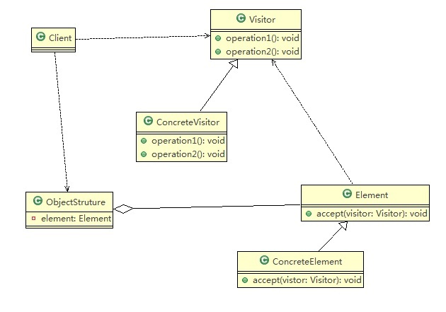
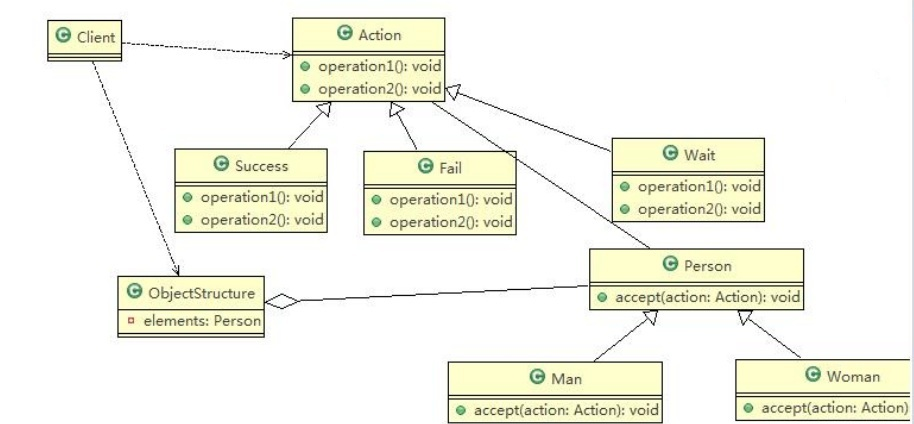

# 访问者模式

:::tip 访问者模式基本介绍
1. **访问者模式（Visitor Pattern）**，封装一些作用于某种数据结构的各元素的操作， 它可以在不改变数据结构的前提下定义作用于这些元素的新的操作。
2. 主要将数据结构与数据操作分离，解决<font color='red'><strong>数据结构和操作耦合性问题</strong></font>
3. **访问者模式的基本工作原理是**：在被访问的类里面加一个对外提供接待访问者的接口
4. **访问者模式主要应用场景是**：需要对一个对象结构中的对象进行很多不同操作 (这些操作彼此没有关联)，同时需要避免让这些操作"污染"这些对象的类，可以选用访问者模式解决
:::

<a data-fancybox title="访问者模式" href="./image/Visitor.jpg"></a>
:::tip 对原理类图的说明-即(访问者模式的角色及职责)
1. Visitor 是抽象访问者，为该对象结构中的ConcreteElement的每一个类声明一个visit操作
2. ConcreteVisitor ：是一个具体的访问值 实现每个有Visitor 声明的操作，是每个操作实现的部分.
3. ObjectStructure 能枚举它的元素， 可以提供一个高层的接口，用来允许访问者访问元素
4. Element 定义一个accept 方法，接收一个访问者对象
5. ConcreteElement 为具体元素，实现了accept 方法
:::

## 访问者模式应用实例

<a data-fancybox title="访问者模式应用实例" href="./image/Visitor2.jpg"></a>

```java
// 客户端
public class Client {
    public static void main(String[] args) {
        //创建ObjectStructure
        ObjectStructure objectStructure = new ObjectStructure();

        objectStructure.attach(new Man());
        objectStructure.attach(new Woman());


        //成功
        Success success = new Success();
        objectStructure.display(success);

        System.out.println("===============");
        Fail fail = new Fail();
        objectStructure.display(fail);

        System.out.println("=======给的是待定的测评========");

        Wait wait = new Wait();
        objectStructure.display(wait);
    }
}
```

```java
public abstract  class Action {
    //得到男性 的测评
    public abstract void getManResult(Man man);

    //得到女的 测评
    public abstract void getWomanResult(Woman woman);
}
public class Fail extends Action{
    @Override
    public void getManResult(Man man) {
        System.out.println(" 男人给的评价该歌手失败 !");
    }

    @Override
    public void getWomanResult(Woman woman) {
        System.out.println(" 女人给的评价该歌手失败 !");
    }
}
public class Success extends Action{
    @Override
    public void getManResult(Man man) {
        System.out.println(" 女人给的评价该歌手成功  !");
    }

    @Override
    public void getWomanResult(Woman woman) {
        System.out.println(" 女人给的评价该歌手成功  !");
    }
}
public class Wait extends Action{
    @Override
    public void getManResult(Man man) {
        System.out.println(" 女人给的评价该歌手等待 !");

    }

    @Override
    public void getWomanResult(Woman woman) {
        System.out.println(" 女人给的评价该歌手等待  !");

    }
}
```

```java
public class ObjectStructure {

    //维护了一个集合
    private List<Person> persons = new LinkedList<>();

    //增加到list
    public void attach(Person p) {
        persons.add(p);
    }
    //移除
    public void detach(Person p) {
        persons.remove(p);
    }

    //显示测评情况
    public void display(Action action) {
        for(Person p: persons) {
            p.accept(action);
        }
    }
}
```
```java
public abstract  class Person {
    //提供一个方法，让访问者可以访问
    public abstract void accept(Action action);

}
public class Woman extends Person{
    @Override
    public void accept(Action action) {
        action.getWomanResult(this);
    }
}
public class Man extends Person {
    @Override
    public void accept(Action action) {
        action.getManResult(this);
    }
}
```

## 访问者模式的注意事项和细节

:::warning 访问者模式的注意事项和细节
**优点** 
1. 访问者模式符合单一职责原则、让程序具有优秀的扩展性、灵活性非常高
2. 访问者模式可以对功能进行统一，可以做报表、UI、拦截器与过滤器，适用于数据结构相对稳定的系统

**缺点**  
1. 具体元素对访问者公布细节，也就是说访问者关注了其他类的内部细节，这是迪米特法则所不建议的, 这样造成了具体元素变更比较困难
2. 违背了依赖倒转原则。访问者依赖的是具体元素，而不是抽象元素
3. 因此，如果一个系统有比较稳定的数据结构，又有经常变化的功能需求，那么访问者模式就是比较合适的.
:::
