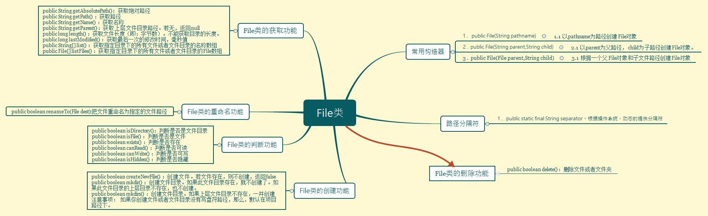
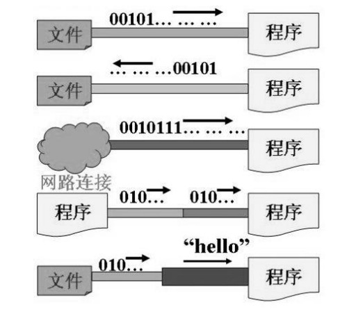
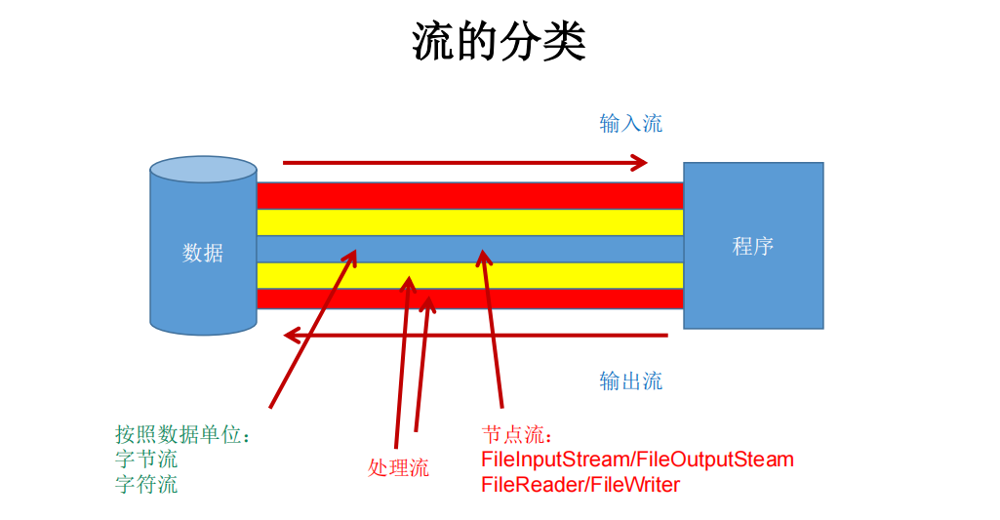
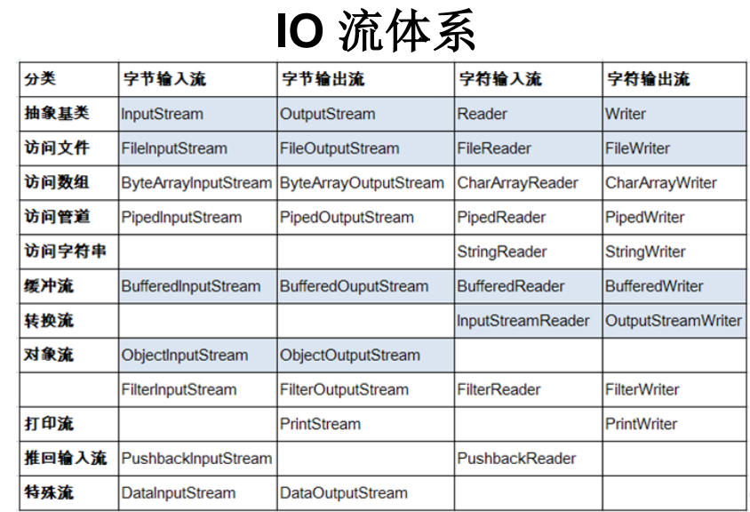
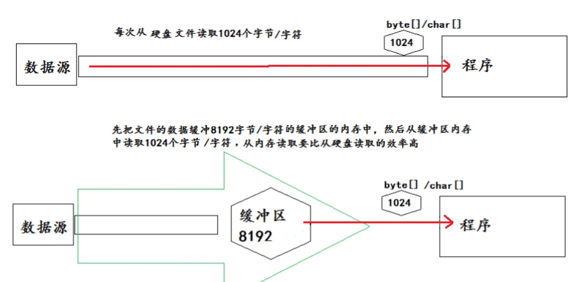

# 12. IO流

## 12.1 File 类的使用

<a data-fancybox title="File类" href="../image/File.jpg"></a>

------------

:::tip File
● <font color='red'>java.io.File类：文件和文件目录路径的抽象表示形式</font>，与平台无关  
●  File 能新建、删除、重命名文件和目录，但 File 不能访问文件内容本身。如果需要访问文件内容本身，则需要使用输入/输出流。    
●  想要在Java程序中表示一个真实存在的文件或目录，那么必须有一个File对象，但是Java程序中的一个File对象，可能没有一个真实存在的文件或目录。     
●  <font color='red'>File对象可以作为参数传递给流的构造器</font>    
:::

### 12.1.1  File 类的使用：常用构造器

--------------------

<font color='red'>◆ <strong>public File(String pathname)</strong></font>   
以pathname为路径创建File对象，可以是绝对路径或者相对路径，如果pathname是相对路径，则默认的当前路径在系统属性user.dir中存储。  
　▶ 绝对路径：是一个固定的路径,从盘符开始  
　▶ 相对路径：是相对于某个位置开始  
<font color='red'>◆ <strong>public File(String parent,String child)</strong></font>    
 以parent为父路径，child为子路径创建File对象。   
<font color='red'>◆ <strong>public File(File parent,String child)</strong></font>    
 根据一个父File对象和子文件路径创建File对象  

```java
    @Test
    public  void testFile1(){
        File dir1 = new File("D:/IOTest/dir1");
        if (!dir1.exists()) { // 如果D:/IOTest/dir1不存在，就创建为目录
            dir1.mkdir();
        }
// 创建以dir1为父目录,名为"dir2"的File对象
        File dir2 = new File(dir1, "dir2");
        if (!dir2.exists()) { // 如果还不存在，就创建为目录
            dir2.mkdirs();
        }
        File dir4 = new File(dir1, "dir3/dir4");
        if (!dir4.exists()) {
            dir4.mkdirs();
        }
// 创建以dir2为父目录,名为"test.txt"的File对象
        File file = new File(dir2, "test.txt");
        if (!file.exists()) { // 如果还不存在，就创建为文件
            try {
                file.createNewFile();
            } catch (IOException e) {
                e.printStackTrace();
            }
        }
    }
```
### 12.1.2  File 类的使用：路径分隔符

File类提供了一个常量：
<font color='blue' size=4><strong>public static final String separator</strong></font>。根据操作系统，动态的提供分隔符。

```java
File file1 = new File("d:\\tqk\\info.txt");
File file2 = new File("d:" + File.separator + "tqk" + File.separator + "info.txt");
File file3 = new File("d:/tqk");
```
### 12.1.3 File 类的使用：常用方法

:::tip <font color='red'>File类的获取功能</font>
1. public String getAbsolutePath()：获取绝对路径
2. public String getPath() ：获取路径
3. public String getName() ：获取名称
4. public String getParent()：获取上层文件目录路径。若无，返回null
5. public long length() ：获取文件长度（即：字节数）。不能获取目录的长度。
6. public long lastModified() ：获取最后一次的修改时间，毫秒值
7. public String[] list() ：获取指定目录下的所有文件或者文件目录的名称数组
8. public File[] listFiles() ：获取指定目录下的所有文件或者文件目录的File数组
:::


:::tip <font color='red'>File类的重命名功能</font>
☆ public boolean renameTo(File dest):把文件重命名为指定的文件路径
:::

:::tip <font color='red'>File类的判断功能</font>
1. public boolean isDirectory()：判断是否是文件目录
2. public boolean isFile() ：判断是否是文件
3. public boolean exists() ：判断是否存在
4. public boolean canRead() ：判断是否可读
5. public boolean canWrite() ：判断是否可写
6. public boolean isHidden() ：判断是否隐藏
:::

:::tip <font color='red'> File类的创建功能</font>
1. public boolean createNewFile() ：创建文件。若文件存在，则不创建，返回false
2. public boolean mkdir() ：创建文件目录。如果此文件目录存在，就不创建了。如果此文件目录的上层目录不存在，也不创建。 
3. public boolean mkdirs() ：创建文件目录。如果上层文件目录不存在，一并创建  
<font color='red'>注意事项：</font> 如果你创建文件或者文件目录没有写盘符路径，那么，默认在项目路径下。
:::

:::tip <font color='red'>File类的删除功能</font>
public boolean delete()：删除文件或者文件夹  
<font color='red'>删除注意事项：</font>    
Java中的删除不走回收站。 要删除一个文件目录，请注意该文件目录内不能包含文件或者文件目录  
::: 

-----------------------------------

```java
@Test
    public void testFile() throws IOException {
        String filePath="D:"+File.separatorChar+"FileTest"+File.separator;
        File file=new File(filePath);
        if(!file.exists()){
            file.mkdirs();
        }
        File file1=new File("tqk001.txt");
        if(!file1.exists()){
            file1.mkdirs();
        }
        File file2=new File(filePath,"tqk001.txt");
        System.out.println(file2.getPath());
        if(!file2.exists()){
            System.out.println("11111111111");
            file2.createNewFile();
            System.out.println(file2.exists());
        }
        //
        file2.delete();
        //重命名
        file2.createNewFile();
        file2.renameTo(new File(filePath,"tqk999.txt"));
        File file3=new File(file,"tqk003.txt" );
        if(!file3.exists()){
            System.out.println("文件不存在");
            System.out.println(file3.getPath());
            file3.createNewFile();
        }
        System.out.println("---------------------");
        //获取文件名
        System.out.println(file3.getName());
        //获取文件路径
        System.out.println(file3.getPath());
        //获取文件上层路径
        System.out.println(file3.getParent());
        //获取绝对路径
        System.out.println(file3.getAbsolutePath());
        //获取绝对路径文件
        System.out.println(file3.getAbsoluteFile());
        //获取文件大小
        System.out.println(file3.length());
        //判断是否是文件
        System.out.println(file3.isFile());
        //判断是否是文件夹
        System.out.println(file3.isDirectory());
        //是否可写
        System.out.println(file3.canWrite());
        //是否可读
        System.out.println(file3.canRead());
        //是否隐藏的
        System.out.println(file3.isHidden());
        //获取最后一次修改时间
        System.out.println(file3.lastModified());
        //获取指定目录下的所有文件或者文件目录的名称数组
        System.out.println("--------------------------");

        String[] arrayList=file.list();
        for (String filename:arrayList) {
            System.out.println(filename);
        }
        System.out.println("--------------------------");
        //获取指定目录下的所有文件或者文件目录的File
        File[] fileList=file.listFiles();
        for (File fileobject:fileList) {
            System.out.println(fileobject.getName());
        }

    }
```

--------------------------------------------------------------------

## 12.2 IO流原理及流的分类

::: warning Java IO原理
1. I/O是Input/Output的缩写， I/O技术是非常实用的技术，用于<font color='red'><strong>处理设备之间的数据传输</strong></font>。如读/写文件，网络通讯等。
2. Java程序中，对于数据的输入/输出操作以<font color='red'><strong>“流(stream)”</strong></font> 的方式进行。
3. java.io包下提供了各种“流”类和接口，用以获取不同种类的数据，并通过<font color='red'><strong>标准的方法输入或输出数据</strong></font>。
:::

<font color='red'><strong>● 输入input：</strong></font>读取外部数据（磁盘、光盘等存储设备的数据）到程序（内存）中。  
<font color='red'><strong>● 输出output：</strong></font>将程序（内存）数据输出到磁盘、光盘等存储设备中。  
<a data-fancybox title="IO" href="../image/IO.jpg"></a>

:::tip <font color='red'>流的分类</font>
1. 按操作<font color='red'><strong>数据单位</strong></font>不同分为：**字节流(8 bit)，字符流(16 bit)**
2. 按数据<font color='red'><strong>流的流向</strong></font>不同分为：**输入流，输出流**
3. 按<font color='red'><strong>流的角色</strong></font>的不同分为：**节点流，处理流**  
　　<font color='red'><strong>※  节点流：</strong></font>直接从数据源或目的地读写数据 
<a data-fancybox title="IO" href="../image/jiedianliu.jpg"></a> 
　　<font color='red'><strong>※  处理流：</strong></font>不直接连接到数据源或目的地，而是“连接”在已存在的流（节点流或处理流）之上，通过对数据的处理为程序提供更为强大的读写功能。  
<a data-fancybox title="IO" href="../image/chuliliu.jpg"></a>
:::
<a data-fancybox title="IO" href="../image/IOtype.png"></a>

----------------------

:::warning IO流抽象基类
<a data-fancybox title="IO" href="../image/abstractIO.jpg"></a>
1. Java的IO流共涉及40多个类，实际上非常规则，都是从如下4个抽象基类派生的。
2. 由这四个类派生出来的子类名称都是以其父类名作为子类名后缀。

<a data-fancybox title="IO" href="../image/IOzilei.png"></a>
:::

---------------------------------------

::: tip <font color='red'>InputStream</font>
-------------------------
1. <font color='red'><strong>int read()</strong></font>    
从输入流中读取数据的下一个字节。返回 0 到 255 范围内的 int 字节值。如果因为已经到达流末尾而没有可用的字节，则返回值 -1。   
2. <font color='red'><strong>int read(byte[] b) </strong></font>    
从此输入流中将最多 b.length 个字节的数据读入一个 byte 数组中。如果因为已经到达流末尾而没有可用的字节，则返回值 -1。否则以整数形式返回实际读取的字节数。   
3. <font color='red'><strong>int read(byte[] b, int off,int len)</strong></font>      
将输入流中从off处开始存储，最最多 len 个数据字节读入 byte 数组。尝试读取 len 个字节，但读取的字节也可能小于该值。以整数形式返回实际读取的字节数。如果因为流位于文件末尾而没有可用的字节，则返回值 -1。   
4. <font color='red'><strong>public void close() throws IOException</strong></font>      
关闭此输入流并释放与该流关联的所有系统资源。  
:::
-----------------

::: tip <font color='red'>Reader</font>
-------------------------
1. <font color='red'><strong>int read()</strong></font>      
读取单个字符。作为整数读取的字符，范围在 0 到 65535 之间 (0x00-0xffff)（2个字节的Unicode码），如果已到达流的末尾，则返回 -1     
2. <font color='red'><strong>int read(char[] cbuf)</strong></font>     
将字符读入数组。如果已到达流的末尾，则返回 -1。否则返回本次读取的字符数。    
3. <font color='red'><strong>int read(char[] cbuf,int off,int len)</strong></font>      
将字符读入数组的某一部分。存到数组cbuf中，从off处开始存储，最多读len个字符。如果已到达流的末尾，则返回 -1。否则返回本次读取的字符数。     
4. <font color='red'><strong>public void close() throws IOException</strong></font>      
关闭此输入流并释放与该流关联的所有系统资源。  
:::

```java
    private void fileRead(File file, FileInputStream fileInputStream) {
        StringBuffer stringBuffer=new StringBuffer(64);
        byte[] bytes=new byte[1];
        //读取文件
        try {
            fileInputStream = new FileInputStream(file);
            int data=0;
            while((data= fileInputStream.read())!=-1){
                char c= (char) data;
                stringBuffer.append(c);
            }
        } catch (FileNotFoundException e) {
            e.printStackTrace();
        } catch (IOException e) {
            e.printStackTrace();
        }finally{
            try {
                fileInputStream.close();
            } catch (IOException e) {
                System.out.println("关闭读IO流失败！");
            }
        }
        System.out.println(stringBuffer.toString());
    }
```

----------------------
::: tip <font color='red'>OutputStream</font>
-------------------------
1. <font color='red'><strong>void write(int b)</strong></font>  
将指定的字节写入此输出流。write 的常规协定是：向输出流写入一个字节。要写入的字节是参数 b 的八个低位。b 的 24 个高位将被忽略。 即写入0~255范围的。   
2. <font color='red'><strong>void write(byte[] b)</strong></font>  
将 b.length 个字节从指定的 byte 数组写入此输出流。write(b) 的常规协定是：应该与调用 write(b, 0, b.length) 的效果完全相同。   
3. <font color='red'><strong>void write(byte[] b,int off,int len)</strong></font>  
将指定 byte 数组中从偏移量 off 开始的 len 个字节写入此输出流。   
4. <font color='red'><strong>public void flush()throws IOException</strong></font>  
刷新此输出流并强制写出所有缓冲的输出字节，调用此方法指示应将这些字节立即写入它们预期的目标。   
5. <font color='red'><strong>public void close() throws IOException</strong></font>  
关闭此输出流并释放与该流关联的所有系统资源。
:::
--------------------
::: tip <font color='red'>Writer</font>
-------------------------
1. <font color='red'><strong>void write(int c)</strong></font>  
写入单个字符。要写入的字符包含在给定整数值的 16 个低位中，16 高位被忽略。 即写入0 到 65535 之间的Unicode码。   
2. <font color='red'><strong>void write(char[] cbuf)</strong></font>  
写入字符数组。 
3. void write(char[] cbuf,int off,int len)</strong></font>  
写入字符数组的某一部分。从off开始，写入len个字符   
4. <font color='red'><strong>void write(String str)</strong></font>  
写入字符串。   
5. <font color='red'><strong>void write(String str,int off,int len)</strong></font>   
写入字符串的某一部分。   
6. <font color='red'><strong> void flush()</strong></font>    
刷新该流的缓冲，则立即将它们写入预期目标。   
7. <font color='red'><strong>public void close() throws IOException</strong></font>    
关闭此输出流并释放与该流关联的所有系统资源。  
:::

```java
    private void fileWrite(File file, FileOutputStream fileOutputStream) {
        //写入文件
        try {
            fileOutputStream =new FileOutputStream(file);
            byte[] bytes="aaaaa大师傅是暗访方式发发1".getBytes();
            fileOutputStream.write(bytes);
        } catch (FileNotFoundException e) {
            e.printStackTrace();
        } catch (IOException e) {
            e.printStackTrace();
        }finally {
            try {
                fileOutputStream.close();
            } catch (IOException e) {
                System.out.println("关闭写IO流失败！");
            }
        }
    }
```

## 12.3 节点流(或文件流)

:::warning <font color='red'>读取文件</font>
1. 建立一个流对象，将已存在的一个文件加载进流。  
<font color='blue'><strong>◆ FileReader fr = new FileReader(new File(“Test.txt”));</strong></font>  
2. 创建一个临时存放数据的数组。  
<font color='blue'><strong>◆ char[] ch = new char[1024];</strong></font>  
3. 调用流对象的读取方法将流中的数据读入到数组中。  
<font color='blue'><strong>◆ fr.read(ch);</strong></font>  
4. 关闭资源。  
<font color='blue'><strong>◆ fr.close();</strong></font>  
:::
-----------------

```java
    private static String fileByReader(File file, FileReader fileReader) {
        StringBuffer stringBuffer=new StringBuffer(64);
        char[] chars=new char[1024];
        //读取文件
        try {
            fileReader = new FileReader(file);
            int data=0;
            while((data= fileReader.read(chars))!=-1){
                stringBuffer.append(chars,0,data);
            }
        } catch (FileNotFoundException e) {
            e.printStackTrace();
        } catch (IOException e) {
            e.printStackTrace();
        }finally{
            if(fileReader!=null){
                try {
                    fileReader.close();
                } catch (IOException e) {
                    System.out.println("关闭FileReader IO流失败！");
                }
            }
        }
        return stringBuffer.toString();
    }
```

:::danger <font color='#1459A1'>写入文件</font>
1. 创建流对象，建立数据存放文件  
<font color='#1459A1'><strong>◆ FileWriter fw = new FileWriter(new File(“Test.txt”));</strong></font>   
2. 调用流对象的写入方法，将数据写入流  
<font color='#1459A1'><strong>◆ fw.write(“atguigu-songhongkang”);</strong></font>   
3. 关闭流资源，并将流中的数据清空到文件中。   
<font color='#1459A1'><strong>◆ fw.close();</strong></font>   
:::
-----------------

```java
    private static void writeFileByWriter(File file, FileWriter fileWriter, String str){
        //写入文件
        try {
            fileWriter =new FileWriter(file);
            fileWriter.write(str);
        } catch (FileNotFoundException e) {
            e.printStackTrace();
        } catch (IOException e) {
            e.printStackTrace();
        }finally {
            if(fileWriter!=null){
                try {
                    fileWriter.flush();
                    fileWriter.close();
                } catch (IOException e) {
                    System.out.println("关闭写IO流失败！");
                }
            }
        }
    }
```
```java
    private static void copyFileByReaderWriter(File file1, FileWriter fileWriter,File file2, FileReader fileReader){
        char[] chars=new char[10];
        if(!file2.exists()){
            try {
                file2.createNewFile();
            } catch (IOException e) {
                System.out.println("源文件不存在");
            };
        }
        //写入文件
        try {
            fileWriter =new FileWriter(file1);
            fileReader = new FileReader(file2);
            int data=0;
            while((data= fileReader.read(chars))!=-1){
                //错误写法 可能会导致多复制内容，char型数组中的值，没有被覆盖
                fileWriter.write(chars,0,data);
            }
        } catch (FileNotFoundException e) {
            e.printStackTrace();
        } catch (IOException e) {
            e.printStackTrace();
        }finally {
            if(fileWriter!=null){
                try {
                    fileWriter.flush();
                    fileWriter.close();
                } catch (IOException e) {
                    System.out.println("关闭写IO流失败！");
                }
            }
            if(fileReader!=null){
                try {
                    fileReader.close();
                } catch (IOException e) {
                    System.out.println("关闭读IO流失败！");
                }
            }
        }
    }
```

<font color='#1459A1'>**FileOutputStream/FileOutputStream**</font>  

-----------------

```java
    private static void fileWrite(File file, FileOutputStream fileOutputStream) {
        //写入文件
        try {
            fileOutputStream =new FileOutputStream(file);
            byte[] bytes="helloworld java!".getBytes();
            fileOutputStream.write(bytes);
        } catch (FileNotFoundException e) {
            e.printStackTrace();
        } catch (IOException e) {
            e.printStackTrace();
        }finally {
            try {
                fileOutputStream.close();
            } catch (IOException e) {
                System.out.println("关闭写IO流失败！");
            }
        }
    }
    /**
     * @Method： fileRead
     * @Description： 读取文件（不支持中文）
     * @param fileInputStream
     * @Version  1.0
     */
    private static void fileRead(File file, FileInputStream fileInputStream) {
        StringBuffer stringBuffer=new StringBuffer(64);
        byte[] bytes=new byte[10];
        //读取文件
        try {
            fileInputStream = new FileInputStream(file);
            int data=0;
            int num=0;
            while((data= fileInputStream.read(bytes))!=-1){
                stringBuffer.append(new String(bytes,0,data));
            }
        } catch (FileNotFoundException e) {
            e.printStackTrace();
        } catch (IOException e) {
            e.printStackTrace();
        }finally{
            try {
                fileInputStream.close();
            } catch (IOException e) {
                System.out.println("关闭读IO流失败！");
            }
        }
        System.out.println(stringBuffer.toString());
    }
```
:::danger <font color='#1459A1'>注意事项</font>
1. 定义文件路径时，注意：可以用“/”或者“\\”。 
2. 在写入一个文件时，如果使用构造器FileOutputStream(file)，则<font color='red'>目录下有同名文件(文件已存在)文件内容将被覆盖</font>。
3. 如果使用构造器FileOutputStream(file,true)，则<font color='red'>目录下的同名文件（文件已存在）不会被覆盖，在文件内容末尾追加内容</font>。
4. 在读取文件时，必须保证该文件已存在，否则报异常。 
5. 字节流操作字节，比如：.mp3，.avi，.rmvb，mp4，.jpg，.doc，.ppt
6. 字符流操作字符，只能操作普通文本文件。最常见的文本文件：.txt，.java，.c，.cpp 等语言的源代码。尤其注意.doc,excel,ppt这些不是文本文件
:::
```java
    public static void main(String[] args) {
        FileInputStream fis=null;
        FileOutputStream fos =null;
        File file1 = new File( "爱情与友情.jpg");
        File file2 = new File( "爱情与友情1.jpg");
        testFileInputOutputStream(file1,fis,file2,fos);
    }
public static void testFileInputOutputStream(File file1, FileInputStream fileInputStream, File file2, FileOutputStream fileOutputStream) {
        FileInputStream fis = fileInputStream;
        FileOutputStream fos = fileOutputStream;
        try {
            //
            File srcFile = file1;
            File destFile = file2;

            //
            fis = new FileInputStream(srcFile);
            fos = new FileOutputStream(destFile);

            //复制的过程
            byte[] buffer = new byte[1024];
            int len;
            while ((len = fis.read(buffer)) != -1) {
                fos.write(buffer, 0, len);
            }

        } catch (IOException e) {
            e.printStackTrace();
        } finally {
            if (fos != null) {
                //
                try {
                    fos.close();
                } catch (IOException e) {
                    e.printStackTrace();
                }
            }
            if (fis != null) {
                try {
                    fis.close();
                } catch (IOException e) {
                    e.printStackTrace();
                }

            }
        }
    }
```
## 12.4 缓冲流

:::tip 缓冲流
为了提高数据读写的速度，Java API提供了带缓冲功能的流类，在使用这些流类时，会创建一个内部缓冲区数组，缺省使用8192个字节(8Kb)的缓冲区。   
※ 缓冲流要“套接”在相应的节点流之上，根据数据操作单位可以把缓冲流分为：  
　<font color='red'><strong>▷ BufferedInputStream 和 BufferedOutputStream</strong></font>  
　<font color='red'><strong>▷ BufferedReader 和 BufferedWriter</strong></font>  
:::

<a data-fancybox title="IO" href="../image/huanchongliu.jpg"></a>

----------------

:::tip 缓冲流使用说明
1. 当读取数据时，数据按块读入缓冲区，其后的读操作则直接访问缓冲区
2. 当使用BufferedInputStream读取字节文件时，BufferedInputStream会一次性从文件中读取8192个(8Kb)，存在缓冲区中，直到缓冲区装满了，才重新从文件中读取下一个8192个字节数组。 
3. 向流中写入字节时，不会直接写到文件，先写到缓冲区中直到缓冲区写满，BufferedOutputStream才会把缓冲区中的数据一次性写到文件里。<font color='blue'><strong>使用方法flush()可以强制将缓冲区的内容全部写入输出流</strong></font>
4. 关闭流的顺序和打开流的顺序相反。<font color='red'><strong>只要关闭最外层流即可，关闭最外层流也会相应关闭内层节点流</strong></font>
5. flush()方法的使用：手动将buffer中内容写入文件
6. 如果是带缓冲区的流对象的close()方法，不但会关闭流，还会在关闭流之前刷新缓冲区，关闭后不能再写出
:::

```java
//读写文件
    public static String readFile(File file){
        BufferedReader bufferedReader =null;
        StringBuilder stringBuilder=new StringBuilder(32);
        try {
            bufferedReader = new BufferedReader(new FileReader(file));
            String lineStr =null;
            while(true){
                lineStr=bufferedReader.readLine();
                if(lineStr!=null){
                    stringBuilder.append(lineStr);
                }else{
                    break;
                }
            }
        }catch (Exception e){
            System.out.println(e);
            System.out.println("读取文件失败");
        }finally {
            if(  bufferedReader !=null){
                try {
                    bufferedReader.close();
                } catch (IOException e) {
                    e.printStackTrace();
                }
            }
        }
        return stringBuilder.toString();
    }
    public static void writeFile(File file){
        BufferedWriter bufferedWriter=null;
        try {
            bufferedWriter=new BufferedWriter(new FileWriter(file));
            bufferedWriter.write("哈哈哈哈哈哈哈嗝");
//            bufferedWriter.flush();
        } catch (IOException e) {
            e.printStackTrace();
        }finally {
            if(bufferedWriter!=null){
                try {
                    bufferedWriter.flush();
                    bufferedWriter.close();
                    // //说明：关闭外层流的同时，内层流也会自动的进行关闭。关于内层流的关闭，我们可以省略.
                    // FileWriter不用管
                } catch (IOException e) {
                    e.printStackTrace();
                }
            }
        }
    }
```

------------------------------------

```java
    //复制文件
    public static void copyFile(String file1,String file2){
        BufferedInputStream bis=null;
        BufferedOutputStream bos=null;
        try {
            bos = new BufferedOutputStream(new FileOutputStream(new File(file2)));
            bis=new BufferedInputStream(new FileInputStream(new File(file1)));
            int num=0;
            byte[] bytes=new byte[1024];
            while((num=bis.read(bytes))!=-1){
                bos.write(bytes,0,num);
            }
        } catch (FileNotFoundException e) {
            e.printStackTrace();
        } catch (IOException e) {
            e.printStackTrace();
        } finally {
            if (bis!=null) {
                try {
                    bis.close();
                } catch (IOException e) {
                    e.printStackTrace();
                }
            }
            if (bos!=null) {
                try {
                    bos.close();
                } catch (IOException e) {
                    e.printStackTrace();
                }
            }
        }
    }
```

## 12.5 转换流

:::tip 转换流作用
**转换流提供了在字节流和字符流之间的转换**
1. Java API提供了两个转换流：  
　<font color='blue'><strong>▶ InputStreamReader：将InputStream转换为Reader </strong></font>  
　<font color='blue'><strong>▶ OutputStreamWriter：将Writer转换为OutputStream </strong></font>   
2. 字节流中的数据都是字符时，转成字符流操作更高效。   
3. 很多时候我们使用转换流来处理文件乱码问题。实现编码和解码的功能。  
:::

------------------------------

:::warning  InputStreamReader
1. 实现将字节的输入流按指定字符集转换为字符的输入流。
2. 需要和InputStream“套接”。
3. 构造器  
　<font color='blue'><strong>▶ public InputStreamReader(InputStream in)  </strong></font>  
　<font color='blue'><strong>▶ public InputSreamReader(InputStream in,String charsetName) </strong></font>   
如： Reader isr = new InputStreamReader(System.in,”gbk”);指定字符集  
:::

------------------------------------------

:::warning  OutputStreamWriter  
1. 实现将字符的输出流按指定字符集转换为字节的输出流。  
2. 需要和OutputStream“套接”。  
3. 构造器   
　<font color='red'><strong>▶  public OutputStreamWriter(OutputStream out)</strong></font>   
　<font color='red'><strong>▶  public OutputSreamWriter(OutputStream out,String charsetName)</strong></font>   
:::

```java
public class InputStreamReaderTest {
    public static void main(String[] args) {
        File file1 = new File("tqk888.txt");
        File file2 = new File("tqk999.txt");
        InputStreamReader inputStreamReader=null;
        OutputStreamWriter outputStreamWriter=null;
        try {
            int len;
            char[] chars=new char[1024];
            inputStreamReader = new InputStreamReader(new FileInputStream(file1),"UTF-8");
            outputStreamWriter= new OutputStreamWriter(new FileOutputStream(file2), "GBK");
            while((len=inputStreamReader.read(chars))!=-1){
                outputStreamWriter.write(chars,0,len);
            }
        }catch (Exception e){
            System.out.println(e);
        }finally {
            if(inputStreamReader!=null){
                try {
                    inputStreamReader.close();
                } catch (IOException e) {
                    e.printStackTrace();
                }
            }
            if(outputStreamWriter!=null){
                try {
                    outputStreamWriter.close();
                } catch (IOException e) {
                    e.printStackTrace();
                }
            }
        }
    }
}
```

--------------------------------------------


## 12.6 标准输入、输出流(了解)

1. <font color='red'><strong>System.in和System.out</strong></font> 分别代表了系统标准的输入和输出设备  
2. 默认输入设备是：键盘，输出设备是：显示器  
3. System.in的类型是InputStream   
4. System.out的类型是PrintStream，其是OutputStream的子类  
　　FilterOutputStream 的子类   
5. 重定向：通过System类的setIn，setOut方法对默认设备进行改变。  
　<font color='red'><strong>▶  public static void setIn(InputStream in)</strong></font>  
　<font color='red'><strong>▶  public static void setOut(PrintStream out)</strong></font>  

**试题：**从键盘输入字符串，要求将读取到的整行字符串转成大写输出。然后继续进行输入操作，直至当输入“e”或者“exit”时，退出程序。
```java
public class MyInputTest {
    public static void main(String[] args) throws IOException {
        InputUpCase2();
//        InputUpCase();
    }
    private static void InputUpCase2() throws IOException {
        Scanner scanner=new Scanner(System.in);

        while(true){
            System.out.println("请输入字符串：");
            String data = scanner.nextLine();
            if (data.equals("e")||data.equals("exit")){
                System.out.println("结束输入!");
                break;
            }else{
                System.out.println(data.toUpperCase());
            }

        }
    }
    private static void InputUpCase() throws IOException {
        BufferedReader breader=new BufferedReader(new InputStreamReader(System.in));
        while(true){
            System.out.println("请输入字符串：");
            String data = breader.readLine();
            if (data.equals("e")||data.equals("exit")){
                System.out.println("结束输入!");
                break;
            }else{
                System.out.println(data.toUpperCase());
            }

        }
        breader.close();
    }
}
```

## 12.7 打印流(了解)

:::tip 打印流作用及方法
**实现将基本数据类型的数据格式转化为字符串输出**   
1. 打印流：PrintStream和PrintWriter   
　▷ 提供了一系列重载的print()和println()方法，用于多种数据类型的输出   
　▷ PrintStream和PrintWriter的输出不会抛出IOException异常   
　▷ PrintStream和PrintWriter有自动flush功能   
　▷ PrintStream 打印的所有字符都使用平台的默认字符编码转换为字节。在需要写入字符而不是写入字节的情况下，应该使用 PrintWriter 类。    
　▷ System.out返回的是PrintStream的实例    
:::
```java
public class PrintStreamTest {
    public static void main(String[] args) {
        for (int i = 0; i <= 255; i++) { // 输出ASCII字符
            System.out.println(i+":"+(char) i);
        }
//        method1();
    }

    private static void method1() {
        PrintStream ps=null;
        try {
            FileOutputStream fos = new FileOutputStream(new File("tqkxxx.txt"));
            // 创建打印输出流,设置为自动刷新模式(写入换行符或字节 '\n' 时都会刷新输出缓冲区)
            ps = new PrintStream(fos, true);
            if (ps != null) {// 把标准输出流(控制台输出)改成文件
                System.setOut(ps);
            }
            for (int i = 0; i <= 255; i++) { // 输出ASCII字符
                System.out.print((char) i);
                if (i % 50 == 0) { // 每50个数据一行
                    System.out.println(); // 换行
                } }
        } catch (FileNotFoundException e) {
            e.printStackTrace();
        }finally {
            if(ps!=null){
                ps.close();
            }
        }
    }
}
```

## 12.8 数据流(了解)
1. 为了方便地操作Java语言的基本数据类型和String的数据，可以使用数据流。  
2. 数据流有两个类：(用于读取和写出基本数据类型、String类的数据）  
　DataInputStream 和 DataOutputStream  
　分别“套接”在 InputStream 和 OutputStream 子类的流上   
3. DataInputStream中的方法  
　boolean readBoolean() 
　byte readByte()  
　char readChar()       
　float readFloat()  
　double readDouble()   
　short readShort()  
　long readLong()       
　int readInt()  
　String readUTF()      
　void readFully(byte[] b)  
4. DataOutputStream中的方法  
　将上述的方法的read改为相应的write即可。  

```java
DataOutputStream dos = null;
try { // 创建连接到指定文件的数据输出流对象
dos = new DataOutputStream(new FileOutputStream("destData.dat"));
dos.writeUTF("我爱北京天安门"); // 写UTF字符串
dos.writeBoolean(false); // 写入布尔值
dos.writeLong(1234567890L); // 写入长整数
System.out.println("写文件成功!");
} catch (IOException e) {
e.printStackTrace();
} finally { // 关闭流对象
try {
if (dos != null) {
// 关闭过滤流时,会自动关闭它包装的底层节点流
dos.close();
}
} catch (IOException e) {
e.printStackTrace();
} }
```
## 12.9 对象流
:::warning  对象流
<font color='red'><strong>ObjectInputStream和OjbectOutputSteam</strong></font>
1. 用于存储和读取基本数据类型数据或对象的处理流。它的强大之处就是可以把Java中的对象写入到数据源中，也能把对象从数据源中还原回来。
2. **序列化** ：用ObjectOutputStream类保存基本类型数据或对象的机制
3. **反序列化** ：用ObjectInputStream类读取基本类型数据或对象的机制
4. ObjectOutputStream和ObjectInputStream<font color='red'>不能序列化<strong>static</strong>和<strong>transient</strong>修饰的成员变量</font>
:::

:::tip 对象的序列化
1. <font color='red'><strong>对象序列化机制</strong></font>允许把内存中的Java对象转换成平台无关的二进制流，从而允许把这种二进制流持久地保存在磁盘上，或通过网络将这种二进制流传输到另一个网络节点。//当其它程序获取了这种二进制流，就可以恢复成原来的Java对象
2. 序列化的好处在于可将任何实现了Serializable接口的对象转化为字节数据，使其在保存和传输时可被还原
3. 序列化是 RMI（Remote Method Invoke – 远程方法调用）过程的参数和返回值都必须实现的机制，而 RMI 是 JavaEE 的基础。因此序列化机制是JavaEE 平台的基础
4. 如果需要让某个对象支持序列化机制，则必须让对象所属的类及其属性是可序列化的，为了让某个类是可序列化的，该类必须实现如下两个接口之一。否则，会抛出NotSerializableException异常  
　<font color='red'><strong>▶Serializable</strong></font>    
　▶Externalizable  

5.凡是实现Serializable接口的类都有一个表示序列化版本标识符的静态变量：  
　 <font color='red'><strong>▶private static final long serialVersionUID;</strong></font>    
　▶serialVersionUID用来表明类的不同版本间的兼容性。简言之，其目的是以序列化对象进行版本控制，有关各版本反序列化时是否兼容     
　▶如果类没有显示定义这个静态常量，它的值是Java运行时环境根据类的内部细节自动生成的。若类的实例变量做了修改，serialVersionUID 可能发生变化。 <font color='red'><strong>故建议，显式声明</strong></font>  
7. 简单来说，Java的序列化机制是通过在运行时判断类的serialVersionUID来验证版本一致性的。在进行反序列化时，JVM会把传来的字节流中的serialVersionUID与本地相应实体类的serialVersionUID进行比较，如果相同就认为是一致的，可以进行反序列化， <font color='red'><strong>否则就会出现序列化版本不一致的异常。(InvalidCastException)</strong></font>  
:::
:::warning 使用对象流序列化对象
1. 若某个类实现了 Serializable 接口，该类的对象就是可序列化的：
　<font color='red'><strong>▶创建一个 ObjectOutputStream</strong></font>  
　<font color='red'><strong>▶调用 ObjectOutputStream 对象的 writeObject(对象) 方法输出可序列化对象</strong></font>  
　<font color='red'><strong>▶注意写出一次，操作flush()一次</strong></font>  
2. 反序列化  
　<font color='red'><strong>▶创建一个 ObjectInputStream</strong></font>  
　<font color='red'><strong>▶调用 readObject() 方法读取流中的对象</strong></font>   
3. 强调：如果某个类的属性不是基本数据类型或 String 类型，而是另一个引用类型，那么这个引用类型必须是可序列化的，否则拥有该类型的Field 的类也不能序列化
::: 

-----------

```java
public class ObjectStreamTest {
    public static void main(String[] args) throws IOException, ClassNotFoundException {
        Person p = new Person("韩梅梅", 18, 001, new Account(100000));
        Student student=new Student("韩梅梅",6,"光明小学");
        method2(new File("student.txt"),student);
        method1(new File("student.txt"));
        method2(new File("person.txt"),p);
        method1(new File("person.txt"));
    }

    private static void method1(File file) {
        ObjectInputStream ois= null;
        try {
            ois = new ObjectInputStream(new FileInputStream(file));

            Object p1 = ois.readObject();
            System.out.println(p1.toString());
//            if(p1 instanceof  Person){
//                System.out.println(p1.toString());
//            }
//            if(p1 instanceof  Student){
//                System.out.println(p1.toString());
//            }
        } catch (IOException e) {
            e.printStackTrace();
        } catch (ClassNotFoundException e) {
            e.printStackTrace();
        } finally {
            if(ois!=null){
                try {
                    ois.close();
                } catch (IOException e) {
                    e.printStackTrace();
                }
            }
        }
    }
    private static <T> void method2(File file, T person) {
        ObjectOutputStream ous= null;
        try {
            ous = new ObjectOutputStream(new FileOutputStream(file));
            ous.writeObject(person);
            ous.flush();

        } catch (IOException e) {
            e.printStackTrace();
        } catch (Exception e) {
            e.printStackTrace();
        } finally {
            if(ous!=null){
                try {
                    ous.close();
                } catch (IOException e) {
                    e.printStackTrace();
                }
            }
        }
    }
}
```

:::tip 面试题
**谈谈你对java.io.Serializable接口的理解，我们知道它用于序列化，是空方法接口，还有其它认识吗？**
1. 实现了Serializable接口的对象，可将它们转换成一系列字节，并可在以后完全恢复回原来的样子。这一过程亦可通过网络进行。这意味着序列化机制能自动补偿操作系统间的差异。换句话说，可以先在Windows机器上创建一个对象，对其序列化，然后通过网络发给一台Unix机器，然后在那里准确无误地重新“装配”。不必关心数据在不同机器上如何表示，也不必关心字节的顺序或者其他任何细节。
2. 由于大部分作为参数的类如String、Integer等都实现了java.io.Serializable的接口，也可以利用多态的性质，作为参数使接口更灵活。
:::
## 12.10 随机存取文件流

:::tip RandomAccessFile 类 
1. **RandomAccessFile** 声明在java.io包下，但直接继承于java.lang.Object类。并且它实现了DataInput、DataOutput这两个接口，也就意味着这个类既可以读也可以写。  
2. **RandomAccessFile 类支持 “随机访问” 的方式**，程序可以直接跳到文件的任意地方来读、写文件  
　<font color='red'><strong>▷支持只访问文件的部分内容</strong></font>    
　<font color='red'><strong>▷可以向已存在的文件后追加内容</strong></font>    
3. RandomAccessFile 对象包含一个记录指针，用以标示当前读写处的位置。  RandomAccessFile 类对象可以自由移动记录指针： 
　<font color='red'><strong>▷long getFilePointer()：获取文件记录指针的当前位置</strong></font>   
　<font color='red'><strong>▷void seek(long pos)：将文件记录指针定位到 pos 位置</strong></font>   
4. **构造器**  
　<font color='red'><strong>▷public RandomAccessFile(File file, String mode)</strong></font>     
　<font color='red'><strong>▷public RandomAccessFile(String name, String mode)</strong></font>     
5. 创建 RandomAccessFile 类实例需要指定一个 mode 参数，该参数指定 RandomAccessFile 的访问模式：  
　<font color='red'><strong>▷r: 以只读方式打开</strong></font>    
　<font color='red'><strong>▷rw：打开以便读取和写入</strong></font>    
　<font color='red'><strong>▷rwd:打开以便读取和写入；同步文件内容的更新</strong></font>    
　<font color='red'><strong>▷rws:打开以便读取和写入；同步文件内容和元数据的更新</strong></font>    
6. 如果**模式为只读r**。则不会创建文件，而是会去读取一个已经存在的文件，如果读取的文件不存在则会出现异常。 如果模式为rw读写。如果文件不存在则会去创建文件，如果存在则不会创建。  
:::

```java
public class RandomAccessFileTest {
    public static void main(String[] args) {
        readFile();
        writeFile("tianqikai",5,new File("test.txt"));
    }

    private static void readFile() {
        RandomAccessFile randomAccessFile=null;
        try {
            randomAccessFile=new RandomAccessFile(new File("test.txt"), "rw");
            String msg="";
            while((msg=randomAccessFile.readLine())!=null){
                System.out.println(msg);
            }
        } catch (Exception e) {
            e.printStackTrace();
        } finally {
            try {
                randomAccessFile.close();
            } catch (IOException e) {
                e.printStackTrace();
            }
        }
    }
    /**
     * @classname : writeFile
     * @description: 指定位置写入文件内容
     */
    private static void writeFile(String msg,int pos,File file) {
        RandomAccessFile randomAccessFile=null;
        try {
            randomAccessFile=new RandomAccessFile(file, "rw");
            randomAccessFile.seek(pos);
            String temp=randomAccessFile.readLine();
            randomAccessFile.seek(pos);
            randomAccessFile.write(msg.getBytes());
            randomAccessFile.write(temp.getBytes());
        } catch (Exception e) {
            e.printStackTrace();
        } finally {
            try {
                randomAccessFile.close();
            } catch (IOException e) {
                e.printStackTrace();
            }
        }
    }
}
```

----------------

我们可以用RandomAccessFile这个类，来实现一个多线程断点下载的功能，
用过下载工具的朋友们都知道，下载前都会建立两个临时文件，一个是与
被下载文件大小相同的空文件，另一个是记录文件指针的位置文件，每次
暂停的时候，都会保存上一次的指针，然后断点下载的时候，会继续从上
一次的地方下载，从而实现断点下载或上传的功能，有兴趣的朋友们可以
自己实现下。

------------------

## 12.11 NIO.2中Path、Paths、Files类的使用

Path 常用方法：
 String toString() ： 返回调用 Path 对象的字符串表示形式
 boolean startsWith(String path) : 判断是否以 path 路径开始
 boolean endsWith(String path) : 判断是否以 path 路径结束
 boolean isAbsolute() : 判断是否是绝对路径
 Path getParent() ：返回Path对象包含整个路径，不包含 Path 对象指定的文件路径
 Path getRoot() ：返回调用 Path 对象的根路径
 Path getFileName() : 返回与调用 Path 对象关联的文件名
 int getNameCount() : 返回Path 根目录后面元素的数量
 Path getName(int idx) : 返回指定索引位置 idx 的路径名称
 Path toAbsolutePath() : 作为绝对路径返回调用 Path 对象
 Path resolve(Path p) :合并两个路径，返回合并后的路径对应的Path对象
 File toFile(): 将Path转化为File类的对象
