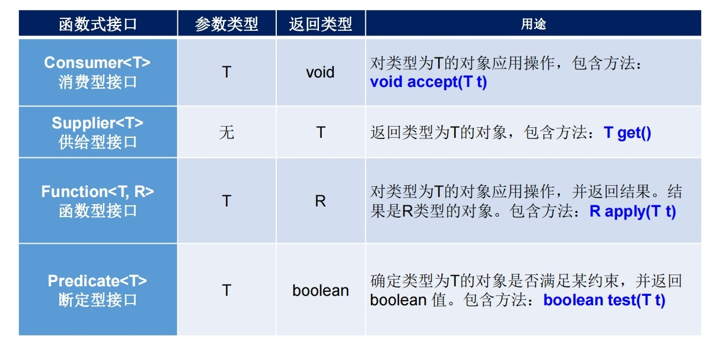
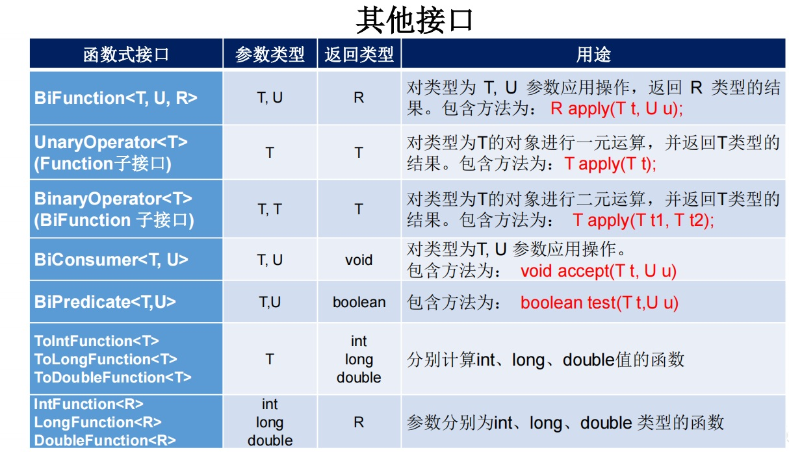
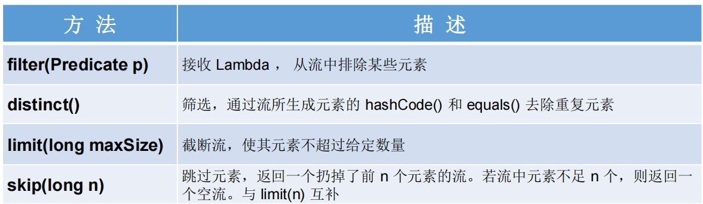
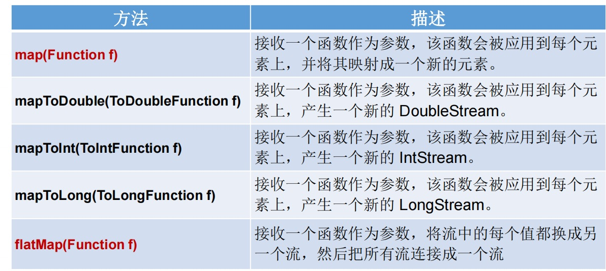
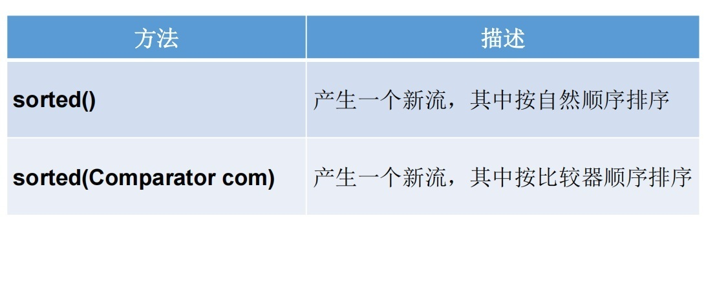
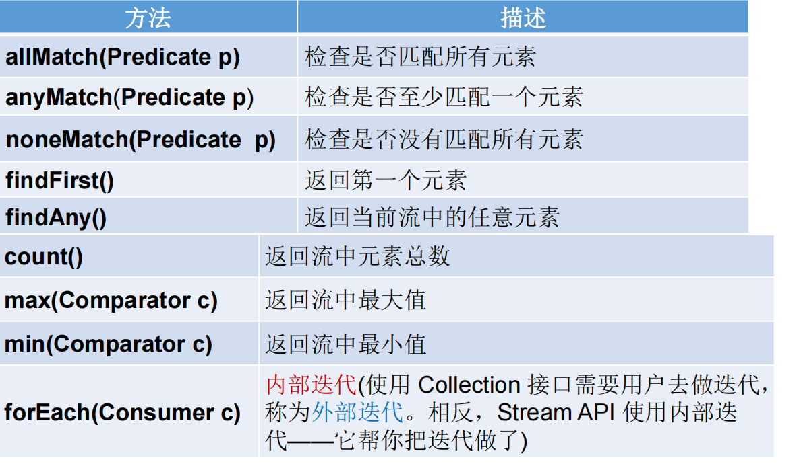
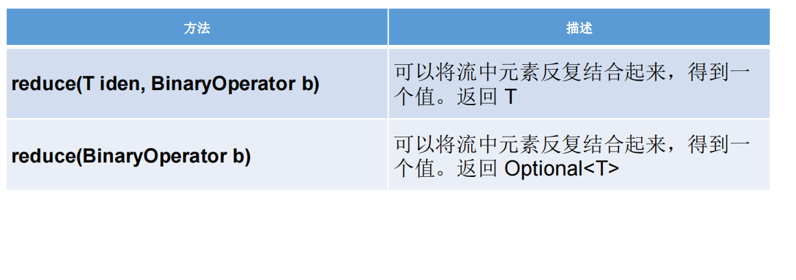
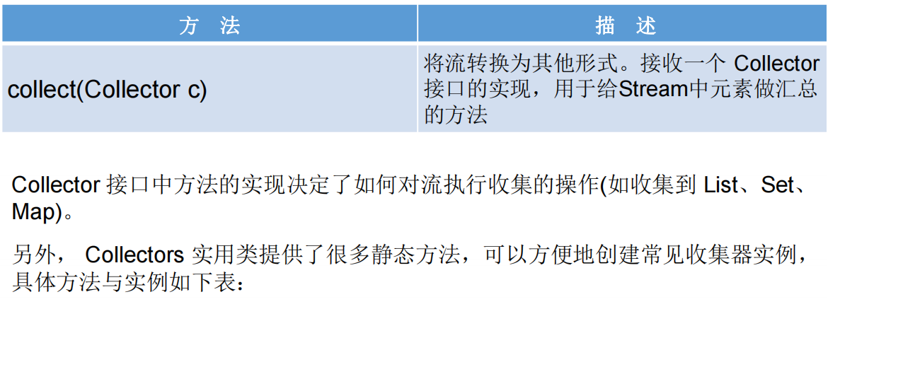

# 16.JDK8特性


## 16.1 Lambda表达式

:::tip <font color='red'>Lambda表达式</font>
<font color='red'>Lambda 是一个匿名函数</font>，我们可以把 **Lambda 表达式**理解为是**一段可以传递的代码**（将代码像数据一样进行传递）。使用它可以写出更简洁、更灵活的代码。作为一种更紧凑的代码风格，使Java的语言表达能力得到了提升。

Lambda 表达式：在Java 8 语言中引入的一种新的语法元素和操作符  
这个操作符为 “<font color='red' size=5>**->**</font>” ， 该操作符被称为 <font color='blue'>**Lambda 操作符或箭头操作符**</font>  
它将 Lambda 分为两个部分：  
<font color='blue'>左侧</font> ：指定了 Lambda 表达式需要的<font color='blue'>参数列表</font>   
<font color='blue'>右侧</font> ：指定了 Lambda 体，是抽象方法的实现逻辑，也即<font color='blue'>Lambda 表达式要执行的功能 </font>  
:::


:::warning <font color='red'>Lambda 表达式：语法</font>
<font color='blue'><strong>语法格式一：无参，无返回值</strong></font>

```java
    @Test
    public void method1(){
        Runnable runnable=new Runnable() {
            @Override
            public void run() {
                System.out.println("我山东在吃饭！");
            }
        };
        runnable.run();
        System.out.println("------------------------");
        Runnable runnable2=()->System.out.println("你在北京吃饭！");
        runnable2.run();
    }
```
<font color='blue'><strong>语法格式二：Lambda 需要一个参数，但是没有返回值</strong></font>

```java
    @Test
    public void method2(){
        final String[] msg = new String[2];
        Consumer<String> consumer=new Consumer<String>() {
            @Override
            public void accept(String str) {
                System.out.println(str);
                msg[0] =str;
            }
        };
        consumer.accept("谎言和誓言的区别是什么？");
        System.out.println("------------------------------------");
        Consumer<String> consumer1=(str)->{
            System.out.println(str);
            msg[1] =str;
        };
        consumer1.accept("一个是听得人当真了，一个是说的人当真了");
        System.out.println("------------------------------------");
        //
        Arrays.asList(msg).forEach( str->System.out.println(str));
    }
```
<font color='blue'><strong>语法格式三：数据类型可以省略，因为可由编译器推断得出，称为“类型推断”</strong></font>

```java
     Arrays.asList(msg).forEach( str->System.out.println(str));
```
<font color='blue'><strong>语法格式四：Lambda 若只需要一个参数时，参数的小括号可以省略</strong></font>

```java
     Arrays.asList(msg).forEach( str->System.out.println(str));
```
<font color='blue'><strong>语法格式五：Lambda 需要两个或以上的参数，多条执行语句，并且可以有返回值</strong></font>

```java
    @Test
    public void method3(){
        Comparator comparator=new Comparator<Integer>() {
            @Override
            public int compare(Integer o1, Integer o2) {
                return o1>o2?1:0;
            }
        };
        System.out.println(comparator.compare(1,2));
        System.out.println("------------------------------------");
        Comparator<Integer> comparator1=(o1, o2)->{
            if(o1>o2){
                return 1;
            }else{
                return 0;
            }
        };
        System.out.println(comparator.compare(1,2));
        Comparator<Integer> comparator2=(o1, o2)-> o1>o2?1:0;
        System.out.println(comparator.compare(1,2));
    }
```
<font color='blue'><strong>语法格式六：当 Lambda 体只有一条语句时，return 与大括号若有，都可以省略</strong></font>
```java
        Comparator<Integer> comparator2=(o1, o2)-> o1>o2?1:0;
        System.out.println(comparator.compare(1,2));
```
:::

## 16.2 函数式(Functional)接口

:::warning 函数式接口
1. <font color='blue'><strong>只包含一个抽象方法的接口，称为函数式接口</strong></font> 
2. 你可以通过 Lambda 表达式来创建该接口的对象。（若 Lambda 表达式抛出一个受检异常(即：非运行时异常)，那么该异常需要在目标接口的抽象方法上进行声明）。
3. 我们可以在一个接口上使用 <font color='red'><strong>@FunctionalInterface 注解</strong></font>，这样做可以检查它是否是一个函数式接口。同时 javadoc 也会包含一条声明，说明这个接口是一个函数式接口
4. <font color='red'><strong>在java.util.function包下定义了Java 8 的丰富的函数式接口</strong></font>
:::

:::tip  理解函数式接口
1. Java从诞生日起就是一直倡导“一切皆对象”，在Java里面面向对象(OOP)编程是一切。但是随着python、scala等语言的兴起和新技术的挑战，Java不得不做出调整以便支持更加广泛的技术要求，也即<font color='blue'><strong>java不但可以支持OOP还可以支持OOF（面向函数编程）</strong></font> 
2. 在函数式编程语言当中，函数被当做一等公民对待。在将函数作为一等公民的编程语言中，Lambda表达式的类型是函数。但是在Java8中，有所不同。在Java8中，Lambda表达式是对象，而不是函数，它们必须依附于一类特别的对象类型——<font color='blue'><strong>函数式接口</strong></font>。 
3. 简单的说，在Java8中，<font color='blue'><strong>Lambda表达式就是一个函数式接口的实例</strong></font>。这就是Lambda表达式和函数式接口的关系。也就是说，只要<font color='blue'><strong>一个对象是函数式接口的实例，那么该对象就可以用Lambda表达式来表示</strong></font>。
4. <font color='blue'><strong>所以以前用匿名实现类表示的现在都可以用Lambda表达式来写</strong></font>
:::

### 16.2.1 Java内置四大核心函数式接口
<a data-fancybox title="Function" href="../image/Function.jpg"></a>

### 16.2.2 Consumer&lt;T&gt; 消费型接口
```java
    //Consumer<T> 消费型接口
    @Test
    public void method1(){
        Consumer consumer=new Consumer<String>() {
            @Override
            public void accept(String o) {
                System.out.println("我喜欢漂亮的的"+o);
            }
        };
        consumer.accept("女人");
        Consumer consumer1=str-> System.out.println("我喜欢漂亮的的"+str);
        consumer1.accept("玫瑰花");

        Consumer consumer2=System.out::println;
        //方法引用
        consumer2.accept("面朝大海，春暖花开！");
    }
```
### 16.2.3 Supplier&lt;T&gt;供给型接口

```java
  @Test
    public void method2(){
        Supplier<List> supplier=new Supplier<List>() {
            @Override
            public List get() {
                System.out.println("生成一个list");
                ArrayList arrayList=new ArrayList<String>();
                return arrayList;
            }
        };
        supplier.get();
        Supplier<List> supplier1=()->new ArrayList<String>();
        ArrayList arrayList=(ArrayList) supplier1.get();
        arrayList.add("田起凯");

    }
    //省略if else的写法
    public String method3(Integer choosenUserId){
        Supplier<String> supplier1=()->"调用方法一";
        Supplier<String> supplier2=()->"调用方法二";
        Supplier<String> supplier3=()->"调用方法三";
        HashMap<Integer, Supplier> integerSupplierHashMap = new HashMap<>();
        integerSupplierHashMap.put(1,supplier1);
        integerSupplierHashMap.put(2,supplier2);
        integerSupplierHashMap.put(3,supplier3);
        choosenUserId =  Optional.ofNullable(choosenUserId).filter(c->c==1||c==2).orElse(3);
        return  (String) integerSupplierHashMap.get(choosenUserId).get();
    }
```
### 16.2.4 Predicate&lt;T&gt; 断定型接口
```java
    @Test
    public void method4(){
        //Predicate<T> 断定型接口
        Predicate<String> predicate=new Predicate<String>() {
            @Override
            public boolean test(String s) {
                if(s.contains("京")){
                    return true;
                }
                return false;
            }
        };
        System.out.println(predicate.test("北京"));
        Predicate<String> predicate1=(str)->{
            if(str.contains("东")){
                return true;
            }
            return false;
        };
        System.out.println(predicate1.test("济南"));
    }
```
### 16.2.5 Function&lt;T, R&gt;函数型接口

```java
    @Test
    public void method5(){
        Function function=new Function() {
            @Override
            public Object apply(Object o) {
                if(o instanceof Person){
                    return true;
                }
                return false;
            }
        };
        System.out.println(function.apply(new Person()));
        Function function1=(o)->{
            if(o instanceof Person){
                return true;
            }
            return false;
        };
        System.out.println(function1.apply(new Person()));
    }
```
<a data-fancybox title="OtherFunction" href="../image/OtherFunction.jpg"></a>


## 16.3 方法引用与构造器引用

:::tip 方法引用(Method References)
1. 当要传递给Lambda体的操作，已经有实现的方法了，可以使用方法引用！
2. 方法引用可以看做是Lambda表达式深层次的表达。换句话说，方法引用就是Lambda表达式，也就是函数式接口的一个实例，通过方法的名字来指向一个方法，可以认为是Lambda表达式的一个语法糖。
3. 要求：实现接口的抽象方法的参数列表和返回值类型，必须与方法引用的方法的参数列表和返回值类型保持一致！  
▷ 格式：使用操作符 “<font color=red>::</font>” 将类(或对象) 与 方法名分隔开来。  
4. 如下三种主要使用情况：   
<font color=red>▷ 对象::实例方法名</font>  
<font color=red>▷ 类::静态方法名</font>  
<font color=red>▷ 类::实例方法名</font>  

```java
/**
 * 方法引用的使用
 *
 * 1.使用情境：当要传递给Lambda体的操作，已经有实现的方法了，可以使用方法引用！
 *
 * 2.方法引用，本质上就是Lambda表达式，而Lambda表达式作为函数式接口的实例。所以
 *   方法引用，也是函数式接口的实例。
 *
 * 3. 使用格式：  类(或对象) :: 方法名
 *
 * 4. 具体分为如下的三种情况：
 *    情况1     对象 :: 非静态方法
 *    情况2     类 :: 静态方法
 *
 *    情况3     类 :: 非静态方法
 *
 * 5. 方法引用使用的要求：要求接口中的抽象方法的形参列表和返回值类型与方法引用的方法的
 *    形参列表和返回值类型相同！（针对于情况1和情况2）
 **/
public class MethodRefTest {
    // 情况一：对象 :: 实例方法
    //Consumer中的void accept(T t)
    //PrintStream中的void println(T t)

    @Test
    public void method1(){
        Consumer<String> consumer=(str)-> System.out.println(str);
        consumer.accept("北京");

        Consumer<String> consumer1=System.out::println;
        consumer1.accept("杭州");
    }

    //Supplier中的T get()
    //Employee中的String getName()
    @Test
    public void method2() {
        Employee employee = new Employee();
        employee.setName("成都");
        Supplier<String> supplier=()->employee.getName();
        System.out.println(supplier.get());
        Supplier<String> supplier1=employee::getName;
        System.out.println(supplier1.get());
    }
    // 情况二：类 :: 静态方法
    //Comparator中的int compare(T t1,T t2)
    //Integer中的int compare(T t1,T t2)
    @Test
    public void method3() {
        Comparator<Integer> comparator=(o1,o2)->Integer.compare(o1,o2);
        System.out.println(comparator.compare(1,2));
        Comparator<Integer> comparator1=Integer::compare;
        System.out.println(comparator1.compare(1,2));
    }

    //Function中的R apply(T t)
    //Math中的Long round(Double d)
    @Test
    public void method4() {
        Function<Double, Number> function=(d1)-> Math.round(d1);
        System.out.println(function.apply(12.5));
        Function<Double, Number> function1=Math::round;
        System.out.println(function1.apply(12.35));
    }

    // 情况三：类 :: 实例方法  (有难度)
    // Comparator中的int comapre(T t1,T t2)
    // String中的int t1.compareTo(t2)
    @Test
    public void method5() {
        Comparator<String> com1 = (s1,s2) -> s1.compareTo(s2);
        System.out.println(com1.compare("abc","abd"));

        System.out.println("*******************");

        Comparator<String> com2 = String :: compareTo;
        System.out.println(com2.compare("abd","abm"));
    }

    //BiPredicate中的boolean test(T t1, T t2);
    //String中的boolean t1.equals(t2)
    @Test
    public void test6() {
        BiPredicate<String,String> pre1 = (s1, s2) -> s1.equals(s2);
        System.out.println(pre1.test("abc","abc"));

        System.out.println("*******************");
        BiPredicate<String,String> pre2 = String :: equals;
        System.out.println(pre2.test("abc","abd"));
    }


    // Function中的R apply(T t)
    // Employee中的String getName();
    @Test
    public void test7() {
        Employee employee = new Employee(1001, "Jerry", 23, 6000);


        Function<Employee,String> func1 = e -> e.getName();
        System.out.println(func1.apply(employee));

        System.out.println("*******************");


        Function<Employee,String> func2 = Employee::getName;
        System.out.println(func2.apply(employee));


    }
}
```
### 16.3.1 格式： ClassName::new 
:::warning 构造器引用
与函数式接口相结合，自动与函数式接口中方法兼容。
可以把构造器引用赋值给定义的方法，要求构造器参数列表要与接口中抽象方法的参数列表一致！且方法的返回值即为构造器对应类的对象。
:::

```java
    @Test
    public void method1(){
        Supplier employeeSupplie=()->new Employee();
        Employee employee= (Employee) employeeSupplie.get();
        employee.setName("玛丽");
        System.out.println(employee.getName());
        Supplier employeeSupplie1=Employee::new;

        Employee employee1= (Employee) employeeSupplie1.get();
        employee1.setName("超级玛丽");
        System.out.println(employee1.getName());
    }
    @Test
    public void method2(){
        Function<Integer,Employee> function11=(id)->new Employee(id);
        Employee employee11=function11.apply(1001);
        System.out.println(employee11.getId());
        System.out.println("*******************");
        BiFunction<Integer, String,Employee> function=(id, name)->new Employee(id,name);
        Employee employee=function.apply(1001,"Tom");
        System.out.println(employee.getName());
        System.out.println("*******************");
        BiFunction<Integer, String,Employee> function1=Employee::new;
        Employee employee1=function1.apply(1001,"Tom");
        System.out.println(employee1.getName());
    }
```
### 16.3.1 数组引用 格式： type[] :: new

```java
    @Test
    public void method3(){
        Function<Integer,String[]> function11=(num)->new String[num];
        String[] strings=function11.apply(3);
        Arrays.asList(strings).forEach(str-> System.out.println(str));
    }
```

## 16.4 强大的Stream API

:::tip Stream API说明
1. Java8中有两大最为重要的改变。第一个是 <font color=red size=4>Lambda 表达式</font>；另外一个则是 <font color=red size=4>Stream API</font>。 
2. <font color=red size=4>Stream API ( java.util.stream)</font> 把真正的函数式编程风格引入到Java中。这是目前为止对Java类库最好的补充，因为Stream API可以极大提供Java程序员的生产力，让程序员写出高效率、干净、简洁的代码。
3. <font color=red size=4>Stream</font> 是 Java8 中处理集合的关键抽象概念，它可以指定你希望对集合进行的操作，可以执行非常复杂的查找、过滤和映射数据等操作。 <font color=red size=4>使用Stream API 对集合数据进行操作，就类似于使用 SQL 执行的数据库查询</font>。也可以使用 Stream API 来并行执行操作。简言之，Stream API 提供了一种高效且易于使用的处理数据的方式。
:::


:::warning <font color=red size=4>为什么要使用StreamAPI</font>
1. 实际开发中，项目中多数数据源都来自于Mysql，Oracle等。但现在数据源可以更多了，有MongDB，Radis等，而这些NoSQL的数据就需要Java层面去处理。 
2. Stream 和 Collection 集合的区别：Collection 是一种静态的内存数据结构，而 Stream 是有关计算的。前者是主要面向内存，存储在内存中，后者主要是面向 CPU，通过 CPU 实现计算。 

<font color=red size=4>Stream到底是什么呢？</font>  
是数据渠道，用于操作数据源（集合、数组等）所生成的元素序列。  
<font color=red size=4>“集合讲的是数据，Stream讲的是计算！”</font>  
注意：  
①Stream 自己不会存储元素。   
②Stream 不会改变源对象。相反，他们会返回一个持有结果的新Stream。   
③Stream 操作是延迟执行的。这意味着他们会等到需要结果的时候才执行。   
:::


:::danger Stream 的操作三个步骤
1. <font color=red size=4>创建 Stream</font>    
一个数据源（如：集合、数组），获取一个流  
2. <font color=red size=4>中间操作 </font>   
一个中间操作链，对数据源的数据进行处理  
3.<font color=red size=4> 终止操作(终端操作)</font>     
一旦执行终止操作，就执行中间操作链，并产生结果。之后，不会再被使用  
:::
### 16.4.1 创建Stream方式

:::warning  创建Stream方式
#### 16.4.1.1 通过集合
Java8 中的 Collection 接口被扩展，提供了两个获取流的方法：   
<font color=red size=4>▷ default Stream&lt;E&gt; stream()</font> : 返回一个顺序流  
<font color=red size=4>▷ default Stream&lt;E&gt; parallelStream()</font> : 返回一个并行流  

```java
    //通过集合创建
    @Test
    public void method1(){
        ArrayList list=new ArrayList<String>();
        list.add("小明");
        list.add("小花");
        list.add("小刘");
        list.add("小猫");
        list.stream().forEach(System.out::println);
        System.out.println();
        list.parallelStream().forEach(System.out::println);
    }
```
#### 16.4.1.2 通过数组
Java8 中的 Arrays 的静态方法 stream() 可以获取数组流：  
<font color=red size=4>▷ static &lt;T&gt; Stream&lt;T&gt; stream(T[] array) </font>   
**返回一个流重载形式，能够处理对应基本类型的数组：**  
▷ public static IntStream stream(int[] array)  
▷ public static LongStream stream(long[] array)  
▷ public static DoubleStream stream(double[] array)  

```java
    //通过数组创建
    @Test
    public void method2(){
        String[] strings={"1","2","3","4","5"};
        Arrays.stream(strings).forEach(System.out::println);
    }
```
#### 16.4.1.3 通过Stream的of()
可以调用Stream类静态方法 of(), 通过显示值创建一个流。它可以接收任意数量的参数。  
<font color=red size=4>▷ public static&lt;T&gt; Stream&lt;T&gt; of(T... values) </font>: 返回一个流  

```java
    //通过stream of创建
    @Test
    public void method3(){
        Stream<String> stringStream = Stream.of("1", "2", "3", "4", "5");
        stringStream.filter(e->e!="2").forEach(System.out::println);
    }
```
#### 16.4.1.4 创建无限流
可以使用静态方法 Stream.iterate() 和 Stream.generate(), 创建无限流。  
▷ 迭代  
<font color=red size=4>public static&lt;T&gt; Stream&lt;T&gt; iterate(final T seed, final UnaryOperator&lt;T&gt; f) </font>    
▷ 生成  
<font color=red size=4>public static&lt;T&gt; Stream&lt;T&gt; generate(Supplier&lt;T&gt; s) </font>  

```java
    //通过无限流创建
    @Test
    public void method4(){
//      迭代
//      public static<T> Stream<T> iterate(final T seed, final UnaryOperator<T> f)
        //遍历前10个偶数
        Stream.iterate(0, t -> t + 2).limit(10).forEach(System.out::println);


//      生成
//      public static<T> Stream<T> generate(Supplier<T> s)
        Stream.generate(Math::random).limit(10).forEach(System.out::println);

    }
```
:::

### 16.4.2 Stream 的中间操作
多个中间操作可以连接起来形成一个流水线，除非流水线上触发终止操作，否则中间操作不会执行任何的处理！而在终止操作时一次性全部处理，称为“惰性求值”。  
#### 16.4.2.1-筛选与切片
<a data-fancybox title="筛选与切片" href="../image/shaixuan.jpg"></a>

```java
   @Test
    public  void method1(){
        List<Employee> employees = EmployeeData.getEmployees();
        employees.stream().forEach(System.out::println);
        System.out.println("****************************************************************************");
        //filter(Predicate p) 接收 Lambda ， 从流中排除某些元素
        employees.stream().filter(e->e.getId()!=1001).forEach(e-> System.out.println(e));
        System.out.println("****************************************************************************");
        //distinct() 筛选，通过流所生成元素的 hashCode() 和 equals() 去除重复元素
        employees.add(new Employee(1010, "比尔盖茨", 42, 9500.43));
        employees.add(new Employee(1010, "比尔盖茨", 42, 9500.43));
        employees.add(new Employee(1010, "比尔盖茨", 42, 9500.43));
        employees.stream().distinct().forEach(e-> System.out.println(e));
        System.out.println("****************************************************************************");
        //limit(long maxSize) 截断流，使其元素不超过给定数量
        employees.stream().limit(5).forEach(e-> System.out.println(e));
        System.out.println("****************************************************************************");
        //skip(long n) 跳过元素，返回一个扔掉了前 n 个元素的流。若流中元素不足 n 个，则返回一 个空流。与 limit(n) 互补
        employees.stream().skip(5).forEach(e-> System.out.println(e));
    }
```
#### 16.4.2.2-映射
<a data-fancybox title="映射" href="../image/yingshe.jpg"></a>
 
 ```java
     @Test
    public void method2(){
        //map(Function f)——接收一个函数作为参数，将元素转换成其他形式或提取信息，该函数会被应用到每个元素上，并将其映射成一个新的元素。
        List<String> list = Arrays.asList("aa", "bb", "cc", "dd");
        list.stream().map(str -> str.toUpperCase()).forEach(System.out::println);

        System.out.println();
        list.stream().map(StreamAPITest1::strtostr2).forEach(System.out::println);
        //
        list.stream().map(StreamAPITest1::fromStringToStream).forEach(System.out::println);
        System.out.println();

    }
    //将字符串中的多个字符构成的集合转换为对应的Stream的实例
    public static Stream<Character> fromStringToStream(String str){//aa
        ArrayList<Character> list = new ArrayList<>();
        for(Character c : str.toCharArray()){
            list.add(c);
        }
        return list.stream();
    }
    //
    public static String strtostr2(String str){
        switch (str){
            case("aa"):
                str="小明";
                break;
            case("bb"):
                str="小话";
                break;
            case("cc"):
                str="小诗";
                break;
            default:
                str="小山";
                break;
        }
        return str;
    }
```
#### 16.4.2.3-排序
<a data-fancybox title="排序" href="../image/paixu.jpg"></a>

```java
   @Test
    public void method3(){
        //        sorted()——自然排序
        List<Integer> list = Arrays.asList(12, 43, 65, 34, 87, 0, -98, 7);
        list.stream().sorted().forEach(System.out::println);
        //抛异常，原因:Employee没有实现Comparable接口
//        List<Employee> employees = EmployeeData.getEmployees();
//        employees.stream().sorted().forEach(System.out::println);


//        sorted(Comparator com)——定制排序
        List<Employee> employees = EmployeeData.getEmployees();
        employees.stream().sorted((e1,e2)->{
            int compare=Integer.compare(e1.getAge(),e2.getAge());
            if(compare!=0){
                return compare;
            }else{
                return -Double.compare(e1.getSalary(),e2.getSalary());
            }
        }).forEach(System.out::println);
    }
```

### 16.4.3 Stream 的终止操作
#### 16.4.3.1-匹配与查找
<a data-fancybox title="匹配与查找" href="../image/chazhao.png"></a>

```java

    //1-匹配与查找
    @Test
    public void test1(){
        List<Employee> employees = EmployeeData.getEmployees();

//        allMatch(Predicate p)——检查是否匹配所有元素。
//          练习：是否所有的员工的年龄都大于18
        boolean allMatch = employees.stream().allMatch(e -> e.getAge() > 18);
        System.out.println(allMatch);

//        anyMatch(Predicate p)——检查是否至少匹配一个元素。
//         练习：是否存在员工的工资大于 10000
        boolean anyMatch = employees.stream().anyMatch(e -> e.getSalary() > 10000);
        System.out.println(anyMatch);

//        noneMatch(Predicate p)——检查是否没有匹配的元素。
//          练习：是否存在员工姓“雷”
        boolean noneMatch = employees.stream().noneMatch(e -> e.getName().startsWith("雷"));
        System.out.println(noneMatch);
//        findFirst——返回第一个元素
        Optional<Employee> employee = employees.stream().findFirst();
        System.out.println(employee);
//        findAny——返回当前流中的任意元素
        Optional<Employee> employee1 = employees.parallelStream().findAny();
        System.out.println(employee1);

    }
```

#### 16.4.3.2-归约
<a data-fancybox title="归约" href="../image/guiyue.png"></a>

```java
    //2-归约
    @Test
    public void test3(){
//        reduce(T identity, BinaryOperator)——可以将流中元素反复结合起来，得到一个值。返回 T
//        练习1：计算1-10的自然数的和
        List<Integer> list = Arrays.asList(1,2,3,4,5,6,7,8,9,10);
        Integer sum = list.stream().reduce(0, Integer::sum);
        System.out.println(sum);


//        reduce(BinaryOperator) ——可以将流中元素反复结合起来，得到一个值。返回 Optional<T>
//        练习2：计算公司所有员工工资的总和
        List<Employee> employees = EmployeeData.getEmployees();
        Stream<Double> salaryStream = employees.stream().map(Employee::getSalary);
//        Optional<Double> sumMoney = salaryStream.reduce(Double::sum);
        Optional<Double> sumMoney = salaryStream.reduce((d1,d2) -> d1 + d2);
        System.out.println(sumMoney.get());

    }
```
#### 16.4.3.3-收集
<a data-fancybox title="收集" href="../image/shouji.png"></a> 

```java
public class StreamAPITest2 {

    @Test
    public void test2(){
        List<Employee> employees = EmployeeData.getEmployees();
        // count——返回流中元素的总个数
        long count = employees.stream().filter(e -> e.getSalary() > 5000).count();
        System.out.println(count);
//        max(Comparator c)——返回流中最大值
//        练习：返回最高的工资：
        Stream<Double> salaryStream = employees.stream().map(e -> e.getSalary());
        Optional<Double> maxSalary = salaryStream.max(Double::compare);
        System.out.println(maxSalary);
//        min(Comparator c)——返回流中最小值
//        练习：返回最低工资的员工
        Optional<Employee> employee = employees.stream().min((e1, e2) -> Double.compare(e1.getSalary(), e2.getSalary()));
        System.out.println(employee);
        System.out.println();
//        forEach(Consumer c)——内部迭代
        employees.stream().forEach(System.out::println);

        //使用集合的遍历操作
        employees.forEach(System.out::println);
    }


    //3-收集
    @Test
    public void test4(){
//        collect(Collector c)——将流转换为其他形式。接收一个 Collector接口的实现，用于给Stream中元素做汇总的方法
//        练习1：查找工资大于6000的员工，结果返回为一个List或Set

        List<Employee> employees = EmployeeData.getEmployees();
        List<Employee> employeeList = employees.stream().filter(e -> e.getSalary() > 6000).collect(Collectors.toList());

        employeeList.forEach(System.out::println);
        System.out.println();
        Set<Employee> employeeSet = employees.stream().filter(e -> e.getSalary() > 6000).collect(Collectors.toSet());

        employeeSet.forEach(System.out::println);
    }
}
```
## 16.5 Optional类

1. Optional&lt;T>&gt; 类(java.util.Optional) 是一个容器类，它可以保存类型T的值，代表这个值存在。或者仅仅保存null，表示这个值不存在。原来用 null 表示一个值不存在，现在 Optional 可以更好的表达这个概念。并且可以避免空指针异常。 
2. Optional类的Javadoc描述如下：这是一个可以为null的容器对象。如果值存在则isPresent()方法会返回true，调用get()方法会返回该对象。

### 16.5.1 创建Optional类对象的方法
:::tip Optional提供很多有用的方法，这样我们就不用显式进行空值检测  
<font color=red><strong>▷ Optional.of(T t)</strong></font> : 创建一个 Optional 实例，t必须非空；  
<font color=red><strong>▷ Optional.empty()</strong></font> : 创建一个空的 Optional 实例  
<font color=red><strong>▷ Optional.ofNullable(T t)</strong></font>：t可以为null  

```java
/*
Optional.of(T t) : 创建一个 Optional 实例，t必须非空；
Optional.empty() : 创建一个空的 Optional 实例
Optional.ofNullable(T t)：t可以为null

 */
    @Test
    public void test1(){
        Girl girl = new Girl();
//        girl=null;
//        Optional.of(girl);//java.lang.NullPointerException

        Optional.of(girl);
    }

    @Test
    public void test2(){
        Girl girl = new Girl();
        girl = null;
        //ofNullable(T t)：t可以为null
        Optional<Girl> optionalGirl = Optional.ofNullable(girl);
        System.out.println(optionalGirl);
        //orElse(T t1):如果单前的Optional内部封装的t是非空的，则返回内部的t.
        //如果内部的t是空的，则返回orElse()方法中的参数t1.
        Girl girl1 = optionalGirl.orElse(new Girl("赵丽颖"));
        System.out.println(girl1);

    }
```
### 16.5.2 判断Optional容器中是否包含对象：  
<font color=red><strong>▷ boolean isPresent()</strong></font> : 判断是否包含对象  
<font color=red><strong>▷ void ifPresent(Consumer<? super T> consumer)</strong></font> ：如果有值，就执行Consumer接口的实现代码，并且该值会作为参数传给它。  
3. 获取Optional容器的对象：  
<font color=red><strong>▷ T get()</strong></font>: 如果调用对象包含值，返回该值，否则抛异常  
<font color=red><strong>▷ T orElse(T other)</strong></font> ：如果有值则将其返回，否则返回指定的other对象。  
<font color=red><strong>▷ T orElseGet(Supplier<? extends T> other)</strong></font> ：如果有值则将其返回，否则返回由Supplier接口实现提供的对象。  

```java
    //使用Optional类的getGirlName():
    public String getGirlName2(Boy boy){

        Optional<Boy> boyOptional = Optional.ofNullable(boy);
        //此时的boy1一定非空
        Boy boy1 = boyOptional.orElse(new Boy(new Girl("迪丽热巴")));

        Girl girl = boy1.getGirl();

        Optional<Girl> girlOptional = Optional.ofNullable(girl);
        //girl1一定非空
        Girl girl1 = girlOptional.orElse(new Girl("古力娜扎"));

        return girl1.getName();
    }

    @Test
    public void test5(){
        Boy boy = null;
        boy = new Boy();
        boy = new Boy(new Girl("苍老师"));
        String girlName = getGirlName2(boy);
        System.out.println(girlName);

    }
```

<font color=red><strong>▷ T orElseThrow(Supplier<? extends X> exceptionSupplier)</strong></font> ：如果有值则将其返回，否则抛出由Supplier接口实现提供的异常

```java
    @Test
    public void test3() throws Exception {
        Girl girl = new Girl();
        girl = null;
        //ofNullable(T t)：t可以为null
        Optional<Girl> optionalGirl = Optional.ofNullable(girl);
        optionalGirl.orElseThrow( ()->new Exception("girl不能为空"));
    }
```  
:::