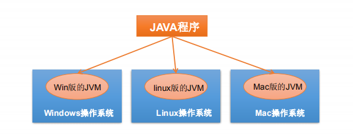

# JAVA基础学习

[[toc]]

``` js
export default {
  name: 'MyComponent',
  // ...
}
```

``` html
<ul>
  <li
    v-for="todo in todos"
    :key="todo.id"
  >
    {{ todo.text }}
  </li>
</ul>
```

``` js{1,4,6-7}
export default { // Highlighted
  data () {
    return {
      msg: `Highlighted!
      This line isn't highlighted,
      but this and the next 2 are.`,
      motd: 'VuePress is awesome',
      lorem: 'ipsum',
    }
  }
}
```
```java
    public boolean equalsIgnoreCase(String anotherString) {
        return (this == anotherString) ? true
                : (anotherString != null)
                && (anotherString.value.length == value.length)
                && regionMatches(true, 0, anotherString, 0, value.length);
    }
```
