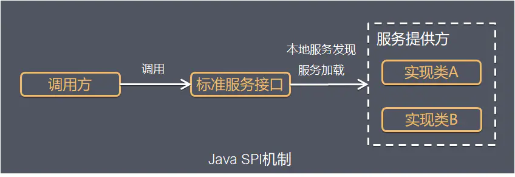
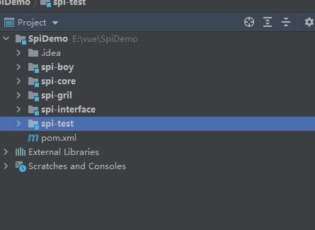

# 19. SPI机制

## 19.1 SPI是什么

SPI全称Service Provider Interface，是Java提供的一套用来`被第三方实现或者扩展的API`，它可以用来启用框架扩展和替换组件。



Java SPI 实际上是`基于接口的编程＋策略模式＋配置文件`组合实现的动态加载机制。

SPI的全名为Service Provider Interface.java spi机制的思想: 系统里抽象的各个模块，往往有很多不同的实现方案，在面向的对象的设计里，一般推荐模块之间基于接口编程，模块之间不对实现类进行硬编码。一旦代码里涉及具体的实现类，就违反了可拔插的原则，如果需要替换一种实现，就需要修改代码。为了实现在模块装配的时候能不在程序里动态指明，这就需要一种服务发现机制

## 19.2 实例代码

java spi的具体约定为:当服务的提供者，提供了服务接口的一种实现之后，在jar包的META-INF/services/目录里同时创建一个以服务接口命名的文件。

该文件里就是实现该服务接口的具体实现类。而当外部程序装配这个模块的时候，就能通过该jar包META-INF/services/里的配置文件找到具体的实现类名，并装载实例化，完成模块的注入。 

基于这样一个约定就能很好的找到服务接口的实现类，而不需要再代码里制定。jdk提供服务实现查找的一个工具类：java.util.ServiceLoader



------------------------------------------

- spi-interface: 是针对厂商定义的接口项目，只提供接口，不提供实现
- spi-boy/spi-gril: 分别是两个厂商对interface的不同实现，所以他们会依赖于interface项目
- spi-core: 是提供给用户使用的核心jar文件, 同样依赖于interface项目, 用户使用时需要引入spi-core.jar和厂商具体实现的jar
- spi-test:用来模拟用户测试, 依赖spi-core和spi-boy/spi-gril(至少一个实现,否则会报错)

### 19.2.1  spi-interface

```java
package com.tqk.spi;

public interface People {
    void people();
}

```

### 19.2.2  spi-boy

```java
package com.tqk.spi;

/**
 * @author tianqikai
 */
public class Boy implements People {
    @Override
    public void people() {
        System.out.println("我是一个男孩！");
    }
}
```
-------------

```java
META-INF/services/
//文件名
com.tqk.spi.People
//文件内容
com.tqk.spi.Boy
```

### 19.2.3  spi-gril

```java
package com.tqk.spi;

/**
 * @author tianqikai
 */
public class Girl implements People {
    @Override
    public void people() {
        System.out.println("我是一个女孩！");
    }
}
```

```java
META-INF/services/
//文件名
com.tqk.spi.People
//文件内容
com.tqk.spi.Girl
```
### 19.2.4  spi-core

```java
package com.tqk.spi;

import java.util.Iterator;
import java.util.ServiceLoader;

/**
 * @author tianqikai
 */
public class PeopleFactory {
    public void invoker(){
        ServiceLoader<People> load = ServiceLoader.load(People.class);
        Iterator<People> peopleIterator = load.iterator();
        boolean notFound=true;
        while(peopleIterator.hasNext()){
            notFound=false;
            People people = peopleIterator.next();
            people.people();

        }
        if (notFound) {
            throw new RuntimeException("未发现实现类");
        }
    }
}
```
### 19.2.5  spi-test

```java
package com.tqk;

import com.tqk.spi.PeopleFactory;

/**
 * @author tianqikai
 */
public class Test {
    public static void main(String[] args) {
        PeopleFactory peopleFactory = new PeopleFactory();
        peopleFactory.invoker();

    }
}
```

## 19.3 使用场景

> 适用于：**调用者根据实际使用需要，启用、扩展、或者替换框架的实现策略**

:::tip 应用场景
1. **JDBC加载不同类型的驱动**
2. SLF4J对log4j/logback的支持
3. Spring中大量使用了SPI,比如：对servlet3.0规范对ServletContainerInitializer的实现、自动类型转换Type Conversion SPI(Converter SPI、Formatter SPI)等
4. Dubbo中也大量使用SPI的方式实现框架的扩展, 不过它对java提供的原生SPI做了封装
5. 更多应用场景需要大家一起去发现，或者自己使用SPI机制实现代码的**解耦**
:::

-------------------

> 实际开发中应用场景：
> 
> 对接商品房缴纳保证金：无锡，西安，济南，青岛，杭州
> 
> 对接接口基本都是一样的，但是实现可能有差异。可以实现SPI方式
