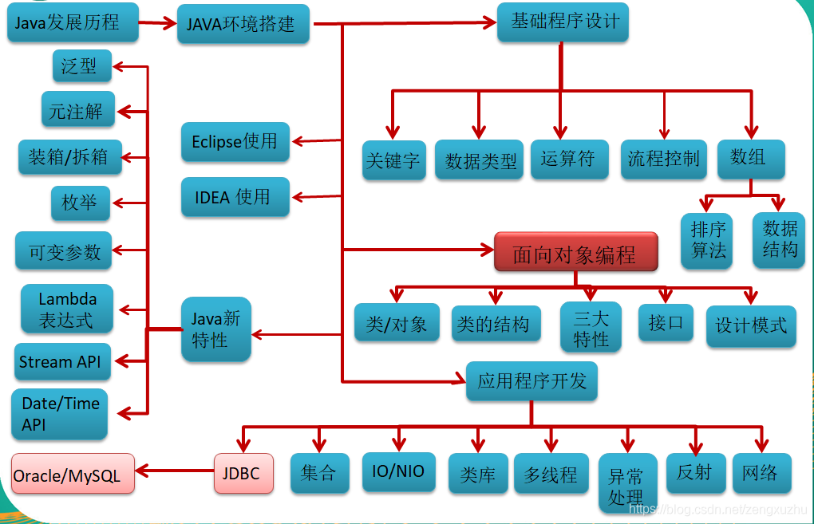
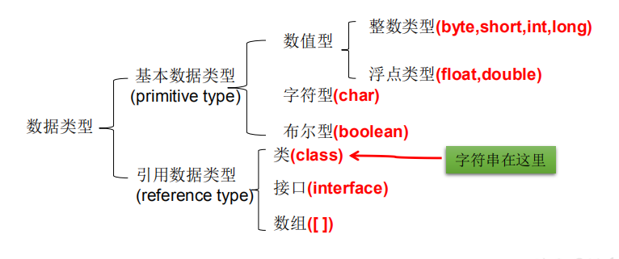
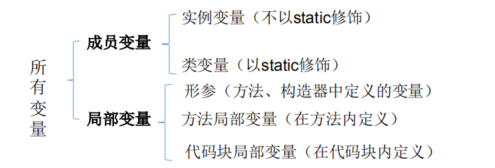
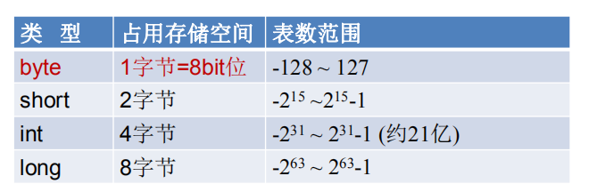
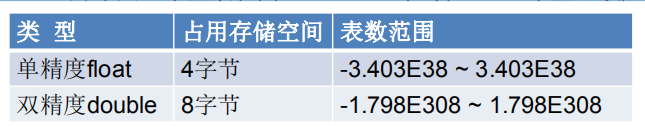
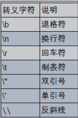
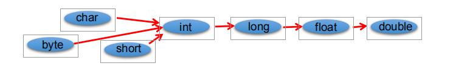
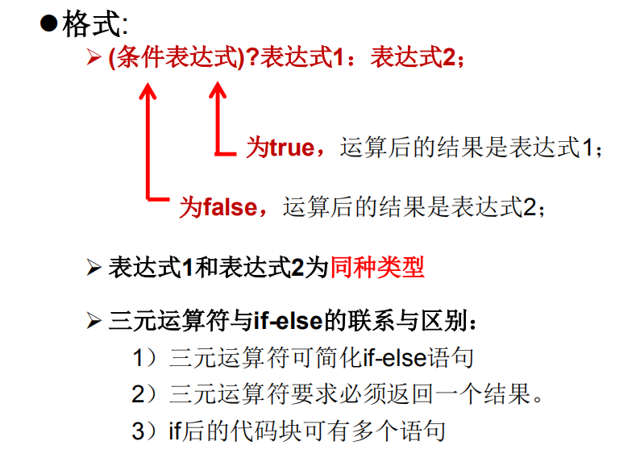
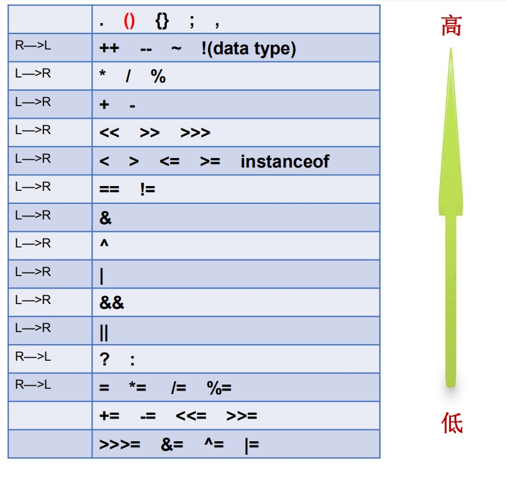

# 2.java数据类型
[[toc]]
**JAVA基础知识图解** 

 

## 2.1 关键字与保留字

### 关键字（keyword）的定义和特点 

**定义：** <font color='blue'>被java语言赋予了特殊含义，用做专业用途的字符串（单词）--java语言预先使用的单词，开发人员不能再用它表示其他含义了；</font>  

**特点：** <font color='blue'>关键字中的所有字母全是小写</font>
```` java
/**反例：包名中含有关键字java，报错**/
package java.helloworld;
/**
 * HelloWorld :
 * @description:
 * @author: tianqikai
 * @date : 2021/4/15 0015
 */
public class HelloWorld {
    public static void main(String[] args) {
        System.out.println("Hello World!");
    }
}
# 运行时报错
java.lang.SecurityException: Prohibited package name: java.helloworld
Error: A JNI error has occurred, please check your installation and try again
````
<table>
    <tr>
        <th colspan="6">用于定义数据类型的关键字 </th>
    </tr>
    <tr>
        <td>short</td>
        <td>int</td>
        <td>long</td>
        <td>double</td>
        <td>float</td>
        <td>char</td>
    </tr>
    <tr>
        <td>boolean</td>
        <td>void</td>
        <td>enum</td>
        <td>byte</td>
        <td>class</td>
        <td>interface</td>
    </tr>
    <tr>
        <th colspan="6">用于定义流程控制的关键字 </th>
    </tr>
    <tr>
        <td>if</td>
        <td>else</td>
        <td>switch</td>
        <td>case</td>
        <td>default</td>
        <td>while</td>
    </tr>
    <tr>
        <td>do</td>
        <td>for</td>
        <td>break</td>
        <td>continue</td>
        <td>return</td>
        <td></td>
    </tr>
    <tr>
        <th colspan="6">用于定义访问权限的关键字 </th>
    </tr>
    <tr>
        <td>private</td>
        <td>protected</td>
        <td>public</td>
        <td></td>
        <td></td>
        <td></td>
    </tr>
    <tr>
        <th colspan="6">用于定义类，函数，变量的修饰符的关键字 </th>
    </tr>
    <tr>
        <td>abstract</td>
        <td>final</td>
        <td>static</td>
        <td>synchronized</td>
        <td></td>
        <td></td>
    </tr>
    <tr>
        <th colspan="6">用于定义类与类之间的关系 </th>
    </tr>
    <tr>
        <td>extends</td>
        <td>implements</td>
        <td></td>
        <td></td>
        <td></td>
        <td></td>
    </tr>
    <tr>
        <th colspan="6">用于定义建立实例及引用实例，判断实例的关键字 </th>
    </tr>
    <tr>
        <td>new</td>
        <td>this</td>
        <td>super</td>
        <td>instanceof</td>
        <td></td>
        <td></td>
    </tr>
    <tr>
        <th colspan="6">用于异常处理的关键字 </th>
    </tr>
    <tr>
        <td>try</td>
        <td>catch</td>
        <td>throw</td>
        <td>throws</td>
        <td>finally</td>
        <td></td>
    </tr>
    <tr>
        <th colspan="6">用于包的关键字 </th>
    </tr>
    <tr>
        <td>package</td>
        <td>import</td>
        <td></td>
        <td></td>
        <td></td>
        <td></td>
    </tr>
    <tr>
        <th colspan="6">其他修饰符关键字 </th>
    </tr>
    <tr>
        <td>volatile</td>
        <td>assert</td>
        <td>native</td>
        <td>strictfp</td>
        <td>transient</td>
        <td></td>
    </tr>
    <tr>
        <th colspan="6">用于定义数据类型的字面值 </th>
    </tr>
    <tr>
        <td>true</td>
        <td>false</td>
        <td>null</td>
        <td></td>
        <td></td>
        <td></td>
    </tr>
</table>

### 保留字（reserved word）

**Java保留字：** 现有Java版本中没有使用，但以后版本可能作为关键字使用。
自己命名标识符时，避免使用这些保留字

<font color='red'><strong>goto、const</strong></font> --c语言中有使用。goto为跳转执行，const修改标识符函数指针等作用

## 2.2 标识符

**◆标识符：**
java对各种 **变量、类、方法** 等命名是使用的字符串序列称之为标识符  
技巧：凡是自己可以起名字的地方都叫标识符。


**◆定义合法标识符规则：**   
- 由26个英文字母大小写，0-9 ，_或 $ 组成  
- 数字不可以开头。  
- 不可以使用关键字和保留字，但能包含关键字和保留字。  
- Java中严格区分大小写，长度无限制。  
- 标识符不能包含空格。

<font color='red'>◆Java中的名称命名规范：</font>  
- **包名** ：多单词组成时所有字母都小写：xxxyyyzzz  
- **类名、接口名**：多单词组成时，所有单词的首字母大写：XxxYyyZzz    
- **变量名、方法名**：多单词组成时，第一个单词首字母小写，第二个单词开始每个单词首字母大写:xxxYyyZzz  
- **常量名**：所有字母都大写。多单词时每个单词用下划线连接：XXX_YYY_ZZZ  

详细可参考《阿里巴巴Java开发手册》

## 2.3 变量

**◆变量的概念：**  
    - 内存中的一个存储区域  
    - 该区域的数据可以在同一类型范围内不断变化  
    - 变量是程序中最基本的存储单元。包含变量类型、变量名和存储的值  
**◆变量的作用：**  
    - 用于在内存中保存数据  
**◆使用变量注意：**  
    - Java中每个变量必须先声明，后使用  
    - 使用变量名来访问这块区域的数据  
    - 变量的作用域：其定义所在的一对{ }内,变量只有在其作用域内才有效  
    - 同一个作用域内，不能定义重名的变量   
**◆声明变量**    
    -  语法：<数据类型> <变量名称>
```java
int var;
```

**◆变量的赋值**  
-  语法：<变量名称> = <值> 

```java
var = 10;
```

**◆声明和赋值变量**  
- 语法： <数据类型> <变量名> = <初始化值> 

```java
int var = 10;
```  
## 2.4 基本数据类型

### 2.4.1 数据类型分类
按数据类型分类：

------  
 
按声明位置和作用域分类：  

****
**-  在方法体外，类体内声明的变量称为成员变量。**  
**-  在方法体内部声明的变量称为局部变量。**  


<font color='red' size='4'><strong>◆注意：二者在初始化值方面的异同:</strong></font>  
**同**: 都有生命周期   
**异**：局部变量除形参外，需显式初始化（定义变量时，必须赋值处理）。

```java
package javabase.datatype;
/**
 * BaseDataType1: 显性初始化
 * @description: 在方法内部必须先对基本数据类型变量赋值后才能使用，否则编译不通过。
 * @author: tianqikai
 * @date : 2021/4/15 0015
 */
public class BaseDataType1 {
    static int anInt;
    static boolean aBoolean;
    public static void main(String[] args) {
        int bnInt;
        boolean bBoolean;
        //输出0
        System.out.println(anInt);
        //输出false
        System.out.println(aBoolean);
        //未初始化的话，直接报错；需要初始化
        bnInt=0;
        bBoolean=true;
        System.out.println(bnInt);
        System.out.println(bBoolean);
    }
}
```
```java
//如果未初始化，报错
Error:(21, 28) java: 可能尚未初始化变量bnInt
Error:(22, 28) java: 可能尚未初始化变量bBoolean
````

### 2.4.2 整数类型：byte、short、int、long

◆Java各整数类型有固定的表数范围和字段长度，不受具体OS(operating system)的影响，以保证java程序的可移植性。  
<font color='red' size='4'>◆java的整型常量默认为 int 型，声明long型常量须后加‘l’或‘L’</font>  
<font color='red' size='4'>◆java程序中变量通常声明为int型，除非不足以表示较大的数，才使用long</font>  



1T=1024GB 1GB=1024MB 1MB = 1024KB 1KB= 1024B B=byte  1B=8bit 

<font color='red'> byte：字节  --计算机中基本存储单元。</font>  
<font color='red'> bit：位  --计算机中的最小存储单位。</font>  
```java
package javabase.datatype;

/**
 * BaseDataType2 :整数型
 * @description:
 * @author: tianqikai
 * @date : 2021/4/15 0015
 */
public class BaseDataType2 {
    public static void main(String[] args) {
        //byte 赋值范围 -128~127
        byte byte1=127;
        //超出赋值范围报错
        //byte byte2=128;

        //int 类型赋值范围 -2147483648~2147483647
        int a=10;
        int b= 2147483647;
        //超出赋值范围报错
        //int c= 2147483648;

        //程序将2147483648看做int类型，但是这个数据本身已经超出了int的取值范围。
        //long e = 2147483648;
        long e = b;//存在自动类型转换 int->long
        //正确的方法应该在后面加上L，这样就会把2147483648看做是long类型。
        //如果不加L的话，会把2147483648看成int类型，即默认会将整数的字面值看成是int类型
        long f = 2147483648L;
        System.out.println(byte1);
        System.out.println(a);
        System.out.println(b);
        System.out.println(e);
        System.out.println(f);
    }
}
```
```java
127
10
2147483647
2147483647
2147483648
```
### 2.4.3 浮点类型：float、double
◆ 与整数类型类似，Java 浮点类型也有固定的表数范围和字段长度，不受具体操作系统的影响。  
◆ 浮点型常量有两种表示形式：  
  -  十进制数形式：如：5.12 512.0f .512 (必须有小数点）  
  -  科学计数法形式:如：5.12e2 512E2 100E-2   
◆ float:单精度，尾数可以精确到7位有效数字。很多情况下，精度很难满足需求。double:双精度，精度是float的两倍。通常采用此类型。   
<font color='red'>◆ Java 的浮点型常量默认为double型，声明float型常量，须后加‘f’或‘F’。</font>  



```java
package javabase.datatype;

/**
 * BaseDatatype3 :浮点型
 * @description:float double
 * @author: tianqikai
 * @date : 2021/4/15 0015
 */
public class BaseDatatype3 {
    public static void main(String[] args) {
        // java默认使用double浮点类型
        double a=3.14111;
        //会报错
        //float b=3.1415;
        float c=3.1415F;
        float d=3.1415f;
        System.out.println(a);
        System.out.println(c);
        System.out.println(d);
    }
}
```
```java
//输出结果
3.14111
3.1415
3.1415
```

### 2.4.4 字符类型：char

◆char 型数据用来表示通常意义上“字符”(2字节)   
◆Java中的所有字符都使用Unicode编码，故一个字符可以存储一个字母，一个汉字，或其他书面语的一个字符。  
◆字符型变量的三种表现形式：  
- 字符常量是用单引号(‘ ’)括起来的单个字符。例如：char c1 = 'a'; char c2 = '中'; char c3 = '9';  
-  Java中还允许使用转义字符‘\’来将其后的字符转变为特殊字符型常量。例如：char c3 = ‘\n’; // '\n'表示换行符  
- 直接使用 Unicode 值来表示字符型常量：‘\uXXXX’。其中，XXXX代表一个十六进制整数。如：\u000a 表示 \n。 char类型是可以进行运算的。因为它都对应有Unicode码  
<font color='red'>转义符</font>


```java
package javabase.datatype;

/**
 * BaseDataTypeChar :char字符
 * @description:
 * @author: tianqikai
 * @date : 2021/4/15 0015
 */
public class BaseDataTypeChar {
    /**
     * char的取值范围：0~65536
     * unicode对应的码值
     * 'a' 97
     * 'A' 65
     * '0' 48
     */
    public static void main(String[] args) {
        char c1='a';
        // 一个汉字两个byte，所有char能存储
        char c2='汉';
        //char只能赋值为一个字符
        //char c3 = 'ab';//错误error
        //abcd efg hijk lmn opq rst uvw xyz
        char c4=97;
        char c5=65;
        char c6=48;
        char c7='\"';//双引号
        char c8='\'';//单引号
        char c9='\\';//反斜线
        System.out.println(c1);
        System.out.println(c2);
//        System.out.println(c3);
        System.out.println(c4);
        System.out.println(c5);
        System.out.println(c6);
        System.out.println(c7);
        System.out.println(c8);
        System.out.println(c9);
    }
}

```
``` java
//输出结果
a
汉
a
A
0
"
'
\
```
<font color='red' size=4><strong>了解：ASCII 码</strong></font>   
◆在计算机内部，所有数据都使用二进制表示。每一个二进制位（bit）有 0 和 1 两种状态，因此 8 个二进制位就可以组合出 256 种状态，这被称为一个字节（byte）。一个字节一共可以用来表示 256 种不同的状态，每一个状态对应一个符号，就是 256 个符号，从0000000 到 11111111。  
◆ ASCII码：上个世纪60年代，美国制定了一套字符编码，对英语字符与二进制位之间的关系，做了统一规定。这被称为ASCII码。ASCII码一共规定了128个字符的编码，比如空格“SPACE”是32（二进制00100000），大写的字母A是65（二进制01000001）。这128个符号（包括32个不能打印出来的控制符号），只占用了一个字节的后面7位，最前面的1位统一规定为0。   
◆缺点：    
-  不能表示所有字符。   
-  相同的编码表示的字符不一样：比如，130在法语编码中代表了é，在希伯来语编码中却代表(ג) 了字母Gimel    
<font color='red' size=4><strong>了解： Unicode 编码</strong></font>  
◆乱码：世界上存在着多种编码方式，同一个二进制数字可以被解释成不同的符号。因
此，要想打开一个文本文件，就必须知道它的编码方式，否则用错误的编码方式解读，
就会出现乱码。   
◆Unicode：一种编码，将世界上所有的符号都纳入其中。每一个符号都给予一个独一无二的编码，使用 Unicode 没有乱码的问题。  

◆Unicode 的缺点：Unicode 只规定了符号的二进制代码，却没有规定这个二进制代码应该如何存储：无法区别 Unicode 和 ASCII：计算机无法区分三个字节表示一个符号还是分别表示三个符号。另外，我们知道，英文字母只用一个字节表示就够了，如果unicode统一规定，每个符号用三个或四个字节表示，那么每个英文字母前都必然有二到三个字节是0，这对于存储空间来说是极大的浪费。  
<font color='red' size=4><strong>UTF-8</strong></font>   
◆UTF-8 是在互联网上使用最广的一种 Unicode 的实现方式。  
◆UTF-8 是一种变长的编码方式。它可以使用 1-6 个字节表示一个符号，根据不同的符号而变化字节长度。  
◆UTF-8的编码规则：对于单字节的UTF-8编码，该字节的最高位为0，其余7位用来对字符进行编码（等同于ASCII码）。  
◆对于多字节的UTF-8编码，如果编码包含 n 个字节，那么第一个字节的前 n 位为1，第一个字节的第 n+1 位为0，该字节的剩余各位用来对字符进行编码。在第一个字节之后的所有的字节，都是最高两位为"10"，其余6位用来对字符进行编码。  

### 2.4.5 布尔类型：boolean
◆boolean 类型用来判断逻辑条件，一般用于程序流程控制：  
- if条件控制语句；  
- while循环控制语句；  
- do-while循环控制语句；  
- for循环控制语句；  
<font color='red'>◆boolean类型数据只允许取值true和false，无null。</font>   
◆不可以使用0或非 0 的整数替代false和true，这点和C语言不同。  
◆Java虚拟机中没有任何供boolean值专用的字节码指令，Java语言表达所操作的boolean值，在编译之后都使用java虚拟机中的int数据类型来代替：true用1表示，fals用0表示。———《java虚拟机规范 8版》

```java
package javabase.datatype;

/**
 * BaseDataTypeBoolean :
 * @description: boolean数据类型
 * @author: tianqikai
 * @date : 2021/4/15 0015
 */
public class BaseDataTypeBoolean {
    public static void main(String[] args) {
        boolean flag=true;
        if(flag){
            System.out.println("对");
        }else{
            System.out.println("错");
        }
    }
}
```
## 2.5 基本数据类型转换
<font color='red' size=3><strong>基本数据类型转换</strong></font>  
◆自动类型转换：容量小的类型自动转换为容量大的数据类型。数据类型按容量大小排序为：  


◆有多种类型的数据混合运算时，系统首先自动将所有数据转换成容量最大的那种数据类型，然后再进行计算。  
◆byte,short,char之间不会相互转换，他们三者在计算时首先转换为int类型。   
◆boolean类型不能与其它数据类型运算。  
◆当把任何基本数据类型的值和字符串(String)进行连接运算时(+)，基本数据类型的值将自动转化为字符串(String)类型。  
```java
package javabase.datatype;

/**
 * BaseDataTypeAutoConversion :
 * @description: 自动类型转换
 * @author: tianqikai
 * @date : 2021/4/15 0015
 */
public class BaseDataTypeAutoConversion {
    public static void main(String[] args) {
        byte byte1=127;
        short short1=1;
        int int1=short1;
        int int2=byte1;// byte 自动转换位int
        //高级向低级转换报错
        //s=i;
        long long1=100000;// int自动装换为long
        float float1=111.12F;
        double double1=float1;//float自动装换为double，自动转换也存在了精度丢失，实际开发我们使用BigDecimal类处理
        System.out.println(byte1);
        System.out.println(short1);
        System.out.println(int1);
        System.out.println(int2);
        System.out.println(long1);
        System.out.println(float1);
        System.out.println(double1);
    }
}
```
```java
//输出结果：
127
1
1
127
100000
111.12
111.12000274658203
```
<font color='red' size=4><strong>强制类型转换</strong></font>  
◆自动类型转换的逆过程，将容量大的数据类型转换为容量小的数据类型。使用时要加上强制转换符：()，但可能造成精度降低或溢出,格外要
注意。   
◆通常，字符串不能直接转换为基本类型，但通过基本类型对应的包装类则可以实现把字符串转换成基本类型。   
◆如： String a = “43”; int i = Integer.parseInt(a);  
◆boolean类型不可以转换为其它的数据类型。  

```java
package javabase.datatype;
import java.math.BigDecimal;

/**
 * BaseDatatypeForceConversion :
 * @description:强制类型转换
 * @author: tianqikai
 * @date : 2021/4/16 0016
 */
public class BaseDatatypeForceConversion {
    public static void main(String[] args) {
        //强制类型转换，会存在精度缺失情况，尽量避免使用；实际商业开发中，存在计算是，一般使用BigDecimal类处理；
        int i;
        long l=10000L;
        i=(int)l;
        System.out.println(i);
        float f;
        double d=1000.1111;
        f=(float)d;
        System.out.println(f);

        BigDecimal bigDecimal=new BigDecimal(l);

        bigDecimal=bigDecimal.add(new BigDecimal(i));
        System.out.println(bigDecimal);
        //任何类型和string拼接之后变成，string类型；
        String s="String类型字符串对象";
        s=s+l;
        System.out.println(s);

    }
}
```
```java
//输出结果
10000
1000.1111
20000
String类型字符串对象10000 
```

## 2.6 进制与进制之间转换
略
## 2.7 运算符

运算符是一种特殊的符号，用以表示数据的运算、赋值和比较等。   
◆算术运算符  
◆赋值运算符  
◆比较运算符（关系运算符）  
◆逻辑运算符  
◆位运算符  
◆三元运算符  

### 2.7.1 算术运算符

```java
+   求和
-   相减
*   乘积
/   相除
++  自加1(前++和后++两种，前++：先运算再赋值；后++：先赋值后运算)
--  自减1(前--和后--两种，前--：先运算再赋值；后--：先赋值后运算)
%   取余、求模
+   字符串连接 “He”+”llo” “Hello”  
```
```java
    private static void countOne(){
        int a = 10;
        int b = 3;
        System.out.println(a + b); //13
        System.out.println(a - b); //7
        System.out.println(a * b); //30
        System.out.println(a / b); //3 因为是int类型，所以结果也是int类型
        System.out.println(a % b); //1
    }
```
```java
//运行结果
13
7
30
3
1
```
```java
    private static void countTwo(){
        int k = 10;
        k++;//相当于k = k + 1
        System.out.println("k=" + k);
        //这里面的+号是做的字符串相加的运算，输出结果为k=11
        int j = 5;
        ++j;//相当于j = j + 1
        System.out.println("j=" + j); //j=6
        int m = 8;
        m--;//相当于m = m - 1
        System.out.println("m=" + m); //m=7
        int n = 6;
        --n;//相当于n = n - 1
        System.out.println("n=" + n); //n=5
    }
```
```java
//运行结果
k=11
j=6
m=7
n=5
```
测试题：

```java
    private static void countThree(){
        int a = 10;
        int b = 10;
        int c = 10;
        a = b++;
        c = --a;
        b = ++a;
        a = c--;
        System.out.println("a = " + a + ",b = " + b + ",c = " + c);
    }
```
```java
//输出结果
a =9 ,b =10,c = 8
```

### 2.7.2 赋值运算符
```java
赋值运算符
=
+= 把左边和右边做加法，然后赋值给左边
-= 把左边和右边做减法，然后赋值给左边
*= 把左边和右边做乘法，然后赋值给左边
/= 把左边和右边做除法，然后赋值给左边
%= 把左边和右边做取余，然后赋值给左边
```
```java
package javabase.operators;

/**
 * AssignmentOperator :赋值运算符
 */
public class AssignmentOperator {
    public static void main(String[] args) {
        //基本的赋值运算符
        int a = 10;
        //追加
        a += 10; //a = a+10;
        System.out.println(a); //20

        //a==20
        a -= 5;
        System.out.println(a); //15

        //a==15
        a *= 3;
        System.out.println(a); //45

        //a==45
        a /= 15; // a = a/15;
        System.out.println(a); //3

        //a==3
        a %= 2; //a = a%2;
        System.out.println(a); //1


        //基本赋值运算符和扩展赋值运算符的区别
        byte i = 10;

        //编译无法通过。运算结果是int类型，前边的变量是byte类型.
        //i = i + 10;

        //语法：扩展赋值运算符不改变运算结果类型。可能损失精度。
        i += 10;
        
        //虽然编译通过，精度损失严重。
        //最初变量是byte，最终还是byte类型
        //相当于i = (byte)(i+10000);
        i += 1000;
    }
}

```
```java
//输出结果
20
15
45
3
1
```

## 2.7.3 关系运算符

```java
== 判断是否相等(基本数据类型)
!= 不等于
> 大于
>= 大于等于
< 小于
<= 小于等于
```
## 2.7.4 逻辑运算符
```java
& 逻辑与 两边都是true，结果是true
| 逻辑或 一边是true,结果就是true
! 逻辑非 取反 !true –> false
^ 逻辑异或 两边只要是不一致就是true
&& 短路与 用法和 & 一样。
|| 短路或 用法和 | 一样
```
**◆“&”和“&&”的区别：**  
•单&时，左边无论真假，右边都进行运算；  
•双&时，如果左边为真，右边参与运算，如果左边为假，那么右边不参与运算。  
**◆“|”和“||”的区别同理，||表示：当左边为真，右边不参与运算。**  
**◆异或( ^ )与或( | )的不同之处是：当左右都为true时，结果为false。**   
理解：异或，追求的是“异”!“&”和“&&”的区别：  


## 2.7.5 位运算符
<font color='red'><strong>◆ 位运算是直接对整数的二进制进行的运算</strong></font>

```java
    <<   空位补0，被移除的高位丢弃，空缺位补0。    
    >>   被移位的二进制最高位是0，右移后，空缺位补0；最高位是1，空缺位补1。    
    >>>  被移位二进制最高位无论是0或者是1，空缺位都用0补。    
    &    二进制位进行&运算，只有1&1时结果是1，否则是0;    
    |    二进制位进行 | 运算，只有0 | 0时结果是0，否则是1;    
    ^    相同二进制位进行 ^ 运算，结果是0；1^1=0 , 0^0=0 不相同二进制位 ^ 运算结果是1。1^0=1 , 0^1=1     
    ~    正数取反，各二进制码按补码各位取反  负数取反，各二进制码按补码各位取反  
```
## 2.7.6 三目运算符

Java 提供了一个特别的三元运算符（也叫三目运算符）经常用于取代某个类型的 if-then-else 语句。条件运算符的符号表示为“?:”，使用该运算符时需要有三个操作数，因此称其为三目运算符。使用条件运算符的一般语法结构为：  
```java
result = <expression> ? <statement1> : <statement3>;
```
其中，expression 是一个布尔表达式。当 expression 为真时，执行 statement1， 否则就执行 statement3。此三元运算符要求返回一个结果，因此要实现简单的二分支程序，即可使用该条件运算符。  
## 2.7.7 运算符优先级

