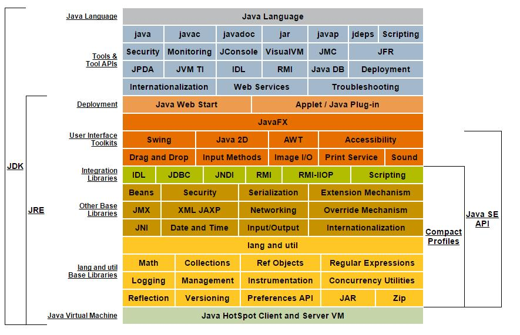

# 1.java概述
[[toc]]
## 1.1 java语言诞生

<ul>
  <li>是SUN(Stanford University Network，斯坦福大学网络公司 ) 1995年推出的一门高级编程语言。</li>
  <li>是一种面向Internet的编程语言。Java一开始富有吸引力是因为Java程序可以在Web浏览器中运行。这些Java程序被称为Java小程序（applet）。applet使
    用现代的图形用户界面与Web用户进行交互。 applet内嵌在HTML代码中。</li>
  <li> 随着Java技术在web方面的不断成熟，已经成为Web应用程序的首选开发语言。</li>
</ul>
 
java之父James Gosling团队在开发“Green”项目时，发现C缺少垃圾回收系统，还有可移植系统的安全性。分布程序设计和多线程功能。最后，他们想要一种易于一直到各种设备上的平台。

Java确实是从c语言和c++语言继承了许多成分，甚至可以将Java看成是<font clolor='red' weight='bold'>类C语言</font>发展和衍生的产物。比如Java语言的变量声明，操作符形式，参数传递，流程控制等方面和c语言、c++完全相同。但同时，Java是一种<font color='red' weight='bold'>纯粹的面向对象的程序设计语言</font>，他继承了c++面向对象的的核心。
java<font color='blue'>舍弃了c语言中容易引起错误的指针</font>（以引用取代）、运算符重载（operator overloading）、多重继承（以接口取代）等特性，<font color='blue'>增加了垃圾回收器功能</font>用于回收不再被引用的对象所占据的内存空间。JDK1.5又引入了泛型编程（GenericProgramming）、类型安全的枚举、不定长参数和自动装箱/拆箱

## 1.2 java语言简史
  <ul>
    <li>1991年 Green项目，开发语言最初命名为Oak（橡树）</li>
    <li>1994年，开发组意识到Oak非常适合于互联网</li>
    <li>1996年，发布JDK1.0，约8.3万个网页应用java技术来制作</li>
    <li>1997年，发布JDK1.1，javaone会议召开，创当时全球同类型会议规模之最</li>
    <li>1998年，发布JDK1.2，同年发布企业平台J2EE</li>
    <li>1999年，Java分成J2SE，J2EE和J2ME，JSP/Servlet技术诞生</li>
    <li><font color='red'>2004年，发布里程碑版本：JDK1.5，为突出此版本的重要性，更名为JDK5.0</font></li>
    <li>2005年，J2SE->JavaSE,J2EE->JavaEE,J2ME->JavaME</li>
    <li>2009年，Oracle公司收购SUN，交易价格74亿美元</li>
    <li>2011年，发布JDK7.0</li>
    <li><font color='red'>2014年，发布JDK8.0，是继JDK5.0以来变化最大的版本</font></li>
    <li>2017年，发布JDK9.0，最大限度实现模块化</li>
    <li>2018年3月，发布JDK10.0，版本号也称为18.3</li>
    <li>2018年9月，发布JDK11.0，版本号也称为18.9</li>
  </ul>

## 1.3 Java技术体系平台

<font color='red'  size='3' face="黑体"><strong>Java SE(Java Standard Edition)标准版</strong></font>

支持面向桌面级应用（如windows 下的应用程序）的Java平台开发，提供了完整的Java核心API，此版本之前称为J2SE

<font color='red' size='3' face="黑体"><strong>Java EE(Java Enterprise Edition)企业版</strong></font>

是为开发企业环境下的应用程序提供的一套解决方案。该技术体系中包含的技术如：Servlet,jsp等等，主要针对于Web应用程序开发。版本之前称为J2EE

<font size='3' face="黑体"><strong>Java ME(Java Micro Edition)小型版</strong></font>

支持Java程序运行在移动终端（手机，PDA）上的平台，对Java API有所精简，并加入了针对移动终端的支持，此版本以前称为J2ME

<font size='3' face="黑体"><strong>Java Card</strong></font>

支持一些Java小程序（Applets）运行在小内存设备（如智能卡）上的平台

<a href="">Java SE和Java EE区别理解</a>

## 1.4Java技术在各领域的应用

按Java的应用领域来分，主要表现在以下几个方面：

 <font color='red' size='3'>● 企业级应用：</font>

 主要指复杂的大企业的软件系统、各种类型的网站。Java的安全机制以及它的跨平台的优势，使它在分布式系统领域开发中有广泛应用。应用领域包含金融、电信、交通、电子商务等。

<font color='red' size='3'>● Android平台应用：</font>

Android应用程序使用的Java语言编写。AndRoid开发水平的高低很大程度上取决于Java语言核心能力是否扎实。

<font color='red' size='3'>● 大数据平台开发：</font>

各类框架有Haddoop，spark，storm，flink等，就这类技术生态圈来讲，还有各种中间件如flume，kafka，sqoop等等，这些框架以及工具大多数是用Java编写而成。

## 1.5 Java语言的主要特性

<font color='red' size='3'><strong>● Java语言是易学的</strong></font>

Java语言的语法与C语言、c++的语法很相近。

<font color='red' size='3'><strong>● Java语言是强制面向对象的</strong></font>

Java语言提供类、接口和继承等原语，为了简单起见，只支持类之间的单继承，但支持接口的之间的多继承，并支持类与接口之间的实现机制（关键字 implements）

<font color='red' size='3'><strong>● Java语言是分布式的</strong></font>

Java语言支持Intternet应用开发，在基本的的java应用编程接口中有一个网络应用编程接口（java.net）,他提供了用于网络编程的类库，包含URL、URLConnection、Socket、ServerSocket等。Java的RMI（远程方法激活）机制也是开发分布式应用的重要手段。

<font color='red' size='3'><strong>● Java语言是健壮的</strong></font>

Java的强类型机制、异常处理、垃圾的自动收集等是Java程序健壮性的重要保证。对指针的丢弃是Java的明智选择

<font color='red' size='3'><strong>● Java语言是安全的</strong></font>

Java通常被用在网络环境中，为此，Java提供了一个安全机制以防恶意代码的攻击。<font color='red'> 如：安全防范机制（类ClassLoader）</font>,然后可以在实现java平台的任何系统中运行

<font color='red' size='3'><strong>● Java语言是体系结构中立的</strong></font>

Java程序 （后缀为Java的文件） 在Java平台上被编译为体系结构中立的字节码格式（后缀为class的文件），然后可以在实现这个Java平台的任何系统中运行。

<font color='red' size='3'><strong>● Java语言是解释型语言</strong></font>

如前所述，Java程序在Java平台上被编译为字节码格式，然后可以在实现这个Java平台的任何系统的解释器中运行。

<font color='red' size='3'><strong>● Java是性能略高的</strong></font>

与那些解释型的高级脚本语言相比，Java的性能还是较优的。

<font color='red' size='3'><strong>● Java语言是原生支持多线程的</strong></font>

Java语言中，线程是一种特殊的对象，它必须由Thread类或其子（孙）类来创建。

## 1.4 Java语言运行机制及运行过程

###  ● Java语言的特点

#### ● 面向对象
  两个基本概念：类、对象

  三个特性： 封装、继承、多态
#### ● 健壮性
  吸收了C/C++语言的优点，但去掉了其影响程序健壮性的部分（如指针、内存的申请与释放等），提供了一个相对安全的内存管理和访问机制

####● 跨平台性
  **跨平台性**：*通过Java语言编写的应用程序在不同的系统平台上都可以运行。“Write  once，Run AnyWhere” 一次编译，到处运行。*
  原理：只要在需要运行java应用程序的操作系统上，先安装一个Java虚拟机（JVM Java Virtual Machine）即可。由JVM来负责Java程序在该系统中运行。

### ● Java两种核心机制
 
  <br>
  <font color='red'>
    <strong>■ Java虚拟机（Java Virtal Machine)</strong>
    <br>
    <strong>
      ■ 垃圾收集机制（Garbage Collection）
    </strong>
  </font>

  *****

  <br>
  <font color='blue'>
    <strong>
      核心机制-JVM是一个虚拟的计算机,
    </strong>
    具有指令集并使用不同的存储区域。负责执行指令，管理数据、内存、寄存器。
  </font>
  <ul>
    <li>对于不同的平台，有不同的虚拟机.</li>
    <li>只有某平台提供了对应的Java虚拟机，java程序才可以再次平台运行</li>
    <li>Java虚拟机机制屏蔽了底层运行平台的差别，实现了“一次编译，到处运行”</li>
  </ul>


  

  **因为有了JVM，同一个Java 程序在三个不同的操作系统中都可以执行。这
  样就实现了Java 程序的跨平台性。**

  

  JVM: jvm有自己完善的硬件架构，如处理器、堆栈（stack）、寄存器等，还具有相应的指令系统（java字节码就是一种指令格式）。JVM屏蔽了与具体操作系统平台相关的信息，使得Java程序只需要生成在Java虚拟机上运行的字节码（目标代码 .class文件），就可以在多种平台上不加修改的运行。JVM是Java平台无关的基础。


  JVM负责运行字节码：JVM把每一条要执行的字节码交给jvm解释器，翻译成对应的机器码，然后由解释器执行。

  **JVM解释执行字节码文件就是JVM操作JAVA解释器进行翻译执行字节码文件的过程；**

  <font color='red' ><strong>JAVA编译器：</strong></font>  
  将java源文件（.java文件）编译成字节码文件（.class文件，是特殊的二进制文件，二进制字节码文件），这种class字节码就是JVM的“机器语言”。
  ***javac.exe*** 可以简单看成是JAVA编译器  
  <font color='red' ><strong>JAVA解释器：</strong></font>  
  是JVM的一部分。Java编译器用来解释执行Java编译器后的程序。***java.exe*** 可以简单的看成是Java的解释器

  **解释器：** 是一种电脑程序，能够把高级的编程语言一行一行直接翻译运行。解释器不会一次把整个程序翻译出来，只是像是一个中间人，每次运行程序时都要先转成另一种语言再进行运行，因此通过解释器运行的程序速度比较缓慢。它每次翻译一行程序叙述就立刻运行，然后再翻译下一行，再运行，如此不停地进行下去。JAVA中它会先将源码翻译程另一种语言class文件，以供多次运行而无需再进行编译。其无需依赖编译器而运行，直接有解释器翻译成机器字节码，直接运行，速度相对较快。

  **即时编译(Just-in-time compilation: JIT)：** 又叫实时编译、及时编译。是指一种在运行时期把字节码编译成原生机器码的技术，一句一句翻译源代码，但是会将翻译过的代码缓存起来以降低性能耗损。这项技术是被用来改善虚拟机的性能的。

  **JIT编译器是JRE的一部分。** 原本的Java程序都是要经过解释执行的，其执行速度肯定比可执行的二进制字节码程序慢。为了提高执行速度，引入了JIT。在运行时，JIT会把翻译过来的机器码保存起来，以备下次使用。而如果JIT对每条字节码都进行编译，则会负担过重，所以，JIT只会对经常执行的字节码进行编译，如循环，高频度使用的方法等。它会以整个方法为单位，一次性将整个方法的字节码编译为本地机器码，然后直接运行编译后的机器码。

  <font color='blue'>
    <strong>
      核心机制-垃圾回收,
    </strong>
  </font>
  <ul>
    <li>不再使用的内存空间应回收--垃圾回收
      <br>
      1. 在c/c++等语言中，有程序员负责回收无用内存
      <br>
      2. Java 语言消除了程序员回收无用内存的空间的责任：它提供一种系统级线程跟踪存储空间的分配情况。并在JVM空闲时，检查并释放那些课释放的存储空间。
    </li>
    <li ><font color='red'>垃圾回收在Java程序运行过程中自动运行，程序员无法精确控制和干预</font></li>
  </ul>

## 1.5 JVM JRE JDK关系

<font color='red'><strong>JDK(Java Development Kit Java开发工具包)</strong></font>  
JDK是提供给Java开发人员使用的，其中包含了java的开发工具，也包括了
JRE。所以安装了JDK，就不用在单独安装JRE了。
◆其中的开发工具：**编译工具(javac.exe) 打包工具(jar.exe)等**
<font color='red'><strong>JRE(Java Runtime Environment Java运行环境)</strong></font>  
包括**Java虚拟机(JVM Java Virtual Machine)**和**Java程序所需的核心类库**等，
如果想要运行一个开发好的Java程序，计算机中只需要安装JRE即可。  


**• JDK = JRE + 开发工具集（例如Javac编译工具等）**  
**• JRE = JVM + Java SE标准类库**
******
 

 **参考文献**  
 <https://www.cnblogs.com/roger-yu/p/5827452.html>
 <https://www.cnblogs.com/chengdabelief/p/6576320.html>

 ## 1.6 Java语言的环境搭建

### 配置JAVA开发环境
<font color='red'><strong>配置环境变量 path</strong></font>   
每次执行 java 的工具都要进入到bin目录下，是非常麻烦的。可不可以在任何目
录下都可以执行java的工具呢？  
※根据windows系统在查找可执行程序的原理，可以将java工具所在路径定义到
path 环境变量中，让系统帮我们去找运行执行的程序。  
※配置方法：  
◆我的电脑--属性--高级系统设置--环境变量  
◆编辑 path 环境变量，在变量值开始处加上java工具所在目录，后面用 “ ; ”和其他值分隔
开即可。  
◆打开DOS命令行，任意目录下敲入javac。如果出现javac 的参数信息，配置成功。 

***注： 具体操作流程，参看JDK8下载_安装_配置.doc***
 
 

### 体验JAVA开发
●步骤：
1. 将 Java 代码编写到扩展名为 .java 的文件中。
2. 通过 javac 命令对该 java 文件进行编译。
3. 通过 java 命令对生成的 class 文件进行运行。


```java
  public class HelloWorld{
    public static void main(String[] args) {
    System.out.println(“Hello World!”);
    }
  }
```

```shell
## 编译
  javac HelloWorld.java
## 运行
  java HelloWorld
```

## 面试题 谈谈你对Java平台的理解

<font color='red'>
Java语言是一种面向对象的高性能解释性语言，具有简单易学，易跨平台的特点。<br>
<strong>一处编译，到处运行（Write once,run Anywhere）</strong>（不同的操作系统，只需要安装不同的JRE就能运行同一套代码）。<br>
Java语言摒弃了C语言的指针等晦涩难懂的内存管理机制，程序员大部分情况下不用特别关注内存管理，java通过垃圾回收机制（GC）自动进行内存管理。<br>
<strong>我们平常接触到JDK JRE JVM，他们之间的关系:</strong>
<br>
JDK涵盖JRE，JRE涵盖JVM。JDK可以看成JRE的一个超集，除了包含JRE，还包含Java开发的编译器(javac .java文件编译成.class文件)、各种诊断工具<br>
JRE就是java的运行环境，包含JVM和java类库，以及一些其他模块等<br>
JVM是实现java语言是解释性语言的主要载体。java源码通过javac编译成.class文件之后，通过JVM将java字节码翻译成真正的机器字节码翻译一句运行一句。同时现在的Hotspot JVM提供了JIT（Just-In——Time）动态编译器，会在运行时将热点代码编译成机器码，放在缓存中，这种情况属于编译执行，而不是解释执行。（感觉像是半编译，半解释的一种语言）</font>