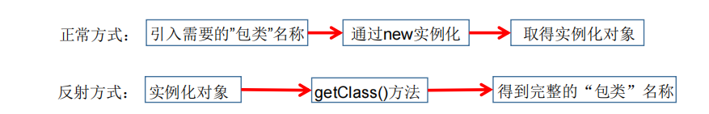
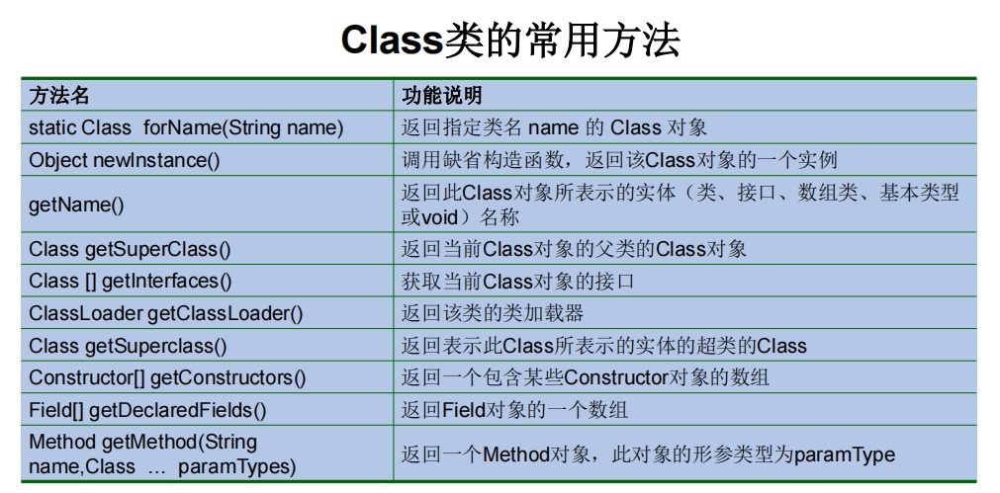
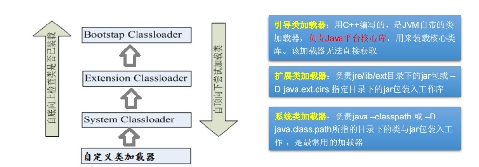
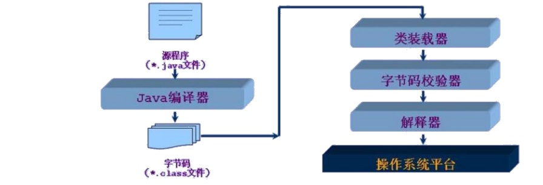

# 14.反射

## 14.1 Java反射机制概述

::: tip <font color='red'>Java Reflection</font>
1. Reflection（反射）是被视为<font color='red'><strong>动态语言的关键</strong></font>，反射机制允许程序在执行期借助于Reflection API取得任何类的内部信息，并能直接操作任意对象的内部属性及方法。 
2. 加载完类之后，在堆内存的方法区中就产生了一个Class类型的对象（一个类只有一个Class对象），这个对象就包含了完整的类的结构信息。<font color='red'><strong>我们可以通过这个对象看到类的结构。这个对象就像一面镜子，透过这个镜子看到类的结构，所以，我们形象的称之为：反射</strong></font>。
:::

-----------------------

<a data-fancybox title="Reflection" href="../image/Reflection.png"></a>


---------------------------

:::warning <font color='red'>动态语言 vs 静态语言</font>
1. 动态语言  
是一类在运行时可以改变其结构的语言：例如新的函数、对象、甚至代码可以被引进，已有的函数可以被删除或是其他结构上的变化。通俗点说就是<font color='red'>在运行时代码可以根据某些条件改变自身结构</font>。  
主要动态语言：Object-C、C#、JavaScript、PHP、Python、Erlang。   
2. 静态语言  
与动态语言相对应的，运行时结构不可变的语言就是静态语言。如Java、C、C++。  

**Java不是动态语言，但Java可以称之为“准动态语言”。即Java有一定的动态性，我们可以利用反射机制、字节码操作获得类似动态语言的特性。Java的动态性让编程的时候更加灵活！**

:::


---------------------


::: danger Java反射机制提供的功能
1. 在运行时判断任意一个对象所属的类
2. 在运行时构造任意一个类的对象
3. 在运行时判断任意一个类所具有的成员变量和方法
4. 在运行时获取泛型信息
5. 在运行时调用任意一个对象的成员变量和方法
6. 在运行时处理注解
7. 生成动态代理
:::

:::tip <font color='blue'>反射的常用API</font>
1. java.lang.Class:代表一个类 
2. java.lang.reflect.Method:代表类的方法
3. java.lang.reflect.Field:代表类的成员变量
4. java.lang.reflect.Constructor:代表类的构造器
:::

## 14.2 理解Class类并获取Class的实例


:::tip Class类
在Object类中定义了以下的方法，此方法将被所有子类继承：<font color='red'>**● public final Class getClass()**</font> 以上的方法返回值的类型是一个Class类，此类是Java反射的源头，实际上所谓反射从程序的运行结果来看也很好理解，即：<font color='red'>**可以通过对象反射求出类的名称**</font>。


对象照镜子后可以得到的信息：<font color='red'>某个类的属性、方法和构造器、某个类到底实现了哪些接口</font>。对于每个类而言，JRE 都为其保留一个不变的 Class 类型的对象。一个 Class 对象包含了特定某个结构(class/interface/enum/annotation/primitive type/void/[])的有关信息。   
<font color='red'>▷ Class本身也是一个类</font>  
<font color='red'>▷ Class 对象只能由系统建立对象</font>  
<font color='red'>▷ 一个加载的类在 JVM 中只会有一个Class实例</font>  
<font color='red'>▷ 一个Class对象对应的是一个加载到JVM中的一个.class文件</font>  
<font color='red'>▷ 每个类的实例都会记得自己是由哪个 Class 实例所生成</font>  
<font color='red'>▷ 通过Class可以完整地得到一个类中的所有被加载的结构</font>  
<font color='red'>▷ Class类是Reflection的根源，针对任何你想动态加载、运行的类，唯有先获得相应的Class对象</font>  
:::

-----------------------------

```java
public class Reflection {
    public static void main(String[] args) {
        Person person = new Person();
        Class clazz=person.getClass();
        System.out.println(clazz);
        System.out.println(clazz.getName());

    }
}
//返回结果----------------
class javabase.reflect.Person
javabase.reflect.Person
```

<a data-fancybox title="CLASSREFLECTION" href="../image/CLASSREFLECTION.jpg"></a>

-------------------------------------------------


:::tip <font color='red'>☆获取Class类的实例(四种方法)</font> 
1. 前提：若<font color='blue'>**已知具体的类**</font> ，通过类的class属性获取，该方法最为安全可靠，程序性能最高  
　实例：Class clazz = String.class;   
2. 前提：<font color='blue'>**已知某个类的实例**</font> ，调用该实例的getClass()方法获取Class对象  
　实例：Class clazz = “www.atguigu.com”.getClass();  
3. 前提：<font color='blue'>**已知一个类的全类名，且该类在类路径下**</font> ，可通过Class类的静态方法forName()获取，可能抛出ClassNotFoundException  
　实例：Class clazz = Class.forName(“java.lang.String”);  
4. <font color='blue'>**其他方式(不做要求)**</font>   
　<font color='red'>ClassLoader cl = this.getClass().getClassLoader()</font>    
　<font color='red'>Class clazz4 = cl.loadClass(“类的全类名”)</font>  

```java
public class ClassReflection {
    public static void main(String[] args) {
        // 1. 类.class
        Class  clazz1 = Person.class;
        System.out.println("clazz1:"+clazz1);
        try {
            //2. Class.forName("全类名");
            Class  clazz2 = Class.forName("javabase.reflect.Person");
            System.out.println("clazz2:"+clazz2);
        } catch (ClassNotFoundException e) {
            e.printStackTrace();
        }
//        3. 对象.getClass()
        Class  clazz3 = new Person().getClass();
        System.out.println("clazz3:"+clazz3);
        //
        new ClassReflection().getClass1();
    }

    @Test
    public void getClass1(){
//        4. 类.class.getClassLoader()
        ClassLoader cl = this.getClass().getClassLoader();
//        ClassLoader cl = ClassReflection.class.getClassLoader();
        try {
            Class clazz4 = cl.loadClass("javabase.reflect.Person");
            System.out.println("clazz4:"+clazz4);
            System.out.println("clazz4name:"+clazz4.getName());
        } catch (ClassNotFoundException e) {
            e.printStackTrace();
        }
    }
}
```
:::

----------------------

:::tip  <font color='red'>哪些类型可以有Class对象？</font>
1. class： 外部类，成员(成员内部类，静态内部类)，局部内部类，匿名内部类
2. interface：接口
3. []：数组
4. enum：枚举
5. annotation：注解@interface
6. primitive type：基本数据类型
7. void
8. 示例
```java
public class ClassReflection1 {
    public static void main(String[] args) {
        ClassMethods();
    }

    private static void ClassMethods() {
        Class c1 = Object.class;
        Class c2 = Comparable.class;
        Class c3 = String[].class;
        Class c4 = int[][].class;
        Class c5 = ElementType.class;
        Class c6 = Override.class;
        Class c7 = int.class;
        Class c8 = void.class;
        Class c9 = Class.class;
        int[] a = new int[10];
        int[] b = new int[100];
        Class c10 = a.getClass();
        Class c11 = b.getClass();
// 只要元素类型与维度一样，就是同一个Class
        System.out.println(c10 == c11);
    }
}
```
:::

## 14.3 类的加载与ClassLoader的理解

:::warning <font color='red'>类加载器的作用</font>
1. **类加载的作用**：将class文件字节码内容加载到内存中，并将这些静态数据转换成方法区的运行时数据结构，然后在堆中生成一个代表这个类的java.lang.Class对象，作为方法区中类数据的访问入口。 
2. **类缓存**：标准的JavaSE类加载器可以按要求查找类，但一旦某个类被加载到类加载器中，它将维持加载（缓存）一段时间。不过JVM垃圾回收机制可以回收这些Class对象。
:::

<a data-fancybox title="classloader" href="../image/classloader.jpg"></a>

**类加载器作用是用来把类(class)装载进内存的。JVM 规范定义了如下类型的类的加载器**

<a data-fancybox title="classloader" href="../image/classloader1.jpg"></a>

:::tip  ClassLoader
 1. <font color='blue'><strong>获取一个系统类加载器</strong></font>
```java
    ClassLoader classloader = ClassLoader.getSystemClassLoader();
    System.out.println(classloader);
```
 2. <font color='blue'><strong>获取系统类加载器的父类加载器，即扩展类加载器</strong></font>
```java
 classloader = classloader.getParent();
 System.out.println(classloader);
```
 3. <font color='blue'><strong>获取扩展类加载器的父类加载器，即引导类加载器</strong></font>
```java
 classloader = classloader.getParent();
 System.out.println(classloader);
```
 4. <font color='blue'><strong>测试当前类由哪个类加载器进行加载</strong></font>
```java
 classloader = Class.forName("exer2.ClassloaderDemo").getClassLoader();
 System.out.println(classloader);
```
 5. <font color='blue'><strong>测试JDK提供的Object类由哪个类加载器加载</strong></font>
```java
 classloader = Class.forName("java.lang.Object").getClassLoader();
 System.out.println(classloader);
```
 6. <font color='blue'><strong>关于类加载器的一个主要方法：getResourceAsStream(String str):获取类路径下的指定文件的输入流</strong></font>  
```java
 InputStream in = null;
 in = this.getClass().getClassLoader().getResourceAsStream("exer2\\test.properties");
 System.out.println(in);
//------------------------------------------------------------------------------------
     @Test
    public void getFileContent(){
        Properties properties = new Properties();
        try {
//            FileInputStream fileInputStream = new FileInputStream("src"+File.separator+"jdbc.yml");
//            InputStreamReader inputStreamReader = new InputStreamReader(fileInputStream);//防止乱码
//            properties.load(inputStreamReader);
            //读取src目录下的配置文件
            InputStream inputStream = ClassReflection.class.getClassLoader().getResourceAsStream( "jdbc.yml");
            InputStreamReader inputStreamReader = new InputStreamReader(inputStream,"utf-8");//防止乱码
            properties.load(inputStreamReader);
            System.out.println(properties.getProperty("user"));
            System.out.println(properties.getProperty("password"));
        } catch (Exception e) {
            e.printStackTrace();
        }

    }
```
:::

## 14.4 创建运行时类的对象

:::tip  反射实例化类对象
<font color='red'><strong>创建类的对象：调用Class对象的newInstance()方法</strong></font>
要 求： 
1. 类必须有一个无参数的构造器。
2. 类的构造器的访问权限需要足够。

难道没有无参的构造器就不能创建对象了吗？不是！只要在操作的时候明确的调用类中的构造器，并将参数传递进去之后，才可以实例化操作。
步骤如下：
1. 通过Class类的<font color='red'><strong>getDeclaredConstructor(Class … parameterTypes)</strong></font>取得本类的指定形参类型的构造器
2. 向构造器的形参中传递一个对象数组进去，里面包含了构造器中所需的各个参数
3. 通过Constructor实例化对象

```java
   @Test
    public void method(){
        try {
//            Class clazz = new Person().getClass();
            Class clazz = Class.forName("javabase.reflect.Person");
            Class clazz1 = Person.class;
            //无参构造函数
            Person person = (Person) clazz.newInstance();
            System.out.println(person.toString());

            //1.通过反射有参数getConstructor构造函数，创建Person类的对象
            Constructor con =clazz.getConstructor(String.class,int.class);
            Person person1 = (Person) con.newInstance("Peter",20);
            System.out.println(person1.toString());

            Constructor cons = clazz.getConstructor(String.class,int.class);
            Person p = (Person) cons.newInstance("Tom", 12);
            System.out.println(p.toString());
        } catch (Exception e) {
            e.printStackTrace();
        }
    }
```
:::

## 14.5 获取运行时类的完整结构

<font color='red'><strong>通过反射获取运行时类的完整结构</strong></font>  
<font color='red'><strong>Field、Method、Constructor、Superclass、Interface、Annotation</strong></font>  

:::tip 一、实现的全部接口

1. <font color='red'><strong>public Class<?>[] getInterfaces() </strong></font>
确定此对象所表示的类或接口实现的接口。

```java
    @Test
    public void method1() throws Exception {
        Class clazz=Class.forName("javabase.reflect1.Person");
        Class[] interfaces = clazz.getInterfaces();
        for (int i=0;i<interfaces.length;i++){
            System.out.println(interfaces[i]);
        }
    }
```
:::

:::tip 二、所继承的父类
1. <font color='red'><strong>public Class<? Super T> getSuperclass()</strong></font>
返回表示此 Class 所表示的实体（类、接口、基本类型）的父类的Class。

```java
    @Test
    public void method2() throws Exception {
        Class clazz=Class.forName("javabase.reflect1.Person");
        Class superclass = clazz.getSuperclass();
        System.out.println(superclass);
    }
```
:::

:::tip 三、全部的构造器
1. <font color='red'><strong>public Constructor&lt;T&gt;[] getConstructors()</strong></font> 返回此 Class 对象所表示的类的所有public构造方法。
2. <font color='red'><strong>public Constructor&lt;T&gt;[] getDeclaredConstructors()</strong></font> 返回此 Class 对象表示的类声明的所有构造方法。
3. Constructor类中：  
▷ 取得修饰符: <font color='red'><strong>public int getModifiers();</strong></font>  
▷ 取得方法名称: <font color='red'><strong>public String getName();</strong></font>  
▷ 取得参数的类型：<font color='red'><strong>public Class<?>[] getParameterTypes();</strong></font>  

```java
    @Test
    public void method3() throws Exception {
        Class clazz=Class.forName("javabase.reflect1.Person");
        Constructor[] declaredConstructors = clazz.getDeclaredConstructors();
        for (int i=0;i<declaredConstructors.length;i++){
            System.out.println(declaredConstructors[i]);
            System.out.println(Modifier.toString(declaredConstructors[i].getModifiers()));
            System.out.println(declaredConstructors[i].getName());
            Class[] parameterTypes = declaredConstructors[i].getParameterTypes();
            for (int j=0;j<parameterTypes.length;j++){
                System.out.println(parameterTypes[j]);
            }
            System.out.println("-------------------------------");

        }
    }
```
:::

:::tip 四、全部的方法
1. <font color='red'><strong>public Method[] getDeclaredMethods()</strong></font> 返回此Class对象所表示的类或接口的全部方法
2. <font color='red'><strong>public Method[] getMethods()</strong></font>  返回此Class对象所表示的类或接口的public的方法
3. Method类中：  
▷ <font color='red'><strong>public Class<?> getReturnType()</strong></font> 取得全部的返回值  
▷ <font color='red'><strong>public Class<?>[] getParameterTypes()</strong></font> 取得全部的参数  
▷ <font color='red'><strong>public int getModifiers()</strong></font> 取得修饰符  
▷ <font color='red'><strong>public Class<?>[] getExceptionTypes()</strong></font> 取得异常信息  

```java
    @Test
    public void method8() throws Exception {
        Class clazz=Class.forName("javabase.reflect1.Person");
        Method[] declaredMethods = clazz.getDeclaredMethods();
        for (Method method:declaredMethods){
            System.out.println(method);
            Class<?>[] exceptionTypes = method.getExceptionTypes();
            for (Class exceptionType:exceptionTypes){
                System.out.println(exceptionType);
            }
            MyAnnotation annotation = method.getAnnotation(MyAnnotation.class);
            System.out.println("注解："+annotation);
            method.getReturnType();
            method.getParameterTypes();
            System.out.println("------------------");
        }
    }
```

:::

:::tip 五、全部的Field
1. <font color='red'><strong>public Field[] getFields()</strong></font>  返回此Class对象所表示的类或接口的public的Field。 
2. <font color='red'><strong>public Field[] getDeclaredFields()</strong></font>  返回此Class对象所表示的类或接口的全部Field。

3. Field方法中：  
▷ <font color='red'><strong>public int getModifiers()</strong></font>  以整数形式返回此Field的修饰符  
▷ <font color='red'><strong>public Class<?> getType()</strong></font>  得到Field的属性类型  
▷ <font color='red'><strong>public String getName()</strong></font>  返回Field的名称。

```java
    @Test
    public void method4() throws Exception {
        Class clazz=Class.forName("javabase.reflect1.Person");
        Field[] declaredFields = clazz.getDeclaredFields();
        for (Field field:declaredFields){
            System.out.println(field);
            System.out.println(Modifier.toString(field.getModifiers()));
            System.out.println(field.toString());
            System.out.println(field.getType());
            System.out.println("-------------------------------");
        }
    }
```
:::

:::tip 六、Annotation相关
1. <font color='red'><strong>get Annotation(Class&lt;T&gt; annotationClass)</strong></font> 
2. <font color='red'><strong>getDeclaredAnnotations() </strong></font>

```java
    @Test
    public void method5() throws Exception {
        Class clazz=Class.forName("javabase.reflect1.Person");
        MyAnnotation show = clazz.getDeclaredMethod("show",String.class).getAnnotation(MyAnnotation.class);
        System.out.println(show.toString());
        Annotation[] declaredAnnotations = clazz.getDeclaredAnnotations();
        for (Annotation annotation:declaredAnnotations){
            System.out.println(annotation);
            System.out.println("-------------------------------");
        }
    }
```   
:::

:::tip 七、泛型相关
获取父类泛型类型：<font color='red'><strong>Type getGenericSuperclass()</strong></font>  
泛型类型：ParameterizedType  
获取实际的泛型类型参数数组：<font color='red'><strong>getActualTypeArguments()</strong></font>  

```java
    @Test
    public void method6() throws Exception {
        Class clazz=Class.forName("javabase.reflect1.Person");
        Type genericSuperclass = clazz.getGenericSuperclass();
        System.out.println(genericSuperclass);
    }
```
:::

:::tip 八、类所在的包 
<font color='red'><strong>Package getPackage()</strong></font>

```java
    @Test
    public void method7() throws Exception {
        Class clazz=Class.forName("javabase.reflect1.Person");
        System.out.println(clazz.getPackage());
    }
```
:::

## 14.6 调用运行时类的指定结构
:::tip  一、调用指定方法
通过反射，调用类中的方法，通过Method类完成。步骤：
1. 取得一个Method对象，并设置此方法操作时所需要的参数类型。
Class类的<font color='red'><strong>getMethod(String name,Class…parameterTypes)</strong></font>
2. 使用Object invoke(Object obj, Object[] args)进行调用，并向方法中传递要设置的obj对象的参数信息。
<font color='red'><strong>Object invoke(Object obj, Object[] args)</strong></font>  

```java
    @Test
    public void method10() throws Exception {
        Class clazz=Class.forName("javabase.reflect1.Person");
        Method showMethod = clazz.getDeclaredMethod("show",String.class);
        showMethod.setAccessible(true);
        showMethod.invoke(clazz.newInstance(),"中国");
    }
```
:::


:::tip  二、调用指定属性
在反射机制中，可以直接通过Field类操作类中的属性，通过Field类提供的**set()** 和 **get()** 方法就可以完成设置和取得属性内容的操作。  
1. <font color='red'><strong>public Field getField(String name)</strong></font> 返回此Class对象表示的类或接口的指定的public的Field。   
2. <font color='red'><strong>public Field getDeclaredField(String name)</strong></font>返回此Class对象表示的类或接口的指定的Field。   
3. **在Field中：**    
▷ <font color='red'><strong>public Object get(Object obj)</strong></font> 取得指定对象obj上此Field的属性内容  
▷ <font color='red'><strong>public void set(Object obj,Object value)</strong></font> 设置指定对象obj上此Field的属性内容  
```java
    @Test
    public void method9() throws Exception {
        Class clazz=Class.forName("javabase.reflect1.Person");
        Field field = clazz.getDeclaredField("name");
        field.setAccessible(true);
        Person person= (Person) clazz.newInstance();
        field.set(person,"田起凯");
        System.out.println(field.get(person));
    }
```

:::


:::warning Object invoke(Object obj, Object … args)
1. Object 对应原方法的返回值，若原方法无返回值，此时返回null
2. 若原方法若为静态方法，此时形参Object obj可为null
3. 若原方法形参列表为空，则Object[] args为null
4. 若原方法声明为private,则需要在调用此invoke()方法前，显式调用方法对象的<font color='red'><strong>setAccessible(true)</strong></font>方法，将可访问private的方法。
:::


:::warning  setAccessible()
1. Method和Field、Constructor对象都有setAccessible()方法。 
2. setAccessible启动和禁用访问安全检查的开关。 
3. 参数值为true则指示反射的对象在使用时应该取消Java语言访问检查。   
▷ 提高反射的效率。如果代码中必须用反射，而该句代码需要频繁的被调用，那么请设置为true。   
▷ 使得原本无法访问的私有成员也可以访问  
4. 参数值为false则指示反射的对象应该实施Java语言访问检查。
:::

