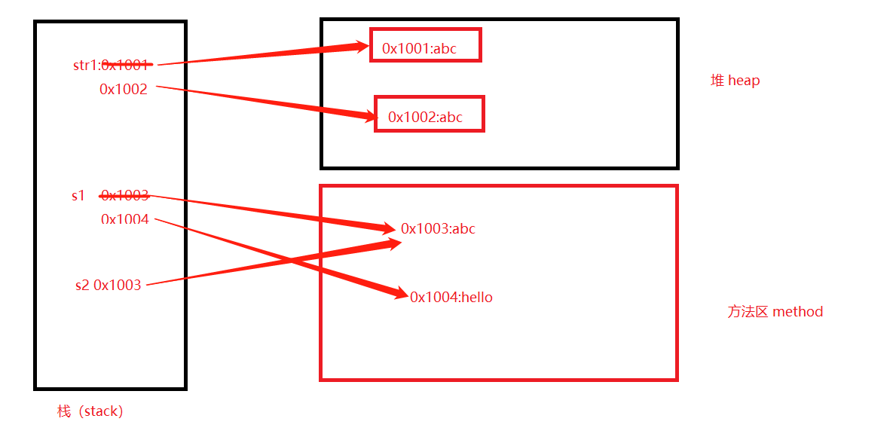
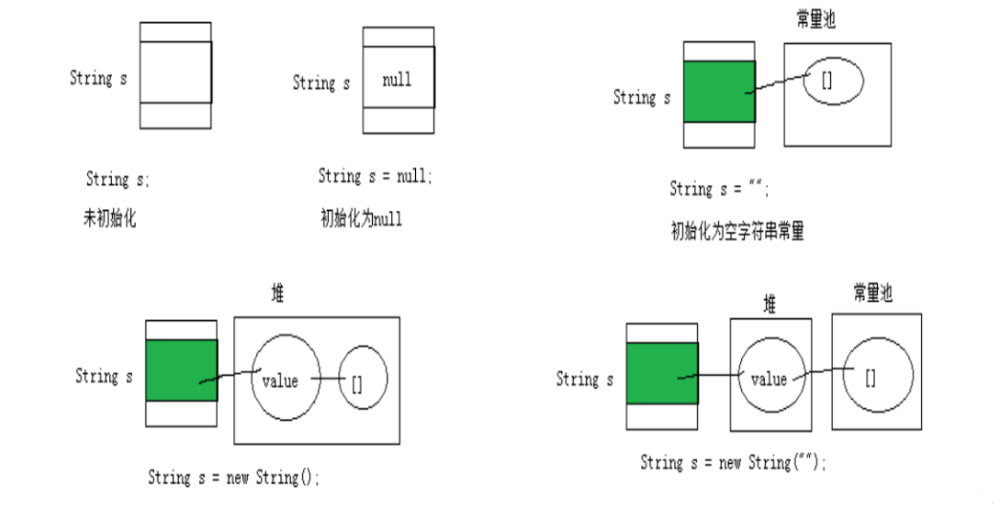
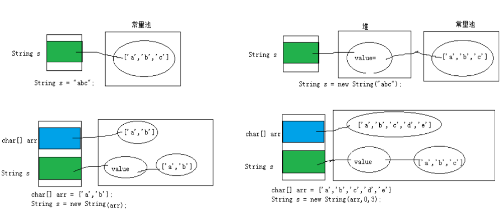
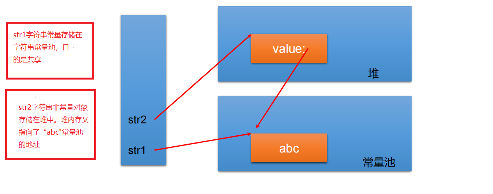
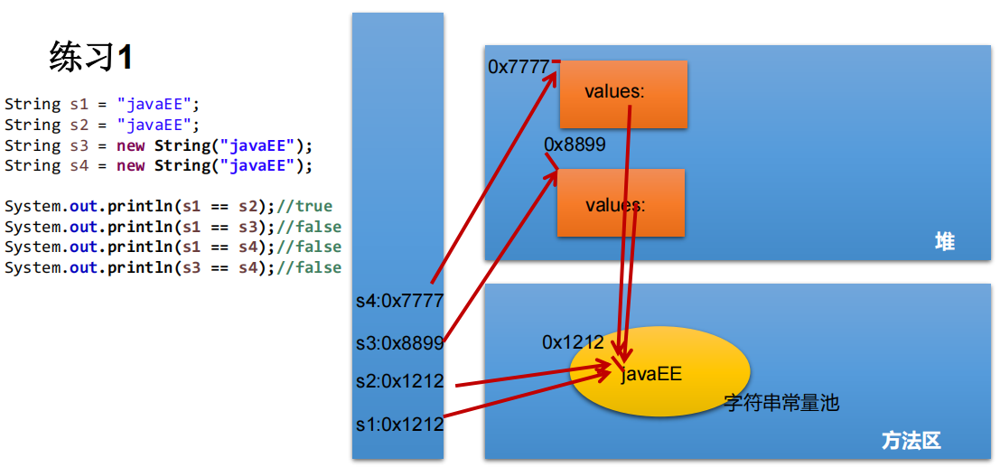
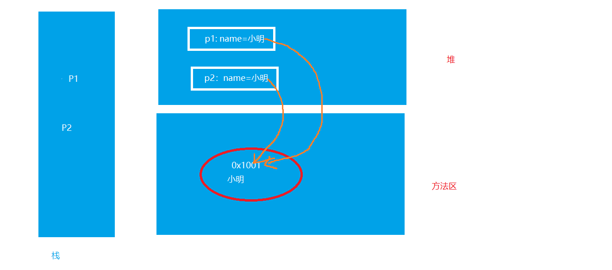
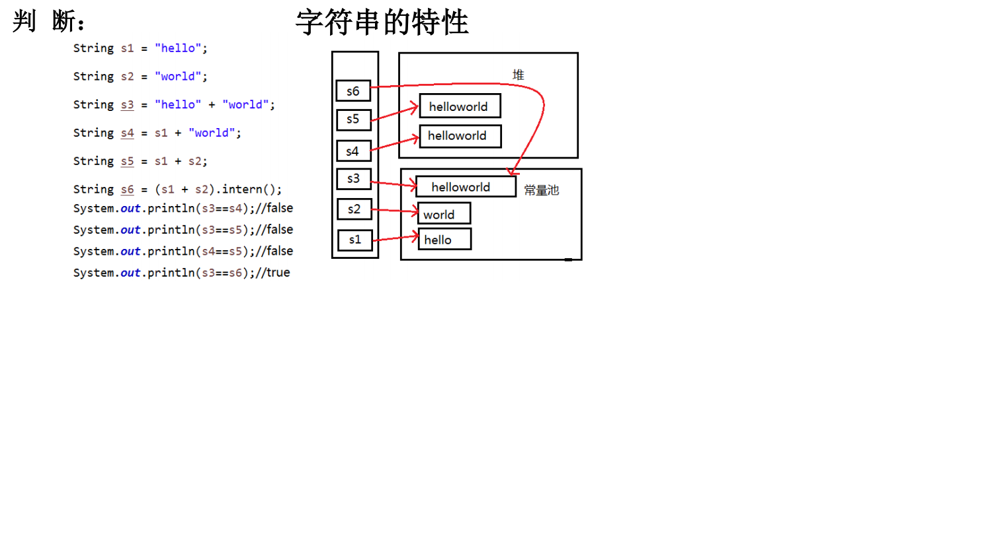

# 8.常用类
## String类及常用方法
:::tip  String的特性
● <font color='red'><strong>String类：代表字符串</strong></font>。Java 程序中的所有字符串字面值（如 "abc" ）都作为此类的实例实现。  
● String是一个final类，<font color='red'>代表不可变的字符序列</font>。  
● 字符串是常量，用双引号引起来表示。它们的值在创建之后不能更改。   
● String对象的字符内容是存储在一个字符数组value[]中的。 
:::  
```java
public final class String
    implements java.io.Serializable, Comparable<String>, CharSequence {
    /** The value is used for character storage. */
    private final char value[];

    /** Cache the hash code for the string */
    private int hash; // Default to 0
```
**示例**
```java
public class StringTest01 {
    public static void main(String[] args) {
        String str1=new String("abc");
        System.out.println(System.identityHashCode(str1));
        str1=new String("abc");
        System.out.println(System.identityHashCode(str1));

        String s1 = "abc";//字面量的定义方式
        System.out.println(System.identityHashCode(s1));
        String s2 = "abc";
        System.out.println(System.identityHashCode(s2));
        s1 = "hello";
        System.out.println(System.identityHashCode(s1));

    }
}
```
**程序运行过程：**

## String对象的创建
----
```java
//String创建方式
String str = "hello";
//本质上this.value = new char[0];
String s1 = new String(); 
//this.value = original.value;
String s2 = new String(String original); 
//this.value = Arrays.copyOf(value, value.length);
String s3 = new String(char[] a); 
String s4 = new String(char[] a,int startIndex,int count);
```
**String创建内存图解**

----------------------




---------------



::: tip <font color='red'><strong>面试题</strong></font>
<font color='red'><strong>String str1 = “abc”;与String str2 = new String(“abc”);的区别？</strong></font>  
:::


**练习题**

-------
```java
public class StringTest02 {
    public static void main(String[] args) {
        String s1 = "javaEE";
        String s2 = "javaEE";
        String s3 = new String("javaEE");
        String s4 = new String("javaEE");
        System.out.println(s1 == s2);//true
        System.out.println(s1 == s3);//false
        System.out.println(s1 == s4);//false
        System.out.println(s3 == s4);//false
    }
}
```
--------------------



```java
public class StringTest03 {
    public static void main(String[] args) {
        Person p1 = new Person();
        p1.name = "小明";
        Person p2 = new Person();
        p2.name = "小明";
        System.out.println(p1.name .equals( p2.name)); //true
        System.out.println(p1.name == p2.name); //true
        System.out.println(p1.name == "小明"); //true
    }
}

```
-----------



```java
public class StringTest {
    public static void main(String[] args) {
        String s1="abc";
        String s2="a"+"b"+"c";
        String s3="abc"+"";
        String s4=s3+"";
        String s5=new String("abc");
        String s6=s3.intern();

        System.out.println(s1==s2);
        System.out.println(s1==s3);
        System.out.println(s1==s4);
        System.out.println(s1==s5);
        System.out.println(s1==s6);
        System.out.println( System.identityHashCode(s1));
        System.out.println( System.identityHashCode(s2));
        System.out.println( System.identityHashCode(s3));
        System.out.println( System.identityHashCode(s4));
        System.out.println( System.identityHashCode(s5));
        System.out.println( System.identityHashCode(s6));


    }
}

```
------------


<br>
 
:::tip 结论：
◆ 常量与常量的拼接结果在常量池。且常量池中不会存在相同内容的常量。     
◆ 只要其中有一个是变量，结果就在堆中    
◆ 如果拼接的结果调用intern()方法，返回值就在常量池中    
:::
:::tip <font color='red'>String使用陷阱</font>
1. <font ><strong>String s1 = "a";</strong></font>   
说明：在字符串常量池中创建了一个字面量为"a"的字符串。
2. <font ><strong>s1 = s1 + "b";</strong></font>   
说明：实际上原来的“a”字符串对象已经丢弃了，现在在堆空间中产生了一个字符
串s1+"b"（也就是"ab")。如果多次执行这些改变串内容的操作，会导致大量副本
字符串对象存留在内存中，降低效率。如果这样的操作放到循环中，会极大影响
程序的性能。 
3. <font ><strong>String s2 = "ab";</strong></font>  
说明：直接在字符串常量池中创建一个字面量为"ab"的字符串。
4. <font ><strong>String s3 = "a" + "b";</strong></font>  
说明：s3指向字符串常量池中已经创建的"ab"的字符串。
5. <font ><strong>String s4 = s1.intern();</strong></font>    
说明：堆空间的s1对象在调用intern()之后，会将常量池中已经存在的"ab"字符串
赋值给s4。
:::

:::tip String常用方法
1. <font color='red'><strong>int length()</strong></font>：返回字符串的长度： return value.length
2. <font color='red'><strong>char charAt(int index)</strong></font>： 返回某索引处的字符return value[index] 
3. <font color='red'><strong> boolean isEmpty()</strong></font> ：判断是否是空字符串：return value.length == 0 
4. <font color='red'><strong> String toLowerCase()</strong></font> ：使用默认语言环境，将 String 中的所有字符转换为小写
5. <font color='red'><strong> String toUpperCase()</strong></font> ：使用默认语言环境，将 String 中的所有字符转换为大写
6. <font color='red'><strong> String trim()</strong></font> ：返回字符串的副本，忽略前导空白和尾部空白
7. <font color='red'><strong> boolean equals(Object obj)</strong></font> ：比较字符串的内容是否相同
8. <font color='red'><strong> boolean equalsIgnoreCase(String anotherString)</strong></font> ：与equals方法类似，忽略大
小写
9. <font color='red'><strong> String concat(String str)</strong></font> ：将指定字符串连接到此字符串的结尾。 等价于用“+”  int compareTo(String anotherString)：比较两个字符串的大小
10. <font color='red'><strong> String substring(int beginIndex)</strong></font> ：返回一个新的字符串，它是此字符串的从
beginIndex开始截取到最后的一个子字符串。  String substring(int beginIndex, int endIndex) ：返回一个新字符串，它是此字
符串从beginIndex开始截取到endIndex(不包含)的一个子字符串。
11. <font color='red'><strong> boolean contains(CharSequence s)</strong></font> ：当且仅当此字符串包含指定的 char 值序列
时，返回 true
12. <font color='red'><strong> int indexOf(String str)</strong></font> ：返回指定子字符串在此字符串中第一次出现处的索引
13. <font color='red'><strong> int indexOf(String str, int fromIndex)</strong></font> ：返回指定子字符串在此字符串中第一次出
现处的索引，从指定的索引开始
14. <font color='red'><strong> int lastIndexOf(String str)</strong></font> ：返回指定子字符串在此字符串中最右边出现处的索引
15. <font color='red'><strong> int lastIndexOf(String str, int fromIndex)</strong></font> ：返回指定子字符串在此字符串中最后
一次出现处的索引，从指定的索引开始反向搜索
注：indexOf和lastIndexOf方法如果未找到都是返回-1  boolean endsWith(String suffix)</strong></font> ：测试此字符串是否以指定的后缀结束
16. <font color='red'><strong> boolean startsWith(String prefix)</strong></font> ：测试此字符串是否以指定的前缀开始
17. <font color='red'><strong> boolean startsWith(String prefix, int toffset)</strong></font> ：测试此字符串从指定索引开始的子字符串是否以指定前缀开始
18. <font color='red'><strong> String replace(char oldChar, char newChar)</strong></font> ：返回一个新的字符串，它是
通过用 newChar 替换此字符串中出现的所有 oldChar 得到的。 
19. <font color='red'><strong> String replace(CharSequence target, CharSequence replacement)</strong></font> ：使用指定的字面值替换序列替换此字符串所有匹配字面值目标序列的子字符串。 
20. <font color='red'><strong> String replaceAll(String regex, String replacement) </strong></font> ： 使用给定的replacement 替换此字符串所有匹配给定的正则表达式的子字符串。
21. <font color='red'><strong> String replaceFirst(String regex, String replacement) </strong></font> ： 使用给定的replacement 替换此字符串匹配给定的正则表达式的第一个子字符串。 
22. <font color='red'><strong> boolean matches(String regex)</strong></font> ：告知此字符串是否匹配给定的正则表达式。 
23. <font color='red'><strong> String[] split(String regex)</strong></font> ：根据给定正则表达式的匹配拆分此字符串。  
24. <font color='red'><strong> String[] split(String regex, int limit)</strong></font> ：根据匹配给定的正则表达式来拆分此字符串，最多不超过limit个，如果超过了，剩下的全部都放到最后一个元素中。
:::

```java
public class StringMethod {
    public static void main(String[] args) {
        String str=new String("aaaaaaa【、【、；‘vddvsvd1241052bbvgdasvg我舍得广播纳斯达克VG不上课bd");
        System.out.println("str长度："+str.length());
        System.out.println("str出现XXX的位置："+str.indexOf("XXX"));//不存在返回-1
        System.out.println("str出现我舍得的位置："+str.indexOf("我舍得"));//返回指定子字符串在此字符串中第一次出现处的索引
        System.out.println("str出现我舍得的位置："+str.indexOf("我舍得",37));//返回指定子字符串在此字符串中第一次出现处的索引，从指定的索引开始
        System.out.println("str出现v的位置："+str.lastIndexOf("v"));//返回指定子字符串在此字符串中最右边出现处的索引
        System.out.println("str:"+str.replaceAll("我舍得","你舍得"));
        System.out.println("str:"+str);//String不可变
        System.out.println("str:"+new String(str.replace("a","A")));
        System.out.println("substring:"+str.substring(1,20));

        String str1="123|234|123sd|5467|sda";

        String[] strArray=str1.split("\\|");
        for (String array:strArray){
            System.out.println(array);
        }

        System.out.println("aa".equals(new String("aa")));
        System.out.println("".isEmpty());
        System.out.println("  aa sdss  ".trim());

    }
}
```


### String与基本数据类型转换
<font color='red'><strong>※ 字符串 ＞ 基本数据类型、包装类</strong></font>  
　◆ Integer包装类的public static int <font color='blue'><strong>parseInt(String s)</strong></font>：可以将由“数字”字符组成的字符串转换为整型。  
　◆ 类似地,使用java.lang包中的Byte、Short、Long、Float、Double类调相应的类方法可以将由“数字”字符组成的字符串，转化为相应的基本数据类型。  
<font color='red'><strong>※ 基本数据类型、包装类 ＞ 字符串</strong></font>  
　◆ 调用String类的public String <font color='blue'><strong>valueOf(int n)</strong></font>可将int型转换为字符串  
　◆ 相应的valueOf(byte b)、valueOf(long l)、valueOf(float f)、valueOf(double d)、valueOf(boolean b)可由参数的相应类型到字符串的转换  
<font color='red'><strong>※ 字符数组 ＞ 字符串</strong></font>  
　◆ String 类的构造器：<font color='blue'><strong>String(char[])</strong></font> 和 <font color='blue'><strong>String(char[]，int offset，int length)</strong></font> 分别用字符数组中的全部字符和部分字符创建字符串对象。  
<font color='red'><strong>※ 字符串 ＞ 字符数组</strong></font>  
　◆ public char[] <font color='blue'><strong>toCharArray()</strong></font>：将字符串中的全部字符存放在一个字符数组中的方法。  
　◆ public void <font color='blue'><strong>getChars(int srcBegin, int srcEnd, char[] dst, int dstBegin)</strong></font>：提供了将指定索引范围内的字符串存放到数组中的方法。  
<font color='red'><strong>※ 字节数组 ＞字符串</strong></font>  
　◆ <font color='blue'><strong>String(byte[])</strong></font>：通过使用平台的默认字符集解码指定的 byte 数组，构造一个新的 String。   
　◆ <font color='blue'><strong>String(byte[]，int offset，int length)</strong></font> ：用指定的字节数组的一部分，即从数组起始位置offset开始取length个字节构造一个字符串对象。  
<font color='red'><strong>※ 字符串 ＞ 字节数组</strong></font>  
　◆ public <font color='blue'><strong>byte[] getBytes()</strong></font> ：使用平台的默认字符集将此 String 编码为byte 序列，并将结果存储到一个新的 byte 数组中。  
　◆ public <font color='blue'><strong>byte[] getBytes(String charsetName)</strong></font> ：使用指定的字符集将 此 String 编码到 byte 序列，并将结果存储到新的 byte 数组。  

```java
public class StringToObject {
    public static void main(String[] args) {
        int a=100;
        String str=Integer.toString(a);
        str=String.valueOf(a);
        System.out.println(str);
        int b= Integer.parseInt(str);
        System.out.println(b);
        String str2=Double.toString(12.01);
        str2=Float.toString(12.01F);

        char[] chars={'1','2','a','b'};
        System.out.println(new String(chars));
        System.out.println(String.valueOf(chars));
        System.out.println( "aaaaa".toCharArray().length);
        System.out.println("dddd".getBytes());
        System.out.println(new String("dddd".getBytes()));
    }
}
```

### 常见算法题目
1. 模拟一个trim方法，去除字符串两端的空格。
2. 将一个字符串进行反转。将字符串中指定部分进行反转。比如“abcdefg”反转为”abfedcg”
3. 获取一个字符串在另一个字符串中出现的次数。比如：获取“ ab”在 “abkkcadkabkebfkabkskab” 中出现的次数
4. 获取两个字符串中最大相同子串。比如：str1 = "abcwerthelloyuiodef“;str2 = "cvhellobnm"
提示：将短的那个串进行长度依次递减的子串与较长的串比较。
5. 对字符串中字符进行自然顺序排序。
提示：
1）字符串变成字符数组。
2）对数组排序，选择，冒泡，Arrays.sort();
3）将排序后的数组变成字符串。

## StringBuffer、StringBuilder

### StringBuffer
※  java.lang.StringBuffer代表可变的字符序列，JDK1.0中声明，可以对字符串内容进行增删，<font color='red'>此时不会产生新的对象</font>。  
※  很多方法与String相同。  
※  作为参数传递时，<font color='red'>方法内部可以改变值</font>。  


<font size=4><strong>StringBuffer类不同于String，其对象必须使用构造器生成。有三个构造器：</strong></font>
※ StringBuffer()：初始容量为16的字符串缓冲区  
※ StringBuffer(int size)：构造指定容量的字符串缓冲区  
※ StringBuffer(String str)：将内容初始化为指定字符串内容  


1. StringBuffer append(xxx)：提供了很多的append()方法，用于进行字符串拼接
2. StringBuffer delete(int start,int end)：删除指定位置的内容
3. StringBuffer replace(int start, int end, String str)：把[start,end)位置替换为str
4. StringBuffer insert(int offset, xxx)：在指定位置插入xxx
5. StringBuffer reverse() ：把当前字符序列逆转
6. public int indexOf(String str)
7. public String substring(int start,int end)
8. public int length()
9. public char charAt(int n )
10 .public void setCharAt(int n ,char ch)


如上这些方法支持方法链操作。
:::tip 方法链的原理：

:::
### StringBuilder类 

<font size=4><strong>StringBuilder 和 StringBuffer 非常类似，均代表可变的字符序列，而且提供相关功能的方法也一样</strong></font>


:::tip 面试题：对比String、StringBuffer、StringBuilder
1. String(JDK1.0)：不可变字符序列  
2. StringBuffer(JDK1.0)：可变字符序列、效率低、线程安全  
3. StringBuilder(JDK 5.0)：可变字符序列、效率高、线程不安全  
底层都是char[]数组，但是String是用final修饰的
<font color='red'>注意：作为参数传递的话，方法内部String不会改变其值，StringBuffer和StringBuilder会改变其值。</font>
:::

【面试题】程序输出：
String str = null;
StringBuffer sb = new StringBuffer();
sb.append(str);
System.out.println(sb.length());//
System.out.println(sb);//
StringBuffer sb1 = new StringBuffer(str);
System.out.println(sb1);//


## JDK 8之前的日期时间API
## JDK 8中新日期时间API
## Java比较器
## System类
## Math类
## BigInteger与BigDecimal
## DecimalFormat类
## Random类