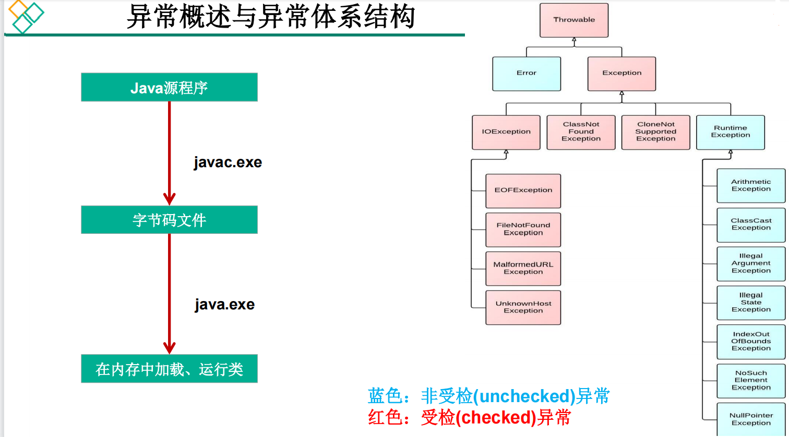
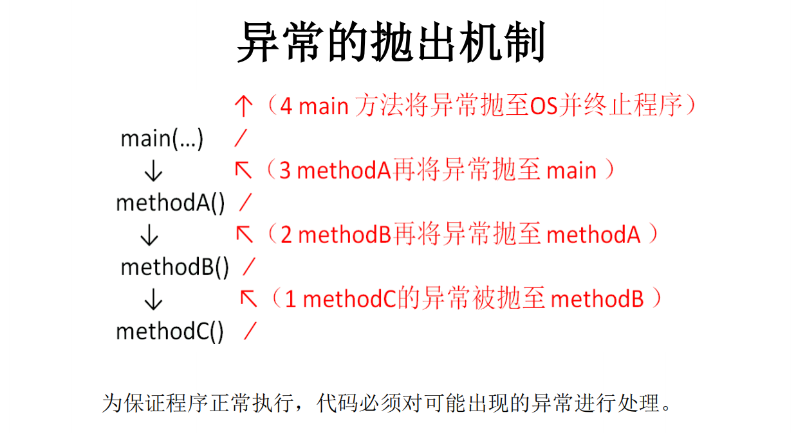

# 6.异常处理
## 异常定义
::: tip 异常定义
在Java语言中，将程序执行中发生的不正常情况称为“异常”。 (开发过程中的语法错误和逻辑错误不是异常)
:::
----

Java程序在执行过程中所发生的异常事件可分为两类：  
◇ <font color='red'><strong>Error</strong></font>：Java虚拟机无法解决的严重问题。如：JVM系统内部错误、资源耗尽等严重情况。比如：<font color='blue'><strong>StackOverflowError</strong></font>和<font color='blue'><strong>OOM</strong></font>。一般不编写针对性的代码进行处理。   
◇ <font color='red'><strong>Exception</strong></font>: 其它因编程错误或偶然的外在因素导致的一般性问题，可以使用针对性的代码进行处理。例如：  
<font color='red'>✔ 空指针访问</strong></font>  
<font color='red'>✔ 试图读取不存在的文件</strong></font>  
<font color='red'>✔ 网络连接中断</strong></font>  
<font color='red'>✔ 数组角标越界</strong></font>



## 异常分类
### 1.运行时异常
◆ 是指编译器不要求强制处置的异常。一般是指编程时的逻辑错误，是程序员应该积极避免其出现的异常。<font color='red'><strong>java.lang.RuntimeException类</strong></font>及它的子类都是运行时异常。  
◆ 对于这类异常，可以不作处理，因为这类异常很普遍，若全处理可能会对程序的可读性和运行效率产生影响。  
### 2.编译时异常
◆ 是指编译器要求必须处置的异常。即程序在运行时由于外界因素造成的一般性异常。<font color='red'><strong>编译器要求Java程序必须捕获或声明所有编译时异常</strong></font>。  
◆ 对于这类异常，如果程序不处理，可能会带来意想不到的结果 

## 常见的异常

<font color='red'><strong>◆ java.lang.RuntimeException</strong></font>  
✔ ClassCastException  --类型转换异常  
✔ ArrayIndexOutOfBoundsException   --数组越界异常 
✔ NullPointerException    --空指针异常  
✔ ArithmeticException  --算术运算异常  
✔ NumberFormatException  --数字格式异常  
✔ InputMismatchException   --输入类型不匹配异常
✔。。。  
<font color='red'><strong>◆ java.io.IOExeption</strong></font>  
 ✔ FileNotFoundException  --文件不存在异常  
 ✔ EOFException  
◆ java.lang.ClassNotFoundException  --类找不到异常  
◆ java.lang.InterruptedException   -- 中断故障(异常)
◆ java.io.FileNotFoundException  
◆ java.sql.SQLException  --数据库访问错误  

**实例**
```java
package javabase.block.javabase;

import javabase.inheritance.Person;

import java.util.Date;

public class ExecptionTest {
    public static void main(String[] args) {
        arithmeticExceptionTest();
        arrayIndexOutOfBoundsExceptionTest();
        nullPointerExceptionTest();
        classCastExceptionTest();
    }
    //算术运算符异常
    public static void arithmeticExceptionTest() {
        int y;
        y=3/0;
        System.out.println("program ends ok!");
    }
    //空指针异常
    public  static  void nullPointerExceptionTest(){
        Person person;
        person=null;
        System.out.println(person.age);
    }
    //类型转换异常
    public static void classCastExceptionTest() {
        Object obj = new Date();
        Person person;
        person = (Person) obj;
        System.out.println(person);
    }
    //数组越界异常
    public static void arrayIndexOutOfBoundsExceptionTest() {
        String friends[] = { "lisa", "bily", "kessy" };
        for (int i = 0; i < 5; i++) {
            System.out.println(friends[i]); // friends[4]?
        }
        System.out.println("\nthis is the end");
    }
}

```
## Java异常处理的方式：

::: tip 异常抛出方式
<font color='red'><strong>方式一：try-catch-finally </strong></font>   
<font color='red'><strong>方式二：throws + 异常类型</strong></font>  
:::

----
:::warning 异常处理
<font color='red'><strong>☆Java提供的是异常处理的<font color='blue' size=4><strong>抓抛模型</strong></font>。</strong></font>   
<font color='red'><strong>☆Java程序的执行过程中如出现异常，会生成一个异常类对象，该异常对象将被提交给Java运行时系统，这个过程称为<font color='blue' size=4><strong>抛出(throw)异常</strong></font> 。</strong></font>     
<font color='red'><strong>☆异常对象的生成 </strong></font>   
◆由虚拟机<font color='red'><strong>自动生成</strong></font>：程序运行过程中，虚拟机检测到程序发生了问题，如果在当前代码中没有找到相应的处理程序，就会在后台自动创建一个对应异常类的实例对象并抛出——自动抛出    
◆由开发人员<font color='red'><strong>手动创建</strong></font>：<font color='red'><strong>Exception exception = new ClassCastException();</strong></font>——创建好的异常对象不抛出对程序没有任何影响，和创建一个普通对象一样   
::: 

### 异常处理是通过try-catch-finally语句实现的。

```java
try{
...... //可能产生异常的代码
}
catch( ExceptionName1 e ){
...... //当产生ExceptionName1型异常时的处置措施
}
catch( ExceptionName2 e ){
...... //当产生ExceptionName2型异常时的处置措施
}[ finally{
...... //无论是否发生异常，都无条件执行的语句
} ]
```


:::danger 异常关键字
<font color='red'><strong>★try</strong></font>  
捕获异常的第一步是用try{…}语句块选定捕获异常的范围，将可能出现异常的代码放在try语句块中。   
<font color='red'><strong>★catch (Exceptiontype e)</strong></font>  
在catch语句块中是对<font color='red'>异常对象</font>进行处理的代码。每个try语句块可以伴随一个或多个<font color='red'>catch语句</font>，用于处理可能产生的<font color='red'>不同类型的异常对象</font>。 

<font color='green'>如果明确知道产生的是何种异常，可以用该异常类作为catch的参数；也可以用其父类作为catch的参数。</font>
比 如 ： 可 以 用 ArithmeticException 类作为参数的地方 ， 就可以用RuntimeException类作为参数，或者用所有异常的父类Exception类作为参数。但不能是与ArithmeticException类无关的异常，如NullPointerException（catch中的语句将不会执行）。
<br>
<font color='red'><strong>★finally</strong></font>  
▷捕获异常的最后一步是通过finally语句为异常处理提供一个统一的出口，使得在控制流转到程序的其它部分以前，能够对程序的状态作统一的管理。  
▷不论在try代码块中是否发生了异常事件，catch语句是否执行，catch语句是否有异常，catch语句中是否有return，finally块中的语句都会被执行。  
▷finally语句和catch语句是任选的  
:::

### 声明抛出异常举例：

:::tip throws
throws的作用是声明抛出异常，在方法声明的位置上使用throws关键字向上抛出异常。例如下面程序演示了一般性异常，编译无法通过，需要对异常进行处理
:::
```java
public void readFile(String file) throws FileNotFoundException {
……
// 读文件的操作可能产生FileNotFoundException类型的异常
FileInputStream fis = new FileInputStream(file);
..……
}
```
### 手工抛出异常


**try catch throws 手工抛异常示例**
```java
package javabase.execption;

import java.io.FileInputStream;

public class TestException {
    // throws抛异常
    public static void main(String[] args) throws Exception {
        boolean bool=true;
        //手工抛异常
        if (bool){
            throw new Exception("手工抛异常处理");
        }
        // try catch方式
        try{
            FileInputStream in = new FileInputStream("atguigushk.txt");
            int b; b = in.read();
            while (b != -1) {
                System.out.print((char) b);
                b = in.read();
            }
            in.close();
        }catch(RuntimeException re){
            System.out.println(re.getMessage());
        }
        catch(Exception e){
            System.out.println(e.getMessage());
        }finally {
            System.out.println("最后处理！！！");
        }
    }

}

```
### 自定义异常

:::danger 自定义异常
当java里面的异常无法满足开发者的需求时，可以自定义异常。  
<font color='red'><strong>如何自定义异常？</strong></font>   
可以看下其他Exception里面的源码进行参考。  
如果自定义异常是RuntimeException类型的，那就直接继承RuntimeException即可否则就继承Exception。  
继承之后一般提供两个构造方法，如下自定义名为BlogException的异常  
:::

```java
import com.tqk.blog.enums.ResultEnum;

/**
 * 自定义异常
 * @author tqk
 * @date
 */
public class BlogException extends RuntimeException {

    private static final long serialVersionUID = 1L;
    private Integer errorCode = ResultEnum.ERROR.getCode();
    private String  errorMsg;
    /**
     *
     * @param resultEnum
     */
    public BlogException(ResultEnum resultEnum) {
        super(resultEnum.getMsg());
        this.errorCode = resultEnum.getCode();
        this.errorMsg=resultEnum.getMsg();
    }
    /**
     *
     * @param resultEnum
     */
    public BlogException(ResultEnum resultEnum, String msg) {
        super(msg);
        this.errorCode = resultEnum.getCode();
        this.errorMsg=msg;
    }
    public BlogException(ResultEnum resultEnum, Throwable throwable) {
        super(resultEnum.getMsg(), throwable);
        this.errorCode = resultEnum.getCode();
    }

    public BlogException(Integer errorCode, String msg) {
        super(msg);
        this.errorCode = errorCode;
    }

    public BlogException(String msg) {
        super(msg);
    }

    public BlogException(Throwable throwable) {
        super(throwable);
    }

    public BlogException(String msg, Throwable throwable) {
        super(msg, throwable);
    }

    public Integer getErrorCode() {
        return errorCode;
    }
}

```