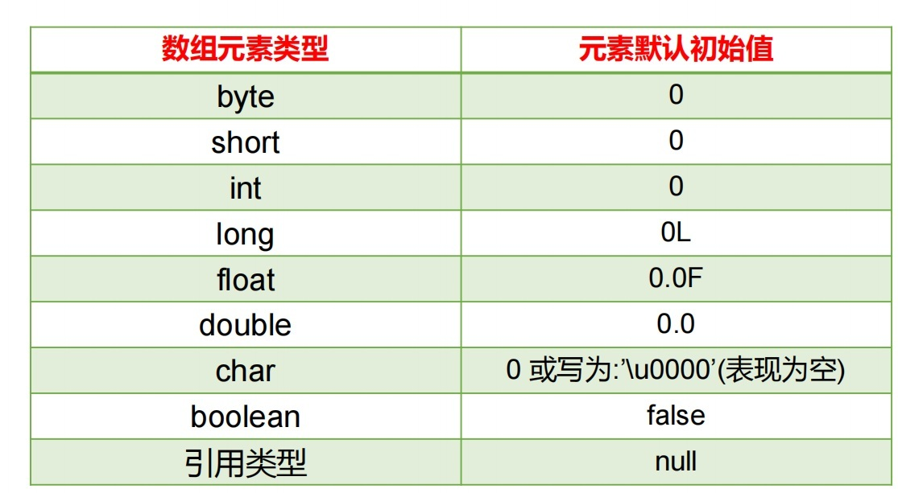
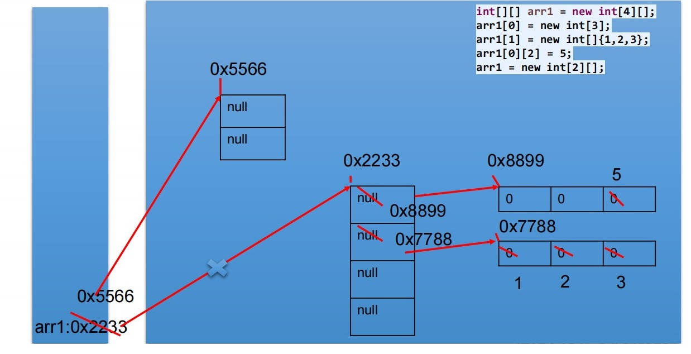

# 4.数组
[[toc]]
## 4.1 数组概述

<font color='red'><strong>数组(Array)，是多个相同类型数据按一定顺序排列的集合，并使用一个名字命名，并通过编号的方式对这些数据进行统一管理</strong></font>   

**数组的常见概念**   
▷  数组名   
▷  下标(或索引)   
▷  元素  
▷  数组的长度 


数组本身是引用数据类型，而数组中的元素可以是<font color='red'><strong>任何数据类型</strong></font> ，包括基本数据类型和引用数据类型   
1. 创建数组对象会在内存中开辟一整块连续的空间，而<font color='red'><strong>数组名中引用的是这块连续空间的首地址</strong></font>    
2. <font color='red'><strong>数组的长度一旦确定，就不能修改</strong></font>  
3. 我们可以直接通过下标(或索引)的方式调用指定位置的元素，速度很快。

4. 数组的分类：
▷  按照维度：一维数组、二维数组、三维数组、… 
▷  按照元素的数据类型分：基本数据类型元素的数组、引用数据类型元素的数组(即对象数组)

## 4.2 一维数组的使用

**一维数组的声明方式：**
<font color='red'><strong>type var[] 或 type[] var；</strong></font> 

**例如:** 
int a[];  
int[] a1;  
double b[];  
String[] c; //引用类型变量数组    
▷ ava语言中声明数组时不能指定其长度(数组中元素的数)， 例如： int a[5]; //非法  


**一维数组的使用：初始化**

<font color='red'><strong>动态初始化：数组声明且为数组元素分配空间与赋值的操作分开进行</strong></font>  

```java
int[] arr = new int[3];
arr[0] = 3;
arr[1] = 9;
arr[2] = 8; 

String names[];
names = new String[3];
names[0] = "钱学森";
names[1] = "邓稼先";
names[2] = "袁隆平";
```

<font color='red'><strong>静态初始化：在定义数组的同时就为数组元素分配空间并赋值</strong></font>  

```java
int arr[] = new int[]{ 3, 9, 8};
int[] arr = {3,9,8};

String names[] = {"李四光","茅以升","华罗庚" }
```

<strong>■ 数组是引用类型，它的元素相当于类的成员变量，因此数组一经分配空间，其中的每个元素也被按照成员变量同样的方式被<font color='red'>隐式初始化</font></strong> 例如：

```java
public class Test {
    public static void main(String argv[]){
        int a[]= new int[5];
        System.out.println(a[3]); //a[3]的默认值为0 
    }
} 
```
<font color='red'><strong>▷对于基本数据类型而言，默认初始化值各有不同</strong></font> 
<font color='red'><strong>▷对于引用数据类型而言，默认初始化值为null(注意与0不同！)</strong></font>

<a data-fancybox title="数组元素的默认初始化值" href="../image/arrays1.jpg"></a>


## 4.3 多维数组的使用


<font color='#4C8BF4'><strong>二维数组[][]：数组中的数组</strong></font> 

<font color='red'><strong>格式1（动态初始化）：int[][] arr = new int[3][2];</strong></font>  
定义了名称为arr的二维数组  
二维数组中有3个一维数组  
每一个一维数组中有2个元素  
一维数组的名称分别为arr[0], arr[1], arr[2]  
给第一个一维数组1脚标位赋值为78写法是：arr[0][1] = 78;  

<font color='red'><strong>格式2（动态初始化）：int[][] arr = new int[3][];</strong></font>  
二维数组中有3个一维数组。  
每个一维数组都是默认初始化值null (注意：区别于格式1）  
可以对这个三个一维数组分别进行初始化  
arr[0] = new int[3]; arr[1] = new int[1]; arr[2] = new int[2];  
<font color='blue'><strong>注：int[][]arr = new int[][3]; //非法</strong></font>  

<font color='red'><strong>格式3（静态初始化):</strong></font>

```java
int[][] arr = new int[][]{{3,8,2},{2,7},{9,0,1,6}};
```

定义一个名称为arr的二维数组，二维数组中有三个一维数组  
每一个一维数组中具体元素也都已初始化  
第一个一维数组 arr[0] = {3,8,2};  
第二个一维数组 arr[1] = {2,7};  
第三个一维数组 arr[2] = {9,0,1,6};  
第三个一维数组的长度表示方式：arr[2].length;   


▷ 注意特殊写法情况：int[] x,y[]; x是一维数组，y是二维数组  
▷ Java中多维数组不必都是规则矩阵形式  

#### 多维数组的使用：二维数组内存解析
<a data-fancybox title="二维数组内存解析" href="../image/arrays2.jpg"></a>

## 4.3 数组中涉及的常见算法
1. 数组元素的赋值(杨辉三角、回形数等)
2. 求数值型数组中元素的最大值、最小值、平均数、总和等
3. 数组的复制、反转、查找(线性查找、二分法查找)
4. 数组元素的排序算法

:::warning 十大内部排序算法
1. 选择排序   
▷  直接选择排序、堆排序   
2. 交换排序  
▷  冒泡排序、快速排序  
3. 插入排序  
▷  直接插入排序、折半插入排序、Shell排序    
4. 归并排序
5. 桶式排序
6. 基数排序
:::

## 4.4 Arrays工具类的使用
1. boolean equals(int[] a,int[] b) 判断两个数组是否相等。
2. String toString(int[] a) 输出数组信息。
3. void fill(int[] a,int val) 将指定值填充到数组之中。
4. void sort(int[] a) 对数组进行排序。
5. int binarySearch(int[] a,int key) 对排序后的数组进行二分法检索指定的值。


## 4.5 数组使用中的常见异常
:::tip  <font color='red'><strong>数组使用中的常见异常</strong></font>  
1. <font color='red'><strong>数组脚标越界异常(ArrayIndexOutOfBoundsException)</strong></font>

```java
int[] arr = new int[2];
System.out.println(arr[2]);
System.out.println(arr[-1]);
// 访问到了数组中的不存在的脚标时发生
```

2. <font color='red'><strong>空指针异常(NullPointerException)</strong></font>

```java
int[] arr = null;
System.out.println(arr[0]);
// arr引用没有指向实体，却在操作实体中的元素时
```
:::