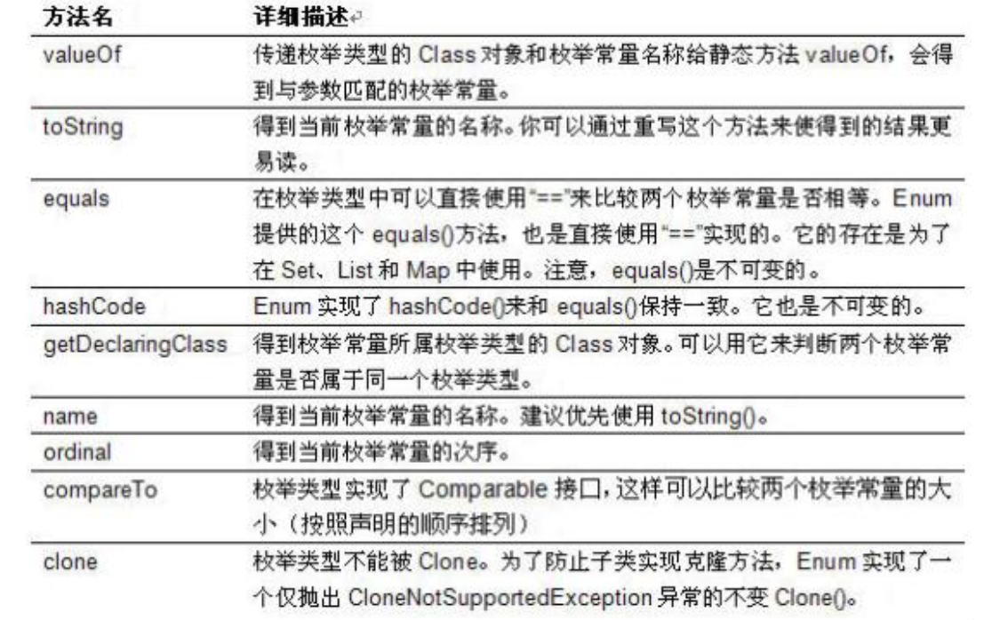

# 7.枚举值和注解
[[toc]]
## ◆ 如何自定义枚举类
::: warning 使用说明
※使用 enum 定义的枚举类默认继承了 java.lang.Enum类，因此不能再继承其他类  
※枚举类的构造器只能使用 private 权限修饰符  
※枚举类的所有实例必须在枚举类中显式列出<font color='red'>(, 分隔 ; 结尾)</font>。列出的实例系统会自动添加 public static final 修饰  
※必须在枚举类的第一行声明枚举类对象  
:::

```java
@Getter
@AllArgsConstructor
public enum ResultEnum {
    /**
     * 返回结果枚举，每个枚举代表着一个返回状态
     */
    SUCCESS(20000, "操作成功！"),
    ERROR(40000, "操作失败！"),
    DATA_NOT_FOUND(40001, "查询失败！"),
    PARAMS_NULL(40002, "参数不能为空！"),
    PARAMS_ERROR(40005, "参数不合法！"),
    NOT_LOGIN(40003, "当前账号未登录！")
    ;
    private  Integer code;
    private  String  msg;

}
```
## ◆ 如何使用关键字enum定义枚举类

:::tip
1. 私有化类的构造器，保证不能在类的外部创建其对象
2. 在类的内部创建枚举类的实例。声明为：<font color='red'>public static final</font> 
3. 对象如果有实例变量，应该声明为<font color='red'>private final</font>，并在构造器中初始化
:::

```java
class Season{
private final String SEASONNAME;//季节的名称
private final String SEASONDESC;//季节的描述
private Season(String seasonName,String seasonDesc){
this.SEASONNAME = seasonName;
this.SEASONDESC = seasonDesc; }
public static final Season SPRING = new Season("春天", "春暖花开");
public static final Season SUMMER = new Season("夏天", "夏日炎炎");
public static final Season AUTUMN = new Season("秋天", "秋高气爽");
public static final Season WINTER = new Season("冬天", "白雪皑皑");
}
```

## ◆ Enum类的主要方法
::: tip <font color='red'>Enum类的主要方法：</font>  
✔ values()方法：返回枚举类型的对象数组。该方法可以很方便地遍历所有的枚举值。   
✔ valueOf(String str)：可以把一个字符串转为对应的枚举类对象。要求字符串必须是枚举类对象的“名字”。如不是，会有运行时异常:IllegalArgumentException。   
✔ toString()：返回当前枚举类对象常量的名称  

:::

----

```java
@Getter
public enum StateEnums {
    /**
     * 逻辑删除状态
     */
    DELETED(1, "已删除"),
    NOT_DELETED(0, "未删除"),

    /**
     * 启用状态
     */
    ENABLED(1, "启用"),
    NOT_ENABLE(0, "未启用"),

    private final Integer code;
    private final String msg;

    StateEnums(Integer code, String msg) {
        this.code = code;
        this.msg = msg;
    }

    public StateEnums geEnumByCode(Integer code){
        if(code==null){
            return null;
        }
        for (StateEnums stateEnums:StateEnums.values()) {
            if (code==stateEnums.getCode()){
                return stateEnums;
            }else{
                continue;
            }
        }
        return null;
    }
}
```
-----------------------------

## 注解(Annotation)概述
## 常见的Annotation示例
## 自定义Annotation
## JDK中的元注解
## 利用反射获取注解信息（在反射部分涉及）
## JDK 8中注解的新特性