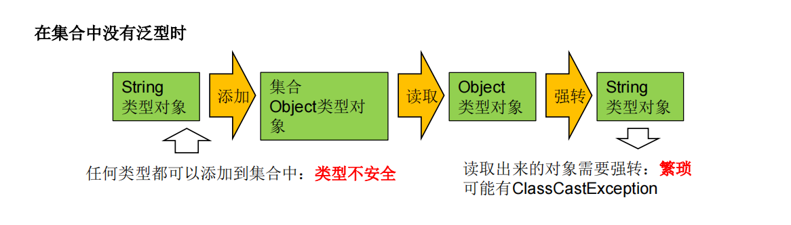

# 11.泛型

## 泛型设计背景

集合容器类在设计阶段/声明阶段不能确定这个容器到底实际存的是什么类型的
对象，所以<font color='blue'><strong>在JDK1.5之前只能把元素类型设计为Object，JDK1.5之后使用泛型来
解决</strong></font>。因为这个时候除了元素的类型不确定，其他的部分是确定的，例如关于
这个元素如何保存，如何管理等是确定的，因此<font color='red'><strong>此时把元素的类型设计成一个
参数，这个类型参数叫做泛型</strong></font>。Collection&#60;E&#62;，List&#60;E&#62;，ArrayList&#60;E&#62; 这个&#60;E&#62;就
是类型参数，即泛型。

## 泛型概念
所谓泛型，就是允许在定义类、接口时通过一个标识表示类中某个属性的类
型或者是某个方法的返回值及参数类型。这个类型参数将在使用时（例如，
继承或实现这个接口，用这个类型声明变量、创建对象时）确定（即传入实
际的类型参数，也称为类型实参）。



----------------------------


```java
import java.util.ArrayList;
import java.util.List;

public class Generic {
    public static void main(String[] args) {
        objectMethod();
        genericMethod();

    }

    private static void genericMethod() {
        List<Integer> list1=new ArrayList<Integer>();
        List<String> list2=new ArrayList<String>();
        List<Person> list3=new ArrayList<Person>();
        list1.add(1);
        list2.add("xm");
        Person person=new Person();
        person.name="111";
        person.age=11;
        list3.add(person);
        for (Integer o : list1) {
            System.out.println(o);
        }
        for (String o : list2) {
            System.out.println(o);
        }
        for (Person o : list3) {
            System.out.println(o.toString());
        }
    }

    private static void objectMethod() {
        List<Object> list=new ArrayList<Object>();
        list.add(1);
        list.add("xm");
        Person person=new Person();
        person.name="111";
        person.age=11;
        list.add(person);
        for (Object o : list) {
            if(o instanceof Integer||o instanceof String){
                System.out.println(o);
            }else if(o instanceof Person){
                System.out.println(o.toString());
            }
        }
    }
    private static <T> void objectMethod2() {
        List<T> list=new ArrayList<T>();
    }
}
```

## 泛型的优点
1. 可以统一集合中的数据类型，提高安全性
2. 可以减少强制类型转换
3. Java泛型可以保证如果程序在编译时没有发出警告，运行时就不会产生ClassCastException异常。同时，代码更加简洁、健壮。


## 自定义泛型结构
1.泛型的声明
<font color='red'><strong>interface List&lt;T&gt; 和 class GenTest&lt;K,V&gt;</strong></font>
其中，T,K,V不代表值，而是表示类型。这里使用任意字母都可以。常用T表示，是Type的缩写。

2.泛型的实例化：
一定要在类名后面指定类型参数的值（类型）。如：
```java
List<String> strList = new ArrayList<String>();
Iterator<Customer> iterator = customers.iterator();
```
<font color='red'><strong>T只能是类，不能用基本数据类型填充。但可以使用包装类填充</strong></font>  
把一个集合中的内容限制为一个特定的数据类型，这就是generics背后的核心思想


### 自定义泛型类
```java
public class  Person<T> {
    //泛型成员变量
    private  T name;
    //泛型方法
    public T getName() {
        return name;
    }

    public void setName(T name) {
        this.name = name;
    }

    public Person(T name) {
        this.name = name;
    }

    public Person() {
    }
}
public class Generic2 {
    public static void main(String[] args) {
        Person person=new Person();
        person.setName("小明");
        System.out.println(person.getName());
    }
}
```

1. 泛型类可能有多个参数，此时应将多个参数一起放在尖括号内。比如：&lt;E1,E2,E3&gt;
2. 泛型类的构造器如下：public GenericClass(){}。
而下面是错误的：public GenericClass&lt;E&gt;(){}
3. 实例化后，操作原来泛型位置的结构必须与指定的泛型类型一致。
4. 泛型不同的引用不能相互赋值。
>尽管在编译时ArrayList&lt;String&gt;和ArrayList&lt;Integer&gt;是两种类型，但是，在运行时只有一个ArrayList被加载到JVM中。
5. 泛型如果不指定，将被擦除，泛型对应的类型均按照Object处理，但不等价于Object。经验：泛型要使用一路都用。要不用，一路都不要用。
6. 如果泛型结构是一个接口或抽象类，则不可创建泛型类的对象。
7. jdk1.7，泛型的简化操作：ArrayList&lt;Fruit&gt; flist = new ArrayList<>();
8. 泛型的指定中不能使用基本数据类型，可以使用包装类替换。
9. 在类/接口上声明的泛型，在本类或本接口中即代表某种类型，可以作为非静态属性的类型、非静态方法的参数类型、非静态方法的返回值类型。但在静态方法中不能使用类的泛型。
10. 异常类不能是泛型的
11. 不能使用new E[]。但是可以：E[] elements = (E[])new Object[capacity];  
    参考：ArrayList源码中声明：Object[] elementData，而非泛型参数类型数组。  
12. 父类有泛型，子类可以选择保留泛型也可以选择指定泛型类型：   
    ▶子类不保留父类的泛型：按需实现  
    　√ 没有类型 擦除  
    　√ 具体类型  
    ▶ 子类保留父类的泛型：泛型子类  
    　√ 全部保留  
    　√ 部分保留  
结论：子类必须是“富二代”，子类除了指定或保留父类的泛型，还可以增加自己的泛型  
```java
public class Father<T1,T2,T3> {
    public Father() {
    }

}
// 子类不保留父类的泛型
// 1)没有类型 擦除
class Son1 extends Father{
// 等价于class Son extends Father<Object,,Object,Object>
}
// 子类保留父类的泛型
// 全部保留
class Son2<T1,T2,T3> extends Father<T1,T2,T3>{

}
//部分保留
class Son3<T1,T3> extends Father<T1,T2,T3>{

}
// 具体类型
class Son4 extends Father<Integer,Object, String> {
}

// 子类不保留父类的泛型
// 1)没有类型 擦除
class Son11<A, B> extends Father{//等价于class Son extends Father<Object,Object>{
}
// 2)具体类型
class Son12<A, B> extends Father<Integer,Object, String> {
}
// 子类保留父类的泛型
// 1)全部保留
class Son13<T1, T2, A, B> extends Father<T1, T2,T3> {
}
// 2)部分保留
class Son14<T2, A, B> extends Father<Integer, T2,Object> {
}
```

### 自定义泛型接口

```java
public interface Map<K, V> {
    public void put(K key, V value);
    public V get(K key);
    //......
}
```
### 自定义泛型方法
1.方法，也可以被泛型化，不管此时定义在其中的类是不是泛型类。
在泛型方法中可以定义泛型参数，此时，参数的类型就是传入数据的类型。   
**泛型方法的格式：**  
<font color='red'><strong>[访问权限] &lt;泛型&gt; 返回类型 方法名([泛型标识 参数名称]) 抛出的异常</strong></font>  

```java
public class Generic2 {
    public static void main(String[] args) {
        Person person=new Person();
        person.setName("小明");
        System.out.println(person.getName());
        Object[] ao = {"aaa",1111,new Person<>()};
        Collection<Object> co = new ArrayList<Object>();
        copyArrayToCollections(ao, co);
        System.out.println(co);
    }
    public static <T> void copyArrayToCollections(T[] a, Collection<T> c){
        for (T o: a) {
            c.add(o);
        }
    }
}
```

## 通配符

1. 使用<font color='red'><strong>类型通配符：？</strong></font> 比如：List<?> ，Map<?,?>List<?>是List&lt;String&gt;、List&lt;Object&gt;等各种泛型List的父类。　 
2. 读取List<?>的对象list中的元素时，永远是安全的，因为不管list的真实类型是什么，它包含的都是Object。  　
3. 写入list中的元素时，不行。因为我们不知道c的元素类型，我们不能向其中添加对象  
　▶ 唯一的例外是null，它是所有类型的成员。   
　▶ 将任意元素加入到其中不是类型安全的：   

--------------

```java
Collection<?> c = new ArrayList<String>();
c.add(new Object()); // 编译时错误
```

因为我们不知道c的元素类型，我们不能向其中添加对象。add方法有类型参数E作为集合的元素类型。我们传给add的任何参数都必须是一个未知类型的子类。因为我们不知道那是什么类型，所以我们无法传任何东西进去。  
▶ 另一方面，我们可以调用get()方法并使用其返回值。返回值是一个未知的类型，但是我们知道，它总是一个Object。  

```java
public class Generic3 {
    public static void main(String[] args) {
        List<?> list = null;
        list = new ArrayList<String>();
        list = new ArrayList<Integer>();
        //将任意元素加入到其中不是类型安全的：  唯一的例外的是null，它是所有类型的成员。
//         list.add(3);//编译不通过
        list.add(null);
        List<String> l1 = new ArrayList<String>();
        List<Integer> l2 = new ArrayList<Integer>();
        l1.add("尚硅谷");
        l2.add(15);
        read(l1);
        read(l2);
    }
    public static void read(List<?> list) {
        for (Object o : list) {
            System.out.println(o);
        } }
}
```

**注意**

```java
//注意点1：编译错误：不能用在泛型方法声明上，返回值类型前面<>不能使用?
public static <?> void test(ArrayList<?> list){
}
//注意点2：编译错误：不能用在泛型类的声明上
class GenericTypeClass<?>{
}
//注意点3：编译错误：不能用在创建对象上，右边属于创建集合对象
ArrayList<?> list2 = new ArrayList<?>();
```
### 有限制的通配符
<?> 允许所有泛型的引用调用  
<font color='red'><strong>▶ 通配符指定上限</strong></font>     
上限extends：使用时指定的类型必须是继承某个类，或者实现某个接口，即<=     
<font color='red'><strong>▶  通配符指定下限</strong></font>     
下限super：使用时指定的类型不能小于操作的类，即>=    
举例：    
<font color='red'><strong>▶ <? extends Number> (无穷小 , Number]</strong></font>   
只允许泛型为Number及Number子类的引用调用  
<font color='red'><strong>▶ <? super Number> [Number , 无穷大)</strong></font>   
 只允许泛型为Number及Number父类的引用调用  
<font color='red'><strong>▶ <? extends Comparable></strong></font>   
只允许泛型为实现Comparable接口的实现类的引用调用  

```java
public class Generic4 {
    public static void main(String[] args) {
        List<? extends Person> list1=new ArrayList<>();
        List<? super Person> list2=new ArrayList<>();
        List<Person> personList=new ArrayList<>();
        List<Student> studentList=new ArrayList<>();
        //自己和其子类对象的list 无穷小
        list1=personList;
        list1=studentList;
        // 只能赋值 Person以及其父类的对象List 无穷大
//        list2=studentList;
        list2=personList;
    }

}
```