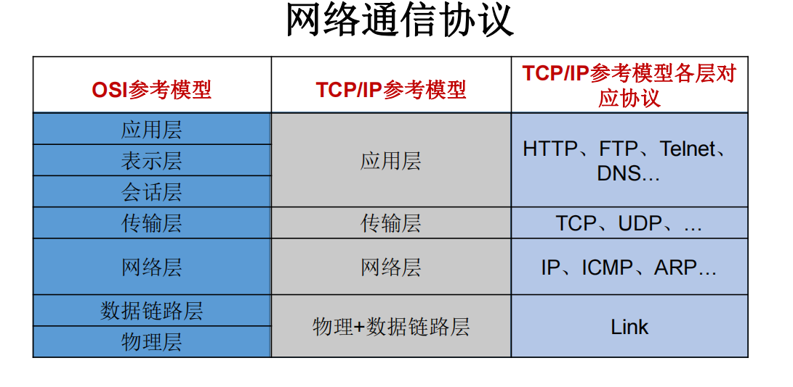
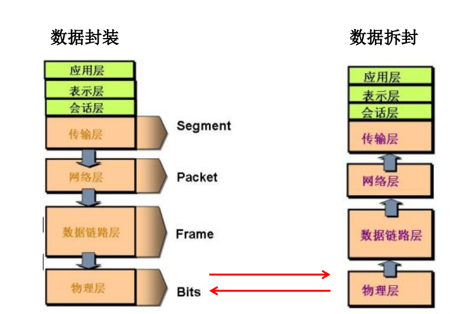
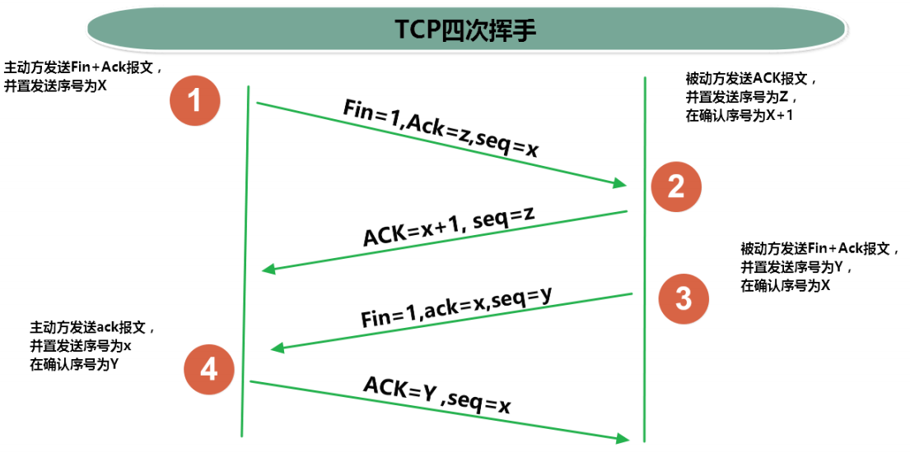
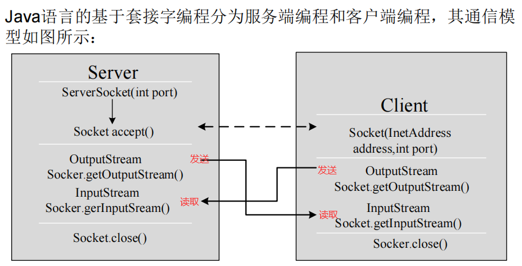

# 13.Java网络编程基础
[[toc]]
## 网络通信要素概述

:::tip 如何实现网络中的主机互相通信
1. 通信双方地址  
　<font color='red'><strong>▶ IP</strong></font>  
　<font color='red'><strong>▶ 端口号</strong></font>  
2. 一定的规则（即：网络通信协议。有两套参考模型）  
　<font color='red'><strong>▶ OSI参考模型：模型过于理想化，未能在因特网上进行广泛推广</strong></font>  
　<font color='red'><strong>▶ TCP/IP参考模型(或TCP/IP协议)：事实上的国际标准。</strong></font>  
:::
<a data-fancybox title="IO" href="../image/qicengxieyi.jpg"></a>

<a data-fancybox title="IO" href="../image/tongxunxieyi.png"></a>

-----------------------

<a data-fancybox title="IO" href="../image/tongxunxieyi2.png"></a>

:::warning InetAdress类 
**InetAddress类没有提供公共的构造器，而是提供了如下几个静态方法来获取**
1. InetAddress实例  
    <font color='red'><strong>▷ public static InetAddress getLocalHost() </strong></font>     
    <font color='red'><strong>▷ public static InetAddress getByName(String host)  </strong></font>   
2. InetAddress提供了如下几个常用的方法  
    <font color='red'><strong>▷public String getHostAddress()：返回 IP 地址字符串（以文本表现形式)  </strong></font>  
    <font color='red'><strong>▷ public String getHostName()：获取此 IP 地址的主机名  </strong></font>  
    <font color='red'><strong>▷ public boolean isReachable(int timeout)：测试是否可以达到该地址  </strong></font>  
:::

:::tip TCP/IP协议簇
1. 传输层协议中有两个非常重要的协议：
    <font color='red'><strong>▷ 传输控制协议TCP(Transmission Control Protocol)</strong></font>  
    <font color='red'><strong>▷ 用户数据报协议UDP(User Datagram Protocol)。</strong></font>   
2. TCP/IP 以其两个主要协议：传输控制协议(TCP)和网络互联协议(IP)而得名，实际上是一组协议，包括多个具有不同功能且互为关联的协议。
3. IP(Internet Protocol)协议是网络层的主要协议，支持网间互连的数据通信。
4. TCP/IP协议模型从更实用的角度出发，形成了高效的四层体系结构，即**物理链路层、IP层、传输层和应用层**。
:::

:::tip TCP 和 UDP
1. TCP协议：  
    <font color='red'><strong>▷ 使用TCP协议前，须先建立TCP连接，形成传输数据通道</strong></font>  
    <font color='red'><strong>▷ 传输前，采用“三次握手”方式，点对点通信，是可靠的</strong></font>  
    <font color='red'><strong>▷ TCP协议进行通信的两个应用进程：客户端、服务端。</strong></font>  
    <font color='red'><strong>▷ 在连接中可进行大数据量的传输</strong></font>  
    <font color='red'><strong>▷ 传输完毕，需释放已建立的连接，效率低</strong></font>  
2. UDP协议：  
    <font color='red'><strong>▷ 将数据、源、目的封装成数据包，不需要建立连接</strong></font>  
    <font color='red'><strong>▷ 每个数据报的大小限制在64K内  发送不管对方是否准备好，接收方收到也不确认，故是不可靠的</strong></font>   
    <font color='red'><strong>▷ 可以广播发送</strong></font>  
    <font color='red'><strong>▷ 发送数据结束时无需释放资源，开销小，速度快</strong></font>  
:::

:::tip 三次握手
<a data-fancybox title="IO" href="../image/sanciwoshou.png"></a>
:::
-----------------------------------
:::tip 四次挥手
<a data-fancybox title="IO" href="../image/sicihuishou.png"></a>
:::

:::warning Socket套接字
利用套接字(Socket)开发网络应用程序早已被广泛的采用，以至于成为事实上的标准。 
1. 网络上具有**唯一标识的IP地址和端口号组合**在一起才能构成**唯一能识别的标识符套接字**。 
2. 通信的两端都要有Socket，是两台机器间通信的端点。 
3. 网络通信其实就是Socket间的通信。
4. Socket允许程序把网络连接当成一个流，数据在两个Socket间通过IO传输。
5. 一般主动发起通信的应用程序属客户端，等待通信请求的为服务端。

6. Socket分类：    
    <font color='red'><strong>▷ 流套接字（stream socket）：使用TCP提供可依赖的字节流服务</strong></font>  
    <font color='red'><strong>▷ 数据报套接字（datagram socket）：使用UDP提供“尽力而为”的数据报服务</strong></font>
:::


:::tip <font color='red'>Socket类</font>
1. Socket类的常用构造器：   
    <font color='blue'><strong>▷  public Socket(InetAddress address,int port)</strong></font> 创建一个流套接字并将其连接到指定 IP 地址的指定端口号。   
    <font color='blue'><strong>▷  public Socket(String host,int port)</strong></font> 创建一个流套接字并将其连接到指定主机上的指定端口号。   
2.  Socket类的常用方法：  
    <font color='blue'><strong>▷  public InputStream getInputStream()</strong></font> 返回此套接字的输入流。可以用于接收网络消息  
    <font color='blue'><strong>▷  public OutputStream getOutputStream()</strong></font> 返回此套接字的输出流。可以用于发送网络消息  
    <font color='blue'><strong>▷  public InetAddress getInetAddress()</strong></font> 此套接字连接到的远程 IP 地址；如果套接字是未连接的，则返回 null。   
    <font color='blue'><strong>▷  public InetAddress getLocalAddress()</strong></font> 获取套接字绑定的本地地址。 即本端的IP地址  
    <font color='blue'><strong>▷  public int getPort()</strong></font> 此套接字连接到的远程端口号；如果尚未连接套接字，则返回 0。   
    <font color='blue'><strong>▷  public int getLocalPort()</strong></font> 返回此套接字绑定到的本地端口。 如果尚未绑定套接字，则返回 -1。即本端的端口号。   
    <font color='blue'><strong>▷  public void close()</strong></font> 关闭此套接字。套接字被关闭后，便不可在以后的网络连接中使用（即无法重新连接或重新绑定）。需要创建新的套接字对象。 关闭此套接字也将会关闭该套接字的 InputStream 和OutputStream。</strong></font>   
    <font color='blue'><strong>▷  public void shutdownInput()</strong></font> 如果在套接字上调用 shutdownInput() 后从套接字输入流读取内容，则流将返回 EOF（文件结束符）。 即不能在从此套接字的输入流中接收任何数据。 </strong></font>  
    <font color='blue'><strong>▷  public void shutdownOutput()</strong></font> 禁用此套接字的输出流。对于 TCP 套接字，任何以前写入的数据都将被发送，并且后跟 TCP 的正常连接终止序列。 如果在套接字上调用 shutdownOutput() 后写入套接字输出流，则该流将抛出 IOException。 即不能通过此套接字的输出流发送任何数据。  
::: 
## TCP网络编程

:::tip 基于Socket的TCP编程
<a data-fancybox title="IO" href="../image/socket.png"></a>
:::

:::tip  客户端Socket的工作过程包含以下四个基本的步骤：
1. 创建 Socket：根据指定服务端的 IP 地址或端口号构造 Socket 类对象。若服务器端响应，则建立客户端到服务器的通信线路。若连接失败，会出现异常。  
2. 打开连接到 Socket 的输入/出流： 使用 getInputStream()方法获得输入流，使用getOutputStream()方法获得输出流，进行数据传输  
3. 按照一定的协议对 Socket 进行读/写操作：通过输入流读取服务器放入线路的信息（但不能读取自己放入线路的信息），通过输出流将信息写入线程。  
4. 关闭 Socket：断开客户端到服务器的连接，释放线路  
:::
```java
public class SocketClient {
    public static void main(String[] args) {
//        Scanner scanner=new Scanner(System.in);
//        String msg=scanner.nextLine();
                String msg="scanner.nextLine()";

        StringBuilder sb=new StringBuilder();
        Socket socket =null;
        BufferedReader bufferedReader =null;
        OutputStream outputStream=null;
        try {
            socket=new Socket("127.0.0.1", 9999);
            outputStream=socket.getOutputStream();
            outputStream.write(msg.getBytes());
            //刷新缓冲
            outputStream.flush();
            //只关闭输出流而不关闭连接
            socket.shutdownOutput();

            bufferedReader = new BufferedReader(new InputStreamReader(socket.getInputStream()));
            while(true){
                String str=bufferedReader.readLine();
                if(str==null){
                    break;
                }else{
                    sb.append(str);
                }
            }
            System.out.println(sb.toString());
        } catch (IOException e) {
            e.printStackTrace();
        } finally {
            try {
                socket.close();
            } catch (IOException e) {
                e.printStackTrace();
            }
            try {
                bufferedReader.close();
            } catch (IOException e) {
                e.printStackTrace();
            }
            try {
                outputStream.close();
            } catch (IOException e) {
                e.printStackTrace();
            }

        }
    }
}
```

:::tip  服务器程序的工作过程包含以下四个基本的步骤：
1. 调用 ServerSocket(int port) ：创建一个服务器端套接字，并绑定到指定端口上。用于监听客户端的请求。  
2. 调用 accept()：监听连接请求，如果客户端请求连接，则接受连接，返回通信套接字对象。   
3. 调用 该Socket类对象的 getOutputStream() 和 getInputStream ()：获取输出流和输入流，开始网络数据的发送和接收。  
4. 关闭ServerSocket和Socket对象：客户端访问结束，关闭通信套接字。   
:::

```java
public class SocketServer {
    public static void main(String[] args) {
        ServerSocket socket =null;
        StringBuilder sb=new StringBuilder();
        BufferedReader bufferedReader =null;
        try {
            socket = new ServerSocket(9999);
            Socket  sk=socket.accept();
            bufferedReader=new BufferedReader(new InputStreamReader(sk.getInputStream()));
            while(true){
                String str=bufferedReader.readLine();
                if(str==null){
                    break;
                }else{
                    sb.append(str);
                }
            }
            System.out.println(sb.toString());
            sk.getOutputStream().write("服务器收到消息了".getBytes());
            sk.getOutputStream().flush();//清空缓冲区数据
        } catch (IOException e) {
            e.printStackTrace();
        }finally {
            if(bufferedReader!=null){
                try {
                    bufferedReader.close();
                } catch (IOException e) {
                    e.printStackTrace();
                }
            }
            try {
                socket.close();
            } catch (IOException e) {
                e.printStackTrace();
            }
        }
    }
}
```


```java
public class TCPTest2 {

    /*
    这里涉及到的异常，应该使用try-catch-finally处理
     */
    @Test
    public void client() throws IOException {
        //1.
        Socket socket = new Socket(InetAddress.getByName("127.0.0.1"),9090);
        //2.
        OutputStream os = socket.getOutputStream();
        //3.
        FileInputStream fis = new FileInputStream(new File("beauty.jpg"));
        //4.
        byte[] buffer = new byte[1024];
        int len;
        while((len = fis.read(buffer)) != -1){
            os.write(buffer,0,len);
        }
        //5.
        fis.close();
        os.close();
        socket.close();
    }

    /*
    这里涉及到的异常，应该使用try-catch-finally处理
     */
    @Test
    public void server() throws IOException {
        //1.
        ServerSocket ss = new ServerSocket(9090);
        //2.
        Socket socket = ss.accept();
        //3.
        InputStream is = socket.getInputStream();
        //4.
        FileOutputStream fos = new FileOutputStream(new File("beauty1.jpg"));
        //5.
        byte[] buffer = new byte[1024];
        int len;
        while((len = is.read(buffer)) != -1){
            fos.write(buffer,0,len);
        }
        //6.
        fos.close();
        is.close();
        socket.close();
        ss.close();

    }
}

```
## UDP网络编程(了解)

:::tip UDP网络通信
类 **DatagramSocket** 和 **DatagramPacket** 实现了基于 UDP 协议网络程序。  
1. UDP数据报通过数据报套接字 DatagramSocket 发送和接收，<font color='blue'><strong>系统不保证UDP数据报一定能够安全送到目的地，也不能确定什么时候可以抵达。</strong></font>  
2. DatagramPacket 对象封装了UDP数据报，在数据报中包含了发送端的IP地址和端口号以及接收端的IP地址和端口号。
3. UDP协议中每个数据报都给出了完整的地址信息，因此无须建立发送方和接收方的连接。如同发快递包裹一样
:::

:::warning <font color='red'>DatagramSocket 类的常用方法</font> 
1. <font color='blue'><strong>public DatagramSocket(int port)</strong></font>创建数据报套接字并将其绑定到本地主机上的指定端口。套接字将被绑定到通配符地址，IP 地址由内核来选择。 
2. <font color='blue'><strong>public DatagramSocket(int port,InetAddress laddr)</strong></font>创建数据报套接字，将其绑定到指定的本地地址。本地端口必须在 0 到 65535 之间（包括两者）。如果 IP 地址为 0.0.0.0，套接字将被绑定到通配符地址，IP 地址由内核选择。 
3. <font color='blue'><strong>public void close()</strong></font>关闭此数据报套接字。 
4. <font color='blue'><strong>public void send(DatagramPacket p)</strong></font>从此套接字发送数据报包。DatagramPacket 包含的信息指示：将要发送的数据、其长度、远程主机的 IP 地址和远程主机的端口号。 
5. <font color='blue'><strong>public void receive(DatagramPacket p)</strong></font>从此套接字接收数据报包。当此方法返回时，DatagramPacket的缓冲区填充了接收的数据。数据报包也包含发送方的 IP 地址和发送方机器上的端口号。 此方法在接收到数据报前一直阻塞。数据报包对象的 length 字段包含所接收信息的长度。如果信息比包的长度长，该信息将被截短。 
6. <font color='blue'><strong>public InetAddress getLocalAddress()</strong></font>获取套接字绑定的本地地址。 
7. <font color='blue'><strong>public int getLocalPort()</strong></font>返回此套接字绑定的本地主机上的端口号。 
8. <font color='blue'><strong>public InetAddress getInetAddress()</strong></font>返回此套接字连接的地址。如果套接字未连接，则返回 null。 
9. <font color='blue'><strong>public int getPort()</strong></font>返回此套接字的端口。如果套接字未连接，则返回 -1。
:::

:::warning  <font color='red'>DatagramPacket类的常用方法</font> 
1. <font color='blue'><strong>public DatagramPacket(byte[] buf,int length)</strong></font>构造 DatagramPacket，用来接收长度为 length 的数据包。 length 参数必须小于等于 buf.length。 
2. <font color='blue'><strong>public DatagramPacket(byte[] buf,int length,InetAddress address,int port)</strong></font>构造数据报包，用来将长度为 length 的包发送到指定主机上的指定端口号。length参数必须小于等于 buf.length。 
3. <font color='blue'><strong>public InetAddress getAddress()</strong></font>返回某台机器的 IP 地址，此数据报将要发往该机器或者是从该机器接收到的。 
4. <font color='blue'><strong>public int getPort()</strong></font>返回某台远程主机的端口号，此数据报将要发往该主机或者是从该主机接收到的。 
5. <font color='blue'><strong>public byte[] getData()</strong></font>返回数据缓冲区。接收到的或将要发送的数据从缓冲区中的偏移量 offset 处开始，持续 length 长度。 
6. <font color='blue'><strong>public int getLength()</strong></font>返回将要发送或接收到的数据的长度。
:::


:::tip UDP编程流 程
1. DatagramSocket与DatagramPacket
2. 建立发送端，接收端
3. 建立数据包
4. 调用Socket的发送、接收方法
5. 关闭Socket  

※发送端与接收端是两个独立的运行程序
:::


```java
public class UDPTest {

    //发送端
    @Test
    public void sender() throws IOException {

        DatagramSocket socket = new DatagramSocket();


        String str = "我是UDP方式发送的导弹";
        byte[] data = str.getBytes();
        InetAddress inet = InetAddress.getLocalHost();
        DatagramPacket packet = new DatagramPacket(data,0,data.length,inet,9090);

        socket.send(packet);

        socket.close();

    }
    //接收端
    @Test
    public void receiver() throws IOException {

        DatagramSocket socket = new DatagramSocket(9090);

        byte[] buffer = new byte[100];
        DatagramPacket packet = new DatagramPacket(buffer,0,buffer.length);

        socket.receive(packet);

        System.out.println(new String(packet.getData(),0,packet.getLength()));

        socket.close();
    }
}
```

## URL编程
:::tip URL类
1. URL(Uniform Resource Locator)：统一资源定位符，它表示 Internet 上某一资源的地址。 
2. 它是一种具体的URI，即URL可以用来标识一个资源，而且还指明了如何locate这个资源。
3. 通过 URL 我们可以访问 Internet 上的各种网络资源，比如最常见的<font color='red'><strong> www，ftp</strong></font>  站点。浏览器通过解析给定的 URL 可以在网络上查找相应的文件或其他资源。
4. URL的基本结构由5部分组成： <font color='red'><strong><传输协议>://<主机名>:<端口号>/<文件名>#片段名?参数列表 </strong></font> 
　例如:   
　http://192.168.1.100:8080/helloworld/index.jsp#a?username=shkstart&password=123  
　▷ #片段名：即锚点，例如看小说，直接定位到章节  
　▷ 参数列表格式：参数名=参数值&参数名=参数值....  
:::

:::warning  <font color='red'><strong>URL类构造器</strong></font> 
1. 为了表示URL，java.net 中实现了类 URL。我们可以通过下面的构造器来初始化一个 URL 对象：    
    <font color='red'><strong>▷　public URL (String spec)：</strong></font> 通过一个表示URL地址的字符串可以构造一个URL对象。例如：URL url = new URL ("http://www. atguigu.com/");   
    <font color='red'><strong>▷　public URL(URL context, String spec)：</strong></font> 通过基 URL 和相对 URL 构造一个 URL 对象。例如：URL downloadUrl = new URL(url, “download.html")  
    <font color='red'><strong>▷　public URL(String protocol, String host, String file)：</strong></font>  例如：new URL("http", "www.atguigu.com", “download. html");  
    <font color='red'><strong>▷　public URL(String protocol, String host, int port, String file)：</strong></font> 例如: URL gamelan = new URL("http", "www.atguigu.com", 80, “download.html");  
2. URL类的构造器都声明抛出非运行时异常，必须要对这一异常进行处理，通常是用 try-catch 语句进行捕获。  
:::

:::tip <font color='red'>URL类常用方法</font>
1. <font color='red'><strong>public String getProtocol( )</strong></font> 获取该URL的协议名
2. <font color='red'><strong>public String getHost( )</strong></font> 获取该URL的主机名
3. <font color='red'><strong>public String getPort( )</strong></font> 获取该URL的端口号
4. <font color='red'><strong>public String getPath( )</strong></font> 获取该URL的文件路径
5. <font color='red'><strong>public String getFile( )</strong></font> 获取该URL的文件名
6. <font color='red'><strong>public String getQuery( )</strong></font> 获取该URL的查询名
:::

:::tip <font color='red'>URLConnectonn类常用方法</font>
URL的方法 openStream()：能从网络上读取数据
若希望输出数据，例如向服务器端的 CGI （公共网关接口-Common Gateway Interface-的简称，是用户浏览器和服务器端的应用程序进行连接的接口）程序发送一些数据，则必须先与URL建立连接，然后才能对其进行读写，此时需要使用URLConnection 。 
URLConnection：表示到URL所引用的远程对象的连接。当与一个URL建立连接时，首先要在一个 URL 对象上通过方法 openConnection() 生成对应的 URLConnection对象。如果连接过程失败，将产生IOException. 
URL netchinaren = new URL ("http://www.atguigu.com/index.shtml"); 
URLConnectonn u = netchinaren.openConnection( );
:::

:::tip <font color='red'>URLConnection类常用方法</font>
**通过URLConnection对象获取的输入流和输出流，即可以与现有的CGI程序进行交互。**
1. public Object getContent( ) throws IOException 
2. public int getContentLength( )
3. public String getContentType( )
4. public long getDate( )
5. public long getLastModified( )
6. public InputStream getInputStream( )throws IOException
7. public OutputSteram getOutputStream( )throws IOException
:::

:::tip URI、URL和URN的区别
1. URI，是uniform resource identifier，统一资源标识符，用来唯一的标识一个资源。  
2. URL是uniform resource locator，统一资源定位符，它是一种具体的URI，即URL可以用来标识一个资源，而且还指明了如何locate这个资源。   
3. URN，uniform resource name，统一资源命名，是通过名字来标识资源，比如mailto:java-net@java.sun.com。   

也就是说，URI是以一种抽象的，高层次概念定义统一资源标识，  
而URL和URN则是具体的资源标识的方式。URL和URN都是一种URI。   
在Java的URI中，一个URI实例可以代表绝对的，也可以是相对的，只要它符合URI的语法规则。  
而URL类则不仅符合语义，还包含了定位该资源的信息，因此它不能是相对的。  
:::

```java
public class URLTest {

    public static void main(String[] args) {

        try {

            URL url = new URL("http://localhost:8080/examples/beauty.jpg?username=Tom");

//            public String getProtocol(  )     获取该URL的协议名
            System.out.println(url.getProtocol());
//            public String getHost(  )           获取该URL的主机名
            System.out.println(url.getHost());
//            public String getPort(  )            获取该URL的端口号
            System.out.println(url.getPort());
//            public String getPath(  )           获取该URL的文件路径
            System.out.println(url.getPath());
//            public String getFile(  )             获取该URL的文件名
            System.out.println(url.getFile());
//            public String getQuery(   )        获取该URL的查询名
            System.out.println(url.getQuery());
        } catch (MalformedURLException e) {
            e.printStackTrace();
        }

    }
```