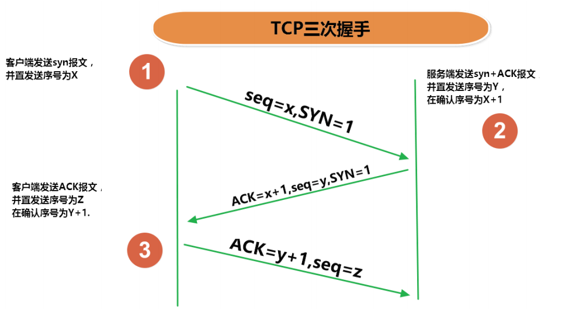

# Java网络编程基础

## 网络通信要素概述

:::tip 如何实现网络中的主机互相通信
1. 通信双方地址  
　<strong>▶ IP</strong>  
　<strong>▶ 端口号</strong>  
2. 一定的规则（即：网络通信协议。有两套参考模型）  
　<strong>▶ OSI参考模型：模型过于理想化，未能在因特网上进行广泛推广</strong>  
　<strong>▶ TCP/IP参考模型(或TCP/IP协议)：事实上的国际标准。</strong>  
:::

-----------------------

:::warning InetAdress类 
**InetAddress类没有提供公共的构造器，而是提供了如下几个静态方法来获取**
1. InetAddress实例  
    <strong>▷ public static InetAddress getLocalHost() </strong>     
    <strong>▷ public static InetAddress getByName(String host)  </strong>   
2. InetAddress提供了如下几个常用的方法  
    <strong>▷public String getHostAddress()：返回 IP 地址字符串（以文本表现形式)  </strong>  
    <strong>▷ public String getHostName()：获取此 IP 地址的主机名  </strong>  
    <strong>▷ public boolean isReachable(int timeout)：测试是否可以达到该地址  </strong>  
:::

:::tip TCP/IP协议簇
1. 传输层协议中有两个非常重要的协议：
    <strong>▷ 传输控制协议TCP(Transmission Control Protocol)</strong>  
    <strong>▷ 用户数据报协议UDP(User Datagram Protocol)。</strong>   
2. TCP/IP 以其两个主要协议：传输控制协议(TCP)和网络互联协议(IP)而得名，实际上是一组协议，包括多个具有不同功能且互为关联的协议。
3. IP(Internet Protocol)协议是网络层的主要协议，支持网间互连的数据通信。
4. TCP/IP协议模型从更实用的角度出发，形成了高效的四层体系结构，即**物理链路层、IP层、传输层和应用层**。
:::

:::tip TCP 和 UDP
1. TCP协议：  
    <strong>▷ 使用TCP协议前，须先建立TCP连接，形成传输数据通道</strong>  
    <strong>▷ 传输前，采用“三次握手”方式，点对点通信，是可靠的</strong>  
    <strong>▷ TCP协议进行通信的两个应用进程：客户端、服务端。</strong>  
    <strong>▷ 在连接中可进行大数据量的传输</strong>  
    <strong>▷ 传输完毕，需释放已建立的连接，效率低</strong>  
2. UDP协议：  
    <strong>▷ 将数据、源、目的封装成数据包，不需要建立连接</strong>  
    <strong>▷ 每个数据报的大小限制在64K内  发送不管对方是否准备好，接收方收到也不确认，故是不可靠的</strong>   
    <strong>▷ 可以广播发送</strong>  
    <strong>▷ 发送数据结束时无需释放资源，开销小，速度快</strong>  
:::

:::tip 三次握手

:::
-----------------------------------
:::tip 四次挥手

:::

:::warning Socket套接字
利用套接字(Socket)开发网络应用程序早已被广泛的采用，以至于成为事实上的标准。 
1. 网络上具有**唯一标识的IP地址和端口号组合**在一起才能构成**唯一能识别的标识符套接字**。 
2. 通信的两端都要有Socket，是两台机器间通信的端点。 
3. 网络通信其实就是Socket间的通信。
4. Socket允许程序把网络连接当成一个流，数据在两个Socket间通过IO传输。
5. 一般主动发起通信的应用程序属客户端，等待通信请求的为服务端。

6. Socket分类：    
    <strong>▷ 流套接字（stream socket）：使用TCP提供可依赖的字节流服务</strong>  
    <strong>▷ 数据报套接字（datagram socket）：使用UDP提供“尽力而为”的数据报服务</strong>
:::

:::tip Socket类
1. Socket类的常用构造器：   
    <strong>▷  public Socket(InetAddress address,int port)</strong> 创建一个流套接字并将其连接到指定 IP 地址的指定端口号。   
    <strong>▷  public Socket(String host,int port)</strong> 创建一个流套接字并将其连接到指定主机上的指定端口号。   
2.  Socket类的常用方法：  
    <strong>▷  public InputStream getInputStream()</strong> 返回此套接字的输入流。可以用于接收网络消息  
    <strong>▷  public OutputStream getOutputStream()</strong> 返回此套接字的输出流。可以用于发送网络消息  
    <strong>▷  public InetAddress getInetAddress()</strong> 此套接字连接到的远程 IP 地址；如果套接字是未连接的，则返回 null。   
    <strong>▷  public InetAddress getLocalAddress()</strong> 获取套接字绑定的本地地址。 即本端的IP地址  
    <strong>▷  public int getPort()</strong> 此套接字连接到的远程端口号；如果尚未连接套接字，则返回 0。   
    <strong>▷  public int getLocalPort()</strong> 返回此套接字绑定到的本地端口。 如果尚未绑定套接字，则返回 -1。即本端的端口号。   
    <strong>▷  public void close()</strong> 关闭此套接字。套接字被关闭后，便不可在以后的网络连接中使用（即无法重新连接或重新绑定）。需要创建新的套接字对象。 关闭此套接字也将会关闭该套接字的 InputStream 和OutputStream。</strong>   
    <strong>▷  public void shutdownInput()</strong> 如果在套接字上调用 shutdownInput() 后从套接字输入流读取内容，则流将返回 EOF（文件结束符）。 即不能在从此套接字的输入流中接收任何数据。 </strong>  
    <strong>▷  public void shutdownOutput()</strong> 禁用此套接字的输出流。对于 TCP 套接字，任何以前写入的数据都将被发送，并且后跟 TCP 的正常连接终止序列。 如果在套接字上调用 shutdownOutput() 后写入套接字输出流，则该流将抛出 IOException。 即不能通过此套接字的输出流发送任何数据。  
::: 
## TCP网络编程

:::tip 基于Socket的TCP编程

:::

:::tip  客户端Socket的工作过程包含以下四个基本的步骤：
1. 创建 Socket：根据指定服务端的 IP 地址或端口号构造 Socket 类对象。若服务器端响应，则建立客户端到服务器的通信线路。若连接失败，会出现异常。  
2. 打开连接到 Socket 的输入/出流： 使用 getInputStream()方法获得输入流，使用getOutputStream()方法获得输出流，进行数据传输  
3. 按照一定的协议对 Socket 进行读/写操作：通过输入流读取服务器放入线路的信息（但不能读取自己放入线路的信息），通过输出流将信息写入线程。  
4. 关闭 Socket：断开客户端到服务器的连接，释放线路  
:::

:::tip  服务器程序的工作过程包含以下四个基本的步骤：
1. 调用 ServerSocket(int port) ：创建一个服务器端套接字，并绑定到指定端口上。用于监听客户端的请求。  
2. 调用 accept()：监听连接请求，如果客户端请求连接，则接受连接，返回通信套接字对象。   
3. 调用 该Socket类对象的 getOutputStream() 和 getInputStream ()：获取输出流和输入流，开始网络数据的发送和接收。  
4. 关闭ServerSocket和Socket对象：客户端访问结束，关闭通信套接字。   
:::
## UDP网络编程(了解)

## URL编程