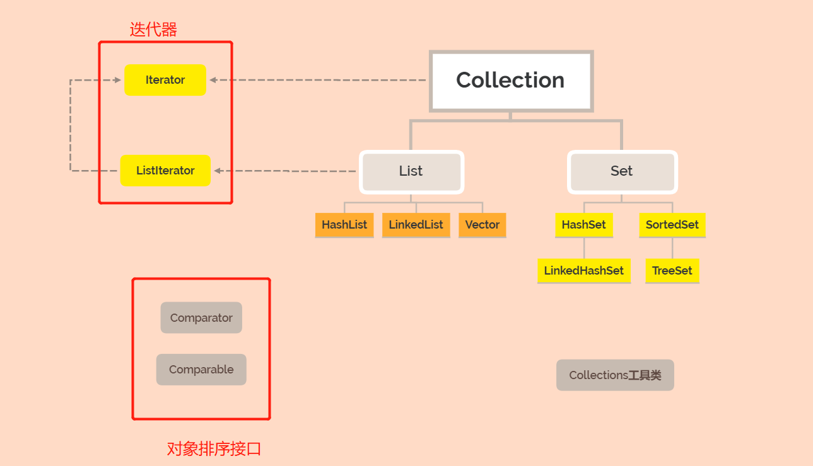
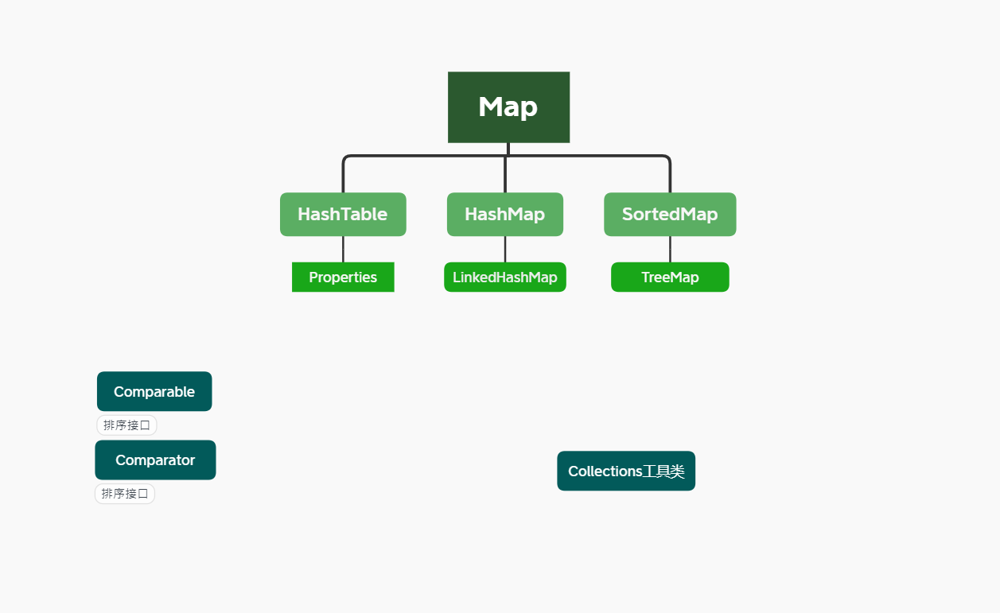
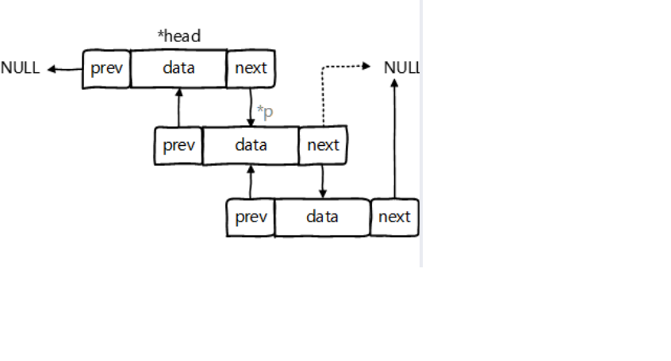
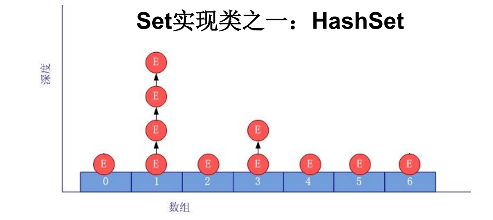
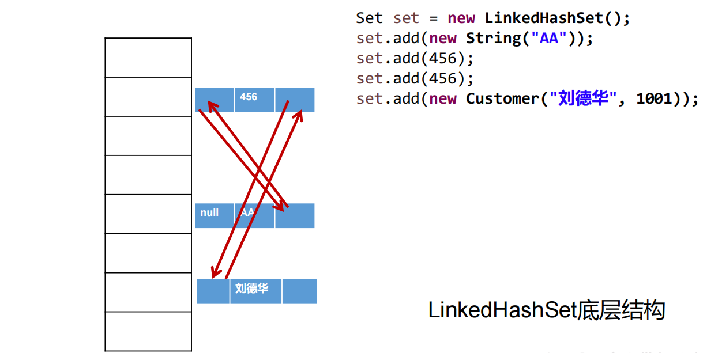
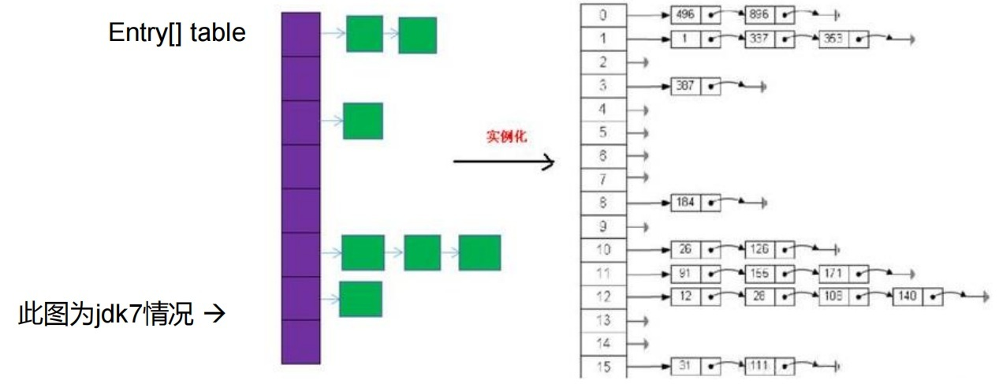
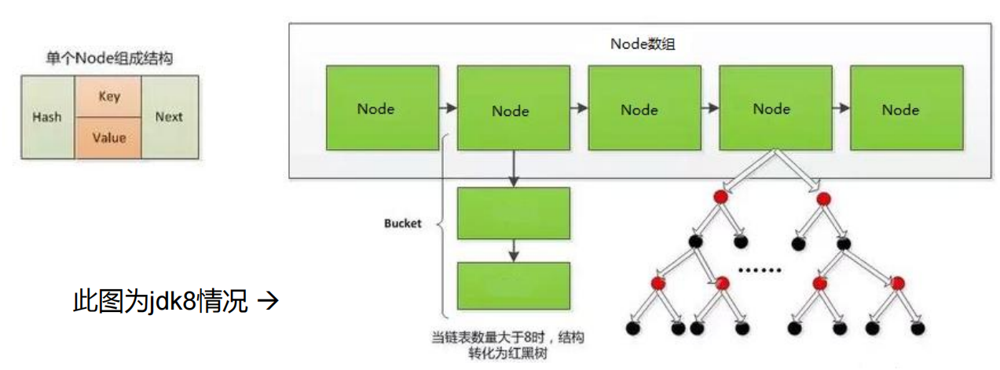

# 9.集合

:::tip 数组在内存存储方面的特点：
1. 数组初始化以后，长度就确定了。 
2. 数组声明的类型，就决定了进行元素初始化时的类型 
:::

:::warning 数组在存储数据方面的弊端： 
1. 数组初始化以后，长度就不可变了，不便于扩展  
2. 数组中提供的属性和方法少，不便于进行添加、删除、插入等操作，且效率不高。同时无法直接获取存储元素的个数  
3. 数组存储的数据是有序的、可以重复的。---->存储数据的特点单一  
:::

## 9.1 Java集合框架概述

<strong>Java 集合可分为 Collection 和 Map 两种体系</strong>  
※ <font color='red'><strong>Collection接口</strong></font>：单列数据，定义了存取一组对象的方法的集合  
　√ <font color='red'><strong>List</strong></font>：元素有序. 可重复的集合  
　√ <font color='red'><strong>Set</strong></font>：元素无序. 不可重复的集合  
※ <font color='red'><strong> Map接口</strong></font>：双列数据，保存具有映射关系“key-value对”的集合  

### Collection继承树



### Map继承树


## 9.2 Collection接口方法

**Collection 接口**  
● Collection 接口是 List. Set 和 Queue 接口的父接口，该接口里定义的方法既可用于操作 Set 集合，也可用于操作 List 和 Queue 集合。   
● JDK不提供此接口的任何直接实现，而是提供更具体的子接口(如：Set和List)实现。   
● 在 Java5 之前，Java 集合会丢失容器中所有对象的数据类型，把所有对象都当成 Object 类型处理；从 JDK 5.0 增加了泛型以后，Java 集合可以记住容器中对象的数据类型。  

1. 添加  
<font color='red'>▷  add(Object obj)</font>  
<font color='red'>▷  addAll(Collection coll)</font>    
2. 获取有效元素的个数  
<font color='red'>▷  int size()</font>   
3. 清空集合  
<font color='red'>▷  void clear()</font>   
4. 是否是空集合   
<font color='red'>▷  boolean isEmpty()</font>   
5. 是否包含某个元素  
<font color='red'>▷  boolean contains(Object obj)</font> ：是通过元素的equals方法来判断是否是同一个对象  
<font color='red'>▷  boolean containsAll(Collection c)</font> ：也是调用元素的equals方法来比较的。拿两个集合的元素挨个比较。   
6. 删除  
<font color='red'>▷  boolean remove(Object obj)</font>  ：通过元素的equals方法判断是否是要删除的那个元素。只会删除找到的第一个元素  
<font color='red'>▷  boolean removeAll(Collection coll)</font> ：取当前集合的差集  
7. 取两个集合的交集   
<font color='red'>▷  boolean retainAll(Collection c)</font> ：把交集的结果存在当前集合中，不影响c  
8. 集合是否相等  
<font color='red'>▷  boolean equals(Object obj)</font>   
9. 转成对象数组  
<font color='red'>▷  Object[] toArray()</font>   
10. 获取集合对象的哈希值  
<font color='red'>▷  hashCode()</font>   
11. 遍历  
<font color='red'>▷  iterator()</font> ：返回迭代器对象，用于集合遍历  

```java
public class CollectionTest {
    public static void main(String[] args) {
        Collection<String> list=new ArrayList<>();
        list.add("000");
        list.add("111");
        list.add("222");
        list.add("333");
        list.add("444");
        list.add("555");
        list.add("666");
        list.add("777");
        list.add("888");
        list.add("999");
        Iterator iterator=list.iterator();
        while(iterator.hasNext()){
            System.out.println("value:"+iterator.next());
        }
        System.out.println("---------------------------");
        list.remove("444");
        list.remove(3);
        Iterator iterator2=list.iterator();
        while(iterator2.hasNext()){
            System.out.println(iterator2.next());
        }
        System.out.println("--------------");
//        System.out.println(list.get(0));
//        System.out.println(list.size());
//        System.out.println(list.indexOf("222"));
        System.out.println(list.isEmpty());
        for(String str:list){
            System.out.println("value:"+str);
        }

    }
}
```

## 9.3 Iterator迭代器接口

:::tip
1. Iterator对象称为迭代器(设计模式的一种)，主要用于遍历 Collection 集合中的元素。
2. GOF给迭代器模式的定义为：<font color='red'>提供一种方法访问一个容器(container)对象中各个元素，而又不需暴露该对象的内部细节。<strong>迭代器模式，就是为容器而生</strong></font>。类似于“公交车上的售票员”、“火车上的乘务员”、“空姐”。 
3. Collection接口继承了java.lang.Iterable接口，该接口有一个iterator()方法，那么所有实现了Collection接口的集合类都有一个iterator()方法，用以返回一个实现了Iterator接口的对象。 
4. <font color='blue'>Iterator 仅用于遍历集合</font>，Iterator本身并不提供承装对象的能力。如果需要创建Iterator对象，则必须有一个被迭代的集合。
5. <font color='red'>集合对象每次调用iterator()方法都得到一个全新的迭代器对象，默认游标都在集合的第一个元素之前</font>。
:::

:::tip 注意：
1. 在调用it.next()方法之前必须要调用it.hasNext()进行检测。<strong>若不调用，且下一条记录无效，直接调用it.next()会抛出NoSuchElementException异常</strong>。
2. Iterator可以删除集合的元素，但是是遍历过程中通过迭代器对象的remove方法，不是集合对象的remove方法。 
3. 如果还未调用next()或在上一次调用 next 方法之后已经调用了 remove 方法，<strong>再调用remove都会报IllegalStateException</strong>。
:::

### List接口概述
1. 鉴于Java中数组用来存储数据的局限性，我们通常使用List替代数组
2. <font color='red'>List集合类中元素有序、且可重复</font>，集合中的每个元素都有其对应的顺序索引。
3. List容器中的元素都对应一个整数型的序号记载其在容器中的位置，可以根据序号存取容器中的元素。
4. JDK API中List接口的实现类常用的有：ArrayList、LinkedList和Vector。

## 9.4 Collection子接口一：List

:::tip List的方法
1. <font color='red'>void add(int index, Object ele)</font>:在index位置插入ele元素
2. <font color='red'>boolean addAll(int index, Collection eles)</font>:从index位置开始将eles中的所有元素添加进来
3. <font color='red'>Object get(int index)</font>:获取指定index位置的元素
4. <font color='red'>int indexOf(Object obj)</font>:返回obj在集合中首次出现的位置
5. <font color='red'>int lastIndexOf(Object obj)</font>:返回obj在当前集合中末次出现的位置
6. <font color='red'>Object remove(int index)</font>:移除指定index位置的元素，并返回此元素
7. <font color='red'>Object set(int index, Object ele)</font>:设置指定index位置的元素为ele
8. <font color='red'>List subList(int fromIndex, int toIndex)</font>:返回从fromIndex到toIndex位置的子集合
:::

### List实现类之一：ArrayList
1. ArrayList 是 List 接口的典型实现类、主要实现类
2. 本质上，ArrayList是对象引用的一个”变长”数组
3. ArrayList的JDK1.8之前与之后的实现区别？  
　<font color='red'>JDK1.7：ArrayList像饿汉式</font>，直接创建一个初始容量为10的数组  
　<font color='red'>JDK1.8：ArrayList像懒汉式</font>，一开始创建一个长度为0的数组，当添加第一个元素时再创建一个始容量为10的数组  
4. Arrays.asList(…) 方法返回的 List 集合，既不是 ArrayList 实例，也不是Vector 实例。 Arrays.asList(…) 返回值是一个固定长度的 List 集合

```java
public class ArrayListTest {
    public static void main(String[] args) {
        List<Integer> list = new ArrayList();
        list.add(1);
        list.add(2);
        list.add(3);
        list.add(4);
        updateList(list);
        System.out.println(list);
        System.out.println("----------------");
        list.set(1,5);
        System.out.println(list);
        System.out.println(list.get(0));
        System.out.println(list.size());
        System.out.println(list.indexOf("222"));
        //内部还是用的迭代器
        for(Integer i:list){
            System.out.println(i);
        }
    }
    private static void updateList(List list) {
        list.remove(2);//按下标remove 所以3被移除
    }
}
```


### List实现类之二：LinkedList
<font color='red'><strong> 对于频繁的插入或删除元素的操作，建议使用LinkedList类，效率较高</strong></font>  

<strong>新增方法：</strong>  
1. <font color='red'><strong>void addFirst(Object obj)</strong></font>   
2. <font color='red'><strong>void addLast(Object obj)</strong></font>   
3. <font color='red'><strong>Object getFirst()</strong></font>  
4. <font color='red'><strong>Object getLast()</strong></font>  
5. <font color='red'><strong>Object removeFirst()</strong></font>  
6. <font color='red'><strong>Object removeLast()</strong></font> 

```java

```

<font color='red'><strong>LinkedList：双向链表</strong></font> ，内部没有声明数组，而是定义了Node类型的first和last，用于记录首末元素。同时，定义内部类Node，作为LinkedList中保存数据的基本结构。Node除了保存数据  
还定义了两个变量：  
 ◆ prev变量记录前一个元素的位置  
 ◆ next变量记录下一个元素的位置  

```java
    private static class Node<E> {
        E item;
        Node<E> next;
        Node<E> prev;

        Node(Node<E> prev, E element, Node<E> next) {
            this.item = element;
            this.next = next;
            this.prev = prev;
        }
    }
```


---------

### List实现类之三：Vector
<strong>Vector 是一个古老的集合，JDK1.0就有了。大多数操作与ArrayList相同，<font color='blue'>区别之处在于Vector是线程安全的</font></strong>。  
<strong>在各种list中，最好把ArrayList作为缺省选择。当插入、删除频繁时，使用LinkedList；Vector总是比ArrayList慢，所以尽量避免使用。</strong>  

**新增方法：**  
<font color='blue'><strong> void addElement(Object obj) </strong></font>  
<font color='blue'><strong> void insertElementAt(Object obj,int index)</strong></font>  
<font color='blue'><strong> void setElementAt(Object obj,int index)</strong></font>  
<font color='blue'><strong> void removeElement(Object obj) </strong></font>  
<font color='blue'><strong> void removeAllElements()</strong></font>  


**面试题：**
请问ArrayList/LinkedList/Vector的异同？谈谈你的理解？ArrayList底层是什么？扩容机制？Vector和ArrayList的最大区别? 
<font color='blue'><strong>三者都实现了List，存储数据有序，可重复</strong></font>
Vector： 线程安全，执行效率慢，底层是 Object[] elementData 数组
ArrayList： 线程不安全，执行效率高，底层是 Object[] elementData 数组
LinkedList：线程不安全，执行效率高，底层双向链表

1. ArrayList和LinkedList的异同  
二者都线程不安全，相对线程安全的Vector，执行效率高。   
此外，ArrayList是实现了基于动态数组的数据结构，LinkedList基于链表的数据结构。    
对于随机访问get和set，ArrayList觉得优于LinkedList，因为LinkedList要移动指针。   
对于新增和删除操作add(特指插入)和remove，LinkedList比较占优势，因ArrayList要移动数据。   
2. ArrayList和Vector的区别  
Vector和ArrayList几乎是完全相同的,唯一的区别在于Vector是同步类(synchronized)，属于强同步类;因此开销就比ArrayList要大，访问要慢。  
正常情况下,大多数的Java程序员使用ArrayList而不是Vector,因为同步完全可以由程序员自己来控制。  
<font color='red'>Vector每次扩容请求其大小的2倍空间，而ArrayList是1.5倍。Vector还有一个子类Stack</font>。  

3. 执行结果
```java
public class ArrayListTest {
    public static void main(String[] args) {
        List<Integer> list = new ArrayList();
        list.add(1);
        list.add(2);
        list.add(3);
        list.add(4);
        updateList(list);
        System.out.println(list);
        System.out.println("----------------");
    }
    private static void updateList(List list) {
        list.remove(2);//按下标remove 所以3被移除
        list.remove(new Integer("2"));//移出value值是2这一项
    }
}
```

## 9.5 Collection子接口二：Set

**Set 接口概述** 
1. Set接口是Collection的子接口，set接口没有提供额外的方法
2. Set 集合不允许包含相同的元素，如果试把两个相同的元素加入同一个Set 集合中，则添加操作失败。  
3. Set 判断两个对象是否相同不是使用 == 运算符，而是<font color='red'>根据 equals() 方法</font>  


### Set实现类之一：HashSet
1. HashSet 是 Set 接口的典型实现，大多数时候使用 Set 集合时都使用这个实现类。
2. HashSet 按 Hash 算法来存储集合中的元素，因此具有很好的存取、查找、删除性能。 



### Set添加元素存储过程：HashSet为例　　
1. 根据要添加的元素A的HashCode()方法计算hashCode值出来  
2. 根据HashCode值，根据HashSet散列算法，找到在底层数组上存储的位置  
    　A. 判断该位置上是否已有元素，没有则A存储在该位置  
    　B. 如果有则比较HashCode，如果不相同，则存在该位置的链表上（七上八下）  
    　C. 如果HashCode也相等，则调用A.equals()方法，比较两者是否相等  
   　　　a.如果为false则存储在链表上  
   　　　b.否则视为相同的元素，不能存储  
:::tip <font color='blue'>HashSet 具有以下特点：</font>
1. 不能保证元素的排列顺序
2. HashSet 不是线程安全的
3. 集合元素可以是 null
4. HashSet 集合判断两个元素相等的标准：<font color='red'><strong>两个对象通过 hashCode() 方法比较相等，并且两个对象的 equals() 方法返回值也相等。</strong></font> 
5. <font color='red'><strong>对于存放在Set容器中的对象，对应的类一定要重写equals()和hashCode(Object obj)方法，以实现对象相等规则。即：“相等的对象必须具有相等的散列码”。</strong></font>
:::

```java
public class HashSetTest {
    public static void main(String[] args) {
        //不能保证元素的排列顺序
        HashSet hashSet=new HashSet();
        hashSet.add(456);
        //包装类，默认重写了equals和hashCode方法
        hashSet.add(new Integer("456"));
        hashSet.add(123);
        hashSet.add(123);
        //对应的类一定要重写equals()和hashCode(Objectobj)方法，以实现对象相等规则。即：“相等的对象必须具有相等的散列码”。
        hashSet.add(new User("小敏",18));
        hashSet.add(new User("小敏",18));
        System.out.println(hashSet);
    }
}
```
### Set实现类之二：LinkedHashSet
1. LinkedHashSet 是 HashSet 的子类
2. LinkedHashSet 根据元素的 hashCode 值来决定元素的存储位置，但<font color='red'>它同时使用双向链表维护元素的次序，这使得元素看起来是以插入顺序保存的</font>。
3. LinkedHashSet插入性能略低于 HashSet，但在迭代访问 Set 里的全部元素时有很好的性能(因为它记录插入的前后地址)。
4. LinkedHashSet 不允许集合元素重复。

------------



-----------------

### Set实现类之三：TreeSet
<font color='red'>TreeSet 是 SortedSet 接口的实现类，TreeSet 可以确保集合元素处于排序状态。</font>  
<font color='red'>TreeSet底层使用红黑树结构存储数据</font>  

**新增的方法如下:(了解)** 
1. Comparator comparator()
2. Object first()
3. Object last()
4. Object lower(Object e)
5. Object higher(Object e)
6. SortedSet subSet(fromElement, toElement) 
7. SortedSet headSet(toElement) 
8. SortedSet tailSet(fromElement) 

**TreeSet 两种排序方法：<font color='red'>自然排序</font>和<font color='red'>定制排序</font>。默认情况下，TreeSet 采用自然排序。**
```java
public class TreeSetTest {
    public static void main(String[] args) {
        TreeSet treeSet=new TreeSet<>();
        //如果 User没有实现Comparable接口的话； 报错javabase.list.User cannot be cast to java.lang.Comparable
        treeSet.add(new User("C",12));
        treeSet.add(new User("B",12));
        treeSet.add(new User("B",22));
        treeSet.add(new User("DD",32));
        treeSet.add(new User("DD",12));
        treeSet.add(new User("CC",12));
        System.out.println(treeSet);

    }
}
public class User implements  Comparable{
    private String name;
    private int age;

    public User() {
    }

    public User(String name, int age) {
        this.name = name;
        this.age = age;
    }

    public String getName() {
        return name;
    }

    public int getAge() {
        return age;
    }

    public void setName(String name) {
        this.name = name;
    }

    @Override
    public String toString() {
        return "User{" +
                "name='" + name + '\'' +
                ", age=" + age +
                '}';
    }

    @Override
    public boolean equals(Object o) {
        if (this == o) {
            return true;
        }
        if (o == null || getClass() != o.getClass()) {
            return false;
        }
        User user = (User) o;
        return age == user.age &&
                Objects.equals(name, user.name);
    }

    @Override
    public int hashCode() {
        return Objects.hash(name, age);
    }

    @Override
    public int compareTo(Object o) {
        if(o instanceof User){
            User user=(User) o;
            int compare= this.name.compareTo(user.name);
            if(compare==0){
                compare=Integer.compare(this.age, user.age);
            }
            return compare;
        }else{
            throw new RuntimeException ("比较类型不正确");
        }
    }
}
```


### 排 序—自然排序
**自然排序：TreeSet 会调用集合元素的 compareTo(Object obj) 方法来比较元素之间的大小关系，然后将集合元素按升序(默认情况)排列** 
如果试图把一个对象添加到 TreeSet 时，则该对象的类必须实现 Comparable 接口。
实现 Comparable 的类必须实现<font color='red'><strong> compareTo(Object obj) 方法</strong></font>，两个对象即通过compareTo(Object obj) 方法的返回值来比较大小。  Comparable 的典型实现：
BigDecimal、BigInteger 以及所有的数值型对应的包装类：按它们对应的数值大小进行比较
Character：按字符的 unicode值来进行比较
Boolean：true 对应的包装类实例大于 false 对应的包装类实例
String：按字符串中字符的 unicode 值进行比较
Date、Time：后边的时间、日期比前面的时间、日期大
向 TreeSet 中添加元素时，只有第一个元素无须比较compareTo()方法，后面添加的所有元素都会调用compareTo()方法进行比较。
因为只有相同类的两个实例才会比较大小，所以向 TreeSet 中添加的应该是同一个类的对象。
对于 TreeSet 集合而言，它判断两个对象是否相等的唯一标准是：两个对象通过 compareTo(Object obj) 方法比较返回值。
当需要把一个对象放入 TreeSet 中，重写该对象对应的 equals() 方法时，应保证该方法与 compareTo(Object obj) 方法有一致的结果：如果两个对象通过equals() 方法比较返回 true，则通过 compareTo(Object obj) 方法比较应返回 0。否则，让人难以理解。

```java
public class TreeSetTest {
    public static void main(String[] args) {
       Method2();
    }
    //自然排序
    private static void Method2() {
        TreeSet treeSet=new TreeSet<>();
        //如果 User没有实现Comparable接口的话； 报错javabase.list.User cannot be cast to java.lang.Comparable
        treeSet.add(new User("C",12));
        treeSet.add(new User("B",12));
        treeSet.add(new User("B",22));
        treeSet.add(new User("DD",32));
        treeSet.add(new User("DD",12));
        treeSet.add(new User("CC",12));
        System.out.println(treeSet);
    }
}
```
### 排 序—定制排序
1. TreeSet的自然排序要求元素所属的类实现Comparable接口，如果元素所属的类没有实现Comparable接口，或不希望按照升序(默认情况)的方式排列元素或希望按照其它属性大小进行排序，则考虑使用定制排序。定制排序，通过Comparator接口来实现。需要重写compare(T o1,T o2)方法。 
2. 利用<font color='red'><strong>int compare(T o1,T o2)方法</strong></font>，比较o1和o2的大小：如果方法返回正整数，则表示o1大于o2；如果返回0，表示相等；返回负整数，表示o1小于o2。 
3. 要实现定制排序，需要将实现Comparator接口的实例作为形参传递给TreeSet的构造器。
4. 此时，仍然只能向TreeSet中添加类型相同的对象。否则发生ClassCastException异常。
5. 使用定制排序判断两个元素相等的标准是：通过Comparator比较两个元素返回了0。

```java
public class TreeSetTest {
    public static void main(String[] args) {
        Method1();
    }
    //定制排序 按年龄从小到大排序
    private static void Method1(){
        Comparator comparator=new Comparator() {
            @Override
            public int compare(Object o1, Object o2) {
               if(o1 instanceof User && o2 instanceof User){
                    return  Integer.compare(((User) o1).getAge(),((User) o2).getAge());
               }else{
                   throw new RuntimeException ("比较类型不正确");
               }

            }
        };
        TreeSet treeSet=new TreeSet<>(comparator);
        treeSet.add(new User("C",12));
        treeSet.add(new User("B",12));
        treeSet.add(new User("B",22));
        treeSet.add(new User("DD",32));
        treeSet.add(new User("DD",12));
        treeSet.add(new User("CC",12));
        System.out.println(treeSet);
    }
}
```

### 面试题
1. 在list中去除重复数字，尽可能简单（思路将List存入HashSet（不能存重复数据）中，然后在转为List）
```java
public class ListTest {
    public static void main(String[] args) {
        List<Integer> list = new ArrayList();
        list.add(1);
        list.add(2);
        list.add(2);
        list.add(2);
        list.add(3);
        list.add(4);
        list.add(4);
        list.add(4);
        System.out.println(list);

        HashSet hashSet=new HashSet();
        hashSet.addAll(list);

        System.out.println(new ArrayList<>(hashSet));
        list.clear();
        list.addAll(hashSet);
        System.out.println(list);
    }
}
```
2. 下面这段代码输出结果，并分析(其中User类中重写了hashCode()和equal()方法)
```java
import java.util.HashSet;

public class HashSetTest01 {
    public static void main(String[] args) {
        HashSet set = new HashSet();
        User p1 = new User("AA",18);
        User p2 = new User("BB",19);
        set.add(p1);
        set.add(p2);
        p1.setName("CC");
        set.remove(p1);
        System.out.println(set); //输出结果是两个对象，原因是 p1属性质改变后，他的hashcode也改变了，这时候进行remove，他在底层数组上找到的不是真正存储p1的位置，所以p1没有被删掉
        set.add(new User("CC",18));
        System.out.println(set);//输出三个对象，第三个对象计算出来的位置，和原来的p1的位置不冲突
        set.add(new User("AA",14)); //存在p1位置的链表上
        System.out.println(set);
    }
}
```

------------------------------------


## 9.6 Map接口


### Map接口概述
1. Map与Collection并列存在。用于保存具有<font color='red'><strong>映射关系的数据:key-value</strong></font>
2. Map 中的 key 和 value 都可以是任何引用类型的数据
3. Map 中的<font color='red' size=4><strong>key 用Set来存放，不允许重复</strong></font>，即同一个 Map 对象所对应的类，须重写hashCode()和equals()方法
4. <font color='red'><strong>常用String类作为Map的“键”</strong></font>
5. key 和 value 之间存在单向一对一关系，即通过指定的 key 总能找到唯一的、确定的 value
6. Map接口的常用实现类：<font color='red'><strong>HashMap、TreeMap、LinkedHashMap和Properties</strong></font>。其中，HashMap是 Map 接口使用频率最高的实现类

### Map结构理解

1.<font color='green'><strong> Map中的key：是无序、不可重复的，使用的Set存储的所有key值</strong></font>  
2.<font color='green'><strong> Map中的value：无序的可重复的，使用的Collectiong存储所有的value</strong></font>  
　　一个键值对：key-value 构成了一个Entry对象。  
3. <font color='green'><strong>Map中的entry：无序、不可重复，使用的Set存储所有的entry</strong></font>  

----------------------------------
.png)

:::tip
|----<font color='red'><strong>Map</strong></font>:双列数据，存储key-value对的数据  ---类似于高中的函数： y = f（x）  
　　|----<font color='red'><strong>HashMap</strong></font>： Map的主要实现类：线程不安全，效率高；可以存储null的key和value  
　　　　|----<font color='red'><strong>LinkedHashMap</strong></font>： 保证在遍历map元素时，可以按照添加的顺序实现遍历。  
　　　　　原因:在原有的hashMap底层结构基础上，添加了一对指针，指向前一个和后一个元素。对于频繁遍历的操作，此类执行效率高于hashMap。  
　　|----<font color='red'><strong>TreeMap</strong></font>：  保证添加的key-value对进行排序，实现排序遍历。此时考虑key的自然排序和定制排序； <font color='red'>底层使用红黑树</font>  
　　|----<font color='red'><strong>Hashtable</strong></font>：  线程安全，效率低；不能存储null的键值对  
　　　　|----<font color='red'><strong>Properties</strong></font>： 常用于处理配置文件。key和value都是String类型 
:::

--------------------------


:::tip <font color='red' size=4><strong>Map常用方法</strong></font>
<font color='blue' size=4><strong>Map 中的 添加、删除、修改操作：</strong></font>  
　1. Object put(Object key,Object value)：将指定key-value添加到(或修改)当前map对象中  
　2. void putAll(Map m):将m中的所有key-value对存放到当前map中   
　3. Object remove(Object key)：移除指定key的key-value对，并返回value  
　4. void clear()：清空当前map中的所有数据  
<font color='blue' size=4><strong>Map 中的元素查询的操作：</strong></font>  
　1. Object get(Object key)：获取指定key对应的value  
　2. boolean containsKey(Object key)：是否包含指定的key  
　3. boolean containsValue(Object value)：是否包含指定的value  
　4. int size()：返回map中key-value对的个数  
　5. boolean isEmpty()：判断当前map是否为空  
　6. boolean equals(Object obj)：判断当前map和参数对象obj是否相等    
<font color='blue' size=4><strong>Map 中的元视图操作的方法：</strong></font>  
　1. Set keySet()：返回所有key构成的Set集合    
　2. Collection values()：返回所有value构成的Collection集合    
　3. Set entrySet()：返回所有key-value对构成的Set集合    
:::

-----------------

```java
public class MapTest {
    public static void main(String[] args) {
        HashMap map=new HashMap(16);
        HashMap map2=new HashMap(16);
        map.put(1,"xiaoming1");
        map.put(2,"xiaoming2");
        map.put(3,"xiaoming3");
        map.put(4,"xiaoming4");
        map.put(4,"xiaoming5");//key=4的位置上 value值变为xiaoming5
        map.put(5,"xiaoming6");
        map2.putAll(map);
        System.out.println(map);
        System.out.println(map.get(5));
        System.out.println(map.containsKey(2));
        System.out.println(map.containsValue("xiaoming5"));
        map.clear();
        System.out.println(map);
        System.out.println(map2);
        System.out.println(map2.size());
        map2.remove(1);
        map2.replace(2,"xiaoming2","小明2");
        map2.replace(3,"小明3");
        System.out.println(map2);
        System.out.println(map.isEmpty());
        Set keys=map2.keySet();
        Set entrys=map2.entrySet();
        Collection values=map2.values();
        System.out.println("---------------------");
        for(Object key:keys){
            System.out.println("key:"+key+"value:"+map2.get(key));
        }
        System.out.println("---------------------");
        for (Object mapping:entrys){
            Map.Entry entry = (Map.Entry) mapping;
            System.out.println("key:"+entry.getKey()+"value:"+entry.getValue());
        }
        Iterator iterator=map2.keySet().iterator();
        System.out.println("---------------------");
        while(iterator.hasNext()){
            int key=(Integer) iterator.next();
            System.out.println("key:"+key+"value:"+map2.get(key));
        }
    }
}
```
### Map实现类之一：HashMap
:::tip HashMap特性
1. HashMap是 Map 接口使用频率最高的实现类。
2. 允许使用null键和null值，与HashSet一样，不保证映射的顺序。
3. 所有的key构成的集合是<font color='red'><strong>Set:无序的、不可重复的</strong></font>。所以，key所在的类要重写：equals()和hashCode()
4. 所有的value构成的集合是<font color='red'><strong>Collection:无序的、可以重复的</strong></font>。所以，value所在的类要重写：equals()
5. 一个key-value构成一个entry
6. 所有的entry构成的集合是<font color='red'><strong>Set:无序的、不可重复的</strong></font>
7. HashMap 判断两个 key 相等的标准是：<font color='red'><strong>两个 key 通过 equals() 方法返回 true，hashCode 值也相等</strong></font>。
8. HashMap 判断两个 value相等的标准是：<font color='red'><strong>两个 value 通过 equals() 方法返回 true</strong></font>。
:::

### HashMap的存储结构
<font color='blue' size=3><strong>☆ JDK 7及以前版本：HashMap是数组+链表结构(即为链地址法)</strong></font>   
<font color='blue' size=3><strong>☆ JDK 8版本发布以后：HashMap是数组+链表+红黑树实现。</strong></font>  
<br> 

------------------------------



--------------------------------


### HashMap的底层实现原理
:::tip  HashMap源码中的重要常量
1. <font color='red'><strong>DEFAULT_INITIAL_CAPACITY</strong></font> : HashMap的默认容量，16
2. <font color='red'><strong>MAXIMUM_CAPACITY</strong></font> ： HashMap的最大支持容量，2^30
3. <font color='red'><strong>DEFAULT_LOAD_FACTOR</strong></font>：HashMap的默认加载因子
4. <font color='red'><strong>TREEIFY_THRESHOLD</strong></font>：Bucket中链表长度大于该<font color='red'><strong>默认值(8)</strong></font>，转化为红黑树
5. <font color='red'><strong>UNTREEIFY_THRESHOLD</strong></font>：Bucket中红黑树存储的Node小于该<font color='red'><strong>默认值(6)</strong></font>，转化为链表
6. <font color='red'><strong>MIN_TREEIFY_CAPACITY</strong></font>：桶中的Node被树化时最小的hash表容量<font color='red'><strong>(64)</strong></font>。（当桶中Node的数量大到需要变红黑树时，若hash表容量小于MIN_TREEIFY_CAPACITY时，此时应执行resize扩容操作这个MIN_TREEIFY_CAPACITY的值至少是TREEIFY_THRESHOLD的4倍。）

---------------------

1. <font color='red'><strong>table</strong></font>：存储元素的数组，总是2的n次幂
2. <font color='red'><strong>entrySet</strong></font>：存储具体元素的集
3. <font color='red'><strong>size</strong></font>：HashMap中存储的键值对的数量
4. <font color='red'><strong>modCount</strong></font>：HashMap扩容和结构改变的次数。
5. <font color='red'><strong>threshold</strong></font>：扩容的临界值，=容量*填充因子 (16*0.75=12)
6. <font color='red'><strong>loadFactor</strong></font>：填充因子 (0.75)
:::
```java
```
#### <font color='red' size=3>HashMap的存储结构：JDK 1.8之前</font>
::: tip JDk7.0 HashMap的底层存储过程
在实例化后，底层创建一个长度为16的一维数组Entry[]  table.
map.put(key1,value1):
首先，调用key1的hashCode()计算key1的哈希值，此哈希值经过某种算法计算以后，得到在Entry数组中的存放位置。
如果此位置上的数据为空，此时的key1-value1添加成功。  
如果此位置上的数据不为空，（意味着该位置上存在一个或多个数据（以链表形式存在）），比较key1和已经存在的一个或多个数据的哈希值：    
　如果key1的哈希值和已存在的数据的哈希值不一样，此时key1-value1添加成功。  
　如果key1的哈希值和已存在的某一个数据的哈希值相同，key1调用equals方法比较 ：   
　　如果返回值false，添加成功；  
　　如果返回值true，使用value1的值替换原来的value值  
:::
###### <font color='red'>HashMap的内部存储结构</font>
HashMap的内部存储结构其实是数组和链表的结合。当实例化一个HashMap时，
系统会创建一个长度为Capacity的Entry数组，这个长度在哈希表中被称为容量
(Capacity)，在这个数组中可以<font color='red'>存放元素的位置我们称之为“桶”(bucket)</font>，每个
bucket都有自己的索引，系统可以根据索引快速的查找bucket中的元素。 每个bucket中存储一个元素，即一个Entry对象，但每一个Entry对象可以带一个引
用变量，用于指向下一个元素，因此，在一个桶中，就有可能生成一个Entry链。
而且新添加的元素作为链表的head。 
###### <font color='red'>HashMap添加元素的过程：</font>
向HashMap中添加entry1(key，value)，需要首先计算entry1中key的哈希值(根据
key所在类的hashCode()计算得到)，此哈希值经过处理以后，得到在底层Entry[]数
组中要存储的位置i。如果位置i上没有元素，则entry1直接添加成功。如果位置i上
已经存在entry2(或还有链表存在的entry3，entry4)，则需要通过循环的方法，依次
比较entry1中key和其他的entry。如果彼此hash值不同，则直接添加成功。如果
hash值不同，继续比较二者是否equals。如果返回值为true，则使用entry1的value
去替换equals为true的entry的value。如果遍历一遍以后，发现所有的equals返回都
为false,则entry1仍可添加成功。entry1指向原有的entry元素。
##### <font color='red'>HashMap的扩容</font>
当HashMap中的元素越来越多的时候，hash冲突的几率也就越来越高，因为数组的
长度是固定的。所以为了提高查询的效率，就要对HashMap的数组进行扩容，而在
<font color='red'><strong>HashMap数组扩容之后，最消耗性能的点就出现了：原数组中的数据必须重新计算
其在新数组中的位置，并放进去，这就是resize。</strong></font>
##### <font color='red'>那么HashMap什么时候进行扩容呢？</font> 
当HashMap中的元素个数超过数组大小(数组总大小length,不是数组中个数
size)*loadFactor 时 ， 就 会 进 行 数 组 扩 容 ， loadFactor 的默认 值 (DEFAULT_LOAD_FACTOR)为0.75，这是一个折中的取值。也就是说，默认情况
下，数组大小(DEFAULT_INITIAL_CAPACITY)为16，那么当HashMap中元素个数
超过16*0.75=12（这个值就是代码中的threshold值，也叫做临界值）的时候，就把
数组的大小扩展为 2*16=32，即扩大一倍，然后重新计算每个元素在数组中的位置，
而这是一个非常消耗性能的操作，<font color='red'><strong>所以如果我们已经预知HashMap中元素的个数,那么预设元素的个数能够有效的提高HashMap的性能。</strong></font>

-----------------------------------------
------------------------------------
#### <font color='red' size=3>HashMap的存储结构：JDK 1.8</font>

::: tip JDk8.0 HashMap的底层存储
jdk8 底层的数组是：Node[] ,而非Entry[]  
new HashMap():底层没有创建一个长度为16的数组； 首次调用put()方法时，底层创建长度为16的数组  
当数组的某一个索引为止上的元素以链表实行存在的数据个数大于8 并且当前的数组长度>64时，此时此索引的位置上的所有数据改为红黑树存储（提高查询效率）
:::

##### <font color='red'>HashMap的存储结构</font>
HashMap的内部存储结构其实是数组+链表+树的结合。当实例化一个
HashMap时，会初始化initialCapacity和loadFactor，在put第一对映射关系
时，系统会创建一个长度为initialCapacity的Node数组，这个长度在哈希表
中被称为容量(Capacity)，在这个数组中可以存放元素的位置我们称之为
“桶”(bucket)，每个bucket都有自己的索引，系统可以根据索引快速的查
找bucket中的元素。 
 每个bucket中存储一个元素，即一个Node对象，但每一个Node对象可以带
一个引用变量next，用于指向下一个元素，因此，在一个桶中，就有可能
生成一个Node链。也可能是一个一个TreeNode对象，每一个TreeNode对象
可以有两个叶子结点left和right，因此，在一个桶中，就有可能生成一个
TreeNode树。而新添加的元素作为链表的last，或树的叶子结点。


##### <font color='red'>那么HashMap什么时候进行扩容和树形化呢？</font> 
当HashMap中的元素个数超过数组大小(数组总大小length,不是数组中个数
size)*loadFactor 时 ， 就会进行数组扩容 ， loadFactor 的默认 值 (DEFAULT_LOAD_FACTOR)为0.75，这是一个折中的取值。也就是说，默认
情况下，数组大小(DEFAULT_INITIAL_CAPACITY)为16，那么当HashMap中
元素个数超过16*0.75=12（这个值就是代码中的threshold值，也叫做临界值）
的时候，就把数组的大小扩展为 2*16=32，即扩大一倍，然后重新计算每个元
素在数组中的位置，而这是一个非常消耗性能的操作，所以如果我们已经预知
HashMap中元素的个数，那么预设元素的个数能够有效的提高HashMap的性能。 当HashMap中的其中一个链的对象个数如果达到了8个，此时如果capacity没有
达到64，那么HashMap会先扩容解决，如果已经达到了64，那么这个链会变成
树，结点类型由Node变成TreeNode类型。当然，如果当映射关系被移除后，
下次resize方法时判断树的结点个数低于6个，也会把树再转为链表。


###### <font color='red'>关于映射关系的key是否可以修改？</font>
answer：不要修改
映射关系存储到HashMap中会存储key的hash值，这样就不用在每次查找时重新计算
每一个Entry或Node（TreeNode）的hash值了，因此如果已经put到Map中的映射关
系，再修改key的属性，而这个属性又参与hashcode值的计算，那么会导致匹配不上。

<font color='red'><strong>总结：JDK1.8相较于之前的变化：</strong></font>
1. HashMap map = new HashMap();//默认情况下，先不创建长度为16的数组
2. 当首次调用map.put()时，再创建长度为16的数组
3. 数组为Node类型，在jdk7中称为Entry类型
4. 形成链表结构时，新添加的key-value对在链表的尾部（七上八下）
5. 当数组指定索引位置的链表长度>8时，且map中的数组的长度> 64时，此索引位置上的所有key-value对使用红黑树进行存储。


### 面试题

 1. HashMap的底层实现原理？
 2. HashMap 和 Hashtable的异同？
 3. CurrentHashMap 与 Hashtable的异同？
 4. 谈谈你对HashMap中put/get方法的认识？如果了解再谈谈HashMap的扩容机制？默认大小是多少？什么是负载因子(或填充比)？什么是吞吐临界值(或阈值、threshold)？
 5. 负载因子值的大小，对HashMap有什么影响
```java
1. 负载因子的大小决定了HashMap的数据密度。
2. 负载因子越大密度越大，发生碰撞的几率越高，数组中的链表越容易长,
造成查询或插入时的比较次数增多，性能会下降。
3. 负载因子越小，就越容易触发扩容，数据密度也越小，意味着发生碰撞的
几率越小，数组中的链表也就越短，查询和插入时比较的次数也越小，性
能会更高。但是会浪费一定的内容空间。而且经常扩容也会影响性能，建
议初始化预设大一点的空间。
4. 按照其他语言的参考及研究经验，会考虑将负载因子设置为0.7~0.75，此
时平均检索长度接近于常数
```

### Map实现类之二：LinkedHashMap

1. LinkedHashMap 是 HashMap 的子类
2. 在HashMap存储结构的基础上，使用了一对双向链表来记录添加元素的顺序
3. 与LinkedHashSet类似，LinkedHashMap 可以维护 Map 的迭代顺序：<font color='red'><strong>迭代顺序与 Key-Value 对的插入顺序一致</strong></font>

```java
//HashMap中的内部类：Node
static class Node<K,V> implements Map.Entry<K,V> {
    final int hash;
    final K key;
    V value;
    Node<K,V> next; 
}
```
----------------

```java
// LinkedHashMap中的内部类：Entry
static class Entry<K,V> extends HashMap.Node<K,V> {
    Entry<K,V> before, after;
    Entry(int hash, K key, V value, Node<K,V> next) {
        super(hash, key, value, next);
    } 
}
```
### Map实现类之三：TreeMap
1. TreeMap存储 Key-Value 对时，需要根据 key-value 对进行排序。TreeMap 可以保证所有的 Key-Value 对处于有序状态。 
2. TreeSet底层使用红黑树结构存储数据
3. TreeMap 的 Key 的排序：  
　A. 自然排序：TreeMap 的所有的 Key 必须实现 Comparable 接口，而且所有的 Key 应该是同一个类的对象，否则将会抛出 ClasssCastException  
　B. 定制排序：创建 TreeMap 时，传入一个 Comparator 对象，该对象负责对TreeMap 中的所有 key 进行排序。此时不需要 Map 的 Key 实现Comparable 接口  
4. TreeMap判断两个key相等的标准：两个key通过compareTo()方法或者compare()方法返回0。

```java

```

### Map实现类之四：Hashtable
1. Hashtable是个古老的 Map 实现类，JDK1.0就提供了。不同于HashMap，Hashtable是线程安全的。
2. Hashtable实现原理和HashMap相同，功能相同。底层都使用哈希表结构，查询速度快，很多情况下可以互用。 
3. 与HashMap不同，Hashtable 不允许使用 null 作为 key 和 value
4. 与HashMap一样，Hashtable 也不能保证其中 Key-Value 对的顺序
5. Hashtable判断两个key相等、两个value相等的标准，与HashMap一致。


### Map实现类之五：Properties
1. Properties 类是 Hashtable 的子类，该对象用于处理属性文件
2. 由于属性文件里的 key、value 都是字符串类型，所以 Properties 里的 <font color='red'><strong>key 和 value 都是字符串类型</strong></font>
3. 存取数据时，建议使用setProperty(String key,String value)方法和getProperty(String key)方法

```java
public class PropertiesTest {
    public static void main(String[] args) throws IOException {
        Properties properties=new Properties();
        File file=new File("E:\\GIT\\JavaBase\\src\\test.text");
        if(file.exists()==false){
            System.out.println("文件不存在！");
        }
        FileInputStream fileInputStream=new FileInputStream(file);
        properties.load(fileInputStream);
        String http = properties.getProperty("http");
        System.out.println(http);
    }
}
```

## 9.7 Collections工具类

**Collections 是一个操作 Set、List 和 Map 等集合的工具类**  
**操作数组的工具类：Arrays**

Collections 中提供了一系列静态的方法对集合元素进行排序、查询和修改等操作，还提供了对集合对象设置不可变、对集合对象实现同步控制等方法
### 排序操作：（均为static方法）
1. <font color='red'><strong>reverse(List)</strong></font>：反转 List 中元素的顺序
2. <font color='red'><strong>shuffle(List)</strong></font>：对 List 集合元素进行随机排序
3. <font color='red'><strong>sort(List)</strong></font>：根据元素的自然顺序对指定 List 集合元素按升序排序
4. <font color='red'><strong>sort(List，Comparator)</strong></font>：根据指定的 Comparator 产生的顺序对 List 集合元素进行排序
5. <font color='red'><strong>swap(List，int， int)</strong></font>：将指定 list 集合中的 i 处元素和 j 处元素进行交换

### 查找、替换
1. <font color='red'><strong>Object max(Collection)</strong></font>：根据元素的自然顺序，返回给定集合中的最大元素
2. <font color='red'><strong>Object max(Collection，Comparator)</strong></font>：根据 Comparator 指定的顺序，返回给定集合中的最大元素
6. <font color='red'><strong>Object min(Collection)</strong></font>
7. <font color='red'><strong>Object min(Collection，Comparator)</strong></font>
8. <font color='red'><strong>int frequency(Collection，Object)</strong></font>：返回指定集合中指定元素的出现次数
9. <font color='red'><strong>void copy(List dest,List src)</strong></font>：将src中的内容复制到dest中 boolean replaceAll(List list，Object oldVal，Object newVal)：使用新值替换List 对象的所有旧值

```java

```

### Collections常用方法：同步控制
1. Collections 类中提供了多个 synchronizedXxx() 方法，该方法可使将指定集合包装成线程同步的集合，从而可以解决多线程并发访问集合时的线程安全问题

