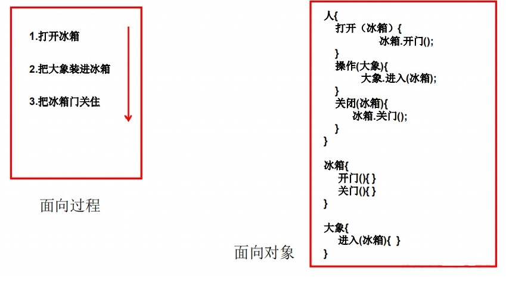
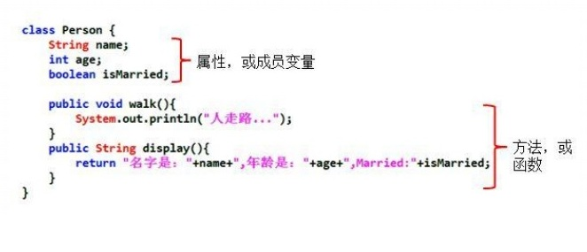
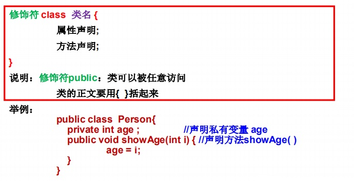
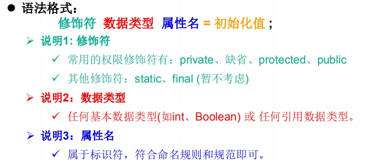
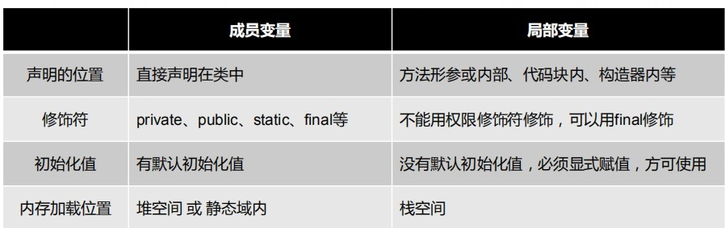
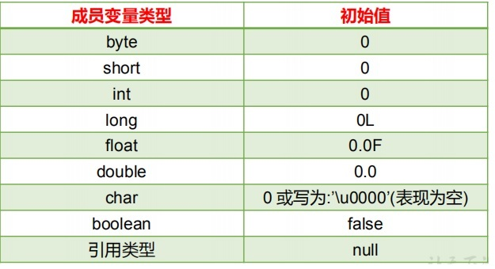

# 5.面向对象

## 5.1 面向过程与面向对象

<font color='red' size='4'><strong>●面向过程（POP）和面向对象（OOP）</strong></font>  
::: warning 二者比较
▶二者都是一种思想，面向对象是相对于面向过程而言的。  
面向过程，强调的是功能行为，以函数为最小单位，考虑怎么做。  
面向对象，将功能封装进对象，强调具备了功能的对象，以类/对象为最小单位，考虑谁来做。   
▶面向对象更加强调运用人类在日常的思维逻辑中采用的思想方法与原则，如抽象、分类、继承、聚合、多态等。
:::
<font color='red' size='4'><strong>●面线对象三大特性</strong></font>  
::: danger 特征
①封装 (Encapsulation)  
②继承 (Inheritance)  
③多态 (Polymorphism)  
:::
<font color='green'>面向对象：Object Oriented Programming </font>   
<font color='green'>面向过程：Procedure Oriented Programming</font> 

**示例：人开车**
::: tip 面向过程
1.打开车门  
2.进入车内  
3.关闭车门  
4.点火启动汽车  
:::
::: tip 面向对象
车：{  
  开门(){},  
  关门(){},  
  启动(){},  
  run(){}  
}  
人：{  
  开车门(车){  
     车.开门(){}  
  }  
  关车门(车){  
    车.关门(){}    
  }  
  启动开车(车){  
    车.启动(){},  
    车.run(){}  
  }  
}  
:::

**示例：人把大象放进冰箱里**


----


<font color='green' size='4'><strong>面向对象的思想概述</strong></font> 

★程序员从面向过程的执行者转化成了面向对象的指挥者  
★面向对象分析方法分析问题的思路和步骤：   
▶根据问题需要，选择问题所针对的<font color='red' size='3'><strong>现实世界中的实体</strong></font>     
▶从实体中寻找解决问题相关的属性和功能，这些属性和功能就形成了<font color='red' size='3'><strong>概念世界中的类</strong></font>   
▶把抽象的实体用计算机语言进行描述，形成计算机世界中类的定义。即借助某种程序语言，<font color='red' size='3'><strong>把类构造成计算机能够识别和处理的数据结构</strong></font>   
▶将类实例化成计算机世界中的对象。<font color='red' size='3'><strong>对象是计算机世界中解决问题的最终工具</strong></font>  
## 5.2 Java基本元素：类和对象

### 面向对象的思想概述
※ <font color='red' size='3'><strong>类(Class)</strong></font>和<font color='red' size='3'><strong>对象(Object)</strong></font>是面向对象的核心概念。   
☆ 类是对一类事物的描述，是<font color='red'>抽象的、概念上的定义</font>    
☆ 对象是<font color='red'>实际存在</font>的该类事物的每个个体，因而也称为<font color='red'>实例(instance)</font>。    
※ “万事万物皆对象” 

**示例说明：**
:::tip
类：医生（抽象的一类人）  
对象：张医生（实际存在的一个人）
:::

▶可以理解为：<font color='blue' size='3'><strong>类 = 抽象概念的人；对象 = 实实在在的某个人</strong></font>  
▶ 面向对象程序设计的重点是<font color='red' size='3'><strong>类的设计</strong></font>  
▶ 类的设计，其实就是<font color='red' size='3'><strong>类的成员的设计</strong></font>  
### Java类及类的成员

● 现实世界的生物体，大到鲸鱼，小到蚂蚁，都是由最基本的细胞构成的。同理，Java代码世界是由诸多个不同功能的类构成的。    
● 现实生物世界中的细胞又是由什么构成的呢？细胞核、细胞质、… 那么，Java中用类class来描述事物也是如此。常见的类的成员有：   
▶ 属 性：对应类中的成员变量   
▶ 行 为：对应类中的成员方法   
<font color='blue' size='3'><strong>Field = 属性 = 成员变量，Method = (成员)方法 = 函数</strong></font>  

**示例:**  

----

### 类的语法格式


## 5.3 对象的创建和使用

● Java类和类的成员变量实例化过程就是创建类的对象  
● 创建对象语法：<font color='blue' size='3'> 类名 对象名 = new 类名();</strong></font>    
● 使用“<font color='blue' size='3'>对象名.对象成员</strong></font> ”的方式访问对象成员（包括属性和方法）  

```java
//创建动物类
public class Animal {
public int legs;
public void eat(){
System.out.println(“Eating.”);
}
public viod move(){
System.out.println(“Move.”);
}}
```
```java
//创建动物园类，创建动物对象，调用动物的方法
public class Zoo{
public static void main(String args[]){
//创建对象
Animal xb=new Animal();
xb.legs=4;//访问属性
System.out.println(xb.legs);
xb.eat();//访问方法
xb.move();//访问方法
} }
```
::: warning 注意 类的访问机制：  
◆在一个类中的访问机制：类中的方法可以直接访问类中的成员变量。 （例外：static方法访问非static，编译不通过。）   
◆在不同类中的访问机制：先创建要访问类的对象，再用对象访问类中定义的成员  
:::
### 对象的产生
### 对象的生命周期
### 内存解析
### 匿名对象
## 5.4 类的成员之一：属性


**示例：**
```java
public class Person{
private int age; //声明private变量 age
public String name = “Lila”; //声明public变量 name
}
```
### 成员变量（属性）和局部变量的区别

### 成员变量vs局部变量的内存位置
### 对象属性的默认初始化赋值

## 5.5 类的成员之二：方法

## 5.6 OOP特征一：封装与隐藏

## 5.7 类的成员之三：构造器

## 5.8 关键字：this

## 5.9 关键字：package、import

## 5.10 面向过程与面向对象
