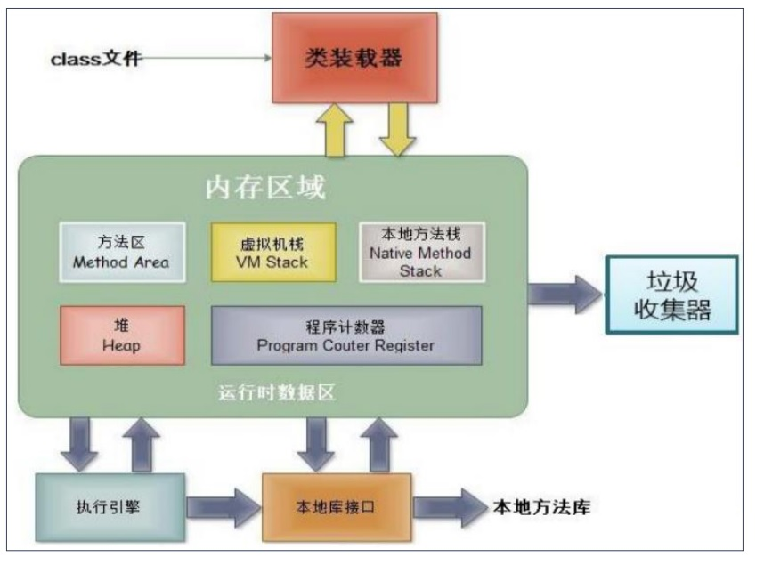
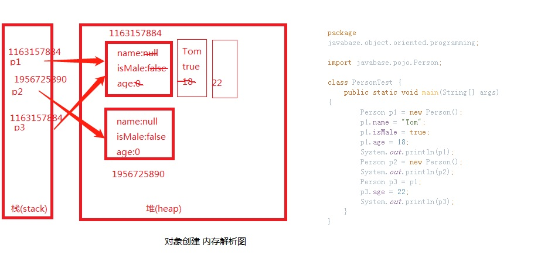
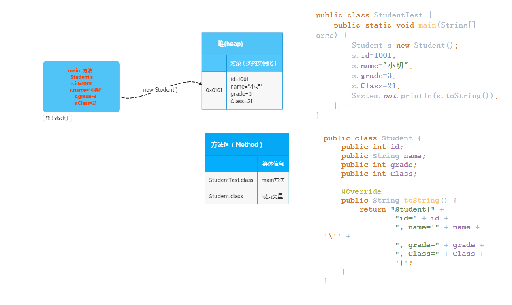
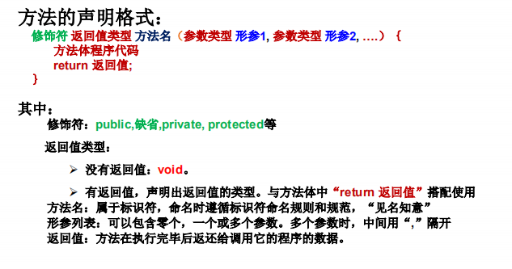
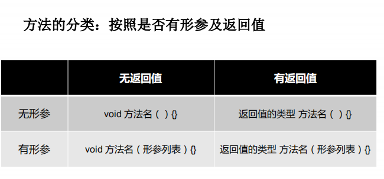
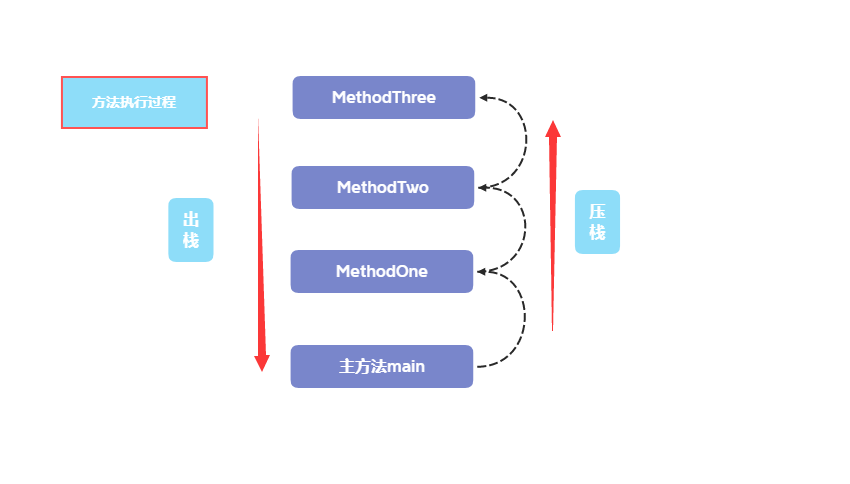
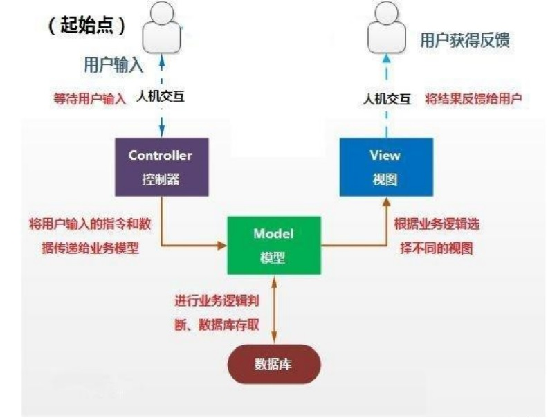
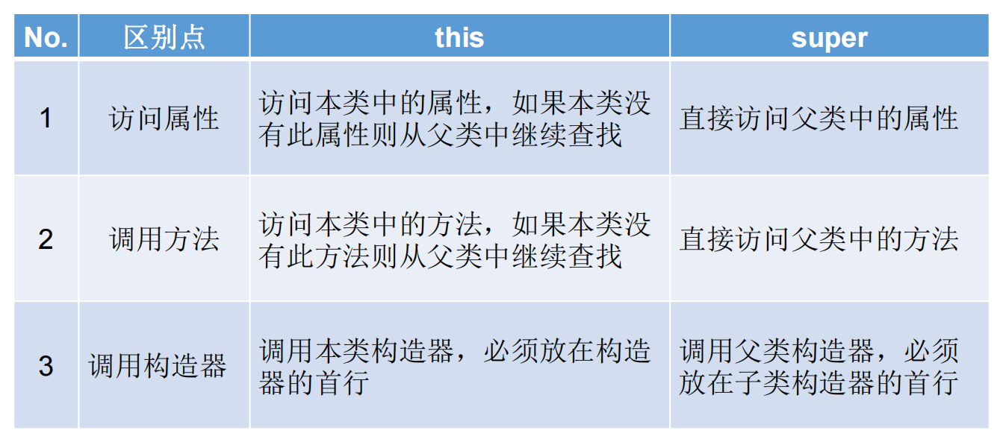
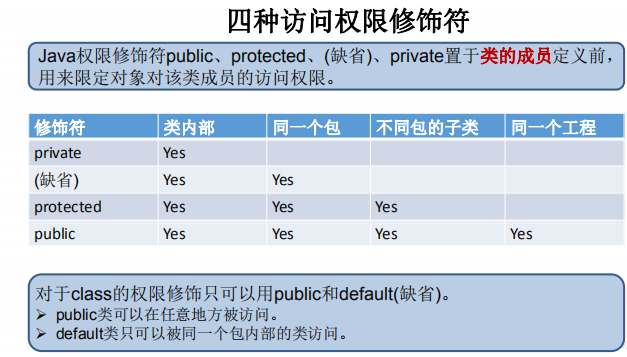
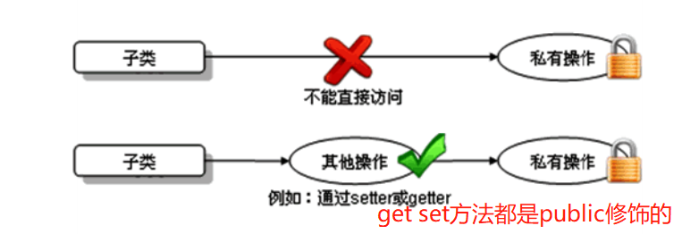

# 5.面向对象

## 5.1 面向过程与面向对象

<font color='red' size='4'><strong>●面向过程（POP）和面向对象（OOP）</strong></font>  
::: warning 二者比较
▶二者都是一种思想，面向对象是相对于面向过程而言的。  
面向过程，强调的是功能行为，以函数为最小单位，考虑怎么做。  
面向对象，将功能封装进对象，强调具备了功能的对象，以类/对象为最小单位，考虑谁来做。   
▶面向对象更加强调运用人类在日常的思维逻辑中采用的思想方法与原则，如抽象、分类、继承、聚合、多态等。
:::
<font color='red' size='4'><strong>●面线对象三大特性</strong></font>  
::: danger 特征
①封装 (Encapsulation)  
②继承 (Inheritance)  
③多态 (Polymorphism)  
:::
<font color='green'>面向对象：Object Oriented Programming </font>   
<font color='green'>面向过程：Procedure Oriented Programming</font> 

**示例：人开车**
::: tip 面向过程
1.打开车门  
2.进入车内  
3.关闭车门  
4.点火启动汽车  
:::
::: tip 面向对象
车：{  
  开门(){},  
  关门(){},  
  启动(){},  
  run(){}  
}  
人：{  
  开车门(车){  
     车.开门(){}  
  }  
  关车门(车){  
    车.关门(){}    
  }  
  启动开车(车){  
    车.启动(){},  
    车.run(){}  
  }  
}  
:::

**示例：人把大象放进冰箱里**


<font color='green' size='4'><strong>面向对象的思想概述</strong></font> 

★程序员从面向过程的执行者转化成了面向对象的指挥者  
★面向对象分析方法分析问题的思路和步骤：   
▶根据问题需要，选择问题所针对的<font color='red' size='3'><strong>现实世界中的实体</strong></font>     
▶从实体中寻找解决问题相关的属性和功能，这些属性和功能就形成了<font color='red' size='3'><strong>概念世界中的类</strong></font>   
▶把抽象的实体用计算机语言进行描述，形成计算机世界中类的定义。即借助某种程序语言，<font color='red' size='3'><strong>把类构造成计算机能够识别和处理的数据结构</strong></font>   
▶将类实例化成计算机世界中的对象。<font color='red' size='3'><strong>对象是计算机世界中解决问题的最终工具</strong></font>  
## 5.2 Java基本元素：类和对象

### 面向对象的思想概述
※ <font color='red' size='3'><strong>类(Class)</strong></font>和<font color='red' size='3'><strong>对象(Object)</strong></font>是面向对象的核心概念。   
☆ 类是对一类事物的描述，是<font color='red'>抽象的、概念上的定义</font>    
☆ 对象是<font color='red'>实际存在</font>的该类事物的每个个体，因而也称为<font color='red'>实例(instance)</font>。    
※ “万事万物皆对象” 

**示例说明：**
:::tip
类：医生（抽象的一类人）  
对象：张医生（实际存在的一个人）
:::

▶可以理解为：<font color='blue' size='3'><strong>类 = 抽象概念的人；对象 = 实实在在的某个人</strong></font>  
▶ 面向对象程序设计的重点是<font color='red' size='3'><strong>类的设计</strong></font>  
▶ 类的设计，其实就是<font color='red' size='3'><strong>类的成员的设计</strong></font>  
### Java类及类的成员

● 现实世界的生物体，大到鲸鱼，小到蚂蚁，都是由最基本的细胞构成的。同理，Java代码世界是由诸多个不同功能的类构成的。    
● 现实生物世界中的细胞又是由什么构成的呢？细胞核、细胞质、… 那么，Java中用类class来描述事物也是如此。常见的类的成员有：   
▶ 属 性：对应类中的成员变量   
▶ 行 为：对应类中的成员方法   
<font color='blue' size='3'><strong>Field = 属性 = 成员变量，Method = (成员)方法 = 函数</strong></font>  

**示例:**  

----

### 类的语法格式


## 5.3 对象的创建和使用

● Java类和类的成员变量实例化过程就是创建类的对象  
● 创建对象语法：<font color='blue' size='3'> 类名 对象名 = new 类名();</strong></font>    
● 使用“<font color='blue' size='3'>对象名.对象成员</strong></font> ”的方式访问对象成员（包括属性和方法）  

```java
//创建动物类
public class Animal {
public int legs;
public void eat(){
System.out.println(“Eating.”);
}
public viod move(){
System.out.println(“Move.”);
}}
```
```java
//创建动物园类，创建动物对象，调用动物的方法
public class Zoo{
public static void main(String args[]){
//创建对象
Animal xb=new Animal();
xb.legs=4;//访问属性
System.out.println(xb.legs);
xb.eat();//访问方法
xb.move();//访问方法
} }
```
::: warning 注意 类的访问机制：  
◆在一个类中的访问机制：类中的方法可以直接访问类中的成员变量。 （例外：static方法访问非static，编译不通过。）   
◆在不同类中的访问机制：先创建要访问类的对象，再用对象访问类中定义的成员  
:::
### 对象的产生
### 对象的生命周期
### 内存解析

<font color='red' size='3'><strong>堆（Heap)</strong></font> ，此内存区域的<font color='red' size='3'>唯一目的就是存放对象实例</font>，几乎所有的对象实例都在这里分配内存。这一点在Java虚拟机规范中的描述是：<font color='red' size='3'>所有的对象实例以及数组都要在堆上分配</font>。  
<font color='red' size='3'><strong>栈（Stack）</strong></font>，是指虚拟机栈。虚拟机栈用于<font color='red' size='3'>存储局部变量等</font>。局部变量表存放了编译期可知长度的各种基本数据类型（boolean、byte、char、short、int、float、long、double）、对象引用（reference类型，它不等同于对象本身，是对象在堆内存的首地址）。方法执行完，自动释放。  
<font color='red' size='3'><strong>方法区（MethodArea）</strong></font> ，用于存储已被虚拟机加载的<font color='red' size='3'>类信息、常量、静态变量、即时编译器编译后的代码</font>等数据  

**示例**

```java
package javabase.object.oriented.programming;

import javabase.pojo.Person;

class PersonTest {
    public static void main(String[] args) {
        Person p1 = new Person();
        p1.name = "Tom";
        p1.isMale = true;
        p1.age = 18;
        System.out.println(p1.hashCode());
        System.out.println(p1);
        Person p2 = new Person();
        System.out.println(p2.hashCode());
        System.out.println(p2);
        Person p3 = p1;
        p3.age = 22;
        System.out.println(p3.hashCode());
        System.out.println(p3);
    }
}
```
```java
package javabase.pojo;

/**
 * @classname : Person
 * @description: 人类
 * @author: tianqikai
 */
public class Person{
//    姓名
    public String name;
    //年龄
    public int age ;
    //是否是男性
    public boolean isMale;

    @Override
    public String toString() {
        return "Person{" +
                "name='" + name + '\'' +
                ", age=" + age +
                ", isMale=" + isMale +
                '}';
    }
}
```
```
//结果输出
1163157884
Person{name='Tom', age=18, isMale=true}
1956725890
Person{name='null', age=0, isMale=false}
1163157884
Person{name='Tom', age=22, isMale=true}
```



### 匿名对象
◆ 我们也可以不定义对象的句柄，而直接调用这个对象的方法。这样的对象叫做匿名对象。如：new Person().shout();   
◆ 使用情况  
● 如果对一个对象只需要进行一次方法调用，那么就可以使用匿名对象。  
● 我们经常将匿名对象作为实参传递给一个方法调用。  

```java
package javabase.object.oriented.programming;

import javabase.pojo.Person;
import java.math.BigDecimal;
/**
 * @ClassName：AnonymousObject
 * @description: 匿名类的使用
 * @author: tianqikai*/
public class AnonymousObject {
    public static void main(String[] args) {
        System.out.println(new Person().getAge());

        System.out.println(new BigDecimal(1));
    }
}

```
::: tip 匿名对象特点：
1、由于我们没有记录堆内存对象的地址值，所以只能用一次，再次使用就找不到了 

2、匿名对象的好处就是使用完毕就是垃圾，可以在垃圾回收器空闲时回收，节省内存空间
:::
## 5.4 类的成员之一：属性

### 变量的分类：成员变量与局部变量

<font color='red' size='4'><strong>▶ 在方法体外，类体内声明的变量称为成员变量。</strong></font>   
<font color='red' size='4'><strong>▶ 在方法体内部声明的变量称为局部变量。</strong></font>   


::: warning  ●注意：二者在初始化值方面的异同:
同: 都有生命周期   
异：局部变量除形参外，需显式初始化（定义变量时，必须赋值处理）。
:::


**示例：**
```java
public class Person{
private int age; //声明private变量 age
public String name = "Lila"; //声明public变量 name
}
```
### 成员变量（属性）和局部变量的区别

### 成员变量vs局部变量的内存位置
### 对象属性的默认初始化赋值


## 5.4 类的成员之二：方法

::: tip  什么是方法(method、函数):
● 方法是类或对象行为特征的抽象，用来完成某个功能操作。在某些语言中也称为函数或过程。  
● 将功能封装为方法的目的是，可以实现代码重用，简化代码  
● Java里的方法不能独立存在，所有的方法必须定义在类里。  
:::



<br>



### 方法调用过程

```java
public class MenthodTest {

    public static void main(String[] args) {
        methodOne();
    }
    public static void methodOne(){
        System.out.println("Hello world! One");
        methodTwo();
    }
    public static void methodTwo(){
        System.out.println("Hello world! two");
        methodThree();
    }
    public static void methodThree(){
        System.out.println("Hello world! three");
    }
}
```
```
//输出信息
Hello world! One
Hello world! two
Hello world! three
```



::: warning  上图是方法执行过程图
将main方法压栈  
因为main方法里面调用了m1方法，所以将m1方法压栈  
m1方法调用m2方法，将m2方法压栈  
m2方法调用m3方法，将m3方法压栈  
m3方法执行结束后，开始弹栈  ,m2,m1 main依次出栈
:::

::: danger
▇ 注 意：
● 方法被调用一次，就会执行一次  
● 没有具体返回值的情况，返回值类型用关键字void表示，那么方法体中可以不必使用return语句。如果使用，仅用来结束方法。  
● 定义方法时，方法的结果应该返回给调用者，交由调用者处理。 方法中只能调用方法或属性，不可以在方法内部定义方法。  
:::
## 5.4.1 方法的重载

<font color='red' size='4'><strong>重载的概念</strong></font>  
在同一个类中，允许存在一个以上的同名方法，只要它们的参数个数或者参数类型不同即可。  

<font color='red' size='4'><strong>重载的特点：</strong></font>  
与返回值类型无关，只看参数列表，且参数列表必须不同。(参数个数或参数类型)。调用时，根据方法参数列表的不同来区别。  

<font color='red' size='4'><strong>重载示例：</strong></font>  

```java
//返回两个整数的和
int add(int x,int y){return x+y;}
//返回三个整数的和
int add(int x,int y,int z){return x+y+z;}
//返回两个小数的和
double add(double x,double y){return x+y;}
```
## 5.4.2 可变形参的方法

JavaSE 5.0 中提供了Varargs(variable number of arguments)机制，允许直接定义能和多个实参相匹配的形参。从而，可以用一种更简单的方式，来传递个数可变的实参。 

```java
//JDK 5.0以前：采用数组形参来定义方法，传入多个同一类型变量   
public static void test(int a ,String[] books);
//JDK5.0：采用可变个数形参来定义方法，传入多个同一类型变量  
public static void test(int a ,String…books);  
```
::: tip 说明：
1. 声明格式：方法名(参数的类型名 ...参数名)
2. 可变参数：方法参数部分指定类型的参数个数是可变多个：0个，1个或多个
3. 可变个数形参的方法与同名的方法之间，彼此构成重载
4. 可变参数方法的使用与方法参数部分使用数组是一致的
5. 方法的参数部分有可变形参，需要放在形参声明的最后
6. 在一个方法的形参位置，最多只能声明一个可变个数形参
:::

**示例**
```java
package javabase.object.oriented.programming;
/**
 * @ClassName：ChangeMethods
 * @description: 可变形参
 * @author: tianqikai
 */
public class ChangeMethods {
    public void test(String[] msg){
        String message="";
        for(int i=0;i<msg.length;i++){
            message=message+msg[i];
        }
        System.out.println("含字符串数组参数的test方法 :"+message);
    }
    public void test1(String book){
        System.out.println("****与可变形参方法构成重载的test1方法****:"+book);
    }
    public void test1(String ... books){
        String message="";
        for(int i=0;i<books.length;i++){
            message=message+books[i];
        }
        System.out.println("****形参长度可变的test1方法****:"+message);
    }
    public static void main(String[] args){
        ChangeMethods to = new ChangeMethods();
        //下面两次调用将执行第二个test方法
        to.test1();
        to.test1("aa" , "bb");
        //下面将执行第一个test方法
        to.test(new String[]{"aa"});
    }
}
```

```sh
//输出结果
****形参长度可变的test1方法****:
****形参长度可变的test1方法****:aabb
含字符串数组参数的test方法 :aa
```
## 5.4.3 方法参数的值传递机制
方法调用时，参数除了可以传递基本数据类型，还可以传递引用数据类型，这两种参数在传递的时候会有一些差异，在使用的时候需要注意


<font color='red'><strong>●形参是基本数据类型：将实参基本数据类型变量的“数据值”传递给形参</strong></font>  
<font color='red'><strong>●形参是引用数据类型：将实参引用数据类型变量的“地址值”传递给形参</strong></font>  

**示例**
```java
public class ParamTest01{

    public static void m1(int i){
        i++;
        System.out.println("m1里面的变量i=" + i); 
    }

    public static void main(String[] args){

        //局部变量
        int i = 10;
        //调用
        m1(i);
        System.out.println("main里面的变量i=" + i);
    }

}
```
:::tip 运行结果
m1里面的变量i=11  
main里面的变量i=10  
出现这个结果的原因就是main方法里面的i和m1方法里面的i分别占用的是两块不同的内存，请看下图，main方法栈帧和m1方法栈帧分别有两个i，所以这两个i是不同的。  
:::

```java
public class AnimalTest01{

    //方法传递的参数是引用数据类型Animal
    public static void m1(Animal a){
        int age = a.getAge();
        a.setAge(++age);
        System.out.println("m1中的age=" + a.getAge()); 
    }

    public static void main(String[] args){
        //1.创建Animal对象
        Animal a = new Animal();
        a.setAge(10);
        m1(a);
        System.out.println("main中的age" + a.getAge()); 
    }
}
```
:::tip 运行结果
m1中的age=11  
main中的age=11  
两个打印的结果都是11，与基本数据类型的结果是不一样的，这是因为方法参数传过去的是对象的内存地址，m1方法里面的a和main方法里面的a所指向的是同一个Animal对象，所以当m1方法中修改了Animal对象中的age之后，main方法里面在获取age时，值也发生了改变。  
:::

## 5.4.4面试题
```java
import java.io.PrintStream;
/**
 * @ClassName：MethodPass
 * @description: 值得传递
 * @author: tianqikai
 */
public class MethodPass {
    public static void main(String[] args) {
        int a=10;
        int b=10;
        //调用method，使打印结果为 a=100 b=200
        method1(a,b);
        method2(a,b);
        method3(a,b);
        System.out.println("a="+a);
        System.out.println("b="+b);
    }
    //可行
    public static void method1(int a,int b){
        System.out.println(" a = " + a * 10);
        System.out.println(" b = " + b * 20);
        //终止当前运行的java虚拟机
        System.exit(0);
    }
    //方法二：可行
    private static void method2(int a, int b) {
        PrintStream stream = new PrintStream(System.out) {
            @Override
            public void println(String x) {
                if("a=10".equals(x)) {
                    x = ("a=100");
                }else if("b=10".equals(x)) {
                    x = ("b=200");
                }
                super.println(x);
            }
        };
        System.setOut(stream);
    }
    //不可行
    public static void method3(int a,int b){
        a=a * 10;
        b=b * 20;
    }
}

```
## 5.4.5 递归方法

<font color='red' size='4'><strong>递归方法：一个方法体内调用它自身。</strong></font>  
●方法递归包含了一种隐式的循环，它会重复执行某段代码，但这种重复执行无须循环控制。  
●递归一定要向已知方向递归，否则这种递归就变成了无穷递归，类似于死循环。  

**示例**
```java

public class Recurrence {
    public static void main(String[] args) {
        //递归：返回结果中又调用了它本身的方法
        System.out.println( multiply(5));
        System.out.println( sum(5));
    }
    //求1-n个连续数字的阶乘
    public static int multiply(int n){
        if(n==1){
            return n;
        }else{
         return  n*multiply(n-1);
        }
    }
    //求1-n个连续数字的相加
    public static int sum(int n){
        if(n==1){
            return n;
        }else{
            return  n+sum(n-1);
        }
    }

}

```

## 5.4 类的成员之三：构造器

<font color='red'><strong>●构造器的特征</strong></font>   
▶它具有与类相同的名称  
▶它不声明返回值类型。（与声明为void不同）  
▶不能被static、final、synchronized、abstract、native修饰，不能有return语句返回值   
<font color='red'><strong>●构造器的作用：创建对象；给对象进行初始化</strong></font> 

::: danger  语法格式：
修饰符 类名 (参数列表) {
初始化语句；
}
:::

●根据参数不同，构造器可以分为如下两类：
○隐式无参构造器（系统默认提供）
○显式定义一个或多个构造器（无参、有参）

::: danger  注 意：
◆Java语言中，每个类都至少有一个构造器  
◆默认构造器的修饰符与所属类的修饰符一致  
◆一旦显式定义了构造器，则系统不再提供默认构造器   
◆一个类可以创建多个重载的构造器  
◆父类的构造器不可被子类继承   
:::
**示例**
```java
public class JavaBean {
    private String name; // 属性一般定义为private
    private int age;
    public JavaBean() {
    }
    public JavaBean(String name,int age) {
        this.name=name;
        this.age=age;
    }
    public int getAge() {
    return age; }
    public void setAge(int a) {
    age = a; }
    public String getName() {
    return name; }
    public void setName(String n) {
    name = n; }
 }
```

::: tip
截止到目前，我们讲到了很多位置都可以对类的属性赋值。现总结这几个位置，并指明赋值的先后顺序。  
※ 赋值的位置：  
① 默认初始化  
② 显式初始化  
③ 构造器中初始化  
④ 通过“对象.属性“或“对象.方法”的方式赋值  
※ 赋值的先后顺序：  
① - ② - ③ - ④
:::
## 5.4 类的成员之四：代码块
## 5.4 类的成员之五：内部类
## 5.7 关键字：this
this是java里面的一个关键字，是一种引用类型，在堆(heap)中的每个java对象上都有一个this指向自己。<font color='red'><strong>this代表着当前对象的引用。</strong></font>  

**this可以做什么？**
:::tip
1.可以区分成员变量和局部变量。  
2.this 可以调用类的属性、方法和构造器
:::

**示例**
```java
class Person{ // 定义Person类
  private String name ;
  private int age ;
  public Person(String name,int age){
    this.name = name ;//区分成员变量和局部变量 
    this.age = age ; 
  }
  public void getInfo(){
    System.out.println("姓名：" + name) ;
    this.speak();//调用方法
  }
  public void speak(){
    System.out.println(“年龄：” + this.age);
  }
}
```
```java
class Person{ // 定义Person类
  private String name ;
  private int age ;
  public Person(){ // 无参构造器
    System.out.println("新对象实例化") ;
  }
  public Person(String name){
    this(); // 调用本类中的无参构造器
    this.name = name ;
  }
  public Person(String name,int age){
    this(name) ; // 调用有一个参数的构造器
    this.age = age;
  }
  public String getInfo(){
    return "姓名：" + name + "，年龄：" + age ;
  } 
}
```
:::danger 注意
1. 在任意方法或构造器内，如果使用当前类的成员变量或成员方法可以在其前面添加this，增强程序的阅读性。不过，通常我们都习惯省略this。  
2. 当形参与成员变量同名时，如果在方法内或构造器内需要使用成员变量，必须添加this来表明该变量是类的成员变量  
3. 使用this访问属性和方法时，如果在本类中未找到，会从父类中查找  
:::
## 5.7 关键字：package、import
### 5.7.1 关键字—package
:::danger  package
package语句作为Java源文件的第一条语句，指明该文件中定义的类所在的包。(若缺省该语句，则指定为无名包)。   
它的格式为：   
package 顶层包名.子包名 ;   
:::

**举例：pack1\pack2\PackageTest.java**
```java
package pack1.pack2; //指定类PackageTest属于包pack1.pack2
public class PackageTest{
public void display(){
System.out.println("in method display()");
} }
```
●包对应于文件系统的目录，package语句中，用 “.” 来指明包(目录)的层次；  
●包通常用小写单词标识。通常使用所在公司域名的倒置：com.atguigu.xxx  

#### 包的作用
● 包帮助管理大型软件系统：将功能相近的类划分到同一个包中。比如：MVC的设计模式  
● 包可以包含类和子包，划分项目层次，便于管理  
● 解决类命名冲突的问题  
● 控制访问权限  

#### MVC设计模式
MVC是常用的设计模式之一，将整个程序分为三个层次：<font color='blue'>视图模型层，控制器层，与
数据模型层</font>。这种将程序输入输出、数据处理，以及数据的展示分离开来的设计模式
使程序结构变的灵活而且清晰，同时也描述了程序各个对象间的通信方式，降低了程
序的耦合性。
<table>
    <tr>
        <th colspan="6">模型层 model 主要处理数据</th>
    </tr>
    <tr>数据对象封装 model.bean/domain</tr>
    <tr>数据库操作类 model.dao</tr>
    <tr>数据库 model.db</tr>
</table>
<table>
    <tr>
        <th colspan="6">控制层 controller 处理业务逻辑</th>
    </tr>
    <tr>应用界面相关 controller.activity</tr>
    <tr>存放fragment controller.fragment</tr>
    <tr>显示列表的适配器 controller.adapter</tr>
    <tr>服务相关的 controller.service</tr>
    <tr>抽取的基类 controller.base</tr>
</table>
<table>
    <tr>
        <th colspan="6">视图层 view 显示数据</th>
    </tr>
    <tr>相关工具类 view.utils</tr>
    <tr>自定义view view.ui</tr>
</table>


#### JDK中主要的包介绍

<font color='blue'>1. java.lang</font>----包含一些Java语言的核心类，如String、Math、Integer、 System和Thread，提供常用功能  
<font color='blue'>2. java.net</font>----包含执行与网络相关的操作的类和接口。  
<font color='blue'>3. java.io</font> ----包含能提供多种输入/输出功能的类。  
<font color='blue'>4. java.util</font>----包含一些实用工具类，如定义系统特性、接口的集合框架类、使用与日期日历相关的函数。  
<font color='blue'>5. java.text</font>----包含了一些java格式化相关的类  
<font color='blue'>6. java.sql</font>----包含了java进行JDBC数据库编程的相关类/接口  
<font color='blue'>7. java.awt</font>----包含了构成抽象窗口工具集（abstract window toolkits）的多个类，这些类被用来构建和管理应用程序的图形用户界面(GUI)。 B/S C/S   
### 5.7.2 关键字—import
◆为使用定义在不同包中的Java类，需用import语句来引入指定包层次下所需要的类
或全部类(.*)。<font color='red'>import语句告诉编译器到哪里去寻找类。</font>  

::: tip 语法格式：
import 包名. 类名;
:::

**实例**
```java
import pack1.pack2.Test; //import pack1.pack2.*;表示引入pack1.pack2包中的所有结构
public class PackTest{
public static void main(String args[]){
Test t = new Test(); //Test类在pack1.pack2包中定义
t.display();
} }
```

:::warning  ●注意：
1. 在源文件中使用import显式的导入指定包下的类或接口  
2. 声明在包的声明和类的声明之间。  
3. 如果需要导入多个类或接口，那么就并列显式多个import语句即可  
4. 举例：可以使用java.util.*的方式，一次性导入util包下所有的类或接口。  
5. 如果导入的类或接口是java.lang包下的，或者是当前包下的，则可以省略此import语句。  
6. 如果在代码中使用不同包下的同名的类。那么就需要使用类的全类名的方式指明调用的是哪个类。  
7. 如果已经导入java.a包下的类。那么如果需要使用a包的子包下的类的话，仍然需要导入。  
8. import static组合的使用：调用指定类或接口下的静态的属性或方法  
:::
## 5.7 关键字：super 

<font color='red'>初学者在学习完继承(5.9 OOP特征二：继承性)后，再回来学习</font>
::: tip 在Java类中使用super来调用父类中的指定操作：
▶super可用于访问父类中定义的属性  
▶super可用于调用父类中定义的成员方法  
▶super可用于在子类构造器中调用父类的构造器  
:::

:::warning 注意：
▶尤其当子父类出现同名成员时，可以用super表明调用的是父类中的成员  
▶super的追溯不仅限于直接父类   
▶super和this的用法相像，this代表本类对象的引用，super代表父类的内存空间的标识  
:::

::: tip 调用父类的构造器 
◆子类中所有的构造器默认都会访问父类中空参数的构造器   
◆当父类中没有空参数的构造器(默认都会有的)时，子类的构造器必须通过this(参数列表)或者super(参数列表)语句指定调用本类或者父类中相应的构造器。同时，只能”二选一”，且必须放在构造器的首行   
◆如果子类构造器中既未显式调用父类或本类的构造器，且父类中又没有无参的构造器，则编译出错  
:::
****

**this和super的区别**

## 5.7 关键字：final
## 5.7 关键字：static

## 5.9 OOP特征一：封装与隐藏

**● 我们程序设计追求“高内聚，低耦合”。**    
▶ 高内聚 ：类的内部数据操作细节自己完成，不允许外部干涉；  
▶ 低耦合 ：仅对外暴露少量的方法用于使用。   
**● 隐藏对象内部的复杂性，只对外公开简单的接口。便于外界调用，从而提高系统的可扩展性、可维护性。**      
<font color='red' size='3'><strong>通俗的说，把该隐藏的隐藏起来，该暴露的暴露出来。这就是封装性的设计思想。</strong></font>  

前面我们举的例子中，有的直接操作了对象中的属性值；使用者对类内部定义的属性(对象的成员变量)的直接操作会导致数据的错误、混乱或安全性问题。  
::: danger  信息的封装和隐藏
Java中通过将数据声明为私有的(private)，再提供公共的（public）   
方法:getXxx()和setXxx()实现对该属性的操作，以实现下述目的：  
●隐藏一个类中不需要对外提供的实现细节；  
●使用者只能通过事先定制好的方法来访问数据，可以方便地加入控制逻辑，限制对属性的不合理操作；  
●便于修改，增强代码的可维护性；  
:::

**示例**
```java
/**
 * @program: Zoo
 * @description: 封装和隐藏
 * @author: tianqikai
 **/
public class Zoo {
    public static void main(String[] args) {
        Animal animal=new Animal();
        animal.leg=100;
        System.out.println("leg:"+animal.leg);


        Women women =new Women();
//        women.name="小花"; //不能直接赋值
        women.setName("小明");
        System.out.println("name:"+women.getName());
    }
}

public  class Animal{
        public  int leg; //public修饰的，可以随便修改
    }

public  class Women{
        //成员变量是私有的
        private String name;
        private  int leg; //public修饰的，可以随便修改
        //成员方法是共有的供外部使用
        public int getLeg() {
            return leg;
        }

        public String getName() {
            return name;
        }

        public void setLeg(int leg) {
            this.leg = leg;
        }

        public void setName(String name) {
            this.name = name;
        }
    }    
```




## 5.9 OOP特征二：继承性


●java中的继承描述的是两个类之间的关系，被继承的类称为父类，继承的类称为子类，使用extends关键字来表示。  
●在java语言里面只支持单继承，即一个类只能有一个父类，子类可以继承父类中的非private修饰的成员方法和成员变量，构造方法不能被继承。 

<font color='red' ><strong>为什么要有继承？</strong></font>  
**多个类中存在相同属性和行为时，将这些内容抽取到单独一个类中，那么多个类无需再定义这些属性和行为，只要继承那个类即可；提高了代码可复用性**  

java里面的继承跟现实生活中的继承颇为相似，现实生活中一个儿子只能有一个父亲，儿子可以继承父亲的房子车子但是不能继承父亲大脑里面的思想和知识（私有信息）。  
<font color='red' ><strong>如果一个类没有显示的继承其他类，那么这个类会默认继承Object类，Object是SUN公司提供的java中的根类。</strong></font>  
**类继承语法规则:**
```java
[修饰符列表] class 子类名 extends 父类名{
    类体;
}

```
::: tip 继承的优点
提高了代码的复用性  
提高了代码的维护性  
让类与类之间产生了关系，是多态的前提  

注意：不要仅为了获取其他类中某个功能而去继承
:::
::: warning  继承的缺点
增强了类之间的耦合。  
软件开发的一个原则是高内聚，低耦合。  
内聚是一个模块内各个元素彼此结合的紧密程度  
耦合是一个软件里面不同模块之间相互连接的数量  
:::
**示例**
``` java
public class Person {
  public String name;
  public int age;
  public Date birthDate;
  private boolean earthFlag;
}

public class Student extends Person{
  private  String grade;
  private  String Class;
  public   String school;
}
```

::: danger Java只支持单继承和多层继承，不允许多重继承  
▶ 一个子类只能有一个父类  
▶ 一个父类可以派生出多个子类  
 class SubDemo extends Demo{ } //ok  
 class SubDemo extends Demo1,Demo2...//error  
:::

::: warning 关于继承的规则：
  子类不能直接访问父类中私有的(private)的成员变量和方法。
:::


```java
public class InheritanceTest01 {
    public static void main(String[] args) {
        Student student=new Student();
//        student.earthFlag=true; 子类不能直接访问父类私有成员变量和方法
        student.setEarthFlag(false);
        System.out.println(student.getEarthFlag());
    }
}
```
## 5.9 OOP特征三：多态性 
<font color='red' ><strong>多态性，是面向对象中最重要的概念，在Java中的体现：</strong></font>     
<font color='blue' >对象的多态性：父类的引用指向子类的对象</font>  
可以直接应用在抽象类和接口上  

<font color='red' ><strong>Java引用变量有两个类型：编译时类型和运行时类型。</strong></font>    
编译时类型由声明该变量时使用的类型决定，    
运行时类型由实际赋给该变量的对象决定。

---  
简称：编译时，看左边；运行时，看右边。 
若编译时类型和运行时类型不一致，就出现了<font color='red' >对象的多态性(Polymorphism) </font>   
多态情况下:  
<font color='red' ><strong>“看左边”：看的是父类的引用（父类中不具备子类特有的方法） </strong></font>       
<font color='red' ><strong>“看右边”：看的是子类的对象（实际运行的是子类重写父类的方法） </strong></font>   


:::tip 多态的使用
▶在Java中,子类的对象可以替代父类的对象使用  
▶一个变量只能有一种确定的数据类型  
▶一个引用类型变量可能指向(引用)多种不同类型的对象  
:::
```java
Person p = new Student(); //创建了Student对象赋值给了父类声明的变量
Object o = new Person();//Object类型的变量o，指向Person类型的对象
o = new Student(); //Object类型的变量o，指向Student类型的对象
```
:::tip 考点1
Java不支持多继承，但是支持多层继承
即子类—>父类—>爷爷类….—>祖先类—>Object类，  
子类可以访问其先辈类里面的非private修饰的成员方法和成员变量。  
:::
```java
//爷爷类
public class Person {
  public String name;
  public int age;
  public Date birthDate;
  private boolean earthFlag;
}
//父类
public class Student extends Person{
  private  String grade;
  private  String Class;
  public   String school;
}
//子类
public class Children extends Student{
    public String isFlag;
    public int age;
    public int heigth;
}

```
:::danger 考点2
一个引用类型变量如果声明为父类的类型，但实际引用的是子类对象，那么该变量就不能再访问子类中添加的属性和方法
:::
```java
Student m = new Student();
m.school = “pku”; //合法,Student类有school成员变量
Person e = new Student(); 
e.school = “pku”; //非法,Person类没有school成员变量
//属性是在编译时确定的，编译时e为Person类型，没有school成员变量，因而编译错误。
```
:::tip
:::
```java
```
## 5.12 方法的重写(override)
重写，也叫做覆盖，当父类中的方法无法满足子类需求时，子类可以将父类的方法进行重写编写来满足需求。  
:::tip 重写条件
1.两个类必须是继承关系,必须具有相同的方法名，相同的返回值类型，相同的参数列表。  
2.子类重写的方法的返回值类型不能大于父类被重写的方法的返回值类型
3.子类重写的方法使用的访问权限不能小于父类被重写的方法的访问权限  
3.子类方法抛出的异常不能大于父类被重写方法的异常。(关于异常后面的章节再讲。)  
4.private 私有的方法不能被重写。   
构造方法无法被重写，因为构造方法无法被继承。  
static 静态的方法不存在重写。  
重写指的是成员方法，和成员变量无关。  
:::
```java
public class Animal {

    public void eat() {                
        System.out.println("吃饭");
    }

    public void sleep() {            
        System.out.println("睡觉");
    }
}

class Cat extends Animal {

    @Override
    public void eat() {
        System.out.println("吃猫粮");//猫喜欢吃猫粮
    }
    //非法，子类中的method1()的访问权限private比被覆盖方法的访问权限public小
//    @Override
//    private void eat() {
//        System.out.println("吃猫粮");//猫喜欢吃猫粮
//    }
}

//重写测试
public class OverrideTest {
    public static void main(String[] args) {
        Animal animal=new Animal();
        animal.eat();
        Cat cat=new Cat();
        cat.eat();
        //这是一种“多态性”：同名的方法，用不同的对象来区分调用的是哪一个方法。
    }
}
```
## 5.13 四种访问权限修饰符

## 5.14 子类对象实例化过程 
## 5.16 包装类的使用
## 5.17 Object类的使用
## 5.18 理解main方法的语法
## 5.22 抽象类与抽象方法
## 5.23 接口(interface)

