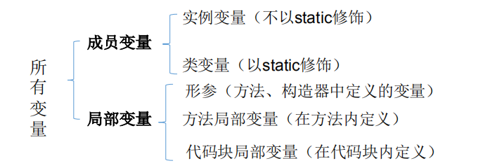

# 5.面向对象


## 5.1 面向过程与面向对象

<font color='red' size='4'><strong>●面向过程（POP）和面向对象（OOP）</strong></font>  
::: warning 二者比较
▶二者都是一种思想，面向对象是相对于面向过程而言的。  
面向过程，强调的是功能行为，以函数为最小单位，考虑怎么做。  
面向对象，将功能封装进对象，强调具备了功能的对象，以类/对象为最小单位，考虑谁来做。   
▶面向对象更加强调运用人类在日常的思维逻辑中采用的思想方法与原则，如抽象、分类、继承、聚合、多态等。
:::
<font color='red' size='4'><strong>●面线对象三大特性</strong></font>  
::: danger 特征
①封装 (Encapsulation)  
②继承 (Inheritance)  
③多态 (Polymorphism)  
:::
<font color='green'>面向对象：Object Oriented Programming </font>   
<font color='green'>面向过程：Procedure Oriented Programming</font> 

**示例：人开车**
::: tip 面向过程
1.打开车门  
2.进入车内  
3.关闭车门  
4.点火启动汽车  
:::
::: tip 面向对象
车：{  
  开门(){},  
  关门(){},  
  启动(){},  
  run(){}  
}  
人：{  
  开车门(车){  
     车.开门(){}  
  }  
  关车门(车){  
    车.关门(){}    
  }  
  启动开车(车){  
    车.启动(){},  
    车.run(){}  
  }  
}  
:::

**示例：人把大象放进冰箱里**


<font color='green' size='4'><strong>面向对象的思想概述</strong></font> 

★程序员从面向过程的执行者转化成了面向对象的指挥者  
★面向对象分析方法分析问题的思路和步骤：   
▶根据问题需要，选择问题所针对的<font color='red' size='3'><strong>现实世界中的实体</strong></font>     
▶从实体中寻找解决问题相关的属性和功能，这些属性和功能就形成了<font color='red' size='3'><strong>概念世界中的类</strong></font>   
▶把抽象的实体用计算机语言进行描述，形成计算机世界中类的定义。即借助某种程序语言，<font color='red' size='3'><strong>把类构造成计算机能够识别和处理的数据结构</strong></font>   
▶将类实例化成计算机世界中的对象。<font color='red' size='3'><strong>对象是计算机世界中解决问题的最终工具</strong></font>  
## 5.2 Java基本元素：类和对象

### 面向对象的思想概述
※ <font color='red' size='3'><strong>类(Class)</strong></font>和<font color='red' size='3'><strong>对象(Object)</strong></font>是面向对象的核心概念。   
☆ 类是对一类事物的描述，是<font color='red'>抽象的、概念上的定义</font>    
☆ 对象是<font color='red'>实际存在</font>的该类事物的每个个体，因而也称为<font color='red'>实例(instance)</font>。    
※ “万事万物皆对象” 

**示例说明：**
:::tip
类：医生（抽象的一类人）  
对象：张医生（实际存在的一个人）
:::

▶可以理解为：<font color='blue' size='3'><strong>类 = 抽象概念的人；对象 = 实实在在的某个人</strong></font>  
▶ 面向对象程序设计的重点是<font color='red' size='3'><strong>类的设计</strong></font>  
▶ 类的设计，其实就是<font color='red' size='3'><strong>类的成员的设计</strong></font>  
### Java类及类的成员

● 现实世界的生物体，大到鲸鱼，小到蚂蚁，都是由最基本的细胞构成的。同理，Java代码世界是由诸多个不同功能的类构成的。    
● 现实生物世界中的细胞又是由什么构成的呢？细胞核、细胞质、… 那么，Java中用类class来描述事物也是如此。常见的类的成员有：   
▶ 属 性：对应类中的成员变量   
▶ 行 为：对应类中的成员方法   
<font color='blue' size='3'><strong>Field = 属性 = 成员变量，Method = (成员)方法 = 函数</strong></font>  

**示例:**  

----

### 类的语法格式


## 5.3 对象的创建和使用

● Java类和类的成员变量实例化过程就是创建类的对象  
● 创建对象语法：<font color='blue' size='3'> 类名 对象名 = new 类名();</strong></font>    
● 使用“<font color='blue' size='3'>对象名.对象成员</strong></font> ”的方式访问对象成员（包括属性和方法）  

```java
//创建动物类
public class Animal {
public int legs;
public void eat(){
System.out.println(“Eating.”);
}
public viod move(){
System.out.println(“Move.”);
}}
```
```java
//创建动物园类，创建动物对象，调用动物的方法
public class Zoo{
public static void main(String args[]){
//创建对象
Animal xb=new Animal();
xb.legs=4;//访问属性
System.out.println(xb.legs);
xb.eat();//访问方法
xb.move();//访问方法
} }
```
::: warning 注意 类的访问机制：  
◆在一个类中的访问机制：类中的方法可以直接访问类中的成员变量。 （例外：static方法访问非static，编译不通过。）   
◆在不同类中的访问机制：先创建要访问类的对象，再用对象访问类中定义的成员  
:::
### 对象的产生
### 对象的生命周期
### 内存解析

<font color='red' size='3'><strong>堆（Heap)</strong></font> ，此内存区域的<font color='red' size='3'>唯一目的就是存放对象实例</font>，几乎所有的对象实例都在这里分配内存。这一点在Java虚拟机规范中的描述是：<font color='red' size='3'>所有的对象实例以及数组都要在堆上分配</font>。  
<font color='red' size='3'><strong>栈（Stack）</strong></font>，是指虚拟机栈。虚拟机栈用于<font color='red' size='3'>存储局部变量等</font>。局部变量表存放了编译期可知长度的各种基本数据类型（boolean、byte、char、short、int、float、long、double）、对象引用（reference类型，它不等同于对象本身，是对象在堆内存的首地址）。方法执行完，自动释放。  
<font color='red' size='3'><strong>方法区（MethodArea）</strong></font> ，用于存储已被虚拟机加载的<font color='red' size='3'>类信息、常量、静态变量、即时编译器编译后的代码</font>等数据  

**示例**

```java
package javabase.object.oriented.programming;

import javabase.pojo.Person;

class PersonTest {
    public static void main(String[] args) {
        Person p1 = new Person();
        p1.name = "Tom";
        p1.isMale = true;
        p1.age = 18;
        System.out.println(p1.hashCode());
        System.out.println(p1);
        Person p2 = new Person();
        System.out.println(p2.hashCode());
        System.out.println(p2);
        Person p3 = p1;
        p3.age = 22;
        System.out.println(p3.hashCode());
        System.out.println(p3);
    }
}
```
```java
package javabase.pojo;

/**
 * @classname : Person
 * @description: 人类
 * @author: tianqikai
 */
public class Person{
//    姓名
    public String name;
    //年龄
    public int age ;
    //是否是男性
    public boolean isMale;

    @Override
    public String toString() {
        return "Person{" +
                "name='" + name + '\'' +
                ", age=" + age +
                ", isMale=" + isMale +
                '}';
    }
}
```
```
//结果输出
1163157884
Person{name='Tom', age=18, isMale=true}
1956725890
Person{name='null', age=0, isMale=false}
1163157884
Person{name='Tom', age=22, isMale=true}
```


### 匿名对象
◆ 我们也可以不定义对象的句柄，而直接调用这个对象的方法。这样的对象叫做匿名对象。如：new Person().shout();   
◆ 使用情况  
● 如果对一个对象只需要进行一次方法调用，那么就可以使用匿名对象。  
● 我们经常将匿名对象作为实参传递给一个方法调用。  

```java
package javabase.object.oriented.programming;

import javabase.pojo.Person;
import java.math.BigDecimal;
/**
 * @ClassName：AnonymousObject
 * @description: 匿名类的使用
 * @author: tianqikai*/
public class AnonymousObject {
    public static void main(String[] args) {
        System.out.println(new Person().getAge());

        System.out.println(new BigDecimal(1));
    }
}

```
::: tip 匿名对象特点：
1、由于我们没有记录堆内存对象的地址值，所以只能用一次，再次使用就找不到了 

2、匿名对象的好处就是使用完毕就是垃圾，可以在垃圾回收器空闲时回收，节省内存空间
:::
## 5.4 类的成员之一：属性

### 变量的分类：成员变量与局部变量

<font color='red' size='4'><strong>▶ 在方法体外，类体内声明的变量称为成员变量。</strong></font>   
<font color='red' size='4'><strong>▶ 在方法体内部声明的变量称为局部变量。</strong></font>   


::: warning  ●注意：二者在初始化值方面的异同:
同: 都有生命周期   
异：局部变量除形参外，需显式初始化（定义变量时，必须赋值处理）。
:::


**示例：**
```java
public class Person{
private int age; //声明private变量 age
public String name = "Lila"; //声明public变量 name
}
```
### 成员变量（属性）和局部变量的区别

### 成员变量vs局部变量的内存位置
### 对象属性的默认初始化赋值


## 5.4 类的成员之二：方法

::: tip  什么是方法(method、函数):
● 方法是类或对象行为特征的抽象，用来完成某个功能操作。在某些语言中也称为函数或过程。  
● 将功能封装为方法的目的是，可以实现代码重用，简化代码  
● Java里的方法不能独立存在，所有的方法必须定义在类里。  
:::


<br>


### 方法调用过程

```java
public class MenthodTest {

    public static void main(String[] args) {
        methodOne();
    }
    public static void methodOne(){
        System.out.println("Hello world! One");
        methodTwo();
    }
    public static void methodTwo(){
        System.out.println("Hello world! two");
        methodThree();
    }
    public static void methodThree(){
        System.out.println("Hello world! three");
    }
}
```
```
//输出信息
Hello world! One
Hello world! two
Hello world! three
```


::: warning  上图是方法执行过程图
将main方法压栈  
因为main方法里面调用了m1方法，所以将m1方法压栈  
m1方法调用m2方法，将m2方法压栈  
m2方法调用m3方法，将m3方法压栈  
m3方法执行结束后，开始弹栈  ,m2,m1 main依次出栈
:::

::: danger
▇ 注 意：
● 方法被调用一次，就会执行一次  
● 没有具体返回值的情况，返回值类型用关键字void表示，那么方法体中可以不必使用return语句。如果使用，仅用来结束方法。  
● 定义方法时，方法的结果应该返回给调用者，交由调用者处理。 方法中只能调用方法或属性，不可以在方法内部定义方法。  
:::
## 5.4.1 方法的重载

<font color='red' size='4'><strong>重载的概念</strong></font>  
在同一个类中，允许存在一个以上的同名方法，只要它们的参数个数或者参数类型不同即可。  

<font color='red' size='4'><strong>重载的特点：</strong></font>  
与返回值类型无关，只看参数列表，且参数列表必须不同。(参数个数或参数类型)。调用时，根据方法参数列表的不同来区别。  

<font color='red' size='4'><strong>重载示例：</strong></font>  

```java
//返回两个整数的和
int add(int x,int y){return x+y;}
//返回三个整数的和
int add(int x,int y,int z){return x+y+z;}
//返回两个小数的和
double add(double x,double y){return x+y;}
```
**面试示例**
```java
public class OverloadMethod {
    public static void main(String[] args) {
        int[] intArray=new int[]{1,2,3};
        System.out.println(intArray); //打印的是int数组地址 println(Object x) 
        char[] chars=new char[]{'a','b','c'};
        System.out.println(chars); //打印的char型数组的值 println方法重写 println(char x[]) 
    }
}
```
```
//输出结果
[I@4554617c
abc
```
## 5.4.2 可变形参的方法

JavaSE 5.0 中提供了Varargs(variable number of arguments)机制，允许直接定义能和多个实参相匹配的形参。从而，可以用一种更简单的方式，来传递个数可变的实参。 

```java
//JDK 5.0以前：采用数组形参来定义方法，传入多个同一类型变量   
public static void test(int a ,String[] books);
//JDK5.0：采用可变个数形参来定义方法，传入多个同一类型变量  
public static void test(int a ,String…books);  
```
::: tip 说明：
1. 声明格式：方法名(参数的类型名 ...参数名)
2. 可变参数：方法参数部分指定类型的参数个数是可变多个：0个，1个或多个
3. 可变个数形参的方法与同名的方法之间，彼此构成重载
4. 可变参数方法的使用与方法参数部分使用数组是一致的
5. 方法的参数部分有可变形参，需要放在形参声明的最后
6. 在一个方法的形参位置，最多只能声明一个可变个数形参
:::

**示例**
```java
package javabase.object.oriented.programming;
/**
 * @ClassName：ChangeMethods
 * @description: 可变形参
 * @author: tianqikai
 */
public class ChangeMethods {
    public void test(String[] msg){
        String message="";
        for(int i=0;i<msg.length;i++){
            message=message+msg[i];
        }
        System.out.println("含字符串数组参数的test方法 :"+message);
    }
    public void test1(String book){
        System.out.println("****与可变形参方法构成重载的test1方法****:"+book);
    }
    public void test1(String ... books){
        String message="";
        for(int i=0;i<books.length;i++){
            message=message+books[i];
        }
        System.out.println("****形参长度可变的test1方法****:"+message);
    }
    public static void main(String[] args){
        ChangeMethods to = new ChangeMethods();
        //下面两次调用将执行第二个test方法
        to.test1();
        to.test1("aa" , "bb");
        //下面将执行第一个test方法
        to.test(new String[]{"aa"});
    }
}
```

```sh
//输出结果
****形参长度可变的test1方法****:
****形参长度可变的test1方法****:aabb
含字符串数组参数的test方法 :aa
```
## 5.4.3 方法参数的值传递机制
方法调用时，参数除了可以传递基本数据类型，还可以传递引用数据类型，这两种参数在传递的时候会有一些差异，在使用的时候需要注意


<font color='red'><strong>●形参是基本数据类型：将实参基本数据类型变量的“数据值”传递给形参</strong></font>  
<font color='red'><strong>●形参是引用数据类型：将实参引用数据类型变量的“地址值”传递给形参</strong></font>  

**示例**
```java
public class ParamTest01{

    public static void m1(int i){
        i++;
        System.out.println("m1里面的变量i=" + i); 
    }

    public static void main(String[] args){

        //局部变量
        int i = 10;
        //调用
        m1(i);
        System.out.println("main里面的变量i=" + i);
    }

}
```
:::tip 运行结果
m1里面的变量i=11  
main里面的变量i=10  
出现这个结果的原因就是main方法里面的i和m1方法里面的i分别占用的是两块不同的内存，请看下图，main方法栈帧和m1方法栈帧分别有两个i，所以这两个i是不同的。  
:::

```java
public class AnimalTest01{

    //方法传递的参数是引用数据类型Animal
    public static void m1(Animal a){
        int age = a.getAge();
        a.setAge(++age);
        System.out.println("m1中的age=" + a.getAge()); 
    }

    public static void main(String[] args){
        //1.创建Animal对象
        Animal a = new Animal();
        a.setAge(10);
        m1(a);
        System.out.println("main中的age" + a.getAge()); 
    }
}
```
:::tip 运行结果
m1中的age=11  
main中的age=11  
两个打印的结果都是11，与基本数据类型的结果是不一样的，这是因为方法参数传过去的是对象的内存地址，m1方法里面的a和main方法里面的a所指向的是同一个Animal对象，所以当m1方法中修改了Animal对象中的age之后，main方法里面在获取age时，值也发生了改变。  
:::

## 5.4.4面试题
```java
import java.io.PrintStream;
/**
 * @ClassName：MethodPass
 * @description: 值得传递
 * @author: tianqikai
 */
public class MethodPass {
    public static void main(String[] args) {
        int a=10;
        int b=10;
        //调用method，使打印结果为 a=100 b=200
        method1(a,b);
        method2(a,b);
        method3(a,b);
        System.out.println("a="+a);
        System.out.println("b="+b);
    }
    //可行
    public static void method1(int a,int b){
        System.out.println(" a = " + a * 10);
        System.out.println(" b = " + b * 20);
        //终止当前运行的java虚拟机
        System.exit(0);
    }
    //方法二：可行
    private static void method2(int a, int b) {
        PrintStream stream = new PrintStream(System.out) {
            @Override
            public void println(String x) {
                if("a=10".equals(x)) {
                    x = ("a=100");
                }else if("b=10".equals(x)) {
                    x = ("b=200");
                }
                super.println(x);
            }
        };
        System.setOut(stream);
    }
    //不可行
    public static void method3(int a,int b){
        a=a * 10;
        b=b * 20;
    }
}

```
## 5.4.5 递归方法

<font color='red' size='4'><strong>递归方法：一个方法体内调用它自身。</strong></font>  
●方法递归包含了一种隐式的循环，它会重复执行某段代码，但这种重复执行无须循环控制。  
●递归一定要向已知方向递归，否则这种递归就变成了无穷递归，类似于死循环。  

**示例**
```java

public class Recurrence {
    public static void main(String[] args) {
        //递归：返回结果中又调用了它本身的方法
        System.out.println( multiply(5));
        System.out.println( sum(5));
    }
    //求1-n个连续数字的阶乘
    public static int multiply(int n){
        if(n==1){
            return n;
        }else{
         return  n*multiply(n-1);
        }
    }
    //求1-n个连续数字的相加
    public static int sum(int n){
        if(n==1){
            return n;
        }else{
            return  n+sum(n-1);
        }
    }

}

```

## 5.4 类的成员之三：构造器

<font color='red'><strong>●构造器的特征</strong></font>   
▶它具有与类相同的名称  
▶它不声明返回值类型。（与声明为void不同）  
▶不能被static、final、synchronized、abstract、native修饰，不能有return语句返回值   
<font color='red'><strong>●构造器的作用：创建对象；给对象进行初始化</strong></font> 

::: danger  语法格式：
修饰符 类名 (参数列表) {
初始化语句；
}
:::

●根据参数不同，构造器可以分为如下两类：
○隐式无参构造器（系统默认提供）
○显式定义一个或多个构造器（无参、有参）

::: danger  注 意：
◆Java语言中，每个类都至少有一个构造器  
◆默认构造器的修饰符与所属类的修饰符一致  
◆一旦显式定义了构造器，则系统不再提供默认构造器   
◆一个类可以创建多个重载的构造器  
◆父类的构造器不可被子类继承   
:::
**示例**
```java
public class JavaBean {
    private String name; // 属性一般定义为private
    private int age;
    public JavaBean() {
    }
    public JavaBean(String name,int age) {
        this.name=name;
        this.age=age;
    }
    public int getAge() {
    return age; }
    public void setAge(int a) {
    age = a; }
    public String getName() {
    return name; }
    public void setName(String n) {
    name = n; }
 }
```

::: tip
截止到目前，我们讲到了很多位置都可以对类的属性赋值。现总结这几个位置，并指明赋值的先后顺序。  
※ 赋值的位置：  
① 默认初始化  
② 显式初始化  
③ 构造器中初始化  
④ 通过“对象.属性“或“对象.方法”的方式赋值  
※ 赋值的先后顺序：  
① - ② - ③ - ④
:::
## 5.4 类的成员之四：代码块
### 代码块的分类

◆ <font color='red'><strong>局部代码块：</strong></font>  在方法中出现，限定变量生命周期，及早释放，提高内存利用率  
◆ <font color='red'><strong>构造代码块：</strong></font>  在类中方法外出现；多个构造方法方法中相同的代码存放到一起，每次调用构造都执行，并且在构造方法前执行  
◆ <font color='red'><strong>静态代码块：</strong></font>  在类中方法外出现，并加上static修饰；用于给类进行初始化，在加载的时候就执行，并且只执行一次。一般用于加载驱动。  
◆ <font color='red'><strong>同步代码块：</strong></font>  (后面多线程部分会讲解)  

::: danger 方法执行顺序：
1.静态代码块，随着类加载而加载,且只执行一次  
2.构造代码块，每创建一个对象就会执行一次，优先于构造方法执行  
3.构造方法，每创建一个对象就会执行一次  
:::

**实例**
```java
public class BlockTest01 {
    public static void main(String[] args) {
        System.out.println("main方法");
        //局部代码块
        {
            int x = 10;                        //限定变量的声明周期
            System.out.println(x);
        }

        Student s1 = new Student();
        System.out.println("---------------");
        Student s2 = new Student();

    }

    static {
        System.out.println("main方法类中的静态代码块");
    }
}

class Student {

    public Student(){

        System.out.println("Student构造方法");
    }                    

    //构造代码块:每创建一次对象就会执行一次,优先于构造方法执行
    {
        System.out.println("Student构造代码块");
    }

    static {                                    //随着类加载而加载,且只执行一次
        System.out.println("Student静态代码块");    //作用:用来给类进行初始化,一般用来加载驱动
    }                                            //静态代码块是优先于主方法执行
}
```
## 5.4 类的成员之五：内部类
当一个事物的内部，还有一个部分需要一个完整的结构进行描述，而这个内部的完整的结构又只为外部事物提供服务，那么整个内部的完整结构最好使
用内部类。   
◆　在Java中，允许一个类的定义位于另一个类的内部，前者称为<font color='red'>内部类</font>，后者称为<font color='blue'>外部类</font>。   
◆  Inner class一般用在定义它的类或语句块之内，在外部引用它时必须给出完整的名称。  
　　▶<font color='red'>Inner class的名字不能与包含它的外部类类名相同</font>；  

:::tip 分类： 
<strong>成员内部类</strong>（static成员内部类和非static成员内部类)   
<strong>局部内部类</strong>（不谈修饰符）、匿名内部类   
:::

:::tip <font color='red'>成员内部类作为类的成员的角色：</font>
★ 和外部类不同，Inner class还可以声明为private或protected  
★ 可以调用外部类的结构  
★ Inner class 可以声明为static的，但此时就不能再使用外层类的非static的成员变量；  　　
:::


:::tip <font color='red'>成员内部类作为类的角色：</font>
※ 可以在内部定义属性、方法、构造器等结构  
※ 可以声明为abstract类 ，因此可以被其它的内部类继承  
※ 可以声明为final的  编译以后生成OuterClass$InnerClass.class字节码文件（也适用于局部内部类）  　 　　
:::

:::tip 注意
1. 非static的成员内部类中的成员不能声明为static的，只有在外部类或static的成员内部类中才可声明static成员。　　
2. 外部类访问成员内部类的成员，需要“内部类.成员”或“内部类对象.成员”的方式　　
3. 成员内部类可以直接使用外部类的所有成员，包括私有的数据　　
4. 当想要在外部类的静态成员部分使用内部类时，可以考虑内部类声明为静态的　　
:::

```java
public class InnerClassTest {
    String name="内部类";
    static int id=87;
    public InnerClassTest() {

    }
    public void run(){
        System.out.println("跑步！");
        Work.moving();//访问静态内部类方法
    }
    public  void method(){

        new Person().eat();//访问非静态成员内部类方法
    }
    // 成员内部类
    class Person{
        private String name;
        public  Person(){

        }
        public void eat(){
            System.out.println("人在吃饭！");
            run();//调用外部类的的非静态成员方法
            InnerClassTest.this.run();//调用外部类的非静态成员方法
        }
        public void setName(String name) {
            this.name = name;
        }
        public void setName() {
            this.name = InnerClassTest.this.name;//重名时，调用外部类的的属性
        }
    }
    // 静态的成员内部类
    static class Work{
        private int id;
        public static void moving(){
            System.out.println("机器在运转工作！");
//            InnerClassTest.this.run();报错
        }
        public  void move(){
            System.out.println("机器在运转工作！");
//            InnerClassTest.this.run();报错
        }
        public void setId(int id) {
            this.id = id;
        }
    }

    public static void main(String[] args) {
        //创建非静态内部类
        InnerClassTest In=new InnerClassTest();
        In.method();
        System.out.println("--------------------------");
        InnerClassTest.Person person=In.new Person();
        person.eat();
        System.out.println("--------------------------");
//        创建静态的内部类
        InnerClassTest.Work work=new InnerClassTest.Work();
        work.move();
    }
}
```

### 局部内部类

```java
public class InnerClassTest1 {
    //开发中很少见
    public  void method(){
        class AA{

        }
    }
    public Comparable getComparable(){

        class  MyComparable implements  Comparable{

            @Override
            public int compareTo(Object o) {
                return 0;
            }
        }
        return new MyComparable();
    }
    public Comparable getComparable1(){

        return new Comparable(){

            @Override
            public int compareTo(Object o) {
                return 0;
            }
        };
    }
}
```

## 5.7 关键字：this
this是java里面的一个关键字，是一种引用类型，在堆(heap)中的每个java对象上都有一个this指向自己。<font color='red'><strong>this代表着当前对象的引用。</strong></font>  

**this可以做什么？**
:::tip
1.可以区分成员变量和局部变量。  
2.this 可以调用类的属性、方法和构造器
:::

**示例**
```java
class Person{ // 定义Person类
  private String name ;
  private int age ;
  public Person(String name,int age){
    this.name = name ;//区分成员变量和局部变量 
    this.age = age ; 
  }
  public void getInfo(){
    System.out.println("姓名：" + name) ;
    this.speak();//调用方法
  }
  public void speak(){
    System.out.println(“年龄：” + this.age);
  }
}
```
```java
class Person{ // 定义Person类
  private String name ;
  private int age ;
  public Person(){ // 无参构造器
    System.out.println("新对象实例化") ;
  }
  public Person(String name){
    this(); // 调用本类中的无参构造器
    this.name = name ;
  }
  public Person(String name,int age){
    this(name) ; // 调用有一个参数的构造器
    this.age = age;
  }
  public String getInfo(){
    return "姓名：" + name + "，年龄：" + age ;
  } 
}
```
:::danger 注意
1. 在任意方法或构造器内，如果使用当前类的成员变量或成员方法可以在其前面添加this，增强程序的阅读性。不过，通常我们都习惯省略this。  
2. 当形参与成员变量同名时，如果在方法内或构造器内需要使用成员变量，必须添加this来表明该变量是类的成员变量  
3. 使用this访问属性和方法时，如果在本类中未找到，会从父类中查找  
:::
## 5.7 关键字：package、import
### 5.7.1 关键字—package
:::danger  package
package语句作为Java源文件的第一条语句，指明该文件中定义的类所在的包。(若缺省该语句，则指定为无名包)。   
它的格式为：   
package 顶层包名.子包名 ;   
:::

**举例：pack1\pack2\PackageTest.java**
```java
package pack1.pack2; //指定类PackageTest属于包pack1.pack2
public class PackageTest{
public void display(){
System.out.println("in method display()");
} }
```
●包对应于文件系统的目录，package语句中，用 “.” 来指明包(目录)的层次；  
●包通常用小写单词标识。通常使用所在公司域名的倒置：com.atguigu.xxx  

#### 包的作用
● 包帮助管理大型软件系统：将功能相近的类划分到同一个包中。比如：MVC的设计模式  
● 包可以包含类和子包，划分项目层次，便于管理  
● 解决类命名冲突的问题  
● 控制访问权限  

#### MVC设计模式
MVC是常用的设计模式之一，将整个程序分为三个层次：<font color='blue'>视图模型层，控制器层，与
数据模型层</font>。这种将程序输入输出、数据处理，以及数据的展示分离开来的设计模式
使程序结构变的灵活而且清晰，同时也描述了程序各个对象间的通信方式，降低了程
序的耦合性。
<table>
    <tr>
        <th colspan="6">模型层 model 主要处理数据</th>
    </tr>
    <tr>数据对象封装 model.bean/domain</tr>
    <tr>数据库操作类 model.dao</tr>
    <tr>数据库 model.db</tr>
</table>
<table>
    <tr>
        <th colspan="6">控制层 controller 处理业务逻辑</th>
    </tr>
    <tr>应用界面相关 controller.activity</tr>
    <tr>存放fragment controller.fragment</tr>
    <tr>显示列表的适配器 controller.adapter</tr>
    <tr>服务相关的 controller.service</tr>
    <tr>抽取的基类 controller.base</tr>
</table>
<table>
    <tr>
        <th colspan="6">视图层 view 显示数据</th>
    </tr>
    <tr>相关工具类 view.utils</tr>
    <tr>自定义view view.ui</tr>
</table>


#### JDK中主要的包介绍

<font color='blue'>1. java.lang</font>----包含一些Java语言的核心类，如String、Math、Integer、 System和Thread，提供常用功能  
<font color='blue'>2. java.net</font>----包含执行与网络相关的操作的类和接口。  
<font color='blue'>3. java.io</font> ----包含能提供多种输入/输出功能的类。  
<font color='blue'>4. java.util</font>----包含一些实用工具类，如定义系统特性、接口的集合框架类、使用与日期日历相关的函数。  
<font color='blue'>5. java.text</font>----包含了一些java格式化相关的类  
<font color='blue'>6. java.sql</font>----包含了java进行JDBC数据库编程的相关类/接口  
<font color='blue'>7. java.awt</font>----包含了构成抽象窗口工具集（abstract window toolkits）的多个类，这些类被用来构建和管理应用程序的图形用户界面(GUI)。 B/S C/S   
### 5.7.2 关键字—import
◆为使用定义在不同包中的Java类，需用import语句来引入指定包层次下所需要的类
或全部类(.*)。<font color='red'>import语句告诉编译器到哪里去寻找类。</font>  

::: tip 语法格式：
import 包名. 类名;
:::

**实例**
```java
import pack1.pack2.Test; //import pack1.pack2.*;表示引入pack1.pack2包中的所有结构
public class PackTest{
public static void main(String args[]){
Test t = new Test(); //Test类在pack1.pack2包中定义
t.display();
} }
```

:::warning  ●注意：
1. 在源文件中使用import显式的导入指定包下的类或接口  
2. 声明在包的声明和类的声明之间。  
3. 如果需要导入多个类或接口，那么就并列显式多个import语句即可  
4. 举例：可以使用java.util.*的方式，一次性导入util包下所有的类或接口。  
5. 如果导入的类或接口是java.lang包下的，或者是当前包下的，则可以省略此import语句。  
6. 如果在代码中使用不同包下的同名的类。那么就需要使用类的全类名的方式指明调用的是哪个类。  
7. 如果已经导入java.a包下的类。那么如果需要使用a包的子包下的类的话，仍然需要导入。  
8. import static组合的使用：调用指定类或接口下的静态的属性或方法  
:::
## 5.7 关键字：super 

<font color='red'>初学者在学习完继承(5.9 OOP特征二：继承性)后，再回来学习</font>
::: tip 在Java类中使用super来调用父类中的指定操作：
▶super可用于访问父类中定义的属性  
▶super可用于调用父类中定义的成员方法  
▶super可用于在子类构造器中调用父类的构造器  
:::
```java
public class Person {
//    姓名
    public String name;
    //年龄
    public int age ;
    //是否是男性
    public boolean isMale;

    public  Person(String name, int age,boolean isMale){
        this.name=name;
        this.age=age;
        this.isMale=isMale;
    }

    public int getAge() {
        return age;
    }

    @Override
    public String toString() {
        return "Person{" +
                "name='" + name + '\'' +
                ", age=" + age +
                ", isMale=" + isMale +
                '}';
    }
}
```
```java
public class Student extends Person{
    public int id;
    public String name;
    public int grade;
    public int Class;

    public  Student(String name, int age,boolean isMale,int Class){
        super( name+"super",age,isMale);//super可用于在子类构造器中调用父类的构造器
        this.Class=Class;
        this.name=name;
    }

    public void getInfo() {
        System.out.println(super.name);//super可用于访问父类中定义的属性
        System.out.println(this.name);
        System.out.println(super.toString());//super可用于调用父类中定义的成员方法
        System.out.println(this.toString());
    }

    @Override
    public String toString() {
        return "Student{" +
                "id=" + id +
                ", name='" + name + '\'' +
                ", grade=" + grade +
                ", Class=" + Class +
                ", name='" + super.name + '\'' + //尤其当子父类出现同名成员时，可以用super表明调用的是父类中的成员
                ", age=" + age +
                ", isMale=" + isMale +
                '}';
    }
}
```
```java
public class SuperTest {
    public static void main(String[] args) {
        Student student=new Student("小明",19,true,23);
        student.getInfo();
    }
}
//输出结果如下：
小明super
小明
Person{name='小明super', age=19, isMale=true}
Student{id=0, name='小明', grade=0, Class=23, name='小明super', age=19, isMale=true}
```

:::warning 注意：
▶尤其当子父类出现同名成员时，可以用super表明调用的是父类中的成员  
▶super的追溯不仅限于直接父类   
▶super和this的用法相像，this代表本类对象的引用，super代表父类的内存空间的标识  
:::

::: tip 调用父类的构造器 
◆子类中所有的构造器默认都会访问父类中空参数的构造器   
◆当父类中没有空参数的构造器(默认都会有的)时，子类的构造器必须通过this(参数列表)或者super(参数列表)语句指定调用本类或者父类中相应的构造器。同时，只能”二选一”，且必须放在构造器的首行   
◆如果子类构造器中既未显式调用父类或本类的构造器，且父类中又没有无参的构造器，则编译出错  
:::
****

**this和super的区别**

## 5.7 关键字：final
**◆ 在Java中声明类、变量和方法时，可使用关键字final来修饰,表示“最终的”。**     
▷ <font color='red'><strong>final标记的类不能被继承。提高安全性，提高程序的可读性。</strong></font>    
   ✔String类、System类、StringBuffer类   
▷ <font color='red'><strong>final标记的方法不能被子类重写。</strong></font>   
   ✔比如：Object类中的getClass()。       
▷ <font color='red'><strong>final标记的变量(成员变量或局部变量)即称为常量。名称大写，且只能被赋值一次。</strong></font>      
   ✔final标记的成员变量必须在声明时或在每个构造器中或代码块中显式赋值，然后才能使用。     
   ✔final double MY_PI = 3.14;


**示例**

   ```java
   public class FinalTest {
    //final修饰变量——常量
    final String NAME="final";
    //全局常量
    static final String NAME2="final";
    public static void main(String[] args) {
        final String NAME3="final";
    //  System.out.println(NAME); //不是全局常量，作用域不在main方法中
        System.out.println(NAME2);
        System.out.println(NAME3);
    }
    final  class A{
        A(){
            System.out.println("AAAAAAA");
        }
    }
    // final修饰的类不能被继承
    //    class B extends A{
    //        B(){
    //            System.out.println("BBBbBBB");
    //        }
    //    }
        class C {
            public final void print() {
                System.out.println("A");
            } }
        class D extends C {
    //        public void print() { // 错误，不能被重写。
    //            System.out.println("尚硅谷");
    //        }
        }
    }
   ```
   **面试题  ？？？**
   ```java
   public class Something {
    public static void main(String[] args) {
        Other o = new Other();
        new Something().addOne(o);
        System.out.println("i:"+o.i);
    }
    public void addOne(final Other o) {
//        o = new Other();
        o.i++;
    }
    public int addOne(final int x) {
    //return ++x;
     return x + 1;
    }
}
class Other {
    public int i; 
}
```
## 5.7 关键字：static

:::tip
当我们编写一个类时，其实就是在描述其对象的属性和行为，而并没有产生实质上
的对象，只有通过new关键字才会产生出对象，这时系统才会分配内存空间给对象，
其方法才可以供外部调用。<font color='red'>我们有时候希望无论是否产生了对象或无论产生了多少
对象的情况下，某些特定的数据在内存空间里只有一份</font>，例如所有的中国人都有个
国家名称，每一个中国人都共享这个国家名称，不必在每一个中国人的实例对象中
都单独分配一个用于代表国家名称的变量。
:::

```java
package javabase.statictest;
/**
 * @ClassName： Chinese
 * @description: 中国人
 * @author: tianqikai
 * @date : 20:45 2021/5/3
 */

public class Chinese {
    static String country="中国";
    public String name;
    public  int age;
    public static void main(String[] args) 
    {
        System.out.println(Chinese.country);
    }
}
```
### 类属性、类方法的设计思想
◆ 类属性作为该类各个对象之间共享的变量。在设计类时,<font color='blue'>分析哪些属性不因对象的不同而改变</font>，将这些属性设置为<font color='red'>类属性</font>。相应的方法设置为<font color='red'>类方法</font>。  
◆ 如果方法与调用者无关，则这样的方法通常被声明为<font color='red'>类方法</font>，<font color='blue'>由于不需要创建对象就可以调用类方法</font>，从而简化了方法的调用。 

:::tip 使用范围：
在Java类中，可用static修饰属性、方法、代码块、内部类  
:::

:::tip 被修饰后的成员具备以下特点： 
<font color='red'>●随着类的加载而加载</font>    
<font color='red'>●优先于对象存在</font>    
<font color='red'>●修饰的成员，被所有对象所共享</font>    
<font color='red'>●访问权限允许时，可不创建对象，直接被类调用</font>    
:::

:::warning <font color='red'>类方法</font> 
▶ 没有对象的实例时，可以用<font color='red'><strong>类名.方法名()</strong></font>的形式访问由static修饰的类方法。  
▶ 在static方法内部只能访问类的static修饰的属性或方法，不能访问类的非static的结构。  
▶ 因为不需要实例就可以访问static方法，因此static方法内部不能有this。(也不能有super ? YES!)  
▶ <font color='red'><strong>static修饰的方法不能被重写</strong></font>    
:::

```java
public class Chinese {
    static String country="中国";
    public String name;
    public  int age;
//    public static void setCountry(String country){
//        this.country=country;////非法，在static方法中不能有this，也不能有super
//    }
    //在static方法内部只能访问类的static修饰的属性或方法，不能访问类的非static的结构。
//    public static void getCountry(){
//        System.out.println(country);
//        System.out.println(this.name);
//    }
}
```

:::tip ★注意
<font color='red'><strong>一般在工程中，我们会把工具类写成静态的方法，直接调用 </strong></font>  
:::

:::tip 单例 (Singleton)设计模式
◆ <font color='blue'><strong>设计模式</strong></font><font color='red'>是在大量的实践中总结和理论化之后优选的代码结构、编程风格、以及解决问题的思考方式。设计模式免去我们自己再思考和摸索。</font>就像是经典的棋谱，不同的棋局，我们用不同的棋谱。”套路”   

◆ 所谓类的单例设计模式，就是采取一定的方法保证在整个的软件系统中，<font color='red'><strong>对某个类只能存在一个对象实例</strong></font>，并且该类只提供一个取得其对象实例的方法。如果我们要让类在一个虚拟机中只能产生一个对象，我们首先必须将<font color='red'><strong>类的构造器的访问权限设置为private</strong></font>，这样，就不能用new操作符在类的外部产生类的对象了，但在类内部仍可以产生该类的对象。因为在类的外部开始还无法得到类的对象，<font color='red'><strong>只能调用该类的某个静态方法以返回类内部创建的对象</strong></font>，静态方法只能访问类中的静态成员变量。所以，指向类内部产生的该类对象的变量也必须定义成静态的   
:::
### 单例(Singleton)设计模式-饿汉式
```java
public class BankCard {
    // 1.私有化构造器

    private  BankCard(){

    }
    // 2.内部提供一个当前类的实例
    // 3.此实例也必须静态化
    private  static BankCard bankCard=new BankCard();

    // 4.提供公共的静态的方法，返回当前类的对象

    public  static  BankCard getBankCard(){
        return bankCard;
    }
}
```

### 单例(Singleton)设计模式-懒汉式
```java
public class Order {
    // 1.私有化构造方法
    private  Order(){

    }
    // 静态的实例化对象
    private static Order order=null;
    // 返回对象的方法 ，需要时创建
    /**
     * @Method： getOrder
     * @Description：获取order实例
     */
    public synchronized  static Order getOrder(){
        if(order==null){
            //并发时，存在线程安全问题，加synchronized锁处理
            order=new Order();
        }
        return order;
    }
}
```

**示例**
```java
public class Runtime {
    private static Runtime currentRuntime = new Runtime();

    /**
     * Returns the runtime object associated with the current Java application.
     * Most of the methods of class <code>Runtime</code> are instance
     * methods and must be invoked with respect to the current runtime object.
     *
     * @return  the <code>Runtime</code> object associated with the current
     *          Java application.
     */
    public static Runtime getRuntime() {
        return currentRuntime;
    }

    /** Don't let anyone else instantiate this class */
    private Runtime() {}
```
:::tip 单例模式的优点：
由于单例模式只生成一个实例，<font color='red'>减少了系统性能开销</font>，当一个对象的产生需要比较多的资源时，如读取配置、产生其他依赖对象时，则可以通过在应用启动时直接产生一个单例对象，然后永久驻留内存的方式来解决。
:::

:::warning 单例(Singleton)设计模式-应用场景
◆ <font color='red'>网站的计数器</font>，一般也是单例模式实现，否则难以同步。    
◆ <font color='red'>应用程序的日志应用</font>，一般都使用单例模式实现，这一般是由于共享的日志文件一直处于打开状态，因为只能有一个实例去操作，否则内容不好追加。    
◆ <font color='red'> 数据库连接池的设计</font>一般也是采用单例模式，因为数据库连接是一种数据库资源。     
◆ 项目中，<font color='red'>读取配置文件的类</font>，一般也只有一个对象。没有必要每次使用配置文件数据，都生成一个对象去读取。   
◆ <font color='red'>Application 也是单例的典型应用</font>      
◆ Windows的Task Manager (任务管理器)就是很典型的单例模式    
◆ Windows的Recycle Bin (回收站)也是典型的单例应用。在整个系统运行过程中，回收站一直维护着仅有的一个实例。    
:::


## 5.9 OOP特征一：封装与隐藏

**● 我们程序设计追求“高内聚，低耦合”。**    
▶ 高内聚 ：类的内部数据操作细节自己完成，不允许外部干涉；  
▶ 低耦合 ：仅对外暴露少量的方法用于使用。   
**● 隐藏对象内部的复杂性，只对外公开简单的接口。便于外界调用，从而提高系统的可扩展性、可维护性。**      
<font color='red' size='3'><strong>通俗的说，把该隐藏的隐藏起来，该暴露的暴露出来。这就是封装性的设计思想。</strong></font>  

前面我们举的例子中，有的直接操作了对象中的属性值；使用者对类内部定义的属性(对象的成员变量)的直接操作会导致数据的错误、混乱或安全性问题。  
::: danger  信息的封装和隐藏
Java中通过将数据声明为私有的(private)，再提供公共的（public）   
方法:getXxx()和setXxx()实现对该属性的操作，以实现下述目的：  
●隐藏一个类中不需要对外提供的实现细节；  
●使用者只能通过事先定制好的方法来访问数据，可以方便地加入控制逻辑，限制对属性的不合理操作；  
●便于修改，增强代码的可维护性；  
:::

**示例**
```java
/**
 * @program: Zoo
 * @description: 封装和隐藏
 * @author: tianqikai
 **/
public class Zoo {
    public static void main(String[] args) {
        Animal animal=new Animal();
        animal.leg=100;
        System.out.println("leg:"+animal.leg);


        Women women =new Women();
//        women.name="小花"; //不能直接赋值
        women.setName("小明");
        System.out.println("name:"+women.getName());
    }
}

public  class Animal{
        public  int leg; //public修饰的，可以随便修改
    }

public  class Women{
        //成员变量是私有的
        private String name;
        private  int leg; //public修饰的，可以随便修改
        //成员方法是共有的供外部使用
        public int getLeg() {
            return leg;
        }

        public String getName() {
            return name;
        }

        public void setLeg(int leg) {
            this.leg = leg;
        }

        public void setName(String name) {
            this.name = name;
        }
    }    
```


## 5.9 OOP特征二：继承性


●java中的继承描述的是两个类之间的关系，被继承的类称为父类，继承的类称为子类，使用extends关键字来表示。  
●在java语言里面只支持单继承，即一个类只能有一个父类，子类可以继承父类中的非private修饰的成员方法和成员变量，构造方法不能被继承。 

<font color='red' ><strong>为什么要有继承？</strong></font>  
**多个类中存在相同属性和行为时，将这些内容抽取到单独一个类中，那么多个类无需再定义这些属性和行为，只要继承那个类即可；提高了代码可复用性**  

java里面的继承跟现实生活中的继承颇为相似，现实生活中一个儿子只能有一个父亲，儿子可以继承父亲的房子车子但是不能继承父亲大脑里面的思想和知识（私有信息）。  
<font color='red' ><strong>如果一个类没有显示的继承其他类，那么这个类会默认继承Object类，Object是SUN公司提供的java中的根类。</strong></font>  
**类继承语法规则:**
```java
[修饰符列表] class 子类名 extends 父类名{
    类体;
}

```
::: tip 继承的优点
提高了代码的复用性  
提高了代码的维护性  
让类与类之间产生了关系，是多态的前提  

注意：不要仅为了获取其他类中某个功能而去继承
:::
::: warning  继承的缺点
增强了类之间的耦合。  
软件开发的一个原则是高内聚，低耦合。  
内聚是一个模块内各个元素彼此结合的紧密程度  
耦合是一个软件里面不同模块之间相互连接的数量  
:::
**示例**
``` java
public class Person {
  public String name;
  public int age;
  public Date birthDate;
  private boolean earthFlag;
}

public class Student extends Person{
  private  String grade;
  private  String Class;
  public   String school;
}
```

::: danger Java只支持单继承和多层继承，不允许多重继承  
▶ 一个子类只能有一个父类  
▶ 一个父类可以派生出多个子类  
 class SubDemo extends Demo{ } //ok  
 class SubDemo extends Demo1,Demo2...//error  
:::
:::tip 考点1
Java不支持多继承，但是支持多层继承
即子类—>父类—>爷爷类….—>祖先类—>Object类，  
子类可以访问其先辈类里面的非private修饰的成员方法和成员变量。  
:::
```java
//爷爷类
public class Person {
  public String name;
  public int age;
  public Date birthDate;
  private boolean earthFlag;
}
//父类
public class Student extends Person{
  private  String grade;
  private  String Class;
  public   String school;
}
//子类
public class Children extends Student{
    public String isFlag;
    public int age;
    public int heigth;
}

```
::: warning 关于继承的规则：
  子类不能直接访问父类中私有的(private)的成员变量和方法。
:::


```java
public class InheritanceTest01 {
    public static void main(String[] args) {
        Student student=new Student();
//        student.earthFlag=true; 子类不能直接访问父类私有成员变量和方法
        student.setEarthFlag(false);
        System.out.println(student.getEarthFlag());
    }
}
```
## 5.9 OOP特征三：多态性 
<font color='red' ><strong>多态性，是面向对象中最重要的概念，在Java中的体现：</strong></font>     
<font color='blue' ><strong>★对象的多态性：父类的引用指向子类的对象</strong></font>  
可以直接应用在抽象类和接口上  

<font color='red' ><strong>Java引用变量有两个类型：编译时类型和运行时类型。</strong></font>    
编译时类型由声明该变量时使用的类型决定，    
运行时类型由实际赋给该变量的对象决定。

---  

多态的使用
简称：编译时，看左边；运行时，看右边。 
若编译时类型和运行时类型不一致，就出现了<font color='red' >对象的多态性(Polymorphism) </font>   
多态情况下:  
<font color='red' ><strong>“看左边”：看的是父类的引用（父类中不具备子类特有的方法） </strong></font>       
<font color='red' ><strong>“看右边”：看的是子类的对象（实际运行的是子类重写父类的方法） </strong></font>  

:::tip 多态的前提条件
● 有继承  
● 有方法重写  
● 有父类引用指向子类对象  
:::
**示例**
```java
public class Person {
    //姓名
    public String name;
    //年龄
    public int age ;
    //是否是男性
    public boolean isMale;
    public void  eat(){
        System.out.println("人在吃饭！");
    }
}
/**
 * 多态的前提条件
 * ● 有继承
 * ● 有方法重写
 * ● 有父类引用指向子类对象
 */
public class Student extends Person{
    public int id;
    public int grade;
    public int Class;
    @Override
    public void  eat(){
        System.out.println("学生在食堂吃饭！");
    }
    public  void learn(){
        System.out.println("学生在学习！");
    }
}

public class PloymorphismTest {
    public static void main(String[] args) {
        Student student=new Student();
        student.eat();
        student.learn();
        //编译看左边，运行看右边
        Person person=new Student();
        person.eat(); //父类中有eat方法，子类重写了该方法，实际运行中执行的是子类重写的方法
        //一个引用类型变量如果声明为父类的类型，但实际引用的是子类对象，那么该变量就不能再访问子类中添加的属性和方法
//        person.learn();//编译报错
    }
}
```
```java
//运行结果
学生在食堂吃饭！
学生在学习！
学生在食堂吃饭！
```
:::tip 多态的使用
▶在Java中,子类的对象可以替代父类的对象使用  
▶一个变量只能有一种确定的数据类型  
▶一个引用类型变量可能指向(引用)多种不同类型的对象  
:::
```java
Person p = new Student(); //创建了Student对象赋值给了父类声明的变量
Object o = new Person();//Object类型的变量o，指向Person类型的对象
o = new Student(); //Object类型的变量o，指向Student类型的对象
```
:::danger 考点
一个引用类型变量如果声明为父类的类型，但实际引用的是子类对象，  
那么该变量就不能再访问子类中添加的属性和方法
:::
```java
Student m = new Student();
m.school = “pku”; //合法,Student类有school成员变量
Person e = new Student(); 
e.school = “pku”; //非法,Person类没有school成员变量
//属性是在编译时确定的，编译时e为Person类型，没有school成员变量，因而编译错误。
```

:::warning  多态的优点 
提高了程序的扩展性  
降低了代码之间的耦合  
:::
```java
public class AnimalTest {
    public static void main(String[] args) {
        method(new Dog());
        method(new Cat());
    }

    //不用方法的重载，一个方法实现
    private static void method(Animal animal){
        animal.eat();
    }
}
class Animal{
    public  String name;
    public void eat(){
        System.out.println("动物吃东西！");
    }
}
class Dog extends Animal{
    public  String name="狗";
    @Override
    public void eat(){
        System.out.println("狗吃东西！");
    }
}
class Cat extends Animal{
    public  String name="猫";
    @Override
    public void eat(){
        System.out.println("猫吃东西！");
    }
}
```
```
狗吃东西！  
猫吃东西！  
```
:::tip 面试题：
多态是编译时行为还是运行时行为？  
:::
```java
public class AnimalTest {
    public static void main(String[] args) {
        //多态是一种运行时行为，编译时不知道执行具体的方法
        Animal animal=methodTwo(new Random().nextInt(3));
        animal.eat();
    }
    private static Animal methodTwo(int key){
        System.out.println("key:"+key);
        switch (key){
            case 0:
            {
                return new Animal();
            }
            case 1:
            {
                return new Dog();
            }
            case 2:
            {
                return new Cat();
            }
            default:{
                return null;
            }
        }

    }
}
class Animal{
    public  String name;
    public void eat(){
        System.out.println("动物吃东西！");
    }
}
class Dog extends Animal{
    public  String name="狗";
    @Override
    public void eat(){
        System.out.println("狗吃东西！");
    }
}
class Cat extends Animal{
    public  String name="猫";
    @Override
    public void eat(){
        System.out.println("猫吃东西！");
    }
}
```
<font color='red' ><strong>虚拟方法调用(Virtual Method Invocation)</strong></font>   
<font><strong>正常的方法调用</strong></font>  
```java
Animal e = new Animal();
e.eat();
Dog e = new Dog();
e.eat();
```
◆ 虚拟方法调用(多态情况下) 子类中定义了与父类同名同参数的方法，<font color='red' ><strong>在多态情况下，将此时父类的方法称为虚拟方法</strong></font>，父类根据赋给它的不同子类对象，动态调用属于子类的该方法。<font color='red' ><strong>这样的方法调用在编译期是无法确定的。</strong></font>
```java
Animal e = new Dog();
e.eat(); //调用Dog类的eat()方法
// 1.程序在编译的时候e被看做Animal类型，所以e.eat()绑定的是Animal类中的eat()方法，这叫做静态绑定，
// 2.程序运行时，e指向的是堆中的Dog对象，而在Dog中对eat()方法进行了重写，所以在运行阶段绑定的是Dog中的eat()方法，这叫做动态绑定。
```
◆编译时类型和运行时类型    
编译时e为Animal类型，而方法的调用是在运行时确定的，所以调用的是Dog类 的eat()方法。——<font color='red' ><strong>动态绑定</strong></font>  

-----


```java
    //强制类型转换 会报错java.lang.ClassCastException
    Cat cat1= (Cat) new Animal();
    cat1.eat();
    Animal animal1=new Cat();
    //class javabase.overridetest.Animal
    System.out.println(animal.getClass());
    if(animal1 instanceof Dog){
        Dog dog= (Dog)animal1;
        dog.eat();
    }
```
## 5.12 方法的重写(override)
重写，也叫做覆盖，当父类中的方法无法满足子类需求时，子类可以将父类的方法进行重写编写来满足需求。  
:::tip 重写条件
1.两个类必须是继承关系,必须具有相同的方法名，相同的返回值类型，相同的参数列表。  
2.子类重写的方法的返回值类型不能大于父类被重写的方法的返回值类型
3.子类重写的方法使用的访问权限不能小于父类被重写的方法的访问权限  
3.子类方法抛出的异常不能大于父类被重写方法的异常。(关于异常后面的章节再讲。)  
4.private 私有的方法不能被重写。   
构造方法无法被重写，因为构造方法无法被继承。  
static 静态的方法不存在重写。  
重写指的是成员方法，和成员变量无关。  
:::
```java
public class Animal {

    public void eat() {                
        System.out.println("吃饭");
    }

    public void sleep() {            
        System.out.println("睡觉");
    }
}

class Cat extends Animal {

    @Override
    public void eat() {
        System.out.println("吃猫粮");//猫喜欢吃猫粮
    }
    //非法，子类中的method1()的访问权限private比被覆盖方法的访问权限public小
//    @Override
//    private void eat() {
//        System.out.println("吃猫粮");//猫喜欢吃猫粮
//    }
}

//重写测试
public class OverrideTest {
    public static void main(String[] args) {
        Animal animal=new Animal();
        animal.eat();
        Cat cat=new Cat();
        cat.eat();
        //这是一种“多态性”：同名的方法，用不同的对象来区分调用的是哪一个方法。
    }
}
```
## 5.13 四种访问权限修饰符


## 5.14 子类对象实例化过程 
::: danger 子类对象实例化
当我们通过子类的构造器创建子类对象时，我们一定会直接或间接的调用其父类的构造器，进而调用父类的构造器，知道调用了java.lang.Object类中空参的构造器为止。正因为加载郭所有的父类的结构，所以才可以看到内存中有父类中的结构，子类对象才可以考虑进行调用。
:::

:::danger 为什么super(…)和this(…)调用语句不能同时在一个构造器中出现？
因为在构造的时候只需要调用父类的super()作为初始化父类一次，如果super(...)和this(...)同时出现的话，那么就会出现初始化父类两次的不安全操作，因为当super(...)和this(...)同时出现的时候，在调用完了super(..)之后还会执行this(..)，而this(...)中又会自动调用super（）,这就造成了调用两次super()的结果(这是假设super(...)和this(...)同时出现时候，super(...)在this(...)前面，反过来出现也一样)
:::

:::danger 为什么super(…)或this(…)调用语句只能作为构造器中的第一句出现？

:::


```java
public class Fu {
    public  String name="父类";
    static{
        System.out.println("父类静态代码块");
    }
    {
        System.out.println("父类构造代码块");
    }
    public  Fu (){
        System.out.println("父类构造方法");
    }

}
public class Zi extends Fu{
    public  String name="子类";
    static{
        System.out.println("子类静态代码块");
    }
    {
        System.out.println("子类构造代码块");
    }
    public  Zi (){
        System.out.println("子类构造方法");
    }

    public static void main(String[] args) {
        Zi zi=new Zi();
    }
}
```
``` java
// 执行结果
父类静态代码块
子类静态代码块
父类构造代码块
父类构造方法
子类构造代码块
子类构造方法
```


## 5.16 包装类的使用 

◆ <font color='red'>针对八种基本数据类型定义相应的引用类型—包装类（封装类）</font>      
◆ <font color='red'>有了类的特点，就可以调用类中的方法，Java才是真正的面向对象 </font>    


<font color='red'><strong>※ 基本数据类型包装成包装类的实例 ---装箱</strong></font>  
● 通过包装类的构造器实现：

```java
int i = 500; 
Integer t = new Integer(i);
```
● 还可以通过字符串参数构造包装类对象：

```java
Float f = new Float("4.56");
Long l = new Long("asdf"); //NumberFormatException
```
<font color='red'><strong>※ 获得包装类对象中包装的基本类型变量 ---拆箱</strong></font>  
● 调用包装类的.xxxValue()方法：

```java
boolean b = bObj.booleanValue();
int a=new Integer(111).intValue();
```
<font color='red'>★ JDK1.5之后，支持自动装箱，自动拆箱。但类型必须匹配。 </font>
```java
int a=new Integer(111);
```   
### 基本类型、包装类与String类间的转换

------
<br> 


**面试题**
```java
public class WrapperTest {
    public static void main(String[] args) {
        new WrapperTest().method1();
    }
    public void method1() {
        Integer i = new Integer(1);
        Integer j = new Integer(1);
        System.out.println(i == j);//比较的内存地址 false
        //如果数据是在(-128~127)之间，java中在方法区中引入了一个“整型常量池”。
        //下面程序不会在堆中创建对象，会直接从整型常量池中拿。比较Integer的值是否相等时，一定要使用equals方法
        Integer m = 1;
        Integer n = 1;
        System.out.println(m == n);
        Integer x = 128;
        Integer y = 128;
        System.out.println(x == y);//false 比较的内存地址
        //在判断两个Integer类型是否相等时，要使用equals方法，不能使用"=="，Integer已经重写了Object中的equals方法。
        System.out.println(x.equals(y));//true
    }
}
```

## 5.17 Object类的使用 
::: tip Object类
● Object类是所有Java类的根父类  
● 如果在类的声明中未使用extends关键字指明其父类，则默认父类 为java.lang.Object类  
:::


::: warning  方法摘要
① protected Object clone() 创建并返回此对象的一个副本。   
② boolean equals(Object obj) 指示某个其他对象是否与此对象“相等”。   
③ protected void finalize() 当垃圾回收器确定不存在对该对象的更多引用时，由对象的垃圾回收器调用此方法。   
④ Class<? extendsObject> getClass() 返回一个对象的运行时类。   
⑤ int hashCode() 返回该对象的哈希码值。   
⑥ void notify() 唤醒在此对象监视器上等待的单个线程。   
⑦ void notifyAll() 唤醒在此对象监视器上等待的所有线程。   
⑧ String toString() 返回该对象的字符串表示。   
⑨ void wait() 导致当前的线程等待，直到其他线程调用此对象的 notify() 方法或 notifyAll() 方法。   
⑩ void wait(long timeout) 导致当前的线程等待，直到其他线程调用此对象的 notify() 方法或 notifyAll() 方法，或者超过指定的时间量。   
⑪ void wait(long timeout, int nanos) 导致当前的线程等待，直到其他线程调用此对象的 notify()  
:::

### ==操作符与equals方法

#### ==： 
● 基本类型比较值:只要两个变量的值相等，即为true。  
```java  
int a=5; if(a==6){…} 
```
● 引用类型比较引用(是否指向同一个对象)：只有指向同一个对象时，==才返回true。  
```java 
Person p1=new Person();  
Person p2=new Person();  
if (p1==p2){…} 
```
● 用“==”进行比较时，符号两边的数据类型必须兼容(可自动转换的基本数据类型除外)，否则编译出错  

#### equals()：
**所有类都继承了Object，也就获得了equals()方法。还可以重写。**   
◆只能比较引用类型，其作用与“==”相同,比较是否指向同一个对象。   
<font color='blue'>▶格式:obj1.equals(obj2) </font>  
<font color='blue'>▶特例：当用equals()方法进行比较时，对类File、String、Date及包装类（Wrapper Class）来说，是比较类型及内容而不考虑引用的是否是同一个对象； </font>     
◆原因：在这些类中重写了Object类的equals()方法。   
◆当自定义使用equals()时，可以重写。用于比较两个对象的“内容”是否都相等  

```java
public class EqualTest {
    public static void main(String[] args) {
        Animal a1=new Animal();
        a1.leg='1';
        Animal a2=new Animal();
        a2.leg='1';
        if(a1.equals(a2)){
            System.out.println("a1 a2 相等");
        }
        Person p1=new Person();
        p1.name="小明";
        Person p2=new Person();
        p2.name="小明";
        if(p1.equals(p2)){
            System.out.println("p1 p2 相等");
        }
        // String的equal方法已经重写过了 比较的是值，不是内存大小
        String s1=new String();
        s1="1111111111";
        String s2=new String();
        s2="1111111111";
        System.out.println(s1.equals(s2));
    }
}

//Person重写了 equal方法
    @Override
    public boolean equals(Object o) {
        if (this == o) {
            return true;
        }
        if (o == null || getClass() != o.getClass()) {
            return false;
        }
        Person person = (Person) o;
        return age == person.age &&
                isMale == person.isMale &&
                Objects.equals(name, person.name);
    }
```
### toString() 方法

**toString()方法在Object类中定义，其返回值是String类型，返回类名和它的引用地址。 **  
◆ 在进行String与其它类型数据的连接操作时，自动调用toString()方法  
```java
Date now=new Date();
System.out.println(“now=”+now); 相当于
System.out.println(“now=”+now.toString()); 
```
◆ 可以根据需要在用户自定义类型中重写toString()方法  
如String 类重写了toString()方法，返回字符串的值。  
```java
String s1="hello";
System.out.println(s1);//相当于System.out.println(s1.toString()); 
```
◆ 基本类型数据转换为String类型时，调用了对应包装类的toString()方法  
```java
int a=10; 
System.out.println("a="+a);
```
## 5.18 理解main方法的语法

## 5.22 抽象类与抽象方法
:::tip 抽象类定义
随着继承层次中一个个新子类的定义，类变得越来越具体，而父类则更一般，更通用。类的设计应该保证父类和子类能够共享特征。有时将一个父类设计得非常抽象，以至于它没有具体的实例，这样的类叫做<font color='red'><strong>抽象类</strong></font>。
:::

:::warning 抽象类与抽象方法注意事项  
▶ 用abstract关键字来修饰一个类，这个类叫做<font color='red'><strong>抽象类</strong></font>。       
▶ 用abstract来修饰一个方法，该方法叫做<font color='red'><strong>抽象方法</strong></font>。   
▶ 抽象方法：只有方法的声明，没有方法的实现。以分号结束：  
比如：public abstract void talk();   
▶ <font color='red'><strong>含有抽象方法的类必须被声明为抽象类</strong></font>。      
▶ <font color='red'><strong>抽象类不能被实例化</strong></font>。抽象类是用来被继承的，抽象类的子类必须重写父类的抽象方法，并提供方法体。<font color='blue'>若没有重写全部的抽象方法，仍为抽象类。</font>      
▶ 不能用abstract修饰变量、代码块、构造器；    
▶ 不能用abstract修饰私有方法、静态方法、final的方法、final的类。    
:::

**示例**
```java
public class AbstractTest {
    public static void main(String[] args) {
        Person p1=new Student();
        p1.eat();
        p1.run();
        Person p2=new Doctor();
        p2.eat();
        p2.run();
    }
}
abstract class Person {
    private String name;
    private int age;

    abstract void run();
    abstract void eat();
}
class Student extends Person{

    @Override
    void run() {
        System.out.println("学生在学校跑步");
    }

    @Override
    void eat() {
        System.out.println("学生在学校吃饭");
    }
}
class Doctor extends Person{

    @Override
    void run() {
        System.out.println("医生在医院跑步");
    }

    @Override
    void eat() {
        System.out.println("医生在医院吃饭");
    }
}

```
### 多态的应用：模板方法设计模式(TemplateMethod)
抽象类体现的就是一种模板模式的设计，抽象类作为多个子类的通用模板，子类在抽象类的基础上进行扩展、改造，但子类总体上会保留抽象类的行为方式。  

:::tip 模板方法设计模式可以解决的问题： 
◆ 当功能内部一部分实现是确定的，一部分实现是不确定的。这时可以把不确定的部分暴露出去，让子类去实现。     
◆ <font color='red'>换句话说，在软件开发中实现一个算法时，整体步骤很固定、通用，这些步骤已经在父类中写好了。但是某些部分易变，易变部分可以抽象出来，供不同子类实现。这就是一种<strong>模板模式</strong></font>。   
 ▶ 例如：多个接口检查时有通用检查部分也有特定检查部分  
:::

**示例** 
```java
public class AbstractTest02 {
    public static void main(String[] args) {
        CheckInterface ck1=new CheckZi1();
        ck1.check();
        CheckInterface ck2=new CheckZi2();
        ck2.check();
    }
}
abstract class CheckInterface{

    public void tycheck(){
        System.out.println("通用检查方法");
    };
    abstract  void tedingcheck();

    public void check(){
        this.tycheck();
        this.tedingcheck();
    };
}
class CheckFu extends  CheckInterface{

    @Override
    void tedingcheck() {
        System.out.println("父类检查！！！");
    }
}
class CheckZi1 extends CheckFu{
    @Override
    void tedingcheck() {
        System.out.println("子类检查！！！");
    }
}

class CheckZi2 extends CheckFu{

}
```

```java
//执行结果
通用检查方法
子类检查！！！
通用检查方法
父类检查！！！
```
## 5.23 接口(interface)

:::tip 接口
● 一方面，有时必须从几个类中派生出一个子类，继承它们所有的属性和方法。但是，<font color='red'>Java不支持多重继承。有了接口，就可以得到多重继承的效果</font>。     
● 另一方面，有时必须从几个类中抽取出一些共同的行为特征，而它们之间又没有is-a的关系，仅仅是具有相同的行为特征而已。例如：鼠标、键盘、打印机、扫描仪、摄像头、充电器、MP3机、手机、数码相机、移动硬盘等都支持USB连接。    
● 接口就是规范，定义的是一组规则，体现了现实世界中“如果你是/要...则必须能...”的思想。<font color='red'>继承是一个"是不是"的关系，而接口实现则是 "能不能"的关系</font>。    
● <font color='red'>接口的本质是契约，标准，规范，就像我们的法律一样。制定好后大家都要遵守 </font>       
:::

-----


:::danger <font color='red'>接口的特点：</font>
◆ 接口(interface)是<font color='red'>抽象方法</font>和<font color='red'>常量值</font>定义的集合。  
◆ 用interface来定义。   
◆ 接口中的所有成员变量都默认是由<font color='red'>public static final</font>修饰的。   
◆ 接口中的所有抽象方法都默认是由<font color='red'>public abstract</font>修饰的。   
◆ 接口中<font color='red'>没有构造器</font>。 
◆ 接口采用<font color='red'>多继承机制</font>。  
:::

```java
//◆ 接口中的所有成员变量都默认是由public static final修饰的。   
//◆ 接口中的所有抽象方法都默认是由public abstract修饰的。
public interface Fly {
    //可以省略 public static final
    int SUM_TIME = 0;
    public static final int ID=119;
    //可以省略  public abstract
    void isFly();

    public abstract void isstop();
}
```
:::tip 接口使用规则
◆ 定义Java类的语法格式：<font color='red'><strong>先写extends，后写implements</strong></font>    
   --- ▶ class SubClass extends SuperClass implements InterfaceA{ }   
◆ 一个类可以<font color='red'>实现多个接口</font>，<font color='red'>接口也可以继承其它接口</font>。   
◆ 实现接口的类中必须提供接口中所有方法的具体实现内容，方可实例化。否则，仍为抽象类。  
◆ 接口的主要用途就是被实现类实现。<font color='red'>（面向接口编程）</font>  
◆ 与继承关系类似，<font color='red'>接口与实现类之间存在多态性</font>   
◆ 接口和类是并列关系，或者可以理解为一种特殊的类。从本质上讲，<font color='red'>接口是一种特殊的抽象类</font>，这种抽象类中只包含常量和方法的定义
(JDK7.0及之前)，而没有变量和方法的实现。  
::: 

**示例**


<br>

---------------------
```java
//先写extends，后写implements
public class Plane extends machine implements Fly{
    public static void main(String[] args) {
        Plane plane=new Plane();
        plane.isFly();
        plane.work();
        plane.isstop();
    }
    @Override
    public void work() {
        System.out.println("飞机飞行！");
    }

    @Override
    public void isFly() {
        System.out.println("飞机能飞！");
    }

    @Override
    public void isstop() {
        System.out.println("飞机降落！");
    }
}
```
-----------------
```java
//接口与实现类之间存在多态性
public class InterfaceTest {
    public static void main(String[] args) {
        Plane plane=new Plane();
        method(plane);
        plane.work();
    }
    public static void method(Fly fly){
        fly.isFly();
        fly.isstop();
    }
}
```

---

```java
//一个类可以实现多个接口
public class Car implements Fly,Runner{

    @Override
    public void isFly() {
        System.out.println("汽车不能飞！");
    }

    @Override
    public void isstop() {
        System.out.println("汽车可以停下来！");
    }

    @Override
    public void run() {
        System.out.println("汽车能跑！");
    }

    @Override
    public void isWalk() {
        System.out.println("汽车能够慢走！");
    }

}
//接口也可以继承其它接口
public interface Runner extends Walk{
    /**
     * @Method： run
     * @Description：跑
     * @Date： 2021/5/4 20:42
     */
    public abstract void run();

    @Override
    void isWalk();
}
```

### 接口的应用：代理模式(Proxy)

<font color='red'><strong>代理模式是Java开发中使用较多的一种设计模式。代理设计就是为其他对象提供一种代理以控制对这个对象的访问。</strong></font>  

```java
interface Network {
    public void browse();
}
// 被代理类
class RealServer implements Network {
    @Override
    public void browse() {
        System.out.println("真实服务器上网浏览信息");
    }
}
// 代理类
class ProxyServer implements Network {
    private Network network;
    public ProxyServer(Network network) {
        this.network = network; }
    public void check() {
        System.out.println("检查网络连接等操作");
    }
    @Override
    public void browse() {
        check();
        network.browse();
    }
}
// -----------------------------

public class ProxyDemo {
    public static void main(String[] args) {
        Network net = new ProxyServer(new RealServer());
        net.browse();
    }
}
```
:::tip  应用场景：
◆ <font color='red'><strong>安全代理：</strong></font> 屏蔽对真实角色的直接访问。   
◆ <font color='red'><strong>远程代理：</strong></font> 通过代理类处理远程方法调用（RMI）   
◆ <font color='red'><strong>延迟加载：</strong></font> 先加载轻量级的代理对象，真正需要再加载真实对象  
  比如你要开发一个大文档查看软件，大文档中有大的图片，有可能一个图片有100MB，在打开文件时，不可能将所有的图片都显示出来，这样就可以使用代理模式，当需要查看图片时，用proxy来进行大图片的打开。 
:::

:::tip  分类
◆ <font color='red'><strong>静态代理</strong></font>（静态定义代理类）   
◆ <font color='red'><strong>动态代理</strong></font>（动态生成代理类）   
--   ▶ JDK自带的动态代理，需要反射等知识  
:::

**接口和抽象类之间的对比**


### 面试题

```java
interface A {
    int x = 0;
}
class B {
    int x = 1;
}
class C extends B implements A {
    public void pX() {
        System.out.println(x);
    }
    public static void main(String[] args) {
        new C().pX();
    } 
}
```
```java
package javabase.interfacetest;

interface Playable {
    void play();
}
interface Bounceable {
    void play();
}
interface Rollable extends Playable, 
Bounceable {
    Ball ball = new Ball("PingPang");
}
class Ball implements Rollable {
    private String name;
    public String getName() {
        return name;
    }
    public Ball(String name) {
        this.name = name;
    }
    @Override
    public void play() {
        // ball 接口中ball是常量，使用 public static  final修饰的无法修改
//        ball = new Ball("Football");
        System.out.println(ball.getName());
    }
}
```

### 接口的应用：工厂模式

<strong>工厂模式：<font color='red'>实现了创建者与调用者的分离，即将创建对象的具体过程屏蔽隔离起来，达到提高灵活性的目的</font>。其实设计模式和面向对象设计原则都是为了使得开发项目更加容易扩展和维护，解决方式就是一个“分工”</strong>

-----------
<br>


<font color='red' size=4><strong>面向对象的设计原则</strong></font>
:::danger OCP（开闭原则，Open-Closed Principle） 
<font color='red'>一个软件的实体应当对扩展开放，对修改关闭。控制需求变动风
险，缩小维护成本</font>    
当我们写完的代码，不能因为需求变化就修改。我们可以通过新增代码的方
式来解决变化的需求。如果每次需求变动都去修改原有的代码，那原有的代码就
存在被修改错误的风险，当然这其中存在有意和无意的修改，都会导致原有正常
运行的功能失效的风险，这样很有可能会展开可怕的蝴蝶效应，使维护工作剧增。
说到底，开闭原则除了表面上的可扩展性强以外，在企业中更看重的是维护
成本。
:::
:::tip <font color='red'>DIP（依赖倒转原则，Dependence Inversion Principle）</font> 
要针对接口编程，不要针对实现编程。  
<font color='blue'>如果 A 中关联 B，那么尽量使得 B 实现某个接口，然后 A 与接口发生关系，不与 B 实现类发生关联关系</font>(代理模式能够体现这一点)。   
依赖倒置的潜台词是：<font color='red'>面向抽象编程，解耦调用和被调用者</font>。    
:::
:::warning <font color='red'>LOD（迪米特法则，Law Of Demeter）</font>  
只与你直接的朋友通信，而避免和陌生人通信。  
要求尽量的封装，尽量的独立，尽量的使用低级别的访问修饰符。这是封装
特性的典型体现。  
一个类如果暴露太多私用的方法和字段，会让调用者很茫然。并且会给类造
成不必要的判断代码。所以，我们使用尽量低的访问修饰符，让外界不知道我们
的内部。这也是面向对象的基本思路。这是迪米特原则的一个特性，无法了解类
更多的私有信息。  
另外，迪米特原则要求类之间的直接联系尽量的少，两个类的访问，通过第三个中介类来实现。  
迪米特原则的潜台词是：<font color='red'>不和陌生人说话，有事去中介</font>。  
:::

-------------------

:::tip <font color='red'>工厂模式的分类：</font>
1. <font color='red'>简单工厂模式：</font>用来生产同一等级结构中的任意产品。（对于增加新的产品，
需要修改已有代码）
2. <font color='red'>工厂方法模式：</font>用来生产同一等级结构中的固定产品。（支持增加任意产品）
3. <font color='red'>抽象工厂模式：</font>用来生产不同产品族的全部产品。（对于增加新的产品，无
能为力；支持增加产品族）
:::

<font color='red'>
<strong>核心本质：</strong>  
实例化对象，用工厂方法代替 new 操作。  
将选择实现类、创建对象统一管理和控制。从而将调用者跟我们的实现类解耦。  
</font>

### 简单工厂 

```java
//简单工厂 定义接口，各自的类具体实现接口，创建工厂，根据条件进行判断分别执行代码
interface Car {
    public abstract void run();
}
class Audi implements Car {
    @Override
    public void run() {
        System.out.println("奥迪在跑");
    }
}
class BYD implements Car {
    @Override
    public void run() {
        System.out.println("比亚迪在跑");
    }
}
//工厂类
class CarFactory {
    //方式一
    public static Car getCar(String type) {
        if ("奥迪".equals(type)) {
            return new Audi();
        } else if ("比亚迪".equals(type)) {
            return new BYD();
        } else {
            return null;
        }
    }
}
//方式二
// public static Car getAudi() {
// return new Audi();
// }
//
// public static Car getByd() {
// return new BYD();
// } }
public class Client02 {
    public static void main(String[] args) {
        Car a = CarFactory.getCar("奥迪");
        a.run();
        Car b = CarFactory.getCar("比亚迪");
        b.run();
    }
}
```
### 工厂方法模式 

```java
//工厂方法模式  创建接口，具体的类实现接口；
//然后再创建方法工厂的接口，再创建实现方法接口的具体的类
interface Car {
    public abstract void run();
}
class Audi implements Car {
    @Override
    public void run() {
        System.out.println("奥迪在跑");
    }
}
class BYD implements Car {
    @Override
    public void run() {
        System.out.println("比亚迪在跑");
    }
}
//工厂接口
interface Factory{
   public abstract  Car getCar();
}
//奥迪工厂类
class AudiFactory implements Factory{
    @Override
    public Car getCar() {
        return  new Audi();
    }
}
//奥迪工厂类
class BydFactory implements Factory{
    @Override
    public Car getCar() {
        return  new BYD();
    }
}
public class Client03 {
    public static void main(String[] args) {
        AudiFactory a = new AudiFactory();
        a.getCar().run();
        BydFactory b = new BydFactory();
        b.getCar().run();
    }
}
```
:::tip 总结：
简单工厂模式与工厂方法模式真正的避免了代码的改动了？没有。在简单工厂模
式中，新产品的加入要修改工厂角色中的判断语句；而在工厂方法模式中，要么
将判断逻辑留在抽象工厂角色中，要么在客户程序中将具体工厂角色写死（就像
上面的例子一样）。而且产品对象创建条件的改变必然会引起工厂角色的修改。
面对这种情况，<font color='red'>Java 的反射机制与配置文件的巧妙结合突破了限制——这在
Spring 中完美的体现了出来。</font>
:::
### Java 8中关于接口的改进

Java 8中，你可以为接口添加<font color='blue'>静态方法</font>和<font color='blue'>默认方法</font>。从技术角度来说，这是完全合法的，只是它看起来违反了接口作为一个抽象定义的理念。  

<font color='red'><strong>静态方法：</strong></font>使用 <font color='red'>static 关键字修饰</font>。可以通过接口直接调用静态方法，并执行其方法体。我们经常在相互一起使用的类中使用静态方法。    
你可以在标准库中找到像Collection/Collections或者Path/Paths这样成对的接口和类
```java
```    
<font color='red'><strong>默认方法：</strong></font>默认方法使用 <font color='red'>default 关键字修饰</font>。可以通过实现类对象来调用。我们在已有的接口中提供新方法的同时，还保持了与旧版本代码的兼容性。    
比如：java 8 API中对Collection、List、Comparator等接口提供了丰富的默认方法。    

```java
    /**
     * Returns a comparator that imposes the reverse ordering of this
     * comparator.
     *
     * @return a comparator that imposes the reverse ordering of this
     *         comparator.
     * @since 1.8
     */
    default Comparator<T> reversed() {
        return Collections.reverseOrder(this);
    }
```
:::tip 接口中的默认方法
◆ 若一个接口中定义了一个默认方法，而另外一个接口中也定义了一个同名同参数的方法（不管此方法是否是默认方法），在实现类同时实现了这两个接口时，会出现：<font color='red'><strong>接口冲突</strong></font>。   
　　▶解决办法：实现类必须覆盖接口中同名同参数的方法，来解决冲突。    
◆ 若一个接口中定义了一个默认方法，而父类中也定义了一个同名同参数的非抽象方法，则不会出现冲突问题。因为此时遵守：<font color='red'><strong>类优先原则</strong></font>。接口中具有
相同名称和参数的默认方法会被忽略  
:::

**示例**

```java
public interface Interface8 {
    public static void method1(){
        System.out.println("Interface8 java8 接口静态方法1");
    }
    public default  void method2(){
        System.out.println("Interface8 java8 接口默认方法2");
    }
    public default  void method3(){
        System.out.println("Interface8 java8 接口默认方法3");
    }

}
interface InterfaceB {
    public static void method1(){
        System.out.println("InterfaceB java8 接口静态方法1");
    }
    public default  void method2(){
        System.out.println("InterfaceB java8 接口默认方法2");
    }
    public default  void method3(){
        System.out.println("InterfaceB java8 接口默认方法3");
    }

}
class FatherClass{
    public  void method1(){
        System.out.println("FatherClass 父类静态方法1");
    }
    public static void method4(){
        System.out.println("FatherClass 父类静态方法4");
    }
}
class SubClass extends FatherClass implements Interface8,InterfaceB{
    //Interface8,InterfaceB 存在同名方法method2 method3，,就会接口冲突。
    @Override
    public void method2() {
        System.out.println("SUBclass 接口默认方法2");
        //接口的静态方法可以直接调用
        Interface8.method1();
        InterfaceB.method1();
    }

    @Override
    public void method3() {
        System.out.println("SUBclass 接口默认方法3");
    }
    public void myMethod() {
        SubClass subClass=new SubClass();
        super.method1();
        //：类优先原则。接口中具有 ;相同名称和参数的默认方法会被忽略。
        subClass.method1();
        method4();
        // 调用接口中默认方法
        Interface8.super.method2();
        InterfaceB.super.method2();
    }

    public static void main(String[] args) {
        SubClass subClass=new SubClass();
        subClass.myMethod();
    }
}
```

**练习**


------------------------------------


