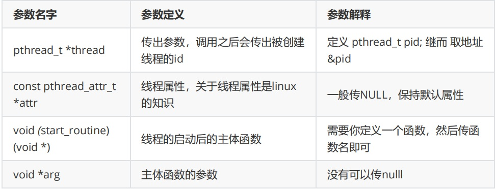
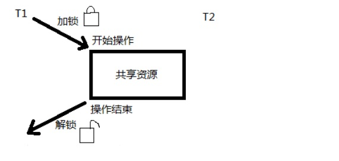

# 1.Java线程和操作系统线程关系

## 1.1 Java线程和操作系统线程

### 1.1.1 Java程序天生是多线程的

一个Java程序从 main()方法开始执行，然后按照既定的代码逻辑执行，看似没有其他线程参与，但实际上Java程序天生就是多线程程序，因为执行main()方法的是一个名称为main的线程。

```java
/**
 *类说明：只有一个main方法的程序
 */
public class OnlyMain {
    public static void main(String[] args) {
        //Java 虚拟机线程系统的管理接口,通过此类可以获取线程信息数组。
        ThreadMXBean threadMXBean = ManagementFactory.getThreadMXBean();
        // 不需要获取同步的monitor和synchronizer信息，仅仅获取线程和线程堆栈信息
        // 管理工厂类，可以获取线程管理类对象ThreadMXBean
        ThreadInfo[] threadInfos =
                threadMXBean.dumpAllThreads(false, false);
        // 遍历线程信息，仅打印线程ID和线程名称信息
        for (ThreadInfo threadInfo : threadInfos) {
            System.out.println("[" + threadInfo.getThreadId() + "] "
                    + threadInfo.getThreadName());
        }
        /**
         * 从打印结果可以看出，虽然面上只看到main线程，但是实际上Java程序中启动了很多线程。
         *         [6] Monitor Ctrl-Break //监控 Ctrl-Break 中断信号的 
         *          [5] Attach Listener //内存 dump，线程 dump，类信息统计，获取系统属性等 
         *          [4] Signal Dispatcher // 分发处理发送给 JVM 信号的线程
         *          [3] Finalizer // 调用对象 finalize 方法的线程 
         *          [2] Reference Handler//清除 Reference 的线程 
         *          [1] main //main 线程，用户程序入口
         */
    }
}
```
-------------

```sh

//打印结果
[6] Monitor Ctrl-Break
[5] Attach Listener
[4] Signal Dispatcher
[3] Finalizer
[2] Reference Handler
[1] main
```
### 1.1.2 linux上启动线程的代码

<font color='red'>**关于操作系统的线程 linux操作系统的线程控制原语**</font>

``` cpp
int pthread_create(pthread_t *thread, const pthread_attr_t *attr, void *(*start_routine) (void *), void *arg);
```

```sh
PTHREAD_CREATE(3)                                                                                        Linux Programmer's Manual                                                                                       PTHREAD_CREATE(3)

NAME
       pthread_create - create a new thread

SYNOPSIS
       #include <pthread.h>

       int pthread_create(pthread_t *thread, const pthread_attr_t *attr,
                          void *(*start_routine) (void *), void *arg);

       Compile and link with -pthread.

DESCRIPTION
       The pthread_create() function starts a new thread in the calling process.  The new thread starts execution by invoking start_routine(); arg is passed as the sole argument of start_routine().

       The new thread terminates in one of the following ways:

       * It calls pthread_exit(3), specifying an exit status value that is available to another thread in the same process that calls pthread_join(3).

       * It returns from start_routine().  This is equivalent to calling pthread_exit(3) with the value supplied in the return statement.

       * It is canceled (see pthread_cancel(3)).

       * Any of the threads in the process calls exit(3), or the main thread performs a return from main().  This causes the termination of all threads in the process.

       The  attr argument points to a pthread_attr_t structure whose contents are used at thread creation time to determine attributes for the new thread; this structure is initialized using pthread_attr_init(3) and related functions.
       If attr is NULL, then the thread is created with default attributes.

       Before returning, a successful call to pthread_create() stores the ID of the new thread in the buffer pointed to by thread; this identifier is used to refer to the thread in subsequent calls to other pthreads functions.

       The new thread inherits a copy of the creating thread's signal mask (pthread_sigmask(3)).  The set of pending signals for the new thread is empty (sigpending(2)).  The new thread does not inherit the creating thread's alternate
       signal stack (sigaltstack(2)).

       The new thread inherits the calling thread's floating-point environment (fenv(3)).

       The initial value of the new thread's CPU-time clock is 0 (see pthread_getcpuclockid(3)).

   Linux-specific details
       The new thread inherits copies of the calling thread's capability sets (see capabilities(7)) and CPU affinity mask (see sched_setaffinity(2)).

RETURN VALUE
       On success, pthread_create() returns 0; on error, it returns an error number, and the contents of *thread are undefined.

ERRORS
       EAGAIN Insufficient resources to create another thread.

       EAGAIN A  system-imposed  limit  on  the number of threads was encountered.  There are a number of limits that may trigger this error: the RLIMIT_NPROC soft resource limit (set via setrlimit(2)), which limits the number of pro‐
              cesses and threads for a real user ID, was reached; the kernel's system-wide limit on the number of processes and threads, /proc/sys/kernel/threads-max,  was  reached  (see  proc(5));  or  the  maximum  number  of  PIDs,
              /proc/sys/kernel/pid_max, was reached (see proc(5)).

       EINVAL Invalid settings in attr.

       EPERM  No permission to set the scheduling policy and parameters specified in attr.

```

根据man配置的信息可以得出pthread_create会创建一个线程，这个函数是linux系统的函数，可以用C或者C++直接调用，上面信息也告诉程序员这个函数在pthread.h， 这个函数有四个参数

<a data-fancybox title="pthread_create" href="./image/pthread_create.jpg"></a>

---------------------------

```cpp
//tqkThread.c
//头文件 
#include <pthread.h> 
#include <stdio.h> 
//定义一个变量，接受创建线程后的线程id 
pthread_t pid; //定义线程的主体函数
void* thread_entity(void* arg) {
    printf("i am new Thread! from c"); 
}
//main方法，程序入口，main和java的main一样会产生一个进程，继而产生一个main线程 
int main() {
    /*调用操作系统的函数创建线程，注意四个参数 */
    pthread_create(&pid,NULL,thread_entity,NULL); 
    //usleep是睡眠的意思，那么这里的睡眠是让谁睡眠呢？ 
    //为什么需要睡眠？如果不睡眠会出现什么情况 
    usleep(100); 
    printf("main\n"); 
}
```
```java
//编译命令 带上-pthread 库文件
gcc tqkThread.c  -pthread

//执行编译后的可执行文件 ./a.out

[root@VM-0-8-centos C]# ./a.out
i am new Thread! from cmain

```

## 1.2 在java中启动线程的代码

### 1.2.1 java线程和pthread_create关系

java线程和上面我们通过linux的pthread_create函数启动的线程有什么关系呢？  
只能去可以查看start()的源码了,看看java的start()到底干了什么事才能对比出来可以看到这个方法最核心的就是调用了一个start0方法，而start0方法又是一个native方法，故而如果要
搞明白start0我们需要查看Hotspot的源码， 我们大胆猜想Java线程执行过程：**star----->start0------>ptherad_create**
```java
public class Example4Start { 
    public static void main(String[] args) {
         Thread thread = new Thread(){
            @Override public void run() {
                System.out.println("i am new Thread! from java ");
            } 
        };
        thread.start(); 
    } 
}

/**--------------------start方法的源码的部分----------------**/
// start0()是native方法，这是java虚拟机调用了底层c库实现的
  public synchronized void start() {
        /**
         * This method is not invoked for the main method thread or "system"
         * group threads created/set up by the VM. Any new functionality added
         * to this method in the future may have to also be added to the VM.
         *
         * A zero status value corresponds to state "NEW".
         */
        if (threadStatus != 0)
            throw new IllegalThreadStateException();

        /* Notify the group that this thread is about to be started
         * so that it can be added to the group's list of threads
         * and the group's unstarted count can be decremented. */
        group.add(this);

        boolean started = false;
        try {
            start0();
            started = true;
        } finally {
            try {
                if (!started) {
                    group.threadStartFailed(this);
                }
            } catch (Throwable ignore) {
                /* do nothing. If start0 threw a Throwable then
                  it will be passed up the call stack */
            }
        }
    }
    private native void start0();
```
### 1.2.2 native关键字
:::warning <font color='red'>native关键字</font>
**native主要用于方法上**    
1. 一个native方法就是一个Java调用<font color='red'>**非Java代码的接口**</font>。一个native方法是指该方法的实现由非Java语言实现，比如用C或C++实现。
2. 在定义一个native方法时，并不提供实现体（比较像定义一个Java Interface），因为其实现体是由非Java语言在外面实现的主要是因为JAVA无法对操作系统底层进行操作，但是可以通过<font color='red'><strong>JNI(java native interface)</strong></font>调用其他语言来实现底层的访问。
:::


## 1.3 手写Java线程类操动操作系统线程

<font color='red'><strong>在没有openjdk的情况下，我们做一个大胆的猜测，java级别的线程其实就是操作系统级别的线程，什么意思呢？说白了我们大胆猜想 star----->start0------------>ptherad_create</strong></font>>

### 1.3.1 本地方法的代码编写

```cpp
//thread.c
#include <pthread.h> 
#include <stdio.h> 
//定义变量接受线程id 
pthread_t pid; 
//线程的主体方法相当于 java当中的run 
void* thread_entity(void* arg) { 
    //子线程死循环 
    while(1){ 
        //睡眠100毫秒 
        usleep(100); 
        //打印 
        printf("I am new Thread\n"); 
    } 
}
//c语言的主方法入口方法，相当于java的main 
int main() { 
    //调用linux的系统的函数创建一个线程 
    pthread_create(&pid,NULL,thread_entity,NULL); 
    //主线程死循环 
    while(1){ 
        //睡眠100毫秒 
        usleep(100); 
        //打印 
        printf("I am main\n"); 
    }
    return 0;
}
```

:::tip 在linux上编译、运行上述C程序
编译这个程序(-o 标识指定编译后的文件名，也可以不指定，默认为a.out)
```shell
gcc thread.c -o thread.out -pthread
```
运行这个程序
```bash
./thread.out
```
运行结果
```bash
I am main
I am new Thread
I am main
I am new Thread
I am main
I am new Thread
I am main
I am new Thread
```
:::


### 1.3.2 java利用JNI调用本地方法 
```java
public class EnjoyThread { 
    //装载库，保证JVM在启动的时候就会装载，故而一般是也给static 
    static { 
        System.loadLibrary( "EnjoyThreadNative" ); 
    }
    public static void main(String[] args) { 
        EnjoyThread enjoyThread =new EnjoyThread();
        enjoyThread.start0(); 
    }
    private native void start0(); 
}
```


#### 1.3.2.1 编译java文件最好是在包的目录下面运行javac命令
```bash
javac EnjoyThread.java
```
生成EnjoyThread.class的文件
#### 1.3.2.2 利用javac -h . xx.java命令 来编译一个头文件
```bash
javac -h . EnjoyThred.java
```
#### 1.3.2.3 创建一个新的c文件

```cpp
//thread.c
#include <pthread.h>
#include <stdio.h>
//JNI头文件
#include <jni.h>

//定义变量接受线程id
pthread_t pid;
//线程的主体方法相当于 java当中的run
void* thread_entity(void* arg) {
    //子线程死循环
    while(1){
        //睡眠100毫秒
        usleep(100);
        //打印
        printf("I am new Thread\n");
    }
}
//Java_EnjoyThread_start0 查看 EnjoyThred.h获取； 后边两个参数固定
JNICALL Java_EnjoyThread_start0(JNIEnv *env, jobject c1) {
    //调用linux的系统的函数创建一个线程
    pthread_create(&pid,NULL,thread_entity,NULL);
    //主线程死循环
    while(1){
        //睡眠100毫秒
        usleep(100);
        //打印
        printf("I am main\n");
    }
    return 0;
}
```

#### 1.3.2.4 编译这个threadNew.c生成动态库文件，这样才能被java程序加载到

```bash 
gcc -fPIC -I /usr/java/jdk1.8.0_211-amd64/include -I /usr/java/jdk1.8.0_211-amd64/include/linux -shared -o libxxx.so threadNew.c
//注意这个libxxx; lib是固定的xxx可以随意，但是得和你的java代码中的System.loadLibrary( "xxx" );对应
gcc -fPIC -I /usr/java/jdk1.8.0_211-amd64/include -I /usr/java/jdk1.8.0_211-amd64/include/linux -shared -o libEnjoyThreadNative.so threadNew.c
```
#### 1.3.2.5 把so文件所在的目录添加到系统变量，不然java还是load不到

```bash
export LD_LIBRARY_PATH=$LD_LIBRARY_PATH:/root/Learn/C
最后运行我们前面写好的那个java文件(记得到包的外面去运行java命令)
java EnjoyThread
```


<!-- # 1.什么是线程安全问题
# 2.如何解决线程安全的问题
# 3.synchronized锁的基本用法
# 4.synchronized死锁问题
# 5.springmvc 接口中使用 如何保证线程安全问题
# 6.多线程之间如何实现通讯
# 7.wait/notify/notifyAll基本用法
# 8.多线程通讯实现生产者与消费者
# 9.Join与sleep之间的区别
# 10.Join底层是如何执行的
# 11.三个线程 T1，T2，T3，怎么确保它们按顺序执行？
# 12.线程间通讯
# 13.volatile关键字是否能保证线程安全 -->

## 1.4 操作系统级别的锁

操作系统级别同步方法的方式有三种：<font color='red'><strong>互斥锁mutex（也称之为互斥量）、自旋锁spinlock、信号量</strong></font> 

<font color='red'><strong>信号量又称为信号灯</strong></font> ，它是用来协调不同进程间的数据对象的，而最主要的应用是共享内存方式的进程间通信。本质上信号量是一个计数器，它用来记录对某个资源（如共享内存）的存取状况   
一般说来为了获得共享资源，进程需要执行下列操作：  
（1） 测试控制该资源的信号量。  
（2） 若此信号量的值为正，则允许进行使用该资源。进程将信号量减1。  
（3） 若此信号量为0，则该资源目前不可用，进程进入睡眠状态，直至信号量值大于0，进程被唤醒，转入步骤（1）。  
（4） 当进程不再使用一个信号量控制的资源时，信号量值加1。如果此时有进程正在睡眠等待此信号量，则唤醒此进程。  

---------------------------------

### 1.4.1 互斥锁mutex
Linux中提供一把<font color='red'><strong>互斥锁mutex（也称之为互斥量）</strong></font> 
每个线程在对资源操作前都尝试先加锁,成功加锁才能操作，操作结束解锁。但通过“锁”就将资源的访问变成互斥操作，而后与时间有关的错误也不会再产生了  

<a data-fancybox title="mutex" href="./image/mutex.jpg"></a>

应注意：同一时刻，只能有一个线程持有该锁。

**当T1线程对某个全局变量加锁访问，T2在访问前尝试加锁，拿不到锁，B阻塞。如果有T3线程不去加锁直接访问该全局变量，依然能够访问但会出现数据混乱**

所以互斥锁实质上是操作系统提供的一把“建议锁”（又称“协同锁”），建议程序中有多线程访问共享资源的时候使用该机制。但并没有强制限定。
因此即使有了mutex，如果有线程不按规则来访问数据(不加锁)，依然会造成数据混乱

#### 1.4.1.1 mutex主要应用函数
:::tip 主要应用函数
1. <font color='blue'><strong>pthread_mutex_init()</strong></font>函数      功能：初始化一个互斥锁
2. <font color='blue'><strong>pthread_mutex_destroy()</strong></font>函数   功能：销毁一个互斥锁
3. <font color='red'><strong>pthread_mutex_lock()</strong></font>函数       功能：加锁
4. <font color='blue'><strong>pthread_mutex_trylock()</strong></font>函数   功能：尝试加锁
5. <font color='red'><strong> pthread_mutex_unlock()</strong></font>函数    功能：解锁
以上5个函数的返回值都是：成功返回0， 失败返回错误号  

6. <font color='red'><strong>pthread_mutex_t</strong></font>类型，其本质是一个结构体。为简化理解应用时可忽略其实现细节，简单当成整数看待。
如：  
pthread_mutex_t   mutex; 变量mutex只有两种取值1、0
:::

#### 1.4.1.2 pthread_mutex_t加锁操作

```cpp
#include <stdio.h>
#include <stdlib.h>
#include <pthread.h>
 
int sharei = 0;
//函数声明
void increase_num(void);
// add mutex
pthread_mutex_t mutex = PTHREAD_MUTEX_INITIALIZER;
 
int main()
{
  int ret;
  pthread_t thread1,thread2,thread3;
  ret = pthread_create(&thread1,NULL,(void *)&increase_num,NULL);
  ret = pthread_create(&thread2,NULL,(void *)&increase_num,NULL);
  ret = pthread_create(&thread3,NULL,(void *)&increase_num,NULL);
  //相当于java中join方法
  pthread_join(thread1,NULL);
  pthread_join(thread2,NULL);
  pthread_join(thread3,NULL);
 
  printf("sharei = %d\n",sharei);
 
  return 0;
}
//run
 
void increase_num(void)
{
  long i,tmp;
  for(i =0;i<=9999;++i)
  {
	 
    //上锁
    pthread_mutex_lock(&mutex);
	//为什么不加锁会小于30000
	//比如当t1 执行到tmp=sharei的时候假设 sharei这个时候=0，那么tmp也等于0
	//然后tmp=tmp+1;结果tmp=1（t1）;这个时候如果t2进入了
	//t2获取的sharei=0；然后重复t1的动作 tmp=1（t2）
	//t2 sharei = tmp;  sharei = 1;
	//然后CPU切回t1 执行 sharei = tmp;  sharei = 1;
	//结果两个线程执行了两遍但是结果还是sharei = 1;（本来要等于2的）
    tmp=sharei;
    tmp=tmp+1;
    
    sharei = tmp;
	//解锁
    pthread_mutex_unlock(&mutex);
    
  }
}
```
------------

执行结果  

```sh
[root@TXYUN-NO3 ex1]# gcc mutextest.c -o mut -pthread
[root@TXYUN-NO3 ex1]# ls -lrt
total 20
-rw-r--r-- 1 root root  1290 Aug 12 12:23 mutextest.c
-rwxr-xr-x 1 root root 13096 Aug 12 12:26 mut
[root@TXYUN-NO3 ex1]# ./mut
sharei = 30000

```


#### 1.4.1.3 不加锁操作

**线程1进来之后，将要进行sharei++（包含多条操作指令）时，cpu上下文切换到 线程2，线程2进行了sharei++后，有切换会线程1，所以会造成sharei<=3000**

```cpp

#include <stdio.h>
#include <stdlib.h>
#include <pthread.h>

int sharei = 0;
//函数声明
void increase_num(void);
// add mutex
pthread_mutex_t mutex = PTHREAD_MUTEX_INITIALIZER;

int main()
{
  int ret;
  pthread_t thread1,thread2,thread3;
  ret = pthread_create(&thread1,NULL,(void *)&increase_num,NULL);
  ret = pthread_create(&thread2,NULL,(void *)&increase_num,NULL);
  ret = pthread_create(&thread3,NULL,(void *)&increase_num,NULL);
  //相当于java中join方法
  pthread_join(thread1,NULL);
  pthread_join(thread2,NULL);
  pthread_join(thread3,NULL);

  printf("sharei = %d\n",sharei);

  return 0;
}
//run

void increase_num(void)
{
  long i,tmp;
  for(i =0;i<=9999;++i)
  {

    //上锁
    //pthread_mutex_lock(&mutex);
    /*
    * 线程1进来之后，将要进行sharei++（包含多条操作指令）时，cpu上下文切换到 线程2，线程2进行了sharei++后，有切换会线程1，所以会造成sharei<=3000 
    */
    sharei++;
    // tmp=sharei;
    // tmp=tmp+1;
    // sharei = tmp;
    //解锁
    //pthread_mutex_unlock(&mutex);

  }
}

```
```sh
[root@TXYUN-NO1 Learn]# ./unmut 
sharei = 30000
[root@TXYUN-NO1 Learn]# ./unmut 
sharei = 28499
```
### 1.4.4 spinlock自旋锁

```cpp
#include <stdio.h>
#include <stdlib.h>
#include <pthread.h>
 
int sharei = 0;
void increase_num(void);
//定义一把自旋锁
pthread_spinlock_t a_lock;
 
int main()
{
	//初始化自旋锁
  pthread_spin_init(&a_lock, 0);
  int ret;
  pthread_t thread1,thread2,thread3;
  ret = pthread_create(&thread1,NULL,(void *)&increase_num,NULL);
  ret = pthread_create(&thread2,NULL,(void *)&increase_num,NULL);
  ret = pthread_create(&thread3,NULL,(void *)&increase_num,NULL);
 
  pthread_join(thread1,NULL);
  pthread_join(thread2,NULL);
  pthread_join(thread3,NULL);
 
  printf("sharei = %d\n",sharei);
 
  return 0;
}
 
void increase_num(void)
{
  long i,tmp;
  for(i =0;i<=9999;++i)
  {
    // lock spin 自旋
    pthread_spin_lock(&a_lock);
    tmp=sharei;
    tmp=tmp+1;
    
    sharei = tmp;
    pthread_spin_unlock(&a_lock);
    
  }
}
```
```sh
[root@TXYUN-NO3 ex1]# vi spinlocktest.c
[root@TXYUN-NO3 ex1]# gcc spinlocktest.c -o spinlock -pthread
[root@TXYUN-NO3 ex1]# ./spinlock 
sharei = 30000
```

## 1.5 手写一个java锁

1.6之前，synchronized这个重量级锁其性能一直都是较为低下，虽然在1.6后，进行大量的锁优化策略,但是与Lock相比synchronized还是存在一些缺陷的：虽然synchronized提供了便捷性的隐式获取锁释放锁机制（基于JVM机制），但是它却缺少了获取锁与释放锁的可操作性，可中断、超时获取锁，且它为独占式在高并发场景下性能大打折扣。

### 1.5.1 基于Unsafe自旋实现同步

```java
volatile int status=0;//标识---是否有线程在同步块-----是否有线程上锁成功
void lock(){
	while(!compareAndSet(0,1)){
	}
	//lock
}
void unlock(){
	status=0;
}
boolean compareAndSet(int except,int newValue){
	//cas操作,修改status成功则返回true
}
```
:::tip 缺点
耗费cpu资源。没有竞争到锁的线程会一直占用cpu资源进行cas操作，假如一个线程获得锁后要花费Ns处理业务逻辑，那另外一个线程就会白白的花费Ns的cpu资源
解决思路：让得不到锁的线程让出CPU
:::
### 1.5.2 yield+自旋实现同步

```java
volatile int status=0;
void lock(){
	while(!compareAndSet(0,1)){
     yield();//自己实现
	}
	//lock

}
void unlock(){
	status=0;
}
```
:::tip 缺点
要解决自旋锁的性能问题必须让竞争锁失败的线程不空转,而是在获取不到锁的时候能把cpu资源给让出来，yield()方法就能让出cpu资源，当线程竞争锁失败时，会调用yield方法让出cpu。
自旋+yield的方式并没有完全解决问题，当系统只有两个线程竞争锁时，yield是有效的。需要注意的是该方法只是当前让出cpu，有可能操作系统下次还是选择运行该线程，比如里面有2000个线程，想想会有什么问题？
:::

### 1.5.3 sleep+自旋方式实现同步
```java
volatile int status=0;
void lock(){
	while(!compareAndSet(0,1)){
		sleep(10);
	}
	//lock

}
void unlock(){
	status=0;
}
```
:::tip 缺点
sleep的时间为什么是10？怎么控制呢？很多时候就算你是调用者本身其实你也不知道这个时间是多少
:::

### 1.5.4 park+自旋方式实现同步

```java
volatile int status=0;
Queue parkQueue;//集合 数组  list

void lock(){
	while(!compareAndSet(0,1)){
		//
		park();
	}
	//lock    10分钟
   。。。。。。
   unlock()
}

void unlock(){
	lock_notify();
}

void park(){
	//将当期线程加入到等待队列
	parkQueue.add(currentThread);
	//将当期线程释放cpu  阻塞
	releaseCpu();
}
void lock_notify(){
	//得到要唤醒的线程头部线程
	Thread t=parkQueue.header();
	//唤醒等待线程
	unpark(t);
}
```
### 1.5.5 完整代码

```java
package com.tqk.ex1;

import sun.misc.Unsafe;

import java.lang.reflect.Field;

/**
 *
 * @author Administrator
 */
public class CASLock {

    //标识---是否有线程在同步块-----是否有线程上锁成功

    private volatile int status=0;
    //获取Unsafe对象，只能这么获取，Unsafe这个类比较难有兴趣同学可以自己研究研究
    //窃以为Unsafe是java里面最牛逼的一个对象，没有之一

    private static final Unsafe unsafe = getUnsafe();

    //定义一个变量来记录 volatile int status的地址
    //因为CAS需要的是一个地址,于是就定义这个变量来标识status在内存中的地址

    private static long valueOffset = 0;

    /**
     * 初始化的获取status在内置的偏移量
     * 说白了就是status在内存中的地址
     * 方便后面对他进行CAS操作
     */
    static {
        try {
            //初始化的获取status在内置的偏移量,说白了就是status在内存中的地址
            valueOffset = unsafe.objectFieldOffset(CASLock.class.getDeclaredField("status"));
        }
        catch (Exception ex)
        {
            throw new Error(ex);
        }
    }


    /**
     * 加锁方法
     */
    public void lock(){
        /**
         * 判断status是否=0；如果等于0则改变成为1
         * 而判断赋值这两个操作可以通过一个叫做CAS的技术来完成
         * 通过cas去改变status的值，如果是0就改成1
         * 思考一下为什么要用CAS
         * 关于CAS如果你不了解可以先放放，后面我们讲
         * 目前就认为CAS用来赋值的和 = 的效果一样
         */
        while(!compareAndSet(0,1)){
            //加锁失败会进入到这里空转
        }

       // 如果加锁成功则直接正常返回
    }

    //为什么unlock不需要CAS呢？可以自己考虑一下，如果不懂可以讨论
    public void unlock(){
        status=0;
    }

    boolean compareAndSet(int except,int newValue){
        //如果 valueOffset或者 status这个变量 = except 那么改成 newValue
      return unsafe.compareAndSwapInt(this,valueOffset,except,newValue);
    }


    /**
     * 获取Unsafe对象
     * @return
     */
    public static Unsafe getUnsafe() {
        try {
            Field field = Unsafe.class.getDeclaredField("theUnsafe");
            field.setAccessible(true);
            return (Unsafe)field.get(null);

        } catch (Exception e) {
        }
        return null;
    }

}

```