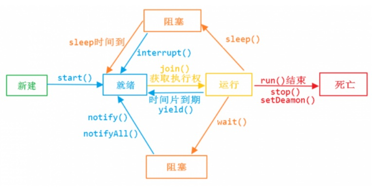

# 2. Java线程基础扩充

## 2.3 Java 里的线程

<a data-fancybox title="多线程" href="./image/javathread.jpg"></a>

### 2.3.1 start和run方法
Thread类是Java里对线程概念的抽象，可以这样理解：我们通过new Thread() 其实只是 new 出一个 Thread 的实例，还没有操作系统中真正的线程挂起钩来。 
只有执行了<font color='red'><strong>start()</strong></font>方法后，才实现了真正意义上的启动线程。 start()方法让一个线程进入就绪队列等待分配 cpu（**cpu时间片轮转机制**），分到cpu后才调用实现的<font color='red'><strong>run()</strong></font>方法。

start()方法不能重复调用，如果重复调用会抛出异常。 而 run 方法是业务逻辑实现的地方，本质上和任意一个类的任意一个成员方法并没有任何区别，可以重复执行，也可以被单独调用。

### 2.3.2 yield()方法

使当前线程让出CPU占有权，但让出的时间是不可设定的，也不会释放锁资源。
注意：并不是每个线程都需要这个锁的，而且执行 yield( )的线 程不一定就会持有锁，我们完全可以在释放锁后再调用 yield 方法。 所有执行 yield()的线程有可能在进入到就绪状态后会被操作系统再次选中马上又被执行。

自旋锁时可以使用yield()方法，释放cpu资源

### 2.3.3 join()方法

把指定的线程加入到当前线程，可以将两个交替执行的线程合并为顺序执行。 比如在线程B中调用了线程A的Join()方法，直到线程A执行完毕后，才会继续执行线程 B。

```java
/**
 *类说明：演示Join（）方法的使用
 */
public class UseJoin {
	
    static class Goddess implements Runnable {
        private Thread thread;

        public Goddess(Thread thread) {
            this.thread = thread;
        }

        public Goddess() {
        }

        @Override
        public void run() {
            System.out.println("Goddess开始排队打饭.....");
            try {
                if(thread!=null) {
                    thread.join();
                }
            } catch (InterruptedException e) {
            }
            SleepTools.second(2);//休眠2秒
            System.out.println(Thread.currentThread().getName()
                    + " Goddess打饭完成.");
        }
    }

    static class GoddessBoyfriend implements Runnable {

        @Override
        public void run() {
            SleepTools.second(2);//休眠2秒
            System.out.println("GoddessBoyfriend开始排队打饭.....");
            System.out.println(Thread.currentThread().getName()
                    + " GoddessBoyfriend打饭完成.");
        }
    }

    public static void main(String[] args) throws Exception {

        Thread lison = Thread.currentThread();
        GoddessBoyfriend goddessBoyfriend = new GoddessBoyfriend();
        Thread gbf = new Thread(goddessBoyfriend);
        Goddess goddess = new Goddess(gbf);
//        Goddess goddess = new Goddess();
        Thread g = new Thread(goddess);
        g.start();
        gbf.start();
        System.out.println("lison开始排队打饭.....");
        g.join();
        SleepTools.second(2);//让主线程休眠2秒
        System.out.println(Thread.currentThread().getName() + " lison打饭完成.");
    }
}
```

```bash
lison开始排队打饭.....
Goddess开始排队打饭.....
GoddessBoyfriend开始排队打饭.....
Thread-0 GoddessBoyfriend打饭完成.
Thread-1 Goddess打饭完成.
main lison打饭完成.

Process finished with exit code 0
```
### 2.3.4 中断方法
安全的中止则是其他线程通过调用某个线程 A 的<font color='red'><strong>interrupt()</strong></font>方法对其进行中断操作, 中断好比其他线程对该线程打了个招呼，“A，你要中断了”，不代表 线程 A 会立即停止自己的工作，同样的 A 线程完全可以不理会这种中断请求。 线程通过检查自身的中断标志位是否被置为<font color='red'><strong>true</strong></font>来进行响应， 线程通过方法<font color='red'><strong>isInterrupted()</strong></font>来进行判断是否被中断，也可以调用静态方法<font color='red'><strong>Thread.interrupted()来进行判断当前线程是否被中断，不过 Thread.interrupted()</strong></font> 会同时将中断标识位改写为**false**。 

**示例**
```java
package com.tqk.ex1.safeend;

/**
 *类说明：如何安全中断线程
 */
public class EndThread {
	
	private static class UseThread extends Thread{

		public UseThread(String name) {
			super(name);
		}

		@Override
		public void run() {
			String threadName = Thread.currentThread().getName();
			System.out.println(threadName+" interrrupt STRAT flag ="+isInterrupted());
//			while(!Thread.currentThread().isInterrupted()){
			while(!isInterrupted()){
			/*Thread.interrupted()判断之后，会将true再改为false*/
//			while(!Thread.interrupted()){
//			/*endThread.interrupt()将标志位置为true后，业务线程不做判断的话线程还会继续执行（协助式，不是强制式）*/
//			while(true){  
				System.out.println(threadName+" is running");
				System.out.println(threadName+"inner interrrupt RUNNING flag ="
						+isInterrupted());
			}
			System.out.println(threadName+" interrrupt END flag ="+isInterrupted());
			System.out.println(threadName+" interrrupt END flag ="+Thread.interrupted());
			System.out.println(threadName+" interrrupt END flag ="+isInterrupted());
		}
	}

	public static void main(String[] args) throws InterruptedException {
		Thread endThread = new UseThread("endThread");
		endThread.start();
		Thread.sleep(20);
		endThread.interrupt();//中断线程的标识位修改为true
	}

}

```

如果<font color='red'><strong>一个线程处于了阻塞状态（如线程调用了 thread.sleep、thread.join、 thread.wait 等），则在线程在检查中断标示时如果发现中断标示为 true，则会在这些阻塞方法调用处抛出 InterruptedException 异常</strong></font>，

并且在抛出异常后会立即将线程的中断标示位清除，即重新设置为 false。 不建议自定义一个取消标志位来中止线程的运行。因为 run 方法里有阻塞调用时会无法很快检测到取消标志，线程必须从阻塞调用返回后，才会检查这个取消标志。

**示例**
```java
package com.tqk.ex1.safeend;

/**
 *类说明：阻塞方法中抛出InterruptedException异常后，如果需要继续中断，需要手动再中断一次
 */
public class HasInterrputException {
	
	private static class UseThread extends Thread{
		
		public UseThread(String name) {
			super(name);
		}
		
		@Override
		public void run() {
			while(!isInterrupted()) {
				try {
					Thread.sleep(100);
				} catch (InterruptedException e) {
					System.out.println(Thread.currentThread().getName()
							+" in InterruptedException interrupt flag is "
							+isInterrupted());
					//资源释放  如果不释放，当前线程不会中断
					interrupt();
					e.printStackTrace();
				}
				System.out.println(Thread.currentThread().getName()
						+ " I am extends Thread.");
			}
			System.out.println(Thread.currentThread().getName()
					+" interrupt flag is "+isInterrupted());
		}
	}

	public static void main(String[] args) throws InterruptedException {
		Thread endThread = new UseThread("HasInterrputEx");
		endThread.start();
		Thread.sleep(500);
		endThread.interrupt();
		

	}

}
```

```sh
HasInterrputEx I am extends Thread.
HasInterrputEx I am extends Thread.
HasInterrputEx I am extends Thread.
HasInterrputEx I am extends Thread.
HasInterrputEx I am extends Thread.
HasInterrputEx in InterruptedException interrupt flag is false
HasInterrputEx I am extends Thread.
HasInterrputEx interrupt flag is true
java.lang.InterruptedException: sleep interrupted
	at java.lang.Thread.sleep(Native Method)
	at com.tqk.ex1.safeend.HasInterrputException$UseThread.run(HasInterrputException.java:18)

Process finished with exit code 0
```

这种情况下使用中断会更好   
一、一般的阻塞方法，如 sleep 等本身就支持中断的检查，   
二、检查中断位的状态和检查取消标志位没什么区别，用中断位的状态还可 以避免声明取消标志位，减少资源的消耗。   


<font color='red'><strong>注意：处于死锁状态的线程无法被中断</strong></font>

### 2.3.5 终止方法

线程自然终止 要么是 run 执行完成了，要么是抛出了一个未处理的异常导致线程提前结束。

stop 暂停、恢复和停止操作对应在线程 Thread 的 API 就是 suspend()、resume() 和 stop()。但是这些 API 是过期的，也就是不建议使用的。不建议使用的原因主 要有：以 suspend()方法为例，在调用后，线程不会释放已经占有的资源（比如 锁），而是占有着资源进入睡眠状态，这样容易引发死锁问题。同样，stop()方 法在终结一个线程时不会保证线程的资源正常释放，通常是没有给予线程完成资 源释放工作的机会，因此会导致程序可能工作在不确定状态下。正因为<font color='red'><strong>suspend()、 resume()和 stop()</strong></font>方法带来的副作用，这些方法才被标注为不建议使用的过期方法。

### 2.3.6 线程的优先级

在 Java 线程中，通过一个整型成员变量 priority 来控制优先级，优先级的范 围从 1~10，在线程构建的时候可以通过 setPriority(int)方法来修改优先级，默认优先级是5，优先级高的线程分配时间片的数量要多于优先级低的线程。
设置线程优先级时，针对频繁阻塞（休眠或者 I/O 操作）的线程需要设置较高优先级，而偏重计算（需要较多 CPU 时间或者偏运算）的线程则设置较低的 优先级，确保处理器不会被独占。在不同的 JVM 以及操作系统上，线程规划会存在差异，有些操作系统甚至会忽略对线程优先级的设定。

### 2.3.7 线程调度

线程调度是指系统为线程分配 CPU 使用权的过程，主要调度方式有两种：   
协同式线程调度(Cooperative Threads-Scheduling)   
抢占式线程调度(Preemptive Threads-Scheduling)   

使用协同式线程调度的多线程系统，线程执行的时间由线程本身来控制，线程把自己的工作执行完之后，要主动通知系统切换到另外一个线程上。使用协同式线程调度的最大好处是实现简单，由于线程要把自己的事情做完后才会通知系统进行线程切换，所以没有线程同步的问题，但是坏处也很明显，如果一个线程出了问题，则程序就会一直阻塞。 

使用抢占式线程调度的多线程系统，每个线程执行的时间以及是否切换都由系统决定。在这种情况下线程的执行时间不可控，所以不会有「一个线程导致整个进程阻塞」的问题出现。 在 Java 中，Thread.yield()可以让出 CPU 执行时间，但是对于获取，线程本身是没有办法的。对于获取 CPU 执行时间，线程唯一可以使用的手段是设置线程 优先级，Java 设置了 10 个级别的程序优先级，当两个线程同时处于 Ready 状态 时，优先级越高的线程越容易被系统选择执行。 Java 中的线程优先级是通过映射到操作系统的原生线程上实现的，所以线程 的调度最终取决于操作系统，操作系统中线程的优先级有时并不能和 Java 中的 一一对应，所以 Java 优先级并不是特别靠谱。

所以在面试中如果遇到相关的问题，可以这样回答：  
Java 中的线程是通过映 射到操作系统的原生线程上实现的，所以线程的调度最终取决于操作系统，而操作系统级别，OS 是以抢占式调度线程，我们可以认为线程是抢占式的。Java 虚 拟机采用抢占式调度模型，是指优先让可运行池中优先级高的线程占用 CPU，如 果可运行池中的线程优先级相同，那么就随机选择一个线程，使其占用 CPU。处 于运行状态的线程会一直运行，直至它不得不放弃 CPU。而且操作系统中线程的 优先级有时并不能和 Java 中的一一对应，所以 Java 优先级并不是特别靠谱。但 是在 Java 中，因为 Java 没有提供安全的抢占式方法来停止线程，要安全的停止 线程只能以协作式的方式。

### 2.3.8 守护线程

Daemon（守护）线程是一种支持型线程，因为它主要被用作程序中后台调度以及支持性工作。这意味着，当一个 Java 虚拟机中不存在非 Daemon 线程的 时候，Java 虚拟机将会退出。可以通过调用 Thread.setDaemon(true)将线程设置 为 Daemon 线程。我们一般用不上，比如垃圾回收线程就是 Daemon 线程。  

Daemon 线程被用作完成支持性工作，但是**在 Java 虚拟机退出时 Daemon 线程中的 finally 块并不一定会执行**。在构建 Daemon 线程时，不能依靠 finally 块中 的内容来确保执行关闭或清理资源的逻辑。

```java
package com.tqk.ex1;

import java.util.concurrent.ExecutionException;

/**
 *
 *类说明：守护线程的使用
 */
public class DaemonThread {
	private static class UseThread extends Thread{
		@Override
		public void run() {
			try {
				while (!isInterrupted()) {
					System.out.println(Thread.currentThread().getName() 
							+ " I am extends Thread.");
				}
				System.out.println(Thread.currentThread().getName() 
						+ " interrupt flag is " + isInterrupted());
			} finally {
				//守护线程中finally不一定起作用
				System.out.println(" .............finally");
			}
		}
	}
	
	public static void main(String[] args) 
			throws InterruptedException, ExecutionException {
		UseThread useThread = new UseThread();
		useThread.setDaemon(true);//设置成守护线程
		useThread.start();
		Thread.sleep(5);
		useThread.interrupt();
	}
}

```